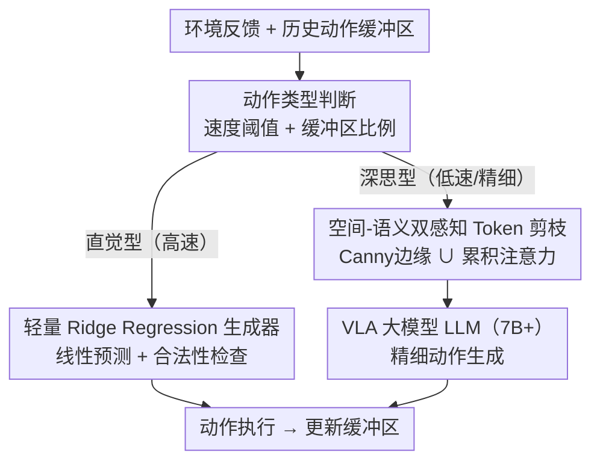

# SP-VLA: A Joint Model Scheduling and Token Pruning Approach for VLA Model Acceleration

**会议**: ICLR 2026  
**OpenReview**: [https://openreview.net/forum?id=RwdGIIjPlC](https://openreview.net/forum?id=RwdGIIjPlC)  
**代码**: https://github.com/ChildTang/SP-VLA  
**领域**: VLM效率 / 具身智能 / 模型加速  
**关键词**: VLA加速、模型调度、Token剪枝、具身推理、时序冗余

## 一句话总结
SP-VLA 将 VLA 动作序列分为"深思型"与"直觉型"两类，深思型调用大模型、直觉型用轻量 Ridge Regression 近似，同时对 token 做空间-语义双感知剪枝，在 LIBERO 实现 1.5× 无损加速、SimplerEnv 实现 2.4× 加速。

## 研究背景与动机

**领域现状**：VLA（Vision-Language-Action）模型将视觉感知、语言理解与动作生成统一建模，已成为机器人操控和具身智能的核心范式。DeepMind RT 系列、OpenVLA、CogACT、π0 等代表性工作证明了 VLA 在多样机器人任务上的强大泛化能力。但主流 VLA 模型体量庞大——Google RT-X 系列超过 550 亿参数，OpenVLA 这样的"轻量"选项也达 70 亿——推理延迟严重制约了实时控制场景（机械臂操控、自主导航、工业装配）的落地，这些任务往往要求控制频率达到 10-30 Hz。

**现有痛点**：已有 VLA 加速方法（量化、缓存、早退机制等）几乎全部沿用面向 VLM 的压缩思路，把 VLA 当作"会输出动作的 VLM"来优化。这类方法只关注单步计算冗余，忽视了 VLA 运行在序贯决策环境中的本质特征：一方面，连续动作帧之间存在大量**时序冗余**——相邻步骤的动作往往高度相似；另一方面，每一帧视觉输入中也存在大量**空间冗余**——大片背景 token 与当前操作无关。

**核心矛盾**：VLA 加速面临两个正交维度的挑战同时缺乏专门应对：①时序维度——如何利用历史动作信息减少重复调用大模型？②空间维度——如何在保留空间位置感知的前提下剪掉冗余视觉 token？现有方法对这两点均无针对性设计。

**本文目标**：同时消除 VLA 推理的时序冗余和空间冗余，实现无训练、即插即用的端到端加速。

**切入角度**：作者从人类运动模式获得灵感——人类处理复杂任务时，只在关键节点（抓取、转向）进行深度思考，其余过渡动作依赖"直觉"执行（这一现象在认知科学中有充分研究）。通过分析 50 次抓放实验的机械臂速度曲线，作者观察到 VLA 模型生成的动作序列同样呈现四阶段规律（目标对准 → 抓取 → 移动 → 放置），且高速过渡阶段动作可用线性函数近似，而低速精细操控阶段才需要大模型的复杂推理能力。

**核心 idea**：把 VLA 动作序列按速度分类为深思/直觉两类，前者走大模型、后者走轻量 Ridge Regression 代理；进入大模型前再用空间-语义双感知剪枝削减 token 数量，两者联合实现频率自适应加速。

## 方法详解

### 整体框架

SP-VLA 在每个时步先判断当前动作类型，再决定调用哪条推理路径。整体上分为两个并行机制：左侧的**动作感知模型调度**处理时序冗余，右侧的**空间-语义双感知 Token 剪枝**处理空间冗余。直觉型动作直接由轻量生成器输出，跳过大模型；深思型动作进入 VLA，但在送入 LLM 主干前先经过 token 剪枝。

### 关键设计

**1. 动作感知模型调度：用速度信号区分深思与直觉**

现有 VLA 方法对每一步动作一律调用大模型，但大量时步（特别是机械臂高速过渡阶段）的动作在数值上可用线性函数近似，没有必要耗费 7B 参数的推理。SP-VLA 定义速度阈值 $v_{min}$ 和 $v_{max}$：当末端执行器所有分量 $|a_i| > v_{min}$ 时判定为直觉动作，并在满足动作缓冲区中 VLA 生成比例 $N_G/N_A > \tau$ 时触发轻量生成器。触发条件形式化为：
$$\text{LWM} = \begin{cases} 1 & \text{if } a_{t-1} \in [v_{min}, v_{max}] \text{ 且 } N_G/N_A > \tau \\ 0 & \text{otherwise} \end{cases}$$
直觉动作由 Ridge Regression 在动作缓冲区 $S_A = \{a_{t-n}, \ldots, a_{t-1}\}$ 上拟合得到，通过最小化带 L2 正则的线性回归损失 $J(\beta) = \|X\beta - Y\|^2 + \lambda\|\beta\|^2$ 求得参数矩阵 $\beta^* = (X^T X + \lambda I)^{-1} X^T Y$，进而预测当前步动作 $a_t = x_t \beta^*$。这一设计的巧妙之处在于：轻量生成器只在大模型"最近刚生成过足够多动作"的窗口内工作，保证了方向校准——直觉型执行段本质上是在大模型最后一次调用的方向上线性外推，而不是无约束自由漂移。

**2. 空间-语义双感知 Token 剪枝：Canny 边缘 + 累积注意力联合保留**

VLM 领域的 token 剪枝方法（FastV、VisionZip 等）只依赖语义重要性（累积注意力分数），但实验表明 VLA 对 token **相对位置**和**物体轮廓**极度敏感——仅对注意力分数排序后重新排列 token 会导致任务直接失败，仅保留语义重要 token 而丢弃边缘 token 同样崩溃。这说明 VLA 的空间定位能力依赖轮廓 token 的存在。因此，本文将保留集定义为语义 token 与空间 token 的**保序并集**：语义集 $T_{se}$ 通过累积注意力 $\text{AccuAttn} = \frac{1}{N}(e^T \otimes I_M)\text{vec}(\text{Attn})$ 阈值筛选；空间集 $T_{sp}$ 通过 Canny 算子提取轮廓 token；最终 $T_{select} = \mathcal{U}(T_{se}, T_{sp})$ 保持原始 token 顺序不变。此外，剪枝比例随当前速度正相关动态调整（高速时剪掉更多、低速精细操控时禁用剪枝），与模型调度机制形成协同：越倾向直觉的阶段，进入大模型的 token 也越少。

**3. 两机制的协同效应**

消融实验揭示了两个机制的互补关系：单独去掉模型调度后平均成功率下降约 3.4%（LIBERO），单独去掉 Canny 空间 token 后成功率从 74.9% 骤降至 23.9%，而去掉剪枝但保留调度仍有 1.35× 加速。这说明调度主要贡献加速比，而 Canny token 是剪枝能否工作的前提条件（缺少轮廓信息时剪枝即失效），两者不可单独替代。

### 损失函数 / 训练策略

SP-VLA 无需重训练，完全作为推理阶段插件应用于已有 VLA 模型（论文以 CogACT 和 OpenVLA 为基础）。Ridge Regression 的参数在每步推理时在线拟合（解析解，无梯度回传），计算开销极小（<1K 参数）。速度阈值和缓冲区参数 $v_{min}$、$v_{max}$、$\tau$ 均为超参，在各 benchmark 上手动调优；token 剪枝的速度感知保留率 $T_r(v)$ 在低速（$v < v_{pmin}$）时保留全部 token，高速时线性衰减至最小保留比例，与调度机制的速度阈值体系形成统一设计语言。

## 实验关键数据

**实验设置**：以 CogACT（SimplerEnv）和 OpenVLA（LIBERO）为基础模型，所有结果在 NVIDIA A100（40GB）上运行，三随机种子取平均。SimplerEnv 包含 Google-VM、Google-VA、Bridge-VM 三种设置，考察颜色/材质/光照/相机位姿变化下的鲁棒性。

**LIBERO**（130 任务，2000 轨迹，OpenVLA 为基础模型）：
- 无损加速：**1.35×**（成功率 74.9% vs 基线 74.6%）
- Speed 模式：**1.5×** 加速，成功率仅下降 <3%
- 对比方法：SparseVLM 1.33× 但略有下降；PruMerge 在 VLA 上完全失效（成功率 0%）

**SimplerEnv**（CogACT 为基础模型）：
- 平均加速：**2.4×**（vs EfficientVLA 的 1.93×），平均成功率 75.05% **高于** CogACT 基线 74.8%
- FLOPs 降至 38.15%；推理频率提升 **2.2×**、延迟改善 **2.2×**
- 在 PickCan、MoveNear、Drawer 等子任务上均超越所有对比基线

**真实机器人**（Franka Research 3，抓放任务）：
- 端到端加速 **2.5×**，成功率仅下降 **1%**
- 基于 GELLO 套件采集 150 条轨迹进行微调，部署于真实物理环境验证鲁棒性

**消融亮点**：去掉 Canny 空间 token 后 LIBERO 成功率从 74.9% 骤降至 23.9%，验证了轮廓 token 对 VLA 空间感知的关键性；去掉调度而只保留剪枝则加速比下滑至 1.21×，说明两机制相辅相成缺一不可。

## 相关工作对比

**VLA 加速方向**：DeeR-VLA 引入早退机制减少 LLM 层计算；QAIL 将量化融入模仿学习微调过程；VLA-Cache 缓存背景 token 避免重复计算；PD-VLA/VLA-OFT 引入并行解码；Fast（Pertsch et al.）将动作转换到频域压缩。这些方法均面向 VLM 结构优化，对"动作序列具有时序依赖"这一 VLA 特有属性视而不见。SP-VLA 是首个同时建模时序冗余和空间冗余的 VLA 加速框架。

**VLM Token 剪枝**：SparseVLM、FastV、VisionZip、PruMerge 等方法在纯 VLM 任务上有效，但实验显示它们迁移到 VLA 时或性能崩溃（PruMerge 成功率降至 0%）或加速比有限。根本原因是忽略了 VLA 对空间 token 顺序的强依赖——这是本文 Canny 空间感知剪枝的直接动机。值得注意的是，FastV 和 SparseVLM 在加入 Canny 空间 token（+S）和相对位置保序（+R）改造后性能大幅改善，间接验证了本文对 VLA token 敏感性的分析。

**动作分类思想**：人类运动认知中的"双系统"理论（Kahneman 系统 1/系统 2）和运动学习中的程序性/陈述性记忆划分，为直觉/深思动作二分提供了认知科学基础。将此思想迁移到 VLA 调度是本文的核心创新之一。

## 局限与展望

Ridge Regression 只能拟合局部线性段，对高度非线性的操作（如复杂抓取姿态调整）可能欠拟合；直觉/深思切换的速度阈值需要针对不同任务手动调参，泛化性有待验证。此外，Canny 算子在低对比度或光照不均场景下可能误提取轮廓，影响 token 选择质量。目前实验基于 CogACT 和 OpenVLA，是否能无缝迁移到 π0、RT-2 等其他架构（尤其是 diffusion action head 架构）还需进一步验证。未来方向包括学习式阈值自适应、将调度机制扩展至多臂/灵巧手等更复杂运动形态，以及探索在 on-policy fine-tuning 阶段引入调度感知来进一步提升轻量生成器的拟合质量。

## 个人思考

SP-VLA 的核心洞察是把 VLA 推理的"序贯决策"特性真正利用起来——不是单帧压缩，而是跨帧调度。从方法论上看，这一思路打开了一个新维度：VLA 加速不仅可以从模型结构优化出发，也可以从**任务感知的调度策略**出发。Ridge Regression 作为直觉动作的近似器略显简单，但在工程上做到了轻量可解释可在线更新的良好平衡。

更值得关注的是双感知 token 剪枝对 VLA 空间感知依赖的实验发现——"仅重排 token 顺序即导致任务失败"这一现象揭示了 VLA 与 VLM 在推理机制上的根本差异：VLM 侧重语义，VLA 还需依赖 token 的位置拓扑来做空间推理。这一结论对所有希望将 VLM token 压缩技术迁移到机器人控制场景的后续工作都有重要参考价值，也提示未来的 VLA 架构设计可以考虑显式引入空间位置编码的鲁棒性。

<!-- RELATED:START -->

## 相关论文

- [\[CVPR 2026\] TransPrune: Token Transition Pruning for Efficient Large Vision-Language Model](../../CVPR2026/vlm_efficiency/transprune_token_transition_pruning_for_efficient_large_vision-language_model.md)
- [\[ICCV 2025\] Feather the Throttle: Revisiting Visual Token Pruning for Vision-Language Model Acceleration](../../ICCV2025/vlm_efficiency/feather_the_throttle_revisiting_visual_token_pruning_for_vision-language_model_a.md)
- [\[ICLR 2026\] VisionTrim: Unified Vision Token Compression for Training-Free MLLM Acceleration](visiontrim_unified_vision_token_compression_for_training-free_mllm_acceleration.md)
- [\[ICLR 2026\] Tiny but Mighty: A Software-Hardware Co-Design Approach for Efficient Multimodal Inference on Battery-Powered Small Devices](tiny_but_mighty_a_software-hardware_co-design_approach_for_efficient_multimodal_.md)
- [\[ICLR 2026\] Mixing Importance with Diversity: Joint Optimization for KV Cache Compression in Large Vision-Language Models](mixing_importance_with_diversity_joint_optimization_for_kv_cache_compression_in_.md)

<!-- RELATED:END -->
