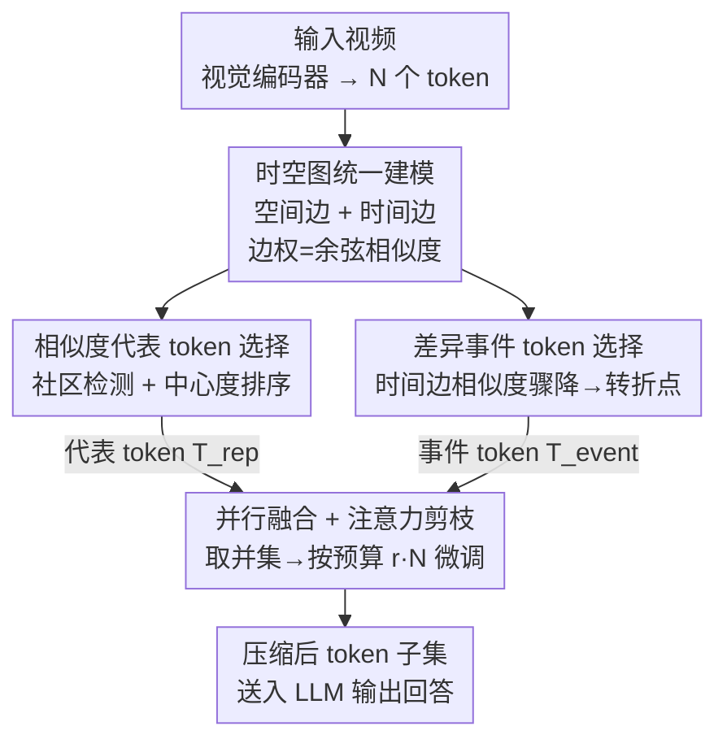

# ST-SimDiff: Balancing Spatiotemporal Similarity and Difference for Efficient Video Understanding with MLLMs

**会议**: ICLR 2026  
**OpenReview**: [https://openreview.net/forum?id=he8kYNcoMA](https://openreview.net/forum?id=he8kYNcoMA)  
**代码**: https://github.com/bingjunluo/ST-SimDiff  
**领域**: 多模态VLM / VLM效率 / 视频理解  
**关键词**: 视频 token 压缩, 时空图, 社区检测, 差异检测, 训练无关

## 一句话总结
针对多模态大模型处理长视频时视觉 token 爆炸的问题，本文提出训练无关框架 ST-SimDiff：把所有视觉 token 建成一张时空图，并行地用「相似度」做社区检测保留代表 token、用「差异」检测时间轴上的突变点保留事件 token，最后按注意力做预算微调；在 30%/50% token 预算下全面超过 FastV、FrameFusion 等 SOTA，且部分基准甚至追平 100% token 的原模型。

## 研究背景与动机

**领域现状**：当前视频多模态大模型（LVLM）普遍把一段视频采样成数十帧、每帧再编码成成百上千个视觉 token 喂给 LLM。这套范式效果好，但 token 数量随视频时长和分辨率爆炸式增长，而自注意力的复杂度是 $O(N^2)$，导致长视频分析、实时交互场景下算力和显存都吃不消。

**现有痛点**：为提效，现有方法分两类。一类是基于重要性的剪枝（如 FastV、FasterVLM），用深层注意力分数把贡献低的 token 剪掉；另一类是基于相似度的合并/选择（如 FrameFusion 合并相邻帧相似 token、VisionZip 在视觉编码器层选主导 token）。但这两类都有两个共同盲区：其一，它们要么只看同帧内的空间相关、要么只看同位置跨帧的时间相关，缺乏对**时空联合关系**的统一建模，抓不住复杂的动态事件；其二，它们都只盯着「信息共性」（相似、重要），而**忽视了视频里的变化与转折点**。

**核心矛盾**：视频的叙事往往是被「转折事件」驱动的——一个新物体出现、一个动作开始、一次场景切换。如果压缩算法只追求相似性，就会把一次突变「抹平」，造成对内容的误读。也就是说，相似性和差异性这两个维度被现有方法割裂处理，而后者几乎被完全忽略。

**本文目标**：设计一个 token 选择函数 $f(T_{\text{full}}, r)$，在给定压缩率 $r$（保留约 $r\cdot N$ 个 token）下，既用最少的 token 表示视频里稳定的内容，又精确保留关键变化，最大化下游任务表现。

**切入角度**：作者提出一个新视角——**相似性用于识别冗余，差异性用于捕捉关键事件**。一个理想的压缩算法应当同时达成两个目标：用最少 token 表示稳定内容、精确保留关键变化。

**核心 idea**：把视觉 token 建成一张时空图统一建模其复杂关联，然后并行地「用相似度社区检测压冗余」+「用时间差异突变定位事件」，双路选出的 token 合并后送入 LLM——首次把 token 的相似与差异放在同等重要的位置。

## 方法详解

### 整体框架
ST-SimDiff 是一个完全训练无关的视觉 token 压缩框架，插在视觉编码器和 LLM 之间。给定一段视频，视觉编码器先把它编码为 $N$ 个 token $T=\{t_1,\dots,t_N\}$，每个 token 都带有它的时空坐标（帧索引、空间高/宽索引）和特征向量。整个流程可概括为：**先建一张时空图统一描述 token 间的关联，再并行跑两条互补的选择路径（相似路压静态冗余、差异路抓动态事件），把两路结果取并集得到候选集，最后按注意力分数做一次预算微调，凑齐目标 token 数后送入 LLM**。

### 关键设计

**1. 时空图统一建模：把空间冗余和时间冗余放进同一张图**

现有方法把空间相似（同帧内）和时间相似（跨帧同位置）割裂处理，抓不住「一个物体横穿屏幕、位置在变但语义高度相关」这类复杂时空冗余。本文把视频的全部视觉 token 当作顶点，构建一张稀疏时空图 $G=(V,E)$，边集 $E=E_S\cup E_T$ 由两类边组成：空间边 $E_S$ 连接同帧内空间相邻（曼哈顿距离为 1）的 token，时间边 $E_T$ 连接相邻帧中空间位置相同的 token。任意一条边的权重定义为两端 token 特征向量的余弦相似度 $w(v_i,v_j)=\frac{x_i\cdot x_j}{\lVert x_i\rVert\lVert x_j\rVert}$。这张稀疏图同时编码了局部空间关系与时间连续性，每个 token 只有常数个邻居，为后续两条选择路径提供了统一的结构基础，也使整体复杂度保持线性。

**2. 相似度代表 token 选择（SRTS）：用社区检测压缩稳定冗余内容**

视频里静态背景、持续存在的物体会形成大量高相似 token，它们在图里天然聚成「社区/簇」，与具体帧或位置无关。SRTS 就利用这一点压冗余：先设一个相似度阈值 $\tau_{\text{sim}}$（实现中取 0.8）对图做剪枝，只保留权重高于阈值的边得到 $G'$；再用社区检测算法（实现中为兼顾速度用了连通分量，论文也讨论了 Louvain/Leiden）找出紧密相连的 token 簇 $C=\{c_1,\dots,c_m\}$。对每个社区 $c_k$，按中心度排序 token——中心度定义为某 token 与社区内其他 token 的平均相似度 $S_c(t_a)=\frac{1}{|c_k|-1}\sum_{t_b\in c_k,b\neq a} w(t_a,t_b)$，再按全局压缩率 $r$ 在每个社区内保留中心度最高的 $\lceil |c_k|\cdot r\rceil$ 个 token，得到代表集 $T_{\text{rep}}$。这种「每个语义簇留几个最中心的代表」的策略，能在保留核心语义的同时高效压掉冗余，单节点社区则自然保留其唯一 token。

**3. 差异事件 token 选择（DETS）：用时间突变点抓住关键事件**

如果说相似度定义了视频的「常态」，差异就定义了它的「事件」——只看相似度的模型擅长理解「是什么」，却答不好「发生了什么/何时/为何」。事件的本质是变化：新物体出现、动作开始、场景切换，这些都会让相邻帧对应位置的 token 特征发生骤变。DETS 专门分析图里的时间边 $E_T$：设一个动态阈值 $\tau_{\text{diff}}$（如取全部时间边差异分数的第 95 百分位，实现中阈值 0.2），当某条时间边两端 token 相似度骤降、即 $w(t_k,t_l)<\tau_{\text{diff}}$ 时，把时间上靠后的那个 token $t_l$ 标记为关键事件 token 保留，形式化为 $T_{\text{event}}=\{t_l\mid \exists t_k\ \text{s.t.}\ (v_k,v_l)\in E_T,\ T(t_l)>T(t_k),\ w(v_k,v_l)<\tau_{\text{diff}}\}$。这条路径相当于一张「安全网」，专门把会被相似路抹平的转折时刻捞回来，保证压缩后视频叙事里的动态关键点不丢。

**4. 并行融合 + 注意力剪枝：精确卡住任意 token 预算**

SRTS 和 DETS 并行计算后，取并集 $T_{\text{candidate}}=T_{\text{rep}}\cup T_{\text{event}}$ 作为初始候选集。但两路并集的大小未必恰好等于目标 token 数 $N_{\text{target}}=\lceil r\cdot N\rceil$。为精确满足预算，本文加一步收尾剪枝：若候选集超出目标，就按 token 重要性（沿用 FastV，用 LLM 浅层的注意力分数衡量）移除最不重要的 $|T_{\text{candidate}}|-N_{\text{target}}$ 个 token。这样「图结构选 token（保核心信息）+ 注意力动态剪枝（卡预算）」配合，既有原则性又能灵活适配任意算力预算。整个框架三阶段（建图、SRTS、DETS）都是线性时间，总复杂度 $O(Nd)$，相对 LLM 自注意力的 $O(N^2d)$ 几乎可忽略不计。

## 实验关键数据

### 主实验
在 LLaVA-Video-7B 与 NVILA-8B 两个底座、VideoMME / LongVideoBench / EgoSchema 三个长视频基准、64 输入帧、30%/50% 两档保留率下评测。下表节选 LLaVA-Video-7B 的 Overall 结果（%）：

| 保留率 | 方法 | VideoMME (Overall) | LongVideoBench | EgoSchema |
|--------|------|------|------|------|
| 100% | LLaVA-Video（上界） | 63.3 | 58.2 | 57.3 |
| r=30% | FrameFusion（前 SOTA） | 61.3 | 56.0 | 53.0 |
| r=30% | **ST-SimDiff** | **63.2** | **57.5** | **56.0** |
| r=50% | FrameFusion | 62.6 | 57.6 | 55.8 |
| r=50% | **ST-SimDiff** | **63.8** | **57.9** | **57.3** |

在 NVILA-8B 上同样全面领先：r=50% 时 VideoMME Overall 61.7（FrameFusion 59.4）、LongVideoBench 56.5（54.8）、EgoSchema 52.5。值得注意的是，r=50% 下 ST-SimDiff 在部分基准上不仅超过所有压缩算法，甚至追平或超过用 100% token 的原模型。

### 消融实验
逐步从纯重要性剪枝的 Baseline 加上相似模块（+Sim，并细分空间/时间/时空联合）、再加差异模块（++Diff），LLaVA-Video r=30% 下 VideoMME / LongVideoBench / EgoSchema（%）：

| 配置 | VideoMME | LongVideoBench | EgoSchema | 说明 |
|------|---------|------|------|------|
| Baseline（仅重要性剪枝） | 60.3 | 56.2 | 54.8 | 起点 |
| + Sim (Spatial) | 61.5 | 56.5 | 55.2 | 只加空间相似 |
| + Sim (Temporal) | 61.7 | 56.8 | 55.1 | 只加时间相似 |
| + Sim (Spa.+Tem.) | 62.6 | 57.0 | 55.3 | 时空联合最优 |
| ++ Diff（完整模型） | 63.2 | 57.5 | 56.0 | 再加差异检测 |

### 关键发现
- **时空联合相似 > 单看空间或时间**：Spa.+Tem. 在三基准上都优于只用空间或只用时间，验证了统一建模时空关联才能更充分地压冗余。
- **差异模块在高压缩比下最关键**：++Diff 在 r=30% 时带来显著跃升（VideoMME 62.6→63.2、EgoSchema 55.3→56.0），但 r=50% 时增益变小——因为更宽松的 +Sim 已大概率把事件 token 顺带捞进来了，且性能已接近上界。这说明差异检测是高压缩场景下不可或缺的「安全网」。
- **效率收益随视频变长越发明显**：30% 预算下，128 帧时推理时间从基线 6.50s 降到 4.54s（省 30.2%，32 帧时省 23.0%），峰值显存从 35.0GB 降到约 23.9GB，且线性复杂度 $O(Nd)$ 让额外开销几乎可忽略。

## 亮点与洞察
- **「相似性识冗余、差异性抓事件」这个对偶视角很提纲挈领**：现有工作几乎全在「找共性」上内卷，本文第一次把「差异/转折」抬到与相似同等重要的位置，并给出可落地的检测方式（时间边相似度骤降），补上了视频理解压缩里被系统性忽视的一块。
- **用一张时空图统一两条路径很优雅**：建一次图，社区检测走相似路、时间边走差异路，两路并行复用同一结构，复杂度全程线性，工程上也好实现（社区检测直接用连通分量换速度）。
- **训练无关 + 即插即用**：无需重训底座，对 LLaVA-Video、NVILA 两种架构都涨点，迁移成本极低；「图选 token + 注意力卡预算」的两段式设计也可迁移到图像/其他模态的 token 压缩任务。

## 局限与展望
- **依赖人工阈值**：$\tau_{\text{sim}}=0.8$、$\tau_{\text{diff}}=0.2$（或百分位）是固定超参，不同底座/视频分布下的最优值可能漂移，论文未给跨数据集的自适应阈值方案。
- **差异只看时间边、且只保「后一个」token**：DETS 把转折定义为相邻帧时间边的骤降并保留靠后 token，对渐变型事件或跨多帧累积的变化可能不敏感；空间维度的「差异」未被利用。
- **社区检测用连通分量是速度妥协**：作者承认 Louvain/Leiden 能给出更复杂的社区定义但复杂度更高（$O(N\log N)$），连通分量虽快，社区质量是否影响极端压缩比下的表现值得进一步分析。
- **超大社区需人为切分**：当某社区超过 $\sqrt{N}$ 时强制切分以控复杂度，这一启发式对结果的影响未单独消融。

## 相关工作与启发
- **vs FastV / FasterVLM（重要性剪枝）**：它们用深层注意力分数剪低分 token，但倾向于保留「重要但重复」的 token，对视频里普遍的时间冗余处理低效；本文用图社区检测主动压时空冗余，并显式补上差异检测。
- **vs FrameFusion / VisionZip / PruMerge（相似度合并/混合）**：FrameFusion 主要合并相邻帧的时间相似 token、VisionZip 在编码器层选主导 token，都只在「共性」上做文章，存在抹平转折事件的理论盲点；ST-SimDiff 用时空联合相似替代单一时间相似，并以差异路径专门保留关键事件，在两个底座、三个基准上全面领先。

## 评分
- 新颖性: ⭐⭐⭐⭐⭐ 首次把 token 差异/转折抬到与相似同等地位，时空图 + 双路选择视角清晰且可落地。
- 实验充分度: ⭐⭐⭐⭐ 两底座三基准两档压缩比 + 组件消融 + 效率分析，较完整；但缺阈值敏感性与跨数据集泛化的系统消融。
- 写作质量: ⭐⭐⭐⭐⭐ 动机一气呵成，公式定义清楚，「相似识冗余、差异抓事件」的主线贯穿全文。
- 价值: ⭐⭐⭐⭐⭐ 训练无关、即插即用、线性开销，对长视频 MLLM 部署有直接实用价值。

<!-- RELATED:START -->

## 相关论文

- [\[ICLR 2026\] SURGE: Surprise-Guided Token Reduction for Efficient Video Understanding with VLMs](surge_surprise-guided_token_reduction_for_efficient_video_understanding_with_vlm.md)
- [\[CVPR 2026\] TimeViper: A Hybrid Mamba-Transformer Vision-Language Model for Efficient Long Video Understanding](../../CVPR2026/vlm_efficiency/timeviper_a_hybrid_mamba-transformer_vision-language_model_for_efficient_long_vi.md)
- [\[ACL 2026\] HERMES: KV Cache as Hierarchical Memory for Efficient Streaming Video Understanding](../../ACL2026/vlm_efficiency/hermes_kv_cache_as_hierarchical_memory_for_efficient_streaming_video_understandi.md)
- [\[ICLR 2026\] Photon: Speedup Volume Understanding with Efficient Multimodal Large Language Models](photon_speedup_volume_understanding_with_efficient_multimodal_large_language_mod.md)
- [\[CVPR 2026\] MiniCPM-V 4.5: Cooking Efficient MLLMs via Architecture, Data and Training Recipes](../../CVPR2026/vlm_efficiency/minicpm-v_45_cooking_efficient_mllms_via_architecture_data_and_training_recipe.md)

<!-- RELATED:END -->
