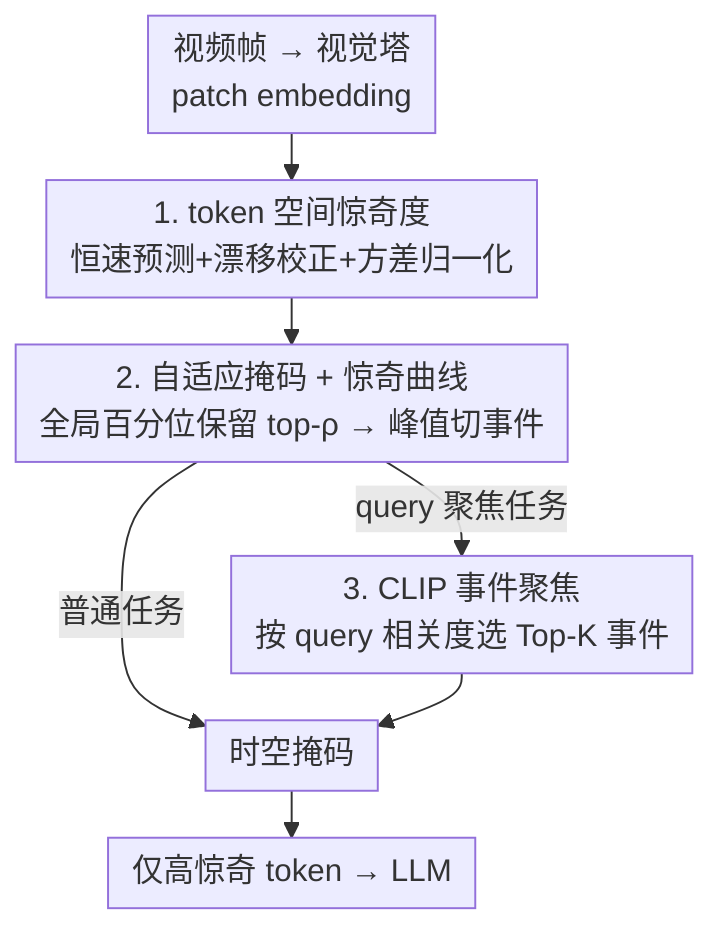

# SURGE: Surprise-Guided Token Reduction for Efficient Video Understanding with VLMs

**会议**: ICLR 2026  
**OpenReview**: [https://openreview.net/forum?id=rCFPSIjqMf](https://openreview.net/forum?id=rCFPSIjqMf)  
**代码**: https://github.com/BarryTang22/SURGE  
**领域**: 多模态VLM / 视频理解 / VLM效率  
**关键词**: token 裁剪, 视频 VLM, 时间预测, 惊奇度, 免训练

## 一句话总结
SURGE 用「token 在时间上是否可预测」来度量惊奇度（surprise）——可预测的冗余 token 被裁掉、不可预测的新信息 token 被保留，免训练、不挑骨干网络，在五个视频理解基准上把 token 数压到原来的 1/7、prefill 成本砍掉 86–98%，精度却与全 token 基线相差不超过 ±1 分。

## 研究背景与动机

**领域现状**：视频 VLM（InternVL、Qwen-VL、LLaVA-Next 等）把短短几秒的片段就展开成数千个视觉 token，注意力的二次复杂度让长视频推理极其昂贵。为压成本，社区沿三条线做效率优化：时间维度上挑关键帧（keyframe selection）、表示维度上把每帧压成更少 token、token 维度上合并或裁剪冗余 patch。

**现有痛点**：这些方法大多要付出额外代价——要么需要训练一个辅助选择器，要么要微调骨干网络，要么依赖模型内部的注意力图（attention map），而注意力图在很多已部署系统里根本拿不到。更关键的是，它们的代理信号（注意力权重、相似度分数）衡量的是「当前这一步什么重要」，而不是「相比刚才什么变了」——于是冗余但仍然「在主题上」的片段会继续白白消耗算力，而真正的新事件反而可能被忽略。

**核心矛盾**：视频天然具有时间连续性，连续帧背景相似、运动可预测，存在大量冗余；但现有效率方法没有一个**免训练、不依赖内部注意力、与骨干无关**的信号来在线判断「哪些 token 携带了不可预测的新信息、值得算」。

**切入角度**：作者借用认知科学和强化学习里的老思想——predictive coding 认为符合预期的输入被抑制、出乎意料的才被深加工；好奇心模块用预测误差奖励探索。把这个「惊奇即预测误差」的原则直接搬到 token 空间：与近期历史一致的 token 信息量低，偏离预期的 token 标志真正的变化。

**核心 idea**：在 token 空间用一个轻量恒速预测器估计每个 token，**用「预测误差」定义惊奇度**——高惊奇 token 保留、可预测 token 裁剪；再把 token 级惊奇沿时间聚合成「惊奇曲线」切分关键事件，可选地用 CLIP 按 query 相关度进一步聚焦，形成紧凑的时空掩码。

## 方法详解

### 整体框架

SURGE 是一个插在「视觉编码器之后、语言模型之前」的免训练掩码模块。视觉塔把每帧切成 $m$ 个 patch、输出 patch embedding 后，SURGE 先在**未投影**的原始 patch 特征上算每个 token 的惊奇分数（恒速预测 → 漂移校正 → 方差归一化），再做两件事：一是按全局百分位保留最惊奇的 top-$\rho$ token（自适应掩码），二是把每帧的惊奇 token 数聚合成惊奇曲线、用峰值切出关键事件窗口。这套时空掩码本身就能直接用于高效推理；对 query 聚焦的任务，还可以再用 CLIP 计算 query 与峰值帧的相似度、只保留 Top-K 最相关的事件（记作 SURGE⋆）。最终只有「关键事件里的高惊奇 token」被送进 LLM，其余被裁掉。

### 关键设计

**1. token 空间的惊奇度：用恒速预测误差度量「可预测性」**

这是全文的地基，针对的痛点是「缺一个免训练、不挑骨干、不依赖注意力图的新信息信号」。作者先做了一个理论铺垫：自然视频平滑演化，$I_{t+1}\approx I_t+\Delta I_t$，对可微的编码器 $f_j$ 做一阶泰勒展开可得 token 空间近似线性动力学 $z^{(j)}_{t+1}-2z^{(j)}_t+z^{(j)}_{t-1}\approx 0$，即一个**恒速先验**（constant-velocity prior）：平滑运动满足它，突变事件会产生大偏离。基于此，预测器把最近一次位移外推：$\hat z^{(j)}_t=z^{(j)}_{t-1}+\tilde\delta^{(j)}_{t-1}$，其中 $\tilde\delta^{(j)}_{t-1}\approx z^{(j)}_{t-1}-z^{(j)}_{t-2}$。这是因果的、免训练的、对所有空间位置一视同仁，因此天然兼容任意 ViT 骨干。

但裸预测器分不清「真新颖」和「相机平移/全局变换造成的大范围一致运动」——后者会让几乎所有 token 一起变、引发假惊奇。于是加**全局漂移校正**：把位移场近似成空间坐标的仿射函数 $\Delta z^{(j)}_t\approx c_0+c_x x_j+c_y y_j$，用最小二乘闭式解 $\hat C=(X^\top X)^{-1}X^\top\Delta Z_t$ 拟合系数，再把全局平移和一阶平面流减掉得到去趋势位移 $\tilde\delta^{(j)}_t$；每帧只多一个 $3\times3$ 最小二乘，开销可忽略（[CLS]/register 等特殊 token 不参与拟合且始终保留）。最后惊奇向量 $e^{(j)}_t=z^{(j)}_t-\hat z^{(j)}_t$ 的平方模长再用该 token 历史方差的指数滑动平均 $\sigma^{2,(j)}_t$ 做**方差归一化**，得到标量惊奇分数

$$s^{(j)}_t=\frac{\lVert e^{(j)}_t\rVert_2^2}{\sigma^{2,(j)}_t+\varepsilon}.$$

这一步把分数校准成「局部线性-高斯无变化时约等于其期望、显著偏离才大」的统计量，抑制了漂移噪声、让惊奇峰值对齐真正的内容变化。

**2. 自适应掩码与惊奇曲线：从 token 分数到关键事件切分**

有了逐 token 惊奇分数，第二步把它变成可用的时空掩码。**自适应掩码**用全局百分位而非固定阈值：收集当前缓冲区（离线时是整段、流式时是已观测前缀）内所有分数 $S_B$，取 $p$ 百分位 $q(p)$，掩码 $M_{u,j}=\mathbb 1\{s^{(j)}_u\ge q(p)\}$，保留 $\rho=1-p$ 比例的 token。妙处在于这是「跨整段做全局选择」——动态帧贡献多、冗余帧贡献少，预算自动向变化集中的地方倾斜，而不是每帧裁掉固定比例。

为进一步抓「关键事件」，把每个时间单元 $u$ 超过阈值的 token 数 $S_u=\sum_j M_{u,j}$ 沿时间拼成**惊奇曲线**，用 EMA $\bar S_u=\gamma\bar S_{u-1}+(1-\gamma)S_u$ 平滑去噪，再做峰值检测（带最小间隔 $\Delta$ 和小 prominence 阈值）。相邻峰值的中点作为事件边界 $b_k=\lfloor(\tau_k+\tau_{k+1})/2\rfloor$，每个峰 $\tau_k$ 对应事件区间 $I_k=[b_{k-1},b_k)$——于是「两个惊奇高峰之间的时段」被自然切成一个关键事件，给后续按事件分配算力提供了结构。

**3. CLIP 查询感知的事件聚焦：让算力既「新」又「相关」**

掩码本身只保证「新」，但 query-focused 的长视频检索还需要「和问题相关」。SURGE⋆ 在峰值帧上做一次 CLIP：取峰值帧嵌入 $v_{\tau_k}$，算它与文本 query 的相似度 $r_k=\mathrm{sim}(q,v_{\tau_k})$，按 $r_k$ 排序保留 Top-K 事件 $E_K$，只在这些区间内施加掩码、其余位置仅保留一个小的「上下文地板」$C_{u,j}$（如按惊奇分排序的 top-$k_{ctx}$ token）。最终掩码为

$$M^\star_{u,j}=A_u\cdot M_{u,j}+(1-A_u)\cdot C_{u,j},$$

其中 $A_u=\mathbb 1\{u\in\bigcup_{k\in E_K}I_k\}$ 标记是否落在选中事件里。这一步只多一次对少量峰值帧的 CLIP 前向，却能把送进 LLM 的 token 进一步减半左右，并在超长上下文检索里显著提升聚焦度——把惊奇驱动的「新」和 query 驱动的「相关」组合成最终的紧凑时空掩码。

## 实验关键数据

### 主实验

五个视频-语言基准（Video-MME、MLVU、MMBench-Video、TempCompass、LongVideoBench）、三个旗舰 VLM（InternVL-3.5-VL 8B、Video-LLaVA-Qwen 7B、Qwen2.5-VL 7B），默认保留 $\rho=0.25$（75 百分位）、EMA $\gamma=0.9$、峰间隔 $\Delta=8$、CLIP Top-5。SURGE 把视觉 token 压到约 26–27%（≈4×），SURGE⋆ 进一步压到约 14–16%（≈7×），精度仍在 ±1 分内。

| 模型 (64 帧) | Tokens | V-MME | MLVU (M/G) | MMB-V | T-Compass | LVB |
|--------|------|------|----------|------|------|------|
| InternVL-3.5-VL (8B) | 17,124† | 66.0 | 71.7 / 3.44 | 1.54 | 68.9 | 61.3 |
| + SURGE | 4,674 | 64.9 | 71.5 / 3.45 | 1.57 | 69.0 | 61.7 |
| + SURGE⋆ | 2,932 | 65.8 | 71.7 / 3.69 | 1.57 | 69.7 | 62.2 |
| Video-LLaVA-Qwen (7B) | 12,246 | 63.4 | 72.9 / 3.30 | 1.53 | 66.9 | 58.3 |
| + SURGE⋆ | 1,884 | 64.5 | 72.7 / 3.20 | 1.60 | 66.9 | 61.9 |
| + FastV | 3,300 | 58.1 | 52.3 / 3.11 | 1.29 | 61.7 | 55.4 |
| Qwen2.5-VL (7B) | 41,590 | 62.2 | 65.8 / 4.26 | 1.60 | 70.5 | 60.0 |
| + SURGE⋆ | 5,207 | 62.7 | 66.1 / 4.24 | 1.70 | 67.7 | 61.3 |

在强调长视频与跨事件推理的基准上，SURGE⋆ 不仅不掉、还能反超全 token 基线（如 InternVL 在 LVB +0.9、MLVU G-Avg +0.25）；对照 FastV（基于注意力的裁剪），同等预算下 SURGE 明显更稳（Video-LLaVA-Qwen 上 V-MME 64.5 vs 58.1、MLVU 72.7 vs 52.3），说明「时间惊奇」比「注意力幅度」是更可靠的保留依据。SURGE 还能和关键帧选择 AKS 组合，进一步提升效率与精度。

### token-精度权衡与消融

在 Qwen2.5-VL 上扫描保留比例 $\rho$，SURGE 在所有档位最大相对波动都 ≤±1.1%，即便激进到 $\rho=0.10$–$0.01$ 仍稳；随机裁剪一旦丢掉 >75% token 就剧烈崩塌（$\rho=0.25$ 时波动 ±13.2%、$\rho=0.10$ 时 ±23.9%）。

| 配置 (ρ=0.25) | MLVU (M/G) | T-Compass | MMB-V | 说明 |
|------|---------|------|------|------|
| SURGE (Full) | 65.7 / 4.26 | 70.5 | 1.72 | 完整模型 |
| w/o 漂移校正 (Eq.4) | 64.9 / 4.18 | 69.4 | 1.65 | 去全局漂移去趋势 |
| w/o 方差归一化 (Eq.5) | 65.1 / 4.22 | 69.7 | 1.70 | 去方差校准 |
| w/o 时间预测器 (仅帧差 Eq.3) | 63.4 / 4.17 | 66.9 | 1.55 | 退化为帧差 |

### 关键发现
- **时间预测器是最大功臣**：去掉它退化成帧差后，会把平滑运动误判成新颖，MLVU M-Avg 从 65.7 掉到 63.4、T-Compass 从 70.5 掉到 66.9，是三个组件里掉点最多的；漂移校正和方差归一化各贡献温和但一致的稳定性。
- **Top-K 不能太小**：K=1 会让覆盖坍塌、严重掉点（V-MME 跌到 51.7、MLVU 跌到 37.9）；K=5–10 时 SURGE⋆ 常常追平甚至超过全 token 基线，K=5–7 是稳健默认。
- **长上下文是真价值**：MLVU 上基线超过 ~230 帧就爆 A100 80GB 显存，SURGE/SURGE⋆ 仍可跑到 1024 甚至 3600 帧，把可处理视频长度提升一个数量级。
- **算力收益落地在 prefill**：Qwen2.5-VL 上 $\rho=0.25$ 时 prefill FLOPs/延迟降 86%/79%，$\rho=0.01$ 时 prefill 成本砍掉 >98%、生成 FLOPs 约减半。

## 亮点与洞察
- **把「惊奇 = 预测误差」这一认知科学老思想干净地搬进 token 空间**：不依赖注意力图、不训练、不挑骨干，仅靠一个恒速外推器就拿到「新信息」信号——这正好补上了现有效率方法都缺的那块拼图。
- **泰勒展开给恒速先验提供了第一性原理依据**：$z_{t+1}-2z_t+z_{t-1}\approx0$ 把「平滑视频」翻译成「token 二阶差分接近零」，让「偏离即惊奇」不是拍脑袋而是有推导支撑。
- **全局百分位 + 漂移校正这对组合很巧**：前者让预算跨整段自适应倾斜向变化处，后者专门压掉相机平移这类「全局一致变化」的假惊奇，二者一起把信号校准得对齐真实内容变化。
- **「新」与「相关」解耦再组合**：惊奇掩码管「新」、CLIP 事件聚焦管「相关」，可插拔——普通任务只用前者，query 检索再叠后者，这种正交设计很容易迁移到其他需要在线分配算力的流式场景。

## 局限与展望
- 作者承认 SURGE⋆ 需要额外一次 CLIP 前向，且对 K 和 query 措辞敏感（K=1 会崩）；未来打算换更轻的相关性模型、做自适应事件选择和 in-context 对齐来增强鲁棒性。
- 恒速先验本质假设「视频平滑演化」，对剧烈剪辑、频繁场景切换、强非线性运动的内容，一阶外推的预测误差可能整体偏大，惊奇信号的区分度会下降——论文未单独压力测试这类极端片段。
- 主实验为隔离惊奇驱动的收益没用上下文地板 $C_{u,j}$，因此「地板」在极端裁剪下到底能挽回多少精度缺乏系统量化；表 1 里 InternVL 的 token 数还超出其 15k 上下文被运行时截断（†），跨模型 token 数横向比要带这个 caveat。
- 惊奇分数在原始未投影特征上算，依赖 ViT patch embedding 的几何平滑性，对非 ViT 或强量化骨干是否同样成立未验证。

## 相关工作与启发
- **vs FastV / SparseVLM（注意力/相关度裁剪）**: 它们靠注意力阈值或相关度分数挑「当前重要」的 token，需要内部注意力图且要细调阈值；SURGE 用时间预测误差挑「相比刚才变了」的 token，免训练、不取注意力图，同预算下更稳（Video-LLaVA-Qwen 上大幅领先 FastV）。
- **vs AKS（自适应关键帧选择）**: AKS 在帧级挑子集而非裁 token，二者正交；SURGE 与 AKS 组合后效率与精度还能再涨，说明惊奇掩码可与时间选择互补叠加。
- **vs ToMe / LLaMA-VID / Matryoshka（合并/表示压缩）**: 这类要改架构、训练摘要器或加超参；SURGE 不动模型、纯推理期插入，部署门槛低得多。

## 评分
- 新颖性: ⭐⭐⭐⭐⭐ 把「预测误差即惊奇」首次系统地落到 token 空间并配齐漂移校正与方差归一化，角度清新且有理论铺垫。
- 实验充分度: ⭐⭐⭐⭐⭐ 三模型五基准、token-精度全档位扫描、长上下文到 3600 帧、组件消融与 FLOPs/延迟分析都覆盖到。
- 写作质量: ⭐⭐⭐⭐ 公式与动机讲得清楚，pipeline 图清晰；个别记号（如最终掩码与上下文地板）需对照附录才完全明白。
- 价值: ⭐⭐⭐⭐⭐ 免训练、即插即用、把视频 VLM 可处理长度提升一个数量级，落地价值很高。

<!-- RELATED:START -->

## 相关论文

- [\[CVPR 2026\] ApET: Approximation-Error Guided Token Compression for Efficient VLMs](../../CVPR2026/vlm_efficiency/apet_approximation-error_guided_token_compression_for_efficient_vlms.md)
- [\[ICLR 2026\] ST-SimDiff: Balancing Spatiotemporal Similarity and Difference for Efficient Video Understanding with MLLMs](st-simdiff_balancing_spatiotemporal_similarity_and_difference_for_efficient_vide.md)
- [\[CVPR 2026\] MeToM: Metadata-Guided Token Merging for Efficient Video LLMs](../../CVPR2026/vlm_efficiency/metom_metadata-guided_token_merging_for_efficient_video_llms.md)
- [\[CVPR 2026\] CoIn: Coverage and Informativeness-Guided Token Reduction for Efficient Large Multimodal Models](../../CVPR2026/vlm_efficiency/coin_coverage_and_informativeness-guided_token_reduction_for_efficient_large_mul.md)
- [\[ACL 2026\] HERMES: KV Cache as Hierarchical Memory for Efficient Streaming Video Understanding](../../ACL2026/vlm_efficiency/hermes_kv_cache_as_hierarchical_memory_for_efficient_streaming_video_understandi.md)

<!-- RELATED:END -->
