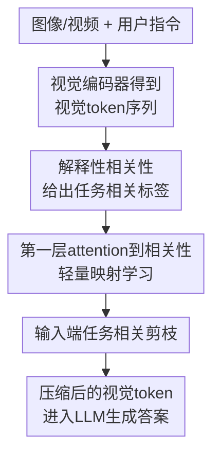

# Task-Related Token Compression in Multimodal Large Language Models from an Explainability Perspective

**会议**: ICLR2026  
**OpenReview**: [https://openreview.net/forum?id=YULeQtSyiW](https://openreview.net/forum?id=YULeQtSyiW)  
**代码**: 未公开  
**领域**: 多模态VLM / VLM效率 / 视觉Token压缩  
**关键词**: 视觉token压缩、MLLM推理加速、可解释性、任务相关剪枝、KV-cache优化  

## 一句话总结
这篇论文用 Transformer 可解释性方法估计视觉 token 对当前指令的任务相关性，并训练一个轻量卷积压缩器在 LLM 输入端提前剪掉低相关 token，从而在 Qwen2-VL、LLaVA-OneVision 和 VILA1.5 上显著减少 FLOPs、prefill 时间与 KV-cache，同时尽量保持图像和视频理解性能。

## 研究背景与动机
**领域现状**：主流多模态大语言模型通常先用视觉编码器把图像 patch 或视频帧转成大量视觉 token，再把这些视觉 token 与系统提示、用户指令一起送入 LLM。高分辨率图像、长视频和多帧输入会让视觉 token 数量快速膨胀，直接推高 attention 计算、prefill 延迟和 KV-cache 内存。

**现有痛点**：已有视觉 token 压缩大致分两类：一类是任务无关的合并或池化，主要根据视觉 token 之间的相似性去冗余；另一类是任务相关压缩，通常依赖 LLM 浅层 attention，在中间层再剪掉视觉 token。前者容易忽略“这次问题到底问什么”，后者虽然利用了文本指令，却默认浅层视觉 token 必须先完整进入 LLM，导致 prefill 的早期成本和一部分 KV-cache 仍然已经发生。

**核心矛盾**：真正想节省的是 LLM 输入后的整段计算与缓存，但任务相关的重要性似乎又需要 LLM 内部的视觉-语言交互才能判断。FastV 等方法因此倾向于在浅层之后压缩，认为视觉 token 在早期层完成对齐前不宜提前删。本文质疑这个默认假设：如果能在进入 LLM 前就知道哪些视觉 token 与当前指令相关，那么输入端压缩可以同时减少 prefill 与 decode 阶段的负担。

**本文目标**：作者要回答两个问题。第一，是否存在一种可靠的任务相关重要性指标，可以在模型输出层面解释每个视觉 token 对回答的贡献，并证明输入端压缩不是天然不可行。第二，既然完整可解释性计算需要一次生成和反向传播，能否训练一个很小的替代模块，在真实推理时提前预测这种重要性。

**切入角度**：论文选择从可解释性而不是模型结构经验出发。Transformer 可解释性方法可以把 attention 与梯度结合起来，沿层传播 relevance map，得到生成答案对输入视觉 token 的全局相关性分数。这个角度的好处是模型无关：它不依赖某个 MLLM 的特定架构观察，而是利用当前被压缩模型自身的响应路径来标注哪些视觉 token 真正影响答案。

**核心 idea**：先用梯度加权 attention 的解释性相关性 $R_v$ 验证“输入端任务相关剪枝可行”，再训练一个轻量 1D 卷积网络 $f_\theta$ 从第一层文本到视觉 attention 中预测 $\tilde{R}_v$，用预测相关性在 LLM 输入前保留最重要的视觉 token。

## 方法详解

### 整体框架
本文方法可以分成“离线生成解释性标签”和“在线轻量预测压缩”两条线。离线阶段先让原 MLLM 完整处理输入，利用生成答案时的 attention 与梯度计算视觉 token 相关性 $R_v$，并用它验证剪枝策略；训练阶段把第一层 instruction-to-vision attention 当输入，学习一个小型卷积网络去近似 $R_v$；推理阶段只运行这个轻量压缩器，直接在 LLM 输入端把视觉 token 从 $E_v$ 压缩成 $\hat{E}_v$。

形式上，视觉编码器和投影层把输入视觉信号 $V$ 编成 $E_v=VM(V)\in\mathbb{R}^{N_v\times C}$，系统提示和用户指令分别是 $E_s$ 与 $E_u$。原模型生成答案可写作 $Y=LM(E_s,E_v,E_u)$。本文希望学习一个压缩器 $Comp$，在不改视觉编码器和 LLM 的前提下得到 $\hat{E}_v=Comp(E_v\mid E_u)\in\mathbb{R}^{\hat{N}_v\times C}$，其中 $\hat{N}_v\ll N_v$，随后用 $Y=LM(E_s,\hat{E}_v,E_u)$ 完成推理。

这个框架的关键不是再做一轮通用视觉去冗余，而是只删除“对当前问题不重要”的 token。例如同一张图里，用户问三条曲线时，图表中与曲线区域对应的 token 应该保留；若换成询问其他列或其他对象，重要区域也应随指令变化。这种任务条件化选择是本文区别于纯视觉相似性合并的核心。

### 关键设计
**1. 解释性相关性：用生成答案的梯度加权attention衡量视觉token贡献**

输入端压缩最难的是“还没完整跑 LLM，怎么知道哪些视觉 token 可以删”。本文先不急着做高效推理，而是用可解释性方法建立一个可信的上界指标。对每个生成 token $y_t$，方法初始化 relevance map $R_t$ 为单位矩阵，然后从第 0 层到最后一层逐层传播相关性。第 $l$ 层的多头 attention 为 $A_t^l$，对应梯度为 $\nabla A_t^l$，更新规则为：

$$
R_t = R_t + E_h((A_t^l \odot \nabla A_t^l)^+)\cdot R_t
$$

这里 $\odot$ 是逐元素乘法，$(\cdot)^+$ 表示只保留正贡献，$E_h$ 表示跨 attention head 求平均。直观地说，attention 告诉我们 token 之间信息流向哪里，梯度告诉我们这些流动对当前输出是否真的有用；两者相乘后沿层累积，就能比单看 attention 更接近“哪些输入视觉 token 支撑了回答”。

得到每个生成步的 $R_t$ 后，方法取最后一行中视觉 token 位置 $R_t[-1,N_s:N_s+N_v]$，表示当前输出 token 对视觉输入的相关性，再对所有生成步取平均，得到整体视觉相关性 $R_v\in\mathbb{R}^{1\times N_v}$。按 $R_v$ 排序保留 top token，就可以直接在输入端剪掉低相关视觉 token。实验显示，用真实 $R_v$ 指导压缩时，多个模型在 50% 甚至 25% retention 下仍能保留很高性能，说明“浅层所有视觉 token 都不可删”并不是绝对成立。

**2. 第一层attention到相关性的轻量映射：把昂贵解释性计算蒸馏成可部署压缩器**

真实 $R_v$ 需要完整生成答案并反向传播，不能在实际推理前直接使用。作者的解决方案是训练一个独立于 MLLM 的轻量模块 $f_\theta$，用 LLM 第一层 attention map 预测解释性相关性。具体做法是从第一层 attention $A^0$ 中取用户指令 token 到视觉 token 的子图 $A^0_{u\to v}\in\mathbb{R}^{N_u\times N_v}$，再沿用户 token 维度平均，得到每个视觉 token 接收到的指令注意力 $A^0_v\in\mathbb{R}^{1\times N_v}$。

这个 $A^0_v$ 被送入一个 5 层 1D depthwise separable convolution 网络，输出预测相关性 $\tilde{R}_v=f_\theta(A^0_v)$，末尾用 softmax 变成概率分布。这里选卷积网络很有针对性：输入和输出都是按视觉 token 顺序排列的一维序列，卷积既能捕捉局部连续区域的重要性，又比再引入一个大 Transformer 便宜得多。论文还强调每个 MLLM 使用自己的 $f_\theta$，因为不同模型的视觉编码、attention 分布和答案路径不同，压缩器要拟合的是“该模型自己的可解释性模式”。

训练标签不是直接对原始 $R_v$ 做 softmax。作者先把 $R_v$ 中底部 50% 的值 mask 掉，再把剩余值按总和归一化为 $R_v^*$，然后用 KL 散度训练：$\mathcal{L}_{KL}=KL(R_v^*\Vert \tilde{R}_v)$。这个设计把任务从“精确复原每个 token 的连续相关性”简化成“找出最重要的一批区域”，更符合剪枝需求，也降低了小模型学习难度。

**3. 输入端任务相关剪枝：不改MLLM结构却同时减少prefill和decode开销**

很多中间层压缩方法需要先把完整视觉 token 送入 LLM 的若干浅层，之后再删除一部分 token。这样虽然能降低后续层 FLOPs，但第一段 prefill 已经处理了全量视觉 token，并且实现上往往要插入层内剪枝逻辑。本文把压缩移动到 LLM 输入端：视觉 token 经过 $f_\theta$ 打分后，只保留 top-$\hat{N}_v$ 个 token，再与系统提示、用户指令拼接进入原始 LLM。

这个位置变化带来两个实际收益。第一，prefill 从一开始就面对更短的视觉序列，attention 与 FFN 的计算都随 token 数下降。第二，进入 decode 阶段时 KV-cache 中需要保存的视觉 token 也更少，因此长输出或多轮场景的内存压力更低。论文在 Qwen2-VL 的 MMStar 上报告，25% retention 时 KV cache 从 71.2MB 降到 17.8MB，prefill time 从 6min36s 降到 4min08s，同时 MMStar 分数明显高于 FastV、PDrop 和 Dart 的同等压缩设置。

**4. 模型无关但模型专属：用统一范式覆盖不同MLLM架构**

本文不是为某个模型手工设计规则，而是把“解释性标签生成 + 轻量压缩器拟合”作为范式套到 LLaVA-OneVision、Qwen2-VL 和 VILA1.5 上。这三类模型的视觉 token 组织方式差异很大：Qwen2-VL 有动态分辨率和 token aggregation，VILA1.5 本身已经有空间 token 压缩，LLaVA-OneVision 支持图像和视频任务迁移。方法仍能进一步减少任务相关冗余，说明它压缩的不是视觉编码器已经处理掉的通用冗余，而是“这条指令不需要”的剩余视觉信息。

当然，这里的“模型无关”不是一个压缩器跨模型直接复用，而是算法流程不依赖特定架构假设。每个模型各自生成 $A^0_v$ 和 $R_v$ 训练自己的 $f_\theta$。这种设定更诚实：它避免把某个模型的浅层 attention 规律硬迁移到其他模型，同时保持部署端不修改原 MLLM 参数和推理流程。

### 一个完整示例
假设输入是一段包含图表的视频，用户问“图中三条弯曲线表示什么趋势”。原始 MLLM 可能把所有帧或 patch 都编码成上千个视觉 token，其中包括坐标轴、标题、空白区域、图例、文字说明和无关背景。离线解释性计算会在生成答案后回看每个视觉 token 的贡献，发现与三条曲线所在区域对应的 token 在 $R_v$ 中得分较高，而空白背景和与问题无关的图例区域得分较低。

训练好的 $f_\theta$ 在推理时不需要等答案生成。它先读取第一层中“用户指令 token 看向视觉 token”的 attention 分布，预测 $\tilde{R}_v$，然后按 retention ratio 选择 top token。若设置 50% retention，原本 1500 个视觉 token 会被压到约 750 个；若设置 25% retention，则只留下约 375 个。关键是保留的 token 并非均匀采样，而是围绕“曲线”这类与问题相关的区域聚集，因此 LLM 仍能回答问题，同时少处理大量无关视觉上下文。

### 损失函数 / 训练策略
训练数据来自通用高质量图像和视频指令数据。图像压缩器使用 Infinity-MM 子集，视频压缩器使用 LLaVA-Video、NeXT-QA 和 ActivityNetQA 的子集，并按任务类型和视频时长做多样化采样。作者还用目标 MLLM 先评估样本，只保留该模型答对的样本来生成训练标签，因为正确答案对应的视觉相关性通常更可靠。

压缩器 $f_\theta$ 是 5 层 1D depthwise separable convolution，通道数依次为 32、64、128、256、512，最后接 pointwise convolution 聚合通道。训练使用 Adam，batch size 为 128，约 100 个 epoch。论文报告每个模型每种模态大约使用 8K 到 12K 个有效样本；图像压缩器单卡 A100 约半小时可训练，视频压缩器少于 4 小时。这个成本相对 MLLM 重训很小，也符合“压缩器独立训练、主模型不动”的部署目标。

## 实验关键数据

### 主实验
论文先用真实解释性相关性 $R_v$ 检查输入端压缩是否可行，再用训练好的 $\tilde{R}_v$ 压缩器和 FastV、PyramidDrop、Dart 等方法比较。下面表格摘取最能说明结论的结果：在相近 FLOPs 下，本文方法通常能保持更高平均性能，尤其在 25% retention 的强压缩场景优势更明显。

| 模型 / 场景 | Retention | FLOPs | 本文平均保持率 | 代表性对比 | 结论 |
|--------|------|------|------|------|------|
| LLaVA-OneVision 图像 | 50% | 0.48× | 97.4% | Dart 95.0%, PDrop 95.1% | 同等压缩下保留更多图像理解能力 |
| LLaVA-OneVision 图像 | 25% | 0.24× | 92.1% | Dart 87.5%, PDrop 86.3% | 强压缩时优势扩大 |
| Qwen2-VL 图像 | 50% | 0.49× | 97.4% | Dart 96.4%, PDrop 95.2% | 对动态分辨率模型仍有效 |
| Qwen2-VL 图像 | 25% | 0.24× | 92.9% | Dart 91.1%, PDrop 89.7% | 可进一步压缩内置紧凑视觉表示 |
| LLaVA-OneVision 视频 | 25% | 0.22× | 97.3% | Dart 93.3%, PDrop 93.6% | 视频冗余更高，压缩更稳 |
| VILA1.5 视频 | 25% | 0.23× | 99.0% | Dart 97.7%, PDrop 97.4% | 在已有空间压缩模型上仍能增益 |

在原始 $R_v$ 指导的可行性实验中，性能保持率更高。比如 Qwen2-VL 在 50% retention 下图像平均保持 99.5%、视频平均保持 99.1%；LLaVA-OneVision 在 25% retention 下视频平均仍有 99.1%。这说明解释性相关性本身确实能找到与回答强相关的视觉 token，后续性能损失主要来自用 $f_\theta$ 近似 $R_v$ 的误差。

效率方面，Qwen2-VL 在 MMStar 上的 25% retention 结果如下。本文方法的总耗时与其他压缩方法接近，但 prefill 更快、KV-cache 更小，同时得分更高。

| 方法 | Retention | FLOPs | 总推理时间 | Prefill时间 | KV Cache | MMStar |
|------|------|------|------|------|------|------|
| Qwen2-VL | 100% | 1.00× | 15min24s | 6min36s | 71.2MB | 61.1 |
| FastV | 25% | 0.27× | 12min19s | 4min14s | 19.7MB | 39.6 |
| PDrop | 25% | 0.25× | 12min15s | 4min10s | 18.1MB | 53.1 |
| Dart | 25% | 0.30× | 12min20s | 4min16s | 21.6MB | 54.3 |
| Ours | 25% | 0.24× | 12min16s | 4min08s | 17.8MB | 55.8 |

### 消融实验
论文的消融围绕两个问题展开：解释性标签怎么生成，以及轻量压缩器应该多深、用哪一层 attention。结果显示，梯度加权 attention 比简单平均 head 更稳定；5 层卷积网络在容量和过拟合之间更平衡；只用第一层 attention 已经接近多层输入的效果，但计算成本显著更低。

| 消融项 | 配置 | 关键指标 | 说明 |
|------|---------|------|------|
| 相关性聚合方式 | Mean-weighted, 50% retention | LLaVA-OV/Qwen2-VL/VILA 平均约 97%/96%/97% | 只平均 attention head 会混入贡献弱的头 |
| 相关性聚合方式 | Grad-weighted, 50% retention | LLaVA-OV/Qwen2-VL/VILA 平均约 98.8%/99.3%/99.1% | 梯度权重能更好反映对输出的正向贡献 |
| 卷积深度 | 3 层 | Qwen2-VL 50% retention 平均 95.5% | 容量不足，难以拟合相关性分布 |
| 卷积深度 | 5 层 | Qwen2-VL 50% retention 平均 96.9% | 主配置，效果和复杂度较均衡 |
| 卷积深度 | 7/10 层 | Qwen2-VL 50% retention 平均 96.5%/96.0% | 更深并未带来收益，可能过拟合或优化变差 |
| 输入层选择 | 第一层 attention | 25% retention FLOPs 0.24×, 平均 91.7% | 与输入端压缩目标一致，成本最低 |
| 输入层选择 | 第 4 层 attention | 25% retention FLOPs 0.35×, 平均 92.3% | 性能只小幅提高，但违背提前压缩的效率目标 |

### 关键发现
- 解释性相关性 $R_v$ 本身非常强：用真实 $R_v$ 做剪枝时，50% retention 基本接近无损，说明 MLLM 输入视觉 token 中确实存在大量任务无关冗余。
- 训练得到的 $\tilde{R}_v$ 不需要逐点复刻 $R_v$，只要稳定找出 top 相关区域，就足以支撑 token pruning；这也是 mask 底部 50% 标签再归一化的原因。
- 视频任务通常比图像任务更抗压缩，因为多帧输入中时间和空间冗余更高；因此 LLaVA-OneVision、VILA1.5 在视频 25% retention 下仍能接近原始性能。
- Qwen2-VL 的性能下降相对更明显，作者推测是其 attention pattern 更难拟合；这提示压缩器难度会随模型内部视觉组织方式变化。
- 输入端剪枝的工程意义不只是 FLOPs 降低，还包括 KV-cache 减少，这一点对长视频、多轮交互和部署内存预算很关键。

## 亮点与洞察
- 把“任务相关视觉 token 压缩”前移到 LLM 输入端是这篇论文最有价值的地方。它不是只在已有中间层剪枝范式里调参，而是重新检查“浅层 token 不可删”这个前提，并用解释性实验给出反例。
- 用可解释性方法生成压缩监督很巧妙。解释性通常用于事后分析模型行为，本文把它变成了压缩器训练标签，相当于让模型自己的决策路径教一个小模块如何提前筛 token。
- 轻量卷积网络的选择克制而有效。视觉 token 相关性图往往具有局部连续性，depthwise separable convolution 足够表达区域级模式，同时额外 FLOPs 相比 LLM 主体几乎可以忽略。
- 论文区分了任务无关压缩和任务相关压缩。很多现代 MLLM 已经有内置视觉压缩，但本文显示在这些紧凑表示上仍有“相对当前问题无用”的冗余，这个视角可以迁移到其他模态和检索增强场景。
- 该方法对“解释性是否有用”给了一个实用检验：如果相关性图能指导保性能剪枝，就说明它至少捕捉到了对任务有用的视觉证据，而不只是漂亮的可视化热图。

## 局限与展望
- 最大局限是训练标签生成成本。真实 $R_v$ 需要完整 forward 和 backward，使用 eager attention 还会占用较多显存；对于更高分辨率图像和更长视频，生成标签本身可能成为瓶颈。
- 每个 MLLM 都需要训练自己的压缩器。虽然训练很轻量，但如果实际系统频繁更换底座模型、视觉编码器或输入分辨率策略，就需要重新生成标签和训练 $f_\theta$。
- retention ratio 仍是人工设定。不同任务、问题难度和视觉复杂度需要的 token 数可能不同，未来可以做动态预算，让压缩器同时预测重要性和保留比例。
- 实验主要覆盖图像 / 视频理解 benchmark，较少讨论生成式视觉定位、细粒度 OCR、长文档图像、多图推理等极端依赖局部细节的场景。这些任务下过早删 token 的风险可能更高。
- 方法依赖第一层 attention 对任务相关区域已有足够信号。对于早期 attention 极其分散或视觉-语言对齐较晚才形成的模型，轻量映射可能不够，需要更强但仍低成本的预测器。
- 后续可以把 $R_v$ 用作训练期监督，让 MLLM 或视觉 projector 学会产生更易压缩的视觉 token；也可以将相关性压缩与 speculative decoding、KV-cache eviction、长视频检索结合起来。

## 相关工作与启发
- **vs FastV**: FastV 认为浅层视觉 token 对视觉-语言对齐很重要，因此在 LLM 中间层根据 attention 做压缩。本文则证明只要选择得当，输入端就能做任务相关剪枝，并且能减少更早发生的 prefill 和 KV-cache 成本。
- **vs PyramidDrop / Dart**: 这些方法仍主要在 LLM 层内逐步压缩或利用 token 重复性。本文用解释性相关性作为监督，强调“当前指令真正需要哪些视觉证据”，在强压缩比例下通常更稳。
- **vs VisionZip / FastVID / PruneVID**: 这些方法更偏视觉或视频冗余本身，适合长视频效率优化。本文的优势是任务条件化：同一视觉输入面对不同问题会保留不同 token，因此可与视频专用剪枝形成互补。
- **vs 任务无关视觉token合并**: ToMe 类方法根据视觉特征相似性减少 token，不需要用户指令，但可能删掉语义上少见却正好被问到的区域。本文把用户指令纳入打分，避免“视觉上冗余但任务上关键”的 token 被误删。
- **启发**: 可解释性信号可以作为轻量模块的蒸馏目标，而不只用于论文可视化。类似思路可以用于多图选择、检索文档片段压缩、长上下文 token 预算分配，以及机器人感知中“当前指令相关区域”的提前筛选。

## 评分
- 新颖性: ⭐⭐⭐⭐⭐ 从解释性角度把任务相关视觉 token 压缩前移到 LLM 输入端，问题设定和监督来源都比较有辨识度。
- 实验充分度: ⭐⭐⭐⭐⭐ 覆盖 3 个 MLLM、13 个图像/视频 benchmark，并包含 retention、效率、泛化和多项消融，证据链完整。
- 写作质量: ⭐⭐⭐⭐ 方法主线清楚，表格充分；但部分实验表很多，读者需要自己梳理真实 $R_v$ 与预测 $\tilde{R}_v$ 两组结果的关系。
- 价值: ⭐⭐⭐⭐⭐ 对 MLLM 推理部署很实用，尤其适合高分辨率图像、长视频和 KV-cache 受限场景，也为可解释性方法提供了可落地用途。

<!-- RELATED:START -->

## 相关论文

- [\[CVPR 2026\] EvoComp: Learning Visual Token Compression for Multimodal Large Language Models via Semantic-Guided Evolutionary Labeling](../../CVPR2026/vlm_efficiency/evocomp_learning_visual_token_compression_for_multimodal_large_language_models_v.md)
- [\[ICLR 2026\] PPE: Positional Preservation Embedding for Token Compression in Multimodal Large Language Models](ppe_positional_preservation_embedding_for_token_compression_in_multimodal_large_.md)
- [\[CVPR 2026\] Hybrid Token Compression for Vision-Language Models](../../CVPR2026/vlm_efficiency/hybrid_token_compression_for_vision-language_models.md)
- [\[CVPR 2026\] Accelerating Streaming Video Large Language Models via Hierarchical Token Compression](../../CVPR2026/vlm_efficiency/accelerating_streaming_video_large_language_models_via_hierarchical_token_compre.md)
- [\[ICLR 2026\] Photon: Speedup Volume Understanding with Efficient Multimodal Large Language Models](photon_speedup_volume_understanding_with_efficient_multimodal_large_language_mod.md)

<!-- RELATED:END -->
