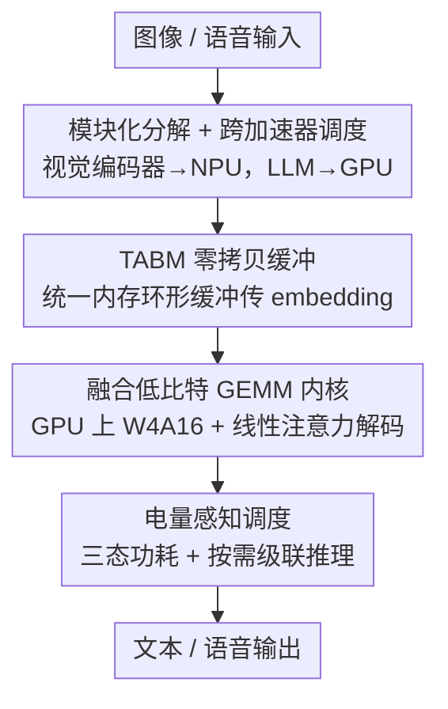

# Tiny but Mighty: A Software-Hardware Co-Design Approach for Efficient Multimodal Inference on Battery-Powered Small Devices

**会议**: ICLR 2026  
**OpenReview**: [https://openreview.net/forum?id=ql30VWGyda](https://openreview.net/forum?id=ql30VWGyda)  
**领域**: 多模态VLM / 端侧推理效率  
**关键词**: 软硬件协同设计, 异构加速器, 零拷贝, 端侧多模态, 低比特量化

## 一句话总结
本文提出 NANOMIND，把大型多模态模型（LMM）拆成视觉、投影、语言、音频四个独立"积木"，按各加速器（NPU/GPU/CPU）所长分别调度，并在统一内存上用零拷贝缓冲管理器（TABM）传递 embedding，配合自研硬件、低比特融合 GEMM 内核和电量感知调度，让一台 2000 mAh 电池供电的小设备完全离线跑多模态推理，端到端能耗比主流边缘框架降低 42.3%，低功耗模式下可续航近 18.8 小时。

## 研究背景与动机
**领域现状**：把 LLM/VLM 搬到端侧（手机、可穿戴、机器人）越来越重要——云端部署有隐私泄露风险，而本地推理能保数据不出端、实时响应。为此社区做了大量工作：参数高效的小模型（SmolVLM、Gemma-3-1B、Phi-3）、激进量化（AWQ、BitNet）、轻量推理框架（llama.cpp、MLC LLM）。

**现有痛点**：这些工作几乎全是软件/算法层优化，重心在低比特量化，却忽略了硬件层与软硬件联合设计。结果是：① 把整个模型当作一个 monolith 整体塞进单个加速器，无法利用现代 SoC 上的异构加速器（NPU 擅长 INT4/INT8 张量运算但浮点很慢，GPU 擅长大规模并行浮点）；② 大多数框架沿用服务器/PC 的"CPU 与 GPU 分离内存"假设，但现代边缘 SoC 用的是统一内存架构（UMA），CPU/GPU/NPU 共享同一块 DRAM——llama.cpp 这类框架在 UMA 下仍靠 CPU 管理 GPU 的数据搬运，offload 越多层内存开销反而越大；③ 功耗几乎从不被纳入考虑。

**核心矛盾**：LMM 内部模块（视觉编码器、投影层、语言解码器）计算特性各异、本就松耦合可拆，而 SoC 上的异构加速器各有所长——但现有部署却"一刀切"把整模型压到单一加速器上，造成硬件闲置、延迟升高、推理低效。

**本文目标**：在严苛的功耗与内存预算下，做一个端到端、全离线、模块级动态调度的多模态推理系统，把"模型该拆"和"硬件该各尽其用"这两件事真正打通。

**切入角度**：作者抓住两个观察——LMM 天生模块化、各模块可独立执行；不同加速器各有强项。于是不去改模型算法，而是在推理系统层做软硬件协同：把模型拆成"积木"，每块映射到最合适的计算单元，并针对 UMA 重新设计跨加速器的数据通路与功耗策略。

**核心 idea**：用"模块级跨加速器调度 + 统一内存零拷贝传递 + 电量感知执行"替代"整模型单加速器 monolith"，在端侧榨干异构硬件并把功耗压到最低。

## 方法详解

### 整体框架
NANOMIND 是一个端到端、软硬件协同的端侧推理框架。它自顶向下分三层：先做**模型分解**，把 LMM 拆成视觉编码器（SigLip ViT）、投影层、语言主干（Qwen2-0.5B）、音频（Whisper 语音转文字 + Piper 文字转语音）四类独立积木；再做**软硬件协调**，把视觉编码器固定 offload 到 NPU、把 LLM 解码 offload 到 GPU，中间用 Token-Aware Buffer Manager（TABM）在统一 DRAM 上零拷贝传递 embedding，并由一个轻量 CPU 调度器在性能/省电模式间动态切换；最后落到**自研硬件**（RK3566 SoC + 并行 LPDDR4x + 专用电源管理单元 PMU）。

整条多模态推理链是：相机/麦克风采集输入 → 视觉编码器在 NPU 上把图像编成 embedding → TABM 把 embedding 零拷贝交给 GPU → LLM 在 GPU 上用融合低比特 GEMM 内核解码生成答案 → 经 TTS 输出语音。电量感知调度器实时读 PMU 的电池电量，在三种功耗模式间仲裁，电量极低时退化为顺序的"按需级联推理"。

### 关键设计

**1. 模块化分解与跨加速器调度：让每块积木跑在最擅长它的加速器上**

针对"整模型单加速器导致硬件闲置、延迟高"的痛点，本文把 LMM 拆成视觉、投影、语言、音频四类独立模块，并把每块映射到最合适的计算单元。关键的固定策略是：视觉编码器（SigLip ViT）放 NPU，LLM 解码放 GPU。这背后有具体理由——移动 NPU 普遍只支持静态输入形状，输入尺寸一变就要重编译固件，对 LLM 的变长 prompt 是硬伤，但对固定分辨率图像的视觉编码器反而是天然契合点（所有图像统一预处理到 $448\times736$ 或 $384\times384$，多帧用平均时序池化合并）；而且 Rockchip 官方 RKNN 驱动对 CLIP/SigLip 的执行环境远比开源实现高效。反过来，LLM 因为 prompt 长度运行时变化，无法用 NPU 的静态形状，就交给擅长大规模并行浮点的 GPU。论文实测显示视觉编码器在 NPU 上明显快于 GPU 和 CPU，印证了模块级动态 offload 的必要性。

**2. Token-Aware Buffer Manager（TABM）：在统一内存上零拷贝传 embedding，绕开 CPU 瓶颈**

视觉编码器在 NPU 算完 embedding，LLM 在 GPU 要拿它当输入——传统 llama.cpp 在 UMA 下仍靠 CPU 管理缓冲写入和数据搬运，造成冗余拷贝和 CPU 阻塞。TABM 是一个轻量 CPU 运行时，在统一 DRAM 上维护一个共享环形缓冲池（ring buffer），把 NPU 当生产者、GPU 当消费者协调起来。它用四个状态跟踪每个缓冲槽（`FREE`、`ALLOCATED_FOR_WRITE`、`READY_TO_READ`、`ALLOCATED_FOR_READ`），并用轻量同步信号通知可用性：NPU 编码器把 embedding 直接写进某个槽，GPU 立刻把该槽 bind 为 LLM 输入，全程无冗余拷贝。这样既降低 CPU 负载、又压低延迟，还能平滑生产者-消费者的速率失配，维持高吞吐的 token 流水线——它正是"动态工作负载 offload"的核心。

**3. 融合低比特 GEMM 内核与混合量化：在缺低比特张量核的移动 GPU 上把每个字节变成有效计算**

移动 GPU 很少有快速 INT8 张量核，朴素的"先反量化、再 GEMM"会反复读写中间缓冲、拖慢内存受限的端侧推理。本文在 llama.cpp 的 ggml/GGUF 格式上扩了一套 OpenCL 后端，做两件事：① **融合 dequant-GEMM**——在 GEMM 循环内于寄存器里直接解包并重缩放 int4 权重，紧接着做 FP16 FMA，消除中间缓冲与多趟内存访问，用分块向量加载、常量/LDS 内存里的 scale 表、可融合 bias 与激活的 epilogue，并用 FP16/FP32 累加器保稳定；② **线性注意力**——用核化线性注意力替代标准二次注意力，省掉显式的 $T\times T$ 注意力矩阵构造，降低内存流量、稳定长序列解码延迟，且在测试基准上无统计显著的精度下降。配合**混合量化**——因为模型已拆成模块，可对不同模块用不同精度：视觉编码器（NPU 上 RKNN 格式）用 FP16 或 8-bit 保住图像理解精度，LLM（GPU 上 GGUF 格式）用 4-bit（W4A16）甚至 2/3-bit，因为可穿戴/边缘场景复杂推理少、4-bit 已是内存与精度的最佳平衡点。

**4. 电量感知调度与按需级联推理：把功耗当一等公民，电量越低越省**

端侧最稀缺的是电，但现有框架几乎不管功耗。NANOMIND 借助板载 PMU 实时读电池电量 $B$，用三态策略仲裁性能与续航的 trade-off：① **无约束性能态**（$B>T_{high}$）满负荷并行 offload 到各加速器；② **比例节流态**（$T_{low}<B\le T_{high}$）用缩放因子 $\alpha=(B-T_{low})/(T_{high}-T_{low})$ 线性插值相机帧率与内存读写速率，平滑降级；③ **临界保命态**（$B\le T_{low}$）启用"按需级联推理"。后者是事件触发的"一次性推理"模式：系统大部分时间超低功耗待机，单个 CPU 核等相机/麦克风事件（如唤醒词），触发时相机只抓单帧（关掉时序池化），各模块（Whisper、ViT、LLM）依次走"load → execute → release"生命周期，每块算完立即释放硬件、只把最小输出（文本或 embedding）传给下一级，形成轻量的 domino 式级联，把峰值内存与功耗压到最低。正是这个模式让低占空比工作负载下平均功耗只有 0.375 W、续航近 18.8 小时。

### 损失函数 / 训练策略
本文不修改模型算法、不做训练，纯粹是推理系统层的软硬件协同优化——所有增益来自调度、内存通路、内核与功耗策略，模型权重直接取自 Hugging Face 的现成 LLaVA-OneVision / Qwen2-VL。

## 实验关键数据

实验采用"自底向上"三维度评估：资源使用、不同 offload 策略下的精度、不同运行条件下的功耗。数据集包括 InfoVQA、DocVQA、MMBench、MME、MMLU；硬件平台对比 NANOMIND（RK3566）、Orange Pi 5 Ultra（RK3588）、Nvidia Jetson Nano/AGX（AGX 作性能上界参考）。

### 主实验

| 维度 | 配置 | 结果 | 对照 |
|------|------|------|------|
| 端到端能耗 | NANOMIND vs 主流边缘框架/开发板 | 降低 **42.3%** | — |
| 端到端延迟 | Qwen2-VL-2B(4-bit), InfoVQA | 比 Orange Pi 5 Ultra(官方 rkllm)降 **36.2%** | 吞吐 ≈ Jetson Nano + NanoVLM(CUDA) 35.7 tok/s |
| 低功耗续航 | 按需级联模式, 2000 mAh 电池 | 平均 **0.375 W**, 约 **18.8 小时** | 跨加速器并行模式仅约 2.4 小时 |
| 单图视觉编码延迟 | SigLip / ArcFace | NPU < GPU < CPU | NPU 最快，印证视觉编码 offload 到 NPU |

### 消融实验

| 配置 | 关键指标 | 说明 |
|------|---------|------|
| TABM 零拷贝 vs llama.cpp 拷贝式 offload | 内存占用、CPU 利用率 | TABM 内存更低、embedding 传递时 CPU 负载显著下降 |
| 融合 dequant-GEMM 内核 vs llama.cpp / MLC-LLM / PowerInfer-2 | 吞吐(tok/s), Qwen2-1.5B-W8A8 | 本文内核吞吐最高，PowerInfer-2 紧随；MLC-LLM 在 Qualcomm GPU 上较差（OpenCL 支持弱） |
| 混合量化（em-/vis-/dec- 各模块不同精度） | MMBench/MMLU/MME/InfoVQA | 视觉相关任务精度主要由 ViT 精度决定，故 ViT 保高精度、LLM 用 4-bit |

### 关键发现
- **TABM 是端侧内存优化的主力**：llama.cpp 在所有平台都吃内存更多，NANOMIND 靠环形缓冲优化共享内存把占用压下来；offload 越多层 llama.cpp 内存涨得越凶（如 Llama-3-8B 2-bit 从 2.9GB 涨到 5.5GB），恰说明 UMA 下传统拷贝式 offload 的反效果。
- **模块拆分让混合量化成为可能**：拆开后视觉任务精度几乎只取决于 ViT 精度，于是"ViT 保精度 + LLM 激进量化"成为性价比最优组合。
- **功耗模式切换带来数量级续航差**：并行模式约 2.4 小时，按需级联模式做到 18.8 小时，差距来自"待机 + 事件触发 + load/execute/release"的级联设计。

## 亮点与洞察
- **把"模型本就模块化"和"硬件本就异构"两个事实对上号**：别人把 VLM 当 monolith 压进单加速器，本文识别出视觉编码器固定形状恰好补上移动 NPU"只支持静态输入"的短板——这个"痛点变契合点"的洞察很巧。
- **针对 UMA 重新设计数据通路**：跳出"CPU/GPU 分离内存"的服务器思维，用环形缓冲 + 状态机做真正的零拷贝生产者-消费者，直击 llama.cpp 在统一内存下"越 offload 越慢"的病根。
- **功耗当一等公民**：三态电量感知 + 按需级联的 load/execute/release 生命周期，是可穿戴/IoT 场景里很实用、可直接迁移的工程范式。
- **融合 dequant-GEMM 在寄存器内解包**这一招，对所有缺低比特张量核的移动 GPU 都通用，可复用到其他端侧 LLM 部署。

## 局限与展望
- **强绑定特定硬件栈**：原型基于 RK3566（另在 RK3588 上验证关键组件），调度策略、RKNN 转换、内核都是为这套 SoC 定制，迁到 Apple Silicon、Qualcomm 等需要重写 offload 策略和驱动适配。
- **调度策略偏静态**：视觉→NPU、LLM→GPU 是固定映射，论文也提到 per-operator 的 NPU/CPU 切分（如 llm.npu）与本文 per-module 放置是互补的、原则上可结合，但本文未做这种更细粒度的联合调度。
- **评测以系统指标为主**：精度评估相对简略（主要论证混合量化不掉点），缺少在更复杂多模态推理任务上的深入精度分析；功耗续航数字依赖特定低占空比工作负载假设。
- **改进思路**：把 per-module 放置与 per-operator/per-neuron 切分（PowerInfer-2 风格）结合，做端到端联合调度；让 offload 策略随负载在线学习而非固定映射。

## 相关工作与启发
- **vs llm.npu / PowerInfer-2**: 它们在单个 LLM *内部*做异构 offload（算子级、张量级、神经元级），本文做的是 LMM *跨多模态模块*的异构 offload（视觉/投影/语言/音频）。作者明确指出两者互补——算子级 NPU/CPU 切分和模块级加速器放置原则上可叠加。
- **vs llama.cpp / MLC LLM**: llama.cpp 提供层级 offload 但在 UMA 下工作负载分配低效（GPU 执行仍依赖 CPU 管理的数据搬运），MLC LLM 靠 TVM 部署但资源开销重、端侧不实用；本文保留 GGUF 格式复用其量化模型生态，但重写了面向 UMA 的零拷贝后端与 OpenCL 内核。
- **vs 纯量化工作（AWQ / BitNet / GPTQ）**: 它们只在软件/算法层降比特，本文不改模型算法，而是在推理系统层做软硬件协同，并把这些量化方法（GPTQ 4-bit、BitNet 1.58-bit、ggml 2/3/4-bit）作为可选后端纳入混合量化框架。

## 评分
- 新颖性: ⭐⭐⭐⭐ 模块级跨加速器调度 + UMA 零拷贝 + 电量感知的系统级组合较新，单点技术多为已有思路的工程整合。
- 实验充分度: ⭐⭐⭐⭐ 多平台、多模型、含系统分解消融，但精度评估偏弱、功耗数字依赖特定工作负载假设。
- 写作质量: ⭐⭐⭐⭐ 自顶向下讲设计、自底向上做实验，结构清晰；部分内核/硬件细节较碎。
- 价值: ⭐⭐⭐⭐ 给出端侧全离线多模态推理的可落地软硬件协同范式，18.8 小时续航对可穿戴/IoT 很有实用意义。

<!-- RELATED:START -->

## 相关论文

- [\[CVPR 2026\] SegMo: Co-Designing Content-Aware Sparsity and Locally-Cohesive Segment Parallelism for Efficient VLM Inference](../../CVPR2026/vlm_efficiency/segmo_co-designing_content-aware_sparsity_and_locally-cohesive_segment_paralleli.md)
- [\[ACL 2026\] MACS: Modality-Aware Capacity Scaling for Efficient Multimodal MoE Inference](../../ACL2026/vlm_efficiency/macs_modality-aware_capacity_scaling_for_efficient_multimodal_moe_inference.md)
- [\[ICLR 2026\] Photon: Speedup Volume Understanding with Efficient Multimodal Large Language Models](photon_speedup_volume_understanding_with_efficient_multimodal_large_language_mod.md)
- [\[CVPR 2026\] NuWa: Deriving Lightweight Class-Specific Vision Transformers for Edge Devices](../../CVPR2026/vlm_efficiency/nuwa_deriving_lightweight_class-specific_vision_transformers_for_edge_devices.md)
- [\[ACL 2025\] HotelMatch-LLM: Joint Multi-Task Training of Small and Large Language Models for Efficient Multimodal Hotel Retrieval](../../ACL2025/vlm_efficiency/hotelmatch_llm_retrieval.md)

<!-- RELATED:END -->
