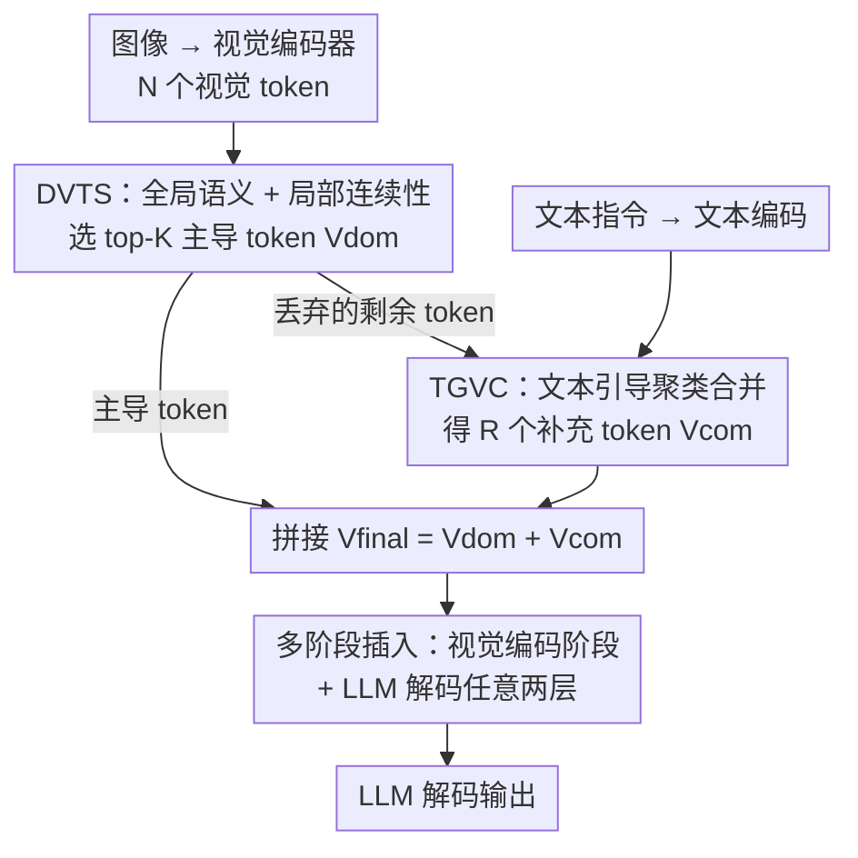

# VisionTrim: Unified Vision Token Compression for Training-Free MLLM Acceleration

**会议**: ICLR 2026  
**OpenReview**: [https://openreview.net/forum?id=57IXIg6nZ0](https://openreview.net/forum?id=57IXIg6nZ0)  
**代码**: https://github.com/hanxunyu/VisionTrim  
**领域**: 多模态VLM / 视觉 token 压缩 / MLLM 推理加速  
**关键词**: 视觉 token 压缩, 免训练加速, 文本引导剪枝, 局部空间连续性, 多阶段剪枝

## 一句话总结
VisionTrim 是一个免训练的多模态大模型（MLLM）加速框架，用 DVTS（兼顾全局语义和局部空间连续性挑选主导视觉 token）+ TGVC（用文本引导把被丢弃的 token 聚类合并成补充 token）两个即插即用模块，在视觉编码和 LLM 解码两个阶段同时压缩视觉 token，在 LLaVA-1.5 上砍掉 88.9% 视觉 token 仍能保持 98.8% 的平均性能。

## 研究背景与动机

**领域现状**：当前 MLLM 把图像/视频编码成一长串视觉 token 喂给 LLM，但视觉 token 往往主导了整个输入序列长度——高分辨率图像和长视频场景尤为严重，导致 Transformer 的二次复杂度推理成本爆炸。为此，一批免训练的视觉 token 压缩方法被提出来，比如 FasterVLM、VisionZip 在视觉编码后用 [CLS] 注意力挑主导 token，FastV、SparseVLM 在 LLM 解码阶段按注意力权重剪 token。

**现有痛点**：这些方法几乎都只盯着 MLLM 流水线的**某一个孤立环节**——要么只管视觉编码阶段，要么只管 LLM 解码阶段，没有把整条前向传播当成一个整体来优化。即便是同期的两阶段方法 VScan，也在视觉编码阶段忽略了文本 query 对挑 token 的帮助，并在解码阶段直接拿所有视觉 token 与最后一个指令 token 的注意力来剪，容易把和文本强相关的关键视觉 token 误删。

**核心矛盾**：问题的根本在于**视觉 token 选择与文本指令的对齐被忽视了**。像 PyramidDrop 这类 text-agnostic 方法完全不看文本就剪 token，会丢掉对 LLM 解码至关重要的文本上下文；而 CrossGET、Turbo 这类直接用文本-视觉注意力的方法又走向另一个极端，过度强调文本 token，引发幻觉、破坏多轮交互。如何既保住视觉本身的完整性、又与文本指令对齐，是一对没被同时解决的张力。

**本文目标**：构建一个统一框架，在视觉编码和 LLM 解码两个阶段都能压缩 token，且压缩时既保留全局语义与局部空间结构，又对齐文本指令。

**切入角度**：作者把视觉 token 压缩拆成两件互补的事——一是**挑出最该保留的主导 token**（这一步要同时看全局重要性和局部空间连续性，不能只靠 [CLS] 注意力），二是**别浪费被丢弃的 token**（用文本指令把它们里和问题相关的内容聚合回来作补充）。

**核心 idea**：用「全局+局部双视角选主导 token」+「文本引导补全丢弃 token」两个即插即用模块，覆盖整条 MLLM 流水线，实现免训练加速。

## 方法详解

### 整体框架

VisionTrim 的目标是：在不重新训练 MLLM 的前提下，把视觉 token 序列从 $N$ 个压到 $K+R$ 个，且压缩后既保住关键视觉信息又与文本对齐。它由两个即插即用模块串联组成，可以插在视觉编码器或 LLM 任意两层之间。

整条流程是：图像经视觉编码器得到 $N$ 个视觉 token，文本经分词器/CLIP 文本编码器得到文本 token；**DVTS 模块**先给每个视觉 token 打一个融合了全局语义（[CLS] 注意力）和局部空间连续性（LTAM）的重要性分，选出 top-$K$ 个主导 token $V_{dom}$；剩下被丢弃的 token 交给 **TGVC 模块**，用文本引导把它们聚类合并成 $R$ 个补充 token $V_{com}$；最后把两者拼成 $V_{final}=[V_{dom};V_{com}]$ 送入后续层。这套「选主导 + 文本补全」的组合既能用在视觉编码阶段（LLM 之前），也能插在 LLM 解码的某两层之间——后者把 [CLS] 注意力替换成「首个生成 token」的注意力作为全局语义度量，从而构成多阶段剪枝。

### 关键设计

**1. DVTS 主导 token 选择：全局语义与局部空间连续性双视角打分**

只用 [CLS] 注意力挑 token（如 FasterVLM）会偏向全局显著区域，丢掉空间上连续但单点不显著的细节。DVTS 针对这一痛点，给每个视觉 token 算一个融合两种信号的分数。**全局语义重要性**沿用 [CLS] token 的注意力——从 CLIP 视觉编码器倒数第二层取出 [CLS] 对所有视觉 token 的注意力，跨 $H$ 个头平均得到 $S^g_i=\frac{1}{H}\sum_{h=1}^{H}A^{L-1}_{[CLS],i,h}$，再 softmax 归一化成 $\hat{S}^g_i$。**局部空间连续性**则由作者提出的 LTAM（Local Token Affinity Measurement）算法刻画：在每个 token 周围 $k\times k$ 邻域内，用一个双核亲和度同时衡量特征相似度 $\kappa_{feat}$ 和位置邻近度 $\kappa_{pos}$，

$$\kappa^{xy,uv}_{feat}=-\left(\frac{\lVert F_{xy}-F_{uv}\rVert}{w_1\sigma_f}\right)^2,\quad \kappa^{xy,uv}_{pos}=-\left(\frac{\lVert P_{xy}-P_{uv}\rVert}{w_2\sigma_p}\right)^2,$$

两者加权合成 $\kappa^*$ 后在邻域上平均得到局部分 $S^l_i$。这样既保住了语义上重要的 token，也保住了空间上成片连续的视觉细节，避免把目标区域剪得支离破碎。

**2. 自适应方差加权：让更可靠的信号自动占主导**

全局分和局部分该各占多少权重，是个没有先验答案的问题——固定权重在不同图像上未必合适。作者的做法是用两类分数自身的方差来自适应分配：

$$S_i=\alpha\hat{S}^g_i+(1-\alpha)S^l_i,\quad \alpha=\frac{\sigma^2_l}{\sigma^2_g+\sigma^2_l}.$$

直觉是：哪类信号的方差大（即区分度高、更"有话说"），就让它在融合分里占更大权重，从而自动偏向当前图像上更可靠的那个视角。融合后的 $\{S_i\}$ 用来选 top-$K$ 主导 token $V_{dom}$。消融显示这种自适应加权显著优于「只用 [CLS]」「逐元素取最大」「几何平均」等固定策略（POPE 从 74.2 提到 86.2）。

**3. TGVC 文本引导视觉补全：把丢弃的 token 按文本相关性聚回来**

主导 token 抓住了主要视觉信息，但未必涵盖与当前问题相关的所有细节，被 DVTS 丢弃的 token 里可能藏着回答问题必需的内容。TGVC 针对这一点，用文本指令把丢弃 token 中相关的部分聚合回来。具体地，对剩余 token $V_r$，先算它们与文本特征的相似度 $S_{t2v}=\text{softmax}(TV_r^T/\sqrt{d})$，跨所有文本 token 平均得到 token 级重要性分，选 top-$R$ 个作为聚类中心 $C=\{c_1,...,c_R\}$；再用文本引导的相似度 $a_{ij}=S^i_{v2t}S^j_{t2c}$ 把每个剩余 token 分配给最相似的中心，并按相似度加权聚合：

$$v^{com}_j=c_j+\sum_{v_i\in cluster(j)}\frac{a_{ij}}{\sum_{v_k}a_{kj}}v_i.$$

迭代 $T$ 轮细化后得到 $R$ 个补充 token $V_{com}$，与 $V_{dom}$ 拼成最终表示。和 CrossGET/Turbo 直接拿文本-视觉注意力压 token 不同，TGVC 只用文本来**引导被丢弃 token 的二次聚合**，而非主导整体选择，因此既增强了视觉-文本对齐、又不会过度依赖文本而引发幻觉。消融里单独加上 TGVC 能让 POPE 平均涨 3.7 分、token 越少涨得越多（64 token 时 +4.1）。

**4. 多阶段剪枝策略：同一组模块覆盖视觉编码与 LLM 解码两个阶段**

前面三点解决了「怎么选 token」，这一点解决「在哪剪」。作者把 DVTS+TGVC 设计成可插在两个阶段：**视觉编码阶段**在 LLM 之前就把 $N$ 个 token 压到 $K+R$ 个；**LLM 解码阶段**插在某两层 Transformer 之间动态剪 token，此时由于没有 [CLS] token，改用「首个生成 token」对所有图像 token 的注意力 $S^g=\text{softmax}(H^l_{gen}H^{l\top}_v/\sqrt{D})$ 当全局语义度量，并用视觉-文本交叉注意力 $\alpha_i=\frac{1}{N_t}\sum_j A_{i,j}$ 给 TGVC 提供文本引导。消融表明两个阶段都剪（Both in ViT and LLM）比只在 ViT 或只在 LLM 剪都更好——同样压到 64 token，双阶段 GQA 58.8 / POPE 86.2，明显高于单阶段，且 KV Cache 降到 30.2 MB（↓90.1%）。

### 一个完整示例

以「这架飞机是什么类型和颜色？」配一张飞机图为例：视觉编码器先输出 $N=576$ 个 token；DVTS 用 [CLS] 注意力 + LTAM 局部亲和选出比如 $K=48$ 个覆盖飞机主体和背景关键区域的主导 token；剩下的 528 个被丢弃 token 里，TGVC 用文本「飞机/类型/颜色」算相似度，挑出 $R=16$ 个最相关的当聚类中心（更多落在机身、机翼这些和"颜色/类型"相关的区域），把剩余 token 聚类加权合并成 16 个补充 token；最终 $48+16=64$ 个 token 送进 LLM——既保住了画面主体，又把和提问强相关的飞机细节"找补"了回来。

## 实验关键数据

### 主实验

LLaVA-1.5-7B（原始 576 token）在不同保留 token 数下与 SOTA 对比（10 benchmark 平均，相对 vanilla 的百分比）：

| 保留 token | SparseVLM | VisionZip | PDrop | VScan | 本文 (Ours) |
|--------|------|------|------|------|------|
| 192 (↓66.7%) | 96.4% | 98.3% | 97.6% | 98.9% | **100.6%** |
| 128 (↓77.8%) | 94.2% | 97.2% | 96.5% | 98.6% | **99.9%** |
| 64 (↓88.9%) | 86.7% | 94.4% | 90.8% | 96.8% | **98.8%** |

token 砍得越狠优势越明显：保留 64 token 时本文领先次优的 VScan 2 个百分点，POPE/SQA/TextVQA 等基准甚至不降反升，印证了喂给 LLM 的视觉 token 存在严重冗余。高分辨率 LLaVA-NeXT-7B（2880 token）上仅用 22.2% token 保住 99.9% 性能；保留 160 token（↓94.4%）时仍达 94.0%，比次优 VisionZip 高 3.3 个百分点。视频模型 Video-LLaVA-7B 上平均保 100.9% 性能，比次优高 6.7 个百分点。Qwen2-VL / Qwen2.5-VL 上用约 1/3 token 也几乎无损（MMBench 82.8 vs vanilla 80.7）。

### 消融实验

| 配置 | GQA | MMB | POPE | KV Cache | 说明 |
|------|------|------|------|------|------|
| Vanilla (576 token) | 61.9 | 64.7 | 85.9 | 303.6 MB | 完整模型 |
| 只在 ViT，w/ DVTS | 52.8 | 55.6 | 76.1 | 25.4 MB | 单阶段、仅主导选择 |
| 只在 ViT，w/ DVTS+TGVC | 56.9 | 60.2 | 80.2 | 25.4 MB | 加 TGVC 后明显回升 |
| 只在 LLM，w/ DVTS+TGVC | 57.4 | 61.1 | 79.2 | 43.5 MB | 单阶段（解码侧） |
| **Both in ViT and LLM** | **58.8** | **63.0** | **86.2** | 30.2 MB | 双阶段（完整 VisionTrim） |

DVTS 融合策略消融（保留 64 token）：只用 [CLS] token POPE 仅 74.2，逐元素取最大 77.6，几何平均 80.2，自适应方差加权达到 86.2——证明方差自适应是 DVTS 的关键。TGVC 单独消融（视觉编码阶段）显示 token 越少增益越大：POPE 在 32 token 时 +4.4，平均 +3.7。

### 关键发现
- **双阶段 > 单阶段**：同样压到 64 token，在视觉编码和 LLM 解码两处都剪，比只在任一处剪都更好，且 KV Cache 降到 30.2 MB（↓90.1%），说明两个阶段的冗余是互补的。
- **自适应方差加权是 DVTS 的命门**：把固定融合换成按方差自适应，POPE 直接从 74.2 跳到 86.2，远超几何平均/取最大等启发式。
- **token 越少，文本引导越值钱**：TGVC 在 32 token 时增益（+4.4）远大于 192 token（+3.1），极限压缩下"把丢弃 token 找补回来"才真正体现价值。

## 亮点与洞察
- **"选主导 + 补丢弃"的二分视角很巧**：大多数方法只想着"选对该留的"，VisionTrim 多走一步——既然丢弃的 token 里也有和问题相关的内容，就用文本把它们聚合回来，把"剪枝"变成"剪枝+补全"，这套思路可迁移到任意 token 稀疏化场景。
- **用方差做自适应权重**：不引入额外可学习参数、纯靠两路分数自身的统计量决定谁更可信，是个免训练框架里特别干净的 trick，可复用到任何需要融合多来源打分的场合。
- **同一组模块跨阶段复用**：把 [CLS] 注意力在解码阶段无缝替换成"首个生成 token"的注意力，让一套设计同时服务视觉编码和 LLM 解码两个本质不同的阶段，工程上很优雅。

## 局限与展望
- 方法依赖 CLIP 风格的视觉/文本编码器提供 [CLS] 注意力和文本-视觉相似度，对没有显式 [CLS] 或注意力不易取出的架构需要额外适配（解码阶段已给出一种替代）。
- TGVC 的聚类要迭代 $T$ 轮并涉及文本-视觉相似度矩阵计算，在极长文本指令或超多剩余 token 时本身也有开销，论文未充分讨论补全模块的额外延迟占比。
- 多个超参（$K$、$R$、邻域 $k\times k$、$w_1/w_2/w_3$、迭代轮数 $T$）需要按模型/任务设定，免训练但非免调参；不同基准下的最优配置敏感性可进一步分析。

## 相关工作与启发
- **vs FasterVLM / VisionZip**: 他们只在视觉编码后用 [CLS] 注意力选主导 token，本文额外引入 LTAM 局部空间连续性 + 自适应方差加权，并补上 TGVC 文本补全，覆盖整条流水线而非单一环节。
- **vs FastV / SparseVLM**: 他们只在 LLM 解码阶段按注意力剪 token，本文是视觉编码 + LLM 解码双阶段，且解码阶段用"首个生成 token"注意力而非末位指令 token，减少误删文本相关 token。
- **vs VScan**: 同为两阶段，但 VScan 在编码阶段忽略文本 query、解码阶段用全体视觉 token 对末位指令 token 的注意力剪，本文则在两个阶段都引入文本引导，避免丢失文本相关视觉 token。
- **vs CrossGET / Turbo**: 他们直接用文本-视觉注意力主导 token 选择，过度强调文本易致幻觉、破坏多轮交互；本文让文本只引导"丢弃 token 的二次聚合"，主导选择仍由全局+局部视觉信号负责，对齐更稳。

## 评分
- 新颖性: ⭐⭐⭐⭐ "选主导 + 文本补全丢弃 token"的二分视角和自适应方差加权都有新意，但整体仍在 token 压缩这一成熟赛道内组合改进。
- 实验充分度: ⭐⭐⭐⭐⭐ 覆盖标准/高分辨率/视频 5 类 MLLM、10+ 图像与 4 视频基准，消融完整（双阶段、融合策略、TGVC、KV Cache 都有）。
- 写作质量: ⭐⭐⭐⭐ 框架清晰、公式完整，模块命名和图示直观。
- 价值: ⭐⭐⭐⭐⭐ 免训练即插即用、极限压缩下仍近无损，对 MLLM 实际部署有直接落地价值。

<!-- RELATED:START -->

## 相关论文

- [\[AAAI 2026\] Filter, Correlate, Compress: Training-Free Token Reduction for MLLM Acceleration](../../AAAI2026/vlm_efficiency/filter_correlate_compress_training-free_token_reduction_for_.md)
- [\[ICLR 2026\] Enhancing Visual Token Representations for Video Large Language Models via Training-free Spatial-Temporal Pooling and Gridding](enhancing_visual_token_representations_for_video_large_language_models_via_train.md)
- [\[CVPR 2026\] UniCompress: Token Compression for Unified Vision-Language Understanding and Generation](../../CVPR2026/vlm_efficiency/unicompress_token_compression_for_unified_vision-language_understanding_and_gene.md)
- [\[ICLR 2026\] Prune Redundancy, Preserve Essence: Vision Token Compression in VLMs via Synergistic Importance-Diversity](prune_redundancy_preserve_essence_vision_token_compression_in_vlms_via_synergist.md)
- [\[ICLR 2026\] PPE: Positional Preservation Embedding for Token Compression in Multimodal Large Language Models](ppe_positional_preservation_embedding_for_token_compression_in_multimodal_large_.md)

<!-- RELATED:END -->
