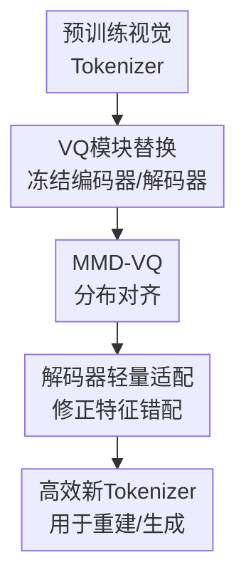

# VQ-Transplant: Efficient VQ-Module Integration for Pre-trained Visual Tokenizers

**会议**: ICLR2026  
**OpenReview**: [https://openreview.net/forum?id=eETr3lrOQB](https://openreview.net/forum?id=eETr3lrOQB)  
**代码**: 待发布  
**领域**: VLM效率 / 视觉Tokenizer / 向量量化  
**关键词**: 视觉Tokenizer, 向量量化, VQ模块替换, MMD-VQ, 高效训练  

## 一句话总结
VQ-Transplant 把预训练视觉 tokenizer 的 encoder-decoder 固定住，只替换并轻量适配 VQ 模块，使新量化算法能以约 22 小时训练成本接入 VAR 这类强 tokenizer，同时用 MMD-VQ 在 ImageNet-1K 上达到 0.81 r-FID，超过原始 VAR tokenizer 的 0.92 r-FID。

## 研究背景与动机
**领域现状**：离散视觉 tokenizer 是自回归图像生成、视频生成和多模态模型中的关键前端，它把连续图像特征压成离散 token，再交给后续生成或理解模型使用。现代高质量 tokenizer 通常沿用 VQGAN / VAR 这条路线：encoder 产生 latent feature，VQ 模块查 codebook 得到离散表示，decoder 再把量化特征重建成图像，并依赖感知损失和对抗训练提升视觉质量。

**现有痛点**：问题在于，大家想研究的是“更好的 VQ 算法”，但实际训练时往往必须把 encoder、VQ module、decoder 当成一个整体从头训练。以 VAR、UniTok、ImageFolder 这类 tokenizer 为例，训练动辄需要多卡 A100 和几十到数百小时；而且对抗训练本身不稳定，调参成本很高。这样一来，VQ 算法研究被整套 tokenizer 的训练预算绑住，资源较少的研究者很难快速验证一个新 codebook 更新规则或分布对齐损失。

**核心矛盾**：VQ 模块从结构上看只是 tokenizer 中间的一块，但它和 decoder 的输入分布高度耦合。直接把原 tokenizer 里的 VQ 模块拿掉、换成一个新算法，量化误差可能下降，decoder 却未必能正确解读新的量化 latent，因为 decoder 训练时见到的是旧 codebook 产生的特征分布。这就是“可替换性”和“decoder 兼容性”之间的矛盾。

**本文目标**：作者要解决的不是重新设计一个完整 tokenizer，而是回答一个更工程化也更有研究价值的问题：能不能把 VQ 算法开发从大规模 tokenizer 训练中解耦出来？具体来说，方法需要支持任意新 VQ 模块插入预训练 tokenizer，尽量保留原 encoder-decoder 的能力，只用少量训练消除新量化空间和旧 decoder 之间的错配，并且最终重建质量不能明显低于从头训练的大模型 tokenizer。

**切入角度**：本文的关键观察是，预训练 tokenizer 中最昂贵也最有价值的部分其实是 encoder-decoder 已经学到的图像先验，未必每次研究 VQ 都要重新学习一遍。只要新 VQ 模块先在冻结 encoder 的特征空间中学到合理 codebook，再让 decoder 对新量化空间做短程适配，就有机会把训练成本从“重训整套 tokenizer”降到“替换中间模块 + 小步校准”。

**核心 idea**：VQ-Transplant 用“冻结预训练 tokenizer、移植新 VQ 模块、轻量适配 decoder”的两阶段流程，让新量化算法像器官移植一样接入已有视觉 tokenizer；同时提出 MMD-VQ，用非参数分布匹配提高新 codebook 与 encoder 特征的兼容性。

## 方法详解

### 整体框架
VQ-Transplant 面向一个已经训练好的离散视觉 tokenizer，它包含 encoder $E_{\theta^*}$、原生 VQ 模块 $Q_{\phi^*}^{pretrain}$ 和 decoder $D_{\varphi^*}$。方法先冻结预训练 encoder 和 decoder，把原生 VQ 模块替换为新模块 $Q_{\phi}^{new}$ 并单独训练；随后继续冻结 encoder 和新 VQ 模块，只微调 decoder，让它重新适应新量化 latent 的统计特性。

这套流程的重点不是让所有参数一起变好，而是有意识地把“学习新 codebook”和“校准 decoder”拆开。第一阶段让 VQ 模块贴近冻结 encoder 输出的特征分布，第二阶段把这种量化空间变化传递给 decoder，避免直接替换后出现模糊、细节丢失或 r-FID 退化。

### 关键设计
**1. VQ模块替换：把量化算法研究从整套 tokenizer 重训中拆出来**

传统 VQ tokenizer 训练把 encoder、codebook、decoder 和对抗判别器绑在一起优化，研究者想测试一个新 VQ 损失时，往往也被迫承担完整重训成本。VQ-Transplant 的第一步反过来做：给定预训练 tokenizer，只保留它的 encoder $E_{\theta^*}$ 和 decoder $D_{\varphi^*}$，把原生 VQ 模块 $Q_{\phi^*}^{pretrain}$ 替换成新模块 $Q_{\phi}^{new}$。对输入图像 $x$，冻结 encoder 产生 $z_e=E_{\theta^*}(x)$，新 VQ 模块输出量化 latent $z_q(\phi)=Q_{\phi}^{new}(z_e)$。

这一阶段只训练新 VQ 模块，目标是让 codebook 既贴近 encoder 特征，又避免 codebook collapse。论文把目标写成 $L_{VQ}(\phi)=\|sg(z_e)-z_q(\phi)\|_2^2+\gamma L_{unique}(Q_{\phi}^{new})$，其中 $sg(\cdot)$ 是 stop-gradient，$L_{unique}$ 可以是 Wasserstein VQ 或本文 MMD-VQ 的分布对齐项。这样做的好处是非常直接：新 VQ 算法可以在强 tokenizer 的 latent 空间中被评估，而不必每次都重新训练一个 encoder-decoder；但代价也很明确，第一阶段结束后 decoder 还没有真正适应新量化空间，所以重建质量不一定马上变好。

**2. MMD-VQ：用非参数分布匹配提高新 codebook 的可移植性**

作者认为，适合移植的 VQ 模块不仅要降低最近邻量化误差，还要让 codebook 分布和 encoder 特征分布尽量一致。已有 Wasserstein VQ 也从分布匹配角度出发，但它为了可训练性假设特征和 codebook 近似高斯，最后主要对齐均值和协方差。这个假设在标准视觉 latent 上有时够用，但如果特征是多峰、重尾或明显非高斯，单靠一二阶统计会漏掉更高阶结构。

MMD-VQ 用 Maximum Mean Discrepancy 来替代这种高斯化 Wasserstein 对齐。设 encoder 收集到的特征向量为 $X=\{z_1,\ldots,z_N\}$，codebook 向量为 $Y=\{e_1,\ldots,e_K\}$，MMD 距离为 $D^2_{MMD}(X,Y)=\frac{1}{N^2}\sum_{i,j}k(z_i,z_j)+\frac{1}{K^2}\sum_{i,j}k(e_i,e_j)-\frac{2}{NK}\sum_{i,j}k(z_i,e_j)$。当 $k(\cdot,\cdot)$ 是特征核时，$D^2_{MMD}=0$ 当且仅当两个分布一致；论文用 multi-Gaussian kernel，把 $L_{unique}$ 设成 $D^2_{MMD}(X,Y)$。直观上，MMD-VQ 不是只把 codebook 的均值和方差拉到 feature 上，而是让 codebook 在核空间里覆盖 feature 分布的整体形状，因此更适合做“移植后仍能被 decoder 消费”的量化模块。

**3. 解码器轻量适配：把低量化误差真正转化为重建质量**

只替换 VQ 模块会暴露一个容易被忽略的问题：量化误差变小不等于图片重建更好。论文在 Table 3 中显示，MMD VAR 替换后量化误差从原 VAR 的 0.283 降到 0.234，但替换阶段的 r-FID 仍是 1.49，差于原 VAR 的 0.92。这说明 decoder 的先验仍然围绕旧 VQ 模块产生的 latent 分布建立，直接喂给它“更好但不同”的量化特征，会导致视觉细节和高频结构损失。

因此第二阶段固定 encoder $E_{\theta^*}$ 和已经训练好的新 VQ 模块 $Q_{\phi^*}^{new}$，只从原 decoder 参数 $\varphi^*$ 初始化并微调 decoder $D_\varphi$。重建为 $\hat{x}(\varphi)=D_\varphi(Q_{\phi^*}^{new}(E_{\theta^*}(x)))$，优化目标是 $L_{Decoder}(\varphi)=\|\hat{x}(\varphi)-x\|_2^2+\lambda_P L_{Per}(\varphi)+\lambda_G L_{GAN}(\varphi)$。作者沿用 VAR / LlamaGen 系列的 DINO-S 风格冻结判别器，并配合 DiffAug、consistency regularization 和 LeCAM regularization。核心点在于训练量很小：ImageNet-1K 上只做 5 个 epoch 的 decoder adaptation，就能把 MMD VAR 8192 codebook 的 r-FID 从替换阶段 1.49 拉到 0.81。

**4. 固定尺度与多尺度 VQ 统一接入：证明框架不是只服务于单一 tokenizer 形态**

VAR tokenizer 的原生量化是 multi-scale VQ，而很多传统 VQ 方法是 fixed-scale。为了证明 VQ-Transplant 不是只会替换同构模块，作者同时实现了多尺度和固定尺度两类移植。多尺度实验直接替换 VAR 的 multi-scale VQ；固定尺度实验则把 32 维特征拆成两个 16 维子向量，分别经过独立 VQ 模块后再拼回 decoder 输入。

这个设计让同一框架可以评估 Vanilla VQ、EMA VQ、Online VQ、Wasserstein VQ 和 MMD-VQ 等多种量化算法。实验结果也形成一个一致结论：无论 multi-scale 还是 fixed-scale，分布对齐型 VQ 都更适合移植；但无论哪种 VQ，只要只做 substitution 而不做 decoder adaptation，重建指标都会受到 decoder-latent mismatch 限制。换句话说，VQ-Transplant 的贡献不是某个单独 codebook trick，而是把“替换、对齐、适配”这三件事组合成了一条可复用的低成本 tokenizer 研究流程。

### 一个完整示例
假设研究者想把 MMD-VQ 接入一个已经训练好的 VAR tokenizer。原 tokenizer 输入 $256\times256$ 图像后，由 U-Net encoder 产生 $16\times16$ 空间分辨率、32 维的 latent feature；原生 VAR VQ 模块会把这些 feature 映射成多尺度离散 token，再交给 decoder 重建图像。

在 VQ-Transplant 里，研究者先删除原生 VQ 模块，冻结 encoder 和 decoder，只训练 MMD-VQ。训练时每个 batch 收集 encoder feature $X$ 和 codebook vectors $Y$，一边用最近邻量化项降低 $\|sg(z_e)-z_q\|_2^2$，一边用 MMD 让 $Y$ 的分布贴近 $X$。这个阶段结束后，8192 codebook 的 MMD VAR 可以达到 0.234 的量化误差和 100% codebook utilization，但重建 r-FID 仍停在 1.49，因为 decoder 还不熟悉新 codebook。

接着只微调 decoder 5 个 epoch，encoder 和 MMD-VQ 都不再更新。decoder 看到的输入始终来自新 MMD-VQ，因此它会逐步把原来面向旧 VAR codebook 的重建先验迁移到新量化空间。5 个 epoch 后，同一个 MMD VAR 的 r-FID 降到 0.81，r-IS 提升到 201.0；如果继续适配到 20 个 epoch，r-FID 还能进一步降到 0.74，但训练时间也相应增加。

### 损失函数 / 训练策略
VQ-Transplant 的主训练策略分为 Stage I 和 Stage II。Stage I 的替换阶段只训练新 VQ 模块，损失为 $L_{VQ}=\|sg(z_e)-z_q\|_2^2+\gamma L_{unique}$；对 MMD-VQ 来说，$L_{unique}$ 就是 MMD 分布距离。Stage II 的主方案是 decoder-only adaptation，只训练 decoder，损失为像素重建项、感知项和 GAN 项的组合，即 $L_{Decoder}=\|\hat{x}-x\|_2^2+\lambda_P L_{Per}+\lambda_G L_{GAN}$。

实现细节上，所有实验采用 VAR tokenizer 的 encoder-decoder 架构，encoder 下采样 16 倍，输入统一 resize 到 $256\times256$。训练使用两张 H100、AdamW，batch size 为每卡 32。VQ module substitution 用初始学习率 $10^{-4}$ 并线性降到 $10^{-5}$；decoder adaptation 使用固定学习率 $10^{-5}$。ImageNet-1K 上 substitution 训练 2 个 epoch，adaptation 训练 5 个 epoch；FFHQ / CelebA-HQ 为 30+30 个 epoch，LSUN-Churches 为 20+20 个 epoch。损失权重方面，$\lambda_P=1$，multi-scale 实验 $\lambda_G=0.5$，fixed-scale 实验 $\lambda_G=0.4$，Wasserstein 距离的 $\gamma=0.2$，MMD 距离的 $\gamma=0.5$。

附录还比较了另一种 joint optimization：Stage II 同时更新 encoder、decoder 和 VQ 模块，目标把 VQ reconstruction、commitment、分布对齐、像素重建、感知损失和 GAN 损失合在一起。它在 ImageNet-1K 上略优于 decoder-only，例如 MMD VAR 8192 的 r-FID 从 0.81 降到 0.79，但总训练时间从 22 小时增至 29.5 小时。作者因此把 decoder-only 作为主方案，因为这更符合 VQ-Transplant 的“低成本移植”目标。

## 实验关键数据

### 主实验
| 方法 | VQ类型 | Tokens | Codebook | Codebook利用率 | r-FID↓ | r-IS↑ | 训练成本/备注 |
|--------|--------|--------|----------|----------------|--------|------|-------------|
| VAR Tokenizer | MS VQ | 680 | 4096 | 100% | 0.92 | 198.6 | 原始强基线，OpenImages 训练 |
| MMD VAR | MS VQ | 680 | 4096 | 100% | 0.91 | 199.2 | VQ-Transplant，约 22 小时 |
| MMD VAR | MS VQ | 680 | 8192 | 100% | 0.81 | 201.0 | VQ-Transplant，超过原 VAR |
| MMD VQ | FS VQ | 512 | 16384 | 99.8% | 1.05 | 191.2 | 固定尺度移植 |
| MMD VQ | FS VQ | 512 | 32768 | 99.9% | 0.97 | 194.1 | 固定尺度移植 |
| MMD VQ | FS VQ | 512 | 65536 | 99.9% | 0.86 | 197.1 | 固定尺度移植 |
| Llama GEN | FS VQ | 256 | 16384 | 97.0% | 2.19 | - | 2×A100 训练 200 小时 |

在 ImageNet-1K 主表里，最重要的不是 MMD VAR 只比原 VAR 低了 0.11 r-FID，而是它不是从头训练 tokenizer 得到的。VQ-Transplant 只用 2×H100 约 22 小时，就把新 MMD 量化模块接入 VAR，并达到 0.81 r-FID；相比原 VAR 16×A100 60 小时的训练规模，论文报告的等效速度提升为 21.8×。

| Tokenizer / 方法 | 数据集 | GPU配置 | 训练小时 | 相对 VQ-Transplant 的成本 |
|------------------|--------|---------|----------|----------------------------|
| Llama GEN | ImageNet-1K | 2×A100 | 200 | 约 9.1× |
| ImageFolder | ImageNet-1K | 32×A100 | 40 | 约 29.1× |
| VAR | OpenImages | 16×A100 | 60 | 约 21.8× |
| UniTok | OpenImages | 256×A100 | 50 | 约 290.9× |
| VQ-Transplant | ImageNet-1K | 2×A100 | 22 | 1× |

这张成本表说明本文的定位很明确：VQ-Transplant 不是只追一个重建指标，而是把“能不能低成本探索新 VQ 算法”作为核心指标。它不完全替代大规模 tokenizer 预训练，但可以显著降低研究阶段的试错门槛。

### 消融实验
| 配置 | 阶段 | Codebook | 量化误差 E↓ | 利用率 U↑ | r-FID↓ | r-IS↑ | 说明 |
|------|------|----------|-------------|-----------|--------|------|------|
| VAR Tokenizer | 原模型 | 4096 | 0.283 | 100% | 0.92 | 198.6 | 原始 VAR 基线 |
| MMD VAR | Substitution | 4096 | 0.255 | 100% | 1.52 | 189.4 | 量化误差下降，但 decoder 未适配 |
| MMD VAR | Adaptation | 4096 | 0.255 | 100% | 0.91 | 199.2 | 5 epoch decoder 适配后超过原 VAR |
| MMD VAR | Substitution | 8192 | 0.234 | 100% | 1.49 | 190.4 | 更大 codebook 进一步降量化误差 |
| MMD VAR | Adaptation | 8192 | 0.234 | 100% | 0.81 | 201.0 | 最强主结果，错配被修正 |
| Wasserstein VAR | Adaptation | 8192 | 0.240 | 100% | 0.83 | 198.8 | 与 MMD 接近，但非高斯场景不如 MMD 稳 |

这组消融支持了论文最核心的因果链：VQ 模块替换能降低量化误差，但替换本身不足以保证好重建；decoder adaptation 才把低量化误差转化成 r-FID 和 r-IS 的提升。如果没有第二阶段，读者可能误以为“更低 E 却更差 r-FID”说明新 VQ 没用；实际上它说明 decoder 的输入分布发生了偏移。

| 方法 | 非高斯强度 $\zeta=0.0$ 量化误差↓ | $\zeta=2.0$ 量化误差↓ | $\zeta=4.0$ 量化误差↓ | $\zeta=0.0$ 利用率↑ | $\zeta=2.0$ 利用率↑ | $\zeta=4.0$ 利用率↑ |
|------|-------------------------------|----------------------|----------------------|----------------------|----------------------|----------------------|
| Wasserstein VQ | 0.976 | 1.318 | 1.502 | 99.9% | 62.7% | 34.8% |
| MMD VQ | 0.968 | 1.171 | 1.240 | 99.9% | 92.5% | 75.6% |

合成非高斯实验解释了为什么作者要额外提出 MMD-VQ。标准视觉 benchmark 上，MMD 和 Wasserstein 的差距不总是很大；但当 latent 分布变成双峰且 $\zeta$ 增大时，Wasserstein VQ 的 codebook utilization 明显塌缩，而 MMD-VQ 仍保持更高利用率。这说明 MMD 的优势主要体现在更复杂的 feature 分布上，而不是所有自然图像数据集上都必然大幅领先。

### 关键发现
- 分布对齐型 VQ 更适合被移植。Vanilla / EMA / Online VQ 在替换阶段容易出现低利用率或较差重建，而 Wasserstein VQ 与 MMD-VQ 能稳定保持接近 100% 的 codebook utilization，并在 decoder adaptation 后取得更好 r-FID。
- Decoder adaptation 是 VQ-Transplant 的关键瓶颈修复步骤。MMD VAR 8192 在 substitution 阶段 r-FID 为 1.49，5 个 epoch 适配后降到 0.81；继续训练到 20 个 epoch 可到 0.74，但这已经开始牺牲效率目标。
- 从头训练短周期不划算。MMD VAR 从头训练 25-35 小时仍只能达到 1.26-1.40 r-FID，明显差于 VQ-Transplant 的 0.81，说明复用预训练 encoder-decoder 的图像先验很关键。
- 跨数据集泛化较强。固定尺度 Wasserstein VQ / MMD-VQ 在 FFHQ、CelebA-HQ、LSUN-Churches 上也能得到高质量重建，例如 FFHQ 上 Wasserstein VQ adaptation 达到 1.21 r-FID，优于表中列出的 RQVAE、VQGAN、VQGAN-LC 等基线。
- VQ-Transplant 对 base tokenizer 有依赖。接到 LDM-16 连续 tokenizer 时也能工作，但 r-FID 明显差于 VAR 上的结果；论文解释为 VAR decoder 本来就适应量化 latent，而 LDM decoder 只看过连续 latent，离散 VQ 适配更困难。

## 亮点与洞察
- VQ-Transplant 的巧妙之处在于把“研究 VQ 算法”从“训练完整视觉 tokenizer”里拆出来。很多 tokenizer 论文默认一起训练所有组件，导致 VQ 方法比较变成大规模系统训练比较；本文把中间模块替换做成标准流程，降低了做新 VQ 的实验门槛。
- 论文诚实地区分了量化误差和重建质量。MMD VAR 在 substitution 后 E 已经比原 VAR 低，但 r-FID 仍更差；这提醒后续工作不能只报告 codebook 指标，还要看 decoder 是否能消费新的离散表示。
- MMD-VQ 的价值不只是“又一个 VQ loss”，而是补上 Wasserstein VQ 的高斯假设短板。标准 benchmark 上两者接近，合成非高斯实验则展示了 MMD 在多峰分布下保持利用率的能力，这给更复杂视觉 latent 或多模态 latent 的 VQ 研究提供了方向。
- Decoder-only adaptation 是一个很实用的工程折中。joint optimization 略强，但训练时间从 22 小时涨到 29.5 小时；主文选择 decoder-only，说明作者把效率目标贯彻得比较一致。
- 这套方法可以迁移到多模态 tokenizer 和生成式 VLM 的前端压缩。只要已有 tokenizer 的 encoder-decoder 足够强，新 VQ 模块就可以先作为可替换组件被快速试验，再决定是否值得投入完整重训。

## 局限与展望
- VQ-Transplant 并没有完全摆脱对强预训练 tokenizer 的依赖。它能低成本替换 VQ 模块，是因为 VAR 这类 base tokenizer 已经花费大量资源训练好；如果基础 encoder-decoder 能力不足，移植得到的上限也会受限。
- 实验主要围绕重建指标展开，还没有充分展示下游生成或 VLM 任务的收益。视觉 tokenizer 最终常服务于自回归生成、图文理解或统一多模态建模，未来需要验证 MMD-VQ 移植后是否真的提升 downstream generation quality、训练稳定性或语义表示能力。
- Decoder adaptation 仍然用了感知损失和 GAN 损失，虽然训练轮数少，但实现复杂度和不稳定性没有完全消失。对于资源更弱的环境，是否能用无 GAN 的适配目标达到类似效果，是一个值得继续做的方向。
- MMD-VQ 的优势在非高斯合成实验中很清楚，但在 ImageNet / FFHQ 等真实数据上相对 Wasserstein VQ 的提升有时较小。未来可以更系统地刻画真实 tokenizer latent 的分布形态，判断哪些场景真的需要 MMD，哪些场景一二阶 Wasserstein 已经足够。
- 论文展示了 LDM-16 兼容性，但效果明显弱于 VAR。后续可以研究面向 continuous tokenizer 的专门适配策略，例如先做连续到离散 latent 的桥接、引入 projector，或让 decoder 看到混合连续/离散特征以缓解分布突变。

## 相关工作与启发
- **vs VQGAN / VAR**: VQGAN 和 VAR 都把 VQ 模块放在完整 tokenizer 中端到端训练，能得到高质量视觉 token，但训练成本高。VQ-Transplant 不重新训练整套 tokenizer，而是复用 VAR 的 encoder-decoder，只替换 VQ 并做短程 decoder adaptation，优势是试错成本低，劣势是依赖 base tokenizer 的先验和架构。
- **vs Wasserstein VQ**: Wasserstein VQ 已经把 codebook 学习解释为 feature/codebook 分布匹配，但常用高斯假设把问题简化到均值和协方差对齐。MMD-VQ 使用核 MMD 做非参数匹配，在非高斯 latent 上更稳；不过在标准自然图像 latent 上，两者实际重建差距并不总是很大。
- **vs VQGAN-LC / 大 codebook 方法**: VQGAN-LC 通过提升 codebook utilization 和扩大 codebook 来改善固定尺度 VQGAN，但仍面向完整 tokenizer 训练。本文的 MMD VQ fixed-scale 版本可以在 VQ-Transplant 框架下用 512 tokens、较大 codebook 达到更低 r-FID，说明“高利用率 codebook + 预训练 decoder 适配”是另一条可行路线。
- **vs 从头训练 MMD VAR**: 从头训练看似更自由，可以同时更新所有组件，但短训练预算下重建质量很差。VQ-Transplant 的启发是，算法研究早期不一定要追求完全端到端最优，先复用强先验做模块级评估，可能更符合研究迭代效率。
- **对后续研究的启发**: 未来的 tokenizer 论文可以把“VQ 模块可移植性”作为一个单独评测维度。一个好的量化算法不仅要在自家训练流程里表现好，也应该能被移植进已有 tokenizer，并在少量 adaptation 后保持高利用率和低重建失真。

## 评分
- 新颖性: ⭐⭐⭐⭐☆ 把 VQ 模块移植成标准两阶段流程很实用，MMD-VQ 本身建立在已有分布匹配思想上但切入点清楚。
- 实验充分度: ⭐⭐⭐⭐☆ 主实验、fixed/multi-scale、跨数据集、非高斯分析和训练策略对比都比较完整，但下游生成/VLM 任务还缺一层验证。
- 写作质量: ⭐⭐⭐⭐☆ 论文问题定义清楚，实验链条能支撑核心主张；个别表格较密，符号和附录中也有少量笔误，但不影响理解。
- 价值: ⭐⭐⭐⭐⭐ 对视觉 tokenizer 和 VQ 算法研究很有价值，尤其适合想快速验证新量化模块而无力重训大 tokenizer 的研究者。

<!-- RELATED:START -->

## 相关论文

- [\[CVPR 2026\] AdaptVision: Efficient Vision-Language Models via Adaptive Visual Acquisition](../../CVPR2026/vlm_efficiency/adaptvision_efficient_vision-language_models_via_adaptive_visual_acquisition.md)
- [\[ICML 2025\] MMInference: Accelerating Pre-filling for Long-Context VLMs via Modality-Aware Permutation Sparse Attention](../../ICML2025/vlm_efficiency/mminference_accelerating_pre-filling_for_long-context_vlms_via_modality-aware_pe.md)
- [\[CVPR 2026\] FocusUI: Efficient UI Grounding via Position-Preserving Visual Token Selection](../../CVPR2026/vlm_efficiency/focusui_efficient_ui_grounding_via_position-preserving_visual_token_selection.md)
- [\[ICLR 2026\] Enhancing Visual Token Representations for Video Large Language Models via Training-free Spatial-Temporal Pooling and Gridding](enhancing_visual_token_representations_for_video_large_language_models_via_train.md)
- [\[ICML 2025\] SparseVLM: Visual Token Sparsification for Efficient Vision-Language Model Inference](../../ICML2025/vlm_efficiency/sparsevlm_visual_token_sparsification_for_efficient_vision-language_model_infere.md)

<!-- RELATED:END -->
