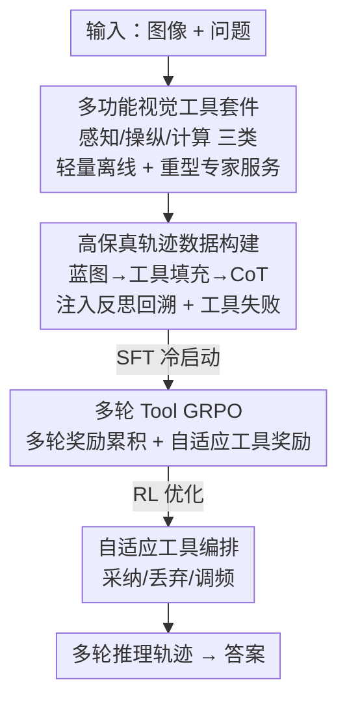

# AdaReasoner: Dynamic Tool Orchestration for Iterative Visual Reasoning

**会议**: ICLR2026  
**OpenReview**: [https://openreview.net/forum?id=nUGPEmQ2ut](https://openreview.net/forum?id=nUGPEmQ2ut)  
**代码**: https://github.com/ssmisya/AdaReasoner  
**领域**: 多模态VLM / 视觉推理 / 工具增强  
**关键词**: 多模态推理, 工具编排, 多轮 GRPO, 视觉工具, 自适应工具使用

## 一句话总结
AdaReasoner 教多模态大模型（MLLM）在多轮视觉推理中**动态编排一组视觉工具**——通过"工具冷启动 + 多轮 Tool GRPO"两阶段训练，让 7B 小模型学会自主选用、丢弃和调节工具使用频率，平均涨点 +38.7%，在 VSP 上做到 97.6% 的近满分，反超 GPT-5 与 Claude Sonnet 4。

## 研究背景与动机
**领域现状**：给 MLLM 装上外部工具是当下提升视觉推理的热门方向。早期的 SFT / prompt 方法（CogCoM、TACO、LLaVA-Plus）用预定义工具但靠脚本式调用；近期的 RL 方法（DeepEyes、Pixel-Reasoner）则用基于裁剪（crop/zoom-in）的搜索来增强感知。

**现有痛点**：这些工作几乎都被锁死在**单个、原子化的工具**和**单步轨迹**上。它们既没解决多轮规划（multi-turn planning）的问题，也不会为复杂任务挑选有效的**工具组合**。更关键的是，纯 R1 式规则奖励只优化"推理过程"，并不直接改善模型底层的**感知能力**——而感知出错会一路累积成幻觉。论文把这种现象叫"guided guessing"：模型能大致定位到相关区域，却抓不住区域里的关键细节，于是语言能力失去视觉锚点、退化成靠语义先验硬猜，输出听上去合理但脆弱。

**核心矛盾**：视觉推理真正缺的，不是更强的语言生成，而是**对视觉证据的迭代探查与精化**——以及"该用哪个工具、什么时候用、怎么组合"这件事本身就是一种多模态推理能力，现有方法完全没把它当成可学习的对象。

**本文目标**：把工具从"静态附加件"变成"主动操纵和精化视觉表征的支撑"，让模型在一个**多样化的候选工具集**上学会多轮规划与动态组合。这要解决三个子问题：(1) 从哪来高质量的多轮工具轨迹数据；(2) 怎么设计 RL 让多轮工具调用真正被优化；(3) 工具套件如何同时容纳轻量离线工具和算力密集的专家模型服务。

**切入角度**：作者借用扩展心智理论（Extended Mind Theory，Clark & Chalmers 1998）——外部工具是认知的有机组成部分。如果让模型遵循"观察 → 操纵 → 验证 → 反思"的迭代流程，它就能像人一样把困难的子任务委派给高精度工具，自己专注于判断与综合。

**核心 idea**：用"工具冷启动（教会怎么用、何时用）+ 多轮 Tool GRPO（强化学习把多轮工具轨迹优化好）"两阶段，训练出一个**会自适应编排工具**的推理 agent，让它从一个宽泛的工具集里自主策划出最优解题策略。

## 方法详解

### 整体框架
AdaReasoner 把"工具增强的多模态推理"形式化为一个**序列决策过程**：策略 $\pi_\theta$（即 MLLM）面对一个问题，生成一条推理轨迹 $\tau = \{(s_0, a_0, o_0), \dots, (s_T, a_T, o_T)\}$，其中 $s_t$ 是当前问题状态，$a_t \in T$ 是被特殊 token 包裹的工具调用动作，$o_t$ 是工具执行返回的观测，每个动作把状态从 $s_t$ 推进到 $s_{t+1}$。模型可调用的工具集合 $T = \{t_1, \dots, t_n\}$ 覆盖**感知**（POINT、OCR）、**操纵**（DRAW2DPATH、INSERTIMAGE）、**计算**（ASTAR）三类核心功能。

整条 pipeline 由三块拼成：一个常驻的 **Tool Server** 在背后托管所有轻量与重型工具；训练上先走 **Tool Cold Start** 阶段，用人造的高保真多轮轨迹数据做 SFT，让模型学会工具的语法和使用模式；再走 **Multi-turn Tool GRPO** 阶段，用为多轮工具轨迹量身定制的强化学习把策略调到自适应。最终模型在推理时按"观察—操纵—验证—反思"循环，自主决定调哪个工具、调几次。

### 关键设计

**1. 多功能视觉工具套件：让一套工具同时容纳轻量离线工具和重型专家模型**

针对"现有方法被锁死在单个原子工具"这个痛点，AdaReasoner 刻意把工具集设计成**三类功能 × 两种算力**的矩阵。三类功能是感知（POINT 指向目标、OCR 提取并定位文本）、操纵（DRAW2DPATH 按方向指令画路径、INSERTIMAGE 把图块插进底图、CROP 裁剪并增强、DETECTBLACKAREA 检测纯黑区域）、计算（ASTAR 用 A\* 搜最短无障碍路径）。两种算力则是即时执行的轻量离线工具，与需要调用大型专家模型的在线服务。

这个设计的关键不在工具本身有多花哨，而在它们由一个**中央 Tool Server** 统一托管：因为很多有用工具（如专家级感知模型）算力极重，过去基于"让模型生成代码再执行"的环境根本塞不进这类服务，而 Server 化的工具调用接口让重型与轻量工具对模型来说都是同一种"发一个 tool_call、收一个 observation"的交互，从而把"专家模型当工具用"变得可行。论文用 Table 3 证明这一点的价值：起点定位上，Qwen2.5-VL 系列基座准确率普遍只有 2.47%~50.0%，而接入专家级 POINT 工具后直接拉到 100.0%。

**2. 高保真多轮轨迹数据构建：用"蓝图 + 工具填充 + CoT"造出带反思与失败的冷启动数据**

光把工具输出拼进上下文（zero-shot）远不足以让模型学会规划，所以需要先用一批高质量多轮轨迹做冷启动 SFT。但人工标注多轮工具轨迹成本极高，作者设计了一条**三阶段流水线**来批量生成：(1) **抽象轨迹设计**——为每类任务手工写一个最优解题蓝图，比如 VSP 走"感知—规划—验证"逻辑、Jigsaw 模拟"反复试错"、GUIQA 用"先聚焦再提取"；(2) **工具调用填充**——把抽象蓝图里的每一步用程序真实执行工具，灌入具体输入输出；(3) **CoT 生成**——用一个强 LLM 把各步之间的思维链补全，让数据既教"调什么工具"又教"为什么、怎么在工具间推理"。

这条流水线的精髓在于**故意注入两类复杂场景**，防止模型只会照搬"完美路径"：**反思与回溯**——加入显式自我纠错步骤，让模型先得到次优结果、再反思并回退重规划，学会主动验证自己的假设（论文里 think 块写"My previous paths are incorrect... I need to re-plan a path from (3,3) to (2,2)"就是这种轨迹）；**显式工具失败**——加入工具失效或返回错误结果的案例，逼模型在识别到工具没用后**退回自身能力**给出"尽力而为"的答案，形成"工具 + 内在能力"的双策略韧性。Table 5 显示反思数据效果显著：禁用 A\* 时，带反思训练的 checkpoint 在 VSP 上拿到 91.36，远高于无反思的 67.27。

**3. 多轮 Tool GRPO：把单轮 GRPO 扩展成能优化整条多轮工具轨迹的奖励结构**

标准 GRPO 是为单轮设计的，没法直接奖励"一条多轮工具调用轨迹好不好"。AdaReasoner 把总奖励改写成乘加结构：
$$R_{\text{total}} = R_{\text{format}} \cdot (\lambda_{\text{tool}} \cdot R_{\text{tool}} + \lambda_{\text{acc}} \cdot R_{\text{acc}})$$
其中三个分量都按多轮重新定义。**格式奖励** $R_{\text{format}} = \prod_{i=1}^{n} R_{\text{format}}(\tau_i)$ 是连乘——只要任意一步格式出错，整条轨迹奖励直接清零，强制每一步都严格遵守推理结构。**工具奖励** $R_{\text{tool}} = \frac{1}{T}\sum_{t=0}^{T-1} R_{\text{tool}}(\tau_t)$ 是所有工具调用轮的平均，每次调用按四个标准（结构 Structure、名称 Name、参数名 Parameter Name、参数内容 Parameter Content）打一个 0–4 的层级分。**准确率奖励** $R_{\text{acc}}$ 只看最后一轮 $\tau_T$，最终答案对则为 1、否则为 0。

**4. 自适应工具奖励：用非对称激励教模型"没把握时才靠工具"**

如果一味奖励用工具，模型会过度依赖工具；如果只奖励答对，模型又学不会"不确定时该求助"。AdaReasoner 用一个**非对称奖励**化解这个矛盾，奖励算法取决于最终答案对错。**答对的轨迹**无论是否用工具，一律拿满分（8 分），从而奖励高效解法——包括在不需要工具时干脆不用。**答错的轨迹**则按分量计分：有正确工具使用过程的还能拿到最多 4 分的部分分（一张"安全网"），而那些**不用工具、直接乱猜又猜错**的轨迹被重罚为 0 分。这等于告诉模型：有把握时直接答最优，面对不确定性时"结构化、工具辅助"的流程才是更优策略。消融实验（Table 6）进一步显示工具奖励权重越大越好——把 $\lambda_{\text{tool}}:\lambda_{\text{acc}}$ 从 0:1 提到 2:1，VSP 整体从 71.45% 升到 93.27%，说明更大的工具奖励既加速 RL 收敛又显著抬高最终性能。

### 一个完整示例
以 VSP-Navigation（冰湖路径规划）走一遍多轮轨迹：模型先 `<think>` 要定位起点 → 调 `Point` → 再 `<think>` 定位目标 → 调 `Point` → `<think>` 定位冰窟窿 → 调 `Point` → `<think>` 用 A\* 找正确路径 → 调 `Astar` → `<think>` 用 `Draw2DPath` 把路径画出来验证是否穿过蓝色冰洞 → 调 `Draw2DPath` → 确认路径正确后输出 `\boxed{L,D,L,D,D,L,L,L,L,U,U,U}`。整条轨迹里感知工具帮模型"看清"、操纵工具帮模型"验证"、计算工具帮模型"算路"，三类工具协同把一个需要精细感知 + 多步规划的任务拆成一串可靠子步。

### 损失函数 / 训练策略
两阶段训练：**Tool Cold Start** 在前述高保真多轮轨迹上做 SFT，教会工具语法与使用模式；**Multi-turn Tool GRPO** 用上面的 $R_{\text{total}}$ 做 RL 微调。基座为 Qwen2.5-VL-3B/7B-Instruct。RL 阶段还可在推理或训练时**临时引入冷启动阶段从未见过的新工具**（如 ASTAR）来考察泛化。

## 实验关键数据

### 主实验
跨 VSPO、VSP、Jigsaw、BLINK-J、GUIChat、WebMMU 六个 benchmark 评测，TC = Tool Cold Start，TG = Tool GRPO。

| 模型 | VSP Overall | Jigsaw | BLINK-J | 说明 |
|------|-------------|--------|---------|------|
| Qwen2.5-VL-7B（基座） | 31.64 | 45.70 | 52.67 | 起点 |
| + Direct SFT | 46.64 | 86.40 | 88.00 | 强基线 |
| + Direct GRPO | 30.18 | 64.90 | 80.00 | 强基线 |
| + Our TC + TG | **97.64** | **96.60** | **96.00** | 完整 AdaReasoner |
| GPT-5 | 55.64 | 80.10 | 73.33 | 闭源对比 |
| Claude Sonnet 4 | 56.27 | 58.60 | 65.33 | 闭源对比 |

7B 模型平均涨点 +38.66%；VSP 从 ∼31.64% 拉到 97.64%，反超 Claude Sonnet 4（56.27%）；Jigsaw 96.60% 反超 GPT-5（80.10%）。3B 模型经 TC+TG 后 VSP 也达 94.73%——Figure 3 显示工具增强把 3B 和 7B 拉到近乎一致的高位（94.7% / 97.6%），说明性能瓶颈从"模型规模"转移到了"工具质量"。

### 消融实验

| 配置 | VSP Overall | 关键发现 |
|------|-------------|---------|
| 仅 TG（7B） | 35.09 | RL 单独效果有限 |
| 仅 TC（7B） | 64.91 | 冷启动是地基 |
| TC + TG（完整） | 97.64 | 两阶段缺一不可 |
| $\lambda_{\text{tool}}:\lambda_{\text{acc}}=0:1$ | 71.45 | 无工具奖励 |
| $\lambda_{\text{tool}}:\lambda_{\text{acc}}=2:1$ | 93.27 | 工具奖励权重越大越好 |

7B 上"先 TC 再 TG"比"只 TG"在 VSP 多 +24.93 分、Jigsaw 多 +19.82 分，证明冷启动给 RL 打地基不可省。

### 关键发现
- **自适应工具使用是涌现行为**：RL 过程中（Figure 4），导航任务的 ASTAR 调用频率稳步升到 >1.0 次/样本（学会**采纳**有益工具），验证任务的 ASTAR 频率衰减到近 0（学会**丢弃**无关工具，避免干扰）；POINT 在导航维持 ∼3.2 次/样本、在验证仅 ∼1.0 次（学会**调节**频率）。
- **零样本引入新工具有双面性**：把 A\* 只在推理时引入，导航分从 44.83 升到 62.33、调用成功率 94.53%（说明零样本就学会了语法和用途）；但它对验证任务是干扰项，会把 Verify 从 94.20 拉低到 80.00——而 RL 训练能让模型学会主动抑制无关工具，把验证稳在 99.20。
- **工具的三种作用**：感知工具帮模型"看"（POINT 定位 100% 准、给下游 zero-shot 推理平均 +18.79 分）、操纵工具帮模型"验证"（DRAW2DPATH 画线让判断平均 +7.82 分）、计算/高质量轨迹帮模型"规划"。

## 亮点与洞察
- **把"选哪个工具"本身当成可学习的多模态推理**：以往工作把工具当固定脚本，AdaReasoner 第一次系统性地让模型自己学会"采纳/丢弃/调频"，且这是 RL 涌现出来的、可迁移到任意候选工具集的能力。
- **非对称自适应奖励很巧**：答对一律满分（哪怕不用工具）、答错时只有"规规矩矩用工具"才有部分分——一句话就把"别过度依赖工具、但没把握时必须求助"的矛盾偏好编码进奖励里，可直接迁移到任何"工具是辅助而非必需"的 agent 训练。
- **Tool Server 化让"专家模型当工具"成为可能**：把重型专家模型和轻量离线工具统一成同一种 tool_call 接口，绕开了 code-based 环境塞不下重型服务的瓶颈，这个工程抽象对做 agent 的人很有参考价值。
- **小模型 + 好工具 = SOTA**：3B/7B 经工具增强双双逼近上界，把"性能瓶颈从规模转向工具质量"这件事用数据讲清楚了。

## 局限与展望
- **反思数据是把双刃剑**：Table 5 显示带反思数据训练的模型策略更"僵化"，反而无法有效吸收推理时新引入的 A\* 工具，导致导航性能下降——反思带来的鲁棒性与采纳新工具的灵活性之间存在张力，论文未给出彻底的解法。
- **工具集与任务高度耦合**：现有工具（A\*、DETECTBLACKAREA 等）是为 VSP/Jigsaw/GUIQA 这几类结构化任务量身设计的，蓝图也要人工设计，迁移到开放域视觉推理时工具与蓝图的可扩展性存疑。
- **依赖外部专家工具的精度**：框架的收益很大程度建立在"专家工具高精度"上（如 POINT 100%），当任务缺乏现成高精度工具时（如 Jigsaw 的 DETECTBLACKAREA 只有 72.6%），增益会打折。
- **未给出工具调用的算力/延迟成本分析**：重型在线专家服务的开销没有量化，实际部署时多轮多工具调用的成本可能不低。

## 相关工作与启发
- **vs DeepEyes / Pixel-Reasoner**：它们用 RL 增强感知但只走"基于裁剪"的**单工具单步**轨迹；AdaReasoner 支持多轮规划 + 多样工具的动态组合，且能纳入重型专家服务。
- **vs CogCoM / TACO**：都是早期工具增强数据工作（CoM 数据 / 15 种视觉工具的推理轨迹），但停在 SFT/脚本式调用；AdaReasoner 用三阶段流水线造带反思与失败的多轮数据，再用 Tool GRPO 把"自适应编排"真正训出来。
- **vs 纯 R1 式 GRPO（DeepSeek-R1 路线在多模态的复现）**：规则奖励只优化推理过程、不改善底层感知，错误会累积成幻觉；AdaReasoner 借外部专家工具保证高保真视觉理解，从感知端堵住误差源头。
- **vs code-based 视觉推理（让模型写代码调工具）**：代码环境难以集成算力密集的大型专家模型；AdaReasoner 的 Tool Server 抽象天然容纳重型服务。

## 评分
- 新颖性: ⭐⭐⭐⭐⭐ 首次把"动态工具编排（采纳/丢弃/调频）"作为可学习的多模态推理能力系统化训练出来
- 实验充分度: ⭐⭐⭐⭐⭐ 6 个 benchmark、3B/7B 双规模、对比闭源 SOTA、含奖励权重与工具频率演化的细致分析
- 写作质量: ⭐⭐⭐⭐ 故事线清晰、图表充分，工具表与奖励公式定义明确；个别附录细节需查原文
- 价值: ⭐⭐⭐⭐⭐ "小模型 + 好工具 = SOTA"与非对称工具奖励的设计对工具增强 agent 有强示范意义

<!-- RELATED:START -->

## 相关论文

- [\[CVPR 2026\] CodeDance: A Dynamic Tool-integrated MLLM for Executable Visual Reasoning](../../CVPR2026/vlm_reasoning/codedance_a_dynamic_tool-integrated_mllm_for_executable_visual_reasoning.md)
- [\[ICLR 2026\] Transductive Visual Programming: Evolving Tool Libraries from Experience for Spatial Reasoning](transductive_visual_programming_evolving_tool_libraries_from_experience_for_spat.md)
- [\[ICLR 2026\] Efficient Multimodal Spatial Reasoning via Dynamic and Asymmetric Routing](efficient_multimodal_spatial_reasoning_via_dynamic_and_asymmetric_routing.md)
- [\[ICLR 2026\] Empowering Small VLMs to Think with Dynamic Memorization and Exploration](empowering_small_vlms_to_think_with_dynamic_memorization_and_exploration.md)
- [\[ICLR 2026\] VTool-R1: VLMs Learn to Think with Images via Reinforcement Learning on Multimodal Tool Use](vtool-r1_vlms_learn_to_think_with_images_via_reinforcement_learning_on_multimoda.md)

<!-- RELATED:END -->
