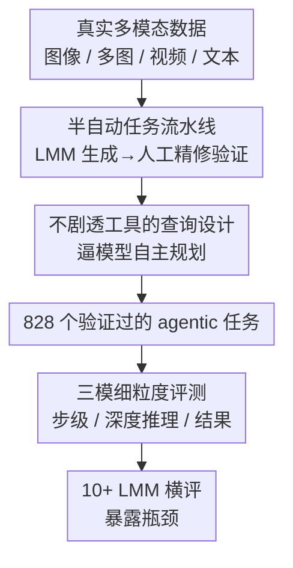

# Agent-X: Evaluating Deep Multimodal Reasoning in Vision-Centric Agentic Tasks

**会议**: ICLR2026  
**OpenReview**: [https://openreview.net/forum?id=Vjruxvp1Xd](https://openreview.net/forum?id=Vjruxvp1Xd)  
**代码**: https://github.com/mbzuai-oryx/Agent-X  
**领域**: 多模态VLM / Agent / 评测基准  
**关键词**: 视觉中心 Agent、深度多模态推理、工具调用、步级评测、benchmark

## 一句话总结
Agent-X 是一个面向「视觉中心 agent」的大规模评测基准，用 828 个真实多模态任务（图像/多图/视频/指令文本）覆盖 6 类场景，配上一套细粒度的「步级 + 推理链 + 结果」三模评测指标，结果显示连 GPT/Gemini/Qwen 系列最强模型的全链路成功率都不到 50%，暴露出当前大模型在多步视觉推理和工具调用上的硬伤。

## 研究背景与动机
**领域现状**：把大多模态模型（LMM）当作「控制器」、再挂上一堆可调用的外部工具，让它感知输入、规划步骤、执行动作，已经是构建 agent 的主流范式（LangChain、AutoGPT、各种 vision-centric agent 都是这个套路）。要把复杂任务做对，光有感知和工具还不够，关键在「推理」——能在文本、图像、视频、时序上下文之间做逻辑推断、做决策、随情境调整。

**现有痛点**：但评测跟不上。现有 agentic benchmark 几乎都是文本为主，多模态支持很弱；少数扩到多模态的，也大多局限在静态单图、合成环境或窄领域。更要命的是两点：一是查询往往「全合成 + 单轮」，且直接把要用的工具名/步骤写进 query（比如「数一数图里有几个物体」直接暗示了 ObjectCounter），模型根本不用自己规划；二是只看最终答案对不对，没有原则性的指标去衡量「多步推理是否逻辑自洽」。这导致没法区分一条推理链到底是真的层层递进，还是看着合理、实则各步脱节的「confabulation（一本正经地胡说）」。

**核心矛盾**：真实世界的 agent 任务是「视觉优先、多步、需要自主规划工具链」的，而现有评测要么不考视觉深度、要么不考推理链质量，要么靠纯合成/纯人工标注（前者不真实、后者不可扩展），三者很难同时兼顾。

**本文目标**：造一个同时满足「大规模真实多模态输入 + 工具增强的步级推理评测 + 跨多种真实场景」的基准，并给出能拆开看每一步对错的细粒度指标。

**切入角度**：强调两条原则——多模态推理（multimodal reasoning）和视觉优先评测（vision-first evaluation）。任务来自真实用户式查询、不显式列工具，逼模型自己想；评测则把「中间步骤」和「整体连贯性」都拆出来打分，而不是只盯最终答案。

**核心 idea**：用「真实多模态任务 + 不剧透工具的查询 + 三模细粒度指标」去逼近真实 agent 场景，把当前 LMM agent 在深度推理和工具使用上的瓶颈量化出来。

## 方法详解

### 整体框架
Agent-X 不是一个模型，而是一个 benchmark + 评测协议，所以「方法」要讲清三件事：任务长什么样、数据怎么造出来、用什么指标去评。

任务被形式化为一个结构化元组 $S_i = (V_i, Q_i, T_i, R_i, A_i, J_i)$：$V_i$ 是多模态上下文（单图 / 文本 / 多图 / 视频帧），$Q_i$ 是需要多步深度推理 + 调用外部工具才能解的查询，$T_i \subseteq T_c=\{t_k\}_{k=1}^{N}$ 是解题用到的工具子集（$T_c$ 是预定义的工具库，本文 $N=14$ 个工具，覆盖感知、视觉操作、数学、生成等），$R_i=\{(t_j, a_j, r_j)\}_{j=1}^{m}$ 是深度推理轨迹——每一步是「用的工具 $t_j$、输入参数 $a_j$、输出 $r_j$」三元组，$A_i$ 是最终答案，$J_i$ 是用自然语言给出的理由（提升可解释性）。查询本身分三类：factual（答案唯一，如一个数/短语）、interpretive（描述性文本，不唯一但表达一个概念）、generative（生成类，因为 LMM 只能描述不能真出图，所以这类 $A_i=\varnothing$，只评工具参数）。

整套数据由一条半自动流水线产出，再用一套三模指标去评。下面分别讲清楚。

### 关键设计

**1. 视觉优先、不剧透工具的真实任务设计：让评测逼近真实 agent 而非填空题**

这是 Agent-X 区别于 GAIA、GTA 等基准的根本立场。每个任务必须满足三条铁律：(a) 能被工具子集 $T \subseteq T_c$ 解出来，保证任务在工具能力范围内可解；(b) 查询 $Q_i$ 绝不显式列出要用哪些工具、按什么顺序——比如「数一下图里有几个物体」这种直接点名 ObjectCounter 的写法被刻意避开，改成「视频里这家店是什么、画面里穿着打扮对应正常情况下的什么角色」这类需要自己拆解的问法，逼模型独立规划与推理；(c) 任务扎根真实有意义的场景。视觉输入全部来自公开数据集，覆盖 6 大环境：通用视觉推理、网页浏览、安防监控、自动驾驶、体育、数学推理，且每个视觉输入不跨任务复用。这条设计直接打在「现有 benchmark 把工具/步骤剧透、模型不用规划」的痛点上。

**2. LMM 生成 + 人工精修的半自动流水线：兼顾规模与质量**

纯人工标注不可扩展、纯合成不真实，本文走中间路线。流程分两阶段：先是查询构造——给 LMM 喂视觉输入 $V_i$ 和完整工具集 $T_c$，对 1021 个初始视觉输入各生成 3 个候选查询，标注员从每组里挑最好的，得到 1021 个原始查询，再按「不能光看输入直接答出、必须真用工具、可扩展、支持多步推理」逐条审，淘汰不合格的，最终留下 828 个验证任务；对网页搜索类还额外加两道保险（必须靠实时搜索而非静态知识、必须引可信来源）。第二阶段是工具链构造——把 query + 视觉输入 + 工具集喂回 LMM，生成 JSON 风格的推理轨迹（工具调用序列、输入参数、中间输出）、最终答案 $A$ 和理由 $J$，人工审核员再严格校验逻辑一致性、工具选用正确性、答案与推理过程的事实对齐，纠错、替换不当工具、过滤无法可靠求解的任务。最终规模：828 任务、2807 次工具调用、平均每任务 3.4 步、716 图 + 112 视频输入、5 个标注员每人约 50 小时、约 800K API token。

**3. 三模式细粒度评测指标：把「最终答案对不对」拆成「每一步对不对」**

为了能区分真推理和「胡说但听着对」，本文不只看终点，而是设计了三种评测模式、共 10 个指标（用 GPT-4o 做主裁判，并用 Qwen-14B 和人工交叉复核）。**步级模式（Step-by-Step）**衡量单步是否扎实：Grounding Score $G_s$（是否正确指认输入里的对象/区域/属性）、Tool Precision $T_p$（每步是否选对工具）、Tool Accuracy $T_a$（工具输入输出是否用对）。**深度推理模式（Deep Reasoning）**衡量整条链的质量：Faithfulness $F_{acc}$（推理过程逻辑是否自洽）、Context Score $C_s$（是否有效用上多模态与常识上下文）、Factual Precision $F_p$（事实是否正确、有没有幻觉）、Semantic Accuracy $S_{acc}$（语义必要元素是否覆盖全）。**结果模式（Outcome）**衡量终点：Goal Accuracy $G_{acc}$（factual/interpretive 查询的最终答案准确率，前者精确匹配、后者用 GPT-4o 做描述性匹配）、Goal Accuracy w/ImgGen $G^{*}_{acc}$（生成类查询只评预测输入参数是否正确，因为假定参数对了图就合理）、Toolset Accuracy $T^{s}_{acc}$（整体工具选用的 F1）。指标本身做了 bias-aware 处理（解耦语法与语义、归一化工具参数），任务种子在严格 QA 下重写以防泄漏。

### 一个完整示例
以一条真实任务为例感受「不剧透 + 多步」长什么样。输入是一张雷达图 `AgentX_181.jpg`，查询「哪个模型在 Visual Knowledge Acquisition 上表现最好？图里一共有几个不同的模型？」——注意它没说该用 OCR 还是 SceneDescriber。一个理想的 5 步轨迹会这样走：先用 SceneDescriber 描述图像理解结构 → 再定位 Visual Knowledge Acquisition 这条轴上的最高值找到最佳模型 → 用 LocateObjectByText / OverlayText 把峰值标出来确认 → 用 OCR 把所有模型名枚举出来 → 最后用 Calculator 数出去重后的模型总数。理想输出是 `{'best_model': 'Bard', 'total_models': 12}`，并附理由。Agent-X 评测时会对这 5 步逐一打 $G_s/T_p/T_a$（每步有没有指对、选对、用对工具），对整条链打 $F_{acc}/C_s/F_p/S_{acc}$（推理是否自洽、有没有幻觉），最后对终点打 $G_{acc}$。这样即便模型最终答案蒙对了，中间偷工减料（跳步、幻觉工具、JSON 格式崩）也会在步级/推理指标上被扣分暴露。

## 实验关键数据

### 主实验
作者横评了 10+ 个主流 LMM（开源 + 闭源），三模 10 指标。核心结论是「最强模型也远没达标」：

| 模型 | $G_s$ 步级接地 | $T^{s}_{acc}$ 工具集 | $F_{acc}$ 忠实度 | $G_{acc}$ 目标准确率 |
|--------|------|------|------|------|
| OpenAI o4-mini | 0.42 | 0.63 | 0.71 | **0.45**（最高） |
| GPT-4o | **0.60** | 0.68 | **0.81** | 0.37 |
| Gemini-2.5-Pro | 0.40 | 0.62 | 0.72 | 0.40 |
| Qwen2.5-VL-7B | 0.54 | 0.67 | 0.75 | 0.36（开源最强） |
| InternVL2.5-8B | 0.45 | 0.58 | 0.68 | 0.28 |
| Phi-4-VL-Instruct | 0.13 | 0.42 | 0.61 | 0.11 |

最关键的一个数字：没有任何模型的 $G_{acc}$ 超过 50%，最好的 o4-mini 也只有 45%，多数开源模型不到 30%。

### 消融实验
这篇是 benchmark 论文，没有传统意义上的模型消融，但通过错误类型分解（Table 5）拆出了三类典型失败，等价于对「模型在哪一环节崩」的归因分析：

| 错误类型 | GPT-4o | Gemini-1.5-Pro | InternVL3-8B | 说明 |
|------|---------|---------|---------|------|
| Planning：无动作无响应 | 157 (17.6%) | 3 (0.2%) | 172 (12.8%) | 直接摆烂不出招 |
| Formatting：JSON 参数格式非法 | 235 (26.4%) | 755 (44.5%) | 454 (33.8%) | 占比最高的硬伤 |
| Formatting：单步里塞多次工具调用 | 118 (13.2%) | 172 (10.1%) | 126 (9.4%) | 不守步级协议 |
| Reasoning：误读视觉内容 | 165 (18.5%) | 581 (34.3%) | 189 (14.1%) | 看错对象 |

### 关键发现
- **真实工具任务整体很难**（Insight 1）：所有模型 $G_{acc}$ 都 <50%，说明「工具使用 + 最终答案一致性」在真实场景里仍是普遍短板。
- **推理强 → 任务成功率高**（Insight 2）：在推理类指标上稳的模型更可能做对终点。GPT-4o 的 $F_{acc}=0.81$、$F_p=0.79$ 对应较高的 $G_{acc}=0.37$；Qwen2.5（$C_s=0.57$、$S_{acc}=0.67$）拿到 $G_{acc}=0.36$，跑赢多数开源同行——深度推理和结构化执行确实能撑起任务成功率。
- **工具调用与参数预测是核心瓶颈**（Insight 3）：工具类指标方差最大。即便 GPT 系推理强，Toolset Accuracy 仍偏低；参数格式化和工具串联是最薄弱的一环，会拖垮整条 pipeline 的可靠性。
- **四类典型错误**：视频任务里跳帧/跳步的浅推理；幻觉/误用 metadata 里没定义的工具；输出违反格式（非 JSON、不完整）；以及规划层面的答案错误。其中 JSON 格式错误是占比最高的单一问题。

## 亮点与洞察
- **把「推理链质量」做成可量化指标**：最值得借鉴的是把评测从「终点对错」拆成步级 + 推理链 + 结果三层，专门设计 Faithfulness / Context Score 等指标去抓「听着对实则脱节」的 confabulation——这套思路可迁移到任何需要评 CoT 质量的任务，而不只是 agent。
- **「不剧透工具」是个简单却关键的设计**：现有 benchmark 把工具名写进 query 等于送分，本文刻意让查询模糊化，逼模型自己规划，一下子把难度拉回真实场景，也才让 <50% 这个数字有说服力。
- **半自动流水线的性价比**：LMM 批量生成候选 + 人工精修验证，用约 800K token + 5 人 ×50 小时就造出 828 个高质量任务，是「规模 vs 质量」之间一个可复制的折中模板。
- **错误分类法本身有价值**：把失败归成 Planning / Formatting / Reasoning 三大类，直接告诉社区「先把 JSON 格式和工具参数这种工程问题解决掉，比堆推理能力更立竿见影」。

## 局限与展望
- **生成类任务评测被绕开**：因为 LMM 只能描述不能真出图，generative 查询直接令 $A_i=\varnothing$、只评输入参数，等于没真正考核生成能力，这是 vision-centric 评测的一块缺口。
- **依赖 LMM 做裁判**：主指标用 GPT-4o 打分，虽然有 Qwen-14B 和人工交叉复核且排名一致，但裁判模型自身的偏好/盲区可能影响细粒度分数，尤其 interpretive 这类没有唯一答案的查询。
- **工具库规模有限**：14 个工具虽覆盖面广，但真实 agent 可调用的工具远不止此，扩到更大、更动态的工具集后结论是否稳定还需验证。
- **半自动构造的天花板**：查询和推理轨迹的初稿都由 LMM 生成，即便人工精修，仍可能继承生成模型的思维定式（比如倾向某些工具组合），多样性边界受限于种子 LMM。

## 相关工作与启发
- **vs GAIA / GTA**：GAIA 偏概念性难题、GTA 评真实工具链，但二者多模态深度和推理链评测都不够；Agent-X 第一次把「大规模真实多模态输入（含视频）+ 工具增强的步级推理评测 + 6 类环境」三者合一，补上了广度与深度同时缺失的那块。
- **vs ToolBench / APIBench / AgentBench**：这些主要评文本工具调用（pass rate / win rate / API 准确率），不涉及视觉，也只看最终对错；Agent-X 把视觉中心、不剧透工具、推理链拆解都补齐了。
- **vs m&m's / LLaMA-V 等推理 benchmark**：m&m's 关注多步多模态推理，但依赖 AI 生成查询 + 预定义工具序列（不真实）；LLaMA-V 评多步推理但不涉 agentic 工具使用。Agent-X 的区别在于既考 agentic 框架、又考工具使用及其关联推理，且查询不预设工具序列。
- **启发**：评测范式正从「看结果」转向「看过程」。当模型能力越来越强、终点准确率趋同，能拉开差距、指出改进方向的反而是步级与推理链质量这类过程性指标——这对设计下一代 agent 评测和训练信号都有直接参考价值。

## 评分
- 新颖性: ⭐⭐⭐⭐ 「视觉优先 + 不剧透工具 + 三模细粒度指标」组合在 agentic 评测里确实新，单项指标多为已有思想的整合。
- 实验充分度: ⭐⭐⭐⭐⭐ 10+ 模型横评、三裁判交叉复核、四类错误定量分解，作为 benchmark 论文相当扎实。
- 写作质量: ⭐⭐⭐⭐ 结构清晰、表格信息密度高，部分指标定义需翻附录才完整。
- 价值: ⭐⭐⭐⭐⭐ 给出了「最强模型全链路成功率 <50%」这一有冲击力的结论，并明确指向工具调用/格式化这一可立即攻坚的瓶颈。

<!-- RELATED:START -->

## 相关论文

- [\[CVPR 2026\] Think360: Evaluating the Width-centric Reasoning Capability of MLLMs Beyond Depth](../../CVPR2026/vlm_reasoning/think_360_evaluating_the_width-centric_reasoning_capability_of_mllms_beyond_dept.md)
- [\[ICLR 2026\] Ref-Adv: Exploring MLLM Visual Reasoning in Referring Expression Tasks](ref-adv_exploring_mllm_visual_reasoning_in_referring_expression_tasks.md)
- [\[ICLR 2026\] MMR-V: What's Left Unsaid? A Benchmark for Multimodal Deep Reasoning in Videos](mmr-v_whats_left_unsaid_a_benchmark_for_multimodal_deep_reasoning_in_videos.md)
- [\[ICLR 2026\] Agentic Jigsaw Interaction Learning for Enhancing Visual Perception and Reasoning in Vision-Language Models](agentic_jigsaw_interaction_learning_for_enhancing_visual_perception_and_reasonin.md)
- [\[ICLR 2026\] GTR-Bench: Evaluating Geo-Temporal Reasoning in Vision-Language Models](gtr-bench_evaluating_geo-temporal_reasoning_in_vision-language_mod.md)

<!-- RELATED:END -->
