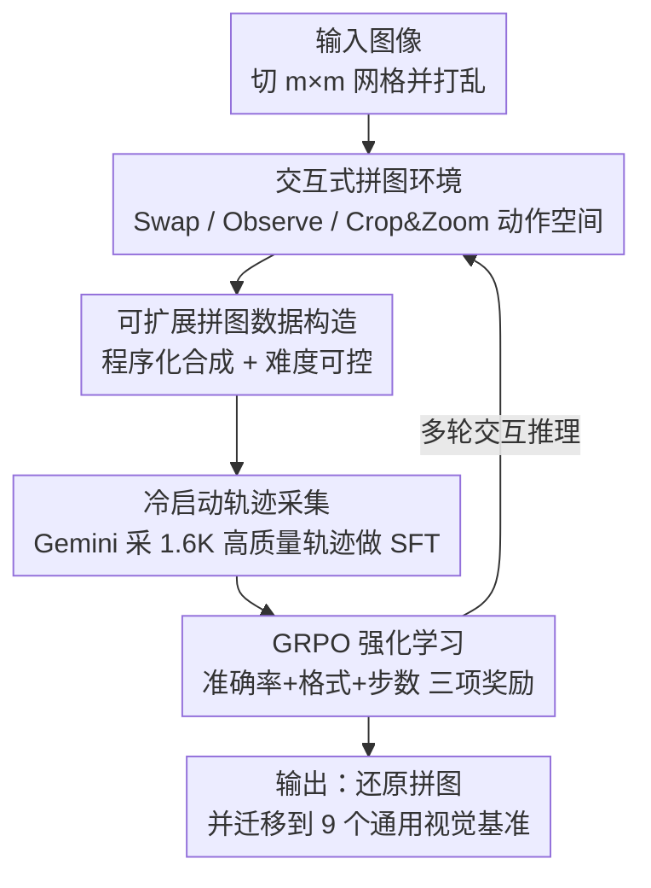

# Agentic Jigsaw Interaction Learning for Enhancing Visual Perception and Reasoning in Vision-Language Models

**会议**: ICLR2026  
**OpenReview**: [https://openreview.net/forum?id=3kouij8BWi](https://openreview.net/forum?id=3kouij8BWi)  
**代码**: https://github.com/yuzeng0-0/AGILE  
**领域**: 多模态VLM / LLM推理  
**关键词**: 视觉语言模型, 拼图代理, 交互式强化学习, GRPO, 感知与推理

## 一句话总结
AGILE 把"解拼图"重新定义成一个让模型一步步写代码、观察环境反馈的交互过程，再配上可任意扩展的程序化合成数据 + 冷启动 SFT + GRPO 强化学习，把 Qwen2.5-VL-7B 在 2×2 拼图上的准确率从 9.5% 拉到 82.8%，并迁移到 9 个通用视觉基准上平均涨 3.1%。

## 研究背景与动机
**领域现状**：大型视觉语言模型（VLM）在图像描述、视觉问答、文档理解等任务上进步很快，看起来已经具备不错的多模态感知和推理能力。近期一条主流路线是用强化学习（RL）让模型在交互、试错、反馈中进一步增强推理，DeepSeek-R1 在数学推理上的成功又把规则可验证的 RL 推到了多模态领域。

**现有痛点**：作者发现一个尴尬的事实——即便是非常简单的 2×2 拼图任务，现有 VLM（包括 GPT-4o、Gemini-2.5-Pro、Qwen2.5-VL-72B）的准确率都接近随机水平。这说明现有预训练和微调策略虽然堆出了很多"看起来会"的能力，但底层的感知精度和结构化推理仍然很弱。而想用 RL 补这块短板，又卡在数据上：高质量视觉语言 RL 数据要么靠人工标注（贵且规模小），要么靠闭源模型自动合成（质量受限、能力受限、API 成本高），都难以规模化。

**核心矛盾**：要靠 RL 强化感知与推理，就需要大量高质量、可验证、难度可控的训练数据；但现有数据构造方式恰恰无法同时满足"规模大 + 质量高 + 有 ground truth"。

**本文目标**：找到一个既能精准刻画"感知 + 推理"、又能无限扩展且自带正确答案的代理任务（proxy task），用它来训练 VLM 的底层能力。

**切入角度**：拼图任务天然满足这些要求——它强迫模型同时做到感知准确（看清每块碎片的内容和边缘）和逻辑推断（推断碎片之间的空间关系），难度可以通过网格大小 $m$ 和初始正确块数精确调节，而且因为打乱过程是程序记录的，ground truth 永远可得、数据可以无限程序化合成。更关键的是，作者不把拼图当成一次性的"看图答题"，而是当成一个**多轮交互过程**：模型每一步生成可执行代码去操作环境、拿到细粒度视觉反馈、再决定下一步。

**核心 idea**：把"解拼图"建模成模型与环境的逐步交互（生成 Python 代码做动作 → 环境返回新图像 → 继续推理），并用程序化合成的可扩展拼图数据做冷启动 + GRPO 强化学习，从而在底层提升 VLM 的视觉感知与推理能力。

## 方法详解

### 整体框架
AGILE（**A**gentic ji**G**saw **I**nteraction **L**earning for **E**nhancing）要解决的是"VLM 连简单拼图都解不好、且没有可规模化的 RL 数据"这个问题。它的整体管线分三层：先把拼图定义成一个**可交互的环境**（模型靠写代码操作、靠观察反馈推进）；再用一套**程序化数据构造 + 冷启动轨迹采集**给模型装上基本的指令遵循和代码生成能力；最后用 **GRPO 强化学习 + 三项奖励**让模型在大规模合成拼图上自我提升，并把学到的感知/推理能力迁移到通用视觉任务。

具体地，给定一张图，切成 $m \times m$ 网格、按行优先编号 $1 \sim m^2$ 后随机打乱，模型要在最多 $T$ 步内把它还原成 ground truth 布局。每一步模型输出一段含 `<think>`/`<code>`/`<answer>` 标签的回复：`<code>` 里是调用预定义 API（Swap / Observe / Crop / Zoom）的 Python 代码，环境执行后返回新的拼图图像作为下一轮的用户输入，如此循环直到模型输出 `<answer>`。

### 关键设计

**1. 拼图环境与代理动作空间：把"答题"变成"边操作边看"**

这一设计直接针对"VLM 在静态拼图上接近随机"的痛点。作者不让模型一次性猜出整张图的排列，而是预定义一组 Python API，让模型把每一步意图写成代码、交给环境执行。动作空间含三类：**Swap**（交换任意两块碎片的位置）、**Observe**（拿到当前拼图状态 $I_{Obs}$ 以决定下一步）、**Crop & Zoom**（裁剪并放大某个局部，看清细粒度细节）。形式上，打乱态记为 $I_{Shuffle}=\{I_1,\dots,I_{m^2}\}$，目标态 $I_{GT}=\{I_{\pi(1)},\dots,I_{\pi(m^2)}\}$，模型维护的当前态为 $I_{State}=\{I_{\pi^*(1)},\dots,I_{\pi^*(m^2)}\}$，每步通过交换两块逐渐逼近 $I_{GT}$。这种"观察—交互"的闭环之所以有效，是因为它把一个需要全局一次性求解的难题，拆成了若干个有即时视觉反馈的小决策——模型每动一步就能看到结果对不对，从而在过程中真正学会捕捉碎片间的结构关系，而不是盲猜整张排列。

**2. 可扩展的程序化拼图数据构造：用代码和规则绕开数据稀缺**

针对"高质量多模态 RL 数据贵且不可扩展"的核心矛盾，AGILE 用代码 + 规则来生成数据，带来两个别的方法给不了的好处。其一，**难度精确可控**：通过调节初始已正确摆放的碎片数（论文用 $L_N$ 标记，$N$ 越小越乱、越难）和网格规模 $m$，可以连续生成从易到难的样本。其二，**ground truth 天然可得**：因为打乱是程序执行的，正确排列永远已知，于是合成数据集可以在严格监督下扩展到任意规模，彻底绕开人工标注或闭源合成的瓶颈。RL 阶段作者据此构造了 15.6K 张跨域图像（高分辨率视觉搜索、OCR 文字识别、真实场景、结构化图表），每张切 2×2 并打乱到所有碎片都错位。这正是论文反复强调的"对 RL 数据稀缺的高效可持续解法"——数据多少由算力决定，而非由标注预算决定。

**3. 冷启动 SFT：先把"会写代码、会跟指令"教会**

作者发现直接上 RL 效率很低，因为基座 Qwen2.5-VL-7B 的指令遵循差、生成的 Python 代码常常出错，根本没法和环境正常交互，会引入大量训练噪声。于是先做冷启动：用 Gemini-2.5-Pro（Preview-05-06）配上结构化提示词去和环境交互、解拼图，采集专家轨迹；再做两道质量过滤——先只保留 Gemini 输出与 ground truth 一致的样本，再人工逐步核验每一步交互的合理性与一致性。为保证模型在 RL 阶段能用全套动作，轨迹还按**步数（4–8 步）**和**动作类型（Swap/Observe/Crop/Zoom）**做了平衡，最终得到 1.6K 条高质量轨迹做监督微调。这一步的作用不是直接提性能（实测冷启动后 3×3 上甚至略降），而是把模型从"连环境都接不上"拉到"能正常交互"，给后续 RL 铺好地基。

**4. GRPO 强化学习与三项奖励：用过程反馈把能力真正练出来**

最后用 Group Relative Policy Optimization（GRPO）做强化学习。GRPO 不学单独的价值函数，而是把一组采样输出的平均奖励当基线，组内相对奖励算优势 $\hat{A}_{i,t}$，优化目标是带 clip 和 KL 正则的策略目标 $J_{GRPO}(\theta)$。奖励由三部分相加：**准确率奖励**（所有碎片都摆对得 1，否则 0）、**格式奖励**（推理/代码/答案分别正确包在 `<think>`/`<code>`/`<answer>` 里得 1）、**步数奖励**（鼓励用尽量少的步数解完）。步数奖励的设计有讲究——2×2 拼图理论上最多 3 步交换就能解完，步数过多会塞进无效操作、稀释有效的感知与推理；同时为防止训练早期模型"钻空子"刷步数奖励，步数奖励只在拼图被正确解出时才发放，解错则直接给最大步数惩罚：

$$R_{step} = \lambda \cdot \left( \mathbb{I}_{\{R_{acc}=1\}} \cdot step_{num} + \mathbb{I}_{\{R_{acc}=0\}} \cdot step_{max} \right)$$

其中 $\lambda=-0.05$ 是步数惩罚系数。总奖励为 $R = \alpha R_{acc} + \beta R_{format} + \gamma R_{step}$，实验中 $\alpha,\beta,\gamma$ 分别设为 0.8、0.2、1.0。这套组合奖励既保证答对是第一目标，又约束输出格式可解析、过程尽量精炼，从而让模型在多轮交互里把感知和推理能力真正"练"出来。

### 损失函数 / 训练策略
训练分两阶段、均为全参数调优：冷启动 SFT 在 llama-factory 上用 1.6K 轨迹做；RL 在 verl 上用 15.6K 图像跑 GRPO。推理与评测统一用 VLMEvalKit，且所有通用下游基准都在**严格单轮**设定下评测，与所有 baseline 协议一致以保证公平。全部实验在 8 张 80GB A100 上完成。

## 实验关键数据

### 主实验
拼图测试集 300 张图，切 2×2 和 3×3，用两个指标：Acc（所有碎片都摆对才记 1）与 Score（正确块数 / 总块数）。

| 模型 | 2×2 Acc | 2×2 Score | 3×3 Acc | 3×3 Score |
|------|---------|-----------|---------|-----------|
| Random | 4.1 | 24.9 | 0.0 | 11.2 |
| GPT-4o | 41.1 | 59.0 | 4.9 | 41.5 |
| Gemini-2.5-Pro | 46.4 | 59.0 | 14.6 | 45.1 |
| Qwen2.5-VL-72B | 27.4 | 47.6 | 3.9 | 36.0 |
| Qwen2.5-VL-7B（基座） | 9.5 | 29.4 | 0.4 | 31.1 |
| + Cold-Start | 22.0 | 43.8 | 0.2 | 11.0 |
| **+ RL（AGILE）** | **82.8** | **89.0** | **20.8** | **62.1** |

7B 基座在最简单的 2×2 上也只有 9.5% Acc，而 AGILE 把它拉到 82.8%，3×3 上从 0.4% 提到 20.8%，全面超过闭源 Gemini-2.5-Pro 和 10 倍大的 Qwen2.5-VL-72B。

通用视觉任务在 9 个基准上评测，验证拼图训练能否迁移：

| 基准 | Qwen2.5-VL-7B | + RL | ∆ |
|------|---------------|------|---|
| HRBench4K | 68.8 | 73.0 | +4.2 |
| HRBench8K | 65.3 | 70.5 | +5.2 |
| VStarBench | 76.4 | 80.6 | +4.2 |
| MMVP | 74.3 | 78.0 | +3.7 |
| MME-RealWorld | 44.6 | 48.4 | +3.8 |
| **9 基准平均** | **62.1** | **65.2** | **+3.1** |

拼图训练并非过拟合到拼图本身，而是把"捕捉视觉关系 + 结构化推理"的底层能力迁移到了高分辨率理解、真实场景、细粒度识别等通用任务上。

### 消融实验

| 配置 | 2×2 Acc | 说明 |
|------|---------|------|
| Qwen2.5-VL-7B 基座 | 9.5 | 起点 |
| + Cold-Start（仅 SFT） | 22.0 | 装上基本交互能力，但 3×3 反而略降，单靠 SFT 不够 |
| + RL（完整 AGILE） | 82.8 | RL 才是性能跃升的主力 |

数据规模分析：把 RL 训练数据从小到大扩展，拼图 Acc 从 22.0% 升到 82.8%，HRBench4K 和 RealWorldQA 分别涨 2.0% 和 1.8%，呈现清晰的"数据越多越强"趋势。拼图数据 vs 通用 QA 数据：等预算下拼图训练效果可比甚至超过通用 QA；10K 拼图 + 10K QA 的组合在通用基准上优于纯 20K QA。

### 关键发现
- **RL 是性能跃升的关键**：冷启动 SFT 只把模型从"接不上环境"拉到"能交互"（2×2 22.0%），真正把 2×2 Acc 推到 82.8% 的是 GRPO 强化学习；单靠 SFT 在 3×3 上甚至略有下降。
- **拼图能力可迁移**：在拼图上练出的感知/推理能力在 9 个完全不同的通用视觉基准上平均涨 3.1%，说明学到的是底层能力而非拼图技巧。
- **程序化数据可扩展性是核心红利**：因为拼图数据由代码合成、难度可控、ground truth 自带，数据规模可由算力决定，直接缓解了多模态 RL 数据稀缺这一根本瓶颈，且数据越多性能越强。

## 亮点与洞察
- **用"代理任务 + 交互"双管齐下**：拼图作为代理任务解决了"数据可无限合成且自带答案"，交互式建模解决了"VLM 静态求解能力弱"，两者结合才让一个 7B 模型在底层能力上反超 72B 和闭源大模型——单独任何一招都不够。
- **步数奖励的"先解对再奖励步数"很巧妙**：直接奖励少步数会让模型在没解对时就钻空子刷奖励；AGILE 用 $\mathbb{I}_{\{R_{acc}=1\}}$ 把步数奖励锁在"已解对"之后发放，解错就给最大惩罚，这个 reward shaping 细节可直接迁移到其他"过程要短但首先要对"的交互任务。
- **冷启动的定位很清醒**：作者明确冷启动不是为了提性能（实测 3×3 还略降），而是为了让模型"能正常和环境交互"，把脏轨迹噪声压下去再上 RL——这种"SFT 铺地基、RL 出能力"的分工对 agentic RL 训练有普适参考价值。
- **程序化合成可作为通用 RL 数据范式**：把"答案天然可验证 + 难度可程序调节"的任务做成代理任务，是绕开多模态 RL 数据稀缺的一条可复用思路，可推广到其他需要感知+推理的领域。

## 局限与展望
- **代理任务与目标能力的覆盖范围**：拼图主要刻画空间结构感知与排列推理，对需要语义常识、跨模态对齐、长程因果推理的能力提升可能有限；论文展示的通用迁移平均仅 +3.1%，幅度不大。
- **3×3 仍然偏弱**：即便 RL 后，3×3 Acc 也只有 20.8%，说明随网格变大、交互步数和搜索空间爆炸，方法的可扩展性还有瓶颈。
- **依赖闭源教师采冷启动**：1.6K 高质量轨迹靠 Gemini-2.5-Pro 采集 + 人工核验，仍有一定成本与质量天花板，离"完全自举"还有距离。
- **单一基座验证**：实验只在 Qwen2.5-VL-7B 上做，方法在更大/更小或不同架构 VLM 上的普适性尚待验证。

## 相关工作与启发
- **vs Jigsaw-R1**：同样用拼图做基于谜题的 RL 范式，但 Jigsaw-R1 因训练受限，模型在 2×2 拼图上仍然很差、没能吃到代理任务的红利；AGILE 把拼图改成多轮交互过程 + 冷启动 + GRPO，把 2×2 拉到 82.8%，真正发挥了代理任务的价值。
- **vs DeepEyes / Perception-R1 / R1-V 等感知向 RL**：它们用 RL 强化计数、grounding 或调用视觉工具来提感知；AGILE 不针对某个具体感知子任务，而是用拼图这个同时考感知+推理的代理任务统一提升底层能力，并强调数据的可程序化扩展。
- **vs Logic-RL / Enigmata / Code2Logic / ViGaL 等代理任务**：这些主要用文本谜题或代码合成游戏提升 LLM/VLM 的数学与逻辑推理；AGILE 把"代理任务 + 规则可验证奖励"的思路落到**视觉感知**这一更基础的层面，并以交互式 rollout 提供逐步反馈，区别在于它强化的是"看清 + 推断空间关系"的底层视觉能力。

## 评分
- 新颖性: ⭐⭐⭐⭐⭐ 把拼图重塑为交互式代理任务、并用程序化合成数据规模化训练，是一个角度清奇又自洽的组合
- 实验充分度: ⭐⭐⭐⭐ 拼图 + 9 个通用基准 + 数据规模/QA 对比消融较完整，但只验证了单一 7B 基座
- 写作质量: ⭐⭐⭐⭐ 动机—方法—实验逻辑清晰，奖励设计与数据构造讲得明白
- 价值: ⭐⭐⭐⭐⭐ 为"多模态 RL 数据稀缺"给出可扩展、自带监督的解法，对 agentic 视觉训练有方法论意义

<!-- RELATED:START -->

## 相关论文

- [\[ICLR 2026\] MedVR: Annotation-Free Medical Visual Reasoning via Agentic Reinforcement Learning](medvr_annotation-free_medical_visual_reasoning_via_agentic_reinforcement_learnin.md)
- [\[ICLR 2026\] VisionReasoner: Unified Reasoning-Integrated Visual Perception via Reinforcement Learning](visionreasoner_unified_reasoning-integrated_visual_perception_via_reinforcement_.md)
- [\[CVPR 2026\] BOP-Ask: Object-Interaction Reasoning for Vision-Language Models](../../CVPR2026/vlm_reasoning/bop-ask_object-interaction_reasoning_for_vision-language_models.md)
- [\[CVPR 2026\] MoE-GRPO: Optimizing Mixture-of-Experts via Reinforcement Learning in Vision-Language Models](../../CVPR2026/vlm_reasoning/moe-grpo_optimizing_mixture-of-experts_via_reinforcement_learning_in_vision-lang.md)
- [\[ICLR 2026\] Mini-o3: Scaling Up Reasoning Patterns and Interaction Turns for Visual Search](mini-o3_scaling_up_reasoning_patterns_and_interaction_turns_for_visual_search.md)

<!-- RELATED:END -->
