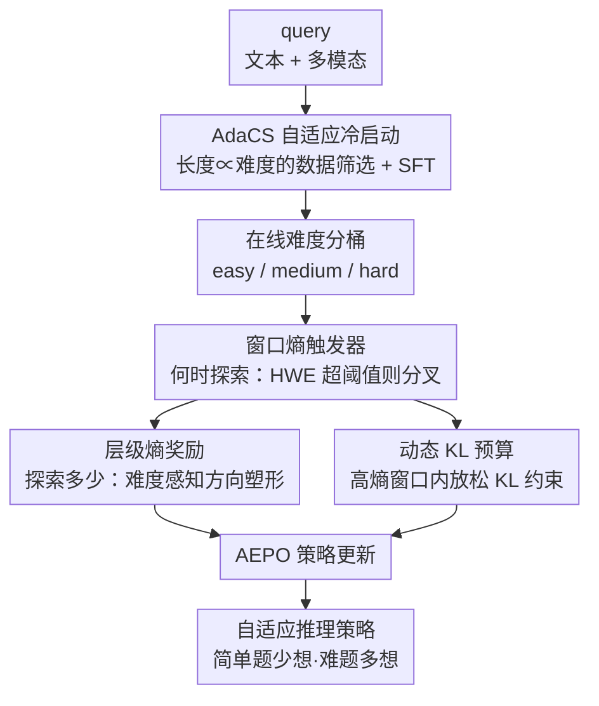

# ARES: Multimodal Adaptive Reasoning via Difficulty-Aware Token-Level Entropy Shaping

**会议**: ICLR2026  
**OpenReview**: [https://openreview.net/forum?id=2g945Ngc7l](https://openreview.net/forum?id=2g945Ngc7l)  
**代码**: https://github.com/shawn0728/ARES  
**领域**: 多模态VLM / LLM推理  
**关键词**: 自适应推理, 窗口熵, 难度感知, 熵奖励塑形, 强化学习

## 一句话总结
ARES 用"窗口熵"作为探索触发器、用难度感知的层级熵奖励控制探索深度，让多模态大推理模型在简单题上少想、难题上多想，从而在数学/逻辑/多模态基准上同时提升准确率和推理效率。

## 研究背景与动机
**领域现状**：多模态大推理模型（MLRM）通过长链思维（long CoT）+ 反思，在复杂文本和视觉任务上表现强劲。主流做法是用冷启动 SFT + RLVR（可验证奖励的强化学习）训练出会"长篇思考"的模型。

**现有痛点**：这类模型有个失衡毛病——**简单题过度思考**（overthinking），生成大量不必要的推理 token，徒增推理成本和延迟；**难题探索不足**（under-exploring），过早收敛错过正确解。已有的"省 token"方法（training-free 截断或 training-based 惩罚长度）虽然缓解了 verbose 问题，却普遍**伤准确率**。

**核心矛盾**：探索成本（response length）与准确率之间存在 trade-off，而现有自适应方法（按难度调冷启动数据、或 RL 里加难度感知惩罚）往往**一刀切地鼓励难题探索**，结果难题上 trace 冗长、提升却有限。根子在于：它们没回答清楚两个基础问题——**何时该探索（when）**、**该探索多少（how much）**。

**切入角度**：作者从一个观察出发——单 token 熵很噪（标点、公式、虚词都可能高熵，而"but/however"这类真正的逻辑转折点反而低熵），不能可靠地标记"推理分叉点"。但如果把连续若干 token 的熵在滑动窗口内平均，得到的**窗口熵（window entropy）**就能稳定地定位"模型持续不确定"的推理关键时刻。进一步实验发现：**对简单题减少高窗口熵（HWE）token 既缩短又提准；对难题增加 HWE token 才能解出来**——这就是"熵-难度交互"。

**核心 idea**：把 HWE token 当作探索触发器（决定 when），再用难度感知的层级熵奖励 + 动态 KL 预算控制探索强度（决定 how much），在一个两阶段训练管线里实现"按难度自适应分配推理算力"。

## 方法详解

### 整体框架
ARES 要解决的是"让一个多模态策略学会按题目难度调节推理深度"：简单题输出短答案，难题输出长的探索链。整套方法分两个阶段串行——**AdaCS（自适应冷启动 SFT）** 先把"难度 ↔ 长度"的对应关系灌进模型，建立初步的难度意识；**AEPO（自适应熵策略优化）** 再用 RLVR 把这种意识做成在线、自适应的探索控制。

AEPO 内部又分三步协同：先对每个 batch 的 rollout 做**在线难度分桶**（easy/medium/hard）；再用**窗口熵触发器**判断每条轨迹"何时"在高不确定区分叉出额外探索轨迹；最后用**层级熵奖励 + 动态 KL** 决定"探索多少"——对简单题压制过度探索、对难题鼓励深入探索，整套奖励只靠 batch 级统计量闭式计算，不引入额外超参。

### 关键设计

**1. AdaCS 自适应冷启动：把"难度越高、思考越长"先灌进模型**

直接上 RL 很难凭空学会难度意识，所以先用 SFT 建立一个"长度和难度显式相关"的初始策略。与以往做法（丢弃 pass rate=1 的简单样本、对低 pass rate 样本过采样）不同，ARES 反而要**保留全难度谱**并刻意拉开长度差异。具体做法：对每个数据源，用 8 次采样估计每题的 pass rate，再按 pass rate 分档设定"目标响应长度"。目标长度在最易（pass rate=1）和最难（pass rate=0）的响应中位长度之间线性插值：

$$L_{\text{target}}(p) = (1-p)\cdot L(0) + p\cdot L(1)$$

其中 $L(0)$、$L(1)$ 分别是该数据源 pass rate 为 0 和 1 时响应的中位 token 长度。然后对每个 pass rate 档**均匀采样**长度接近目标值的响应。这样做最大化了"不同难度下响应长度的差异"，让模型从一开始就建立"感知到的难度 ↔ 推理冗长度"的强关联，也顺带学会了高窗口熵 token 和反思能力。这个阶段同时覆盖高质量文本 RLVR 数据和多模态 STEM 任务，构成约 224K 的 ARES-SFT-224K。

**2. 窗口熵触发器：用 HWE 区域决定"何时探索"**

这一步针对"单 token 熵太噪、标不准推理分叉点"的痛点。ARES 把 token 级熵在滑动窗口内平均成窗口熵 $\bar{H}_{t:w}=\frac{1}{w}\sum_{\tau=t}^{t+w-1}H_\tau$（实测 4–8 的窗口在 F1 上最优，既平滑局部噪声又不至于稀释信号）。要把它变成可操作的触发器，需要一个阈值：对每条 rollout 取其 token 熵的**第 95 百分位**作为高熵阈值（因为 RLVR 主要重塑 top 5% 高熵 token 的分布，低熵 token 相对稳定），再把同一 mini-batch 内所有轨迹的阈值平均，得到稳定的 batch 级 cutoff：

$$\tau_{\text{high}} = \frac{1}{|D|}\sum_{y\in D}\text{Quantile}_{0.95}\big(\{H_t(y)\}_{t=1}^{|y|}\big)$$

$\tau_{\text{high}}$ 随训练逐 batch 动态更新。rollout 时，只要某段的窗口熵 $\bar{H}_{t:w}$ 超过 $\tau_{\text{high}}$，就在该位置 $t$ 额外分叉一条轨迹（每个高熵窗口只分叉一条，且受最大轨迹数上限约束）。这样探索只在"持续高不确定"的推理关键时刻被触发，把算力集中在分叉点上，而不在低熵的平稳段浪费分支。

**3. 层级熵奖励：用闭式 Lagrange 乘子决定"探索多少"**

触发只解决 when，强度还得控制，否则简单题照样冗长、难题照样不够。ARES 基于在线难度桶，给每个桶定义一个"目标高熵 token 数"为 batch 均值 $N_{\text{HE}}^{\text{target}}(d)=\mathbb{E}_{\text{batch}}[N_{\text{HE}}\mid d]$（随迭代在线更新）。对偏离目标的程度，用一个**闭式 Lagrange 乘子**自动缩放惩罚强度，无需手调权重：

$$\lambda_d = \max\!\left(0,\ \frac{\mathbb{E}_{\text{batch}}[N_{\text{HE}}\mid d] - N_{\text{HE}}^{\text{target}}(d)}{\text{Var}_{\text{batch}}[N_{\text{HE}}\mid d] + \varepsilon}\right)$$

关键是**塑形方向随难度而变**。令 $\Delta(y;d)=N_{\text{HE}}-N_{\text{HE}}^{\text{target}}(d)$，方向函数为：简单题 $g_{\text{easy}}=\max(0,\Delta)$（只罚正偏差，即过度探索），中等题 $g_{\text{med}}=|\Delta|$（对称，过/欠探索都罚），难题 $g_{\text{hard}}=\max(0,-\Delta)$（只罚负偏差，即探索不足）。最终层级奖励把正确性和熵正则统一起来：

$$R(x,y;d) = R_{\text{acc}}(x,y) - \mathbb{1}[\text{acc}(x,y)=0]\,\lambda_d\, g_d\big(\Delta(y;d)\big)$$

注意熵惩罚**只在答错时施加**——已经答对的解不会被惩罚而打消，错的解才被推着去（按难度方向）调整探索量。整个机制只靠 batch 级统计闭式运行，因此实现了"无额外超参"的自适应探索控制：简单题压探索、中等题稳在目标附近、难题催探索。

**4. 动态 KL 预算：把 KL 约束做成 token 级的"思考预算分配器"**

冷启动后的 RL 容易因 KL 处理不当而崩或方差爆炸。作者通过分析确定：用 **KL loss**（而非 KL penalty，后者会放大方差）作为有效的"思考预算"。在此基础上引入 token 自适应权重：

$$\beta_{i,t} = \beta_d \cdot \rho_t,\qquad \rho_t = \begin{cases}\rho\ (<1), & t\in W_{\text{valid}}\\ 1, & \text{otherwise}\end{cases}$$

其中 $\beta_d$ 是难度相关的基线权重，$\rho_t$ 在验证过的高熵窗口内把 KL 约束**放松**（乘以 $\rho<1$），其余位置保持不变。效果是：在低熵的稳定 token 上 KL 被收紧（防止漂移），在推理关键的高熵段上 KL 被放松（允许探索），相当于一个逐 token 的思考预算分配器。AEPO 的整体目标在 GRPO/DAPO 的代理目标基础上，把上述 token 级 $\beta_{d(i),t}$ 和经层级奖励塑形的优势 $\tilde{A}_{i,t}$ 一起带入裁剪目标 $J_{\text{AEPO}}(\theta)$ 中优化。

## 实验关键数据

### 主实验
训练用约 224K 的冷启动数据（文本 RLVR + 多模态 STEM），RLVR 阶段用 ViRL39K 可验证 QA 对。基线覆盖闭源大模型（GPT-4.1、Gemini-2.5-Pro-Thinking、Claude-4-Sonnet、Doubao-1.5-Thinking-Vision-Pro）、3B 与 7B 开源 MLLM（多数从 Qwen2.5-VL-3B/7B-Instruct 微调）。

| 模型 | MathVision | MMMU-Pro | 多模态 10 项平均 | 说明 |
|------|-----------|----------|------------------|------|
| Qwen2.5-VL-3B-Instruct | 21.2 | 31.6 | 34.8 | 3B 基座 |
| VLAA-Thinker-3B | 24.4 | 33.3 | 37.7 | 3B 开源强基线之一 |
| **ARES-3B** | **44.2** | **45.2** | **46.1** | 较开源 3B SoTA 平均 +8.4 |
| Qwen2.5-VL-7B-Instruct | 25.1 | 38.3 | 43.3 | 7B 基座 |
| **ARES-7B** | — | — | — | MathVision 较最佳开源 +19.0、MMMU-Pro +11.5 |

文本推理上，ARES-7B 在 AIME25 取得 **61.7**，而多数 7B 基线低于 3.3——说明 ARES 提升的是核心推理能力，而非只是过拟合多模态任务。

### 消融实验

| 配置 | 关注点 | 结论 |
|------|--------|------|
| ARES-CS-7B（仅 AdaCS） | 长度随难度调节 | 冷启动已能按难度调长度 |
| ARES-RL-7B（+AEPO） | 自适应增强 | 难题（OlympiadBench、AIME25）延长推理、简单题（GSM8K、MathVista）缩短，准确率与 token 效率双增 |
| w/o 层级熵奖励 | 探索强度控制 | 去掉后难/易题探索量失控 |
| w/o 动态 KL | 思考预算分配 | 去掉后高熵段无法放松、探索受限 |

### 关键发现
- **窗口熵优于单 token 熵**：4–8 的中等窗口在检测推理关键 token 的 F1 上最高；窗口太长（16–32）会被低熵 token 稀释信号。
- **熵-难度交互是核心规律**：简单题"少探索"更准更短，难题"多探索"才更准（但更长）；且在每个难度内，正确样本的高熵 token 数与响应长度都呈现"简单题更少、难题更多"的分化。
- **AEPO 把这条规律做成了在线机制**：只在需要时（难题）鼓励探索，因此能在更低推理成本下逼近闭源商用系统。

## 亮点与洞察
- **窗口熵作为探索触发器**：把"单 token 熵噪声大"这个老问题用滑动窗口平均巧妙化解，得到一个可靠定位推理分叉点的信号——这个"信号工程"思路可迁移到任何需要识别 RL 探索时机的生成任务。
- **难度感知的方向性塑形**：同一个偏差 $\Delta$，在简单/中等/难三档用 $\max(0,\Delta)$ / $|\Delta|$ / $\max(0,-\Delta)$ 三种方向惩罚，一套公式实现"既压过度思考又催深度探索"，而且闭式无额外超参，非常优雅。
- **"只罚错答"的奖励设计**：熵惩罚仅在 $\text{acc}=0$ 时生效，避免把已经答对的短解也打压掉，这个细节是平衡效率与准确率不掉点的关键。
- **KL loss 而非 KL penalty**：作者明确区分二者并论证 penalty 会放大方差，转而用 token 级放松的 KL loss 当"思考预算分配器"——对做 RLVR 训练稳定性的人很有参考价值。

## 局限与展望
- **难度分桶依赖 pass rate 估计**：冷启动用 8 次采样估 pass rate、RL 用在线分桶，难度标签的噪声会直接影响方向性塑形的正确性；对采样预算敏感。
- **窗口/百分位是经验超参**：窗口大小（4–8）、95 百分位阈值虽有实验支撑，但属于经验选择，跨任务/跨模型规模是否稳健需进一步验证。
- **规模有限**：实验聚焦 3B/7B，更大模型上"熵-难度交互"是否同样成立、自适应收益是否仍显著，文中未充分覆盖。
- **改进方向**：可探索把窗口熵触发与更细粒度的步骤级（而非 token 级）难度建模结合，或将该框架推广到非 STEM 的开放式多模态任务。

## 相关工作与启发
- **vs 训练无关的截断/早停（Han et al.、Yang et al.）**：它们靠规则压缩长度，普遍伤准确率；ARES 用熵信号自适应分配探索，效率与准确率兼得。
- **vs 难度感知 RL 惩罚（Huang et al.、Shen et al.）**：以往方法常一刀切鼓励难题探索导致 trace 冗长且提升有限；ARES 的方向性塑形对简单题压、难题催，区分更精细。
- **vs 变难度冷启动（Wang et al. 2025d）**：Wang 等丢弃 pass rate=1 样本并过采样低 pass rate；ARES 反其道保留全难度谱并刻意拉开长度差异，目的就是建立"难度↔长度"的强关联。
- **vs GRPO / DAPO**：AEPO 在它们的代理目标上叠加了 token 级动态 KL 权重和层级熵塑形优势，把"探索控制"显式编码进 RL 目标。

## 评分
- 新颖性: ⭐⭐⭐⭐⭐ 窗口熵触发 + 难度方向性熵塑形是对自适应推理"when/how much"两问的原创回答
- 实验充分度: ⭐⭐⭐⭐ 覆盖数学/逻辑/多模态多基准、3B/7B 两规模、含消融，但缺更大模型验证
- 写作质量: ⭐⭐⭐⭐ 动机—发现—方法逻辑清晰，公式完整；部分细节散在附录
- 价值: ⭐⭐⭐⭐⭐ 开源框架 + 数据集，效率与准确率双赢，对 MLRM 推理训练有实用参考价值

<!-- RELATED:START -->

## 相关论文

- [\[ICLR 2026\] DIVA-GRPO: Enhancing Multimodal Reasoning through Difficulty-Adaptive Variant Advantage](diva-grpo_enhancing_multimodal_reasoning_through_difficulty-adaptive_variant_adv.md)
- [\[ICLR 2026\] What "Not" to Detect: Negation-Aware VLMs via Structured Reasoning and Token Merging](what_not_to_detect_negation-aware_vlms_via_structured_reasoning_and_token_mergin.md)
- [\[ICLR 2026\] Mixture-of-Visual-Thoughts: Exploring Context-Adaptive Reasoning Mode Selection for General Visual Reasoning](mixture-of-visual-thoughts_exploring_context-adaptive_reasoning_mode_selection_f.md)
- [\[CVPR 2026\] See Less, See Right: Bi-directional Perceptual Shaping For Multimodal Reasoning](../../CVPR2026/vlm_reasoning/see_less_see_right_bi-directional_perceptual_shaping_for_multimodal_reasoning.md)
- [\[ICLR 2026\] Perception-Aware Policy Optimization for Multimodal Reasoning](perception-aware_policy_optimization_for_multimodal_reasoning.md)

<!-- RELATED:END -->
