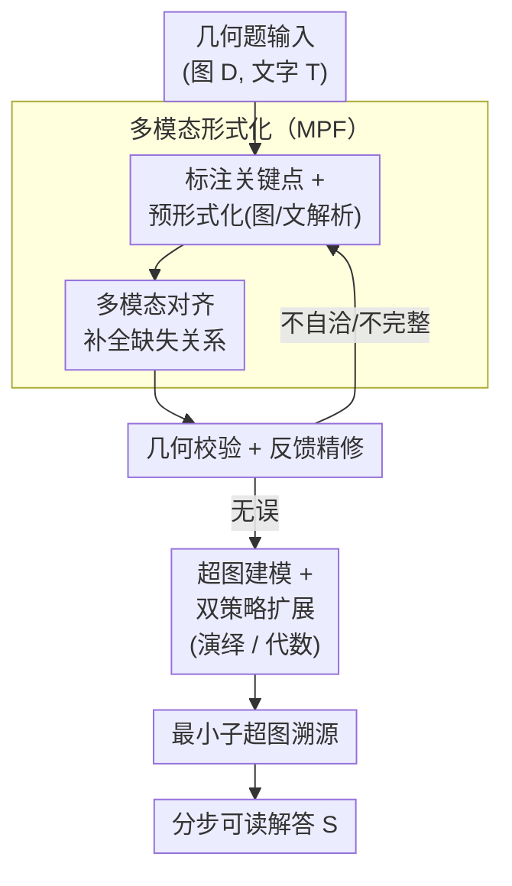

# AutoGPS: Automated Geometry Problem Solving via Multimodal Formalization and Deductive Reasoning

**会议**: ICLR2026  
**OpenReview**: [https://openreview.net/forum?id=PVtZnUh04m](https://openreview.net/forum?id=PVtZnUh04m)  
**代码**: 待确认  
**领域**: 多模态VLM / 几何推理 / 神经符号  
**关键词**: 几何问题求解, 多模态形式化, 演绎符号推理, 超图扩展, 神经符号协同

## 一句话总结
AutoGPS 用一个"多模态形式化器（MPF）+ 演绎符号推理器（DSR）"的神经符号协同框架，把平面几何题先翻译成形式语言、再以超图扩展的方式做严格演绎，最终给出既正确又可逐步追溯的解题过程，在 Geometry3K / PGPS9K 上达到 SOTA，并把人评的逐步逻辑正确率从 MLLM 的 ~71% 提到 99%。

## 研究背景与动机

**领域现状**：几何问题求解（Geometry Problem Solving, GPS）天然是个多模态任务——既要看懂图（点、线、圆、垂直/平行/相切等关系），又要读懂题干文字，还要做严密的数学推导。目前主流做法分两类：一类是神经方法，包括专用神经求解器（PGPSNet、LANS）和多模态大模型（Qwen2.5-VL、InternVL3、GPT-4o 等）；另一类是符号方法（Inter-GPS、E-GPS），把题目转成形式语言后用预定义规则和代数计算求解。

**现有痛点**：神经方法擅长多模态理解，但会"幻觉"——生成看似合理实则逻辑错误的中间步骤，导致结论错误，而且整条推理链不可追溯、无法定位错在哪一步。符号方法有基本的数学严谨性，但卡在两个地方：一是**形式化不全**，MLLM/规则解析常漏掉阴影区域、直径这类全局信息，输入残缺直接拖垮后续求解；二是它把求解归结为"建一个代数方程组再整体求解"，解的过程没有可追溯性，给不出人能读懂的分步证明。

**核心矛盾**：可靠性（reliability）和可解释性（interpretability）这两件事，纯神经和纯符号各占一半却都做不全——神经有理解力但不可靠，符号有严谨性但形式化不全且过程不透明。

**本文目标**：作者把它分解成两个子问题——(1) 怎么把多模态几何题**完整、准确**地形式化；(2) 怎么在形式化之上做出**既严格又人类可读**的分步推导。

**切入角度**：让神经管"理解与形式化"、符号管"严格演绎"，并且让符号端**反过来校验**神经端的形式化、形成闭环；同时把求解过程显式建模成可追溯的图结构，而不是黑箱代数求解。

**核心 idea**：用"MPF 做多模态形式化 + DSR 把求解建成超图扩展任务"的协同框架，把几何解题变成一条节点-超边都可回溯的演绎链，从而同时拿到可靠性和可解释性。

## 方法详解

### 整体框架
AutoGPS 接收一对几何题输入 $(D, T)$（$D$ 是几何图、$T$ 是题干文字），目标是产出正确答案 $a^*$ 以及一条分步推理过程 $S = \{s_1, s_2, \dots, s_n\}$。整条管线分两大组件串行、并带一个反馈回环：**MPF（多模态问题形式化器）** 把 $(D, T)$ 翻成形式语言集合 $L = \{l_1, \dots, l_k, \text{Find}(t)\}$（每个 $l_i$ 是形式语言文字，如 $\text{Line}(A,B)$，$\text{Find}(t)$ 标出求解目标）；**DSR（演绎符号推理器）** 先校验 $L$ 的自洽与完整，把发现的问题反馈给 MPF 反复精修，直到形式化无误；随后 DSR 把解题建模成**超图扩展任务**——文字当节点、推导步当超边——交替用演绎推理和代数推理扩张超图，直到命中解节点 $a^*$；最后从扩张后的大图里抽出连接起点到 $a^*$ 的**最小子超图**，拓扑排序后翻译成人类可读的分步解答。

### 关键设计

**1. 多模态问题形式化器 MPF：把"看懂图文"拆成标注→预形式化→对齐三步，专治形式化不全**

针对"MLLM/规则解析漏信息、形式化不完整"这个痛点，MPF 不让大模型一口气端到端吐形式语言，而是设计成一个带工具库的多模态 agent，按固定三步走。**标注（Annotation）**：现实几何图常缺关键点标签，而形式语言依赖点标签，于是用一个 FPN 架构的预训练模型 $M_a$ 检测交点、圆心等关键点并打上标签，$Pt, Y = M_a(D)$，得到带标注的新图 $D' = (D, Pt, Y)$。**预形式化（Pre-formalization）**：用一个基于 PGDP-Net 的图解析器 $M_d$ 从 $D'$ 抽几何基元和关系 $P_g, R = M_d(D')$（如线段、圆、$BD \perp BC$），同时用规则式文本解析器 $M_t$ 把题干翻成伪形式文字 $T'$（"伪"指还含 $\text{Shape}(\$)$ 这类未知占位，且作者扩展了模式匹配规则以处理等式链这类复杂表达），合成 $F = (P_g, R, T')$。**多模态对齐（Multimodal Alignment）**：预形式化可能漏掉阴影区域、直径等全局信息，于是把 $D'$ 和 $F$ 一起喂给 MLLM，让它澄清歧义、补全缺失，输出完整形式化集合 $L$。三步分工的好处是：神经模型各管自己最擅长的一段（点检测、图解析、全局对齐），而规则解析器在文本侧提供高效率，整体比"纯端到端 seq2seq"更准更省。消融显示去掉预形式化后求解准确率暴跌 50.9%–62.4%，去掉对齐再掉 7.8%–13.0%，说明这两步都是形式化质量的命门。

**2. 几何校验 + 反馈精修闭环：让符号端反过来给神经端纠错，直到形式化无误才开算**

针对"规则式符号求解器对输入极其敏感、残缺/矛盾的形式化会直接算崩"这个痛点，DSR 在真正求解前先做一道**几何校验（Geometry Validation）**：把 $L$ 构造成符号表示 $d$，检查关系是否自洽且完整。如果形式化不完整但能用已有知识补全（如已知 $PH \perp AB$ 且 $H$ 在 $AB$ 上，就自动补出 $PH \perp AH$、$PH \perp BH$），引擎自动补；如果出现矛盾（如同时断言 $A,B,C$ 共线又写了 $\text{Triangle}(A,B,C)$），就标记为不一致。**关键在于这是个闭环**：不一致的形式化带着错误信息被退回 MPF 精修、重新提交，反复迭代直到 DSR 收到一份自洽形式化为止；超过最大迭代阈值则判定该题不可解。这条 MPF↔DSR 的反馈链，本质上让"严格但死板"的符号引擎去监督"灵活但易错"的神经 agent，把可靠性从源头（形式化质量）就守住，而不是等算到一半才发现输入是错的。

**3. 超图建模 + 演绎/代数双策略扩展：把解题变成可追溯的超图扩张，而非黑箱代数求解**

针对"传统符号解法把求解归结为整体解代数方程组、过程不可追溯"这个痛点，DSR 借鉴 AlphaGeometry 把推理建成超图。**超图建模**：强制每一步 $s_i$ 遵循三段论结构——定理 $t \in T$、前提集 $P = \{p_1, \dots, p_m\}$、结论集 $Q = \{q_1, \dots, q_{m'}\}$，记作 $P \xrightarrow{\;t\;} Q$（如 $\{\triangle ABC, AB \perp AC\} \xrightarrow{\text{勾股}} \{AB^2 + AC^2 = BC^2\}$）；每个文字是节点、每个推导步是超边，构成超图 $G = (V, E)$，初始用一条"Known Facts"超边把起点连到所有已知文字。**双策略扩展**：AlphaGeometry 只覆盖演绎和几何关系传递，做不了一般代数方程求解，作者于是用两个互补策略统一扩张——*演绎推理*在节点集上匹配定理生成新超边和结论节点；*代数推理*则把代数求解拆成**逐步变换**而非整体求解，含四种原子操作（等价替换、常量求值、单变量非线性方程求解、线性方程组求解），每个变换也写成特殊的演绎超边，如 $\{a=b, b=\sin(x)\} \xrightarrow{\text{等价替换}} \{a=\sin(x)\}$。两个策略交替执行直到命中解文字 $a^*$（形如 $\text{Equals}(t, v)$）。为防循环推理，DSR 追踪每个节点的全部祖先、禁止向祖先回推，保证整图是有向无环超图。这样一来，求解的每一步都是一个显式、可读、可回溯的三段论，从根上换掉了"代数黑箱"。

**4. 最小子超图溯源：从一堆冗余推导里抽出最短证明，让解答既正确又简洁**

扩张后的超图往往很大、含大量与最终答案无关的推导。针对"解答冗长、不像人写的"这个痛点，DSR 做**最小解生成（Minimal Solution Generation）**：在命中 $a^*$ 后，找一个连接起点到 $a^*$ 的最小子超图，要求满足单源（唯一入度为零的起点）、单汇（唯一出度为零的解节点 $a^*$）、且在所有满足前两条的子图中**超边数最少**。这本质是超图最短路径问题，一般 NP-hard，但在本文这种有向无环超图上可多项式时间求解。拿到最小子图 $G_{\min}$ 后先拓扑排序定依赖序，再把排好序的超边翻成人类可读的分步解答 $S$。效果很直接：在 Geometry3K 真值形式化上，平均推理步数从 237.15 步压到 16.69 步（约 93% 削减），既不牺牲严谨性又让证明短到人能跟着读——这正是 99% 逐步逻辑正确率的来源。

### 一个完整示例
以图 3 的"求三角形面积"题走一遍：输入图文 → MPF 标注出 $A,B,C,D$ 等关键点 → 图解析器抽出 $\text{Line}(A,B)$、$BD \perp BC$ 等基元与关系，文本解析器把 $\text{Find}(\text{AreaOf}(\text{Shape}(\$)))$ 这类伪目标解析出来 → 多模态对齐补全后得到完整形式化 $L$（含 $\triangle ADC$、各边长、垂直关系、$\text{Find}(\text{AreaOf}(\triangle ADC))$）→ DSR 校验自洽（无误，否则退回 MPF）→ 建超图，交替扩展：Step 1 三角形定义得 $\triangle BCD$，Step 2 勾股得 $BC^2 + BD^2 = CD^2$，Step 3 三角形面积公式得 $\text{Area}(\triangle ACD) = AC \times BD / 2$，……一路推到 $BD = 12$、$\text{Area}(\triangle ACD) = 60$ → 从这堆推导里抽最小子超图、拓扑排序，输出 11 步左右的可读证明，答案 60。对照同题的 Qwen2.5-VL-32B：它会"看图说话"地猜出 76（把面积当成周长式地乱套公式），整条链不可追溯——这就是神经幻觉与本文严格演绎的直观差别。

## 实验关键数据

### 主实验
在 Geometry3K（3,001 题）与 PGPS9K（9,000 题）上，同时用 Choice（选择）与 Completion（填空）两种格式评测。AutoGPS（GPT-4o 版）在 Completion 上超过此前 SOTA：

| 数据集 | 指标 | AutoGPS(GPT-4o) | 之前SOTA(LANS) | 提升 |
|--------|------|-----------------|----------------|------|
| Geometry3K | Completion | 75.4 | 71.3 | +4.1% |
| PGPS9K | Completion | 75.3 | 66.1 | +9.2% |
| Geometry3K | Choice | 81.6 | 82.3 | -0.7%（持平） |
| PGPS9K | Choice | 81.5 | 73.8 | +7.7% |

相比最强数学推理 MLLM，Completion 上分别领先 18.0% 和 26.4%。值得注意的是神经方法在开放式 Completion 上普遍大跌（Qwen2.5-VL-32B 在 Geometry3K 掉 25.7%），因为没有选项约束时概率式猜测撑不住；而 AutoGPS 两种格式差距仅 $\Delta = 6.2\%$，靠的是规则化符号推理而非数据驱动猜测。

### 消融实验

| 配置 | 关键指标（Completion） | 说明 |
|------|----------------------|------|
| Full model (GPT-4o) | 75.4% | 完整模型 |
| w/o 预形式化 | 22.6% | 直接从标注图文生成形式化，暴跌约 52.8% |
| w/o 多模态对齐 | 64.1% | 仅预形式化无对齐，掉约 8.6%（InterGPS 求解器下仍 +4.2%） |
| w/o 最小解生成 | 步数 237.15 | 关掉 MSG 后平均步数从 16.69 飙到 237.15 |

### 关键发现
- **预形式化是命门**：去掉后准确率从 75.4% 跌到 22.6%（跨模型掉 50.9%–62.4%），因为 MLLM 直接生成的形式化常把共线性等关系搞错，预形式化把"抓准几何配置"这一步兜住了。
- **形式化质量直接决定成败**：AutoGPS 形式化与真值的 Jaccard 相似度 0.868，远高于 InterGPS 的 0.395，对应 Completion 准确率 +27.6%——证明可靠性的瓶颈在"翻译得准不准"。
- **可靠性是最大亮点**：在所有方法都答对的 100 题子集上做人评逐步正确率，MLLM 仅 67%–71%（仍有 29%–33% 步骤逻辑有缺陷），AutoGPS 达 99%；这说明"答案对"和"过程对"是两回事，符号演绎把后者也守住了。
- **噪声鲁棒**：DSR 能在推理中自动发现几何矛盾（如直角三角形某直角边 $19+27=46$ 超过斜边 $41$）并报冲突，对教育/辅导这类真实场景有价值。

## 亮点与洞察
- **让符号端校验神经端，形成闭环纠错**：MPF↔DSR 的反馈精修把"形式化错误"在求解前就拦掉，是神经-符号协同里很实用的一招——不是简单地"神经生成、符号执行"，而是符号反过来当神经的老师。
- **把代数求解拆成可追溯的原子超边**：传统符号解法整体解方程组、不可读；本文把"解方程"也写成等价替换/求值等三段论超边，使代数和演绎在同一张超图里统一表达，是拿到 99% 可读性的关键工程巧思。
- **"先扩张再抽最小子图"的解耦**：搜索时大胆铺开（237 步），输出时只留最短证明（16.7 步），把"找得到"和"讲得清"两个目标分开优化，这个思路可迁移到任何需要"先搜索后精简证明链"的推理任务（定理证明、程序合成）。
- **最让人啊哈**：同样的 MLLM（GPT-4o），换成自己直接解只有约 68% 逐步正确，套上 AutoGPS 框架后逐步正确率冲到 99%——说明瓶颈不在模型本身的"算力"，而在缺一套强制严谨的外部推理骨架。

## 局限与展望
- **依赖多个预训练专用模块**：关键点检测 $M_a$（FPN）、图解析 $M_d$（PGDP-Net）都是为平面几何训练的，迁移到立体几何、函数图像或其他视觉数学领域需重训，泛化范围受限。
- **规则与定理库是人工预定义的**：DSR 的演绎依赖预设定理集 $T$ 和文本解析规则，题型超出规则覆盖（更复杂的表达、非标准记号）时可能形式化失败而判"不可解"，扩展性靠人工补规则。
- **可解释性评测样本偏小**：99% 逐步正确率只在"所有方法都答对的 100 题"子集上人评，难题/失败题上的过程质量未充分量化；附录虽有失败案例分析，但 robustness 的边界仍需更大规模验证。
- **改进方向**：把规则式文本/图解析逐步换成可学习且仍可验证的模块、或让定理库支持自动归纳，可望降低对人工规则的依赖，并向立体几何等更广领域扩展。

## 相关工作与启发
- **vs 纯神经 MLLM（Qwen2.5-VL / InternVL3 / GPT-4o）**：它们多模态理解强但靠概率生成推理链、会幻觉、不可追溯；AutoGPS 让 MLLM 只负责形式化、把推导交给符号引擎，逐步正确率从 ~70% 提到 99%，本质是"用符号骨架约束神经的自由度"。
- **vs 纯符号 Inter-GPS / E-GPS**：它们有基本严谨性但形式化不全（Jaccard 仅 0.395）且整体解方程不可读；AutoGPS 用多模态对齐补全形式化（Jaccard 0.868）、用超图扩展+最小子图把过程变可读，可靠性和可解释性双补。
- **vs AlphaGeometry**：AlphaGeometry 的超图思路强在几何证明，但只覆盖演绎和关系传递、做不了一般代数求解；AutoGPS 把代数求解也统一进超图超边（四种原子操作），把适用范围从"证明"扩到"数值求解"。
- **vs 神经-符号方法 GeoDRL / FGeo-HyperGNet**：它们用神经做启发式搜索来缩小符号求解空间、侧重效率；AutoGPS 更强调形式化的完整性（闭环精修）与解答的人类可读性（最小子图溯源），落点在可靠+可解释而非单纯加速。

## 评分
- 新颖性: ⭐⭐⭐⭐ MPF↔DSR 闭环精修 + 把代数求解统一进超图扩展、再抽最小子图，是对 AlphaGeometry 范式的实用扩展
- 实验充分度: ⭐⭐⭐⭐⭐ 两数据集双格式、对比三类基线、形式化质量/逐步可靠性/噪声鲁棒/步数压缩消融齐全，还有人评
- 写作质量: ⭐⭐⭐⭐ 框架清晰、图示到位，三段论与超图表述严谨，少数符号细节需查附录
- 价值: ⭐⭐⭐⭐⭐ 99% 逐步逻辑正确率 + 可追溯证明，对几何教育/辅导这类要求可靠可解释的场景有直接落地价值

<!-- RELATED:START -->

## 相关论文

- [\[ICLR 2026\] No Labels, No Problem: Training Visual Reasoners with Multimodal Verifiers](no_labels_no_problem_training_visual_reasoners_with_multimodal_verifiers.md)
- [\[ICLR 2026\] Evaluating Cross-Modal Reasoning Ability and Problem Characteristics with Multimodal Item Response Theory](evaluating_cross-modal_reasoning_ability_and_problem_characteristics_with_multim.md)
- [\[AAAI 2026\] AStar: Boosting Multimodal Reasoning with Automated Structured Thinking](../../AAAI2026/vlm_reasoning/astar_boosting_multimodal_reasoning_with_automated_structure.md)
- [\[CVPR 2026\] SpatialStack: Layered Geometry-Language Fusion for 3D VLM Spatial Reasoning](../../CVPR2026/vlm_reasoning/spatialstack_layered_geometry-language_fusion_for_3d_vlm_spatial_reasoning.md)
- [\[CVPR 2026\] G$^2$VLM: Geometry Grounded Vision Language Model with Unified 3D Reconstruction and Spatial Reasoning](../../CVPR2026/vlm_reasoning/g2vlm_geometry_grounded_vision_language_model_with_unified_3d_reconstruction_and.md)

<!-- RELATED:END -->
