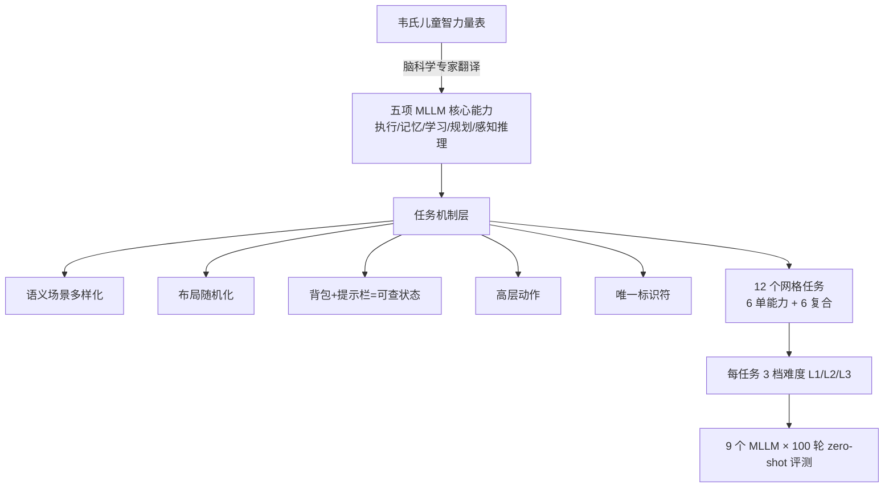

# Children's Intelligence Tests Pose Challenges for MLLMs? KidGym: A 2D Grid-Based Reasoning Benchmark for MLLMs

**会议**: ICLR 2026  
**OpenReview**: [https://openreview.net/forum?id=Hj8Dc14nk1](https://openreview.net/forum?id=Hj8Dc14nk1)  
**代码/项目主页**: [https://kidgym.github.io/KidGym-Website/](https://kidgym.github.io/KidGym-Website/)  
**领域**: MLLM 评测 / 认知能力基准 / 交互式推理  
**关键词**: MLLM Benchmark, Wechsler 智力量表, 2D 网格交互, 认知能力评估, 动态任务  

## 一句话总结
受儿童韦氏智力量表启发，把"通用智能"拆成执行、感知推理、学习、记忆、规划五项可测能力，构建了一个含 12 个 2D 网格交互任务、三档难度、可自定义扩展的动态基准 KidGym，系统揭示了当前顶尖 MLLM 在非语义抽象视觉、数量感知、复合能力任务上的明显短板。

## 研究背景与动机
**领域现状**：多模态大模型（MLLM）把语言模型的能力延伸到图像、视频等模态，目标是逼近人类一样"通用"的认知。心理测量学（psychometric AI）一直主张：用经过验证的人类能力量表去测 AI，比堆叠任务专属 benchmark 更能反映通用推理水平。儿童智力测试（如韦氏量表 Wechsler Scales）正是把智能分解成一组可解释、可测的子能力，天然契合"profile 多种协同能力"的评测诉求。

**现有痛点**：当前 MLLM 基准存在三个结构性缺陷——(1) **以静态问答为主**，信息在整个任务过程中保持不变，缺乏需要持续与环境交互、随状态演化做决策的动态任务；(2) **多为孤立单能力评测**，无法刻画记忆、规划等能力如何在真实场景中交互、协同；(3) 难以排除预训练数据泄露（同类场景被模型背下来）。已有交互式环境（如 MiniGrid、Crafter）又多为强化学习设计、或把场景转成纯文本描述，并不适合直接评测"看图决策"的 MLLM。

**核心矛盾**：人类智能可以一对一映射到韦氏量表的子测验，但 MLLM 与人在具身方式、交互模态上根本不同，**直接照搬韦氏子测验并不合理**——每项能力都需要为模型的架构与功能特性"量身定义"。

**本文目标**：构建一个动态、交互、可同时评估多维能力、且可自定义扩展的统一 2D 基准，并据此诊断顶尖 MLLM 的真实能力边界。

**核心 idea**：`能力分解 + 游戏化交互`。与儿童脑科学专家合作，把韦氏量表最重要的指标翻译成 MLLM 适用的五项核心能力（执行 / 记忆 / 学习 / 规划 / 感知推理），再用 Gym API 把它们落地为 12 个随机化布局、分难度的网格游戏任务，让模型像孩子一样"边玩边被测"。

## 方法详解

### 整体框架
KidGym 的设计可拆成三层：上层是从韦氏量表蒸馏出的**五项 MLLM 核心能力定义**；中层是一套针对 MLLM 强弱项专门设计的**任务机制**（语义场景多样化、布局随机化、背包与提示栏、高层动作、唯一标识）；下层是 **12 个 Gym 风格任务**（6 个单能力 + 6 个复合能力，各 3 档难度 L1/L2/L3），模型每一步看一帧"场景地图 + 背包 + 提示栏"图像，输出高层动作，通过多轮交互完成任务。

### 关键设计

**1. 五项核心能力的"MLLM 化"重定义：从人类量表到模型可测指标。** 这是全文的认知地基。作者不照搬韦氏子测验，而是逐项重写定义以适配 MLLM：**执行**指模型把推断出的目标与约束转化为具体行为的能力（连接抽象目标与可验证行为）；**记忆**强调维持长程上下文依赖——因为 MLLM 每步都能重读完整交互历史，其"记忆"不是重建碎片化片段而是保持上下文一致；**学习**指模型在不微调的前提下，吸收此前未见过的新规则并即时调和与已有知识的冲突；**规划**指系统化组织任务、预判动作后果、执行多步策略、平衡短期动作与长期目标；**感知推理**指直接从视觉输入做推断决策，超越物体识别，需构建连贯逻辑链。这套定义保证了每个任务都能锚定到明确、可操作的能力维度。

**2. 任务机制：针对 MLLM 强弱项的"刻意设计"。** 作者把对 MLLM 失效模式的理解直接编码进交互机制。**布局随机化**让每一局的物品位置、智能体出生点都随机初始化，加上**语义场景多样化**（超市、食堂、农场等不同上下文），共同确保模型不能靠背预训练里的相似场景过关，从而在一定程度上缓解数据污染、降低评测方差。**背包与提示栏**把"已拾取道具""规则提示"等隐藏状态显式做成可查询的任务状态组件，解决 MLLM "上一步捡了钥匙、下一步却忘了自己有钥匙"的上下文断裂问题。**高层动作**让模型直接执行"捡起篮球"这类宏观动作，而非"前进一步/左转"的原子操作——因为 MLLM 不擅长细粒度控制，这样能聚焦于真正与结果相关的决策。**唯一标识符**给每个道具编号/字母，让"把背包 A 的道具放进 2 号位置"这类指令把视觉元素与文本描述无歧义地对应起来。

**3. 12 个任务：单能力锚定 + 复合能力叠加的递进结构。** 遵循韦氏量表的心理测量学惯例，每个任务都设计成由一项（或两项）目标能力主导。6 个**单能力任务**各自锚定一项能力：分类（CL）测执行——按指令把道具放进指定容器；选择（SE）测记忆——回忆提示栏里出现过、随后被隐藏的道具；排序（SO）测学习——按一条可能违反常识的新规则（如"动物越快越重"）排序；迷宫（MA）测规划——以最少步数收集对应颜色钥匙开门拿钻石；填充（FI）测感知推理——从背包干扰项里选出图像缺失的四分之一块（含可命名物体）；拼图（PU）测抽象感知推理——把随机块组装成无法用语言描述的任意形状。6 个**复合任务**则在单能力基础上叠加第二项能力，如解码迷宫（DMA，学习+规划，钥匙颜色不再直接对应门、需学"蓝钥匙开黄门"的映射）、记忆迷宫（MMA，记忆+规划，钻石位置先展示后隐藏）、记忆填充（MFI，感知推理+记忆）、记忆解码（MDE，记忆+学习）等。这种"先单后复、逐档加难"的结构让能力交互的失效点被精准暴露出来。

## 实验关键数据

### 主实验表格
9 个 SOTA MLLM（闭源 o3 / GPT-5 / GPT-4o / Gemini-2.5-Pro / Gemini-2.5-Flash / Claude-3.7-Sonnet；开源 DeepSeekVL-2 / QwenVL-2.5 / InternVL-3），每任务 100 轮 zero-shot，指标为相对最优解的成功率。部分代表性数据（L=难度档）：

| 模型 | L | CL(执行) | SE(记忆) | SO(学习) | MA(规划) | FI(感知) | PU(抽象感知) | CO(计数) | MMA(记忆+规划) |
|------|---|------|------|------|------|------|------|------|------|
| o3 | 1 | 1.00 | 1.00 | 0.97 | 0.87 | 0.83 | 0.26 | 0.30 | 0.44 |
| o3 | 3 | 0.92 | 1.00 | 0.97 | 0.27 | 0.30 | 0.06 | 0.13 | 0.05 |
| GPT-5 | 1 | 1.00 | 1.00 | 1.00 | 0.97 | 0.74 | 0.30 | 0.36 | 0.62 |
| Gemini-2.5-Pro | 1 | 0.99 | 1.00 | 0.99 | 0.95 | 0.81 | 0.19 | **0.72** | 0.66 |
| GPT-4o | 1 | 0.46 | 1.00 | 0.48 | 0.33 | 0.66 | 0.26 | 0.00 | 0.00 |
| GPT-4o | 3 | 0.13 | 0.50 | 0.08 | 0.00 | 0.15 | 0.03 | 0.01 | 0.00 |

随机基线在 PU-L1 约 0.25；人类在 CO 任务三档难度均为 1.00。

### 消融实验表格
对比 zero-shot / CoT / ICL 三种推理方法在部分任务与模型上的影响：

| 推理方法 | 现象 |
|---------|------|
| CoT vs zero-shot（Gemini-2.5-Flash） | CoT 带来显著提升 |
| CoT vs zero-shot（o3） | 几乎无差异（o3 本身已内置 CoT） |
| ICL vs zero-shot（记忆/学习类任务） | ICL 有时反而更差——场景随机生成时，模型过度依赖示例、忽视场景动态变化 |
| 提高图像分辨率（CO 任务） | 多个模型计数准确率上升，而人类无需更清晰图像 |

### 关键发现
- **闭源全面碾压开源**，且 o3、GPT-5、Gemini-2.5-Pro 在 CL、SE、MDE 等任务上可达近乎满分；但成功率随难度从 L1 到 L3 普遍下降，验证了任务难度分级的有效性。
- **非语义抽象视觉是硬伤**：FI（含可命名物体）最高 0.83，而 PU（任意随机块）最高仅 0.30（仅比随机高 5 个百分点），说明前沿模型仍难以处理无法语言化的抽象图像。
- **数量感知不可靠**：CO 任务对人类是 1.00，最强的 Gemini-2.5-Pro 在最简单档也只有 0.72；失败时模型常把两三个聚成一堆的物体当成一个，且依赖高分辨率视觉线索而非稳健的数感表征。
- **复合任务显著掉点**：MMA/MFI 在 MA/FI 基础上加记忆要求后成功率大幅下滑，说明 MLLM 难以同时处理多类信息或兼顾多条相互关联的规则。
- 整体上模型在**感知推理与规划**任务上表现相对最差。

## 亮点与洞察
- **从心理测量学借力，给"通用智能评测"找了一把有信度的尺子**：用儿童智力量表做能力分解的思路，比堆任务专属 benchmark 更有理论支撑，也让结果可解释（每个分数对应一项明确能力）。
- **"为 MLLM 重定义能力"而非照搬人类量表**，与脑科学专家协作，避免了拟人化误用——这是方法论上的克制与严谨。
- **动态交互 + 随机化布局 + 多样语义场景**三管齐下抗数据污染，比静态 QA 更难"背答案"，评测更可信。
- **基于 Gym API、完全可自定义可扩展**，难度可调、场景可加，能跟上 MLLM 快速迭代的步伐。
- 揭示的短板（抽象视觉、数感、复合能力）很有诊断价值，为后续模型改进指了方向。

## 局限与展望
- **仅限 2D 网格、高层动作**：刻意回避了原子级精细控制和 3D/具身场景，所测的"规划/执行"与真实机器人控制仍有距离。
- **zero-shot 为主**：CoT/ICL 只在部分任务模型上测，提示工程与 agent 框架（如多轮反思、工具调用）对成绩的影响尚未充分探索。
- **能力定义带主观性**：五项能力如何从韦氏量表"翻译"过来、任务如何锚定到能力，存在设计者判断，可能影响结论的普适性。
- **成功率作为唯一指标**较粗，未深入刻画失败模式的细粒度归因（虽有定性分析，如"把多个物体看成一个"）。
- 展望：可向 3D、连续控制、多智能体协作扩展，并引入更细的过程性指标与失败诊断。

## 相关工作与启发
- **心理测量学 AI / 通用心理测量**（Voudouris 等）：主张用验证过的人类能力量表测 AI，KidGym 是这一思想在 MLLM 上的具体落地。
- **交互式 RL 环境**（MiniGrid、Crafter、Procgen、SmartPlay）：提供了动态游戏化评测范式，但多为 RL 设计或转成纯文本，KidGym 针对"看图决策"的 MLLM 重新设计。
- **MLLM 静态基准**（计数 Countgd、推理 CompBench/MaRs-VQA、抽象 ARC-AGI-2、规划 EgoPlan、记忆 MileBench）：各测孤立能力，KidGym 的差异化在于动态 + 可扩展 + 同时评估复合能力。
- **启发**：用儿童认知发展阶段做评测脚手架，是给 AGI 评测"分层打表"的可迁移范式；其揭示的"数感不稳/抽象视觉弱"也为视觉编码器与表征学习提出了改进靶点。

## 评分
- **新颖性**: ⭐⭐⭐⭐ — 把儿童韦氏量表系统地翻译成五项 MLLM 能力并落地为动态交互基准，视角新颖、理论根基扎实，区别于一众静态 QA benchmark。
- **实验充分度**: ⭐⭐⭐⭐ — 覆盖 9 个主流闭源/开源模型、12 任务 × 3 难度、100 轮 zero-shot，并补充 CoT/ICL、分辨率、人类/随机基线的对照，诊断结论有说服力。
- **写作质量**: ⭐⭐⭐⭐ — 能力定义、任务机制、挑战归纳条理清晰，图表（12 任务预览、对比表）直观。
- **价值**: ⭐⭐⭐⭐ — 提供了一把可解释、抗污染、可扩展的评测尺子，揭示的抽象视觉/数感/复合能力短板对社区有明确指引，开源可用。

<!-- RELATED:START -->

## 相关论文

- [\[ICLR 2026\] OCR-Reasoning Benchmark: Unveiling the True Capabilities of MLLMs in Complex Text-Rich Image Reasoning](ocr-reasoning_benchmark_unveiling_the_true_capabilities_of_mllms_in_complex_text.md)
- [\[ICLR 2026\] SophiaVL-R1: Reinforcing MLLMs Reasoning with Thinking Reward](sophiavl-r1_reinforcing_mllms_reasoning_with_thinking_reward.md)
- [\[ICLR 2026\] Math Blind: Failures in Diagram Understanding Undermine Reasoning in MLLMs](math_blind_failures_in_diagram_understanding_undermine_reasoning_in_mllms.md)
- [\[ICLR 2026\] VidGuard-R1: AI-Generated Video Detection and Explanation via Reasoning MLLMs and RL](vidguard-r1_ai-generated_video_detection_and_explanation_via_reasoning_mllms_and.md)
- [\[ICLR 2026\] Perception-R1: Advancing Multimodal Reasoning Capabilities of MLLMs via Visual Perception Reward](perception-r1_advancing_multimodal_reasoning_capabilities_of_mllms_via_visual_pe.md)

<!-- RELATED:END -->
