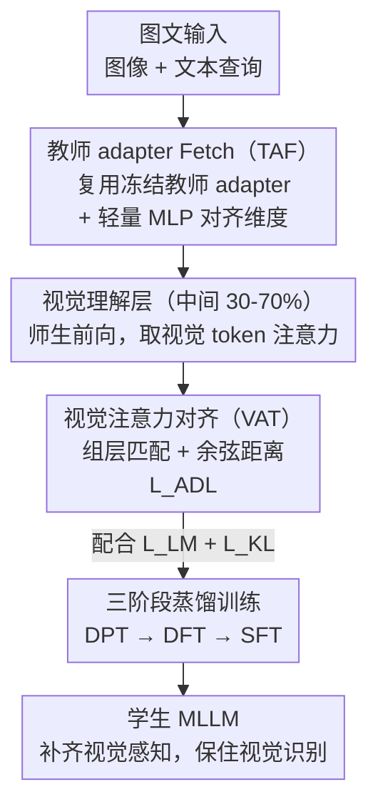

# CompoDistill: Attention Distillation for Compositional Reasoning in Multimodal LLMs

**会议**: ICLR2026  
**OpenReview**: [https://openreview.net/forum?id=Wa9Bg9b50B](https://openreview.net/forum?id=Wa9Bg9b50B)  
**代码**: 待确认  
**领域**: 多模态VLM / LLM推理 / 知识蒸馏  
**关键词**: 多模态大模型, 知识蒸馏, 视觉注意力对齐, 组合推理, 视觉感知

## 一句话总结
CompoDistill 发现现有多模态大模型（MLLM）知识蒸馏只学会了"视觉识别"却学不会"视觉感知"，根因是师生在视觉理解层上的注意力分布错位；它用一个把学生视觉注意力对齐到教师的 VAT 模块、加一个让学生复用教师 adapter 的 TAF 模块，配合三阶段训练，在组合推理任务上把 2B 学生从 61.5 拉到 66.7（CR 平均），逼近 4B 教师，同时不掉 VQA。

## 研究背景与动机
**领域现状**：多模态大模型（MLLM）靠 scaling law 做大做强，但部署成本高，于是知识蒸馏（KD）成了造小模型的主流路线——把一个大教师（如 LLaVA-4B）的视觉与语言知识迁移给小学生（如 2B）。现有 KD 方法（LLaVA-KD、LLaVADI、LLaVA-MoD 等）在 VQA（视觉问答）这类任务上确实显著超过纯监督微调（SFT）的同规模模型。

**现有痛点**：作者抛出一个被忽视的问题——视觉能力其实分两层，**视觉识别**（recognition，识别图里有什么物体）和**视觉感知**（perception，理解物体之间的关系、准确捕捉属性）。把现有 KD 方法放到组合推理（CR）数据集（SugarCrepe、SADE、BiVLC、Winoground）上一测，它们的 CR 成绩竟然和不蒸馏的 SFT 模型持平。也就是说，KD 把"识别"学到了，"感知"没学到。

**核心矛盾**：为什么 KD 在 VQA 上有效、在 CR 上失效？作者可视化师生注意力图发现，对同一句文本（如"A woman is on the table"），教师能聚焦到相关图像区域，而学生注意力跑偏到无关区域。他们把这种师生注意力分布的不匹配命名为**视觉注意力错位（visual attention misalignment）**，并论证：现有 KD 通过 logit/特征蒸馏，并没有让学生继承教师的视觉注意力机制，所以感知能力传不过去。

**本文目标**：先证明"注意力错位"确实是 CR 失效的直接原因，再设计一个能显式对齐师生视觉注意力的蒸馏框架，让学生既补上感知、又不丢识别。

**切入角度**：作者借鉴前人对 MLLM 的分层功能分析——早层做模态对齐、**中间层（总层数 30%–70%）做细粒度语义整合**、后层生成回答——把目光锁定在中间这批"视觉理解层"，认为这里的师生注意力相似度才是决定视觉能力能否蒸馏成功的关键判据。

**核心 idea**：用一句话概括，就是"在视觉理解层上把学生对视觉 token 的注意力对齐到教师，并先把师生的视觉特征空间对齐，再做注意力迁移"。

## 方法详解

### 整体框架
CompoDistill 的输入是图文对，目标是训练一个小学生 MLLM，让它在保住 VQA 的同时把组合推理也学起来。整条流水线先做一个**诊断分析**确立判据，再围绕这个判据搭两个模块、串成三阶段训练。

诊断部分（论文 Section 3）做了三步实证：① 在视觉理解层测师生注意力余弦相似度，发现 VQA 上"教师-学生"相似度明显高于"教师-SFT"，而 CR 上两者持平——说明高相似度才带来提升；② 在 GQA 上把 5000 个样本按师生注意力相似度分组，发现相似度越高、模型给正确答案的概率越高，坐实"对齐→性能"的因果链；③ 推理时直接把学生对视觉 token 的注意力替换成"师生平均"，CR 立刻有小幅稳定提升，反证只要拉近注意力就有用。但作者也发现，若**完全**用教师注意力替换学生，反而会掉点——因为教师注意力是为它自己的视觉-语言空间优化的，硬塞进学生不兼容的特征空间会冲突。这个观察直接催生了下面两个模块的分工。

方法主体由两个模块和三阶段训练构成：**VAT 模块**负责把学生在视觉理解层的视觉注意力对齐到教师（用组层匹配处理师生层数不一致），**TAF 模块**负责把学生的视觉特征空间对齐到教师（复用教师 adapter），二者协同后再用三阶段训练把知识固化进学生参数。

### 关键设计

**1. 视觉注意力对齐 VAT：把"看哪里"从教师搬给学生**

针对的痛点是"学生注意力跑偏导致感知学不会"。VAT 不去蒸 logit 或隐状态，而是直接蒸**注意力矩阵**。Transformer 每层的注意力 $A = \mathrm{softmax}(QK^\top/\sqrt{d}) \in \mathbb{R}^{(N_v+N_t)\times(N_v+N_t)}$ 编码了 token 间的重要性。作者只取与视觉 token 相关的子矩阵——对每个视觉理解层 $l$，保留以视觉 token 为 key 的列，得到 $\tilde{A}_l = A_l[:, :N_v]$，再用师生注意力子矩阵的**余弦距离**作为蒸馏损失 $1 - \mathrm{sim}(\tilde{A}^t, \tilde{A}^s)$。为什么用余弦而不是 MSE/KL？消融（Table 3a）显示余弦最好，作者解释是：学生该学的是视觉 patch 之间的**相对重要性排序**，而不是去硬抠绝对注意力数值。

**2. 组层匹配 Group Layer Matching：教师层比学生多，怎么配对**

教师层数 $m$ 大于学生层数 $k$，没法逐层一一对应。最朴素的做法是按深度比例均匀采样教师层（如学生 5 层、教师 10 层就取教师 $\{1,3,5,7,9\}$ 层），但这会丢掉教师层间分散的感知信息、对齐也不准。作者改用**一对多的滑动窗口分组**：每个学生层 $l_s^j$ 对应一组连续的 $n$ 个教师层 $G_j$，组内注意力取平均后再和学生层算距离：

$$\mathcal{L}_{ADL} = 1 - \frac{1}{k}\sum_{j=1}^{k}\mathrm{sim}\left(\bar{A}^t_j, \tilde{A}^s_{l_s^j}\right), \quad \bar{A}^t_j = \frac{1}{n}\sum_{l\in G_j}\tilde{A}^t_l.$$

为保证用上全部教师层，窗口大小取闭式 $n = m - k + 1$。这样既让学生吸收教师跨多层的更广知识，又大致保持层序。消融（Table 3c）显示 Group 优于 Simple（均匀采样）和 Adaptive（按层距离找最优配对），尤其在师生深度差异大时更稳。

**3. 教师 adapter Fetch TAF：先把"视觉空间"对齐，注意力迁移才生效**

这是全文最关键的一笔，直接来自"完全替换教师注意力反而掉点"的观察。adapter 把视觉特征投影进 LLM 语言空间、生成供注意力机制处理的视觉 token；教师的注意力机制是和它**自己 adapter 的输出**紧耦合的，强行把这套注意力压到一个视觉空间不兼容的学生身上，会造成特征空间与注意力机制冲突，反而限制学生的感知。TAF 的解法是让学生**直接复用教师冻结的预训练 adapter** $P^t_{\psi^t}$，只在后面加一个轻量可训练 MLP $P^s_{\psi^s}$ 做维度对齐：

$$x_v = P^s_{\psi^s}\left(P^t_{\psi^t}(z_p)\right) \in \mathbb{R}^{N_v \times d_s}.$$

这保证学生"透过和教师同一副眼镜"看视觉输入，让 VAT 的注意力迁移真正落地。作者特别坦言：注意力蒸馏本身不是新概念（扩散模型、数据集蒸馏、语言模型里都有），CompoDistill 的真正贡献是**识别出 MLLM 蒸馏失效的判据（视觉注意力错位）**，并用 TAF 解决了 MLLM 场景特有的视觉空间不匹配难题。

**4. 三阶段蒸馏训练：把对齐好的知识固化进学生**

两个模块要落到一个训练流程里。训练有两个基础目标：自回归语言建模损失 $\mathcal{L}_{LM}$ 和 logit 级 KL 散度损失 $\mathcal{L}_{KL}$（让学生预测分布逼近教师）。三阶段分别是：① **DPT（蒸馏预训练）**——对齐视觉特征空间，用 TAF 构造 adapter（教师 adapter 冻结），只训学生 adapter $P^s_{\psi^s}$，视觉编码器和 LLM 冻结，目标 $\mathcal{L}_{LM} + \mathcal{L}_{KL}$；② **DFT（蒸馏微调）**——加入 VAT 对齐视觉注意力，同时微调学生 LLM 和 adapter，目标 $\mathcal{L}_{LM} + \mathcal{L}_{KL} + \mathcal{L}_{ADL}$；③ **SFT（监督微调）**——只用 $\mathcal{L}_{LM}$ 微调学生，把前两阶段迁移来的知识固化进学生自身参数，并强化指令跟随能力。

## 实验关键数据

师生均用 SigLIP 视觉编码器 + Qwen1.5 系列 LLM，学生 1.8B、教师 4B。VQA 用 VQAv2/VizWiz/GQA/TextVQA/MME，CR 用 SugarCrepe/SADE/BiVLC/Winoground，指标为准确率。

### 主实验

| 模型（2B 档） | 训练样本 | VQA 平均 | CR 平均 |
|--------------|---------|---------|---------|
| LLaVA-2B (SFT) | 1.2M | 54.9 | 60.7 |
| LLaVA-KD-2B | 1.2M | 61.6 | 61.5 |
| LLaVA-MoD-2B | 5.0M | 58.9 | 62.6 |
| **CompoDistill-2B** | **1.2M** | **61.9** | **66.7** |
| LLaVA-4B (教师) | 1.2M | 62.6 | 70.3 |

关键看点：现有 KD（如 LLaVA-KD）VQA 拉到 61.6 但 CR 只有 61.5、几乎等于 SFT 的 60.7；CompoDistill 把 CR 平均拉到 66.7，逼近 4B 教师的 70.3，同时 VQA 平均 61.9 与最好的 KD 持平。而且只用 1.2M 样本，远少于 LLaVA-MoD（5M）、MiniCPM-V（570M），数据效率高。

### 消融实验

VAT 与 TAF 模块拆解（此表 VQA 平均仅按 GQA/TextVQA/MME 三项算，故与主表 5 项平均口径不同）：

| 配置 | VAT | TAF | VQA 平均 | CR 平均 |
|------|-----|-----|---------|---------|
| (a) baseline | ✗ | ✗ | 56.8 | 62.9 |
| (b) +VAT | ✓ | ✗ | 57.9 | 65.0 |
| (c) +TAF | ✗ | ✓ | 61.3 | 63.8 |
| (d) Full | ✓ | ✓ | 62.9 | 66.7 |

VAT 模块内部细粒度消融（Table 3）：注意力损失用余弦相似度（CR 66.7）优于 MSE（65.2）和 KL（65.5）；目标层选中间层（30–70%，CR 66.7）优于早层（63.7）/后层（64.6）/全层（66.6）；层匹配用 Group（66.7）优于 Simple（65.6）和 Adaptive（65.7）。

### 关键发现
- **VAT 主攻 CR，TAF 主攻"让对齐生效"**：单加 VAT（b）CR 涨明显但 VQA 涨得少；单加 TAF（c）VQA 涨明显（56.8→61.3），因为它先对齐了特征空间；两者合起来（d）才双双最优——印证了"特征空间不对齐时，注意力迁移会冲突"的核心论点。
- **中间层是视觉理解层**：只在 30–70% 层做注意力蒸馏效果最好，验证了 Section 3 关于"视觉理解层负责视觉-语义整合"的分析。
- **副产物——缓解关系幻觉**：在 R-Bench / Reefknot 上 CompoDistill-2B（F1 78.6 / 66.7）显著超过其它 KD，接近教师（79.1 / 67.9），说明把"物体关系"看准了，关系幻觉也跟着减轻。
- **可扩展性**：数据翻倍（1.2M→2.4M）CR 从 66.7 升到 69.9；教师越大学生越强（7B 教师带出的 1.8B 学生 CR 67.8 > 4B 教师的 66.7）；换 MobileLLaMA backbone 仍有效，说明方法不挑骨干。

## 亮点与洞察
- **把"蒸馏失败"诊断成一个可测的判据**：作者没有上来就堆模块，而是先用注意力相似度分析回答"为什么 KD 学不会感知"，再用相似度-答案概率的正相关、推理时注意力替换两个实验把因果链补全——这种"先证病因再开药方"的写法很有说服力，判据本身（视觉理解层的师生视觉注意力相似度）就是可复用的诊断工具。
- **TAF 的"复用教师 adapter"很巧**：它点破了一个反直觉现象——直接搬教师注意力会掉点，原因是视觉空间不兼容；与其重训对齐，不如让学生干脆用教师那副"眼镜"，只加薄薄一层 MLP 补维度。这个"先统一输入空间再迁移机制"的思路可迁移到任何"想搬 A 的中间机制到 B、但 A/B 表示空间不同"的蒸馏场景。
- **组层匹配解决跨深度蒸馏的通用痛点**：滑动窗口一对多 + 闭式窗口大小 $n=m-k+1$ 保证用满教师层，比均匀采样/自适应配对都稳，可直接搬到任何师生层数不等的注意力/特征蒸馏。

## 局限与展望
- 作者明确声明本文**不是要提出全新的蒸馏方法**，主贡献在于识别判据；因此 VAT（注意力蒸馏）、KL logit 蒸馏等组件本身都是已有技术的组合，方法新颖性更多体现在"诊断+TAF"。
- 实验全部在 LLaVA 系列 + Qwen1.5/MobileLLaMA backbone、4B 教师量级上展开，更大教师（如 13B+）、更强 backbone（如 Qwen2.5-VL 全家桶）下的结论是否保持还需验证。
- 师生必须共享同款视觉编码器（都用 SigLIP）TAF 才能直接复用教师 adapter；当师生视觉编码器不同时，TAF 的"复用冻结 adapter"前提是否成立、要不要额外改造，论文没展开。
- CR 的提升对数据量较敏感（翻倍数据 CR 才到 69.9），离教师 70.3 仍有差距，说明纯靠注意力对齐还没完全补平感知鸿沟。

## 相关工作与启发
- **vs 现有 MLLM KD（LLaVA-KD / LLaVADI / LLaVA-MoD）**：它们主要做 logit/特征/响应蒸馏，能传"视觉识别"但传不了"视觉感知"；CompoDistill 显式蒸注意力并先对齐视觉空间，CR 平均 66.7 远超它们的 61–62。
- **vs 通用注意力蒸馏（扩散模型 / 数据集蒸馏 / 语言模型里的 attention KD）**：那些工作师生在同一表示空间里，注意力可直接迁移；本文指出 MLLM 场景特有的视觉空间不匹配会让朴素注意力迁移失效，并用 TAF 补上这块。
- **vs 自适应层匹配（Adaptive matching）**：自适应按层距离找最优配对，本文的 Group 一对多分组在师生深度差异大时更稳（66.7 vs 65.7），说明"分组求平均"比"找单一最优对"提供了更鲁棒的迁移信号。

## 评分
- 新颖性: ⭐⭐⭐⭐ 方法组件多为已有技术，但"诊断出视觉注意力错位作为判据 + TAF 解决视觉空间不匹配"的视角很新。
- 实验充分度: ⭐⭐⭐⭐⭐ 主表覆盖 9 个数据集、消融拆到损失类型/目标层/匹配策略，还补了关系幻觉、数据/教师/backbone 三轴可扩展性。
- 写作质量: ⭐⭐⭐⭐⭐ "先证病因再开药方"的叙事清晰，分析章节把因果链补得很完整。
- 价值: ⭐⭐⭐⭐ 给 MLLM 蒸馏提供了可测判据和即插即用的 TAF/VAT，对造高效小多模态模型有直接参考价值。

<!-- RELATED:START -->

## 相关论文

- [\[ICLR 2026\] Test-Time Matching: Unlocking Compositional Reasoning in Multimodal Models](test-time_matching_unlocking_compositional_reasoning_in_multimodal_models.md)
- [\[CVPR 2026\] VOLD: Reasoning Transfer from LLMs to Vision-Language Models via On-Policy Distillation](../../CVPR2026/vlm_reasoning/vold_reasoning_transfer_from_llms_to_vision-language_models_via_on-policy_distil.md)
- [\[ICLR 2026\] NePTune: A Neuro-Pythonic Framework for Tunable Compositional Reasoning on Vision-Language](neptune_a_neuro-pythonic_framework_for_tunable_compositional_reasoning_on_vision.md)
- [\[CVPR 2026\] Self-Critical Distillation Network for Video-based Commonsense Captioning](../../CVPR2026/vlm_reasoning/self-critical_distillation_network_for_video-based_commonsense_captioning.md)
- [\[ICLR 2026\] IV-Bench: A Benchmark for Image-Grounded Video Perception and Reasoning in Multimodal LLMs](iv-bench_a_benchmark_for_image-grounded_video_perception_and_reasoning_in_multim.md)

<!-- RELATED:END -->
