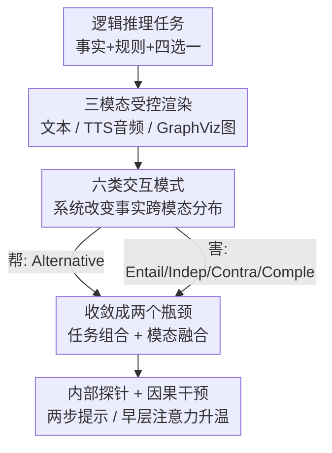

# Compose and Fuse: Revisiting the Foundational Bottlenecks in Multimodal Reasoning

**会议**: ICLR2026  
**OpenReview**: [https://openreview.net/forum?id=oIvIsK5AwB](https://openreview.net/forum?id=oIvIsK5AwB)  
**代码**: 待确认（论文称随附）  
**领域**: 多模态VLM / LLM推理  
**关键词**: 多模态推理, 模态融合, 逻辑推理评测, 可解释性, 注意力分析

## 一句话总结
这篇论文用一套基于命题逻辑、把事实跨模态拆分的"六种交互模式"评测框架，系统证明了多模态大模型（MLLM）推理的真正瓶颈不在感知而在"整合"——并通过注意力探针和因果干预定位出两个根因：**任务组合瓶颈**（识别与推理无法在一次前向里联合完成）和**融合瓶颈**（早期层的模态融合引入偏置），还给出了"两步提示"和"早层注意力升温"两个轻量补救。

## 研究背景与动机

**领域现状**：MLLM 通过把视觉、音频、文本等信号统一进语言模型，号称能形成比单模态更丰富、更接地气的世界表示，从而支撑更复杂的推理。直觉上"信息越多越好"，加一个模态应该只会帮忙不会添乱。

**现有痛点**：但现实里关于"加模态到底帮不帮推理"的结论是互相打架的——有的工作报告加视觉/音频能涨点，有的工作发现额外模态反而带来干扰和混淆。这些观察大多是逸事性的（anecdotal）或局限于某个领域，缺一个统一框架去系统回答"在什么条件下、为什么"加模态会变好或变坏。

**核心矛盾**：作者点出问题的根源是**以往评测从不控制"决定性事实出现在哪个模态"以及"这些事实必须如何被逻辑组合"**。当你把多模态系统当黑箱、只看外部 accuracy，模态间相互作用的真实机制就被平均掉了；而且即使观察到"加模态掉点"的现象，也很少有人去看模型内部到底怎么编码模态身份、怎么评估证据相关性、怎么做跨模态整合。更深一层的怀疑是：当前 MLLM 多用对齐式目标（成对监督、对比学习、指令微调）训练，这些目标优先做"感知匹配"而非"认知组合"，强化的是浅层相关而非深层推理。

**本文目标**：把"加模态帮不帮推理"这个模糊问题，拆成可测量的两个维度——**事实分布在哪些模态**（where）与**这些事实必须怎样逻辑组合**（how）——并进一步把表层现象归因到模型内部的可解释机制上。

**切入角度**：用**逻辑推理作为透镜**。作者借鉴 RuleTaker 式的单步演绎设定（给"Bob is curious"+规则"Curious people are purple"，推出"Bob is purple"），把每个事实用三种受控渲染（文本句子、神经 TTS 合成音频、GraphViz 画的实体-属性示意图）表达。受控渲染的好处是把低层感知难度压到最低，从而把变量隔离到"推理 + 模态整合"本身。

**核心 idea**：用一套**基于命题逻辑、系统改变事实跨模态分布方式的六类规范交互（canonical interactions）**做诊断性评测，再配合注意力探针与因果干预，把"集成而非感知才是多模态推理主障碍"这一论断从现象层一路坐实到机制层。

## 方法详解

### 整体框架

这篇是一篇**分析/诊断型**论文，"方法"不是提出一个新模型，而是提出一套能把"何时帮、何时害、为什么"测量出来的评测+探针流程。整条链路可以拆成三段：先用统一的逻辑推理任务模板把事实渲染成三模态；再用六种交互模式系统地改变"事实放在哪、怎么组合"，跑出"加模态帮/害"的全谱；最后把表层失败收敛成两个瓶颈，并用内部探针和因果干预去验证根因、给出补救。

### 关键设计

**1. 逻辑驱动的受控任务底座：把感知难度压到最低，只留"整合"这一个变量**

作者要回答的是"推理失败到底怪感知还是怪整合"，所以必须先排除掉低层感知的混淆。做法是采用**单步演绎**设定（避免多跳复杂度），每个实例 = 一组事实 + 一组规则（规则永远是文本）+ 一道四选一选择题；同一个事实被渲染成三种**故意做简单**的模态：一句短文本、CosyVoice2 合成的语音、GraphViz 画的实体-属性示意图。这样做的关键意义在于——如果模型在这种"谁都看得懂"的受控输入上仍然推理失败，那失败就不可能赖在感知上。评测指标是 accuracy，四选一的随机基线是 25%，每个条件跑 1000 个合成实例保证统计稳定。prompt 里事实块按随机模态顺序排列、跟上文本规则集和问题，并插入简短 CoT 提示鼓励分步推理，同时注入无关干扰事实（noisy facts）来测鲁棒性。

**2. 六类规范交互：用命题逻辑系统地切换"事实放哪、怎么组合"**

这是整个框架的核心机关。作者按命题逻辑定义了六种交互，每一种都对应一类典型的跨模态关系，从而把"加模态"这件事解耦成可单独测量的若干模式：

- **Equivalence（≡，等价）**：所有模态冗余地编码同一个事实，测"重复证据"到底帮不帮。
- **Alternative（∨，析取）**：每个模态给一个不同但都能独立满足析取规则的事实，测模型能否利用多条独立且各自充分的推理路径。
- **Entailment（→，蕴含）**：把一条多跳推理链（A→B→C→Answer）拆到不同模态，只有最后一跳直接支撑答案，测跨模态链式推理。
- **Independence（∅，独立）**：只有一个模态含决定性事实，其余模态全是干扰，测单模态推理能力与对无关信号的鲁棒性。
- **Contradictory（⊕，矛盾）**：每个模态导向不同结论，测模型在冲突时的**默认偏好**（注意这里测的是冲突下的选择行为，不是单模态强弱）。
- **Complementary（∧，互补）**：每个模态各贡献一个事实，三者**必须联合**才能满足合取规则，测真正的多源融合能力。

这套设计的精妙之处在于，每一类都对照"把所有事实集中放进单一模态"的单模态基线去比 $\Delta$，于是"额外模态带来的净价值"就能被直接读出来。前三类（≡/∨/→）回答"帮不帮"，后三类（∅/⊕/∧）专门暴露"怎么害"。

**3. 从五个观察收敛到两个瓶颈：把零散现象压成可证伪的结构性结论**

跑完六类交互后，作者没有停在"这里涨那里掉"的现象层，而是把结果系统综合成两个正交的瓶颈。一是**任务组合瓶颈（task-composition bottleneck）**：观察显示模型既能可靠识别各模态事实（Observation 1），又能在单一强模态（文本）上接近天花板地推理（Observation 5），可一旦"识别"和"推理"必须在一次前向里跨模态联合完成，accuracy 就骤降——说明短板不在两个能力本身，而在它们的"组合"。二是**融合瓶颈（fusion bottleneck）**：Independence 暴露**性能偏置**（弱模态会稀释强模态信号）、Contradictory 暴露**偏好偏置**（冲突时偏向某模态，且常与该模态实际强弱不符）、Complementary 暴露**融合偏置**（三个本身都看得懂的事实合起来反而比任何单模态都差），三者共同指向"模型缺乏可靠、无偏地选择/加权/组合异质证据的内部机制"。

**4. 内部探针 + 因果干预：把两个瓶颈从"假说"坐实成"根因"**

光有行为现象不够，作者用可解释性手段去验证机制并反向给出补救。针对任务组合瓶颈：在解码器注意力分布上训一个**线性探针**去分类"某事实是否对推理有用"，结果探针 accuracy 只是中等——说明注意力模式并不编码"有用性"，模型分不清相关事实和干扰；与之对应，把识别和推理**显式拆成两步提示**（先抽全部事实、再据此推理）能大幅恢复性能，直接证明瓶颈出在"组合"而非单项能力。针对融合瓶颈：用逻辑回归在注意力特征上探"模态身份"，发现模态类型**完全可恢复**，且信号最强集中在前四个解码器层——说明融合主要发生在早期。顺着这个定位，作者做了一个干净的**因果干预**：只把前四层的 softmax 温度从默认 1.0 调到更高（扫 0.4→1.8），让早层注意力更"软"更均衡，推理 accuracy 显著提升；而对中层、后层做同样调整几乎无效。这种"只有动早层才有效"的对照，正是早期融合是因果根源的强证据。

## 实验关键数据

### 主实验：多模态到底帮不帮（≡ / ∨ / →）

四个开源全模态模型（Baichuan-Omni-1.5d 7B、Qwen2.5-Omni 7B、MiniCPM-o-2.6 8B、Phi-4 Multimodal 5.6B），accuracy(%) 与相对单模态基线的 $\Delta$（V/A/T 分别表示决定性事实在视觉/音频/文本）：

| 交互类型 | 平均 Acc | $\Delta_V$ | $\Delta_A$ | $\Delta_T$ | 结论 |
|---------|---------|-----------|-----------|-----------|------|
| Equivalence（≡ 冗余） | 90.7 | +9.7 | +10.9 | −5.7 | 仅当原模态弱时冗余才有用，文本已强时反掉点 |
| Alternative（∨ 独立路径） | 98.7 | +12.7 | +14.8 | +1.7 | 一致提升，多条语义独立路径能被利用 |
| Entailment（→ 跨模态多跳） | ~79.8 | −7.8 | −7.1 | −12.8 | 把推理链拆到多模态显著掉点 |

**Observation 1**：多模态输入只有在提供**额外、语义独立**的推理路径时才帮推理；冗余信息几乎无益（尤其文本已足够时），把多步链拆散到多模态往往降准。这暗示核心瓶颈不在"识别事实"。作者还在真实基准 IsoBench 上复现了 Equivalence 的同款模式（T+V 相比强文本基线几乎不涨），说明结论不是合成数据的产物。

### 失败模式拆解：多模态怎么害（∅ / ⊕ / ∧）

| 交互类型 | 单模态最好/最差 | 多模态 Acc | 暴露的偏置 |
|---------|---------------|-----------|-----------|
| Independence（∅） | T 94.5 / V 65.3 | 70.3 | **性能偏置**：落在最好与最差单模态之间，弱模态引入噪声 |
| Contradictory（⊕） | — | 偏好比例见下 | **偏好偏置**：冲突时偏向某模态，且常与实际强弱不符 |
| Complementary（∧） | T 94.6 / V 73.2 | 52.0 | **融合偏置**：比**任何**单模态都低，真·组合失败 |

Contradictory 的答案选择比例显示出清晰且"反直觉"的偏好：Baichuan 偏视觉（49.0%）、Qwen 偏音频（44.6%）、MiniCPM 与 Phi4 偏文本（49.0% / 46.1%）——这些偏好常常和模型各自的单模态强项对不上。Complementary 最关键：如果只是性能偏置，多模态成绩应落在最好与最差单模态之间；但它（平均 52.0%）**低于最差单模态（视觉 73.2%）**，说明出现了一个全新失败模式——模型无法把多个弱信号组合成一条连贯推理链。

### 关键发现（机制层）

- **注意力不编码"有用性"**：线性探针只能中等精度区分相关事实/干扰，是任务组合瓶颈的直接证据；而两步提示（先识别后推理）能在三个代表模型上大幅恢复 accuracy。
- **模态身份完全可恢复且集中在早层**：逻辑回归探针对模态类型分类近乎满分，逐层权重显示前四个解码器层信号最强——融合主要发生在早期。
- **只有早层升温有效**：前四层把注意力温度调高显著提升推理，中/后层调整几乎无效，构成"早期融合是因果根源"的对照证据。
- **文本单模态接近天花板**：几乎所有设定下最好成绩都来自纯文本基线，坐实了"会推理、会识别，但不会整合"。

## 亮点与洞察
- **把"加模态帮不帮"从口水仗变成可测量科学**：六类命题逻辑交互同时正交地控制"事实放哪 × 怎么组合"，让 $\Delta$ 直接读出净价值——这是本文最巧的实验设计，可迁移到任何"多源信息整合"评测（如多文档 RAG、多工具 agent）。
- **现象→瓶颈→机制→补救的完整闭环**：不止报告"掉点"，还用探针定位 + 因果干预把根因坐实，最后给出零训练成本的补救（两步提示、早层升温），论证链条非常干净。
- **"早层注意力升温"是个可复用的便宜 trick**：只动前四层 softmax 温度就能改善跨模态融合，几乎零成本，可作为部署侧的即插即用缓解手段。
- **最"啊哈"的点**：Complementary 下多模态竟然**低于最差单模态**——这说明融合失败不是简单的"被弱模态拖累"，而是模型根本没有把多个必要信号组合起来的机制。

## 局限与展望
- **受控合成为主**：核心结论建立在故意做简单的合成渲染上（虽有 IsoBench 旁证），真实世界里感知难度和模态噪声更高，感知与整合的相对权重可能变化。
- **单步演绎设定**：为隔离变量刻意避开多跳，但真实多模态推理常需多跳 + 感知交织，"任务组合瓶颈"在更复杂任务上的表现仍待验证。
- **补救偏诊断性**：两步提示和早层升温更像是"证明瓶颈存在"的探针，而非可直接上生产的方案；作者也把真正的解法（组合感知训练、证据选择监督、早期融合控制的架构机制）留作 future work。
- **模型规模有限**：四个 5–8B 开源全模态模型，更大规模或闭源模型是否仍有同样瓶颈未知。

## 相关工作与启发
- **vs 通用多模态基准（MMBench / MME / SEED-Bench / MMMU）**：它们在大规模上测整体能力，但**不控制信息如何跨模态分布**，因此说不清"加模态到底何时帮何时害"；本文用受控逻辑框架精确隔离了这个变量。
- **vs 识别-推理 gap 研究（VERIFY / STARE / POLYMATH / EMMA）**：这些工作指出"能识别却不会推理"，本文进一步把失败拆成"任务组合"和"模态融合"两个正交瓶颈，并用内部探针验证。
- **vs 模态主导/融合偏置分析（视觉蕴含、冗余-协同 taxonomy 等）**：以往多是定性观察症状，本文提供了一个能在受控条件下隔离模态间逻辑关系、并用因果干预证伪的系统框架。

## 评分
- 新颖性: ⭐⭐⭐⭐⭐ 六类命题逻辑交互 + 现象到机制的闭环诊断，视角新且干净
- 实验充分度: ⭐⭐⭐⭐ 四模型 × 六交互 × 1000 实例 + 探针/因果干预 + IsoBench 旁证，唯模型规模偏小
- 写作质量: ⭐⭐⭐⭐⭐ 论证链条层层递进，观察编号清晰，结论可证伪
- 价值: ⭐⭐⭐⭐⭐ "集成而非感知才是主障碍"是对多模态推理方向的硬结论，直接指向组合感知训练与早期融合控制

<!-- RELATED:START -->

## 相关论文

- [\[CVPR 2026\] Downscaling Intelligence: Exploring Perception and Reasoning Bottlenecks in Small VLMs](../../CVPR2026/vlm_reasoning/downscaling_intelligence_exploring_perception_and_reasoning_bottlenecks_in_small.md)
- [\[ICML 2026\] Reason, Then Re-reason: Cross-view Revisiting Improves Spatial Reasoning](../../ICML2026/vlm_reasoning/reason_then_re-reason_cross-view_revisiting_improves_spatial_reasoning.md)
- [\[ICML 2026\] Breaking Dual Bottlenecks: Evolving Unified Multimodal Models into Self-Adaptive Interleaved Visual Reasoners](../../ICML2026/vlm_reasoning/breaking_dual_bottlenecks_evolving_unified_multimodal_models_into_self-adaptive_.md)
- [\[CVPR 2026\] Dr. Seg: Revisiting GRPO Training for Visual Large Language Models through Perception-Oriented Design](../../CVPR2026/vlm_reasoning/dr_seg_revisiting_grpo_training_for_visual_large_language_models_through_percept.md)
- [\[ICLR 2026\] Perception-Aware Policy Optimization for Multimodal Reasoning](perception-aware_policy_optimization_for_multimodal_reasoning.md)

<!-- RELATED:END -->
