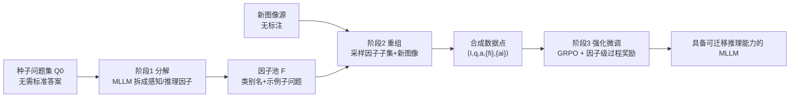

# Composition-Grounded Data Synthesis for Visual Reasoning

**会议**: ICLR 2026  
**OpenReview**: [https://openreview.net/forum?id=FnF3UjiN11](https://openreview.net/forum?id=FnF3UjiN11)  
**代码**: [https://cogsynthesis.github.io](https://cogsynthesis.github.io)  
**领域**: 多模态视觉推理 / 数据合成  
**关键词**: MLLM, 视觉推理, 数据合成, 组合性, 图表问答, GRPO, 过程奖励  

## 一句话总结
COGS 把少量种子问题拆解成"感知 + 推理"的原子因子，再把这些因子和新图像重新组合成大规模带子问题/中间答案的合成 QA，用因子级过程奖励做强化学习，让 MLLM 在图表、网页等"图像多但标注少"的人工图像域上获得可迁移的复杂推理能力。

## 研究背景与动机
**领域现状**：预训练多模态大模型（MLLM）在通用任务上表现强劲，但在图表、表格、信息图、渲染文档、网页这类"人工图像域"上的复杂推理能力仍然薄弱。这类图像在网上随处可见，但配套的推理型问答标注极度稀缺。

**现有痛点**：靠人工标注大规模推理数据成本太高；现有数据合成方法要么停留在文本空间搜索推理轨迹、与视觉特征脱节，要么依赖手工模板/强 LLM 启发式，生成的数据多样性受限、容易让模型过拟合到单一数据集。图表专家模型虽针对性强，却受限于狭窄架构与训练分布，遇到新分布就掉链子。

**核心矛盾**：复杂推理问题表面形式千变万化（难以穷举标注），但其底层结构是**可组合的**——一个复杂问题往往是若干原子步骤（读数、比较、算术、计数）的有限组合。如何利用这种组合性，从极少种子问题"自举"出大规模、多样、视觉接地的推理数据，是核心矛盾。

**本文目标**：仅用目标域里一小撮种子问题（**且无需种子问题的标准答案**），自举出大规模合成 QA 数据集，给 MLLM 补上缺失的复杂推理能力，并让能力可跨数据集迁移而非过拟合。

**核心 idea（组合接地的数据合成）**：把每个种子问题分解为原子"因子"（感知 + 推理步骤），将这些因子系统地与新图像重新组合，生成海量复合问题；每个生成问题天然带有子问题与中间答案，从而支持因子级的过程奖励强化学习。

## 方法详解

### 整体框架
COGS（COmposition-Grounded data Synthesis）是一个三阶段的数据高效框架：**分解 → 重组 → 强化微调**。给定目标域的种子问题集，先用 MLLM 把每个问题拆成带类别标签和子问题的因子，汇聚成因子池 $\mathcal{F}$；再把随机采样的因子子集和任意新图像喂给 MLLM，生成带子问题/中间答案的复合 QA；最后用 GRPO 微调预训练 MLLM，并利用因子标注构造过程奖励做细粒度监督。

### 关键设计

**1. 种子问题分解：把复杂问题还原成视觉接地的因子结构。** 系统给 MLLM 喂入分解任务描述、若干配对好的（问题→因子列表）上下文示例、待分解问题以及它对应的图像，让分解过程**视觉接地**。MLLM 为每个因子输出一个类别标签（如 Calculation、Counting、Comparison）和一个描述其在原问题中作用的子问题。例如"2019–2023 预测中能源增长百分比与公共服务增长百分比的绝对差"被还原为 $q \mapsto \{\text{Perception}_1, \text{Perception}_2, \text{Calculation}_1\}$。汇聚 $Q_0$ 中所有因子即得因子空间 $\mathcal{F}$，每个因子由类别名 + 一组示例子问题表示——它既是后续重组的"积木"，也为强化学习提供因子级监督信号。关键是这一步**不需要种子问题的标准答案**，让数据采集更可扩展。

**2. 因子重组生成新问题：用旧积木在新图像上搭新题。** 输入包括重组任务描述加一个示例、来自任意源的新图像 $I$、以及从 $\mathcal{F}$ 中子采样的因子列表（每个因子给出类别名和采样到的子问题）。MLLM 先在新图像上生成同类但接地于新图的子问题，再把它们组合成连贯的整体问题；同时负责生成答案——**先生成各子问题答案，再组合成整体答案**。于是每个数据点形式化为 $\langle I, q, a, \{f_i\}, \{a_i\}\rangle$，其中 $q \mapsto \{f_1, \dots, f_k\}$ 且 $a_i = \text{Answer}(f_i \mid I)$。对图表这类常带底层元数据（如配套数据表）的域，还会在生成时利用这些元数据提升答案精度。整个重组只需一批无标注图像，就能**沿组合维度扩张训练分布**。

**3. 因子级过程奖励的 GRPO 微调：用 max 而非 sum 抵抗噪声子奖励。** 采用 GRPO 微调，关键在于每个复合问题天然配有子问题与子答案，可定义超越"最终答案对错"的过程奖励。对数据点 $\langle I,q,a,\{f_i\},\{a_i\}\rangle$，用 LLM 奖励模型逐因子核对模型思维链是否产出正确子答案，得到二值分 $c_i\in\{0,1\}$，并定义子问题命中率 $r_{\text{sub}}(y)=\frac{1}{N}\sum_{i=1}^{N}c_i$。论文比较三种奖励：$\text{StandardRM}: r=r_{\text{final}}$；$\text{ProcessRM-sum}: r=r_{\text{final}}+\lambda\cdot r_{\text{sub}}$；$\text{ProcessRM-max}: r=\max(r_{\text{final}}, \lambda\cdot r_{\text{sub}})$。由于一个问题可能有多种合法分解、子奖励信号有噪声，sum 式奖励可能错排策略；论文用命题 3.1 证明 **max 式奖励对最终答案准确率保序**——当 $r_{\text{final}}\in\{0,1\}$、$\lambda\in(0,1)$ 时 $\mathbb{E}[r_{\max}\mid\pi]=(1-\lambda c)V_f(\pi)+\lambda c$ 是 $V_f$ 的严格单调仿射变换，而 sum 式因含 $\lambda(\mathbb{E}_{\pi_1}[\varepsilon]-\mathbb{E}_{\pi_2}[\varepsilon])$ 项可能反号、不保序。

**4. 因子级数据混合：拆到原子再合并，比直接拼数据集更可迁移。** 跨数据集训练时对比两种混合：数据级混合 $\text{Recompose}(\text{Decompose}(A)) + \text{Recompose}(\text{Decompose}(B))$ 是各自合成后拼接；因子级混合 $\text{Recompose}(\text{Decompose}(A)\cup\text{Decompose}(B))$ 则把 A、B 的因子并进同一池再重组。后者让不同域共享一套"原子表征"，提供跨域的公共表示基底，从而比直接拼接更能捕捉数据集间共享结构、缓解多数据集训练里"过拟合主导分布"的老问题。

## 实验关键数据

### 主实验表格
在 ChartQAPro 上（取 33% 测试集作种子/验证，其余 67% 作完全未见测试集），所有方法统一以 Qwen2.5-VL-7B 为基座、ChartQA 训练集图像为图源、GRPO 训练以保证公平：

| 模型 | Factoid | MCQ | Convers. | FactChk. | Hypoth. | Overall |
|------|---------|-----|----------|----------|---------|---------|
| GPT-5-nano（专有） | 45.95 | 63.64 | 49.40 | 63.58 | 49.82 | 50.74 |
| GPT-4o-mini（专有） | 43.63 | 66.43 | 45.48 | 59.88 | 45.20 | 48.32 |
| Qwen2.5-VL-7B（基座） | 42.07 | 62.59 | 44.88 | 60.78 | 50.72 | 47.36 |
| ChartMoE（图表专家） | 19.03 | 35.66 | 32.97 | 45.68 | 27.08 | 27.28 |
| Decompositional CoT（提示） | 42.08 | 65.03 | 42.57 | 56.53 | 45.55 | 46.36 |
| Chart-R1（数据合成） | 42.17 | 46.85 | 50.53 | 61.11 | 55.55 | 47.32 |
| In-Context Q Example（数据合成） | 46.33 | 62.94 | 46.91 | 61.11 | 61.72 | 50.58 |
| **COGS（本文）** | **46.88** | 65.73 | **51.16** | 61.85 | 58.25 | **52.02** |

COGS 以 52.02% 总体准确率超过所有开源 MLLM、图表专家、提示策略与其它数据合成方法，并反超 GPT-5-nano、GPT-4o-mini 等专有小模型。图表专家模型反而最差（域差距 + 狭窄架构）。

跨数据集（ChartQAPro 记为 A、MMC 记为 B）协同训练：

| 模型 | ChartQAPro | MMC |
|------|-----------|-----|
| Qwen2.5-VL | 47.36 | 85.65 |
| + ChartQAPro | 52.02 | 85.69 |
| + MMC | 49.93 | 88.10 |
| + 数据级混合 | 50.72 | 86.99 |
| + **因子级混合** | **52.33** | 87.55 |

因子级混合在两个域上都优于数据级混合，且逼近各自的"专家上界"，说明 COGS 带来正迁移而非过拟合。在网页域 VisualWebBench 上，COGS 取得 88.04%，是所有非专有模型最高（基座 85.65、Decompositional CoT 86.12、MultiUI-WQA 86.60），验证框架可泛化到图表之外。

### 消融实验表格

| 奖励模型 / 训练设置 | Overall Acc. |
|----------------------|--------------|
| StandardRM | 50.96 |
| ProcessRM-sum | 50.35 |
| **ProcessRM-max** | **52.02** |
| SFT + ProcessRM-max | 46.62 |

ProcessRM-sum 反而略微降点，ProcessRM-max 稳定提升，与命题 3.1 的"max 保序、sum 不保序"理论吻合；额外加一轮 SFT 反而掉到 46.62，说明直接 GRPO 更稳。

### 关键发现
- **推理链越长收益越大**：按因子数量分组，问题推理链越长 COGS 提升越明显（在 factoid/MCQ/fact-check 上一致），印证它学到的是组合能力而非记忆。Hypothetical 例外——其难度已被首个反事实因子主导，加因子不再线性增难。
- **难因子涨得最多**：在 Extrapolation（+7.62%）、Compare（+4.47%）、Count（+4.25%）、Calculation（+3.04%）等因子上增益显著；定性例子显示基座常"抄近路"直接给答案（如误判 56 > 60、把增长除以 5 而非 4 个区间），COGS 则能正确走完每一步。
- **过程奖励 vs 推理时分解**：推理时分解因子间误差累积导致收益有限，而 COGS 在训练中奖励正确中间步骤、减少误差复合，且不被单一示例推理路径束缚。

## 亮点与洞察
- **把"组合性"从评测口号变成数据引擎**：以往组合性多用于诊断/评测，COGS 直接把它当作合成数据的生成机制——分解再重组，少量种子撬动大规模多样数据。
- **过程奖励的理论 + 实证闭环**：不是简单加权子奖励，而是用命题 3.1 证明 max 式奖励在噪声子信号下保序，并用消融（sum 降点、max 涨点）实证，理论与实验互相印证。
- **因子级混合提示数据混合新思路**：把异构数据集拆到原子因子再重组，提供跨域公共表征基底，给基础模型训练里长期头疼的"数据混合"问题指了一个方向。
- **可扩展性强**：种子问题无需标准答案、图像可任意无标注采集，框架从图表无缝扩展到网页 GUI。

## 局限与展望
- **重度依赖 MLLM 做分解/重组/答案生成**：合成数据的质量受限于所用 MLLM 的能力，分解的多样性和答案正确性可能引入系统性偏差或噪声（论文亦承认子奖励有噪声）。
- **主要验证在图表 + 网页两类人工图像域**：对自然图像、视频或更开放的推理域是否同样有效尚未展示。
- **绝对增益偏温和**：图表域 47.36→52.02（约 +4.7 点），收益主要集中在长链/难因子问题上，对简单问题提升有限。
- **因子类别体系由 MLLM 自由产生**：缺乏统一/可控的因子本体，可能影响跨域因子合并的一致性与可解释性。
- 展望：引入更强的答案验证（如可执行程序/工具校验）、把因子本体结构化、扩展到更广的多模态推理域。

## 相关工作与启发
- **文本侧数据进化/指令合成**（Self-Instruct、WizardLM/Evol-Instruct 等）：多在文本空间搜索推理轨迹；COGS 的差异是因子接地于视觉特征、自动检测推理组件。
- **图表理解专家模型与数据合成**（ChartLLaMA、ChartMoE、Chart-R1、ChartQA 等）：多靠手工模板或先转结构化中间表示；COGS 不依赖手工启发式，从种子数据自动抽因子定制数据。
- **GUI/网页理解**（VisualWebBench、MultiUI、UIX-Qwen2 等）：COGS 借其图像源与基准验证跨域泛化。
- **GRPO 与过程奖励**（Shao et al. 2024 及过程监督 RL）：COGS 把"组合数据天然带子答案"这一结构转化为可保序的因子级过程奖励，是方法与数据设计的耦合点。
- **启发**：当任务底层结构可分解时，"分解-重组"是一种比模板/堆数据更有原则的数据合成范式；同时奖励设计要考虑噪声下的保序性，而非盲目把中间信号线性叠加进最终奖励。

## 评分
- **新颖性**: ⭐⭐⭐⭐ — "分解种子问题成因子→与新图重组→因子级过程奖励"的三段式管线把组合性从评测变成数据引擎，并配 max 奖励保序理论，思路清晰且有原创性。
- **实验充分度**: ⭐⭐⭐⭐ — 覆盖图表（单/多数据集）+ 网页两域，对比专有/开源/专家/提示/合成多类基线，含奖励模型与训练策略消融及细粒度因子分析；但绝对增益偏温和、域仍偏窄。
- **写作质量**: ⭐⭐⭐⭐ — 三阶段叙述清楚，图 2/图 5 直观，命题 3.1 把过程奖励的设计动机讲透；定性例子很有说服力。
- **价值**: ⭐⭐⭐⭐ — 解决"图像多但标注少"域的推理数据稀缺这一实际痛点，因子级混合对数据混合问题有启发，方法可迁移性好，对图表/文档/GUI agent 等下游有直接用处。

<!-- RELATED:START -->

## 相关论文

- [\[ICLR 2026\] ReWatch-R1: Boosting Complex Video Reasoning in Large Vision-Language Models through Agentic Data Synthesis](rewatch-r1_boosting_complex_video_reasoning_in_large_vision-language_models_thro.md)
- [\[ICLR 2026\] VGR: Visual Grounded Reasoning](vgr_visual_grounded_reasoning.md)
- [\[CVPR 2026\] CRIT: Graph-Based Automatic Data Synthesis to Enhance Cross-Modal Multi-Hop Reasoning](../../CVPR2026/vlm_reasoning/crit_graph-based_automatic_data_synthesis_to_enhance_cross-modal_multi-hop_reaso.md)
- [\[ICLR 2026\] Latent Visual Reasoning](latent_visual_reasoning.md)
- [\[ICLR 2026\] Mixture-of-Visual-Thoughts: Exploring Context-Adaptive Reasoning Mode Selection for General Visual Reasoning](mixture-of-visual-thoughts_exploring_context-adaptive_reasoning_mode_selection_f.md)

<!-- RELATED:END -->
