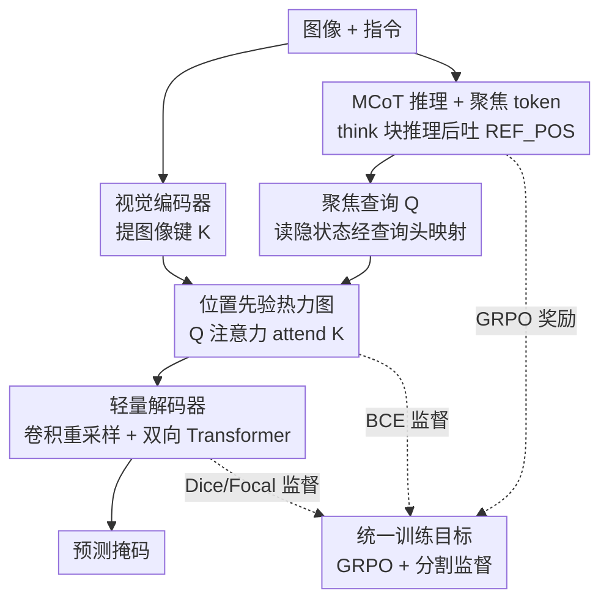

# CoPRS: Learning Positional Prior from Chain-of-Thought for Reasoning Segmentation

**会议**: ICLR2026  
**OpenReview**: [https://openreview.net/forum?id=Fcsop01h40](https://openreview.net/forum?id=Fcsop01h40)  
**代码**: https://github.com/ZhenyuLU-Heliodore/CoPRS  
**领域**: 多模态VLM / 推理分割  
**关键词**: 推理分割、思维链、位置先验、热力图、GRPO

## 一句话总结
CoPRS 让多模态大模型先用思维链推理、再吐出一个「聚焦 token」，把它转成一张稠密可微的热力图当作位置先验，再用一个轻量解码器把先验细化成分割掩码，从而在 RefCOCO 系列和 ReasonSeg 上做到推理与分割可解释地对齐，并刷出 SOTA。

## 研究背景与动机
**领域现状**：推理分割（reasoning segmentation）要求模型读懂一句自由形式、带组合约束的指令（如「分割那架尾随四旋翼、被树部分遮挡的无人机」），然后输出对应物体的掩码。这是分割任务从语义分割→实例分割→开放词表分割一路演化的终点，核心难点是把「语言推理」和「空间定位」耦合起来。现有方法分成两大阵营。

**现有痛点**：第一类是**隐式推理**（LISA、PerceptionGPT 等），直接把语言模型的隐藏特征接到掩码解码器上。问题是中间决策完全是黑箱——你看不到模型「为什么」选了这个区域，也无从诊断和干预。第二类是**文本式推理**（Seg-Zero、Text4Seg 等），让 MLLM 用思维链输出离散的文本坐标（bbox / point / patch 索引）再喂给 SAM。这一类虽然「显式」，但稀疏的离散坐标承载不了细粒度视觉语义，而且对格式错误、坐标越界这类工程问题很脆弱。

**核心矛盾**：两个极端各踩一边——隐式法有表达力但不可解释，文本法可解释但表达力差。问题的根本在于**缺一个既可解释、又稠密可微的中间接口**来连接推理和分割。

**本文目标**：造一个端到端、单阶段的模型，让 MLLM 先推理、再产出一个能直接监督、又能看懂的位置表征，把它当作增强掩码解码的位置先验。

**切入角度**：作者的关键观察是，「位置」不一定要用隐特征（看不懂）或文本坐标（太稀疏）来表达，可以用一张**稠密热力图**——它天然可微（能端到端反传）、可视化即可解释（哪里红代表模型在关注哪里），信息量也远比几个坐标点丰富。

**核心 idea**：用一个可学习的「聚焦 token」把图像和推理文本的上下文聚合成一个查询，让它去 attend 图像特征生成热力图位置先验，再轻量解码成掩码——用「可微热力图」这个接口同时替掉「黑箱隐特征」和「稀疏文本坐标」。

## 方法详解

### 整体框架
CoPRS 建在一个多模态 LLM（MLLM）+ 视觉骨干 + 查询头 + 掩码解码器之上。给定图像-文本输入 $(x_{img}, x_{txt})$，策略模型 $\pi_\theta$ 通过 next-token 预测生成一段 token 序列，里面既包含 `<think>...</think>` 的思维链（CoT），也包含一个特殊的聚焦 token `<REF_POS>`。模型读出这个聚焦 token 在 LLM 里对应的隐藏状态 $e_{conc}$，再经查询头 $F_{head}$ 映射成「聚焦查询」$Q$。同时视觉编码器 $F_{enc}$ 把图像编成「图像键」$K$。查询 $Q$ 用多头注意力去 attend 这些键，得到一张热力图 $H_{prior}$ 作位置先验；最后轻量掩码解码器 $F_{dec}$ 把这个先验解码成预测掩码 $\hat{M}$。整套系统端到端联合训练：语言路用 GRPO 强化学习增强推理，视觉路用分割监督锤炼掩码质量，两条路通过这张可微热力图缝在一起、共享一次反向传播。

### 关键设计

**1. MCoT 驱动的聚焦 token：把推理过程显式接到位置上**

针对「隐式法看不到推理、文本法坐标太稀疏」这个痛点，CoPRS 让 MLLM（用 Qwen2.5-VL）先在 `<think>...</think>` 块里把指令推理一遍，再输出一个聚焦 token `<REF_POS>`。这一步借鉴 DeepSeek-R1 的做法，用提示词诱导模型对组合型指令做多模态思维链。关键在于：模型不是直接把隐特征丢给解码器，而是先把推理走完、再用一个专门的 token 去「凝结」这次推理对目标位置的判断。形式上策略 $\pi_\theta$ 生成序列 $y_{1:T}$，再用 $F_{conc}$ 找到聚焦 token 的位置、读出它的隐藏状态：

$$y_t \sim \pi_\theta(\cdot \mid y_{0:t-1}, x_{img}, x_{txt}), \quad e_{conc} = F_{conc}(y_{1:T})$$

好处是推理过程因为 CoT 而透明，且聚焦 token 的 embedding 携带了「推理之后」的语义，而不是原始 prompt 的浅层编码。

**2. 从键和查询到位置先验：用可微热力图替掉文本坐标**

这是 CoPRS 最核心的接口设计。视觉骨干（用 SAM 的 ViT-H 编码器）把图像编成键 $K \in \mathbb{R}^{H\times W \times d_k}$，查询头（MLP）把聚焦 token embedding 投成查询 $Q \in \mathbb{R}^{d_q}$，然后在 $Q$ 和 $K$ 之间算缩放点积多头注意力，用两层堆叠的 2D 卷积 $F_{fuse}$ 把多头结果聚合成单张热力图：

$$H_{prior} = F_{fuse}\left(\left[(QW_i^Q)(KW_i^K)^\top / \sqrt{d_c}\right]_{i=1}^{n_{head}}\right)$$

这张稠密、可微的热力图就是位置先验——比黑箱隐特征更可解释（红色区域直观显示模型聚焦在哪），又比离散文本坐标承载更多细粒度语义，且整条路径可微、能被分割损失端到端监督。本质上它把「位置」从一串脆弱的数字坐标，换成了一张能反传、能可视化的密集图。

**3. 轻量两阶段解码器：让先验细化成精确掩码**

热力图只是「大致聚焦」，还不是精确边界。解码器分两个子模块：先用三层堆叠的 2D 卷积块把融合后的先验重采样到解码分辨率；再接一个仿照 SAM 解码器设计的双向 Transformer（Two-Way Transformer），在图像特征和位置先验之间做双向交叉注意力。整个解码器只有 4.7M 参数，却能让先验去引导稠密分割：

$$\hat{M} = F_{dec}(K, H_{prior})$$

作者在相关性分析里发现，推理时大多数样本落在 $y=x$ 线上方——意味着先验本身已经聚焦得不错，解码器又把它进一步精修成更精确的掩码，二者分工明确。

**4. 统一训练目标：GRPO 强化推理 + 分割监督锤炼掩码**

推理和分割不是分两段训，而是一个目标里联合优化。对每个 $(x_{img}, x_{txt})$，策略 $\pi_\theta$ 用 GRPO（组相对策略优化）滚出一组 $G$ 个回复，从组内相对优势算出 $L_{GRPO}$；同时位置先验 $H_{prior}$ 和预测掩码 $\hat{M}$ 用真值掩码 $M_{gt}$ 监督，给出 $L_{SEG}$。总目标是：

$$L = L_{GRPO}\left(\{y_{1:T_i}^{(i)}\}_{i=1}^G\right) + \lambda_{SEG} L_{SEG}\left(H_{prior}, \hat{M}, M_{gt}\right)$$

其中 GRPO 部分沿用 PPO 的裁剪和 KL 正则，奖励由「掩码质量分」（soft IoU 0.5、soft Dice 0.2、hard IoU 0.3 加权）和「CoT 格式分」（多条正则匹配）按 0.7/0.3 混合。分割损失则是三项互补：对热力图 $H_{prior}$ 的 BCE（鼓励位置证据集中）、对掩码的 Dice（直接监督掩码质量）、对掩码 logits 的 Focal（强调难像素和细结构）：

$$L_{SEG} = L_{BCE}(H_{prior}, M_{gt}) + \lambda_d L_{DICE}(\hat{M}, M_{gt}) + \lambda_f L_{FOCAL}(\hat{M}, M_{gt})$$

每个 batch 同时算两项、走一次反向传播——GRPO 损失只更新 MLLM 参数，分割损失更新全部可训练模块。这样强化学习负责让 CoT 推理更准，监督信号负责让掩码更锐利，两者通过可微先验互相增益。

### 损失函数 / 训练策略
训练时把每个图文对复制 $G$ 份喂给 $\pi_\theta$ 生成 $G$ 个回复，奖励函数给每个回复打标量分、转成优势算 GRPO 损失；同 batch 内图像 resize+pad 到 $1024\times1024$、过视觉骨干、解码成 $\hat{M}$ 算分割损失，两损失每轮联合优化。默认超参：$\lambda_{SEG}=0.3$、$\lambda_d=3.0$、$\lambda_f=10$；GRPO 组大小 $G=8$；MLLM 基学习率 2e-6，聚焦查询头乘 25×、解码器两子模块分别乘 10×/5×；优化器 AdamW（weight decay 0.01），OneCycleLR 调度。推理时不复制，$\pi_\theta$ 做确定性 next-token 生成单个回复、走同一前向得到 logits，去 padding、resize 回原图、阈值 0 二值化得掩码。训练在 8 张 A100（80GB）上、基于 VERL 代码库。

## 实验关键数据

### 主实验
RefCOCO 系列（cIoU），与三类方法对比；CoPRS-7B 在大多数 split 上拿下最佳，仅在 RefCOCO 的 2/8 个 split 上落后于参数更大的 RAS-13B：

| 数据集/split | 指标 | CoPRS-7B | CoPRS-3B | 之前最强对比 |
|--------|------|------|------|----------|
| RefCOCO testA | cIoU | **85.3** | 83.9 | RAS-13B 83.5 |
| RefCOCO+ val | cIoU | **75.9** | 71.8 | RAS-13B 75.1 |
| RefCOCO+ testA | cIoU | **80.3** | 78.9 | RAS-13B 80.0 |
| RefCOCOg val | cIoU | **76.2** | 74.8 | RAS-13B 76.0 |

ReasonSeg 零样本（不在其图像上训练），考验复杂推理分割的泛化：

| 数据集/split | 指标 | CoPRS-7B | CoPRS-3B | Seg-Zero-7B |
|--------|------|------|------|----------|
| ReasonSeg val | gIoU | **65.2** | 61.3 | 62.6 |
| ReasonSeg val | cIoU | **64.5** | 60.6 | 62.0 |
| ReasonSeg test | gIoU | **59.8** | 57.8 | 57.5 |
| ReasonSeg test | cIoU | **55.1** | 52.7 | 52.0 |

值得注意的是，相比同样用 GRPO 训练的 Seg-R1 和 Seg-Zero，CoPRS 的 3B 模型就能超过它们的 7B 版本，作者归因于可学习聚焦查询在连接推理与分割上的有效性。

### 消融实验

| 配置 | 关键指标 (RefCOCO+) | 说明 |
|------|---------|------|
| 完整模型 (Qwen2.5-VL-7B + ViT-H) | val 75.9 / testA 80.3 | 默认设置 |
| MLLM 换 LLaVA-1.5-7B | val 73.1 / testA 79.0 | 换骨干仅小幅下降，方法不依赖特定 MLLM |
| 视觉骨干换 ViT-B | val 73.2 / testA 77.3 | 比 ViT-H 掉约 2.7 / 3.0，但骨干只占总参数小头 |
| 视觉骨干换 ViT-L | val 74.8 / testA 78.9 | 介于 B 和 H 之间 |
| 仅 RL / 仅 Seg | 均明显低于 RL+Seg | 单独任一路都不如联合目标 |
| 掩码奖励系数 0→0.7→1.0 | 0.7 最优 | 纯掩码奖励(1.0)反而略降，格式分需保留做正则 |

### 关键发现
- **可解释对齐是核心卖点也被实证**：作者用最小二乘回归量化了 CoT 轨迹、热力图 $H_{prior}$、掩码 $\hat{M}$ 三者的相关性。训练阶段热力图与掩码的 $R>0.7$（如 RefCOCO 上 $R=0.76$），推理阶段 IoU 相关同样 $R>0.7$；更进一步用 Gemini-2.5-Flash 当独立评分器算 CoT 一致性分（逻辑 0.3 / 任务相关 0.2 / 视觉一致 0.3 / 定位 0.2 加权），发现 CoT 质量越高、热力图和掩码 IoU 越好（$R=0.65$/$0.44$）。这定量支持了「推理越好→分割越准」。
- **GRPO 组大小的甜点是 8**：增大 $G$ 在各 split 上都涨点，但收敛所需总样本数并不随 $G$ 线性增长——更大的组每步给更多样的候选、改善探索和正负样本对比，$G=8$ 在效率和性能间最平衡。
- **失败模式**：CoPRS 主要在两类场景翻车——当前输入分辨率下会消失的极小物体，以及一堆相似实例密集排布、光靠文本无法可靠区分目标时。

## 亮点与洞察
- **「可微热力图当接口」是真正巧妙的地方**：它一举调和了隐式法（可微但黑箱）和文本法（可解释但稀疏脆弱）的矛盾——热力图既能端到端反传被监督，又能直接可视化看懂模型在关注哪，信息密度还远高于几个坐标点。这个「用密集可微表征替掉离散符号接口」的思路，可迁移到任何「LLM 推理 → 下游空间/结构预测」的任务（如检测、关键点、轨迹预测，作者也提到天然能扩展到 region concentration 任务）。
- **聚焦 token 的设计干净**：不新增一堆模块，就靠一个特殊 token 的隐状态来「凝结」推理后的位置判断，再 attend 视觉特征——比直接接隐特征多了一层「推理后聚焦」的语义。
- **小模型超大模型的现象有说服力**：CoPRS-3B 超过 Seg-Zero/Seg-R1 的 7B，说明收益来自接口设计而非堆参数，这种「架构红利」比单纯 scale 更值钱。
- **三者相关性的定量验证**很难得：大多数可解释性工作停在「画几张热力图给你看」，CoPRS 用回归系数 + 独立 LLM 评分把「CoT→热力图→掩码」的对齐量化出来，让「可解释」不只是口号。

## 局限与展望
- **作者承认的局限**：对分辨率下会消失的极小目标、以及密集同类实例（文本无法消歧）这两类难例处理不佳。前者可通过更高输入分辨率或多尺度先验缓解，后者需要更强的指代消歧能力。
- **依赖 MLLM 的推理质量**：相关性分析显示分割质量强依赖 CoT 质量，意味着当 MLLM 推理出错时，错误会顺着热力图直接传导到掩码，缺少一个纠错回环。
- **评测范围**：主要在 RefCOCO 系列和 ReasonSeg 上验证，都偏自然图像的指代/推理分割；在医学、遥感等专业域，或视频时序场景下的表现还未知。
- **CoT 一致性用 Gemini-2.5-Flash 打分**引入了外部黑箱评估器，其打分本身的可靠性和偏置没有进一步校验（⚠️ 这部分以原文为准）。

## 相关工作与启发
- **vs LISA（隐式推理）**：LISA 用一个 `<SEG>` 特殊 token 把 MLLM 隐特征接到掩码解码器，中间决策不透明、不可控；CoPRS 让模型先走完 CoT 再吐聚焦 token、并把中间态显式化成热力图，可解释性和可诊断性大幅提升。
- **vs Seg-Zero / Text4Seg（文本式推理）**：它们用 MLLM 经 CoT 生成离散文本坐标（box/point/patch 索引）再喂 SAM，稀疏、对格式错误和越界坐标脆弱；CoPRS 用稠密可微热力图替掉文本坐标，承载更细语义、且整条路径可端到端监督，同尺度下 cIoU/gIoU 全面更优。
- **vs SAM**：CoPRS 复用了 SAM 的 ViT-H 编码器和 Two-Way Transformer 解码器设计，但不是用 box/point 提示 SAM，而是让推理生成的热力图先验来引导解码，把「人给提示」换成「推理产先验」。

## 评分
- 新颖性: ⭐⭐⭐⭐⭐ 用可微可解释热力图当推理-分割接口，干净地调和了两大阵营的矛盾，思路有普适性
- 实验充分度: ⭐⭐⭐⭐⭐ 四数据集 + 零样本 + 六类消融 + 三者相关性的定量回归分析，覆盖很全
- 写作质量: ⭐⭐⭐⭐ 方法清晰、图示到位，相关性分析部分公式排版略密
- 价值: ⭐⭐⭐⭐⭐ 同尺度刷 SOTA、3B 超 7B，且可解释接口可迁移到更广的「推理→空间预测」任务

<!-- RELATED:START -->

## 相关论文

- [\[CVPR 2026\] Reinforcing Structured Chain-of-Thought for Video Understanding](../../CVPR2026/vlm_reasoning/reinforcing_structured_chain-of-thought_for_video_understanding.md)
- [\[ICLR 2026\] ThinkMorph: Emergent Properties in Multimodal Interleaved Chain-of-Thought Reasoning](thinkmorph_emergent_properties_in_multimodal_interleaved_chain-of-thought_reason.md)
- [\[CVPR 2026\] Grounded Chain-of-Thought for Multimodal Large Language Models](../../CVPR2026/vlm_reasoning/grounded_chain-of-thought_for_multimodal_large_language_models.md)
- [\[CVPR 2026\] UniT: Unified Multimodal Chain-of-Thought Test-time Scaling](../../CVPR2026/vlm_reasoning/unit_unified_multimodal_chain-of-thought_test-time_scaling.md)
- [\[CVPR 2026\] Chain-of-Thought Guided Multi-Modal Object Re-Identification](../../CVPR2026/vlm_reasoning/chain-of-thought_guided_multi-modal_object_re-identification.md)

<!-- RELATED:END -->
