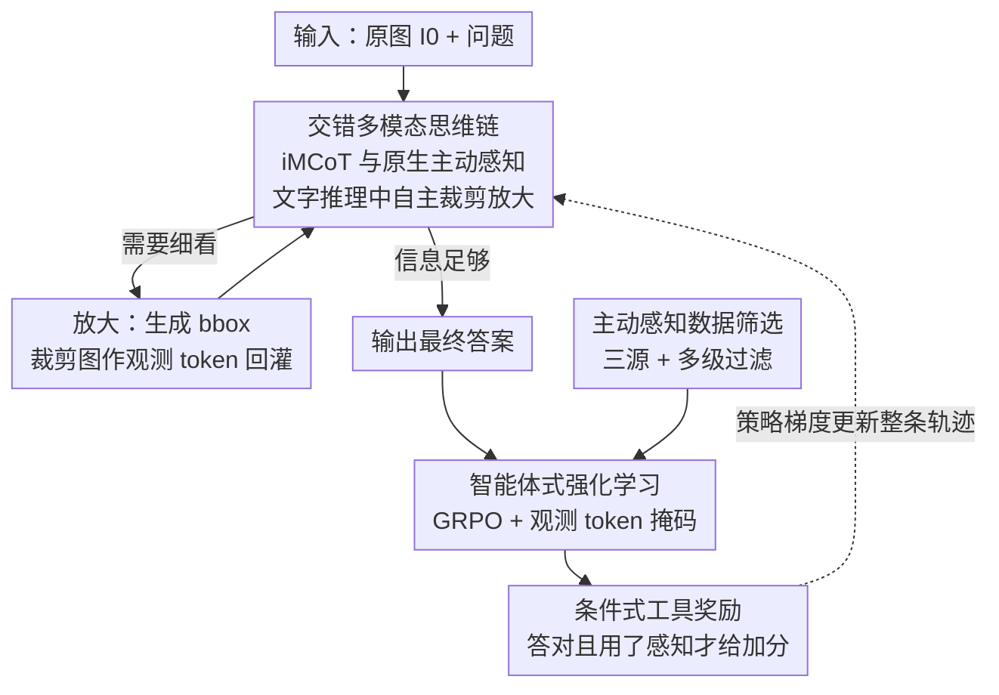

# DeepEyes: Incentivizing "Thinking with Images" via Reinforcement Learning

**会议**: ICLR 2026  
**OpenReview**: [https://openreview.net/forum?id=xUyMXkI958](https://openreview.net/forum?id=xUyMXkI958)  
**代码**: https://github.com/Visual-Agent/DeepEyes  
**领域**: 多模态VLM / LLM推理  
**关键词**: 视觉语言模型、强化学习、主动感知、交错多模态思维链、视觉接地

## 一句话总结
DeepEyes 让视觉语言模型把"放大看图"变成推理链里的一个内生动作，不靠冷启动 SFT、也不调外部工具，仅用端到端强化学习就让模型学会在思考时主动裁剪、放大关键区域，在 V\* 高分辨率基准上把 7B 模型从 71.2% 提到 90.1%。

## 研究背景与动机
**领域现状**：当前主流 VLM（Qwen2.5-VL、LLaVA 系列、InternVL 等）已经能在多模态输入上做长链思维（CoT）推理，把复杂任务拆成一步步文字推导。

**现有痛点**：这些模型的"思考"几乎全发生在语言模态里——一旦图像编码进 token，后续推理就只在文字空间打转，无法在推理中途回头去看图像的细节。这导致在超高分辨率图（2K–8K）里找小目标、做细粒度对比时频频出错；更糟的是模型容易被语言先验带跑，凭"海滩 → 通常有石头"这类联想编造出图里根本没有的物体（幻觉）。

**核心矛盾**：人类视觉推理是"边看边想"——通过一连串视觉注视（fixation）反复获取信息再下判断；而现有 VLM 把"感知"和"推理"解耦了，感知只在最开始发生一次。已有想补救的工作要么用预定义工作流（先定位 ROI、再回灌特征），需要大量难以采集的 SFT 数据，又因为人工设计的流程死板而泛化差；要么调用外部专用检测/分割模型当工具，这些外部工具无法和主模型联合优化，只能各自局部最优。OpenAI o3 虽然展示了把图像操作自然交错进 CoT 的能力，但机制对开源社区不公开。

**本文目标**：让一个统一的 VLM 在推理过程中能自主决定"何时、对哪个区域放大看一眼"，并把放大得到的图像证据接回推理链，且这一切不依赖冷启动 SFT、不依赖外部模型。

**切入角度**：作者的关键观察是，主流 VLM（如 Qwen2.5-VL）本身就具备视觉接地（grounding）能力——能根据描述输出 bbox 坐标。既然这个能力是模型自带的，就可以把它封装成一个"内部工具"，让模型用自己的接地能力去裁剪图像，而不必外挂任何东西。这样工具调用就能被纳入同一套梯度里隐式优化。

**核心 idea**：用端到端强化学习（仅靠结果奖励）激励模型把"自带的接地能力"当成放大镜，在文字思维链中交错插入"生成坐标 → 裁剪 → 回看"的视觉动作，形成交错多模态思维链（iMCoT），让"用图像思考"的能力原生涌现。

## 方法详解

### 整体框架
DeepEyes 是一个统一的多模态大模型，输入是一张原图 $I_0$ 和一个问题，输出是最终答案。它要解决的核心问题是：怎么让模型在纯文字推理走不通时，自己决定"放大某块区域再看"，并把这块裁剪图接回推理继续想。

整条流程是一个 agentic 的多轮交互：模型先走一段文字思维链（Text-CoT），在每一步结束时自主判断是直接给答案，还是触发一次"图像放大（zoom-in）"。放大动作的输入是一组 bbox 坐标，输出是这些区域裁剪出的子图（如 $I_{t_1}$、$I_{t_2}$），这些裁剪图被当作"观测 token"追加到正在进行的轨迹里，模型于是能在包含原图、所有历史文字和所有历史裁剪图的完整上下文上继续推理。这个"想一段 → 决定放不放大 → 放大就回看 → 再想"的循环可以重复多次（最多 6 次），直到产出最终答案。整条轨迹（所有文字 CoT 加所有动作决策）由结果奖励通过策略梯度一次性端到端优化，没有任何中间步骤的监督，也没有冷启动 SFT。

### 关键设计

**1. iMCoT 与原生主动感知：把接地能力封装成内部放大镜**

这一设计直接针对"感知与推理解耦、思考被困在语言模态"的痛点。DeepEyes 不引入任何外部检测器，而是把 VLM 自带的视觉接地能力（输出 bbox 的能力）封装成一个内部工具：在文字推理的任意一步，模型可以自主生成一组接地坐标 $\{\text{bbox}\}$，系统据此从原图裁剪出对应区域并回灌为新的图像观测。状态在每一步形式化为交错的文字与图像 token 序列 $s_t = \{(X_0, I_0), (X_1, I_1), \dots, (X_t, I_t)\} = \{X_{\le t}; I_{\le t}\}$，动作 $a_t \sim \pi_\theta(a \mid s_t)$ 就是下一个 token。因为放大用的是模型自己的能力、裁剪图又回到同一条轨迹，视觉和文字推理被天然交错在一起，模型得以在小、模糊或难辨认的目标上做细粒度感知。相比工作流方法（要大量 SFT 数据、人工设计流程死板）和外挂工具方法（无法联合优化），这种"原生工具调用"让感知动作能和文字推理一起被同一套梯度隐式优化，作者列出的五大优势（训练简单、泛化强、全局优化、多模态融合、原生工具调用）都源于此。

**2. 智能体式强化学习：用 GRPO 在多轮轨迹上端到端优化，并掩掉观测 token**

传统纯文字 CoT 的 RL 把状态定义为已生成 token、动作为下一个 token；而 iMCoT 多了"观测 token"——它们来自函数调用（裁剪）而非模型自身生成。如果照常对所有 token 算损失，模型会被迫去"拟合"那些它根本没生成、由环境塞进来的裁剪图 token，污染优化信号。为此作者采用 Group Relative Policy Optimization（GRPO）做策略优化，并对多轮轨迹施加 token 级损失掩码（token-wise loss mask），只在模型真正生成的 token 上算损失、忽略观测 token。这样整条轨迹里所有文字 CoT 和动作决策被联合优化、朝全局最优收敛，而注入的图像观测不会被错误地当成需要学习的目标。训练上用 Qwen2.5-VL-7B 跑 80 个迭代，每批采样 256 个 prompt、每个 prompt 16 条 rollout、最多 6 次放大，KL 系数设为 0、最大响应长度 20480 token。

**3. 条件式工具奖励：只有"答对且确实放大过"才给奖励加分**

在早期尝试里作者发现，模型很不愿意主动放大，即使放大也常选错区域，导致奖励低、训练不稳。这一设计就是为了把模型从"懒得用感知"推到"主动且有效地用感知"。总奖励由三部分组成：准确性奖励 $R_{acc}$、格式奖励 $R_{format}$，以及一个有条件的工具奖励 $R_{tool}$：

$$R(\tau) = R_{acc}(\tau) + R_{format}(\tau) + \mathbb{I}_{R_{acc}(\tau)>0}\, R_{tool}(\tau)$$

关键在那个指示函数 $\mathbb{I}_{R_{acc}(\tau)>0}$——工具奖励只在答案正确（准确性奖励为正）且至少触发了一次主动感知时才发放。消融（Table 5）显示这个"条件"至关重要：完全没有工具奖励时模型很快就不再放大；给无条件奖励时模型只维持极少量、静止的感知行为；只有把奖励绑定在"答对"上，主动感知次数才会随训练逐步上升、响应也更有信息量，V\* 准确率从 87.4% 提到 90.1%。这说明只奖励"动作本身"不够，必须把动作和正确结果对齐，才能鼓励有意义的感知、抑制无谓的乱放大。

**4. 主动感知数据筛选：在没有 SFT 冷启动下保证初始采样效率**

不做 SFT 冷启动的最大难题是 RL 初期采样效率太低——模型几乎采不到"靠放大解出题"的成功轨迹，奖励稀疏到学不动。这一设计用一套数据策展来引导。数据来源融合三类互补语料：V\* 训练集（细粒度感知）、来自 ArxivQA 的图表数据（任务与图像多样性）、ThinkLite-VL（强化高难推理）。再经过多级过滤：先用 Qwen2.5-VL-7B 做难度筛选，剔除"100% 答对"过于平凡和"0% 答对"过于困难的样本；然后把问题统一成开放式格式并做标注核验、剔除错标样本；最后对细粒度感知数据施加"感知效用过滤"——只保留那些"借助真值区域的主动感知才能解出"的样本，从而最大化信息增益、在没有 SFT 的情况下显著提升 RL 初始采样效率（图表与通用推理数据则保留其原始严格处理后的形态，不过这一过滤）。这套策展让训练语料既多样又精准地"逼"模型从一开始就学会用主动感知。

### 损失函数 / 训练策略
优化目标为 GRPO 的组相对策略梯度，奖励即上文的 $R(\tau)=R_{acc}+R_{format}+\mathbb{I}_{R_{acc}>0}R_{tool}$；多轮轨迹用 token 级掩码忽略观测 token 的损失。训练超参：Qwen2.5-VL-7B、80 迭代、batch 256 prompt × 16 rollout、最多 6 次主动感知、KL 系数 0、最大响应长度 20480 token，在 H100 上完成。

## 实验关键数据

### 主实验

| 基准（7B） | 指标 | DeepEyes | Qwen2.5-VL 7B | 提升 |
|--------|------|------|----------|------|
| V\* | Overall | 90.1 | 71.2 | +18.9 |
| HR-Bench 4K | Overall | 75.1 | 68.8 | +6.3 |
| HR-Bench 8K | Overall | 72.6 | 65.3 | +7.3 |
| MME-RealWorld-Lite | Overall | 53.2 | 42.3 | +10.9 |
| MathVista | Acc | 70.1 | 68.3 | +1.9 |
| POPE | Overall | 87.7 | 85.9 | +1.8 |

DeepEyes-7B 在高分辨率基准上不仅大幅超越纯文字 SOTA 开源模型，还超过了带人工工作流的复杂管线（SEAL、DyFo、ZoomEye），并在 MME-RealWorld-Lite 上反超 32B 版 Qwen2.5-VL，说明"简单 RL + 原生放大"就能解锁高分辨率视觉推理。

### 消融实验

| 配置 | V\* | HR-4K | HR-8K | 说明 |
|------|---------|-----|-----|------|
| DeepEyes（iMCoT，完整） | 90.1 | 75.1 | 72.6 | 完整模型 |
| RL w. 纯文字 CoT | 88.5 | 75.4 | 60.8 | 去掉视觉交错，HR-8K 暴跌 11.8 |
| w/o 工具奖励 | 87.4 | 53.4 | 55.4 | 模型很快停止放大 |
| 无条件工具奖励 | 87.4 | 72.1 | 71.8 | 维持极少量静止感知 |
| 条件工具奖励 | 90.1 | 75.1 | 72.6 | 完整奖励设计 |

### 关键发现
- **iMCoT 的价值在超高分辨率上最突出**：纯文字 CoT 在 HR-8K 只有 60.8%，加上视觉交错后跳到 72.6%（+11.8），证明对需要细粒度视觉细节的任务，"边看边想"不是锦上添花而是必需。
- **奖励必须绑定正确性**：去掉工具奖励 HR-4K 直接掉到 53.4%；无条件奖励虽回到 72.1%，但仍低于条件奖励的 75.1%，且训练中感知行为停滞——只有"答对才奖励放大"才能让感知次数持续上升。
- **三阶段训练动态**：模型经历"初始无效探索（步 0–20，乱放大、IoU 低）→ 高频参与（步 20–45，广撒网、IoU 上升但效率不高）→ 高效利用（步 45–80，选择性精准放大、查询变少但接地 IoU 高）"，从粗放探索走向定向利用。
- **可扩展性**：从 7B 放大到 32B，DeepEyes 对基线的领先进一步拉大（V\* 93.3、grounding IoU 0.53），且涌现出更长推理链；只在系统提示里加一个"旋转"工具、无需重训，就能在 HR-OCR-Rot 上零样本涨 3.5%，显示框架易扩展。
- **感知与推理互相强化**：把高难推理数据从 23% 加到 42%，数学基准和感知任务 V\* 同时提升（V\* 91.6、WeMath 43.6），说明更强的抽象推理反过来引导更有效的视觉接地。

## 亮点与洞察
- **把"模型自带的能力"封装成工具，而非外挂模型**：DeepEyes 用 VLM 自身的接地能力做放大镜，使工具调用能被同一套梯度隐式优化——这是它能甩开"外挂检测器、各自局部最优"路线的根本原因，思路可迁移到任何"模型本身已具备某子能力、却没被纳入推理回路"的场景。
- **条件指示函数式奖励是点睛之笔**：$\mathbb{I}_{R_{acc}>0}R_{tool}$ 用一个极简的逻辑门避免了"为放大而放大"的奖励黑客，把"用工具"和"用对工具"区分开，对所有 agentic RL 的工具奖励设计都有借鉴价值。
- **观测 token 掩码**是多轮多模态 RL 的关键工程细节：环境注入的裁剪图 token 不能算进损失，否则会污染策略——这点容易被忽略却直接决定训练能否稳定。
- **最"啊哈"的地方**：完全不用中间步骤监督、仅靠结果奖励，"用图像思考"的多样模式（视觉搜索、视觉对比、视觉确认、幻觉抑制）竟自发涌现，且训练动态清晰可见地从探索走向高效利用。

## 局限与展望
- **工具集极简**：当前主动感知基本只有"裁剪/放大"一个动作（外加演示性的旋转），尚未验证在更丰富工具集（如缩放参数、增强、外部知识检索）下的协同表现。
- **依赖底模的接地能力**：整套方法建立在 Qwen2.5-VL 已有较强 grounding 之上，若底模接地能力弱，"封装内部工具"这一前提可能不成立，对更弱基座的适用性未知。
- **数据策展成本**：虽免去了 SFT 冷启动，但"感知效用过滤"需要真值区域来判定样本是否"靠放大可解"，这类带 GT 区域的细粒度数据本身采集不易，可能成为规模化瓶颈。
- **奖励仍是稀疏结果奖励**：中间视觉动作没有步级监督，复杂多步推理中若早期放大选错、后续难以从结果奖励反推纠偏，长程信用分配仍是开放问题。

## 相关工作与启发
- **vs SEAL / DyFo / ZoomEye（工作流方法）**：它们用预定义流程或辅助模型先定位 ROI，需要大量 SFT 数据、人工设计死板、泛化差且各模块分开优化；DeepEyes 让模型自主决定何时何地放大、端到端联合优化，在 V\* 上反超这些复杂管线，证明"简单 RL"胜过"精心工作流"。
- **vs Pixel-Reasoner**：同为 7B、同样赋予像素级操作能力，DeepEyes 在 V\*（90.1 vs 80.6）、MME-RealWorld-Lite（53.2 vs 49.7）上均更优，差异主要来自条件工具奖励与主动感知数据筛选带来的更稳训练。
- **vs OpenAI o3**：o3 率先展示了把图像操作自然交错进 CoT 的"用图像思考"能力，但机制不公开；DeepEyes 给出了一条开源、可复现、不依赖外部工具的实现路径。
- **vs 纯文字 CoT 的多模态 RL**：多数 RL-based MLLM 只是把纯文本推理能力延伸到多模态任务，感知仍是一次性的；DeepEyes 让视觉感知成为推理链中可反复调用的动作，在 HR-8K 上对纯文字 CoT 领先 11.8。

## 评分
- 新颖性: ⭐⭐⭐⭐⭐ 把模型自带接地能力封装为内部工具、纯结果奖励让"用图像思考"原生涌现，路线清晰且开源可复现。
- 实验充分度: ⭐⭐⭐⭐⭐ 覆盖高分辨率、感知、接地、幻觉、数学多类基准，奖励/数据/规模/泛化消融完整，训练动态分析到位。
- 写作质量: ⭐⭐⭐⭐ 动机与机制讲得透彻，三阶段动态和四种思维模式生动；部分图表信息密集略需对照原文。
- 价值: ⭐⭐⭐⭐⭐ 给"VLM 主动感知 + agentic RL"提供了可落地的开源范式，对减少幻觉、高分辨率推理有直接应用价值。

<!-- RELATED:START -->

## 相关论文

- [\[ICLR 2026\] Medical Thinking with Multiple Images](medical_thinking_with_multiple_images.md)
- [\[CVPR 2026\] Incentivizing Versatile Video Reasoning in MLLMs via Data-Efficient Reinforcement Learning](../../CVPR2026/vlm_reasoning/incentivizing_versatile_video_reasoning_in_mllms_via_data-efficient_reinforcemen.md)
- [\[ICLR 2026\] VTool-R1: VLMs Learn to Think with Images via Reinforcement Learning on Multimodal Tool Use](vtool-r1_vlms_learn_to_think_with_images_via_reinforcement_learning_on_multimoda.md)
- [\[ICLR 2026\] VisionReasoner: Unified Reasoning-Integrated Visual Perception via Reinforcement Learning](visionreasoner_unified_reasoning-integrated_visual_perception_via_reinforcement_.md)
- [\[ICLR 2026\] ReVisual-R1: Advancing Multimodal Reasoning from Optimized Cold Start to Staged Reinforcement Learning](revisual-r1_advancing_multimodal_reasoning_from_optimized_cold_start_to_staged_r.md)

<!-- RELATED:END -->
