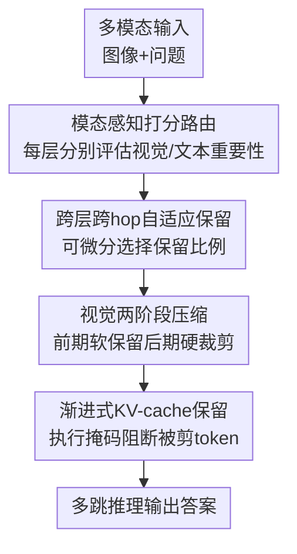

# Efficient Multimodal Spatial Reasoning via Dynamic and Asymmetric Routing

**会议**: ICLR 2026  
**OpenReview**: [https://openreview.net/forum?id=BQASoLmREU](https://openreview.net/forum?id=BQASoLmREU)  
**代码**: 无（论文正文未提供公开仓库链接）  
**领域**: 多模态VLM / 空间推理 / 推理加速  
**关键词**: 动态路由, 非对称剪枝, 多跳推理, KV-cache压缩, 多模态空间推理

## 一句话总结
这篇论文提出 DARE，用“跨层+跨hop 的可微分动态路由”对视觉和文本 token 做非对称保留，在多模态空间推理任务上平均减少 40.37% FLOPs 和 46.07% KV-cache，同时多数任务精度不降反升。

## 研究背景与动机
**领域现状**：近期多模态空间推理（如 VoT、MVoT）通过“边看边想”的多跳机制，把中间视觉思维和文本思维不断拼回上下文，再进入下一轮推理。这个范式在复杂空间任务上确实有效，但代价是序列长度随 hop 增长，注意力计算近似二次增长，显存尤其是 KV-cache 很快成为瓶颈。

**现有痛点**：已有压缩方法大多只在单一模态或单次前向里工作，常见做法是固定层保留率、统一跨模态剪枝，或者启发式选 token。问题在于多跳推理里 token 重要性并不稳定：同一个 token 在浅层可能很关键，到深层可能已经冗余；视觉 token 在跨模态融合后通常更快失去边际价值，而文本 token 往往在深层仍承担语义推理职责。

**核心矛盾**：效率和性能冲突的根因不是“token 总量太大”这么简单，而是“不同模态、不同层、不同 hop 的有效信息密度变化不同”。如果用同一把剪刀全局裁剪，要么保留过多冗余导致算力浪费，要么误删后续推理仍需的关键信息。

**本文目标**：作者把问题拆成三个子目标：
1. 在层内和 hop 间动态建模 token 重要性，而不是固定保留率。
2. 区分视觉与文本的冗余模式，做非对称压缩。
3. 把 token 剪枝与 KV-cache 管理联动，真正降低推理显存和时延。

**切入角度**：作者观察到一个稳定现象：视觉 token 的重要性在中后层明显下降，而文本 token 在后层仍活跃。这个“视觉信息向文本流动”的规律提示我们，不该把视觉和文本视为同分布对象，而应采用模态感知的不同保留策略。

**核心 idea**：DARE 的核心是“可微分、跨层跨hop、模态非对称的 token 路由 + 渐进式 KV-cache 保留”，即在早层保留更丰富跨模态信号，在后层激进裁剪视觉冗余，同时维持文本语义链条。

## 方法详解

### 整体框架
DARE 可以看成插在每个 Transformer 层里的“轻量路由器系统”。每一层都会分别给视觉 token 和文本 token 打分，决定谁继续向后传播。训练时用可微分近似保持端到端学习，推理时变为确定性的 top-k 保留。

与许多“单次压缩”方法不同，DARE 同时在两个维度上自适应：一是**层内深度维**（同一 hop 内不同层的保留变化），二是**跨 hop 维**（随着推理轮次推进，保留策略继续更新）。这样可以避免在早期过度裁剪，也避免在后期保留大量已经被语言通道吸收的视觉冗余。

### 关键设计
**1. 模态感知动态路由：把“保留谁”变成可学习决策**

在第 $l$ 层、模态 $m\in\{t,v\}$ 上，路由器对第 $i$ 个 token 产出重要性分数
$s^{(i,m)}_l=\sigma(W^{(m)}_l x^{(i,m)}_l+b^{(m)}_l)$。
这里的 sigmoid 让分数落在 $[0,1]$，可直接解释为保留倾向。训练阶段，被选中的 token 不只是“通过/不通过”，还会按分数缩放激活，形成“结构选择 + 表征强度”联合优化。这样一来，梯度可以穿过路由过程回流到主干网络和路由头，避免了纯离散决策难训练的问题。

这一设计针对的痛点是：静态规则无法表达“当前层、当前 hop、当前模态”的细粒度差异。DARE 让模型自己学会在何处保留空间证据、何处只留语义摘要。

**2. 跨层跨hop可微保留：在全局预算下做细粒度调度**

作者给每个 hop-层-模态定义可学习保留率 $\rho^{(m)}_{h,l}$，并用 Gumbel-Softmax 近似离散选择：

$$
q^{(i,m)}_{h,l} = \frac{\exp((s^{(i,m)}_{h,l}+g_i)/\tau)}{\sum_j \exp((s^{(j,m)}_{h,l}+g_j)/\tau)}
$$

其中 $g_i\sim\text{Gumbel}(0,1)$，$\tau$ 控制软硬程度。训练时通过直通估计器保持可导；推理时直接按分数取 top-$\rho^{(m)}_{h,l}$。同时引入目标保留率约束（如文中常用文本 70%、视觉 40%）的 MSE 正则，既保证总体压缩预算，又允许局部层/hop 偏离，实现“有弹性的预算控制”。

这个机制的价值在于：它不是把所有层压成同一稀疏度，而是让不同推理阶段拥有不同信息带宽，贴合多跳推理的信息流现实。

**3. 视觉两阶段非对称压缩：顺着跨模态融合方向裁剪**

DARE 对视觉 token 采用“两阶段策略”。在前期层（$l\le l_c$）做软保留，让模型继续利用空间细节；在后期层（$l>l_c$）做硬抑制，使用
$L^{(v)}_{hard}=\sum_{h}\sum_{l=l_c+1}^{L}\sum_i \mu\max(0,s^{(i,v)}_{h,l}-\epsilon)$
惩罚残余高分视觉 token，推动激进裁剪。

直觉上，这相当于承认“视觉信息早融合、后抽象”的流水线结构：前段需要图像证据，后段更多是语言推理。实验里也确实观察到视觉保留率随深度快速下降、文本保留率相对稳定或略升。该非对称设计是 DARE 相比对称剪枝基线（如 UniPrune）的关键性能来源。

**4. 渐进式 KV-cache 保留：把算力压缩转化为显存收益**

仅仅减少前向 FLOPs 不够，多跳推理常常首先卡在 KV-cache。DARE 通过执行掩码把已剪 token 从注意力可见集和缓存写入路径中共同移除：
$M_{h,l}=M_{causal}+E_{h,l}$，其中 $E_{h,l}$ 会给被剪 token 施加 $-\infty$。

作者还保留每个 hop 的前缀 $\kappa$ 个 token（最终选 $\kappa=2$）来维持 BOS/CLS 和早期跨模态对齐稳定性。这个设计使缓存开销可近似写成
$\mathbb{E}[mem_{h,l}] = \rho^{(v)}_{h,l}mem^{full-v}_{h,l}+\rho^{(t)}_{h,l}mem^{full-t}_{h,l}$，
把“保留率学习”直接映射到可预测的显存节省。

### 一个完整示例
下面用一个“厨房空间问答”的典型流程说明 DARE 在一次多跳推理里如何工作：

输入问题是“站在水槽处的人要去烤箱应向哪边转，以及依据是什么”。

第 1 hop（浅层）：模型需定位水槽、烤箱和可通行区域。此时视觉 token 保留率较高（接近目标上限），文本 token 同步保留，确保“看见什么”和“怎么描述”同时在线。

第 2-3 hop（中层）：路由器发现大量背景贴图、墙面纹理等视觉 token 分数下降，被逐步剪掉；而与“左侧/右侧、相邻墙面”有关的文本线索保留较多。

第 4-5 hop（深层）：视觉侧进入硬裁剪阶段，主要靠文本语义链完成结论整合。最终输出“应向左转”，并给出“烤箱位于左侧相邻墙面且中间无遮挡”的依据。

这一过程体现了 DARE 的核心策略：不是一次性压缩，而是让“保留焦点”随推理进度移动。

### 损失函数 / 训练策略
总损失写为
$L=L_{task}+L^{(t)}_{ratio}+L^{(v)}_{soft}+L^{(v)}_{hard}$。

其中 $L_{task}$ 是原始任务损失，$L^{(t)}_{ratio}$ 约束文本保留率接近目标，$L^{(v)}_{soft}$ 和 $L^{(v)}_{hard}$ 分别负责视觉软保留与后期硬抑制。

实现上，作者在 VolCano 与 Anole-7B 两种交错式多模态架构上都验证了 DARE；训练使用 AdamW，主报告配置中常见目标保留率为视觉 40%、文本 70%，并在 A100 上完成实验。

## 实验关键数据

### 主实验
DARE 在四类评测上都给出“效率显著提升 + 精度稳定或提升”的结果。下表汇总最核心对比（取论文主表中代表性数字）：

| 任务 | 基线 | 基线Acc | DARE配置 | DARE Acc | FLOPs变化 | 延迟变化 | 显存/KV变化 |
|------|------|---------|----------|----------|-----------|----------|-------------|
| VSR | VolCano | 67.18 | DARE-LH | 68.09 | 19842G → 11310G（-43.0%） | 0.63s → 0.41s | 8.91GB → 6.13GB |
| V-Star | VolCano | 58.40 | DARE-LH | 60.07 | 21785G → 13585G（-37.6%） | 0.69s → 0.43s | 9.37GB → 6.62GB |
| EmbSpatial | VolCano | 58.29 | DARE-LH | 68.09 | 26543G → 17965G（-32.3%） | 0.72s → 0.45s | 9.73GB → 7.09GB |
| MAZE (Anole-7B) | VoT | 86.56 | DARE-LH | 93.32 | 25640G → 12740G（-50.3%） | 0.79s → 0.43s | KV见下表 |

从趋势看，DARE-LH（层+hop 路由）普遍优于 DARE-L（仅层路由），说明 hop 维度上的动态保留是有效增益。

### 消融实验
论文消融集中回答三个问题：哪些组件真的有用、保留率怎么取、KV 策略是否稳健。

| 消融设置 | 代表结果 | 结论 |
|---------|---------|------|
| 去掉视觉硬抑制或改成对称剪枝（UniPrune） | VSR: 63.71（UniPrune） vs 68.09（DARE-LH） | 非对称视觉后期裁剪是关键增益来源 |
| 保留率网格搜索 | 文本70% + 视觉40%附近精度最好 | 视觉可更激进裁剪，文本更需保留语义链 |
| 前缀 token 数 $\kappa$ 扫描 | $\kappa=0/1$ 精度显著下降；$\kappa=2$ 恢复性能且缓存低 | 小前缀可稳住解码与跨模态对齐 |
| KV-cache对比（VSR） | VoCoT 5.45GB, DARE-L 3.28GB, DARE-LH 2.97GB | DARE 在缓存侧有真实收益，不只是 FLOPs 好看 |

### 关键发现
- DARE 的收益不是“用精度换速度”，而是很多任务上实现精度与效率双提升，尤其在多跳空间推理中更明显。
- 视觉 token 的价值随深度衰减非常稳定，支持“前软后硬”的两阶段视觉策略；文本 token 在后层仍是推理主干。
- hop-aware 路由显著优于只看层的路由，说明多跳任务里“时间维（推理轮次）”是压缩策略必须建模的维度。
- KV-cache 管理是实用部署的决定性因素，DARE 的执行掩码+前缀保留让长链推理更可扩展。

## 亮点与洞察
- DARE 把“压缩”从静态工程技巧提升为“随推理过程演化的决策问题”。这比固定剪枝率更接近多模态推理的真实信息流结构。
- 非对称路由的价值非常直观：视觉负责“把世界读进来”，文本负责“把结论推出来”，两者不该被同样地裁剪。这个观点对很多 VLM 加速工作都有迁移意义。
- 论文把 KV-cache 单独作为一等公民来设计，而不是只汇报 FLOPs，这一点非常务实。真实推理系统里，显存约束常常比算力先触顶。
- “小而稳的前缀保留”这个技巧值得复用。它几乎不增加太多内存，却能显著降低过度剪枝带来的解码不稳定。
- 在方法论上，DARE 证明了“可解释的 token 重要性热图 + 可微分学习路由”可以兼得，为后续做可控推理预算分配提供了可行路径。

## 局限与展望
- 目前主要在空间推理和相关 VQA/幻觉检测上验证，虽然有泛化迹象，但对视频长时序、多图多轮对话等更复杂场景仍需系统评测。
- 视觉两阶段分界层 $l_c$ 采用数据驱动阈值法，工程上有效，但不同架构深度、不同视觉编码器下的可迁移性还可继续研究。
- 路由器本身参数开销不大，但训练流程更复杂（含多项正则、Gumbel-Softmax 温度调度），部署方需要额外调参经验。
- 论文重点优化推理阶段 token 计算与缓存，尚未深入讨论训练阶段端到端吞吐提升（例如更激进的训练时稀疏执行）。
- 未来可探索把路由决策与任务难度估计联动，实现“样本自适应预算”，让简单样本更省、困难样本更稳。

## 相关工作与启发
- **vs SoT / prompt 压缩类方法**：SoT 通过提示词约束输出长度，本质是外部策略；DARE 是模型内部路由学习，能在层与 hop 两维自适应，精度-效率折中更稳。
- **vs LightFastV / SparseVLM**：这些方法通常偏“单模态或单阶段压缩”，在多跳累积场景容易漏掉跨hop依赖；DARE 明确建模跨hop保留，并把视觉与文本策略拆开。
- **vs Heima（潜空间推理）**：Heima 在压缩上更激进，但可能牺牲空间细节可解释性；DARE 保留显式多模态思维链，兼顾可解释性与性能。
- **vs UniPrune（对称可微剪枝）**：UniPrune 证明可微剪枝有效，但忽略模态异质性；DARE 的非对称策略和视觉后期硬抑制是进一步提升的关键。

对我自己的启发是：做多模态推理加速时，不要问“该删多少 token”，而要问“在这一步、这个模态里，哪些 token 还在创造信息增量”。DARE 给出了一个可训练、可部署的回答框架。

## 评分
- 新颖性: ⭐⭐⭐⭐☆ DARE 把跨层跨hop动态路由、模态非对称压缩和KV-cache策略统一到一个框架里，组合创新较强。
- 实验充分度: ⭐⭐⭐⭐⭐ 覆盖多类基准、两种架构、主结果+消融+敏感性+稳定性，证据链较完整。
- 写作质量: ⭐⭐⭐⭐☆ 叙事清晰、图表充分，但方法细节分散在主文与附录，首次阅读有一定门槛。
- 价值: ⭐⭐⭐⭐⭐ 对需要长链多模态推理且受显存/时延约束的系统非常实用，具备明确工程落地意义。

<!-- RELATED:START -->

## 相关论文

- [\[ICLR 2026\] Empowering Small VLMs to Think with Dynamic Memorization and Exploration](empowering_small_vlms_to_think_with_dynamic_memorization_and_exploration.md)
- [\[CVPR 2026\] Learning to Reason in 4D: Dynamic Spatial Understanding for Vision Language Models](../../CVPR2026/vlm_reasoning/learning_to_reason_in_4d_dynamic_spatial_understanding_for_vision_language_model.md)
- [\[ICLR 2026\] AdaReasoner: Dynamic Tool Orchestration for Iterative Visual Reasoning](adareasoner_dynamic_tool_orchestration_for_iterative_visual_reasoning.md)
- [\[CVPR 2026\] Geoint-R1: Formalizing Multimodal Geometric Reasoning with Dynamic Auxiliary Constructions](../../CVPR2026/vlm_reasoning/geoint-r1_formalizing_multimodal_geometric_reasoning_with_dynamic_auxiliary_cons.md)
- [\[CVPR 2026\] Stable and Efficient Single-Rollout RL for Multimodal Reasoning](../../CVPR2026/vlm_reasoning/stable_and_efficient_single-rollout_rl_for_multimodal_reasoning.md)

<!-- RELATED:END -->
