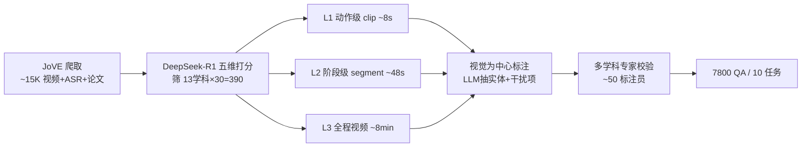

# ExpVid: A Benchmark for Experiment Video Understanding & Reasoning

**会议**: ICLR 2026  
**OpenReview**: [https://openreview.net/forum?id=bj0ahFM4P0](https://openreview.net/forum?id=bj0ahFM4P0)  
**代码**: [https://github.com/OpenGVLab/ExpVid](https://github.com/OpenGVLab/ExpVid)  
**领域**: 多模态视频理解 / 科学实验 Benchmark  
**关键词**: MLLM, 实验视频, 科学推理, wet-lab, 细粒度感知, 程序理解  

## 一句话总结
ExpVid 是首个系统评测多模态大模型（MLLM）理解**真实湿实验室实验视频**能力的基准，用「细粒度感知→程序理解→科学推理」三级任务层次，揭示当前模型擅长粗粒度识别、却在细节辨识、状态跟踪和「从操作推到科学结论」上严重失分。

## 研究背景与动机
**领域现状**：MLLM 在通用视频理解（动作识别、稠密描述、时序定位）和知识密集型评测（MMMU、Video-MMMU、MMVU）上进步飞快，让人想把科研流程的一部分——感知实验操作、核验程序完整性、把操作连到科学结论——交给 AI。

**现有痛点**：现有视频/科学基准要么聚焦通用动作活动，要么停在医学影像的「结果识别」上，**都没碰真实实验室工作的核心难点**：微升级移液这类视觉上极细微的操作、小而常被遮挡的工具、细粒度的材料与状态、以及把早期准备步骤连到下游结果的长程依赖。

**核心矛盾**：科学发现高度依赖湿实验，而湿实验「步步操作、工具驱动结果」的特性恰恰是当前 benchmark 的盲区——没有任何评测能覆盖从「操作感知→程序理解→高阶科学分析」的完整能力谱。

**本文目标**：构建一个贴合实验科学现实、既可扩展又严谨的基准，系统诊断 MLLM 在真实实验视频上的能力边界，并为「可信赖的科研助手」指明改进路线。

**核心 idea**：**[视觉为中心 + 三级任务层次]** 从 JoVE 同行评审视频期刊采集 390 个配套论文的实验视频，按「秒级单步 / 分钟级多步 / 全实验」三种时间粒度切分，设计镜像科学家工作流的三级任务，并用「LLM 自动生成 + 多学科专家校验」的标注管线保证每道题**必须靠视觉**才能答对。

## 方法详解

### 整体框架
ExpVid 的构建是一条「采集→预处理→标注→校验」四阶段管线：从 JoVE 爬取 ~15K 个带 ASR 转录和论文的实验视频，用 DeepSeek-R1 五维打分筛选出 13 学科 × 30 个 = 390 个高质量视频；再把每个视频处理成三级时间粒度（动作级 clip / 阶段级 segment / 全程视频），在每级上用「LLM 抽实体 + 模板嵌入 + 专家校验」生成 10 类任务共 7,800 道 QA。

### 关键设计

**1. 三级任务层次：镜像科学家工作流的能力谱。** ExpVid 的灵魂是把评测拆成与时间粒度对齐的三层。**Level-1 细粒度感知**在秒级短 clip 上做四类四选一 MCQ——材料识别、工具识别、数量识别（剂量/温度/计数）、操作识别（如 Insert 与 Attach 的区分），考的是「能不能看清」。**Level-2 程序理解**在分钟级阶段 segment 上做四类任务——步骤排序（Step Ordering）、序列生成（Sequence Generation，从候选里挑出片段中出现的有序步骤）、完整性核验（Completeness Verification，找出缺失的那一步）、步骤预测（Step Prediction，给前 $n-1$ 步预测第 $n$ 步），考的是「懂不懂逻辑与时序」。**Level-3 科学推理**在全程视频上做两类填空——实验分析（从实验数据推关键结论）、科学发现（跨整段视频抽象出更宏观的科学洞见、意义与改进方向），考的是「能不能把操作连到结论」。这一层级设计让评测能逐级揭示模型能力的断点。

**2. 视觉为中心的标注：逼模型「看」而非「猜」。** 为防止模型靠语言先验或 ASR 文本走捷径，标注刻意**不把旁白里的答案线索编进题干**。具体地：感知任务先由 DeepSeek-R1 从 ASR 句子里抽出材料/工具/数量/操作作为靶标，再用 Qwen2.5-VL captioner 提供「视觉触发器」核验该实体在画面里确实可见；干扰项则按任务定制——材料和工具的干扰项反映视觉/功能相似或常见混淆，数量的干扰项落在相近数值区间以模拟感知误差，操作的干扰项是同一实验场景下「貌似合理但错误」的动作。Level-3 则用 MinerU 解析配套论文的 Intro/Results/Discussion，GPT-5 总结发现作为锚点，再由博士级专家设计「只有看视频才能答、脱离视频无法答、答案唯一」的填空题。这套设计把「视觉接地」硬编进了基准。

**3. 三级时间粒度预处理：用一段视频喂出三种难度。** 同一个实验视频被切成三套素材。**动作级 clip**：按标点切分 ASR、把每句对齐到时间戳裁视频，得到 ~10K 个平均 ~8s 的 clip–文本对，适配感知任务。**阶段级 segment**：用 DeepSeek-R1 在「逻辑+因果连续」约束下把实验划成语义连贯的阶段（准备/主操作/后处理），每段限 20–60s，并从每段抽步骤描述构成 segment step list，拼接得 full step list，作为程序理解的基底。**全程视频**：保留平均 ~8 分钟的完整实验，并刻意移除结尾的幻灯片、图表、数据分析段，防止模型「读结论作弊」，逼其依赖程序内容做长程结构化推理。

**4. 半自动标注 + 专家校验闭环：可扩展又严谨。** 管线维持约 50 名标注员（每大类约 15 名领域预备人员），用专门的在线标注平台为每种题型配定制界面，强制每条标注（哪怕批准）都写理由以保证可追溯。统一准则包括：视频可解、无泄漏无捷径、步级具体可视、格式清晰答案唯一、校验需说明理由。流程含一个月试点（对齐 rubric）+ 一个月正式标注；单个实验需先看 ~40 分钟视频+论文，再逐题校验（L1 约 6–8 分钟、L2 约 13 分钟、L3 约 18 分钟），最终产出 7,800 道 QA。

## 实验关键数据

### 主实验表格（20 个 MLLM，部分代表，三级平均，%）

| 模型 | Think | L1 Avg | L2 Avg | L3 Avg |
|------|:---:|:---:|:---:|:---:|
| Human（非专家） | – | 37.6 | 42.1 | –（无法完成） |
| Qwen2.5-VL-7B | × | 42.6 | – | 23.3 |
| InternVL3.5-38B | ✓ | 44.0 | 36.0 | 31.9 |
| InternVL3-78B | ✓ | 50.9 | 41.9 | 37.7 |
| Intern-S1 | ✓ | 49.9 | 36.0 | 39.6 |
| Claude-Sonnet-4 | × | 40.8 | 36.0 | 29.6 |
| Gemini-2.5-Flash | ✓ | **60.2** | 49.8 | 43.0 |
| Gemini-2.5-Pro | × | 59.2 | 53.8 | 47.9 |
| **GPT-5** | ✓ | 53.3 | **57.5** | **56.4** |

### 与现有 benchmark 对比

| Benchmark | #QA | #Videos | Avg.Sec | #Tasks | 标注 | 领域 |
|------|:---:|:---:|:---:|:---:|:---:|:---:|
| MVBench | 4,000 | 3,641 | 16.0 | 20 | A+M | General |
| Video-MMMU | 900 | 300 | 506.2 | 3 | M | Multi-disc. |
| SFE | 830 | – | – | 66 | M | Science |
| **ExpVid** | **7,800** | **390** | **489.0** | **10** | **A+M** | **Science** |

### 关键发现
- **闭源碾压开源，且差距随难度拉大**：感知层 Gemini-2.5-Flash(think) 60.2 vs 最佳开源 InternVL3-78B 50.9；到推理层 GPT-5 56.4，最佳开源 Intern-S1 仅 39.6，差近 17 分。
- **前沿闭源模型超越非专家人类**：Gemini-2.5-Flash-Think 在 L1 达 60.2、GPT-5 在 L2 达 57.5，均远超人类的 37.6 / 42.1（人类在 L3 因缺专业训练无法作答）。
- **能力严重不均衡**：所有模型在 Step Ordering（重排已有信息）上得分最高（开源 InternVL3-78B 达 87.1，甚至超 GPT-5 的 85.1），但在 Completeness Verification、Step Prediction（识别缺失/预测未来）上普遍崩盘——开源做长程整体推理仍乏力。
- **scaling 有效**：InternVL 从 8B→38B→78B，三级分数单调提升（L1 39.4→44.0→50.9），验证模型规模是实验视频理解的关键轴。
- **帧数消融**：去掉视频帧（w/o frames）后各任务大幅掉分，证明任务确实依赖视觉而非文本捷径。

## 亮点与洞察
- **填补真实湿实验室视频的评测空白**：不同于停在「结果识别」的医学影像基准，ExpVid 直击「步步操作、工具驱动结果」的实验过程本身。
- **三级层次设计有诊断力**：把模型能力断点精确定位到「能看清但不会跟踪状态、能重排但不会补缺/预测、能感知但连不到结论」。
- **视觉为中心的反捷径机制**：靠视觉触发器核验 + 同场景似真干扰项 + 移除结论段，把「看视频」硬性锁死，避免 LLM 先验刷分。
- **数据来源天然严谨**：JoVE 同行评审视频 + 配套论文，使 Level-3「操作→科学结论」的标注有可靠锚点。

## 局限与展望
- **学科覆盖有偏**：聚焦生物/化学/医学等湿实验，刻意排除计算类和多数物理实验，对纯干实验或仿真场景不适用。
- **JoVE 单一来源 + exo-view**：均为标准化外视角教学录像，与真实凌乱、第一视角的实验台环境仍有分布差异。
- **Level-3 评测依赖辅助 LLM 判分**：填空题用轻量语言模型对比参考答案打 per-blank 准确率，可能引入评分噪声。
- **未给出训练/微调路线**：作为诊断基准只揭示差距，如何用它驱动模型能力提升（如数据合成、RL）留待后续。

## 相关工作与启发
- **通用视频基准**（MVBench、Video-MME、MLVU、LVBench、VRBench）：推进了感知与时序推理，但对领域科学知识与实验上下文无感。
- **知识密集/科学基准**（MMMU、Video-MMMU、MMVU、ChemBench、SFE、SCI-VID）：强调跨学科专家级知识，但多停在结果识别而非「理解整个实验」。
- **启发**：ExpVid 提示，下一代「科研助手型」MLLM 的瓶颈不在粗粒度识别，而在**跨步状态跟踪 + 程序完整性核验 + 操作到结论的因果推理**——这正是 agent 化科研工作流最需补强的能力。

## 评分
- **新颖性**: ⭐⭐⭐⭐⭐ 首个针对真实湿实验室实验视频、覆盖「感知→程序→推理」完整能力谱的系统性基准，视觉为中心反捷径设计扎实。
- **实验充分度**: ⭐⭐⭐⭐ 评测 20 个开/闭源模型、10 类任务、含人类基线与帧数/scaling 消融，分析细致；学科范围偏湿实验略限通用性。
- **写作质量**: ⭐⭐⭐⭐ 三级层次与构建管线讲解清晰，图表（任务层次图、构建管线图）信息量大。
- **价值**: ⭐⭐⭐⭐⭐ 为「可信赖科研助手」MLLM 指明明确改进方向，基准+数据已开源，对具身/agent 化科学发现有长期参考价值。

<!-- RELATED:START -->

## 相关论文

- [\[CVPR 2026\] Towards Sparse Video Understanding and Reasoning](../../CVPR2026/vlm_reasoning/towards_sparse_video_understanding_and_reasoning.md)
- [\[ICLR 2026\] IV-Bench: A Benchmark for Image-Grounded Video Perception and Reasoning in Multimodal LLMs](iv-bench_a_benchmark_for_image-grounded_video_perception_and_reasoning_in_multim.md)
- [\[CVPR 2026\] Agentic Video Summarization via Self-Reflecting Multimodal Understanding](../../CVPR2026/vlm_reasoning/agentic_video_summarization_via_self-reflecting_multimodal_understanding.md)
- [\[ICLR 2026\] TimeSearch-R: Adaptive Temporal Search for Long-Form Video Understanding via Self-Verification Reinforcement Learning](timesearch-r_adaptive_temporal_search_for_long-form_video_understanding_via_self.md)
- [\[ICML 2026\] VideoKR: Towards Knowledge- and Reasoning-Intensive Video Understanding](../../ICML2026/vlm_reasoning/videokr_towards_knowledge-_and_reasoning-intensive_video_understanding.md)

<!-- RELATED:END -->
