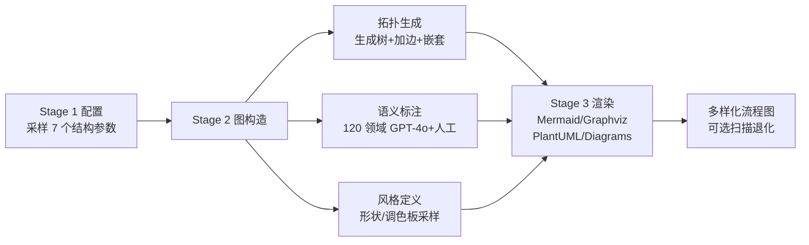

# FlowGen: Synthesizing Diverse Flowcharts to Enhance and Benchmark MLLM Reasoning

**会议**: ICLR 2026  
**OpenReview**: [https://openreview.net/forum?id=uimrBBfDCH](https://openreview.net/forum?id=uimrBBfDCH)  
**代码**: [https://github.com/nju-websoft/FlowGen](https://github.com/nju-websoft/FlowGen)  
**领域**: 多模态推理 / 视觉文档理解 / 数据合成  
**关键词**: 流程图理解, 可控数据合成, MLLM, 结构化解析, 跨渲染器泛化  

## 一句话总结
提出一个可控的流程图合成器 FlowGen，通过七个结构参数 + 四种渲染后端按需"造图"，既能合成海量训练数据把开源 MLLM 的流程图解析能力大幅提升（甚至逼近闭源模型），又能生成一个让 GPT-4o 都做不到 25% F1 的硬核 benchmark。

## 研究背景与动机
**领域现状**：流程图把符号信息和空间布局结合，是科研、业务建模（BPMN）、软件文档、教育里最常见的图形语言；让 MLLM 端到端读懂流程图、抽出结构化表示，是代码生成、文档知识抽取、工作流推理等下游任务的基础。

**现有痛点**：现有流程图数据集（FlowVQA、FlowLearn、CBD、hdBPMN 等）几乎都缺乏对**关键属性的细粒度控制**——你没法指定"图里要有多少分支、嵌套多深、边密度多大"。测试集大多只用单一渲染风格（如清一色 Mermaid），无法评估模型对风格变化的鲁棒性；训练集则规模小、领域窄、缺嵌套等结构特征。结果就是模型一碰到高复杂度或跨渲染器的图就崩。

**核心矛盾**：真实世界的流程图在结构复杂度和视觉风格上**高度多样**，而现有静态数据集是**固定且不可调**的——数据的可控性缺失直接卡死了模型训练和系统性评测。

**本文目标**：用一个可控合成器同时填上"训练资源不足"和"测试资源不够刁钻"两个坑，把流程图的结构复杂度和渲染风格都变成可调旋钮。

**核心 idea**：**【可控合成】** 不去人工标注或网络爬取，而是把流程图的拓扑结构和视觉风格全部参数化，从一份紧凑配置出发自动生成结构有效、语义连贯、风格多样的流程图，训练集和测试集都能"无限量按需供应"。

## 方法详解

### 整体框架
FlowGen 是一条三阶段流水线：**配置 → 图构造 → 渲染**。用户给一份紧凑的参数配置，合成器先采样出控制拓扑和语义复杂度的结构参数，再构造一个语义连贯的有向无环图（DAG）作为骨架，最后用四种风格各异的渲染后端把抽象图渲染成视觉流程图。三个阶段分别管住结构复杂度、语义丰富度和视觉外观。

### 关键设计

**1. 七参数结构旋钮：把"图有多难"写成可调配置。** 这是整套方法的灵魂。合成器用七个参数刻画一张流程图的拓扑与语义复杂度：图阶数 $\nu$（节点总数，分 8–12 / 13–20 / 21–30 三档）决定整体规模；分裂箭头数 $\epsilon_s$ 和合并箭头数 $\epsilon_m$ 各引入"虚拟节点"来模拟一个流程发散成多条并发分支、或多条并行流汇聚成一个流程；分支因子 $\Delta_b$ 控制这些虚拟节点的最大入/出度；密度 $\rho=\epsilon/\nu$（边节点比）调节视觉拥挤程度，越大越像一团乱麻、越小越像树；无标签边比例 $\lambda\in[0,1]$ 控制语义稀疏度——$\lambda=0$ 时每条边都有文字标签，$\lambda=1$ 时全是裸边、推理最难；嵌套子图数 $\eta$ 则在全局节点数之外额外加上层级深度。把这些旋钮组合起来，就能精准生成从 Easy 到 Hard 的连续难度谱。

**2. 拓扑生成：从生成树到带嵌套的合法 DAG。** 给定采样参数后，构造分三步走。先在 $\nu$ 个节点上随机生成一棵**生成树**作为无环骨架，保证节点能被合理定位；再按 $\epsilon_s,\epsilon_m,\Delta_b$ 加入额外边提升连通性，若边数仍达不到目标密度 $\rho$，就继续随机补无环边直到满足比例；最后引入层级深度——随机挑 2 到 5 个连通节点打包成一个更高层的节点（受 $\eta$ 控制），且这些嵌套子图被约束为互不相交以保持清晰，一旦 $\eta$ 超过当前图能容纳的不相交分组数，生成器就停止继续嵌套以维持结构有效性。这一套保证了无论参数怎么采样，出来的都是结构上站得住的图。

**3. 语义标注 + 风格定义：让合成图既有意义又好看。** 光有拓扑还不够，模型得读"有内容"的图。合成器从 **120 个预定义应用领域**里采样一个主题，每个领域提供 40 个节点名和 40 个边标签（先由 GPT-4o 生成、再经人工校验），按概率 $1-\lambda$ 给边贴上主题相关标签以保持语义连贯。风格上则用一个预定义的样式字典：节点/边形状随机采样（允许重复以模拟真实图的随意性），并从 90 种调色方案池里为每个主题实例随机抽 5 套调色板，给节点边框、填充、边着色——既丰富了视觉多样性，又保证单张图内部主题一致。

**4. 多渲染后端：用四种引擎制造风格鸿沟。** 真实流程图来自五花八门的工具，单一渲染风格训出来的模型一换引擎就废。FlowGen 集成 **Mermaid、Graphviz、PlantUML、Diagrams** 四套互补后端，各有各的语法、布局算法和视觉约定（Mermaid 偏轻量 web 原生、Graphviz 擅长精细层级布局、PlantUML 支持模块化子图、Diagrams 支持程序化组合簇与实体）。抽象图被翻译成各后端特有的形状、连接器和嵌套子图元素，从而产出风格鸿沟巨大的图。可选地还能把图栅格化成带模糊、透视畸变、有损压缩的"扫描件"，进一步逼近真实退化场景。

## 实验关键数据

### 主实验表格（流程图解析，strict F1 / relaxed rF1，节选）

| 模型 | FlowVQA F1 | CBD F1 | FC_A F1 | FlowLearn F1 | hdBPMN F1 |
|------|-----------|--------|---------|--------------|-----------|
| GPT-4o（闭源） | 88.2 | 64.5 | 41.9 | 53.9 | 26.5 |
| GLM-4V-Plus（闭源） | 74.0 | 55.6 | 33.0 | 31.6 | 8.6 |
| Qwen2.5-VL-3B | 12.7 | 17.9 | 2.8 | 20.6 | 2.3 |
| Qwen2.5-VL-3B **+SFT** | **51.3** | **49.8** | **22.4** | **41.6** | **8.4** |
| Qwen2.5-VL-7B | 59.4 | 49.1 | 25.8 | 43.2 | 16.6 |
| Qwen2.5-VL-7B **+SFT** | **70.9** | **55.4** | **29.5** | **60.1** | **18.3** |

在 FlowGen 上微调后，Qwen2.5-VL-7B 在 FlowLearn（60.1）和 hdBPMN（18.3）上**反超闭源的 GLM-4V-Plus**（31.6 / 8.6），证明合成数据带来真实的跨域泛化而非过拟合。

### 消融实验表格（Qwen2.5-VL-7B，strict F1，固定总数据量）

| 训练变体 | FlowVQA | CBD | FC_B | hdBPMN | FlowLearn |
|----------|---------|-----|------|--------|-----------|
| 完整 FlowGen | 70.9 | 55.4 | 40.8 | **18.3** | 60.1 |
| 去多渲染器（仅 Mermaid） | 76.2 | 53.3↓ | 38.1↓ | 17.0↓ | 60.9 |
| 去嵌套子图 | 70.0 | 54.6 | 40.6 | 16.6↓ | 59.2 |
| 去分裂/合并箭头 | 69.6 | 54.3 | 38.8↓ | 17.7 | 58.3↓ |

去掉多渲染器后，只用 Mermaid 的 FlowVQA/FlowLearn 反而略升（分布对齐），但跨渲染器的 CBD/FC_B 明显下降——印证风格多样性对跨渲染器泛化的关键作用；去嵌套主要伤害 hdBPMN（唯一含大量嵌套的真实基准）。

### Benchmark 测试表格（FlowGen 测试子集，strict F1，节选）

| 模型 | Graph-Easy | Graph-Medium | Graph-Hard | Scanned-Hard |
|------|-----------|--------------|------------|--------------|
| GPT-4o | 38.4 | 16.2 | 12.0 | 20.5 |
| Gemini-2.5-Flash | 43.2 | 13.7 | 9.7 | 21.6 |
| Qwen2.5-VL-3B | 20.4 | 6.2 | 2.9 | 9.0 |

### 关键发现
- **训练增益普遍且可迁移**：开源小模型微调后 F1 翻数倍（Qwen2.5-VL-3B 在 FlowVQA 从 12.7→51.3），且能迁移到多个真实数据集。
- **三元组作中间表示有效**：用 FlowGen 微调模型抽出的三元组喂给 QA，准确率逼近 gold-standard（FlowLearn 88.2 vs 89.1），远超模型自抽（77.1）。
- **benchmark 极具挑战**：连 GPT-4o、Gemini-2.5-Flash 在多数子集都做不到 25% F1，且性能瓶颈主要来自**复杂多样的拓扑结构**（分支/嵌套），而非表面渲染效果。
- **错误剖析**：50 个失败案例中，OCR 类错误 56%、边歧义 44%、复杂嵌套 40%（一案可多错因）。

## 亮点与洞察
- **把"数据"变成"函数"**：最大贡献是用参数化合成同时解决训练和测试两端的数据困境——训练集理论上无限量，测试集难度可连续调，彻底摆脱静态数据集的天花板。
- **难度可证伪**：用 FlowGen 自己造的图训练+测试这种"最有利条件"下模型仍远未饱和，干净地论证了难点来自拓扑结构本身而非渲染噪声，是很扎实的归因。
- **开源逼近闭源**：证明高质量可控合成数据能让小开源模型在特定结构化任务上追平甚至反超闭源大模型，对资源有限的研究者很有价值。

## 局限与展望
- 合成图终究是"程序生成"，与真实手绘/扫描流程图（如 FC_A/FC_B 手绘集）仍有分布差距，hdBPMN 等真实基准上绝对性能依旧偏低。
- 语义来自 120 个固定领域 + GPT-4o 生成词表，主题覆盖和语言多样性受限，长尾领域可能仍是盲区。
- 统一训练（Combined）虽有跨子集泛化但普遍不如子集专训，说明不同复杂度/退化维度的分布差异大，如何用一份数据兼顾各维度仍待解。
- 评测仍以三元组精确/松弛匹配为主，对真正复杂推理（多跳工作流推断）的衡量有限。

## 相关工作与启发
- **流程图数据集谱系**：相比 FlowchartQA、FlowVQA（仅 Mermaid）、FlowLearn（8k 训练、单渲染器）、hdBPMN（手绘 BPMN）等，FlowGen 是首个同时支持分支+嵌套且多渲染器、训练/测试均"无限量"的可控合成器。
- **可控数据合成思路**：与图像/文本领域"用合成数据补真实数据短板"一脉相承，启发是——当某任务的瓶颈是数据的**可控性**而非数量时，把数据生成过程参数化、把难度做成连续旋钮，往往比单纯堆量更能推动模型能力与评测前沿。
- **结构化中间表示**：把视觉图先解析成三元组再做 QA 的范式，可迁移到表格、电路图、UML 等其他"图形语言"理解任务。

## 评分
- **新颖性**: ⭐⭐⭐⭐ 可控参数化合成 + 多渲染后端的组合在流程图领域是首创，把训练/测试数据困境一并解决的视角扎实，虽然单点技术（DAG 生成、模板渲染）不算前沿。
- **实验充分度**: ⭐⭐⭐⭐ 覆盖 10 个 MLLM、6 个解析基准 + 4 个 QA 基准、消融/错误剖析/扫描退化/多样性量化齐全，论证链条完整。
- **写作质量**: ⭐⭐⭐⭐ 参数定义清晰、流水线图直观、表格组织合理，动机与结论呼应。
- **价值**: ⭐⭐⭐⭐ 开源代码+数据、能让小模型逼近闭源、并提供一个区分度高的硬 benchmark，对社区实用价值高。

<!-- RELATED:START -->

## 相关论文

- [\[ICLR 2026\] Game-RL: Synthesizing Multimodal Verifiable Game Data to Boost VLMs' General Reasoning](game-rl_synthesizing_multimodal_verifiable_game_data_to_boost_vlms_general_reaso.md)
- [\[ICLR 2026\] CircuitSense: A Hierarchical MLLM Benchmark Bridging Visual Comprehension and Symbolic Reasoning in Engineering Design Process](circuitsense_a_hierarchical_mllm_benchmark_bridging_visual_comprehension_and_sym.md)
- [\[ICLR 2026\] ExpVid: A Benchmark for Experiment Video Understanding & Reasoning](expvid_a_benchmark_for_experiment_video_understanding_reasoning.md)
- [\[ICLR 2026\] Ref-Adv: Exploring MLLM Visual Reasoning in Referring Expression Tasks](ref-adv_exploring_mllm_visual_reasoning_in_referring_expression_tasks.md)
- [\[CVPR 2026\] CRIT: Graph-Based Automatic Data Synthesis to Enhance Cross-Modal Multi-Hop Reasoning](../../CVPR2026/vlm_reasoning/crit_graph-based_automatic_data_synthesis_to_enhance_cross-modal_multi-hop_reaso.md)

<!-- RELATED:END -->
