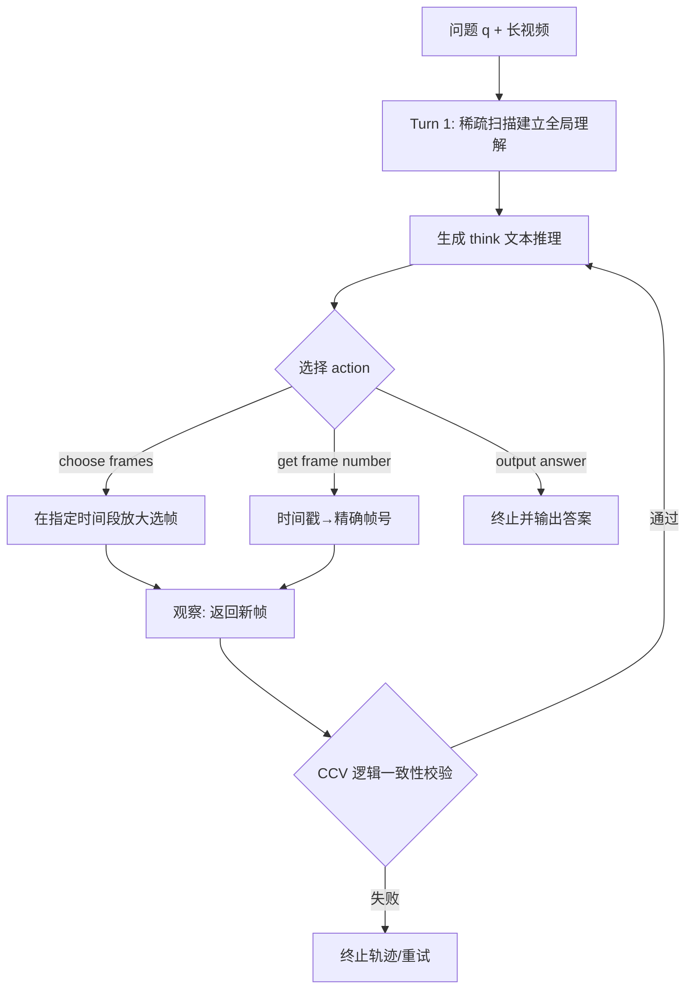

# FrameThinker: Learning to Think with Long Videos via Multi-Turn Frame Spotlighting

**会议**: ICLR 2026  
**OpenReview**: [https://openreview.net/forum?id=nsNpsCpVG1](https://openreview.net/forum?id=nsNpsCpVG1)  
**代码**: [https://github.com/lcqysl/FrameThinker](https://github.com/lcqysl/FrameThinker)  
**领域**: 多模态 / 长视频推理 / 强化学习  
**关键词**: 长视频推理, LVLM, 多轮交互, 主动帧选择, GRPO, 奖励设计  

## 一句话总结
FrameThinker 让视觉语言模型像侦探一样"边想边看长视频"——先稀疏扫一遍，再根据推理需求多轮"放大"到关键片段选帧，用 SFT 学动作语法 + RL 学决策策略，在 LongVideo-Reason 上用平均 20.6 帧（对手 512 帧）达到 76.1% 的新 SOTA。

## 研究背景与动机
**领域现状**：LVLM（Qwen2.5-VL、Gemini、GPT-4o）在视频理解上进展迅速，DeepSeek-R1 之后又涌现 Video-R1、VideoChat-R1、LongVILA-R1 这类用可验证奖励强化学习（RLVR）的推理模型，在多个 benchmark 上甚至超过闭源模型。

**现有痛点**：现有方法几乎都依赖**均匀稀疏采样**——把长视频先采成一组固定帧再喂给模型。长视频里这样既低效（处理大量无关帧），又容易漏掉关键帧，且冗长嘈杂的上下文反而拖垮推理。更关键的是，它们的推理**只在文本空间**进行：视觉信息只作为静态起点，初始输入之后模型再也无法"重新看"视频。视频 Agent 虽然能用工具交互，但多依赖预定义工作流和外部模型，决策策略无法从数据端到端学习。

**核心矛盾**：长视频推理需要"按需、动态地"获取证据，但被动均匀采样把"看什么"在推理开始前就一次性定死了——感知和推理被强行解耦，模型没有机会根据思考结果回头找更细的视觉线索。

**本文目标**：让模型获得"用长视频思考"（think with long videos）的能力，把范式从**被动一次性处理**转向**主动多轮迭代推理**，在大幅减少处理帧数的同时提升推理精度。

**核心 idea**：[主动交互] 把视频当成可反复查询的环境，模型每步先输出 `<think>` 再选 `<action>`（选帧 / 查时间戳对应帧号 / 输出答案），交错文本推理与视觉帧构成多模态思维链；[两阶段训练 + 奖励探索] 先 SFT 学动作语法，再 GRPO 强化学习学策略，并系统性地探索多轮视频推理的奖励设计空间，发现并修复 mode collapse 与"投机式非逻辑动作"问题。

## 方法详解

### 整体框架
FrameThinker 把长视频推理建模成一个多轮"思考—动作—观察"循环：给定问题 $q$，模型生成轨迹 $\tau = ((t_1,a_1,o_1),\dots,(t_n,a_n,o_n))$，其中 $t_j$ 是 `<think>` 标签里的文本推理，$a_j$ 是 `<action>` 标签里选定的动作，$o_j$ 是环境执行动作后返回的观察（一组帧、一个帧号或终止信号）。模型先做一次稀疏扫描建立全局认识，再在有希望的时间段"放大"选帧，反复迭代直到证据充足才输出答案。训练分两阶段：SFT 灌输基本动作语法，RL（GRPO）优化决策策略，并由 CCV 模块保证推理与动作逻辑一致。

### 关键设计

**1. 三动作空间：把"重新看视频"变成可执行操作**。FrameThinker 定义了三个面向长视频推理的动作，让模型能在推理中途真正回头查视频。`choose frames between START and END` 是核心视觉探索动作，从指定时间段取回一小段帧（如 8 帧）实现"zoom-in"；`get frame number at time MM:SS` 是辅助动作，把人类可读时间戳翻译成精确帧索引，供后续选帧使用，增强时间感知；`output answer` 是终止动作，证据足够时才调用给出最终答案。`<think>...</think><action>...</action>` 的结构化输出把推理与动作显式分离，使每一步的决策都有可追溯的文本依据。

**2. SFT 灌语法 + GRPO 学策略的两阶段训练**。直接上 RL 模型连动作语法都不会，但纯 SFT 又只会死记固定解题路径、泛化脆弱。所以先用一个**仅 2,392 条**精心构造的小数据集做 SFT，只对 `<think>` 和 `<action>` 标签内的 token 算交叉熵损失（query 和观察作为上下文不计损失），把基本动作语法刻进模型；再用**更大更多样的 28k 数据**做 RL，避免过拟合特定模式。RL 采用 GRPO：对每个 query 从旧策略采样 $G$ 条轨迹，用组内奖励归一化构造优势 $A_i = \frac{R_i - \mathrm{mean}(\{R\})}{\mathrm{std}(\{R\}) + \delta}$，优化目标 $J_{\text{GRPO}}(\theta) = \mathbb{E}\big[\frac{1}{G}\sum_i \min(r_i A_i,\ \mathrm{clip}(r_i,1-\epsilon,1+\epsilon)A_i)\big]$，并省去 KL 项以提效、避免过早约束策略搜索。

**3. 奖励设计四问：从 format reward 到条件动作奖励**。多轮交互给奖励设计带来全新问题，本文系统性地逐一回答。**要不要 format reward？** 不要——大的 format reward 会制造"投机激励"：训练早期模型发现不推理直接乱猜答案就能稳拿格式分，而尝试动作反而有格式错误得零分的风险，于是迅速抑制动作探索；何况执行引擎本身会因非法动作提前终止轨迹来惩罚格式错误。**动作奖励要无条件还是有条件？** 无条件奖励（执行动作即给奖励）会导致 mode collapse（反复调同一动作、推理退化成无意义重复文本），所以改成**条件奖励**——只有动作处在通向正确答案（$R_{acc}=1$）的轨迹里才给奖励：$R_{\text{total}} = R_{acc} + R_{\text{action}}$，其中 $R_{\text{action}} = \lambda_{cf}\cdot\mathbb{I}(cf\in\tau) + \lambda_{gfn}\cdot\mathbb{I}(gfn\in\tau)$。**奖励该偏向哪个动作？** 刻意设 $\lambda_{gfn}\gg\lambda_{cf}$，因为选帧难以监督（取了无关帧也可能蒙对），而查帧号客观可验证、信息量大，又能通过 CCV 间接监督选帧。**要不要鼓励更多轮次？** 用 $R_{\text{action}} = k\cdot(T-1)$ 直接奖励轮数会让训练快速崩溃——模型为了堆累积奖励疯狂增加轮次而牺牲推理连贯性，故弃用。

**4. CCV：认知一致性校验，封堵"逻辑自洽却投机"的动作**。条件奖励解决了 mode collapse，但更隐蔽的问题仍在：模型可能执行"碰巧出现在成功轨迹里"的非逻辑动作——比如 think 里决定看某区间、action 却选了完全不同的区间，或查了某时间戳的帧号后却从别处选帧。CCV 是一个**基于规则的过滤器**，rollout 后对每条轨迹检查冗余性、逻辑流和 thought-action 保真度，最终奖励 $R_{\text{final}} = R_{\text{total}} \cdot V_{\text{CCV}}(\tau)$，其中 $V_{\text{CCV}}$ 通过返回 1、失败返回 0，直接把非逻辑轨迹清零，杜绝"为奖励作弊"。推理阶段 CCV 充当运行时护栏：检测到非逻辑动作就终止当前尝试、允许重试或回退，既保证思维链可解释，又带来额外性能增益。

## 实验关键数据

### 主实验表格

推理 benchmark（基座均为 Qwen2.5-VL-7B）：

| 模型 | Video-Holmes 帧/Acc | LongVideo-Reason 帧/Acc |
|------|------|------|
| GPT-4o | 32 / 42.0 | - |
| Gemini-1.5-Pro | 32 / 41.2 | - / 69.3 |
| LongVILA-R1 | - | 512 / 72.0 |
| Video-R1 | 32 / 36.5 | - / 68.1 |
| VideoChat-R1 | 32 / 33.0 | 32 / 67.2 |
| Qwen2.5-VL-7B | 32 / 27.8 | 32 / 64.1 |
| **FrameThinker** | **15.9 / 46.8** | **20.6 / 76.1** |
| Δ vs 基线 | **-50% 帧 / +19.0** | **-36% 帧 / +12.0** |

长视频理解 benchmark：

| 模型 | LongVideoBench 帧/Acc | MLVU 帧/Acc | VideoMME-Long 帧/Acc | LVBench 帧/Acc |
|------|------|------|------|------|
| Video-R1 | 32 / 52.7 | 32 / 60.2 | 32 / 48.2 | 32 / 35.3 |
| Qwen2.5-VL-7B | 32 / 43.2 | 32 / 48.4 | 32 / 41.9 | 32 / 31.6 |
| **FrameThinker** | **21.1 / 52.9** | **23.2 / 59.1** | **24.1 / 47.6** | **23.9 / 36.6** |
| Δ vs 基线 | -34% / +9.7 | -28% / +10.7 | -25% / +5.7 | -25% / +5.0 |

六个 benchmark 平均准确率 **53.2%**，相对 Qwen2.5-VL-7B 基线 **+10.4%**，且帧数大幅减少。

### 消融实验表格

| 消融项 | 关键发现 |
|------|------|
| 训练阶段 | 完整 SFT+RL 方案显著优于仅用相同 SFT/RL 设置微调的 Qwen2.5-VL-7B 基线 |
| Format reward | 加入后动作使用率训练早期急剧下降，抑制探索 → 弃用 |
| CCV 模块 | 训练与推理阶段都启用带来切实性能提升，不只是提升可解释性 |
| 动作奖励配置 | $\lambda_{gfn}=0.2,\lambda_{cf}=0$（更偏向查帧号）效果最佳 |

### 关键发现
- **极致帧效率**：LongVideo-Reason 上仅 20.6 帧达 76.1%，对手 LongVILA-R1 用 512 帧才 72.0%，帧数省 20 倍仍反超。
- **少看反而看得准**：处理帧数普遍减少 25%–50%，准确率却全面上升，印证"嘈杂上下文拖垮推理"的判断。
- **奖励设计是成败关键**：format reward 抑制探索、无条件奖励致 collapse、盲目堆轮次致训练崩溃——三个反直觉陷阱都被实验证实并规避。

## 亮点与洞察
- **范式转换有画面感**：把长视频推理从"一次性均匀采样"变成"侦探式多轮放大取证"，`<think>/<action>` 交错的多模态思维链让"用视频思考"真正落地、可追溯。
- **奖励设计的系统性消融极有价值**：四个"should we…"问题逐一实证，揭示了 RLVR 在多轮视觉交互场景下的独特陷阱（投机式格式分、mode collapse、非逻辑动作、轮数贪婪），对后续做"工具使用 RL"的工作有很强参考意义。
- **CCV 是点睛之笔**：用轻量规则过滤器把"碰巧成功的非逻辑轨迹"清零，同时身兼训练正则和推理护栏两职，既提性能又保可解释性。
- **效率与效果双赢**：7B 小模型在帧数省一个数量级的前提下刷新 SOTA，对长视频部署的算力友好度极高。

## 局限与展望
- **动作空间有限**：当前只有选帧/查帧号/答题三个动作，未涉及更细粒度的空间裁剪、目标跟踪、跨段比对等，复杂视频任务可能受限。
- **CCV 依赖规则**：逻辑一致性校验是 rule-based 的，规则覆盖面和误杀率未必能泛化到所有题型，若能学习化会更鲁棒。
- **选帧监督仍弱**：作者自己指出选帧难以直接监督、只能靠查帧号间接约束，选帧策略的最优性缺乏直接验证。
- **基座单一**：实验集中在 Qwen2.5-VL-7B，更大/更小规模、其他基座上的可迁移性有待验证。

## 相关工作与启发
- **视频理解（RLVR）**：Video-R1、VideoChat-R1、LongVILA-R1 用可验证奖励强化推理，但都停留在被动均匀采样；FrameThinker 把"看什么"也交给策略学习。
- **视频 Agent**：现有 Agent 靠固定工作流和外部工具、决策不可学；本文学到的是端到端、自主决定何时何地交互视频的策略。
- **Thinking with Image**：本文是"用图像思考"范式向视频维度的延伸——把静态视觉起点变成推理过程中可反复查询的动态证据源，启发是"长上下文/长视频里主动检索证据"远比"一次塞满上下文"更高效。

## 评分
- **新颖性**: ⭐⭐⭐⭐⭐ "用长视频思考"的主动多轮选帧范式新颖且自然，奖励设计空间的系统探索是真正的增量贡献。
- **实验充分度**: ⭐⭐⭐⭐ 六 benchmark + 小/大规模 + 四组消融覆盖全面，帧效率对比有说服力；略欠多基座/多规模验证。
- **写作质量**: ⭐⭐⭐⭐⭐ 动机—方法—消融逻辑清晰，四个"should we"式奖励探索叙事尤其精彩易读。
- **价值**: ⭐⭐⭐⭐⭐ 7B 模型 20 倍省帧仍刷新 SOTA，对长视频推理的效率与落地极具实用价值。

<!-- RELATED:START -->

## 相关论文

- [\[CVPR 2026\] Thinking With Videos: Multimodal Tool-Augmented Reinforcement Learning for Long Video Reasoning](../../CVPR2026/vlm_reasoning/thinking_with_videos_multimodal_tool-augmented_reinforcement_learning_for_long_v.md)
- [\[CVPR 2026\] LongVT: Incentivizing "Thinking with Long Videos" via Native Tool Calling](../../CVPR2026/vlm_reasoning/longvt_incentivizing_thinking_with_long_videos_via_native_tool_calling.md)
- [\[CVPR 2026\] Learning Transferable Temporal Primitives for Video Reasoning via Synthetic Videos](../../CVPR2026/vlm_reasoning/learning_transferable_temporal_primitives_for_video_reasoning_via_synthetic_vide.md)
- [\[ICLR 2026\] TimeSearch-R: Adaptive Temporal Search for Long-Form Video Understanding via Self-Verification Reinforcement Learning](timesearch-r_adaptive_temporal_search_for_long-form_video_understanding_via_self.md)
- [\[ICLR 2026\] VTool-R1: VLMs Learn to Think with Images via Reinforcement Learning on Multimodal Tool Use](vtool-r1_vlms_learn_to_think_with_images_via_reinforcement_learning_on_multimoda.md)

<!-- RELATED:END -->
