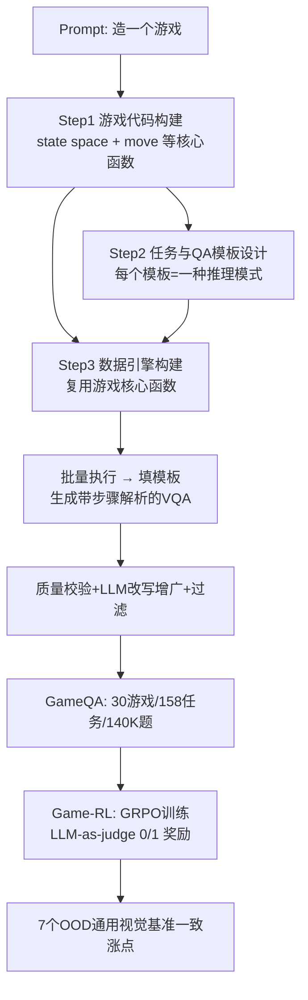

# Game-RL: Synthesizing Multimodal Verifiable Game Data to Boost VLMs' General Reasoning

**会议**: ICLR 2026  
**代码**: [https://github.com/tongjingqi/Game-RL](https://github.com/tongjingqi/Game-RL)  
**领域**: 多模态视觉语言模型 / 强化学习 / 推理数据合成  
**关键词**: VLM, GRPO, 可验证奖励, 游戏数据, Code2Logic, 泛化推理  

## 一句话总结
把电子游戏的代码反向"蒸馏"成带步骤解析的可验证 VQA 数据（GameQA，30 个游戏 / 158 个任务 / 14 万题），只用游戏数据做 GRPO 强化学习，就能让多个 VLM 在 7 个完全 out-of-domain 的通用视觉推理基准上一致涨点。

## 研究背景与动机
**领域现状**：视觉语言强化学习（vision-language RL）这两年靠可验证奖励（RLVR）涨了不少推理能力，但训练场景高度集中在**几何题和图表推理**这种窄领域——因为这些领域天然有标准答案、好判对错。其它能给 VLM 提供丰富视觉元素和可验证反馈的训练资源基本没人挖。

**现有痛点**：电子游戏其实是个被忽视的金矿——它有丰富的视觉场景和文字、机制规则简单到能被程序精确验证、环境完全可控（难度随便调）。但已有工作（ING-VP、BALROG、VideoGameBench、VCbench）都只把游戏当**评测 benchmark** 用，没人真正把游戏数据拿来**训练**。原因很直接：他们没把游戏过程转成可训练的 VQA 格式。

**核心矛盾**：游戏天然适合做 RLVR 训练数据，可手工标注游戏推理过程成本高、规模上不去，而且容易出错；想要"无限量、可控难度、答案可验证"三者兼得，靠人标根本做不到。

**本文目标**：构造一套能从游戏自动合成大规模可验证推理数据的方法，证明"只训游戏数据"也能提升 VLM 的**通用**（跨领域）推理能力。

**核心 idea（Code2Logic + Game-RL）**：游戏代码本身就编码了"状态→动作→新状态"的完整逻辑链。**只要把游戏代码映射成推理逻辑，就能让代码当数据引擎自动批量产出带正确步骤解析的题目**，再用 GRPO 做纯游戏数据的强化学习。

## 方法详解

### 整体框架
方法分两层：**Code2Logic** 负责把游戏代码合成成 GameQA 数据集，**Game-RL** 负责在 GameQA 上跑 GRPO 训练。Code2Logic 的核心洞察是"游戏代码 = 推理逻辑的可执行形式"，于是用三步把代码变成数据；Game-RL 则用一个 LLM-as-judge 给出 0/1 结果奖励驱动 GRPO。

### 关键设计

**1. Code2Logic 三步把游戏代码变可验证数据：从"会写代码"到"会出题+判对错"。** 第一步**游戏代码构建**，用 Claude 3.5 / GPT-4o 一句话提示就能生成像 Sokoban 这种简单游戏的完整代码——代码里定义了状态空间（墙/玩家/箱子/目标）和编码转移规则的核心函数（如 `move`），这些函数后面会被反复复用。第二步**任务与 QA 模板设计**，基于游戏的视觉元素和动作空间设计任务，比如 Sokoban 的"走若干步后玩家在哪"，把具体问答抽象成带占位符的问题模板和答案模板，**一个模板就浓缩了游戏里的一类推理模式**；任务被归为目标感知（Target Perception）、状态预测（State Prediction）、策略优化（Strategy Optimization）三型。第三步**数据引擎构建**，让 LLM 基于第一步的游戏代码写一个程序，由"环境初始化 / 提出任务实例 / 求解任务实例 / 构造 QA"四个模块组成——**关键是求解模块直接复用游戏代码里的 `move` 逻辑来模拟每一步**（含碰撞、推箱），所以产出的步骤解析天然正确。执行数据引擎就能无限批量填模板出题。

**2. 用游戏代码做"求解器"保证步骤解析正确，再 LLM 改写去模板味。** 因为答案是由确定性的游戏代码逐步模拟生成的，每道题不光给最终答案，还附带完整的中间推理轨迹（如"Move 1 - Left: (2,3)→(2,2) … Final position"），这正是 RL 想要的 process-style 监督信号。但纯模板生成的解析文字重复、套路化，于是用 LLM 做**释义增广（paraphrasing）**让表达多样，再过**数据过滤**保证增广后答案仍正确、长度合适、无过度重复。每一步还配人工校验：游戏代码靠手动跑程序查 bug、数据引擎初版人工测、复杂游戏特性会检索开源代码喂给 LLM。

**3. GameQA：30 游戏 × 4 认知类别 × 3 难度，且 in/out-of-domain 拆分。** 最终数据集 30 个游戏、158 个任务、约 14 万题，按解题所需核心能力分四类——3D 空间感知与理解、模式识别与匹配、多步推理、策略规划。题型全是多选（7-8 选项）或填空（数字/坐标），都可机器验证。难度有两个维度可调：QA Level（问题本身难度）和 Plot Level（图像复杂度，如棋盘大小，由代码参数控制）。关键是 30 个游戏被分成 **20 个 in-domain 用于训练 + 10 个 out-of-domain 完全留作测试泛化**，这样才能干净地证明"训游戏 A 能泛化到没见过的游戏 B 乃至通用基准"。

**4. Game-RL：GRPO + LLM-as-judge 的纯结果奖励。** 训练用 DeepSeek 标准形式的 GRPO，损失为
$$J_{GRPO}(\theta)=\mathbb{E}\Big[\frac{1}{G}\sum_{i=1}^{G}\frac{1}{|o_i|}\sum_{t=1}^{|o_i|}\big(\min[r_{i,t}\hat{A}_{i,t},\,\text{clip}(r_{i,t},1-\epsilon,1+\epsilon)\hat{A}_{i,t}]-\beta D_{KL}[\pi_\theta\|\pi_{ref}]\big)\Big]$$
其中 $r_{i,t}=\pi_\theta(o_{i,t}|q,o_{i,<t})/\pi_{\theta_{old}}(o_{i,t}|q,o_{i,<t})$。奖励**只看最终答案对不对**：用 Qwen2.5-32B-Instruct-AWQ 当裁判判断模型答案是否与 ground truth 语义等价，对则 reward=1 否则 0。之所以不用规则匹配，是因为同一答案有多种写法（如 `(2,3)` vs `x=2,y=3`），规则判错率高；人工抽查 300 例确认裁判 100% 准确。GRPO 超参：每题 rollout 12 个样本、训 1 epoch、学习率 2e-7、$\epsilon=0.2$、$\beta=0.04$。

## 实验关键数据

### 主实验表格（纯游戏数据训练 → 通用基准泛化）
在 5K GameQA 样本上用 GRPO 微调三个 VLM，在 7 个通用视觉基准上的平均分：

| 模型 | Avg. | MathVista | MathVerse | MMBench | MMMU | CharXiv | MathVision | MMMU-Pro |
|------|------|-----------|-----------|---------|------|---------|------------|----------|
| Qwen2.5-VL-7B | 50.00 | 66.62 | 45.10 | 84.05 | 49.78 | 37.92 | 30.17 | 36.32 |
| **+Game-RL** | **52.65 (+2.65)** | 68.48 | 48.60 | 85.00 | 51.96 | 42.08 | 32.48 | 39.99 |
| InternVL2.5-8B | 45.80 | 57.43 | 35.85 | 81.90 | 47.92 | 31.68 | 28.62 | 37.20 |
| **+Game-RL** | **48.40 (+2.60)** | 62.38 | 38.72 | 82.18 | 48.91 | 35.66 | 31.87 | 39.08 |
| InternVL3-8B | 54.15 | 68.72 | 49.76 | 85.98 | 56.85 | 38.92 | 35.24 | 43.59 |
| **+Game-RL** | **56.05 (+1.90)** | 73.24 | 51.40 | 86.36 | 57.82 | 40.75 | 38.05 | 45.10 |

三个模型在**全部 7 个**基准上都涨，证明学到的是可迁移的视觉理解与推理能力，而非记游戏。

### 消融实验表格（GameQA vs 通用推理数据集）
基于 Qwen2.5-VL-7B 同样 GRPO，对比各数据集（OOD 游戏 + 通用基准两侧平均）：

| 训练数据 | OOD Games Avg.(↑) | General Bench Avg.(↑) |
|----------|-------------------|------------------------|
| 原始 Qwen2.5-VL-7B | 27.09 | 49.94 |
| +MAVIS-8K | 27.61 (+0.52) | 51.53 (+1.59) |
| +Multimodal-Open-R1-8K | 28.33 (+1.24) | 51.86 (+1.92) |
| +MultiMath-8K | 28.38 (+1.29) | 52.81 (+2.87) |
| **+GameQA-5K** | **29.87 (+2.78)** | 52.31 (+2.37) |
| **+GameQA-5K & MultiMath-8K** | **30.93 (+3.84)** | **53.23 (+3.29)** |

只用 5K 游戏数据，效果与用 8K 几何/数学数据（对通用基准而言已属 in-domain）相当甚至更好；游戏数据和数学数据**混训还能叠加增益**。

### 关键发现
- **Takeaway 1**：纯游戏数据训练能泛化到未见游戏、交互式游戏环境（ING-VP）和 7 个通用视觉基准，说明学到的是可迁移能力。
- **Takeaway 2**：游戏数据带来的提升与几何/函数等通用推理数据集相当，游戏可作为高质量训练资源。
- **规模效应（双维度）**：把训练游戏的**数量（多样性）**从 4 个扩到 20 个、或把**数据量**扩到 20K，通用基准分数都呈一致上升趋势——两个维度的 scaling 都有效。
- **可验证性**：LLM-as-judge 在 300 个抽样上达到 100% 验证准确率，奖励信号干净可靠。

## 亮点与洞察
- **"代码即推理逻辑"的反向蒸馏**很巧：不是让模型玩游戏，而是把游戏代码当成可执行的求解器来批量生产带正确步骤的题，天然解决了"无限量 + 难度可控 + 答案可验证"三难。
- **OOD 泛化的实验设计干净**：训练只用 in-domain 游戏，通用基准全部是 out-of-domain，涨点不存在数据泄漏争议，结论说服力强。
- **填补了 RLVR 训练场景的空白**：把视觉 RL 从几何/图表的窄领域扩展到游戏这个富视觉、强可验证的新场景，给"用合成数据 scale RL"提供了一条新路。

## 局限与展望
- 论文里的游戏多为格点/棋盘类（Sokoban、数独、七巧板等），视觉风格相对程式化，离真实照片/复杂自然场景仍有差距，迁移到真实世界感知的边界还需验证。
- 涨点幅度虽一致但绝对值有限（+1.9~+2.65 Avg.），是否能随更大模型/更大数据持续放大尚需更长 scaling 曲线支撑。
- 依赖 LLM 生成游戏代码 + LLM 当裁判，复杂游戏代码的正确性仍需人工兜底，pipeline 自动化程度对"难游戏"会下降。
- 奖励只用最终答案 0/1，未利用已有的步骤解析做 process reward，未来可探索过程级奖励进一步榨取游戏数据的监督价值。

## 相关工作与启发
- **视觉语言 RLVR**：此前集中在几何（MAVIS、MultiMath、Geo170k）和图表，本文把场景扩展到游戏，是对"训练资源多样性"的直接补充。
- **游戏作为 VLM 评测**：ING-VP、BALROG、VideoGameBench、VCbench 都把游戏当 benchmark，本文是首个把游戏数据真正用于 RL **训练**并证明泛化的工作。
- **合成数据 + 可验证奖励**：与 DeepSeek-R1 系的 RLVR 思路一脉相承，启发是"凡是有可执行 ground-truth 生成器的领域（代码、游戏、模拟器），都可低成本造无限可验证训练数据来 scale RL"。

## 评分
- **新颖性**: ⭐⭐⭐⭐ — "把游戏代码反向蒸馏成可验证 VQA 训练数据"这个角度新颖且实用，首次将游戏从评测用途转为训练用途。
- **实验充分度**: ⭐⭐⭐⭐ — 3 个模型 × 7 个 OOD 基准 + 与 3 个通用数据集对比 + 数量/多样性双维度 scaling + 混训实验，相当扎实；略缺更大模型规模验证。
- **写作质量**: ⭐⭐⭐⭐ — 动机清晰、Code2Logic 三步配图解释到位、takeaway 提炼明确，易读。
- **价值**: ⭐⭐⭐⭐ — 提供了可复现的开源数据集+方法，为"用合成可验证数据 scale 视觉 RL"开辟了新资源方向，实用价值高。

<!-- RELATED:START -->

## 相关论文

- [\[ICLR 2026\] Play to Generalize: Learning to Reason Through Game Play](play_to_generalize_learning_to_reason_through_game_play.md)
- [\[ICLR 2026\] LLMs as Rules Oracles: Exploring Real-World Multimodal Reasoning in Tabletop Strategy Game Environments](llms_as_rules_oracles_exploring_real-world_multimodal_reasoning_in_tabletop_stra.md)
- [\[ICLR 2026\] MetaSpatial: Reinforcing 3D Spatial Reasoning in VLMs for the Metaverse](metaspatial_reinforcing_3d_spatial_reasoning_in_vlms_for_the_metaverse.md)
- [\[ICLR 2026\] VidGuard-R1: AI-Generated Video Detection and Explanation via Reasoning MLLMs and RL](vidguard-r1_ai-generated_video_detection_and_explanation_via_reasoning_mllms_and.md)
- [\[ICLR 2026\] FlowGen: Synthesizing Diverse Flowcharts to Enhance and Benchmark MLLM Reasoning](flowgen_synthesizing_diverse_flowcharts_to_enhance_and_benchmark_mllm_reasoning.md)

<!-- RELATED:END -->
