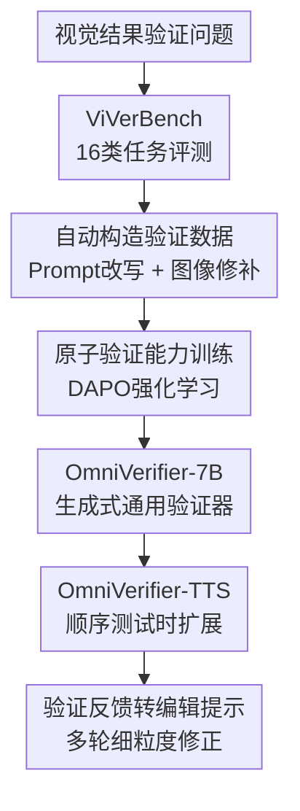

# Generative Universal Verifier as Multimodal Meta-Reasoner

**会议**: ICLR2026  
**OpenReview**: [https://openreview.net/forum?id=DM0Y0oL33T](https://openreview.net/forum?id=DM0Y0oL33T)  
**论文**: [Project Page](https://omniverifier.github.io/)  
**代码**: 有（补充材料中提供，项目页未在缓存中给出具体仓库链接）  
**领域**: 多模态VLM / VLM推理 / 视觉验证 / 测试时扩展  
**关键词**: 多模态元推理, 视觉结果验证, 生成式验证器, 顺序测试时扩展, 图像自修正

## 一句话总结

这篇论文把“检查视觉结果是否真的满足任务要求”提升为多模态推理系统的基础能力：作者构建 ViVerBench 评测现有 VLM 的视觉验证短板，训练 OmniVerifier-7B 作为生成式通用验证器，并用 OmniVerifier-TTS 在测试时把验证反馈转成多轮图像编辑，从而提升复杂文生图与推理式生成质量。

## 研究背景与动机

**领域现状**：多模态大模型正在从“看图回答问题”走向更复杂的交错式推理与统一多模态生成。新一代 VLM / UMM 不只读取图像，还会在思考过程中生成中间视觉状态、调用视觉工具，或者直接输出图像。这个趋势意味着模型的推理轨迹里开始出现大量“视觉结果”：一张文生图、一次编辑后的图、一个框选结果、一个游戏状态、一个机器人堆叠中间态，都可能成为下一步推理的依据。

**现有痛点**：主流测试时扩展仍然偏文本中心。模型可以反思一段文字答案是否自洽，却很难稳定判断一张图是否满足复杂 prompt、一个中间视觉状态是否违反规则、或者一张图里微小的属性绑定是否错误。对图像生成而言，常见 Best-of-N 只是在多个候选里挑一个，看起来像扩展了计算量，但它没有真正针对错误位置进行反思和修正；如果所有候选都错在同一个细节，平行采样很难跨过这个上限。

**核心矛盾**：多模态推理需要“生成”和“验证”闭环，但当前模型的视觉验证能力没有跟上生成能力。视觉结果高维、模糊、细节多，一处小错误可能隐藏在复杂场景里；同时很多错误不是简单物体存在与否，而是属性绑定、空间关系、物理规律、GUI 操作目标、代码与图表一致性等跨模态细粒度判断。没有可靠 verifier，模型就难以知道自己哪里错，更难把错误变成可执行的修正指令。

**本文目标**：作者把问题拆成三步：先问现有 MLLM 在视觉结果验证上到底差在哪里；再问能否训练一个具备跨任务泛化能力的生成式通用验证器；最后问这个 verifier 能不能作为多模态元推理器，反过来提升图像生成、编辑和更广义的交错式世界建模推理。

**切入角度**：论文的关键观察是，人类在检查图像时不会只做一次粗略匹配，而会分解 prompt、逐项核对对象、属性、关系和规则，并在发现错误后给出具体解释。若把这种“可解释的视觉核查”训练成模型能力，verifier 不仅能给 true/false 标签，还能指出错因，甚至把错因改写成编辑提示，成为生成模型的外部反思模块。

**核心 idea**：用生成式通用视觉验证器替代单纯候选筛选，让多模态系统在测试时形成“生成图像 → 检查错误 → 局部编辑 → 再检查”的顺序自修正闭环。

## 方法详解

### 整体框架

整篇论文不是只提出一个模型，而是围绕视觉结果验证构建了一条完整路线。第一步，作者提出 ViVerBench，用 16 类任务系统评估 VLM 是否能判断视觉结果与任务要求是否一致。第二步，作者通过两条自动数据构造流水线生成高质量 true/false 视觉验证数据，并用规则奖励的 RL 训练 Qwen2.5-VL-7B，得到 OmniVerifier-7B。第三步，作者把 OmniVerifier-7B 接到统一多模态生成模型上，形成 OmniVerifier-TTS：生成模型先出图，verifier 判断是否满足 prompt；如果不满足，verifier 生成解释和 edit prompt，再由生成模型执行局部编辑，循环直到验证通过或达到轮数上限。

从定位上看，OmniVerifier 更像一个 multimodal meta-reasoner，而不是普通 reward model。它的输出不是单个分数，而是“判断 + 解释 + 可选编辑建议”。这使它既能做 benchmark 上的视觉结果核查，也能在 TTS 中把错误解释转成下一轮图像编辑条件，还能扩展到 maze / robotics 这类世界状态推理场景。

### 关键设计

**1. ViVerBench：把视觉验证从粗粒度打分拆成 16 类可诊断能力**

作者首先构建 ViVerBench，因为如果没有足够细的评测，所谓“视觉 verifier 强不强”很容易被几个普通图文匹配样例掩盖。ViVerBench 包含 3,594 个样本，覆盖 6 大类 16 个子任务：Concept Existence 检查对象、属性和抽象图案；Object Relationship 检查空间与非空间关系；World Dynamics 检查静态和动态物理；Image Annotation 检查框、点和计数；State Value Evaluation 检查 Maze、FrozenLake、Robotics、GUI 等任务状态；STEM 检查图表和 LaTeX 渲染是否与代码一致。

这个 benchmark 的要点是“答案要无争议，同时足够难”。论文用人工标注、程序生成和开源数据增强混合构造样本，再让专家复核 true 样本是否严格正确、false 样本解释是否合理。评测时，模型要输出 true/false 和解释；规则指标只看标签准确率，模型指标还要求 false 样本的解释与标准解释一致。形式上，规则准确率是 $Acc_{rule}=\frac{1}{N}\sum_i \mathbf{1}(\hat{y}_i=y_i)$；更严格的模型评测在 $y_i=false$ 时还要求 judge 判断解释 $\hat{e}_i$ 与标准解释 $e_i$ 一致。这样设计能防止模型靠猜 true/false 获得虚高分。

ViVerBench 揭示了三个具体短板。第一，现有 VLM 在复杂图文细粒度对齐上不稳定，尤其是小物体、遮挡属性、多个对象的属性绑定。第二，模型语言部分知道物理规律，但这些知识没有稳定落到视觉验证上，形成 knowledge-modality gap。第三，Maze、FrozenLake、Robotics 这类需要反思状态是否合法的任务上，模型远低于人类，说明视觉 critic 还不成熟。

**2. 两条自动数据流水线：用“反向构造”获得可扩展的 true/false 视觉验证样本**

训练 verifier 的难点不只是数据量，而是错误必须明确、可解释、不能靠主观挑剔。作者从复杂图像出发反向构造样本：先确保有一张内容丰富的图，再制造与它严格匹配或只错一个关键细节的 prompt / image。这样比直接从复杂 prompt 生成图像更可控，因为当前生成模型常常天然不完全对齐，若直接拿生成结果当负例，很容易混入模糊或争议错误。

第一条流水线是 Image-Fixed, Prompt-Modified。给定复杂图像后，GPT-5 先生成只描述清晰可见元素的严格 caption，作为 true prompt；然后 GPT-5 对 caption 做一个细微但关键的修改，比如改数量、颜色、位置、字母或动作，得到 false prompt 和错误解释。图像不变，prompt 变了，因此模型必须从图中逐项核查修改后的细节是否成立。

第二条流水线是 Prompt-Fixed, Image-Inpainting。作者先用 SAM 2.1 分割图中对象，得到 mask 和 bbox，再按 mask 面积动态选择目标区域，用 FLUX.1-dev 做 inpainting 生成 false image。与此同时，GPT-5 生成带目标框约束的严格 prompt，明确描述被选对象的属性和位置。这样 prompt 不变，图像局部变错，训练样本能集中考察对象属性、空间关系和局部编辑错误。两条流水线产出的数据再由 Seed1.5-VL 清洗，只保留 Best-of-10 准确率至少 0.6 的样本，以过滤太简单或太混乱的样例。

**3. 原子能力训练：显式对齐和关系验证可以互相泛化，复杂综合推理需要领域数据**

论文没有直接把 16 个任务都混在一起训练，而是先做 ablation 来理解视觉验证的底层能力。作者选取 object、attribute、spatial、maze 四类数据分别训练 verifier，观察它们在 ViVerBench 各任务上的迁移。训练方式是在 Qwen2.5-VL-7B 上用 DAPO 做 RL，系统提示鼓励模型先推理再回答，奖励由 true/false 规则奖励和格式奖励组成，比例为 9:1；四个模型都在 64 张 A100-80G 上训练 100 steps。

实验发现，object / attribute 数据不仅提升对象和属性检查，也能迁移到图表、LaTeX、bbox、pointing、GUI 等任务；spatial 数据还进一步提升非空间关系、计数和一些关系型任务。这说明视觉验证中存在两层可共享能力：显式对齐（Explicit Alignment）负责把文本元素和图像元素逐项对上；关系验证（Relational Verification）负责判断对象之间的空间、交互或轻量逻辑关系。它们之间可以通过 RL 互相促进。

但 maze 数据几乎不迁移到其他任务。原因是 maze 图像极简、规则离散，和自然图像的纹理、语义、空间关系分布差距太大。作者因此把第三类能力称为综合推理（Integrative Reasoning）：它需要把任务规则、视觉状态和高阶推理策略结合起来，跨领域共享较弱。这个结论给出了训练 recipe：通用 verifier 可以用覆盖显式对齐和关系验证的原子数据打底；若要解决 Maze、Robotics 这类世界建模任务，还需要任务特定数据。

**4. OmniVerifier-TTS：把 verifier 的解释变成顺序图像编辑，而不是平行采样挑图**

OmniVerifier-TTS 的核心是顺序测试时扩展。给定复杂 prompt，统一多模态模型先生成一张图；OmniVerifier 判断这张图是否满足 prompt，并给出 false 的原因。如果判断为 false，verifier 会把解释改写为 edit prompt，例如“把背景城市改成北京，并加入鸟巢”或“把标牌上的 2018 改成 2008”。随后同一个 UMM 基于当前图像和 edit prompt 做细粒度编辑，生成下一轮图像。这个循环持续到 verifier 判断 true，或达到最大轮数。

这与 Best-of-N 的差异很关键。平行 TTS 是一次生成 $N$ 张图，再让 verifier 选最好的一张；它提高了采样覆盖，但没有利用错误解释，也不会对同一张图逐步修正。顺序 TTS 则把 verifier 当作“misalignment-finder”，每轮只修一个或少数错误，让生成过程沿着具体反馈前进。对于复杂组合 prompt，很多错误只是局部错位或细节不对，重新生成整张图既浪费又可能引入新错误；局部编辑更符合问题结构。

### 一个完整示例

假设 prompt 是“2008 年夏季奥运会举办城市”。生成模型第一轮可能画出城市背景和奥运标牌，但背景不是北京，牌子上还写成“Beijing 2018”。OmniVerifier 会先判断 false，并解释图像与 prompt 的不一致：城市线索不符合 2008 年北京奥运，标牌年份也错误。它随后生成第一个 edit prompt，要求把背景城市改成北京并加入鸟巢等典型建筑。

UMM 根据 edit prompt 编辑后，第二轮图像可能背景已经像北京，但牌子仍写着 2018。OmniVerifier 再次输出 false，并把错误定位到文字年份，于是生成第二个 edit prompt：“把图片标牌上的 Beijing 2018 改成 Beijing 2008”。经过这一轮编辑后，如果 verifier 判断城市与年份都满足条件，就停止循环。这个例子体现了论文所谓 sequential TTS 的本质：不是一次性让生成模型“想清楚所有细节”，而是把复杂 prompt 分解成可检查、可修正的视觉约束。

### 损失函数 / 训练策略

OmniVerifier-7B 的训练基座是 Qwen2.5-VL-7B，训练数据是两条自动流水线得到并清洗后的 28k 高质量视觉验证样本，主要覆盖显式对齐和关系验证两类原子能力。训练采用 DAPO 强化学习，而不是监督模型写标准解释；奖励由两部分组成：规则奖励判断 true/false 是否正确，格式奖励约束模型按要求输出，二者比例为 9:1。

这个策略的一个重要发现是，优化二元判断并不会破坏模型的解释生成能力。附录展示的 LongCoT 样例中，OmniVerifier 会自然把复杂 prompt 拆成对象、属性、动作、背景等子项逐项核查，最后给出 JSON 形式的 answer 和 explanation。也就是说，模型没有被显式训练复刻人工解释，却在规则奖励下保留并强化了可读的核查链条。论文把这一点总结为：只用最小化的 binary outcome supervision，也能提升验证能力并保持语言解释能力。

## 实验关键数据

### 主实验

ViVerBench 的主结果显示，现有强模型离人类视觉验证仍有明显差距。Gemini-2.5-Pro 是闭源模型中整体最高，规则准确率为 0.745，但人类整体为 0.932；Qwen2.5-VL-7B 基座只有 0.570。OmniVerifier-7B 经过 28k 原子验证数据 RL 后达到 0.653，较基座提升 0.083，并超过 GPT-4o 的 0.645，接近 Qwen2.5-VL-72B 的 0.661。

| 模型 | ViVerBench Overall | 代表性特点 | 与本文关系 |
|------|-------------------|------------|------------|
| Qwen2.5-VL-7B | 0.570 | 7B 基座，视觉验证能力较弱 | OmniVerifier 的训练起点 |
| GPT-4o | 0.645 | 闭源强 VLM，但整体仍低于本文 verifier | 被 OmniVerifier-7B 超过 |
| Qwen2.5-VL-72B | 0.661 | 大尺寸开源 VLM | OmniVerifier-7B 接近其水平 |
| Gemini-2.5-Pro | 0.745 | 表中最佳模型 | 仍显著低于人类 |
| Human | 0.932 | 专家人类评测 | 说明任务仍有巨大空间 |
| OmniVerifier-7B | 0.653 | 7B 生成式通用 verifier | 较基座 +0.083，超过 GPT-4o |

在生成应用上，OmniVerifier-TTS 同时提升 reasoning-based generation 和 compositional generation。以 Qwen-Image 为 backbone，T2I-ReasonBench overall 从 55.5 提升到 59.2，GenEval++ overall 从 0.675 提升到 0.718；以 GPT-Image-1 为 backbone，T2I-ReasonBench 从 76.8 提升到 79.3，GenEval++ 从 0.689 提升到 0.721。相比用未训练的 Qwen2.5-VL-7B 做 verifier，OmniVerifier-TTS 也更强，说明提升来自 verifier 的视觉核查能力，而不只是多跑几轮编辑。

| Backbone | Verifier / 方法 | T2I-ReasonBench Overall | GenEval++ Overall | 结论 |
|----------|----------------|-------------------------|-------------------|------|
| Qwen-Image | 无 TTS | 55.5 | 0.675 | 原始生成基线 |
| Qwen-Image | QwenVL-TTS | 57.4 | 0.682 | 普通 VLM 也能带来少量修正 |
| Qwen-Image | OmniVerifier-TTS | 59.2 | 0.718 | verifier 更准，提升更明显 |
| GPT-Image-1 | 无 TTS | 76.8 | 0.689 | 强闭源生成基线 |
| GPT-Image-1 | QwenVL-TTS | 77.8 | 0.693 | 提升有限 |
| GPT-Image-1 | OmniVerifier-TTS | 79.3 | 0.721 | 在强 backbone 上仍能抬高上限 |

### 消融实验

论文的消融主要围绕两类问题：原子能力数据如何迁移，以及顺序 TTS 是否优于平行 TTS。原子能力实验表明，只用 object 或 attribute 数据训练，就能迁移到多种显式对齐任务；spatial 数据能进一步迁移到关系验证；maze 数据由于分布太特殊，几乎不能泛化。这个结果支撑了“显式对齐 + 关系验证可共享，综合推理需任务数据”的结论。

| 配置 | 关键指标 / 现象 | 说明 |
|------|----------------|------|
| Object 数据训练 | Object、Attribute、Charts、LaTeX 等多项提升 | 对象存在核查能迁移到其他显式对齐任务 |
| Attribute 数据训练 | 趋势与 Object 类似 | 属性绑定和对象核查共享底层视觉匹配能力 |
| Spatial 数据训练 | Spatial、Non-Spatial、BBox、Counting 等关系任务收益更大 | 关系验证比显式对齐更进一步，但仍可跨任务迁移 |
| Maze 数据训练 | 对自然图像和多数任务几乎不迁移 | 综合推理领域差距大，需要任务特定数据 |
| OmniVerifier-7B 完整训练 | ViVerBench 0.653 | 28k 原子数据 + RL 得到通用 verifier |

顺序 TTS 和平行 TTS 的比较更直接。对于 Qwen-Image，平行 OmniVerifier-TTS 在 T2I-ReasonBench 上为 58.1，顺序为 59.2；GenEval++ 平行为 0.693，顺序为 0.718。对于 GPT-Image-1，平行在 T2I-ReasonBench 上为 78.1，顺序为 79.3；GenEval++ 平行为 0.700，顺序为 0.721。顺序 TTS 不仅分数更高，平均轮数也更少：Qwen-Image + OmniVerifier 在 T2I-ReasonBench 平均 3.86 轮，在 GenEval++ 平均 1.86 轮；GPT-Image-1 + OmniVerifier 分别只需 1.59 和 1.27 轮，而平行 TTS 固定需要 10 张候选。

| Backbone | TTS 策略 | T2I-ReasonBench | GenEval++ | 平均轮数特点 |
|----------|----------|-----------------|-----------|--------------|
| Qwen-Image | Parallel | 58.1 | 0.693 | 固定 10 张候选 |
| Qwen-Image | Sequential | 59.2 | 0.718 | T2I 平均 3.86 轮，GenEval++ 平均 1.86 轮 |
| GPT-Image-1 | Parallel | 78.1 | 0.700 | 固定 10 张候选 |
| GPT-Image-1 | Sequential | 79.3 | 0.721 | T2I 平均 1.59 轮，GenEval++ 平均 1.27 轮 |

### 关键发现

- OmniVerifier-7B 的收益主要集中在显式对齐和关系验证任务上，例如 Object、Attribute、Spatial、Bounding Box 等；这与训练数据覆盖的原子能力一致，也说明它不是凭空学会所有推理任务。
- 视觉结果验证能外溢到文本结果验证和通用感知推理。附录中，OmniVerifier 在 VLRewardBench overall accuracy 从 Qwen2.5-VL-7B 的 46.72 提升到 62.80，尤其 hallucination 从 45.79 提升到 70.09，说明 critic 训练可以增强跨模态一致性判断。
- 顺序 TTS 的优势来自“解释可用”。平行 TTS 只使用 verifier 的排序能力，顺序 TTS 使用 verifier 的诊断和编辑提示生成能力，因此能用更少候选逐步逼近 prompt。
- 强 verifier 仍然有上限效应。附录中用 Gemini-2.5-Pro 做 verifier 时，Qwen-Image 的 T2I-ReasonBench 可到 62.7，GenEval++ 到 0.736；GPT-Image-1 可到 81.6 和 0.746，说明更强的视觉判断器还能继续抬高生成模型上限。

## 亮点与洞察

- 这篇论文最好的地方是把“视觉验证”从附属评估工具变成多模态推理系统中的一等公民。过去 reward model / critic 更多服务于训练或候选排序，而这里的 verifier 能生成解释和编辑提示，直接参与测试时推理。
- ViVerBench 的任务设计很有启发性。它没有停留在图文匹配，而是把视觉结果验证扩展到物理、GUI、图表、LaTeX、游戏状态、机器人中间状态等场景，逼近未来多模态 agent 真正需要检查的“中间世界状态”。
- 原子能力分析比单纯刷榜更有价值。显式对齐、关系验证、综合推理这三个层次解释了为什么某些数据能迁移、某些数据不迁移，也给后续训练 verifier 提供了数据配方：先用可泛化的底层视觉核查能力打底，再为高阶任务补领域数据。
- OmniVerifier-TTS 的设计复用了统一多模态模型的生成和编辑能力，没有要求重新训练生成模型。这个插件式思路很实用：只要有可编辑的 UMM 和一个能指出错误的 verifier，就能在测试时提升复杂 prompt 的完成度。
- 对未来 agent 系统来说，本文提示了一个重要方向：多模态 agent 不应只规划文本动作，还需要不断验证视觉世界状态是否满足预期。一个强 verifier 可以成为“状态监控器”，在导航、GUI 操作、机器人控制、图像生成中发现偏差并触发修正。

## 局限与展望

- OmniVerifier-7B 还不是真正全能。它在 ViVerBench overall 只有 0.653，虽然超过 7B 基座和 GPT-4o，但距离 Gemini-2.5-Pro 和人类仍有明显差距，尤其综合推理类任务仍然需要任务特定数据。
- 训练数据主要覆盖显式对齐和关系验证，因此在 Maze、Robotics、复杂物理动态等任务上的泛化有限。论文已经承认这类 integrative reasoning 存在巨大领域差距，未来需要更多面向任务规则和世界模型的验证数据。
- OmniVerifier-TTS 依赖 backbone 的编辑能力。如果生成模型不能稳定执行局部编辑，verifier 即使指出了正确错误，也可能在多轮编辑中积累风格漂移或引入新错误。附录中 GPT-Image-1 多轮编辑逐渐发黄就是一个例子。
- 顺序自修正可能带来额外延迟和错误传播。虽然平均轮数低于 10-way 平行采样，但每轮都需要 verifier 判断和 UMM 编辑；在实时交互或高分辨率生成场景下，如何控制成本仍需工程优化。
- 论文没有充分讨论 verifier 自身的安全风险。一个强视觉 verifier 可以帮助发现错误，也可能被用于优化更逼真的误导性图像。后续需要把安全约束纳入验证器训练和 TTS 使用边界。

## 相关工作与启发

- **vs LLaVA-Critic / VL-RewardBench 方向**: 这类工作主要关注多模态模型输出评价或偏好判断，本文更进一步强调 visual outcome verification，即对生成图像、中间视觉状态和视觉操作结果做 true/false 核查，并把解释用于后续修正。
- **vs Best-of-N / 平行测试时扩展**: Best-of-N 通过采样多个候选提高命中概率，但没有形成状态反馈。OmniVerifier-TTS 把 verifier 的解释转成 edit prompt，使用顺序 refinement，因此更适合修复复杂 prompt 中的局部细节错误。
- **vs 文本 Self-Refine / Reflexion**: 文本自修正通常检查的是语言答案的一致性或逻辑错误；本文把 self-refinement 搬到视觉结果上，难点在于模型必须看懂图像细节、判断跨模态约束，再把错误描述成可编辑指令。
- **vs T2I-R1 / 图像生成强化学习**: T2I-R1 类方法更偏训练时强化生成模型的推理或偏好；OmniVerifier-TTS 是测试时插件式方法，不直接更新生成模型，而是在推理时用 verifier 驱动多轮编辑。
- **对后续工作的启发**: 可以把 verifier 从文生图扩展到更一般的多模态 agent：每执行一步 GUI、导航或机器人动作后，让 verifier 判断当前视觉状态是否接近目标；若不接近，就生成纠错动作或回滚建议。

## 评分

- 新颖性: ⭐⭐⭐⭐⭐ 把生成式视觉 verifier 定义为多模态元推理器，并连接 benchmark、训练数据、RL 和顺序 TTS，问题定位很前沿。
- 实验充分度: ⭐⭐⭐⭐ 覆盖 ViVerBench、T2I-ReasonBench、GenEval++、VLRewardBench 和多个附录分析，但对真实交互式 agent 场景的系统评测还偏初步。
- 写作质量: ⭐⭐⭐⭐ 主线清楚，发现式总结有帮助；但部分图表和任务细节很多，读者需要在主文和附录之间来回对照。
- 价值: ⭐⭐⭐⭐⭐ 对多模态生成、VLM critic、测试时扩展和未来世界模型式 agent 都有启发，尤其强调“能生成还要能验证”的闭环能力。

<!-- RELATED:START -->

## 相关论文

- [\[ICLR 2026\] JUDO: A Juxtaposed Domain-Oriented Multimodal Reasoner for Industrial Anomaly QA](judo_a_juxtaposed_domain-oriented_multimodal_reasoner_for_industrial_anomaly_qa.md)
- [\[CVPR 2026\] GGBench: A Geometric Generative Reasoning Benchmark for Unified Multimodal Models](../../CVPR2026/vlm_reasoning/ggbench_a_geometric_generative_reasoning_benchmark_for_unified_multimodal_models.md)
- [\[CVPR 2026\] IPR-1: Interactive Physical Reasoner](../../CVPR2026/vlm_reasoning/ipr-1_interactive_physical_reasoner.md)
- [\[CVPR 2026\] ARM-Thinker: Reinforcing Multimodal Generative Reward Models with Agentic Tool Use and Visual Reasoning](../../CVPR2026/vlm_reasoning/arm-thinker_reinforcing_multimodal_generative_reward_models_with_agentic_tool_us.md)
- [\[NeurIPS 2025\] Retrv-R1: A Reasoning-Driven MLLM Framework for Universal and Efficient Multimodal Retrieval](../../NeurIPS2025/vlm_reasoning/retrv-r1_a_reasoning-driven_mllm_framework_for_universal_and_efficient_multimoda.md)

<!-- RELATED:END -->
