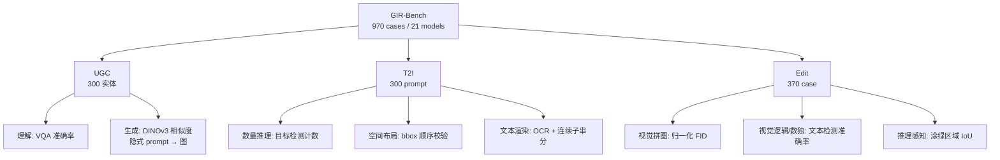

# GIR-Bench: Versatile Benchmark for Generating Images with Reasoning

**会议**: ICLR 2026  
**OpenReview**: [https://openreview.net/forum?id=4c1gAsVd9C](https://openreview.net/forum?id=4c1gAsVd9C)  
**代码**: [https://github.com/HKUST-LongGroup/GIR-Bench](https://github.com/HKUST-LongGroup/GIR-Bench)  
**领域**: 多模态推理 / 图像生成评测 / 统一多模态模型  
**关键词**: 推理驱动图像生成, 统一多模态模型, 理解-生成一致性, 可解释评测, benchmark  

## 一句话总结
GIR-Bench 用三个互补子集（理解-生成一致性、推理式文生图、推理式编辑）和一套**任务专属、可程序化验证的评测管线**，系统量化统一多模态模型「会推理却画不出来」的理解-生成鸿沟，绕开了 MLLM-as-a-Judge 的偏置。

## 研究背景与动机
- **领域现状**：统一多模态模型（如 GPT-Image-1、Gemini-2.5-Flash-Image、BAGEL）把 MLLM 的推理能力同时接到图像理解和生成上，号称能用自然语言完成复杂视觉任务。直觉上「理解变强 → 生成也该变强」。
- **现有痛点**：早期生成 benchmark（GenEval、T2I-CompBench 等）只考查物体属性与组合，停留在「文字→画面」的浅映射；近期想引入推理的工作又有两个硬伤——**评测维度**上无法量化「推理能力」与「生成结果」之间是否对齐，**评测协议**上重度依赖 MLLM-as-a-Judge，把评测分数与裁判模型自身的偏置/缺陷耦合在一起。
- **核心矛盾**：一个模型可以在理解侧正确认出地标（如鱼尾狮 Merlion），却在生成侧根据隐式描述画不出来；既有 benchmark 既测不出这种**理解-生成错位**，也给不出可复现、无争议的分数。
- **本文目标**：构建一个推理为中心、可解释、可程序化验证的 benchmark，系统刻画统一模型在推理驱动的图像生成与编辑上的能力边界，并把「理解 vs 生成」的内部鸿沟显式量化出来。
- **核心 idea**：**三视角拆解 + 任务专属可验证管线**——把模糊的「推理能力」拆成有确定性 ground truth 的子任务（数独、拼图、数量、空间、文本渲染），每个子任务配一条用检测/OCR/IoU/FID 等程序化指标，而非让大模型当裁判。

## 方法详解

### 整体框架
GIR-Bench 不训练新模型，而是设计一个三段式评测协议。它从三个互补视角拷问统一模型：**UGC** 比对同一实体在「认得出」与「画得出」上的差距；**T2I** 考查需要逻辑约束/隐式知识的推理式文生图；**Edit** 考查需要全局规划+局部修改的推理式编辑。三个子集共 970 个案例，每个案例都带可程序化校验的 ground truth，最终用 21 个代表性模型把「统一 vs 纯生成」「理解 vs 生成」两条鸿沟量化出来。

### 关键设计

**1. UGC 子集：用「同一实体两条路」直接撕开理解-生成鸿沟。** 作者收集 300 个动物学/植物学/地理学真实实体，用 GPT-4o 为每个实体生成只描述特征、不点名的**隐式 prompt**（再人工校验确保唯一对应），同时为每个实体配一组高质量参考图。这样每个实体就有了两条评测路径：生成侧让模型读隐式 prompt 画图，用生成图与参考图集的平均 DINOv3 特征相似度打分；理解侧用参考图构造 VQA 让模型认实体。关键巧思是把「category input（直接给类名）」与「prompt input（隐式描述）」做对照实验——若两者差距大，说明瓶颈不在「画不画得出这个物体」，而在「能不能把推理出的约束传进生成过程」。结果验证了这一点：所有模型 prompt input 分数显著低于 category input。

**2. T2I 子集：只挑有确定性答案的任务，杜绝主观裁判。** 子集围绕三条原则设计——客观性优先（选数独/算术这类有唯一解的任务）、ground truth 可程序化生成或严格校验、聚焦隐式推理与规划（排除「关键词→图」的浅任务）。具体三个维度：**数量推理**给出鸡兔同笼式约束（如「鸭和狗共 4 只、共 10 条腿」→ 3 鸭 1 狗），用目标检测抽类别和数量，**必须全部数量都对**才算正确（部分对说明推理链断裂）；**空间布局**用检测出的 bbox 坐标校验「动物在左、车辆在右」等顺序约束；**文本渲染**针对隐式描述（如「1988 年 Nike 三词口号」→ "Just do it"）容易生成多余文字的问题，提出**词级连续子串分** $s_{wc}(g,p) = \frac{|W_{\text{match}}(g,p)|}{|W(g)|}$，其中 $W(g)$ 是 ground truth 词集，$W_{\text{match}}$ 统计被预测文本连续字符跨度完整覆盖的 GT 词数——只奖励命中、不因额外内容受罚。

**3. Edit 子集：每个案例都配 GT 图，把编辑能力也变成可量化。** 不同于以往编辑评测只有输入图，这里每个案例都带「输入图 + ground-truth 图」以降低评测偏置。三个维度各对应一条管线：**视觉拼图**把高分辨率近方形图切格随机打乱（至少半数格子换位），让模型还原原图，用生成图与 GT 图的 FID 衡量并归一化到 $[0,1]$（越大越好）；**视觉逻辑/数独**用约束传播算法生成唯一解、用演绎式删数保证解唯一，渲染成图后用文本检测抽数字与位置算准确率；**推理感知**取 LISA 数据集图，让模型把隐式描述指向的目标区域涂成纯不透明绿色（作为分割代理），再把输出转成二值 mask 与 GT mask 算 IoU。三条管线共同把「编辑」从主观好坏变成像素级可验证的数字。

**4. 任务专属管线替代 MLLM-as-a-Judge。** 整套评测落地靠两个外部工具：用 InternVL3.5-38B 的 grounding 能力做目标检测（抽类别和 bbox），用 PPOCR v5 做文本检测识别（只保留置信度 >0.5 的片段）。这条「检测/OCR + 确定性规则」的路线让每个分数都可复现、可解释、与裁判模型偏置解耦——这正是 GIR-Bench 区别于既有推理 benchmark 的核心方法论。

## 实验关键数据

### 主实验表格

UGC 子集（理解 vs 生成 Overall，节选）：

| 类型 | 模型 | 生成(Overall) | 理解(Overall) |
|------|------|------|------|
| 纯生成 | SD-3.5-Large | 0.288 | - |
| 纯生成 | Qwen-Image | 0.429 | - |
| 统一 | BAGEL-7B | 0.295 | 0.937 |
| 统一 | BAGEL-7B w/ CoT | 0.341 | 0.968 |
| 统一(闭源) | Gemini-2.5-Flash-Image | 0.593 | - |
| 统一(闭源) | GPT-Image-1 | **0.689** | - |
| 理解模型 | GPT-5 | - | 0.994 |

理解侧普遍 >0.87、生成侧最高才 0.689——同一批知识「认得出」远好于「画得出」。

T2I 与 Edit 子集（Overall，节选）：

| 类型 | 模型 | T2I Overall | Edit Overall |
|------|------|------|------|
| 纯生成 | FLUX.1-schnell | 0.159 | - |
| 编辑 | FLUX.1-Kontext-dev | - | 0.105 |
| 统一 | BAGEL-7B | 0.169 | 0.098 |
| 统一 | BAGEL-7B w/ CoT | 0.276 | 0.140 |
| 统一(闭源) | Gemini-2.5-Flash-Image | 0.399 | 0.343 |
| 统一(闭源) | GPT-Image-1 | **0.622** | **0.351** |

### 消融实验表格

CoT 与输入形式的对照（T2I 三维度，BAGEL）：

| 设置 | 数量推理 | 空间布局 | 文本渲染 |
|------|------|------|------|
| BAGEL-7B | 0.056 | 0.287 | 0.163 |
| BAGEL-7B w/ CoT | **0.249** | **0.460** | 0.120 |

CoT 在数量(0.057→0.249)和空间(0.287→0.460)上大幅提升，但文本渲染反而下降(0.163→0.120)。UGC 中所有模型从 category input 切到 prompt input 分数普遍明显下滑。

### 关键发现
- **统一 > 纯生成**：在推理驱动任务上，理解+生成联合训练确实带来增益，但开源统一模型相对强生成模型优势并不明显。
- **理解-生成鸿沟持续存在**：理解准确率普遍 >0.87，生成却最高只 0.689；瓶颈不在世界知识或基础推理，而在「把推理出的约束传进生成过程」。
- **CoT 有效但不万能**：显式 CoT 能把算术/空间约束注入生成，却在文本渲染上无效（0.163→0.120），说明当前推理 trace 尚未真正 ground 到生成过程。
- **编辑任务全员吃瘪**：Edit 子集各类模型差距收窄、整体都弱，连 GPT-Image-1/Gemini 也常失败，暴露细粒度局部控制与像素级信息保持的短板。

## 亮点与洞察
- **方法论贡献最值钱**：用「确定性任务 + 程序化校验」系统性替代 MLLM-as-a-Judge，给推理式生成评测立了一个可复现、可解释的范式标杆。
- **「同一实体两条路」的对照设计**非常干净地把「能力缺失」与「能力迁移失败」区分开，直接定位到理解→生成的传递断点。
- **词级连续子串分**是个小而实用的指标创新，专门解决隐式 prompt 下「目标文字对了但夹带私货」被传统 OCR 指标误罚的问题。
- 21 个模型的横评 + 三视角拆解，给统一多模态模型社区提供了一张清晰的「短板地图」。

## 局限与展望
- **覆盖范围有限**：为追求确定性 ground truth，刻意排除了因果推理、开放常识等更广义的推理场景，benchmark 的「推理」偏向可程序验证的逻辑/计数/空间类。
- **依赖外部检测器**：评测分数依赖 InternVL3.5-38B grounding 与 PPOCR v5 的检测质量，检测器自身误差会传导进结果（虽比 MLLM-as-a-Judge 偏置小，但未完全消除）。
- **代理任务的近似性**：推理感知用「涂绿+IoU」代理分割、文本渲染用连续子串近似语义命中，都是工程折中而非完美度量。
- **规模适中**：970 个案例足以暴露问题，但相对训练分布仍偏小，未来可扩到更大规模与更多推理类型。

## 相关工作与启发
- **对比早期生成 benchmark**（GenEval、T2I-CompBench、DPG-Bench）：它们聚焦属性与组合的浅映射，GIR-Bench 把焦点推进到需要多步推理与隐式知识的生成。
- **对比近期推理式生成评测**：多数仍靠 MLLM-as-a-Judge，GIR-Bench 用任务专属可验证管线把评测从「裁判主观」拉回「程序客观」。
- **启发**：① 评测设计上，「先把模糊能力拆成有确定性答案的子任务」是降低偏置的通用思路；② 模型研究上，理解-生成鸿沟说明下一步重点应是把推理结果**显式 grounding** 到生成过程（而非单纯堆理解能力）；③ CoT 在文本渲染上失效提示：推理 trace 与生成 token 之间还缺一座有效的桥。

## 评分
- **新颖性**: ⭐⭐⭐⭐ — 三视角拆解 + 任务专属可验证管线的评测范式有清晰创新，词级连续子串分等小指标也实用；benchmark 类工作天花板有限但定位准。
- **实验充分度**: ⭐⭐⭐⭐⭐ — 21 个代表性模型横评，三子集九维度全覆盖，CoT/输入形式对照充分，结论有数据支撑。
- **写作质量**: ⭐⭐⭐⭐ — 动机-设计-结论逻辑链清晰，三原则与各任务管线交代到位，图例丰富。
- **价值**: ⭐⭐⭐⭐ — 给统一多模态模型社区提供了量化理解-生成鸿沟的标准工具与短板地图，方法论可被后续生成评测复用。

<!-- RELATED:START -->

## 相关论文

- [\[ICLR 2026\] IV-Bench: A Benchmark for Image-Grounded Video Perception and Reasoning in Multimodal LLMs](iv-bench_a_benchmark_for_image-grounded_video_perception_and_reasoning_in_multim.md)
- [\[ICLR 2026\] We-Math 2.0: A Versatile MathBook System for Incentivizing Visual Mathematical Reasoning](we-math_20_a_versatile_mathbook_system_for_incentivizing_visual_mathematical_rea.md)
- [\[ICLR 2026\] Medical Thinking with Multiple Images](medical_thinking_with_multiple_images.md)
- [\[ICLR 2026\] Thyme: Think Beyond Images](thyme_think_beyond_images.md)
- [\[ICLR 2026\] GTR-Bench: Evaluating Geo-Temporal Reasoning in Vision-Language Models](gtr-bench_evaluating_geo-temporal_reasoning_in_vision-language_mod.md)

<!-- RELATED:END -->
