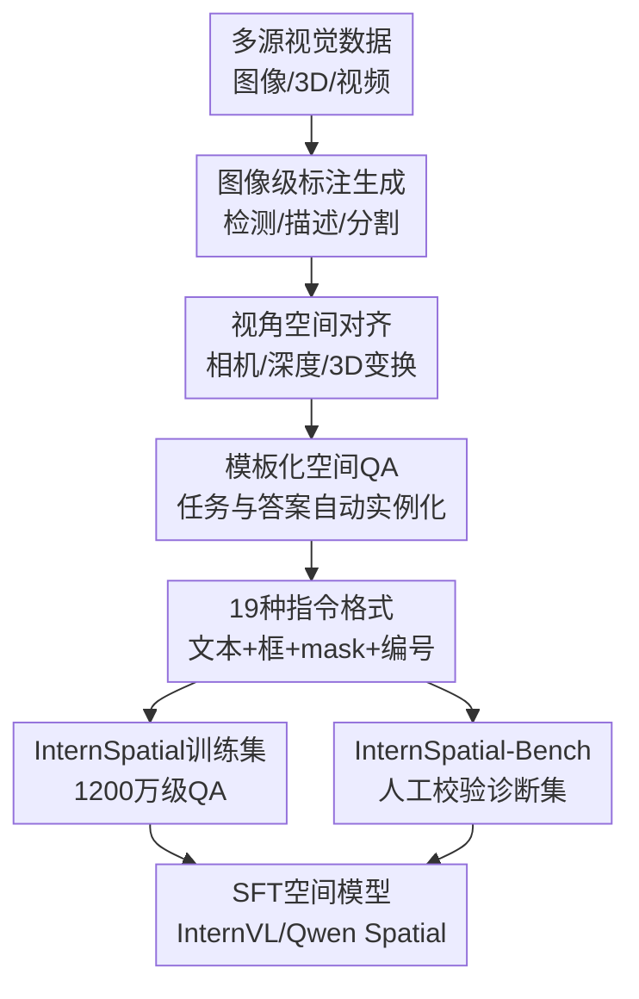

# InternSpatial: A Comprehensive Dataset for Spatial Reasoning in Vision-Language Models

**会议**: ICLR2026  
**OpenReview**: [https://openreview.net/forum?id=L6bEitSMeu](https://openreview.net/forum?id=L6bEitSMeu)  
**论文**: OpenReview  
**代码**: https://github.com/dengnianchen/intern-spatial  
**领域**: VLM空间推理 / 多模态评测 / 数据集构建  
**关键词**: 空间推理, 视觉语言模型, 指令格式, 多视角理解, 数据集  

## 一句话总结
InternSpatial 构建了一个面向 VLM 空间推理的大规模开放数据集与诊断评测集，用统一的数据引擎把单视角、多视角、多场景和多种视觉/文本指令格式组织成 1200 万级 QA，使模型在空间推理基准上显著提升，同时基本不损害通用多模态能力。

## 研究背景与动机
**领域现状**：视觉语言模型已经在图像问答、图像描述、OCR、图表理解和区域指代理解上取得很强表现，但“看懂图像里物体在哪里、谁更大、谁更靠前、跨视角旋转了多少”仍然是短板。对机器人、具身导航、AR/VR 或自动驾驶这类应用来说，空间关系不是附加技能，而是模型能否把视觉输入转化为行动判断的基础能力。

**现有痛点**：已有空间推理数据集往往各自解决一个窄问题。有些数据只覆盖单张图像，有些只来自室内或野外单一场景，有些要求额外输入深度图、mask 或专用区域标注，导致普通 VLM 很难直接使用。更关键的是，很多数据只用自然语言一种提问方式，而真实用户可能用框、mask、编号、坐标、文字描述或这些形式的组合来指代物体。

**核心矛盾**：空间推理训练需要同时满足三个条件：场景要广、关系要准、指令形式要丰富。只扩大规模但缺少 3D 几何对齐，QA 可能变成噪声；只追求精准标注但场景窄，模型学到的是数据集习惯；只用单一自然语言问题，又无法覆盖 VLM 在真实交互中遇到的多种对象引用方式。

**本文目标**：作者希望构建一个开放、可复现、能直接用于监督微调的空间推理资源。这个资源既要包含单视角里的左右、上下、前后、大小、存在和计数，也要包含多视角里的旋转估计、距离、房间大小、路线规划和出现顺序等问题；同时还要配套一个高质量 benchmark，用来诊断模型在不同任务和不同指令格式下到底哪里强、哪里弱。

**切入角度**：InternSpatial 的关键观察是，VLM 的空间推理瓶颈不只是模型架构问题，也很大程度上是训练数据覆盖不够系统。与其为某个任务设计专用模型，不如先把多源图像、3D 标注、深度估计、相机估计、区域引用和 QA 模板统一到一个数据引擎里，让同一个 VLM 在足够丰富的空间监督中学习。

**核心 idea**：用模块化数据引擎把多源视觉数据统一到相机视角坐标系中，再以 19 种文本/图像指令格式生成空间 QA，从而系统提升 VLM 对单视角和多视角空间关系的理解能力。

## 方法详解

### 整体框架
InternSpatial 不是一个新模型结构，而是一套“空间推理数据生产线 + 评测集 + SFT 验证”的完整资源。输入端来自 COCO、AS-1B、Visual Genome、ScanNet、3RScan、MultiScan、Cityscapes、Objaverse、R2R 等多类数据源；中间通过图像级标注生成、视角空间对齐、模板化 QA 生成和指令格式扩展，把不同来源的数据转成可训练的空间问答；输出端是 12,035,415 个训练 QA 和 6,008 个 benchmark QA。

这条 pipeline 的重点是把“看起来很杂”的数据源压到统一的空间表示里。对于本来有 3D 标注的数据，作者把全局 3D 信息投影或变换到相机视角；对于只有图像的数据，则用相机参数估计、深度估计和分割模型把 2D 标注 lift 到 3D 视角空间。这样一来，左右、上下、前后、大小、距离和旋转等关系不再只靠语言猜测，而是可以由几何信息自动推导。

### 关键设计
**1. 统一视角空间：让不同来源的标注能回答同一类空间问题**

空间关系最容易出错的地方，是图像平面坐标和真实 3D 关系之间并不等价。一个物体在图像里更高，不一定在真实空间里更高；一个框更大，也可能只是更靠近相机。InternSpatial 因此采用 canonical view space：坐标系以相机光心为中心，$y$ 轴沿观察方向，$z$ 轴垂直于场景水平面向上。所有对象的位置和尺寸都尽量被转到这个相机视角空间中，再判断关系。

对 3D 数据集，作者利用已有的全局 3D 标注和每个视角的相机参数，直接把对象标注变换到视角空间；对 image-only 数据集，则先用 VLM 生成对象框和描述，用 SAM2 生成 mask，再借助 WildCamera 估计内参、PerspectiveFields 估计外参、Metric3Dv2 预测稠密深度，把 2D 区域 lift 到 3D。这个设计的意义在于：数据集可以吸收大量普通图像资源，同时又不完全退化成 2D 平面关系问答。

**2. 多格式指令扩展：把“指哪个物体”变成训练目标的一部分**

很多空间推理 benchmark 默认用户会用自然语言清楚描述目标物体，比如“红色外套的人”和“右侧女士”。但真实交互中，用户也可能画框、给区域编号、用 mask 标记、提供 bbox 坐标，或者把文本描述和坐标混在一起。InternSpatial 把每个基础 QA 扩展成多种文本格式和图像格式：文本侧包括自然语言、`<ref>{caption}</ref>`、`<ref>region</ref><box>{bbox}</box>`、caption+bbox 组合，以及根据图像内容生成的表达；图像侧包括原图、带框图、带 mask 图和带编号图。

组合之后，一个 QA 最多可以产生 19 种训练样本。作者没有简单把所有组合都无脑保留，而是筛掉不适合当前样本的格式，并在训练时对不同格式做均匀采样。这样模型学到的不只是“哪个物体在左边”，还包括如何在不同引用协议下找到被问到的对象。实验中的格式消融也说明，这不是装饰性增强：没有格式扩展的模型虽然也受益于空间数据，但面对 `<box>`、mask 或编号这类少见指令时仍然更不稳。

**3. 单视角与多视角任务并行覆盖：避免空间能力停留在静态图像层面**

单视角任务覆盖位置比较、大小比较、存在判断和计数，能训练模型回答“谁更靠左”“谁更高”“是否有满足某种关系的对象”等静态空间问题。但机器人和导航场景里，空间理解还涉及跨帧或跨视角：同一个物体从另一个角度看旋转了多少、房间有多大、对象第一次出现的顺序是什么、从当前位置到目标该怎么走。

InternSpatial 因此加入来自 ScanNet、MultiScan、R2R 和 Objaverse 的多视角数据，并构造旋转估计、绝对距离、房间大小、对象大小、路线规划和出现顺序等任务。其中旋转估计是论文特别强调的新任务，训练集中有 2,464,500 个 QA，占多视角数据的大头。作者还用 Alpha Shape 从点云估计房间尺寸，用 Open3D 的 OrientedBoundingBox 标准化对象框，并为多选题构造来自其他样本的 distractor，降低语言模型靠答案偏置走捷径的可能。

**4. 高质量诊断 benchmark：把训练资源和评测资源分开设计**

InternSpatial-Bench 不是从训练集里简单抽样。作者认为训练集可以靠自动化扩大规模，但 benchmark 更需要高质量和可诊断性。因此他们扩展 SpatialRGPT-Bench 和 SpatialBench，补充 COCO、Flickr30K、Objaverse、ScanNet、Cityscapes 等来源，并手工校验生成的问题和答案。最终 benchmark 包含 6,008 个 QA，覆盖位置比较、大小比较、旋转估计、计数和存在判断五类任务。

这个 benchmark 的一个细节很重要：作者排除了 reachability prediction 和部分定量空间范围估计，因为在只有单张图像、没有深度或相机参数时，这些任务对通用 VLM 甚至对人类都可能欠约束。换句话说，InternSpatial-Bench 不是为了“难而难”，而是尽量把评测集中在模型应该可以从图文输入中判断、且能稳定标注的空间问题上。

### 损失函数 / 训练策略
论文没有引入专门的空间损失函数，而是把 InternSpatial 作为监督微调数据加入现有 VLM 训练流程。作者以 InternVL2.5-8B 为主基线，并在 InternVL2.5-1B、Qwen2.5-VL-8B 上验证迁移性；使用 InternVL2.5 原训练设置中的通用数据下采样版本，再混入 InternSpatial 进行 fine-tuning。训练后的模型分别称为 InternVL-Spatial-8B、InternVL-Spatial-1B 和 Qwen-Spatial-8B。

评测时，InternSpatial-Bench 对不同任务采用不同指标：多选题用 accuracy，quiz-style 问题用 GPT-4o 评分，计数任务报告相对误差。作者还提到计数任务中部分 VLM 不严格按格式回答，因此从回答中抽取最后一个数字作为预测计数，再计算误差；这个处理让评测更关注空间判断本身，而不是完全被输出格式干扰。

## 实验关键数据

### 主实验
InternSpatial-Bench 的结果显示，InternSpatial 对空间推理的提升非常直接。以 InternVL2.5-8B 为例，平均分从 58.9 提升到 71.0，提升 12.1 分；位置比较提升 25.0 分，大小比较提升 20.9 分。Qwen2.5-VL-8B 和 InternVL2.5-1B 也有类似提升，说明收益不是绑死在 InternVL 架构上。

| 模型 | Position | Size | Rotation | Counting | Existence | Average |
|------|----------|------|----------|----------|-----------|---------|
| GPT-4o-2024-11-20 | 71.2 | 71.5 | 26.7 | 63.5 | 74.9 | 61.6 |
| LLaVA-OneVision-72B | 77.8 | 77.0 | 25.8 | 64.5 | 77.6 | 64.5 |
| Qwen2.5-VL-8B | 57.1 | 60.8 | 26.9 | 58.0 | 66.7 | 53.9 |
| Qwen-Spatial-8B | 79.9 | 78.7 | 34.4 | 68.3 | 80.0 | 68.3 |
| InternVL2.5-1B | 42.9 | 43.3 | 23.8 | 21.3 | 59.9 | 38.2 |
| InternVL-Spatial-1B | 65.4 | 58.5 | 26.3 | 59.4 | 74.4 | 56.8 |
| InternVL2.5-8B | 62.8 | 57.7 | 28.5 | 67.8 | 77.9 | 58.9 |
| InternVL-Spatial-8B | 87.8 | 78.6 | 33.6 | 71.3 | 83.9 | 71.0 |

在 VSI-Bench 上，InternVL-Spatial-8B 的平均分从 41.6 提升到 52.3，提升 10.7 分。这个结果重要在于 VSI-Bench 是外部多视角空间推理基准，不是作者自建 benchmark；如果模型只是在 InternSpatial-Bench 的格式上过拟合，外部 benchmark 不应有这么稳定的提升。

| 模型 | Obj.Count | Abs.Dist. | Obj.Size | Room Size | Rel.Dist. | Route Plan | Appr.Order | Average |
|------|-----------|-----------|----------|-----------|-----------|------------|------------|---------|
| GPT-4o | 46.2 | 5.3 | 43.8 | 38.2 | 37.0 | 31.5 | 28.5 | 32.9 |
| Gemini-1.5 Pro | 56.2 | 30.9 | 64.1 | 43.6 | 51.3 | 36.0 | 34.6 | 45.3 |
| Qwen2.5-VL-8B | 41.5 | 21.2 | 50.7 | 36.6 | 37.9 | 30.4 | 34.0 | 36.0 |
| Qwen-Spatial-8B | 60.8 | 35.0 | 53.4 | 45.0 | 40.0 | 36.6 | 34.5 | 43.6 |
| InternVL2.5-8B | 51.7 | 32.9 | 45.1 | 42.3 | 40.8 | 27.8 | 50.5 | 41.6 |
| InternVL-Spatial-8B | 68.7 | 40.9 | 63.1 | 54.3 | 47.7 | 29.9 | 60.5 | 52.3 |

### 消融实验
论文的核心消融不是去掉某个网络模块，而是比较不同训练数据设置和不同指令格式。InternVL-Spatial-Raw-8B 使用没有指令格式扩展的 InternSpatial-Bench 形式训练；InternVL-Spatial-8B 则使用完整的多格式 InternSpatial。结论是：只加入空间 QA 已经能提升所有格式表现，但加入格式扩展后，不同图像/文本指令形式之间的性能差距明显缩小，并且自然语言和原图格式也没有被牺牲。

| 配置 | 训练数据特征 | 关键现象 | 说明 |
|------|--------------|----------|------|
| InternVL2.5-8B | 通用 VLM 数据 | 原图 + 自然语言最好，遇到 box/mask/编号格式明显变弱 | 通用数据对空间引用格式覆盖不足 |
| InternVL-Spatial-Raw-8B | 空间 QA，但不做格式扩展 | 各格式均优于 baseline | 空间监督本身能带来跨格式迁移 |
| InternVL-Spatial-8B | 空间 QA + 19 种指令格式 | 所有格式上整体最佳，格式间差距缩小 | 多格式训练提升鲁棒性和整体空间能力 |

通用能力评测也给出了一个必要的负面检查：空间训练没有明显破坏模型原有能力。InternVL-Spatial-8B 在 MathVision 上从 19.0 到 20.8，TextVQA 从 79.0 到 79.9，MMStar 从 62.9 到 63.1；OCRBench 几乎不变，ChartQA 从 83.0 降到 81.4。整体看，空间数据更像是补足能力缺口，而不是用通用能力换空间能力。

| 模型 | MathVision | OCRBench | TextVQA | ChartQA | MMStar |
|------|------------|----------|---------|---------|--------|
| InternVL2.5-8B | 19.0 | 82.3 | 79.0 | 83.0 | 62.9 |
| InternVL-Spatial-8B | 20.8 | 82.2 | 79.9 | 81.4 | 63.1 |

### 关键发现
- InternSpatial 对位置和大小比较的提升最明显，说明统一视角空间和对象级几何标注确实命中了 VLM 的空间关系短板。
- 小模型收益非常大，InternVL-Spatial-1B 在 InternSpatial-Bench 上平均提升 18.6 分，在 VSI-Bench 上平均提升 14.5 分，暗示数据质量对参数较小的模型尤其关键。
- 旋转估计仍然偏难，即使 InternVL-Spatial-8B 也只有 33.6，距离人类水平很远；这说明跨视角几何仍不是简单 SFT 就能完全解决的问题。
- 多格式训练不是只提升“花哨格式”的鲁棒性，也提升自然语言和原图输入下的空间推理表现，可能因为模型被迫更稳定地绑定对象引用和几何关系。
- 外部 VSI-Bench 的提升支持论文主张：InternSpatial 学到的不是单一 benchmark 技巧，而是能迁移到多视角空间理解的监督信号。

## 亮点与洞察
- InternSpatial 把空间推理数据集的三个常见维度同时拉起来：规模、场景多样性和指令格式多样性。很多工作只补其中一个维度，这篇论文的价值在于把它们统一成可训练的开放资源。
- 统一视角空间是这篇论文最实用的工程核心。它承认普通图像没有 3D 标注的现实，但通过相机估计、深度估计和 mask lifting，把大量 2D 资源纳入近似 3D 推理框架。
- 19 种指令格式看似是数据增强，实际上是在训练“对象引用协议”。这对 VLM 很重要，因为空间关系判断的第一步不是推理，而是先确定用户到底指的是哪个区域。
- Benchmark 设计比较克制：作者没有把单图无法可靠判断的 reachability 或定量空间范围硬塞进去，而是主动排除欠约束任务。这让评测更像诊断空间能力，而不是诊断数据歧义。
- 旋转估计任务值得关注。它把 Objaverse 等多视角对象数据变成跨视角几何问题，为 VLM 是否理解 3D 姿态变化提供了一个更直接的测量入口。

## 局限与展望
- 数据生成高度依赖上游自动标注模型，包括 VLM 检测/描述、SAM2 分割、相机估计和深度估计。人工抽样验证显示 QA 准确率超过 95%，但剩余噪声在 1200 万规模下仍然可能影响细粒度任务。
- 模板化 QA 的可控性强、成本低，但自然语言表达丰富度有限。论文也承认未来需要更开放、更表达性的 QA 生成方式，尤其是交互式环境里的多轮空间推理。
- 旋转估计和部分多视角任务仍然离人类水平很远。数据扩张能显著提升模型，但可能还需要显式几何建模、记忆机制或跨帧一致性约束。
- InternSpatial 主要验证了监督微调的收益，没有深入分析不同数据源、不同任务比例、不同格式采样策略对最终性能的边际贡献。后续可以做更细的数据配方研究。
- Benchmark 虽然比已有资源更丰富，但 6,008 个 QA 相比训练集仍然较小。若未来模型开始针对 InternSpatial-Bench 调参，可能需要持续扩展隐藏测试集或更开放的评测形式。

## 相关工作与启发
- **vs SpatialVLM**: SpatialVLM 也强调用大规模空间 VQA 训练 VLM，但其数据未开放，且主要是单视角、单格式。InternSpatial 的优势是开放、覆盖单/多视角，并显式扩展到多种对象引用格式。
- **vs SpatialQA / SpatialBot**: SpatialQA 关注精确空间理解，并结合具身场景，但规模和指令形式都更有限。InternSpatial 更像一个可扩展的数据生产框架，目标是把多源视觉资源转成统一空间监督。
- **vs OSD / SpatialRGPT**: OSD 和 SpatialRGPT 更强调 mask、depth 或 grounded spatial reasoning，往往对输入形式有专门要求。InternSpatial 则尽量让通用 VLM 只依赖图像和文本，也能通过训练学习空间关系。
- **vs VSI-Bench**: VSI-Bench 是多视角空间推理评测，InternSpatial 不只是拿它做评测，还用多视角训练数据提升了 VSI-Bench 表现。两者关系更像“外部诊断 benchmark”和“训练资源”的互补。
- **对后续工作的启发**：如果要做具身 VLM 或机器人视觉语言模型，单纯增加 caption/VQA 数据不够。更有效的方向可能是显式构造对象引用、相机视角、3D 关系和跨视角变化之间的监督闭环。

## 评分
- 新颖性: ⭐⭐⭐⭐ 数据集工作本身不是新模型，但把 1200 万级开放空间 QA、19 种指令格式和多视角旋转任务组合起来很有辨识度。
- 实验充分度: ⭐⭐⭐⭐ 覆盖自建 benchmark、外部 VSI-Bench、格式消融和通用能力检查，不过数据源/任务配比的细粒度消融还可以更深入。
- 写作质量: ⭐⭐⭐⭐ 论文结构清楚，pipeline 和实验结论明确；附录给出任务统计和模板，但主文对某些数据清洗细节仍偏概括。
- 价值: ⭐⭐⭐⭐⭐ 对 VLM 空间推理、具身智能和机器人场景非常实用，尤其是开放数据与代码能让后续模型直接复用和比较。

<!-- RELATED:START -->

## 相关论文

- [\[ICLR 2026\] OmniSpatial: Towards Comprehensive Spatial Reasoning Benchmark for Vision Language Models](omnispatial_towards_comprehensive_spatial_reasoning_benchmark_for_vision_languag.md)
- [\[ICLR 2026\] SpatiaLab: Can Vision-Language Models Perform Spatial Reasoning in the Wild?](spatialab_can_vision-language_models_perform_spatial_reasoning_in_the_wild.md)
- [\[ICLR 2026\] Zebra-CoT: A Dataset for Interleaved Vision-Language Reasoning](zebra-cot_a_dataset_for_interleaved_vision-language_reasoning.md)
- [\[ICLR 2026\] Seeing Across Views: Benchmarking Spatial Reasoning of Vision-Language Models in Robotic Scenes](seeing_across_views_benchmarking_spatial_reasoning_of_vision-language_models_in_.md)
- [\[ICLR 2026\] Agentic Jigsaw Interaction Learning for Enhancing Visual Perception and Reasoning in Vision-Language Models](agentic_jigsaw_interaction_learning_for_enhancing_visual_perception_and_reasonin.md)

<!-- RELATED:END -->
