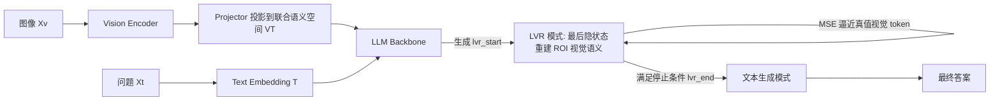

# Latent Visual Reasoning

**会议**: ICLR 2026  
**OpenReview**: [https://openreview.net/forum?id=j84WR5ORsC](https://openreview.net/forum?id=j84WR5ORsC)  
**代码**: 待开源（论文承诺后续放出代码与模型权重）  
**领域**: 多模态视觉推理 / MLLM  
**关键词**: 隐空间推理, 视觉语义重建, MLLM, GRPO, 细粒度视觉理解  

## 一句话总结
LVR 让多模态大模型不再只在文本空间里"想"，而是用 LLM 的最后隐状态直接在视觉嵌入空间里自回归地重建出与问题相关的视觉语义（"先看后说"），并配合改造版 GRPO 强化学习，在感知密集型 VQA 任务上显著超越"Think about/with Images"两类范式。

## 研究背景与动机
- **领域现状**: 当前 MLLM 的多模态推理主要走两条路：一是 **"Thinking about Images"**——把图像当静态前提，在文本空间做 CoT 链式推理；二是 **"Thinking with Images"**——调用外部工具（裁剪、放大、画辅助线、OCR）编辑图像，再把新图像 token 注入文本推理。
- **现有痛点**: 文本空间 CoT 会因为生成过多文本 token 而让文本上下文压过关键视觉输入，反而引入跨模态干扰削弱感知；工具路线则受限于预定义工具的能力边界，工具 API 难扩展、训练成本高，且模型常因数据偏置直接绕过注入的子图。两者**本质上都只在文本侧打补丁**，视觉输入和文本生成之间始终隔着一道鸿沟。
- **核心矛盾**: 既然在 MLLM 里视觉 token 和文本 token 本就被投影到**同一个联合语义空间**，为什么推理只能在离散文本 token 上做、而不能也在视觉 token 上做？传统 LLM 受 next-token-prediction 训练目标约束，只能操作离散 token，无法直接对连续视觉语义"思考"。
- **本文目标**: 提出一个能让模型**直接在视觉嵌入空间里自回归推理**的新范式，像人一样"在开口说话前先在脑海里把关键画面想清楚"。
- **核心 idea**: **【隐式视觉思维】** 借鉴 NLP 隐空间推理（Coconut，传递最后隐状态而非离散 token）的思路，把它扩展到视觉域——让 LLM 在 `<|lvr_start|>` 与 `<|lvr_end|>` 之间用最后隐状态去**重建问题相关 ROI 的视觉 token**，这些重建出的"latent visual thoughts"再回灌进上下文，引导后续文本作答。

## 方法详解

### 整体框架
LVR 架构沿用标准 MLLM 的 **Vision encoder → Projector → LLM** 三件套（基于 Qwen2.5-VL 3B/7B），只做一处根本性改动：让 LLM 在**文本生成**与**隐式视觉推理**两种模式间交替自回归运行。当生成特殊 token `<|lvr_start|>` 时进入 LVR 模式，此时不再把 LM head 预测的离散 token 喂回，而是把**最后隐状态直接作为下一位置的输入嵌入**，连续重建视觉语义；满足停止条件后生成 `<|lvr_end|>`，恢复正常文本生成。训练分两阶段：SFT 用 ROI bounding box 监督隐状态去逼近真值视觉 token，RL 阶段用改造的 GRPO 让模型自演化这套隐式推理。

### 关键设计

**1. ROI 监督的视觉重建 SFT：用"teacher-forcing"快速教会隐空间推理。** 每条 SFT 样本是「图像-问题对 + 一个预标注的 ROI bounding box」。模型先把图像切成视觉 patch 网格，根据 box 在 O(1) 时间取出落在 ROI 内的 patch 索引 $I=\{I_1,\dots,I_{T_v}\}$，对应的视觉嵌入 $\{v_1,\dots,v_{T_v}\}$ 就是隐式推理要重建的"标准答案"。LVR 段产生的最后隐状态 $\{h_t\}$ 被强制用 MSE 去逼近这些真值视觉 token：
$$\mathcal{L}_{\mathrm{LVR}} = \frac{1}{T_v}\sum_{t=1}^{T_v}\lVert h_t - v_t\rVert_2^2$$
随后的文本作答用标准交叉熵 $\mathcal{L}_{\mathrm{NTP}}=-\frac{1}{T_y}\sum_t \log p_\theta(y_t\mid y_{<t}, h_{1:T_v})$，二者加权联合：$\mathcal{L}=\mathcal{L}_{\mathrm{NTP}}+\lambda_{\mathrm{LVR}}\mathcal{L}_{\mathrm{LVR}}$。这一阶段虽限制了推理内容（重建什么由 box 决定，不自由），但能让模型迅速掌握"在隐空间推理"这一基本能力。值得注意的是，**视觉编码器与 projector 全程冻结，只更新 LLM**——这背后是一个强假设：最优的模态投影无需额外微调，统一推理空间靠 LLM 自身即可达成。

**2. GRPO$_{\text{latent}}$：把强化学习搬进没有 token 分布的隐空间。** SFT 之后用 RL 让 LVR 摆脱 box 约束、自由探索隐空间推理。难点在于标准 GRPO 的策略梯度定义在 token 分布上，而隐式推理过程**根本没有显式 token 分布**。解法是在 rollout 时记录下 LVR 段的最后隐状态 $\tilde h^{\text{latent}}_i=\{h^{\text{latent}}_{i,1},\dots\}$，计算重要性比时做一次 **teacher-forcing 前向回放**——把记录的隐状态原样"打补丁"塞回隐式推理位置，从而精确还原文本生成前的上下文，保证 $\pi_\theta$ 与 $\pi_{\theta_{old}}$ 下条件对数概率一致：
$$r_{i,t}(\theta)=\frac{\pi_\theta(y_{i,t}\mid q,I,\tilde h^{\text{latent}}_i,y_{i,<t})}{\pi_{\theta_{old}}(y_{i,t}\mid q,I,\tilde h^{\text{latent}}_i,y_{i,<t})}$$
奖励**只从文本输出 $y$ 算**：格式奖励（响应同时含 `<|lvr_start|>` 和 `<|lvr_end|>` 记 1）+ 准确率奖励（答对记 1）。格式奖励隐式鼓励模型触发 LVR 过程，准确率奖励则**透过对文本生成的影响间接监督隐式推理**——既不需要 ROI 标注，又能让隐空间推理自演化。

**3. 三种退出解码策略：解决"何时该停止视觉思考"。** 进入 LVR 模式后 LM head 仍在预测 token，但何时该吐出 `<|lvr_end|>` 退出非常不稳定。论文提出三种方案：(i) **Fixed Token**——固定推理步数预算（如 4/8/16 步），到点即退；(ii) **Latent End Token**——学一个可训练的隐状态张量，当最后隐状态接近它时退出；(iii) **Mode Switching Loss**——SFT 时加 BCE 辅助损失，把最后一个隐式 token 的分布推向 `<|lvr_end|>`、中间 token 推离。实测**只有最简单的 Fixed Token 最稳最好**：Mode Switching Loss 学不到停止条件直接塌缩成 0 步，Latent End Token 因为隐状态与终止张量的距离度量（余弦/L1/L2 各种阈值都试过）不可靠而频繁无法终止、跑满生成步数。这也暴露了可变长隐式推理仍是开放难题。

## 实验关键数据

骨干为 Qwen2.5-VL 3B/7B；SFT 用 VISUAL CoT（438k 带 box 的 VQA）数据，RL 用 ViRL 数据；7B SFT 在 4×AMD MI250 上约 40 小时跑 2500 步。

### 主实验表格（7B，vision-centric 任务，节选）

| Method | V* | V* D.A. | V* R.P. | MMVP | Counting | JigSaw | Spatial Rel. |
|--------|----|---------|---------|------|----------|--------|--------------|
| Qwen2.5-VL（base） | 78.5 | 81.7 | 73.7 | 66.7 | 66.7 | 52.0 | 87.4 |
| PixelReasoner（工具） | 80.1 | 81.7 | 77.6 | 67.0 | 66.7 | 52.7 | 88.1 |
| Vision-R1（文本CoT） | 70.2 | 70.4 | 69.7 | 46.7 | 51.7 | 27.3 | 66.4 |
| SFT（同数据基线） | 79.1 | 82.6 | 73.7 | 65.7 | 67.5 | 45.3 | 88.8 |
| **LVR (4 步)** | 81.2 | **84.4** | 76.3 | **72.0** | 69.2 | 52.7 | **89.5** |
| **LVR (8 步)** | **81.7** | **84.4** | 77.6 | 71.7 | 70.0 | 52.0 | 86.0 |
| **LVR (16 步)** | 80.6 | 81.7 | **79.0** | 71.7 | **70.8** | 52.7 | 87.4 |

- MMVP **71.67% vs Qwen2.5-VL 66.67%**（+5%）；V* R.P.（相对空间推理）+5.3%、V* D.A.（细节搜索）+2.7%；并超过依赖外部裁剪工具的 PixelReasoner。

### 消融实验表格（7B，架构变体）

| 变体 | V* | V* D.A. | MMVP | IQ-Test | JigSaw |
|------|----|---------|------|---------|--------|
| **LVR（标准）** | **81.7** | **84.4** | **71.7** | **29.3** | **52.0** |
| LVR LatentEnd | 39.8 | 32.2 | 19.0 | 6.7 | 13.3 |
| LVR MLP Head | 74.4 | 76.5 | 69.7 | 23.3 | 50.0 |
| LVR GLU Head | 79.6 | 82.6 | 69.0 | 25.3 | 44.0 |

- **RL（3B）**：GRPO$_{\text{latent}}$ 在 SFT 之上进一步提升，如 MMVP 从 54.7→55.3、V* 从 64.9→65.5（4 步），证明隐式推理可被强化自演化。

### 关键发现
- **不加额外 head 反而最好**：MLP/GLU head 都不如直接用 LLM 最后隐状态，说明 LLM 在联合语义空间里**原生就能对齐视觉与文本语义**，加 head 反而制造语义鸿沟。
- **文本 CoT 会伤感知**：PAPO/Vision-R1 在 V* 上明显退化，印证"Think about Images"的跨模态干扰；LVR 因联合推理避开此问题。
- **唯一短板 Relative Reflect**：因训练只用单图、而该任务需多图推理，存在分布偏移。

## 亮点与洞察
- **范式级创新**：第一个把"自回归推理"真正搬进**视觉嵌入空间**的工作，回答了"视觉/文本既然同处联合语义空间为何不一起推理"这一直觉问题，定位清晰。
- **优雅的监督信号**：用现成 ROI box → 选 patch → MSE 重建，把"该想什么"变成可监督目标，绕开了 NLP 隐空间不可解释、难监督的老大难。
- **GRPO$_{\text{latent}}$ 的回放技巧**：teacher-forcing 回放隐状态来恢复重要性比，是把 RL 接到无 token 分布隐过程上的一个通用、可复用的工程方案。
- **诚实的负结果**：明确报告 Mode Switching Loss 塌缩、Latent End Token 不稳，为后续可变长隐式推理研究指明了真正的瓶颈。

## 局限与展望
- **只能定长推理**：最有效的 Fixed Token 是定长预算，自适应停止（变长隐式推理）尚未解决，是最核心的开放问题。
- **单图训练限制**：多图/跨图任务（如 Relative Reflect）表现不佳，需引入跨图数据增强。
- **依赖 ROI 标注做冷启动**：SFT 仍需带 box 的数据（VISUAL CoT），虽 RL 阶段可去除，但起步成本仍在。
- **RL 仅在 3B 验证**：因算力受限未扩展到 7B，规模化效果待验证。
- **冻结编码器/projector 的强假设**："最优投影无需微调"在更难任务上是否成立存疑。

## 相关工作与启发
- **Coconut（Hao et al. 2024）**：NLP 隐空间推理的直接思想来源——传最后隐状态而非离散 token；LVR 把它落到有视觉锚点、可监督的视觉域。
- **Think with Images（PixelReasoner / Argus-X3）**：Argus-X3 也抽 ROI 视觉 token 再注入，是最贴近的对照——但它依赖外部工具抽特征，LVR 直接学会**重建**视觉语义，证明很多裁剪/放大/OCR 操作其实可在 MLLM 内部完成。
- **启发**：① 隐空间推理是降低文本冗长、缓解跨模态干扰的有前景方向；② "用现成弱标注（box）监督隐状态"这套思路可迁移到其他需要中间表征监督的隐式推理任务；③ 把 RL 接到非 token 化中间过程的回放范式，对扩散/隐式 CoT 等同样适用。

## 评分
- 新颖性: ⭐⭐⭐⭐⭐ 真正意义上把自回归推理迁入视觉嵌入空间，是范式级的新方向，而非又一个 CoT/工具变体。
- 实验充分度: ⭐⭐⭐⭐ 覆盖 V*/MMVP/BLINK 多个感知密集 benchmark，消融充分且诚实报告负结果；扣分在 RL 只在 3B 验证、未做大规模/多图实验。
- 写作质量: ⭐⭐⭐⭐ 动机递进清晰、图示直观、公式与设计动机交代到位；个别解码策略细节略密。
- 价值: ⭐⭐⭐⭐ 提供了一个可被广泛跟进的新范式与可复用的 GRPO$_{\text{latent}}$ 技巧，对细粒度视觉理解有实打实增益，代码模型承诺开源。

<!-- RELATED:START -->

## 相关论文

- [\[CVPR 2026\] Latent Implicit Visual Reasoning](../../CVPR2026/vlm_reasoning/latent_implicit_visual_reasoning.md)
- [\[ICML 2026\] Imagination Helps Visual Reasoning, But Not Yet in Latent Space](../../ICML2026/vlm_reasoning/imagination_helps_visual_reasoning_but_not_yet_in_latent_space.md)
- [\[ICLR 2026\] Composition-Grounded Data Synthesis for Visual Reasoning](composition-grounded_data_synthesis_for_visual_reasoning.md)
- [\[CVPR 2026\] Monet: Reasoning in Latent Visual Space Beyond Image and Language](../../CVPR2026/vlm_reasoning/monet_reasoning_in_latent_visual_space_beyond_image_and_language.md)
- [\[CVPR 2026\] Machine Mental Imagery: Empower Multimodal Reasoning with Latent Visual Tokens](../../CVPR2026/vlm_reasoning/machine_mental_imagery_empower_multimodal_reasoning_with_latent_visual_tokens.md)

<!-- RELATED:END -->
