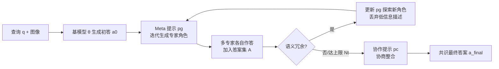

# LENS: Multi-level Evaluation of Multimodal Reasoning with Large Language Models

**会议**: ICLR 2026  
**代码**: [https://github.com/Lens4MLLMs/lens](https://github.com/Lens4MLLMs/lens)  
**领域**: 多模态推理 / 评测基准  
**关键词**: 多模态大模型, 评测基准, 层级化推理, 感知-理解-推理, 多专家协作  

## 一句话总结
Lens 用同一批 3.4K 张当代社交媒体图像配 60K+ 人工问题，构建「感知—理解—推理」三层八任务的统一分布基准，专门量化低层感知对高层推理的协同效应，并提出无需外部工具的自驱动多专家协作框架 SMEC 来提升复杂推理表现。

## 研究背景与动机
- **领域现状**: 多模态大模型（MLLM）在视觉识别与跨模态对齐上进步显著，但在动态、多样、真实物理世界场景中的复杂推理仍很薄弱。已有 V*、MMBench、MMMU 等基准开始转向开放世界评测。
- **现有痛点**: 主流基准按「任务导向」拼装，不同任务的样本往往来自**不同数据分布**，导致感知任务上的高分无法迁移到推理任务；同时多数基准只考察初级视觉理解，缺乏高阶推理与空间理解的细粒度刻画。
- **核心矛盾**: 当任务样本分布不一致时，无法干净地测量「低层感知能力如何协同支撑高层推理」——而这恰恰是评估模型是否走向人类级智能的关键。
- **本文目标**: 造一个让**同一张图同时承载感知/理解/推理全部标注**的层级化基准，从而在统一分布下评估跨任务协同；并给出一个语言原生、不依赖外部模块的推理增强方法。
- **核心 idea**: **「同图多标注 + 三层任务塔」**——每张图都打满八个任务的标注，使感知、理解、推理被共享视觉上下文统一起来，让协同效应可被定量分析；**「自驱动多专家」**——把单个 MLLM 通过自生成角色提示扮演成一组专家并自我协商出共识答案。

## 方法详解

### 整体框架
Lens 由两部分组成：一个**评测基准**（数据 + 三层八任务）和一个**推理框架 SMEC**。基准把八个任务编排成感知（物体计数 OC、物体检测 OD、物体存在判定 OE）、理解（关系抽取 RE、视觉定位 VG、区域 OCR）、推理（空间关系理解 SRC、场景知识推断 SKI）三个递进层级，所有任务共享同一批富标注图像。SMEC 则是在测试时驱动同一个 MLLM 先给初答、再自生成一队专家重审、筛除冗余专家、最后协商出共识答案。

### 关键设计

**1. 同图多标注的三层任务塔：把协同效应变成可测量的量。** Lens 的核心不是任务多，而是**每张图被同一组标注覆盖全部八个任务**，于是感知、理解、推理三层都建立在同一视觉分布之上。这样设计后，模型在 OC/OD/OE 等低层任务上的表现，可以与它在 SRC/SKI 等高层任务上的表现做**受控对照**——因为输入图相同，差异只来自能力层级而非数据分布。论文据此用 Pearson 相关与回归分析量化协同：OC↔RE 相关达 $0.73$、OE↔OCR 达 $0.67$，且 OE/OCR 是 SRC 的强预测因子、OC/RE 显著影响 SKI，从统计上坐实了「低层感知支撑高层推理」的层级结构。

**2. 当代真实图像 + 八任务开放式标注：抗污染又抗死记。** 图像全部从 X、Instagram、微博、小红书等平台人工采集，53% 发布于 2025 年 1 月之后、超 80% 来自 2024 年 9 月之后，天然规避预训练语料污染、保证时效性。任务全部设计为**开放集、自然语言驱动**，覆盖属性/计数/定位/关系/推理与图文交错（Table 1 中相比 V*、MMBench、HC-RefLoCo 等是唯一同时具备 Att./Cnt/Loc/Rel/Reasoning/Interleaved 全勾选的基准）。50+ 名经训练标注员产出 60K+ 问答，其中超 60% 的问题超出简单识别、显式要求对场景与用户意图做推理。

**3. SMEC——自生成专家角色与冗余过滤。** 给定查询 $q$，基模型 $\theta$ 先产出粗略初答 $a_0$；随后用一个 Meta 生成提示 $p_g$ 迭代生成专家角色描述 $d_t^q$（如地理空间分析师、文化分析师），每个有效描述派生一个新专家答 $a_t$ 加入答案集 $A$。当出现语义冗余描述时，框架**动态更新 $p_g$** 以鼓励探索新角色，并隐式丢弃重复/低信息描述，从而以极小开销维持一支精简而多样的专家队伍。这一步把「多智能体」纯靠提示自条件化实现，无需外部工具或任务监督。

**4. 共识驱动的答案整合。** 收集到专家答案集后，用协作提示 $p_c$ 驱动 $\theta$ 做一次审议式推理，把不同专家视角调和成统一答案 $a_{final}$，模拟人类专家组「各抒己见再达成共识」的过程。相比 Self-Refine 的单链自我修正与 Majority Voting 的盲投票，SMEC 的整合带有**显式角色分工 + 冗余裁剪**，因此在增加迭代次数 $N_t$ 时能稳定累积增益而非震荡。

## 实验关键数据

### 主实验表格（部分代表模型，三层八任务）

| 模型 | 规模 | OC | OD | OE | RE | VG | OCR | SRC | SKI |
|---|---|---|---|---|---|---|---|---|---|
| GPT-4o | - | 54.32 | N/A | 85.09 | 72.77 | N/A | 42.86 | 51.14 | 55.20 |
| Gemini2.5-Pro | - | 60.18 | 47.40 | 86.59 | 76.52 | 25.61 | 61.95 | 56.20 | 59.31 |
| InternVL3 | 78B | 61.38 | 47.44 | 84.87 | 74.93 | 27.24 | 54.21 | 49.39 | 55.17 |
| Qwen2.5-VL | 72B | 59.75 | 43.48 | 85.67 | 75.98 | 44.98 | 68.51 | 53.65 | 54.79 |
| QVQ-Max | 72B | 49.95 | N/A | 85.37 | 74.01 | N/A | 58.67 | 50.80 | 58.86 |
| Kimi-VL-thinking | MoE 2.8B/16B | 46.87 | N/A | 72.77 | 48.16 | N/A | 30.21 | 29.40 | 36.44 |

15+ 前沿模型**无一在推理任务上超过 60%**；VG（视觉定位）即便对 78B 级模型仍是瓶颈（InternVL3-78B 仅 27.24%）。

### 消融实验表格（SMEC 在 SKI 任务上的增益）

| 方法 | 模型 | 迭代 | 准确率 |
|---|---|---|---|
| Direct | Qwen2.5-VL-7B | - | 39.80 |
| Majority voting | Qwen2.5-VL-7B | - | 40.66 |
| Self-Refine | Qwen2.5-VL-7B | - | 40.51 (+0.71) |
| SMEC | Qwen2.5-VL-7B | 1 | 41.35 (+1.55) |
| SMEC | Qwen2.5-VL-7B | 2 | 42.97 (+3.17) |
| SMEC | Qwen2.5-VL-7B | 3 | 43.24 (+3.44) |
| Direct | Qwen2.5-VL-32B | - | 49.17 |
| SMEC | Qwen2.5-VL-32B | 3 | 52.44 (+3.27) |
| SMEC (Full data) | Qwen2.5-VL-32B | 3 | 54.66 (+3.12) |

### 关键发现
- **性能随规模稳步提升但有饱和**：Qwen2.5-VL 从 3B 到 72B 在推理任务上持续上涨，InternVL3 的 OD 从 18.39%（2B）升到 47.44%（78B），但高规模后边际收益递减。
- **感知是高阶认知的地基**：感知更强的模型推理也更好，统计相关性证实低层视觉理解的基础作用。
- **推理专用模型能部分补偿感知短板**：QVQ-Max 缺 OD/VG 能力却在 SKI 上达 58.86%，靠测试时扩展而非扎实感知。
- **SMEC 增益随迭代与规模累积**：7B 上 +3.44%、32B 上 +3.27%，且在全测试集上仍稳定 +3.12%，说明增益非分布特定。

## 亮点与洞察
- **「同分布」是这篇基准的灵魂**：把所有任务钉死在同一批图上，才第一次让「感知协同推理」从定性说法变成可回归、可相关分析的定量结论。
- **抗污染设计很硬核**：53% 图来自 2025 年后、人工逐张采集，直击当前基准被预训练语料「背答案」的痛点。
- **SMEC 的优雅在于零外部依赖**：不调工具、不接专家模型，纯靠提示让单个 MLLM 自我分裂成专家组再协商，工程落地成本低。

## 局限与展望
- **数据偏置仍在**：图像来自全球社媒但受平台人口结构影响，地理/文化覆盖不均，作者自陈需未来扩展。
- **SMEC 推理开销随迭代上升**：3 次迭代带来多次前向，测试时成本与延迟增加，论文未深入量化吞吐代价。
- **SMEC 增益集中在 SKI**：消融主要在场景知识推断单一任务上验证，对其余推理任务的普适性证据较薄。
- **VG 瓶颈未被方法触及**：基准揭示视觉定位是普遍短板，但 SMEC 主攻语言侧协商，难直接改善细粒度空间-语义对齐。

## 相关工作与启发
- **对比任务导向基准**（MMBench、MMMU、HaloQuest）：Lens 的差异是「统一分布 + 富标注」，把跨任务协同纳入可控分析，而非孤立测单一能力。
- **对比工具调用/多智能体方法**：SMEC 不依赖外部模块，把多专家协作压进单模型的提示自条件化，是「语言原生」的轻量替代。
- **对比 Self-Refine / Majority Voting**：同为测试时增强，SMEC 增加了显式角色分工与冗余过滤，因此能随迭代稳定累积而非平台化。
- **启发**：当评测要测「能力间的因果/协同」时，控制输入分布比堆任务数量更重要；测试时把单模型当「多视角集成器」是低成本提升复杂推理的可复用范式。

## 评分
- **新颖性**: ⭐⭐⭐⭐ — 「同图多标注塔」让协同效应首次可定量，SMEC 的自驱动专家也较少见，但单项组件并非全新。
- **实验充分度**: ⭐⭐⭐⭐ — 15+ 前沿模型、三层八任务、相关/回归协同分析齐全；SMEC 消融偏窄（主要 SKI）略减分。
- **写作质量**: ⭐⭐⭐⭐ — 动机—基准—方法—协同分析逻辑清晰，图表丰富，层级叙事到位。
- **价值**: ⭐⭐⭐⭐ — 提供了抗污染的当代多层级基准与可落地的推理增强框架，对评测与方法两侧都有实用参考价值。

<!-- RELATED:START -->

## 相关论文

- [\[CVPR 2026\] Grounded Chain-of-Thought for Multimodal Large Language Models](../../CVPR2026/vlm_reasoning/grounded_chain-of-thought_for_multimodal_large_language_models.md)
- [\[ICLR 2026\] MIMIC-Bench: Exploring the User-Like Thinking and Mimicking Capabilities of Multimodal Large Language Models](mimic-bench_exploring_the_user-like_thinking_and_mimicking_capabilities_of_multi.md)
- [\[ACL 2026\] OMIBench: Benchmarking Olympiad-Level Multi-Image Reasoning in Large Vision-Language Models](../../ACL2026/vlm_reasoning/omibench_benchmarking_olympiad-level_multi-image_reasoning_in_large_vision-langu.md)
- [\[ICLR 2026\] SpinBench: Perspective and Rotation as a Lens on Spatial Reasoning in VLMs](spinbench_perspective_and_rotation_as_a_lens_on_spatial_reasoning_in_vlms.md)
- [\[ICLR 2026\] VisuRiddles: Fine-Grained Perception is a Primary Bottleneck for Multimodal Large Language Models in Abstract Visual Reasoning](visuriddles_fine-grained_perception_is_a_primary_bottleneck_for_multimodal_large.md)

<!-- RELATED:END -->
