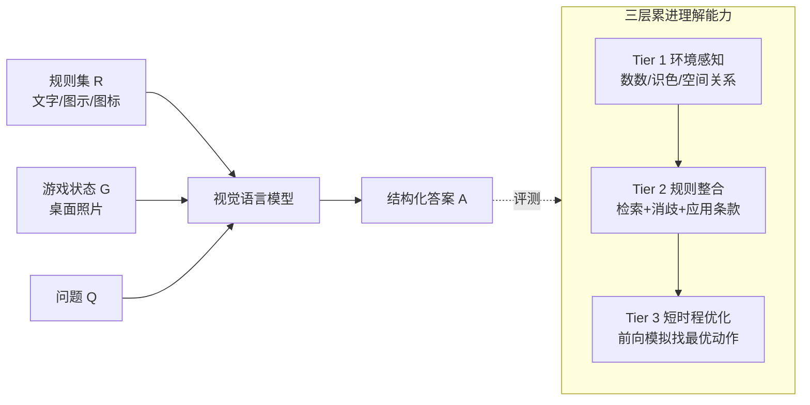

# LLMs as Rules Oracles: Exploring Real-World Multimodal Reasoning in Tabletop Strategy Game Environments

**会议**: ICLR 2026  
**OpenReview**: [https://openreview.net/forum?id=TOgQ00DEek](https://openreview.net/forum?id=TOgQ00DEek)  
**代码**: [https://huggingface.co/spaces/launch/LudoBench](https://huggingface.co/spaces/launch/LudoBench)  
**领域**: 多模态推理 / 视觉语言模型评测 / Benchmark  
**关键词**: LudoBench, 桌游推理, 情境化游戏理解, 多模态规则书, 视觉接地, 短时程优化  

## 一句话总结
本文提出 **LudoBench**——一个把"真实桌游照片 + 完整规则书 + 情境化问题"配对的多模态游戏理解基准，发现前沿视觉语言模型在新手玩家最基础的"看懂一局新桌游"任务上全面崩盘（感知 63%、规则整合 36%、短时程优化仅 8%），暴露其跨模态规则接地与轻量前向模拟能力的根本缺陷。

## 研究背景与动机
**领域现状**：游戏一直是 AI 推理的经典试验场，o1、Gemini Pro 等前沿模型在国际象棋、围棋这类有"规则强制执行器 + gym 式干净环境"的结构化数字游戏里表现优异——非法动作被禁止、状态推进由仿真器代劳。

**现有痛点**：一旦撤掉这套脚手架，模型连国际象棋这种被研究透的游戏都会提出非法或荒诞的走子，说明它们并未真正内化游戏状态与规则。而过往的游戏 benchmark 几乎都建立在"文本/符号序列化的干净棋盘"之上（如把井字棋写成"X 在 (1,1)"），或只测国际象棋这类布局极简、图标极少的游戏，无法反映真实桌游那种杂乱、密集、多模态的场景。

**核心矛盾**：真实桌游每年产出数千款、主要线下游玩，规则书冗长、多模态（文字+图示+图标+示例）且各成体系，对首次上手的玩家造成巨大认知负荷。**模型能否在没有合法性检查器、没有交互反馈的情况下，仅凭一张桌面照片和一本外部规则书，就像人类新手那样获取密集的跨模态参照知识、检索并消歧相关条款、解析图标与示意图、接地到杂乱空间布局并正确应用？**

**本文目标**：不再追求"深度策略精通"，而是聚焦新手玩家面对的初阶推理挑战——**第一次正确理解一款新桌游**。

**核心 idea**：**情境化多模态游戏理解（situated comprehension）**——把"看懂一局游戏"拆成三层累进能力（环境感知 → 异质规则整合 → 短时程优化），用手工标注的真实桌游场景逐级压力测试模型的基础多模态推理。

## 方法详解

### 整体框架
LudoBench 把任务形式化为视觉理解：给定游戏状态 $G$（一张或多张照片）、对应规则集 $R$（文字/图示/图标/示例混合）与自然语言问题 $Q$，模型需输出解答 $A$ 来回应 $Q | (G, R)$。基准覆盖 5 款机制各异的主流桌游（Kingdomino → Pax Renaissance，难度 1.2→4.6、规则条数 35→247），手工标注 638 道 QA，并按三个累进的理解层级（Tier）组织，每层独立检验一种能力，逐级加压。

### 关键设计

**1. 三层累进的情境化理解 Tier 体系：把"看懂游戏"拆成可单独压测的能力阶梯。** Tier 1（环境感知）只考对 $G$ 的基础视觉解析——物件计数、颜色区分、空间关系，无需任何规则知识，规则集 $R$ 用不上；Tier 2（异质规则整合）要求模型把 $R$ 中一条或多条规则条款接地到观察到的视觉状态，去判断状态合法性、当前玩家得分或可行动作；Tier 3（短时程优化）则要在给定约束下预测最优结果（如"本回合结束前最多能拿多少分"），这迫使模型构建一个能做轻量前向模拟的内部世界模型。三层共享同一批情境化场景但逐级叠加难度，让"哪一步崩"可被精确定位。

**2. 人在环路的高保真手工标注与可验证启发式：用确定性可复现的题目换取无歧义的 ground truth。** 所有场景都在 Tabletop Simulator 沙盒里搭建，支持自由镜头与精确摆件，保证配置可复现、画面高质量。题目遵循三条启发式以保证"有唯一可验证答案"：(1) 确定性、完全可观测的状态——答案完全可从可见图像推出，排除隐藏信息与随机事件；(2) 受限的对手建模——多回合优化题要么显式假设无对手交互，要么明确指定对手行为（如"对手会最小化你的得分"）；(3) 单一良定义解——每题恰有一个答案，规避歧义或概率性情形。标注走"两位游戏专家产题 → 三位爱好者级学生独立作答 → 逐条讨论消解分歧"的三阶段流程，专家在 Tier 1/2/3 的标注正确率达 98.3%/97.4%/87.2%，爱好者达 96.7%/89.1%/82.2%，作为人类天花板对照。

**3. 三模态规则书消融：分离"知识有没有"与"知识用没用对"。** 对每款游戏的规则集 $R$ 设三个变体——IMAGE（规则书 PDF 的高清整页截图，与人类标注者所见完全一致）、TEXT（仅规则书文字子集）、NONE（只给状态 $G$，模型只能靠参数化知识）。这组对照能直接回答"喂给模型富信息规则书是否真的有用"。评测用 OpenCompass VLMEVALKIT 统一流程，答案先经 GPT-4o 后处理映射到半结构化/JSON 模式再做精确匹配（人工抽检 100 条映射准确率 100%）。该设计还顺带揭示了反直觉现象：图示规则书理应像"看示范学游戏"那样更易懂，但多数模型在图示输入下反而比纯文本更差，因过拟合到示例而无法泛化。

**4. 多维失败归因与 oracle 可解性分析：把"做不对"细分成可诊断的错误类型。** 通过对 Pax Renaissance Tier-2 的 30 题在三种输入条件下逐条标注"是否检索到相关规则 / 是否正确应用"，分离出**双瓶颈**：规则检索率随输入变富而攀升（NONE→TEXT→IMAGE 为 20%→73%→90%），但应用准确率始终落后（17%→64%→56%）——模型常常"知道规则却读错棋盘"。失败被归类为 Canonical Object Mapping（实体接地错）、Spatial Enumeration（空间枚举不全）、Misapplication of Rules（规则误用）、Object Permanence（序列推理中遗忘已落子）、Greedy Planning 等可命名类型。同时用 27 路（9 模型 × 3 模态）多数投票估计基准头部空间，确认 Tier 3 仍有约 50% 题目无任一系统能解，证明留有大量提升余地而非标注噪声。

## 实验关键数据

### 主实验：9 个前沿模型的逐层准确率（跨游戏、跨模态平均）

| Tier | 任务 | 模型平均准确率 | 人类（爱好者） |
|------|------|----------------|----------------|
| Tier 1 | 环境感知 | ~63% | ~96.7% |
| Tier 2 | 规则整合 | ~36% | ~89.1% |
| Tier 3 | 短时程优化 | ~8% | ~82.2% |

- 评测 9 个多模态模型：GPT-4o / 4.1 / o1 / o3 / 5.1、Gemini Pro 3 / 2.5 Pro / 2.5 Flash、Claude 4.5 Sonnet。
- **Gemini Pro 3 全程最强**（尤其 Tier 1/2），GPT-5.1 与 o3 次之；Flash 2.5 最弱。
- Tier 3 上**仅 Gemini Pro 3 在个别 split（Res Arcana | Text）超过 20%**，其余模型几乎全军覆没。

### 消融：规则书模态的影响（相对 NONE 基线）

| 模型族 | TEXT 文本规则书 | IMAGE 图示规则书 |
|--------|-----------------|------------------|
| GPT 系 | 提升 | 提升 |
| Claude 4.5 | 提升 | 提升 |
| Gemini Pro 3 | 提升 | 提升 |
| Gemini 2.5（Pro/Flash） | 提升（Pro 2.5 + o3 近 +7%） | **下降** |

### 关键发现
- **简单视觉感知都没解决**：Tier 1 仍有大量小物件遮挡计数错、旋转图标/文字识别错、空间关系解析脆弱（Claude 在 Carcassonne|Img 低至 30%）。
- **检索≠应用的双瓶颈**：规则检索率可达 90%，但规则应用率仅 56%——"知道规则却读错棋盘"是核心失败模式。
- **图示反而拖累**：多数模型在图示规则书下过拟合示例、无法泛化，与"人类从图示中获益"形成鲜明反差，暴露视觉文档理解短板。
- **Tier 3 的世界模型缺失**：响应在 Tier 3 显著变长却无相应推理增益（冗长但无效），模型无法在完全可观测环境里合法地内部模拟哪怕一两步。
- **oracle 头部空间大**：27 路投票下 Tier 3 仍约 50% 题目无解（Kingdomino 高达 60%），确认难度来自任务本身而非标注噪声。

## 亮点与洞察
- **重新定义游戏推理的难点**：把研究焦点从"深度策略精通"拉回到"第一次看懂一局新游戏"，揭示这个被忽视的初阶能力恰恰是当前模型的盲区。
- **真实世界的杂乱性是核心变量**：用 Tabletop Simulator 搭出密集、多组件、可旋转的真实桌面场景，逼出序列化干净 benchmark 永远测不到的接地失败。
- **三模态消融的诊断价值**：NONE/TEXT/IMAGE 对照干净地把"知识缺失"和"知识误用"分开，得出"富输入几乎消除接地错、但规则忠实执行仍难"的精炼结论。
- **图示规则书悖论**：模型在本应更易懂的图示输入下反而退化，直指视觉文档理解与符号接地的系统性弱点。

## 局限与展望
- **规模与覆盖**：仅 5 款游戏、638 题，且依赖手工标注（专家+爱好者三阶段），扩展到更多游戏/题型成本高；不过本文指出情境化场景和规则书示例可作为可复用脚手架半自动扩题。
- **评测受上下文窗口限制**：Pax Ren. 与 Catan 的图示规则书超出 Claude 4.5 上下文窗口，相关结果缺失，影响跨模型公平对比。
- **只测确定性、完全可观测、单解题**：刻意排除隐藏信息、随机性与多解情形，便于验证但也回避了真实游戏中的不确定性推理。
- **诊断为主、未给解法**：本文是诊断性 benchmark，揭示了视觉接地、规则执行、轻量前向模拟三大瓶颈，但把"如何让模型真正学会"留给后续工作（如更强的视觉文档理解、显式世界模型/模拟器接口）。

## 相关工作与启发
- **vs. 强化学习棋类（AlphaGo/AlphaZero）**：那是有完美信息+海量自博弈+规则强制的窄域超人，本文测的是零样本、新游戏、无强制环境下的知识快速获取。
- **vs. 文本/符号化游戏 benchmark**（井字棋、Tic-Tac-Toe 序列化）：那些把状态写成干净字符串，本文坚持用杂乱真实照片，序列化在此不可行。
- **vs. 视觉棋盘理解**（Chess/Connect Four 图像）：仍是简单布局、最少图标，本文配上完整多模态规则书，要求检索消歧+接地决策。
- **vs. 合成推理游戏**（ARC、Baba Is AI、PuzzleVQA）：那些隔离基础推理但偏玩具化，本文强调真实世界桌游的应用价值——让视觉模型充当线下游玩的"多模态规则裁判（rules oracle）"。
- **启发**：揭示了"检索强、应用弱"这一对多模态 RAG/agent 普遍存在的失败模式，以及视觉文档理解（从图示规则书提取语义）是被低估的瓶颈，可指导未来在世界模型、符号接地、视觉文档解析方向发力。

## 评分
- **新颖性**: ⭐⭐⭐⭐ — 首个把真实桌游照片 + 完整多模态规则书 + 情境化问题三者配对的游戏理解 benchmark，重新定义了"看懂新游戏"这一被忽视的初阶推理挑战。
- **实验充分度**: ⭐⭐⭐⭐ — 9 个前沿模型 × 3 种规则书模态 × 3 个 Tier × 5 款游戏的全交叉评测，配人类对照、oracle 可解性投票与细粒度规则检索/应用错误归因，诊断扎实。
- **写作质量**: ⭐⭐⭐⭐ — 任务形式化清晰、三层 Tier 与三模态消融逻辑干净，失败类型表与图表丰富，叙事有说服力。
- **价值**: ⭐⭐⭐⭐ — 暴露了多模态模型在视觉接地、规则忠实执行、轻量前向模拟上的根本缺陷，并指出"图示反而拖累""检索≠应用"等可指导后续研究的洞察，对评测与方法两端都有参考价值。

<!-- RELATED:START -->

## 相关论文

- [\[ICLR 2026\] Game-RL: Synthesizing Multimodal Verifiable Game Data to Boost VLMs' General Reasoning](game-rl_synthesizing_multimodal_verifiable_game_data_to_boost_vlms_general_reaso.md)
- [\[ICLR 2026\] Reasoning in Space via Grounding in the World](reasoning_in_space_via_grounding_in_the_world.md)
- [\[ICLR 2026\] MMR-Life: Piecing Together Real-life Scenes for Multimodal Multi-image Reasoning](mmr-life_piecing_together_real-life_scenes_for_multimodal_multi-image_reasoning.md)
- [\[ICLR 2026\] Play to Generalize: Learning to Reason Through Game Play](play_to_generalize_learning_to_reason_through_game_play.md)
- [\[ICLR 2026\] IV-Bench: A Benchmark for Image-Grounded Video Perception and Reasoning in Multimodal LLMs](iv-bench_a_benchmark_for_image-grounded_video_perception_and_reasoning_in_multim.md)

<!-- RELATED:END -->
