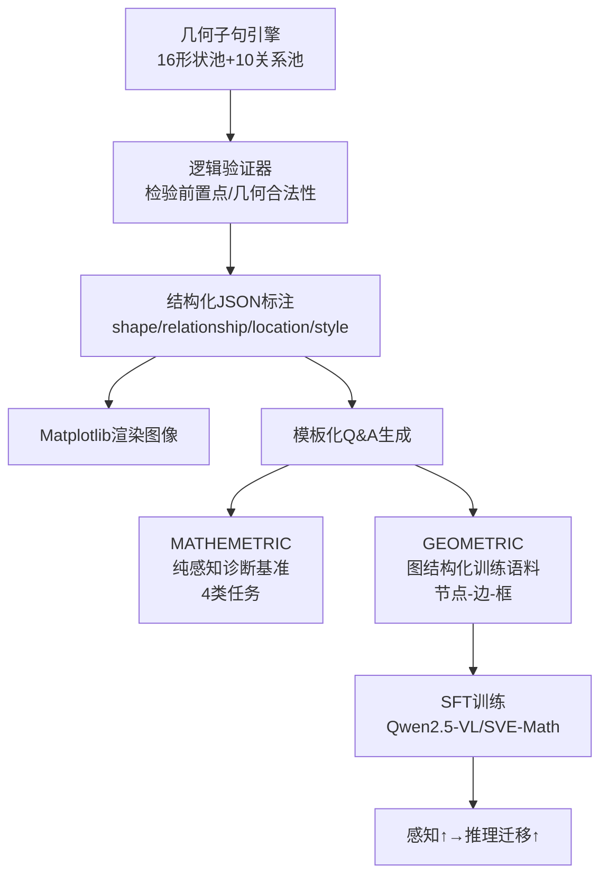

# Math Blind: Failures in Diagram Understanding Undermine Reasoning in MLLMs

**会议**: ICLR 2026  
**OpenReview**: [https://openreview.net/forum?id=RtvmTxdQV9](https://openreview.net/forum?id=RtvmTxdQV9)  
**代码**: viocean/MATHEMETRIC（项目主页）  
**领域**: 多模态 VLM / 数学视觉推理  
**关键词**: 数学图示感知, MLLM, 几何感知, 视觉定位, 感知-推理迁移, 结构化图示  

## 一句话总结
本文提出诊断基准 MATHEMETRIC 把"感知"从"推理"中剥离出来，揭示当前 MLLM 在数学图示上的基础感知（形状/计数/关系/定位）极差、尤其细粒度定位接近 0，从而"盲信文本"（即 Math Blind）；进而用图结构化的几何感知数据集 GEOMETRIC 训练后，定位任务 +79%，且这种感知增益无需额外 CoT 数据就能迁移到推理，四个公开基准 +3~4%。

## 研究背景与动机
**领域现状**：数学图示是一种"人造的符号视觉语言"——它不是真实世界的像素采样，而是由精确几何结构和符号记号组成的抽象表达。MathVista、MathVerse 等基准虽然评测了 MLLM 的数学视觉推理，但它们把感知和推理混在一起测：最终只看答案对不对，中间的感知错误被掩盖了。

**现有痛点**：人们普遍把 MLLM 在图示上的"推理崩溃和幻觉"归因于推理能力不足，却没人验证过——**这些失败到底是不是源于模型根本"看不懂"图本身**。已有几何训练数据集（MAVIS、AutoGeo）的标注又往往表达含糊、结构属性模糊（如把一串操作过程当作图的描述），无法教会模型图的结构。

**核心矛盾**：MLLM 在自然图像上感知很强（2T 图像训练），但面对几何图就退化——因为缺少可利用的语义先验和表面模式，无法泛化。低层感知本应像人一样"一眼可解"，却成了 MLLM 的瓶颈，并向下游传播成错误推理。

**本文目标**：先用诊断手段证明"感知缺陷确实存在并拖垮推理"，再证明"补强感知能直接迁移提升推理"。

**核心 idea**：① **诊断**——构造一个纯感知、无需推理的基准（MATHEMETRIC），把感知能力单独量出来；② **修复**——把图示显式表达为"图元节点 + 关系边 + 细粒度框"的图结构训练语料（GEOMETRIC），让模型学会"看哪里"，从而打破对文本捷径的依赖。

## 方法详解

### 整体框架
工作分两条线：一个**诊断基准** MATHEMETRIC 用于"测出"感知短板，一个**结构化训练集** GEOMETRIC 用于"补上"感知短板；二者共享同一套合成数据引擎（基于几何子句的图元 + 关系采样 + 逻辑验证器 + Matplotlib 渲染 + 模板化 Q&A 生成），区别只在于一个生成评测题、一个生成训练对话。

### 关键设计

**1. MATHEMETRIC：把感知从推理中剥离的诊断基准。** 它只问"人类一眼就能答"的纯感知问题，含 1,198 张图、1,609 道题，覆盖平面几何（66%）、立体几何（20%）和图表（14%），并设计四类任务：形状分类（16 类基础形状 + CLEVR 物体 + FigureQA 元素）、物体计数、关系识别（4 种空间关系 + 10 多种数学关系）、物体定位（自由形式预测 $(x_1,y_1,x_2,y_2)$ 边界框）。题型混用单选、判断、自由作答；定位以 IoU 阈值 0.65 评判。关键就在于答案直接来自标注、不含任何多步推理，因此"答错就是感知错"，把以往被最终答案掩盖的中间错误暴露出来。

**2. 合成数据引擎：以几何子句为原子单位、带验证器保证逻辑自洽。** 受 AlphaGeometry 启发，引擎从形状池（等腰三角形、正方形、平行四边形、五边形、圆、椭圆…）和关系池（平行、垂直、相切、内切…）采样几何子句，每个子句声明 explanation 和 prerequisite（如 `W = incircle ∆KMQ` 需要前置点 K、M、Q）。验证器按"人工规则 + 基础数学原理 + 前置点约束"逐个检验，丢弃非法组合、保留合法子句组，再渲染成图并存为结构化 JSON（attributes、bounding boxes、relationships、style 一应俱全）。为增加难度，还注入高斯噪声、不规则涂鸦、角标楔形符号等增广。这套引擎是诊断与训练共用的"真相之源"。

**3. GEOMETRIC：把图示显式写成"图（graph）"的结构化描述语料。** 区别于 MAVIS/AutoGeo 含糊的过程式描述，GEOMETRIC 用固定模板把每张图组织成"先数物体数 N → 再逐个给形状属性 → 再给每个图元的细粒度框坐标 → 最后逐条说明图元间关系"的层级化文本，本质上对应图的节点（物体+属性）、边（关系）、几何位置（框）。它带来三点训练价值：(1) 提供清晰的物体属性与关系，类比图的节点与边；(2) 提供细粒度框坐标，让模型系统性学会空间感知；(3) 可与推理型 CoT 数学数据集在自微调阶段融合，使模型既会感知又会推理。此外还配套了多轮对话的指令数据（每问对准一个具体感知任务）来强化指令跟随。

**4. 感知→推理的迁移训练与验证。** 对 SVE-Math-DeepSeek 做全参 SFT、对 Qwen2.5-VL-7B/32B 做 LoRA，仅用 GEOMETRIC 补强感知（不加额外推理数据）。其核心论点是：当模型先"看对"了，多步推理链自然更稳——许多原本错误的样例只需纠正一个关键感知错误就能解决。这验证了感知与推理是互补的，而非靠堆推理数据或强化学习硬抬。

## 实验关键数据

### 主实验：MATHEMETRIC 感知诊断（部分模型 all 准确率，%）

| 模型 | Avg. | 平面-cls | 平面-grd | 平面-rlat |
|------|------|---------|---------|----------|
| Human（作者） | 99.2 | 98.7 | 95.9 | 100.0 |
| Qwen2.5-VL-7B | 59.2 | 56.2 | 18.5 | 52.0 |
| Qwen2.5-VL-32B | 62.2 | 56.9 | **0.0** | 67.0 |
| GPT-4o | 53.3 | 58.4 | 1.1 | 62.5 |
| InternVL2.5-38B | 63.1 | 59.9 | 2.5 | 66.0 |
| SVE-Math-DeepSeek-7B | 46.6 | 52.4 | 3.6 | 51.0 |
| **Qwen2.5-VL-7B+（本文）** | **72.9** | 70.7 | **82.6** | 85.0 |
| **Qwen2.5-VL-32B+（本文）** | **74.2** | 70.7 | **84.0** | 79.5 |
| **SVE-Math-DeepSeek-7B+（本文）** | 68.4 | 75.8 | 82.9 | 96.5 |

要点：几乎所有 SOTA 模型在细粒度定位（grd）上接近 0（含 32B、GPT-4o），与人类 95%+ 形成断崖；本文方法把定位拉到 80%+（grd 任务约 +79%）。

### 感知与推理联动（Table 2，%）

| 模型 | 平面感知 | MathVerse | MathVista | GeoQA | MATH-V |
|------|---------|-----------|-----------|-------|--------|
| SVE-Math-DeepSeek-7B | 35.4 | 24.3 | 48.7 | 72.8 | 14.4 |
| **SVE-Math-DeepSeek-7B+** | **84.6** | **28.1** | 51.3 | 76.2 | 16.6 |
| Qwen2.5-VL-7B | 44.0 | 49.2 | 68.2 | 76.4 | 25.1 |
| **Qwen2.5-VL-7B+** | **78.5** | 52.8 | 70.3 | 79.6 | 27.3 |
| Qwen2.5-VL-32B | 43.3 | 54.8 | 74.7 | 82.9 | 31.9 |
| **Qwen2.5-VL-32B+** | **77.9** | **57.3** | 76.9 | 85.3 | 33.3 |

要点：纯靠补强感知（无额外推理数据），MathVerse 等四个推理基准 +3~4%；SVE-Math-DeepSeek+ 的 28.1% 甚至超过用大规模推理样本 + RL 训练的 MultiMath（26.9%）。

### 关键发现
- **盲信文本（Math Blind）**：图—文冲突时模型偏信文本，感知越弱越严重；对形状的顶点顺序不敏感（顶点序本应定义形状身份），说明在靠模式记忆而非真感知。
- **脆弱性**：易被细微视觉噪声和无关干扰物带偏，无法聚焦显著物体。
- **规模无效**：Qwen2VL 从 7B→72B，MathVista +22.3% 但 MATHEMETRIC 仅 +8.3%——堆参数对感知几乎无用。
- **通用 vs 数学模型**：通用模型因见过 FigureQA/CLEVR/图表，在立体几何和图表上反超数学专用模型，但细粒度框任务全军覆没。

## 亮点与洞察
- **方法论贡献**：用"一眼可解"的纯感知任务把感知从推理里干净剥离，给"MLLM 到底看没看懂图"这一长期含糊的问题提供了可量化的诊断工具。
- **机制洞察**：把"推理崩溃"重新归因为"感知崩溃 + 盲信文本"，并用数据证明低层感知是高层推理的地基。
- **数据设计哲学**：图示的本质是"图（graph）"——显式编码节点/边/框比堆规模更有效（MAVIS 比本文大 5× 反而更差，因含糊且分布外）。
- **迁移性**：感知增益无需任何额外 CoT/RL 即可迁移到推理，且能跨子域泛化（只训平面几何也能提升立体几何/图表）。

## 局限与展望
- 训练主要覆盖平面几何，立体几何与图表是零样本迁移，提升幅度小于平面几何。
- 未显式建模视觉—文本交互（不像 MINT-CoT 那样做 token 级融合），作者承认显式建模视觉-文本交互如何进一步放大"感知→推理"是未来方向。
- 合成数据由模板和固定关系池生成，真实世界手绘/扫描几何图的分布外鲁棒性仍待检验。
- 评测主要在数学几何域，能否推广到电路图、流程图、分子式等更广义"符号视觉"尚未验证。

## 相关工作与启发
- **数学视觉推理基准**：MathVista、MathVerse、MATH-V、GeoQA——本文指出它们感知-推理混测的盲点。
- **几何训练数据集**：MAVIS、AutoGeo——本文的对照与改进对象（含糊 vs 结构化）。
- **数学专用 MLLM**：SVE-Math-DeepSeek（几何图元视觉编码器）、G-LLaVA、Math-LLaVA、MultiMath、URSA。
- **推理增强路线**：Vision-R1（RL 增强，算力重）、MINT-CoT（视觉-文本 token 融合）——本文走"补感知"这条更轻量的互补路线。
- **思想启发**：受 AlphaGeometry 的几何子句表示启发构造合成引擎；"用结构降低学习复杂度"的思路对其他符号视觉任务（图表、UI、文档版面）有借鉴价值。

## 评分
- **新颖性**: ⭐⭐⭐⭐⭐ "感知/推理剥离诊断 + 图结构化数据补感知"的组合视角新颖，且把"推理失败"重新归因为"感知失败"有思想冲击力。
- **实验充分度**: ⭐⭐⭐⭐ 评测 20 个 MLLM、覆盖三大子域四类任务，主表 + Table 2 + 五因素消融较完整；但训练侧主要在平面几何、真实分布外验证偏弱。
- **写作质量**: ⭐⭐⭐⭐ 故事线清晰（诊断→归因→修复→迁移验证），图表信息密度高；术语（Math Blind / blind reasoning）有记忆点。
- **价值**: ⭐⭐⭐⭐⭐ 给数学多模态社区指出"先补感知地基再谈推理"的明确方向，基准 + 数据集均可复用，实用价值高。

<!-- RELATED:START -->

## 相关论文

- [\[ICLR 2026\] We-Math 2.0: A Versatile MathBook System for Incentivizing Visual Mathematical Reasoning](we-math_20_a_versatile_mathbook_system_for_incentivizing_visual_mathematical_rea.md)
- [\[ICLR 2026\] ExpVid: A Benchmark for Experiment Video Understanding & Reasoning](expvid_a_benchmark_for_experiment_video_understanding_reasoning.md)
- [\[ICLR 2026\] Children's Intelligence Tests Pose Challenges for MLLMs? KidGym: A 2D Grid-Based Reasoning Benchmark for MLLMs](childrens_intelligence_tests_pose_challenges_for_mllms_kidgym_a_2d_grid-based_re.md)
- [\[CVPR 2025\] MV-MATH: Evaluating Multimodal Math Reasoning in Multi-Visual Contexts](../../CVPR2025/vlm_reasoning/mv-math_evaluating_multimodal_math_reasoning_in_multi-visual_contexts.md)
- [\[ICLR 2026\] SophiaVL-R1: Reinforcing MLLMs Reasoning with Thinking Reward](sophiavl-r1_reinforcing_mllms_reasoning_with_thinking_reward.md)

<!-- RELATED:END -->
