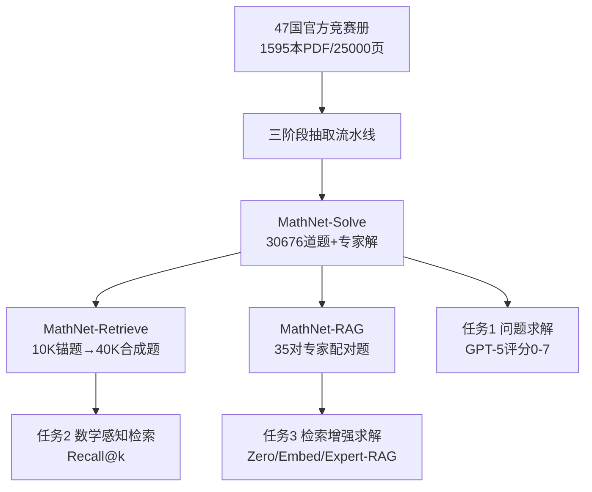

# MathNet: A Global Multimodal Benchmark for Mathematical Reasoning and Retrieval

**会议**: ICLR 2026  
**OpenReview**: [https://openreview.net/forum?id=zPvdG1Va5Q](https://openreview.net/forum?id=zPvdG1Va5Q)  
**代码/主页**: [mathnet.mit.edu](https://mathnet.mit.edu)  
**领域**: 多模态数学推理 / 数学检索 / 评测基准  
**关键词**: Olympiad Math, Multilingual, Math-Aware Retrieval, RAG, Benchmark  

## 一句话总结
MathNet 构建了目前规模最大的奥赛级数学题库（30K+ 道、47 国、17 种语言、跨 40 年官方真题），并首次把"数学感知检索"作为独立任务，配套问题求解、数学检索、检索增强求解三大基准，揭示前沿模型在几何/离散数学与"识别数学等价题"上仍严重受限。

## 研究背景与动机
**领域现状**：LLM/LMM 在数学推理上进步飞快，从小学算术一路刷到号称 IMO 金牌水平，但用来衡量这些进步的基准却严重滞后。

**现有痛点**：现有奥赛级数据集（OlympiadBench、Omni-Math、IneqMath 等）大多从 AoPS 等社区平台爬取，只覆盖美中两国的少数赛事，存在三大缺陷——(i) 专家解答稀缺、(ii) 缺乏高难度的多语言/多模态内容、(iii) 几乎没人研究"数学问题检索"。

**核心矛盾**：数学进步往往依赖"识别不同问题共享的结构"，但现有检索系统只会做语义改写匹配，对符号等价完全无感。例如 $x^2+y^2=1$ 与 $\sqrt{a^2+b^2}=1$、与单位向量集 $|u|^2=1$ 本质等价，却不等价于 $x+y=1$；现有 embedding 因表层词汇重叠，反而把 $x+y=1$ 判为更近。这种"数学感知检索"既是 IMO 命题查重的真实痛点，也是数学研究者按概念（而非具体公式）检索的刚需。

**本文目标**：提供一个大规模、多语言、多模态、含专家解答的奥赛题库，并把它扩展成支持三类任务的评测平台，系统量化"会解题"与"会识别相关题"这两种能力的差距。

**核心 idea**：**[数据集]** 只用各国官方竞赛册（非社区爬取）保证专家级质量；**[新任务]** 提出"数学感知检索"，要求模型识别符号等价而非表层相似；**[三任务闭环]** 用同一题库串起"解题→检索→检索增强解题"，验证检索质量如何反哺推理。

## 方法详解

### 整体框架
MathNet 由一套数据构建流水线和三个评测数据集组成。流水线把 47 国 1595 本官方竞赛 PDF（25000+ 页）转成对齐的"题—解"对；在此之上派生出三个数据集：MathNet-Solve（解题）、MathNet-Retrieve（数学检索）、MathNet-RAG（检索增强解题），分别对应三类任务与评测指标。

### 关键设计

**1. 三阶段 LLM 抽取流水线：从异构 PDF 到对齐题解对**。各国竞赛册格式混乱——有的题解分章、有的交错，编号命名规则连同一本册子内都不统一，传统正则解析极其脆弱。MathNet 设计了三阶段管线：先用多语言 OCR 框架 dots-ocr 把所有册子统一转成 Markdown；Stage 1 用 Gemini-2.5-Flash 做文档切分与边界检测，只输出题/解所在的行号并记录作者、来源页码等溯源信息；Stage 2 取出对应行段（前后加缓冲文本防漏），用 GPT-4.1 抽成 LaTeX 友好格式，专门解决题解跨章节、超出上下文窗口的问题；Stage 3 做三重验证——规则化文本相似度（确保 LLM 只改格式不幻觉内容）、GPT-4.1 对照页面截图当裁判（查 OCR 错误、图文错配、解答是否完整）、再人工复核低置信样本，**三者一致才保留**，最终得到 30676 道高质量题解对。

**2. 数学相似性的细粒度分类法（taxonomy）**。这是支撑检索任务的概念基石。MathNet 把"两题相关"区分为三个层级：**Invariance（不变性）** 指变换下的严格等价，仅表示不同而底层结构相同（语法重命名、代数重写、几何重刻画、跨域同构）；**Resonance（共振）** 指部分相似，两题不同但可用同一思路/证明策略/结构类比来解，对应"泛化、共用引理、结构归约"等子类；**Affinity（亲和）** 指无结构等价的宽泛主题关联（同属数论或几何）。这套分类把"数学等价"从模糊概念变成可标注、可评测的层级，让检索质量可以被系统度量。

**3. 用对抗式正负样本构造数学检索基准**。MathNet-Retrieve 从 Solve 里取 10000 道锚题，每道用 GPT-5 生成 **1 个等价正例 + 3 个困难负例**，共 40000 道合成题。等价正例通过变量重命名（$x\to a$）、代数变形、改写得到，如 $f(x)+f(y)=f(x+y)$ 改写为 $g(a)-g(a+b)=-g(b)$；困难负例则保留大部分表层形式但改变底层数学，如把它改成 $f(x^2)+f(y)=f(x-y)$。这种"近似干扰项"专门让只靠词汇重叠的模型失败，直击数学感知检索的核心难点。

**4. 用专家配对真题评测检索增强求解**。MathNet-RAG 不用合成题，而是请专家从真实奥赛中配出 35 对结构共振（Structural Resonance）的真题（如"连续整数乘积不能相等"的中国 TST 题与俄罗斯题共享同一引理）。评测设三档：Zero-Shot 只给目标题；Embed-RAG 用 gemini-embedding-001 检索一道相关题连同官方解作为上下文；Expert-RAG 直接给专家配对的相关题及其解。Zero→Embed 的差衡量"embedding 检索带来的增益"，Embed→Expert 的差衡量"检索误差还限制了多少性能"，从而把检索质量对推理的影响干净地拆解出来。

## 实验关键数据
评测覆盖 27 个 SOTA 模型，解题用 GPT-5 做 0–7 分评分（≥6 计正确），检索用 Recall@k，RAG 用人工+LLM 双重评分。

### 主实验：问题求解（MathNet-Solve-Test，6400 题）

| 模型 | 代数 | 数论 | 几何 | 离散 | 宏平均 |
|---|---|---|---|---|---|
| gemini-3.1-pro-preview | 83.7 | 82.2 | 74.6 | 75.6 | **78.4** |
| gemini-3-flash-preview | 77.7 | 73.3 | 67.0 | 64.0 | 70.4 |
| gpt-5 | 80.3 | 73.6 | 61.1 | 65.3 | 69.3 |
| claude-opus-4.6 | 53.2 | 44.6 | 44.3 | 36.4 | 45.7 |
| gemini-2.5-flash | 50.5 | 42.6 | 36.8 | 31.0 | 41.1 |
| DeepSeek-V3.2 | 51.6 | 45.3 | 32.2 | 32.7 | 40.1 |
| DeepSeek-R1 | 46.1 | 39.5 | 31.2 | 27.3 | 36.3 |
| ministral-3B | 6.4 | 2.9 | 4.3 | 1.7 | 4.4 |

代数最易（顶级模型 80%+），几何与离散数学最难（gpt-5 几何仅 56.3%）；顶部与底部差距高达 72.7 分。

### 检索实验（MathNet-Retrieve，10000 锚题）

| Embedding 模型 | R@1(All) | R@5(All) |
|---|---|---|
| gemini-embedding-001 | 4.83 | **68.88** |
| qwen3-embedding-4B | 4.96 | 64.95 |
| all-mpnet-base-v2 | 3.78 | 57.70 |
| text-embedding-3-large | 2.74 | 54.23 |
| text-embedding-3-small | 1.98 | 35.49 |

即便最强 embedding，Recall@1 也仅约 5%；更反直觉的是**非等价对的余弦相似度常高于等价对**，说明 embedding 抓的是表层词汇/符号重叠而非真实结构关系。

### 检索增强求解（MathNet-RAG，人工评分）

| 模型 | Zero-shot | Embed-RAG | Expert-RAG |
|---|---|---|---|
| DeepSeek-V3.2-Speciale | 84.8 | 89.5 | **97.3** |
| GPT-5 | 76.8 | — | 86.6 |
| Claude-4.5-Opus | 46.8 | 55.5 | 52.4 |
| oLMO-3-Think | 45.2 | 54.6 | 47.6 |

### 关键发现
- **解题 ≫ 检索**：模型解题已能到 78%，但识别数学等价题的 R@1 仅 5%，"会做题"远不等于"会识别相关结构"。
- **RAG 增益高度依赖检索质量**：只有当检索到的样本真正结构对齐时才有用；Embed-RAG 时好时坏，因为 embedding 常返回"近似干扰项"反而引入噪声。Expert-RAG 把 DeepSeek-V3.2 推到 97.3%。
- **几何与离散数学是公认短板**，即便前沿推理模型也明显掉分。

## 亮点与洞察
- **数据来源的纯净性**：只用各国官方竞赛册、拒绝 AoPS 等社区爬取，从源头保证专家级质量与风格一致，也降低了"网络泄题污染"的风险。
- **首次把"数学感知检索"立为正式任务**：用"非等价对相似度高于等价对"这一反直觉现象，犀利点出当前 embedding 的根本盲区——只懂语义改写，不懂符号等价。
- **三任务闭环设计巧妙**：用同一题库把"解题—检索—检索增强解题"串成因果链，干净地分解出"检索质量→推理增益"的传导关系。
- **真正的全球化与多模态**：47 国、17 语、含图示题，远超此前以英中为主的基准。

## 局限与展望
- **MathNet-RAG 规模偏小**：仅 35 对专家配对题（70 道），人工评分的统计标准误较大（±8% 量级），结论的稳健性受限。
- **合成检索样本依赖 GPT-5**：等价正例/困难负例由单一模型生成，可能引入该模型自身的偏好或系统性瑕疵，正负例的"等价/不等价"判定本身也未完全人工核验。
- **评分依赖 LLM 裁判**：解题用 GPT-5 打分，可能对与裁判风格相近的解答有偏好。
- **未提供训练好的"数学结构 embedding"**：论文揭示了 embedding 的盲区，但把"如何训练数学感知 embedding"留给了后续工作。
- 展望：可基于 MathNet-Retrieve 训练专门的数学结构编码器，并扩大 RAG 真题配对规模做更可靠的评测。

## 相关工作与启发
- **文本数学基准**：GSM8K（小学）、MATH（中学到竞赛）、Omni-MATH（4428 道奥赛题）——规模、语言或结构标注上受限。
- **多模态数学基准**：MATH-Vision、MathVista 引入图表，但难度未到奥赛级。
- **大规模聚合**：NuminaMath 等适合训练，但缺多模态、多语言与细粒度标注。
- **公式感知检索**：Zanibbi、Das 等的工作多在公式层面、早于 LLM 时代，错过自然语言层的概念/结构相似。MathNet 的启发在于：把"分类法 + 对抗负例"作为衡量结构理解的标尺，可推广到代码检索、定理库检索等任何需要"结构等价而非表层相似"的场景。

## 评分
- **新颖性**: ⭐⭐⭐⭐⭐ 首次把"数学感知检索"立为正式任务并配套基准，"非等价对相似度更高"的发现极具洞察力；数据规模与全球化程度也是新高。
- **实验充分度**: ⭐⭐⭐⭐ 27 个模型 × 三任务 × 多语言/多模态，覆盖全面；扣分在 RAG 子集仅 70 道题、统计标准误偏大。
- **写作质量**: ⭐⭐⭐⭐ 三任务动机—设计—结论叙述清晰，分类法与流水线图示直观；个别 typo 与表述小瑕疵。
- **价值**: ⭐⭐⭐⭐⭐ 提供了最大的高质量奥赛题库与首个数学检索基准并公开，对数学推理、检索、RAG 三个方向都有长期评测价值。

<!-- RELATED:START -->

## 相关论文

- [\[CVPR 2026\] RMIR: A Benchmark Dataset for Reasoning-Intensive Multimodal Image Retrieval](../../CVPR2026/vlm_reasoning/rmir_a_benchmark_dataset_for_reasoning-intensive_multimodal_image_retrieval.md)
- [\[ICLR 2026\] We-Math 2.0: A Versatile MathBook System for Incentivizing Visual Mathematical Reasoning](we-math_20_a_versatile_mathbook_system_for_incentivizing_visual_mathematical_rea.md)
- [\[ICLR 2026\] PuzzleWorld: A Benchmark for Multimodal, Open-Ended Reasoning in Puzzlehunts](puzzleworld_a_benchmark_for_multimodal_open-ended_reasoning_in_puzzlehunts.md)
- [\[ICLR 2026\] GIR-Bench: Versatile Benchmark for Generating Images with Reasoning](gir-bench_versatile_benchmark_for_generating_images_with_reasoning.md)
- [\[ICLR 2026\] JointAVBench: A Benchmark for Joint Audio-Visual Reasoning Evaluation](jointavbench_a_benchmark_for_joint_audio-visual_reasoning_evaluation.md)

<!-- RELATED:END -->
