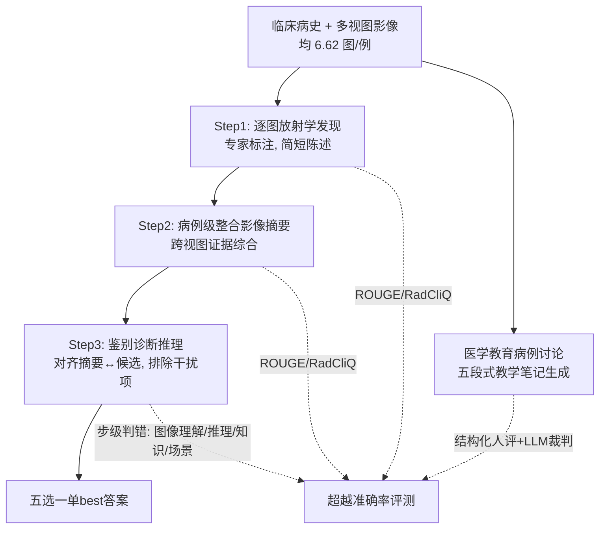

# Medical Thinking with Multiple Images

**会议**: ICLR 2026  
**OpenReview**: [https://openreview.net/forum?id=h2p5eOFpcF](https://openreview.net/forum?id=h2p5eOFpcF)  
**代码**: [https://github.com/benluwang/MedThinkVQA](https://github.com/benluwang/MedThinkVQA)  
**数据集**: [https://huggingface.co/datasets/bio-nlp-umass/MedThinkVQA](https://huggingface.co/datasets/bio-nlp-umass/MedThinkVQA)  
**领域**: 多模态推理 / 医学 VLM / 评测基准  
**关键词**: 多图诊断推理, think-with-images, 医学 VQA, 跨视图证据融合, 超越准确率评估  

## 一句话总结
提出 MedThinkVQA——首个平均每例 6.62 张图、专家标注的多图医学诊断推理基准，并通过三步式"看图思考"监督与超越准确率的步级评测，揭示当下顶级多模态大模型的真正瓶颈不是推理链长度，而是跨视图地"提取-对齐-组合"视觉证据的能力。

## 研究背景与动机
**领域现状**：LLM/VLM 在各类医学 QA 基准上分数节节攀升，很多考试型设置已逼近饱和。但现有医学多模态基准几乎都是"单图单问"——VQA-Rad、PMC-VQA、OmniMedVQA、甚至最新的 MedXpertQA-MM，平均每例图像数都 ≤1.43。

**现有痛点**：真实临床诊断从来不是看一张图回答一个问题。医生会先读临床病史，逐张审视多个视图（如 X 光 + CT + MRI），跨图整合证据，最后才收敛到鉴别诊断。高准确率的"最终答案"可能掩盖了模型在图像理解与跨图整合上的大量失败——即"答对了但理由是错的"。

**核心矛盾**：现有基准既无法逼模型真正做跨图证据聚合（图太少、有文本捷径），也无法定位失败到底发生在"读图""跨视图融合"还是"高层推理"哪一环（只给一个准确率数字）。

**本文目标**：构建一个"以临床真实方式考诊断"的基准——多张有信息量的视图 + 显式的中间推理监督 + 步级可定位的评测，从而把诊断过程变得**可观测**而非只看终点。

**核心 idea**：**[Think-with-Images 三步监督]** 把诊断拆成"逐图发现 → 病例级整合摘要 → 鉴别诊断推理"三个被显式监督的步骤；**[超越准确率评测]** 用自动指标（ROUGE/RadCliQ）+ 结构化步级判错 + 教学价值评分，把失败定位到具体环节；**[图像密集 + 专家标注语料]** 8067 例、均 6.62 图/例，全部源自专家评审的真实放射学教学病例。

## 方法详解

### 整体框架
MedThinkVQA 改编自欧洲放射学会的同行评审教学库 **Eurorad**：每个病例自带临床病史、多图集合（均 6.62 图）、放射科医生逐图标注、病例级整合影像摘要、专家推理与教学笔记、最终诊断与鉴别诊断列表。整套数据围绕"看多图思考"（Think-with-Images, TwI）设计：把诊断显式拆为三步并分别监督，同时配一套不止看准确率的诊断式评测。

### 关键设计

**1. Think-with-Images 三步式诊断监督：把"黑箱诊断"拆成可监督的证据链。** 模型被要求先对每张图产出逐图放射学发现（detect 并命名关键征象），再把跨视图证据综合成单一的病例级整合影像摘要，最后做鉴别诊断推理——对齐摘要与各候选诊断，用基于图像的论据逐一排除干扰项，选出最一致的答案。这一拆分让诊断过程从"只评最终答案"变成"每步都能被检查"，也正是后续把瓶颈精确归因到"读图"环节的前提。每例最终以五选一单best MCQ 呈现，真值是病例的最终诊断。

**2. 抗捷径的测试集构造：逼模型真正用图而非钻文本空子。** 为保证图像确实必要，测试集经过多道过滤：(i) 仅保留专家鉴别诊断 ≥5 条的病例，正确诊断作 key、鉴别项作干扰池，确保所有选项都来自专家而非凭空生成；(ii) 泄漏检测，剔除临床病史里直接出现诊断名/同义词/"疑似 X"等线索的 137 例；(iii) 文本可解过滤——先用 4 个大文本模型（Qwen3-Next-80B、GPT-oss-120B 等）全答对则删（去 1074 例），再用 4 个 SFT 小模型复筛（去 180 例），确保连小模型也无法纯靠文本答对；(iv) 表面偏置消除——发现超半数病例正确答案恰好是最长选项（远超 20% 均匀期望，模型在这类题上高 5–10 分），故按选项长度剪枝并再平衡 ICD 疾病类别与影像模态分布。

**3. 超越准确率的诊断式评测：把失败定位到具体环节。** Step1–2 用 radiology-report 评测里的 ROUGE（词面重叠）与 RadCliQ（更贴近放射科医生偏好）对照专家发现/摘要打分；Step3 用 GPT-5-mini 把模型解释切成原子步，再用 GPT-5 作裁判逐步标注"事实正确性 / 是否对最终诊断关键 / 若错则归入四类错误（临床场景误解、图像理解错、医学知识错、推理错）"。两名医学专家在 50 例 202 步上做人评，Image Understanding Err 占主导，Cohen's $\kappa=0.82$，人–LLM 裁判一致性 $\kappa=0.70\sim0.84$，验证了自动裁判可靠。

**4. 受控输入消融：直接证明瓶颈在"看图"而非"想"。** 设计对照实验——给模型喂入专家写的影像文本（逐图 Hint / 整合摘要）vs. 让模型自己先写再用。专家整合摘要一加上，四个模型准确率平均暴涨 +41.5~+50.5 分（1.92×~2.60× 基线）；而换成模型自产中间文本则普遍掉分（最多 −12.5）。这把"一旦视觉证据被正确口语化、剩下的语言推理基本够用"这一结论钉死，从而论证核心障碍是从多视图中提取、结构化像素级放射学证据。

## 实验关键数据

### 主实验（测试集 720 例，五选一，随机基线 20%）

| 模型 | 准确率 | 类型 |
|------|--------|------|
| Claude-4.6-Opus | **57.2%** | 闭源 thinking |
| Gemini-3-Pro | 55.3% | 闭源 thinking |
| GPT-5.2-xhigh | 54.9% | 闭源 thinking |
| GPT-5.2 (non-think) | 49.9% | 闭源 |
| Qwen3.5-397B-A17B | 52.2% | 开源 MoE 最强 |
| Qwen3.5-27B | 50.6% | 开源 |
| Lingshu-32B | 43.2% | 开源医学 |
| InternVL3.5-38B | 40.7% | 开源 |
| GPT-5-mini | 39.7% | 闭源小 |
| MedGemma-27B | 31.8% | 开源医学 |
| GPT-5-nano | 30.8% | 闭源小 |
| Phi-4 | 22.2% | 开源 |

最强模型也仅 ~57%，远低于专家复核子集上的临床医生水平，headroom 巨大。

### 消融/受控输入实验（喂专家影像文本 vs. 自产）

| 设置 | 对准确率影响 | 含义 |
|------|--------------|------|
| + 专家整合影像摘要 | +41.5~+50.5 分（最高 2.60×） | 视觉证据被正确口语化后，语言推理基本够用 |
| + 专家逐图 Hint（已有摘要时） | 仅 +0.5~5.0 分 | 结构化摘要 > caption 式描述 |
| 自产 Hint/Summary 再用 | −3.0~−12.5 分 | 自产文本 ROUGE-L 仅 ≈0.13–0.16，噪声反而误导 |
| Inference-time thinking | +5~7 分（GPT-5.2 49.9→54.9） | 有用但不能消除核心难度 |

### 关键发现
- **瓶颈是"读图"不是"想"**：步级分析显示 >70% 错误来自图像阅读与跨视图整合；关键步上图像理解错占 69.23%。
- **推理是条件性增益**：准确率随图像数单调上升、随推理 token 上升，但额外推理预算只在"视觉证据基底已可靠"时才有用——基底嘈杂时更长推理甚至放大误读（Qwen3.5-0.8B 因视觉能力弱，推理版反而比非推理版更差）。
- **基准真考多图**：专家审计 88.05% 图像对终诊断有支撑，测试集均 2.30 种影像模态/例、30.4% 为纵向随访病例；MELD 检测无严重数据污染。

## 亮点与洞察
- **图像密度的质变**：从 ≤1.43 图/例跃到 6.62 图/例（≥4.5×），不只是规模，而是把任务从"在一张图里找线索"变成"跨视图、跨模态、跨时间整合分布式证据"——这是真正贴近临床的范式转变。
- **诊断断言精准而克制**：用受控输入消融 + 步级判错双重证据，把"大模型医学诊断弱"这一笼统印象，收敛成一个可证伪、可操作的具体诊断——弱在 grounding，不弱在 reasoning length。这对后续方法设计（该补视觉证据提取而非堆推理 token）极有指导价值。
- **可观测性设计**：三步监督 + 步级错误归因，让基准从"打分器"升级为"诊断器"，能告诉研究者模型到底卡在哪一环。
- **Table 1 全勾**：专家标注、真实临床场景、多模态影像、纵向随访、TwI 中间监督、超越准确率评测——是表中唯一同时满足全部条件的基准。

## 局限与展望
- **数据源单一**：全部来自 Eurorad 教学库，病例偏"有教学价值/典型/疑难"，可能与一线常规病例的分布有偏；且 CC BY-NC-SA 4.0 仅限研究教育、不可商用。
- **裁判依赖大模型**：步级判错与切步都靠 GPT-5 系列，虽有人评校准（κ 较高），但裁判自身的偏好/盲区可能系统性影响错误归因。
- **未给出解决方案**：论文定位是诊断瓶颈而非解决瓶颈——如何真正提升跨视图视觉 grounding（更强视觉编码器？显式证据对齐模块？）留待后续。
- **MCQ 形式约束**：五选一虽便于评测，但与开放式临床诊断仍有距离；选项剪枝/再平衡虽降偏置，也可能引入新的人为分布。

## 相关工作与启发
- **对比医学多模态基准**：相较 PMC-VQA、OmniMedVQA、MedXpertQA-MM 等单图基准，本文用"多图 + 中间监督 + 步级评测"重新定义了任务难度；与 MedFrameQA（3.24 图）、Medical-Diff-VQA（纵向但 1.23 图）相比在图像密度与专家标注上更进一步。
- **对接超越准确率评测**：延续 radiology-report 评测（RadCliQ）与"答案级打分会掩盖临床推理失败"的近期证据，把步级审计 + 错误归因引入医学诊断。
- **启发**：(1) 对任何"看图思考"任务，先验证视觉证据是否被正确提取，再谈推理链——inference-time scaling 是次要杠杆；(2) 自产中间表征在 grounding 不可靠时是负担而非帮助，提示"思考链"需以可靠感知为前提；(3) 基准设计应主动消除表面捷径（选项长度偏置、文本可解性），否则高分可能是幻觉。

## 评分
- **新颖性**: ⭐⭐⭐⭐⭐ 首个真正图像密集（6.62 图/例）、专家标注、带三步 TwI 中间监督与超越准确率评测的多图医学诊断基准，Table 1 唯一全勾，范式转变明确。
- **实验充分度**: ⭐⭐⭐⭐⭐ 覆盖 20+ 闭源/开源/医学模型，配受控输入消融、步级人评（κ=0.82）、视觉/推理双轴 scaling 分析与数据污染检测，证据链完整且互证。
- **写作质量**: ⭐⭐⭐⭐ 论证逻辑清晰、断言克制可证伪，图表信息密集；少数结论分散在多处需读者自行串联。
- **价值**: ⭐⭐⭐⭐⭐ 把"大模型医学诊断弱"精确诊断为 grounding 瓶颈，为后续方法指明方向；数据集 + 评测脚本 + leaderboard 全开放，对医学 VLM 社区是高复用度的基础设施。

<!-- RELATED:START -->

## 相关论文

- [\[ICLR 2026\] DeepEyes: Incentivizing "Thinking with Images" via Reinforcement Learning](deepeyes_incentivizing_thinking_with_images_via_reinforcement_learning.md)
- [\[CVPR 2026\] Thinking with Programming Vision: Towards a Unified View for Thinking with Images](../../CVPR2026/vlm_reasoning/thinking_with_programming_vision_towards_a_unified_view_for_thinking_with_images.md)
- [\[ICLR 2026\] Thyme: Think Beyond Images](thyme_think_beyond_images.md)
- [\[ICLR 2026\] MedVR: Annotation-Free Medical Visual Reasoning via Agentic Reinforcement Learning](medvr_annotation-free_medical_visual_reasoning_via_agentic_reinforcement_learnin.md)
- [\[ICLR 2026\] GIR-Bench: Versatile Benchmark for Generating Images with Reasoning](gir-bench_versatile_benchmark_for_generating_images_with_reasoning.md)

<!-- RELATED:END -->
