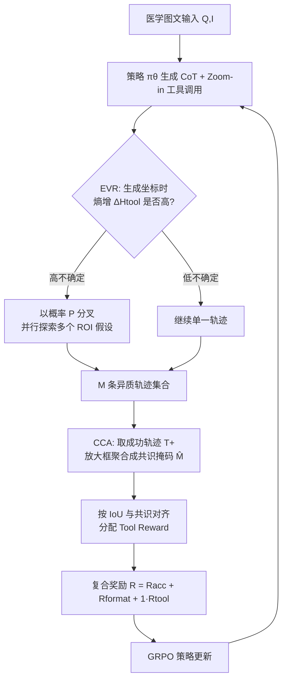

# MedVR: Annotation-Free Medical Visual Reasoning via Agentic Reinforcement Learning

**会议**: ICLR 2026  
**OpenReview**: [https://openreview.net/forum?id=cK35kNVm5r](https://openreview.net/forum?id=cK35kNVm5r)  
**代码**: 待确认  
**领域**: 多模态 VLM / 医学视觉推理  
**关键词**: 医学 VLM, 视觉推理, 工具调用, 强化学习, GRPO, 无标注监督, 熵引导探索  

## 一句话总结
MedVR 把医学 VLM 训练成会"放大看图"的智能体，用熵引导探索（EVR）找出该重新看图的时刻、用多条成功轨迹的共识（CCA）自动造出视觉 grounding 的伪标签，**完全不需要任何中间步骤人工标注**就在 6 个医学 VQA 基准上拿到 SOTA。

## 研究背景与动机
- **领域现状**：RLVR（可验证奖励强化学习）已经显著提升了通用 VLM 的推理能力，医学界自然想把它搬过来武装医学 VLM（如 Med-R1、MedVLM-R1）。
- **现有痛点**：主流医学 RLVR 几乎全在**纯文本域**做 chain-of-thought 推理，但临床诊断（定位细小病灶、比较组织密度、解读血流、量化解剖结构）天然需要细粒度的视觉 grounding——纯文本 CoT 给不了。更糟的是纯文本推理容易**视觉幻觉**：模型靠语言先验编答案而无视图像，在安全攸关的医疗场景里风险不可接受。
- **核心矛盾**：通用域已有 DeepEyes、Pixel-Reasoner 这类"会缩放看图"的工具增强推理框架，但搬到医学有两难——(1) 通用 VLM 缺医学领域知识，对细微病变的 zero-shot 定位不可靠；(2) 要学会有意义的视觉 grounding 通常得**对中间步骤做细粒度监督**，而医学 bbox 标注极其昂贵稀缺，形成"要监督才能学、但监督拿不到"的悖论。
- **本文目标**：实现**annotation-free 的医学视觉推理**——让模型像临床医生一样，把文字推敲与图像操作（放大、圈 ROI）自然交错，每一步关键分析都有可验证的视觉证据支撑，且不依赖任何中间步骤标注。
- **核心 idea**：**用模型自己的不确定性当"该看哪"的探索信号，用多条成功轨迹的共识当"看对没"的监督信号**——两者合成一条完全自监督的视觉推理课程，把昂贵的人工 grounding 标注彻底绕开。

## 方法详解

### 整体框架
MedVR 把 VLM 当成一个策略 $\pi_\theta$ 的智能体，用 GRPO 优化期望累积奖励（带 KL 约束）。智能体的动作空间除了生成 CoT token，还能调用 `Zoom-in` 工具裁剪指定图像区域，裁出的视觉证据被编码成特殊 token 回填进上下文，条件后续所有推理。训练靠两个无标注机制协同：**EVR**（先验探索器）根据生成工具坐标时的 token 熵升高来判断"模型对该看哪没把握"，在这些高不确定点上分叉出多条并行轨迹；**CCA**（后验蒸馏器）把成功轨迹的放大框聚合成共识热图，作为自生成伪标签去奖励那些"看了对的地方"的轨迹。

### 关键设计

**1. 复合终端奖励：把"答对"和"看对"拆开但挂钩。** 没有逐步监督时，奖励必须在轨迹终点给出整体评价。MedVR 设计 $R(T) = R_{\text{acc}}(T) + R_{\text{format}}(T) + \mathbb{1}(R_{\text{acc}}(T) > 0) \cdot R_{\text{tool}}(T)$：主奖励看最终答案对错，小幅格式惩罚约束输出合法性，关键是工具奖励 $R_{\text{tool}}$ 由指示函数门控——**只有答对的轨迹才有资格领工具奖励**。这个条件结构很重要，它逼模型去发现"视觉动作"与"成功结果"之间的因果关系，从而压制那种乱放大、放大了也没用的投机式工具调用。

**2. 熵引导视觉重定位（EVR）：让不确定性告诉模型"该重新看图了"。** 核心前提是：生成 `Zoom-in` 坐标 token 时若熵升高，说明模型知道"需要看图"但拿不准"该看哪个 ROI"。MedVR 持续监控 token 级熵 $H_t = -\sum_j p_{t,j}\log p_{t,j}$，先在起始 token 上算一个基线熵 $H_{\text{base}}$，再在工具相关 token 的滑窗上算滚动熵 $H_{\text{tool}}$，跟踪熵增 $\Delta H_{\text{tool}} = H_{\text{tool}} - H_{\text{base}}$。一旦 $\Delta H_{\text{tool}}$ 显著为正，就以分叉概率 $P = P_{\text{base}} + \gamma \Delta H_{\text{tool}}$ 触发**自适应分叉**：fork 当前生成状态、花一份预算开一条新轨迹，不同分支可采样不同坐标，从而在"模型最没把握的地方"集中探索多个视觉假设。rollout 预算一半给基础集、一半留给这种定向探索，输出是 $M$ 条体现不同视觉搜索假设的异质轨迹。

**3. 共识信用分配（CCA）：用"群体智慧"造伪标签。** EVR 产出多样轨迹后，难题是没有 GT 空间标注怎么奖励有益的中间视觉动作。CCA 的假设是：如果多条不同推理路径都答对、且都反复看同一图像区域，那这个区域极可能就是因果相关的解题证据。它先取成功轨迹子集 $T^+$，把每条轨迹所有 `Zoom-in` 框的并集栅格化成二值掩码 $M_i$，聚合成共识热图 $C = \sum_{T_i \in T^+} M_i$，再用多数票二值化 $\hat{M}(u,v) = \mathbb{1}(C(u,v) > |T^+|/2)$ 得到共识掩码。然后对每条成功轨迹按它与共识的 IoU 发奖：$R_{\text{tool}}(T_j) = 1.0$ 若 $\text{IoU}(M_j, \hat{M}) > \eta$，否则 $0.5$。这个分层结构给"答对"一个 0.5 底分、给"答对且看的地方跟集体共识一致"额外 0.5 奖励——奖励的不只是结果正确，更是视觉过程的**可验证性与一致性**。EVR 当先验探索器、CCA 当后验蒸馏器，二者闭环成完全自监督的学习循环。

## 实验关键数据

### 主实验
Qwen2.5-VL-7B 为 backbone，GRPO 训练 64 轮（32×H20），6 个医学 VQA 基准（†/⋄ 为 OOD 零样本）：

| 模型 | OMVQA | PMC-VQA⋄ | MedXQA⋄ | 通用 Avg. | VQA-RAD | SLAKE | PathVQA⋄ | 模态 Avg. |
|------|-------|----------|---------|-----------|---------|-------|----------|-----------|
| Qwen2.5-VL-7B | 59.0 | 51.2 | 22.3 | 44.2 | 64.5 | 67.2 | 44.1 | 58.6 |
| InternVL3-14B | 81.9 | 54.1 | 23.1 | 53.0 | 66.3 | 72.8 | 48.0 | 62.4 |
| MedGemma-4B | 70.5 | 49.9 | 15.4 | 45.3 | 72.5 | 76.4 | 48.8 | 65.9 |
| Lingshu-7B | 84.2 | 54.3 | 26.5 | 55.0 | 67.9 | 83.1 | 61.9 | 70.3 |
| **MedVR (Ours)** | **96.8** | 54.3 | 26.4 | **59.2** | **74.4** | **85.3** | **62.3** | **74.0** |

MedVR 在多选与自由文本两类任务都拿下 SOTA 或并列最优，OOD 集泛化突出，且 7B 规模就胜过领域大规模预训练的 Lingshu-7B 和更大的 InternVL3-14B。

### 消融实验
逐步叠加三个核心组件（文本 RL 基线起步）：

| Zoom-in | EVR | CCA | OmniMedVQA | PMC-VQA | MedXpertQA |
|---------|-----|-----|-----------|---------|------------|
| — | — | — | 94.50 | 53.40 | 21.38 |
| ✓ | — | — | 94.31 | 52.62 | 22.26 |
| ✓ | ✓ | — | 95.38 | 53.81 | 24.73 |
| ✓ | — | ✓ | 96.55 | 53.30 | 23.09 |
| ✓ | ✓ | ✓ | **96.77** | **54.31** | **26.38** |

### 关键发现
- **裸工具反而掉点**：只加 Zoom-in 不加 EVR/CCA 在 OmniMedVQA/PMC-VQA 上轻微下降——VLM 不具备零样本用好新工具的能力，没有奖励/探索信号时工具反而引入无效搜索路径。
- **EVR 主攻 OOD、CCA 主攻 in-domain**：EVR 单独加入对 OOD 基准增益最大（提升鲁棒泛化），CCA 单独加入对 in-domain 的 OmniMedVQA 增益最大（强化可靠 grounding）；二者协同才全面最优。
- **熵权重 $\gamma$ 有甜点**：$\gamma=0$ 退化成随机采样，性能随 $\gamma$ 单调上升到 $\gamma=0.5$ 达峰，再大则过度贪心、探索多样性被压制而下降。
- **奖励设计层级清晰**：w/o Tool Reward < Unconditional < Default（挂钩准确率）< CCA（跨轨迹共识细粒度奖励），印证"奖励可复现的视觉过程"比只奖结果更有效。
- **可扩展性**：rollout 数越多，CCA 能蒸馏出越可靠的伪监督，准确率持续提升。

## 亮点与洞察
- **把"不确定性"和"群体共识"分别用作探索和监督，二者天然互补**：一个解决"该看哪"（先验），一个解决"看对没"（后验），合起来恰好替代了缺失的中间步骤标注，设计相当优雅。
- **真正 annotation-free**：医学 bbox 标注稀缺昂贵是行业级痛点，MedVR 完全用模型自己的成功轨迹造伪标签，把这个瓶颈绕开，临床落地可行性大增。
- **工具奖励的门控（答对才发奖）+ 分层 IoU 奖励**，从机制上压制投机式工具调用、鼓励可验证的视觉过程，比"无脑奖励工具使用"高明。
- **7B 胜过大规模预训练模型**，说明在医学推理上"改进推理过程"比"堆预训练数据"更划算。

## 局限与展望
- **只用了 Zoom-in 一个视觉操作**，临床真实工作流还包括 windowing 调窗、测量、多切片对比等，工具空间还很窄。
- **CCA 共识假设的脆弱性**：当多条轨迹"一致地看错地方"也能答对时，共识伪标签可能强化错误 grounding；论文未深入分析共识与真实病灶的对齐度。
- **依赖 OmniMedVQA 等现有基准**，多为多选/短答，跟真实诊断报告生成的复杂度仍有距离。
- **计算开销**：EVR 的分叉探索 + 大 rollout 预算（16 轨迹/prompt、32 GPU）成本不低，可扩展性虽好但门槛高。

## 相关工作与启发
- **医学 VLM 推理**：LLaVA-Med、Med-Flamingo、HuatuoGPT-Vision 走 SFT 路线，Med-R1、MedVLM-R1 引入 RL 但仍停在纯文本 CoT；MedVR 是首个给医学 VLM 注入显式、可执行视觉操作推理的工作。
- **通用域视觉推理**：DeepEyes、Pixel-Reasoner、Chain-of-Focus 实现了缩放/ROI 选择等迭代视觉操作，但都预设了 grounding 标注做冷启动；MedVR 直接挑战这个前提，无需任何 grounding 监督。
- **启发**：用"模型内在熵 + 多轨迹共识"取代人工中间监督的思路，可迁移到任何标注昂贵、但能批量 rollout + 验证终端答案的智能体任务（如科学图表推理、遥感判读）。

## 评分
- **新颖性**: ⭐⭐⭐⭐ 首个 annotation-free 医学视觉推理框架，EVR+CCA 用熵和共识替代中间监督的组合有原创性。
- **实验充分度**: ⭐⭐⭐⭐ 6 个基准含 OOD、组件/超参/奖励设计/可扩展性消融完整，但视觉工具单一、共识伪标签与真值对齐缺定量验证。
- **写作质量**: ⭐⭐⭐⭐ 动机—矛盾—方法逻辑清晰，先验/后验的类比讲得到位，图示与公式配合好。
- **价值**: ⭐⭐⭐⭐ 直击医学标注稀缺这一行业痛点，7B 超大模型、临床可验证性强，实用价值高。

<!-- RELATED:START -->

## 相关论文

- [\[ICLR 2026\] VisionReasoner: Unified Reasoning-Integrated Visual Perception via Reinforcement Learning](visionreasoner_unified_reasoning-integrated_visual_perception_via_reinforcement_.md)
- [\[ICLR 2026\] DeepEyes: Incentivizing "Thinking with Images" via Reinforcement Learning](deepeyes_incentivizing_thinking_with_images_via_reinforcement_learning.md)
- [\[ICLR 2026\] ReVisual-R1: Advancing Multimodal Reasoning from Optimized Cold Start to Staged Reinforcement Learning](revisual-r1_advancing_multimodal_reasoning_from_optimized_cold_start_to_staged_r.md)
- [\[ICLR 2026\] Agentic Jigsaw Interaction Learning for Enhancing Visual Perception and Reasoning in Vision-Language Models](agentic_jigsaw_interaction_learning_for_enhancing_visual_perception_and_reasonin.md)
- [\[ICLR 2026\] Medical Thinking with Multiple Images](medical_thinking_with_multiple_images.md)

<!-- RELATED:END -->
