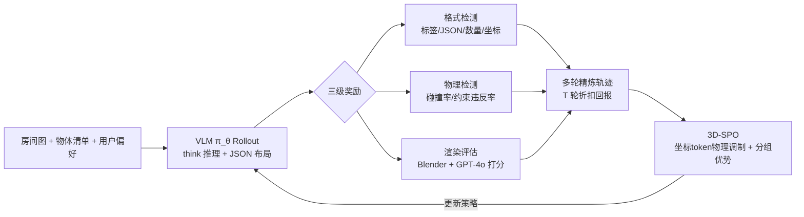

# MetaSpatial: Reinforcing 3D Spatial Reasoning in VLMs for the Metaverse

**会议**: ICLR 2026  
**OpenReview**: [https://openreview.net/forum?id=EdQzLC0Zra](https://openreview.net/forum?id=EdQzLC0Zra)  
**代码**: 待确认  
**领域**: VLM 推理 / 3D 场景布局生成 / 强化学习  
**关键词**: 3D 空间推理, VLM, 强化学习, GRPO, 场景布局生成, 物理约束, 多轮精炼  

## 一句话总结
MetaSpatial 把 3D 室内场景布局生成建模成 RL 策略学习问题，提出 3D-SPO 算法——在 GRPO 基础上对坐标 token 注入物理感知的优势调制，并叠加训练期多轮精炼轨迹的折扣回报，让 VLM 无需任何真值标注或后处理就能直接吐出物理合理、格式稳定的 (x,y,z) 布局。

## 研究背景与动机
**领域现状**：用 VLM/LLM 做 3D 场景布局生成（给定房间图、物体清单、用户偏好，输出每个物体的 (x,y,z) 坐标）是元宇宙、AR/VR、游戏设计的刚需能力。现有路线主要两类：一是推理期多智能体/多轮搜索精炼（如 LayoutGPT、I-Design），二是用 VLM 多模态推理配合可微优化做后处理（如 LayoutVLM）。

**现有痛点**：第一，VLM 本身缺乏内化的 3D 空间推理能力，生成的布局常出现物体悬浮、互相穿模、超出房间边界，必须依赖大量后处理（可微优化、规则修复）才能用，又慢又容易死锁不收敛。第二，想用 SFT 直接教模型生成布局，却撞上"没有唯一正确答案"的本质难题。

**核心矛盾**：布局生成是一个**病态（ill-posed）问题**——同一个房间和用户指令下，沙发靠窗还是靠墙都合理，且坐标是连续的、小幅偏移只要不碰撞就可接受。SFT 依赖单一目标标注，根本无法覆盖这种"合理布局的分布"，于是泛化能力被钉死在标注样本上。

**本文目标**：摆脱真值标注和后处理，让 VLM 通过与"空间反馈环境"交互、从评价式奖励中学习，内化物理约束和布局原则，实时生成连贯可用的 3D 布局。

**核心 idea**：**用 RL 替代 SFT**——把布局生成看成策略优化，奖励来自格式/物理/渲染三级检测而非固定标签；并在 GRPO 框架上做两点关键改造（**坐标 token 的物理感知优势调制** + **训练期多轮精炼轨迹的折扣回报**），即提出的 3D-SPO 算法。

## 方法详解

### 整体框架
给定房间图 $r$、物体候选集 $O=\{o_1,\dots,o_n\}$（每个标注类别/尺寸/材质）和可选用户偏好 $u$，VLM 策略 $\pi_\theta$ 生成一段 `<think>` 推理轨迹加一段 `<answer>` 内的 JSON 布局 $l=\{(o_i,x_i,y_i,z_i)\}$。该布局经过三级奖励评估（格式检测、物理检测、渲染评估），并通过训练期多轮精炼形成轨迹，最后用 3D-SPO 把这些分组轨迹聚合优化策略。整条管线无需真值坐标，靠交互反馈驱动。

### 关键设计
**1. 三级奖励设计：在无标注下提供分层可学梯度。** 总奖励是三项加权和 $R(l_t)=\lambda_1 R_{\text{format}}+\lambda_2 R_{\text{physics}}+\lambda_3 R_{\text{render}}$。格式奖励不是二值的，而是分级的 $R_{\text{format}}\in\{0,0.1,0.5,1.0\}$——标签结构不符给 0、JSON 解析失败给 0.1、物体数量或 ID 不匹配或坐标不全给 0.5、全部通过给 1，这样即便部分正确也有有意义的梯度。物理奖励把 JSON 转成场景图做规则检测，$R_{\text{physics}}=-\alpha\cdot\text{CollisionRatio}-\beta\cdot\text{ConstraintRatio}$（默认 $\alpha=\beta=0.2$），分别惩罚物体穿模和越界悬浮。渲染奖励则把布局用 Blender 渲成图，交给 GPT-4o 当裁判，从真实感、功能性、布局合理性、配色、整体美感五个维度各打 1–10 分，归一化为 $R_{\text{render}}=\frac{1}{50}\sum_{i=1}^5 \text{Grade}_i$。训练时还做**分阶段调度**：早期重格式奖励解决基本指令遵循，格式准确率超过 0.9 后加大物理奖励，渲染奖励因为运行慢留到后期才引入。

**2. 训练期多轮精炼轨迹：把单步 rollout 变成可比较的折扣轨迹。** 不同于推理期才做的多轮搜索，MetaSpatial 在**训练阶段**就为每个样本生成 $T$ 轮精炼轨迹 $\mathcal{T}=\{rol_1,\dots,rol_T\}$——首轮基于空房间画布生成初始布局，后续每轮把上一轮渲染出的场景作为新的视觉上下文反馈进去，让模型反思并改进。轨迹的总回报采用**折扣累积** $R_g=\sum_{i=1}^T \gamma^t R(l_{g,t})$，$\gamma\in(0,1)$ 给早期轮次更高权重。这一折扣设计有意逼模型"尽早出好布局"而非靠拉长迭代刷分，也避免长序列被天然偏好。多轮轨迹的价值在于：暴露多样化的布局修订增强鲁棒性、支持轨迹内（而非只是样本间）的奖励比较、每样本多个学习信号加速收敛。

**3. 3D-SPO 的双层优势估计：在 GRPO 上对坐标 token 做物理感知调制。** 这是论文核心。对每个样本并行采 $G$ 条轨迹做组内相对比较（沿用 GRPO 用组均值当 baseline、不要 value model 的思路）。关键创新在优势估计：先用 **3D masking** 机制定位所有物体的 x/y/z 坐标 token；对每个物体由其碰撞率和约束率算出物理惩罚，加权后乘到原始奖励上得到调整后的轨迹奖励 $\hat R_g$，而非坐标 token 保持原奖励——直观地说，最终奖励 $=$ 原奖励 $\times(\text{3D Masking}\times\text{物理惩罚}+(1-\text{3D Masking}))$，让坐标位置的学习被物理反馈直接驱动。随后用原始组均值 $\mu$ 和标准差 $\sigma$ 归一化得到优势 $\hat A^{3D}_{i,k}=(\hat R_{i,k}-\mu)/\sigma$。最终目标函数是把 GRPO 的 clip 目标里的优势换成这个物理感知优势：
$$J_{\text{3D-SPO}}(\theta)=\mathbb{E}\Big[\frac{1}{G}\sum_{i=1}^G\frac{1}{|T_i|}\sum_{k=1}^{|T_i|}\min\big(r_{i,k}\hat A^{3D}_{i,k},\,\text{clip}(r_{i,k},1-\epsilon,1+\epsilon)\hat A^{3D}_{i,k}\big)-\beta D_{KL}[\pi_\theta\|\pi_{\text{ref}}]\Big]$$
其中 $r_{i,k}$ 是新旧策略的似然比。这样既在 token 级聚焦坐标做局部空间约束，又在轨迹级保持全局奖励趋势的稳定，实现局部+全局的双层空间推理。

## 实验关键数据
基座为 Qwen2.5-VL 3B / 7B，在自建室内 3D 场景数据集上训练（**只有房间描述和资产库，无真值坐标**），用 Blender 渲染、GPT-4o 感知打分。

### 主实验表格

| Model | Format ↑ | GPT-4o Score ↑ | Collision ↓ | Constraint ↓ | Overall |
|---|---|---|---|---|---|
| Qwen 3B | 0.12 | 0.03 | 79.0% | 100% | -0.27 |
| Qwen 3B + MetaSpatial | 0.49 | 0.18 | 68.5% | 100% | -0.09 |
| Qwen 7B | 0.85 | 0.35 | 38.2% | 95.5% | 0.51 |
| **Qwen 7B + MetaSpatial** | **0.98** | **0.62** | **11.5%** | **70.8%** | **0.95** |
| GPT-4o | 0.95 | 0.58 | 26.3% | 79.4% | 0.87 |
| I-Design | - | 0.64 | 22.5% | 83.3% | 0.92 |
| LayoutGPT | - | 0.55 | 20.7% | 80.2% | 0.85 |

MetaSpatial 让 7B 的碰撞率从 38.2% 砍到 11.5%、综合分从 0.51 升到 0.95，**全面超过 GPT-4o 和多轮系统 I-Design/LayoutGPT**（尤其物理可行性）；大模型获益更明显。

### 消融实验表格
奖励组件消融（Qwen2.5-VL 7B）：

| Reward Setting | Format ↑ | GPT-4o ↑ | Collision ↓ | Constraint ↓ |
|---|---|---|---|---|
| Full Reward (Ours) | 0.98 | 0.62 | 11.5% | 70.8% |
| w/o Rendering | 0.96 | 0.45 | 14.5% | 80.5% |
| w/o Physics | 0.97 | 0.40 | 35.0% | 89.6% |
| w/o Format | 0.72 | 0.41 | 16.3% | 84.8% |

算法与精炼深度对比（节选）：

| Method | Format ↑ | GPT-4o ↑ | Collision ↓ | Constraint ↓ |
|---|---|---|---|---|
| One-step RL (PPO) | 0.97 | 0.44 | 26.6% | 83.0% |
| GRPO w/ T=5 | 0.98 | 0.58 | 13.7% | 76.2% |
| **3D-SPO w/ T=5** | **0.98** | **0.62** | **11.5%** | **70.8%** |
| 3D-SPO w/ T=7 | 0.99 | 0.59 | 13.9% | 75.2% |

### 关键发现
- 去掉物理奖励碰撞率飙到 35%、去掉渲染奖励 GPT-4o 分掉最多，三组件缺一不可，渲染奖励对感知质量最关键。
- 在同样 $T$ 下 3D-SPO 始终优于 GRPO，验证坐标 token 物理调制的有效性；$T=5$ 是甜点，$T=7$ 反而略降，说明过深精炼边际收益递减。
- 多轮精炼整体显著优于一步 PPO，且因每样本多学习信号而收敛更快。

## 亮点与洞察
- **把"无唯一真值"从缺点转成 RL 的天然适配场景**：作者点出布局生成是病态问题，正好让评价式奖励比固定标注更合适——这是全文最漂亮的问题重述。
- **token 级物理调制**是少见的精细做法：大多数 RL 方法把所有 token 一视同仁，3D-SPO 用 3D masking 精准把物理惩罚打到坐标 token 上，体现"哪些 token 重要就重点学哪些"的思想。
- **训练期多轮精炼 + 折扣回报**巧妙解耦了"多轮"的训练价值与推理开销，且折扣项防止模型偷懒拖长迭代刷分。
- 完全无标注、无后处理就能超过 GPT-4o，对元宇宙/AR-VR 实时布局有实际工程意义。

## 局限与展望
- 渲染奖励依赖 GPT-4o 当裁判，引入闭源模型的偏好偏差与成本，且渲染慢是训练瓶颈（论文自己也只能后期才上）。
- 物理检测是规则化的碰撞/越界判断，对更复杂的物理（稳定性、支撑关系、人体可达性）尚未建模。
- 数据集为室内场景、资产集预定义且固定，未验证开放资产、室外或大规模场景的泛化（零样本仅在 Open3DVQA 上附录验证）。
- 颜色/材质评分因物体固定被人为锁定，渲染奖励的部分维度未真正参与优化。

## 相关工作与启发
- **GRPO（Shao et al., 2024）**：3D-SPO 直接继承其"组内相对优势、免 value model"的骨架，创新在双层（坐标 token + 轨迹）优势与物理调制。
- **LayoutVLM / LayoutGPT / I-Design**：代表"VLM 推理 + 后处理/多轮搜索"路线，MetaSpatial 用训练期 RL 把这些能力内化，省掉推理期重后处理。
- 启发：对任何"输出含结构化数值坐标/参数"的生成任务（CAD、UI 布局、分子构象），都可借鉴"masking 出关键数值 token + 任务特定惩罚调制优势"的范式，而非对全序列均匀施加奖励。

## 评分
- **新颖性**: ⭐⭐⭐⭐ 首个 3D 空间推理 RL 框架，token 级物理感知优势调制是真创新，但骨架仍是 GRPO 改造。
- **实验充分度**: ⭐⭐⭐⭐ 主实验+组件消融+算法对比+精炼深度扫描覆盖完整，含与 GPT-4o/多轮系统对比；规模限于 3B/7B 与室内单数据集。
- **写作质量**: ⭐⭐⭐⭐ 问题动机（病态问题→RL 适配）讲得清晰有力，方法图示充分；个别英文表述略粗糙。
- **价值**: ⭐⭐⭐⭐ 无标注无后处理即超 GPT-4o，对元宇宙/AR-VR 实时布局生成有直接落地价值，方法范式可迁移。

<!-- RELATED:START -->

## 相关论文

- [\[ICLR 2026\] SpinBench: Perspective and Rotation as a Lens on Spatial Reasoning in VLMs](spinbench_perspective_and_rotation_as_a_lens_on_spatial_reasoning_in_vlms.md)
- [\[NeurIPS 2025\] SpatialThinker: Reinforcing 3D Reasoning in Multimodal LLMs via Spatial Rewards](../../NeurIPS2025/vlm_reasoning/spatialthinker_reinforcing_3d_reasoning_in_multimodal_llms_via_spatial_rewards.md)
- [\[ICLR 2026\] Game-RL: Synthesizing Multimodal Verifiable Game Data to Boost VLMs' General Reasoning](game-rl_synthesizing_multimodal_verifiable_game_data_to_boost_vlms_general_reaso.md)
- [\[CVPR 2026\] STAR-R1: Multi-View Spatial TrAnsformation Reasoning by Reinforcing Multimodal LLMs](../../CVPR2026/vlm_reasoning/star-r1_multi-view_spatial_transformation_reasoning_by_reinforcing_multimodal_ll.md)
- [\[CVPR 2026\] SpatialStack: Layered Geometry-Language Fusion for 3D VLM Spatial Reasoning](../../CVPR2026/vlm_reasoning/spatialstack_layered_geometry-language_fusion_for_3d_vlm_spatial_reasoning.md)

<!-- RELATED:END -->
