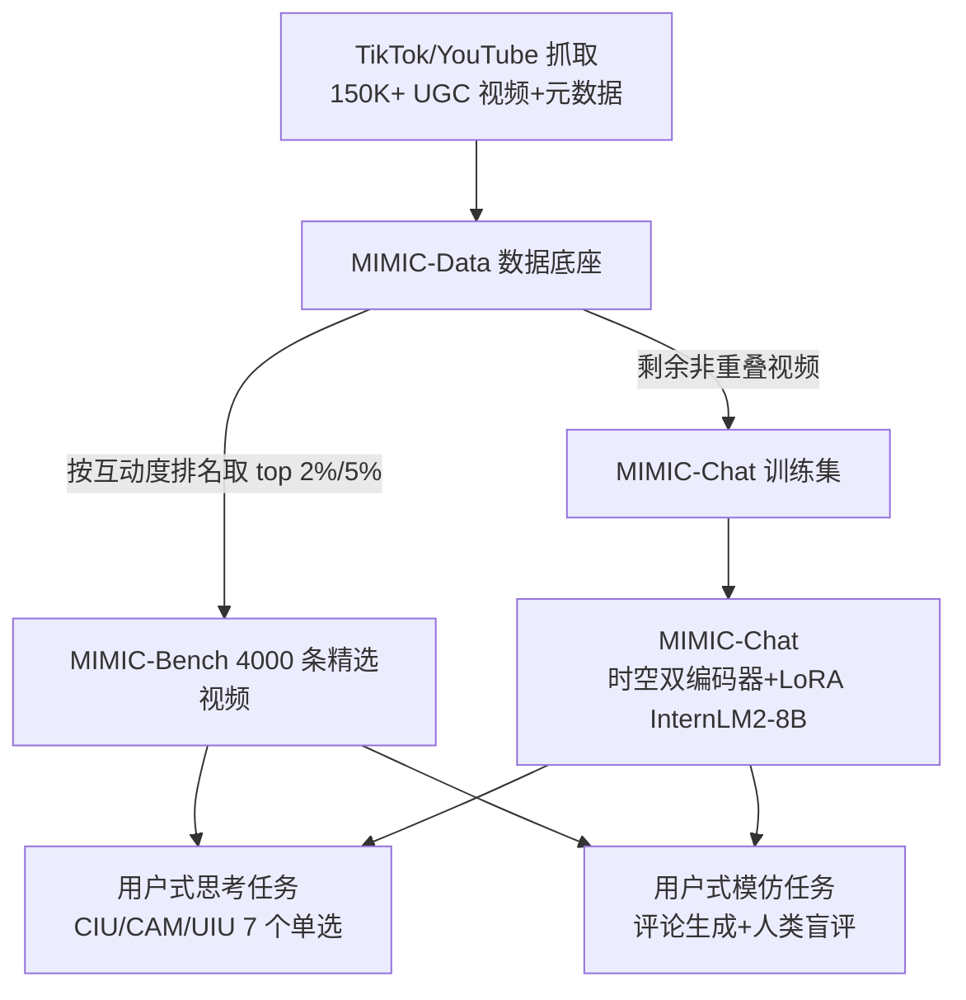

# MIMIC-Bench: Exploring the User-Like Thinking and Mimicking Capabilities of Multimodal Large Language Models

**会议**: ICLR 2026  
**OpenReview**: [https://openreview.net/forum?id=J7wc4G6woS](https://openreview.net/forum?id=J7wc4G6woS)  
**代码**: 待公开（论文发表后释出 MIMIC-Data / MIMIC-Bench / MIMIC-Chat）  
**领域**: 多模态视频理解 / 人类对齐的 MLLM 评测基准  
**关键词**: 多模态大模型, 视频理解, 用户生成内容, 评论模仿, 人类对齐, Benchmark  

## 一句话总结
本文从真实社交平台抓取 15 万+ 用户视频构建 MIMIC-Data，并精选 4000 条高互动视频做成 MIMIC-Bench，把对 MLLM 的评测从"视频里发生了什么"转向"人类会怎么想、怎么评论"，还训练了一个能生成以假乱真评论的 MIMIC-Chat。

## 研究背景与动机
- **领域现状**：MLLM 在视频理解上进展神速，已有大量 benchmark（MVBench、VideoMME、EgoSchema 等）评测视频描述、动作识别、时序推理等能力，但这些基准几乎都建立在**人工策划的纯视觉数据**和**设计者拟定的问题**之上，考的是"视频里客观发生了什么"。
- **现有痛点**：真实社交媒体场景需要的是另一种能力——模型要像**平台用户**一样去理解和反应用户生成视频（UGC）。一条用户视频天然携带标题、标签、话题、描述、分类、评论、点赞等丰富元数据，反映了"人类如何感知、解读、回应"内容，但这类**人本信号几乎没被用来评测机器智能**。EmoLLM 之类工作触及了情感，却远未覆盖人类式评论、社交互动和表达真实感。
- **核心矛盾**：现有基准衡量的是**感知/事实层面的"what happens"**，而实际应用需要的是**社会-认知层面的"how humans think/feel/react"**——两者之间存在系统性鸿沟。
- **本文目标**：构建一个扎根于真实 UGC、面向人类对齐的视频理解基准，评测 MLLM 能否做**用户式思考（user-like thinking）**与**用户式模仿（user-like mimicking）**，并探索能否训练出真正贴近人类的模型。
- **核心 idea**：**【从事实 QA 转向人本认知任务】** 用平台元数据反推认知任务（创作意图、内容属性、用户互动），并**首创"评论模仿"任务**——让模型生成评论、再由人类盲评判断"是人写的还是 AI 写的"，把主观的"像不像人"转化为可复现的评测维度。

## 方法详解

### 整体框架
工作由三件套组成：数据底座 **MIMIC-Data**（15 万+ 视频 + 全量元数据）→ 评测基准 **MIMIC-Bench**（4000 条精选视频，分"用户式思考"7 个单选任务 + "用户式模仿"评论生成任务）→ 配套模型 **MIMIC-Chat**（双分支时空编码 + LoRA 微调 InternLM2-8B）。三者在视频层严格不重叠，避免数据泄漏。

### 关键设计

**1. 三轴七任务的"用户式思考"评测：把元数据变成认知考题。** 作者没有让标注员凭空出题，而是用视频自带的真实元数据当 ground-truth，干扰项从无关视频里采样以保证语义对比、避免风格泄漏。三个认知轴对应三类人本推理：**创作意图理解（CIU）** 含标题选择、描述选择两个子任务，考模型能否揣摩创作者想表达什么；**内容属性匹配（CAM）** 含标签/话题/分类匹配，考内容级语义归类；**用户互动理解（UIU）** 含评论匹配（选出最可能是真实观众反馈的评论，ground-truth 是点赞最高的评论）和评论热度（在同一视频 top-1/10/50/100 四条评论里选最受欢迎的），后者需要对语言吸引力和集体偏好做细腻推理，是最难的一类。

**2. 首创"评论模仿"任务与生成→判断→打分闭环。** 这是全文最有新意的设计。对每条视频收集 top-5 最高赞真实评论，让 24 个 MLLM 各生成 1 条，把 5 条真人 + 24 条机器评论**匿名打乱**后交给人类标注员，每条同时判定"人写/AI 写"并打 0–5 真实感分。评测指标即**模仿质量**——被判为"人类"的比例和平均真实感分。这个 `生成 → 人类判断 → 打分` 的闭环把"像不像人"这种主观感受系统化，还顺带产出了一个可复用的"人类相似度"评测协议。三个标注员的判定一致率达 91.95%，说明评测稳定、不易受个体偏差影响。

**3. MIMIC-Chat 的时空双分支统一接口。** 模型把视频 $V$ 和任务指令 $T$ 统一编码为 $Y = \mathrm{LM}([\text{VID}],\, \phi(V)',\, [\text{SEP}],\, T)$，单选分类和开放式评论生成共用同一接口。视觉侧用**双分支**：空间分支均匀采样 8 帧抓场景级线索，时间分支吃完整帧序列保时序动态，经 TimeSformer 式时空编码得到 $\phi(V)=\{v_1,\dots,v_N\}$，再分别过空间投影器和时间投影器 $v_i' = \mathrm{MLP}(v_i)$ 对齐到语言空间，并在 LLM 内做门控融合。语言骨干为 InternLM2-Chat-8B，仅在注意力层插 LoRA 并联训投影器，冻结视觉主干。

**4. 训练-评测同构的指令微调。** 训练集 MIMIC-Data 的每条视频都配上与 MIMIC-Bench 任务同结构的 QA：七个单选任务用标准化提示（"根据视频选最合适的标签/标题/评论"）+ 四选项；评论生成任务用统一提示并附 top-5 高赞评论作参考，引导模型学情感细腻度、联想式思维与风格变化。所有样本都铸成问答对，统一用语言建模损失 $\mathcal{L}_{LM} = -\sum_{t=1}^{|Y|} \log P(y_t \mid X, y_{<t})$ 优化，单选（输出"A"）与开放生成（输出整条评论）在同一解码目标下端到端学习，无任务专属头。

## 实验关键数据

### 主实验表格（用户式思考任务，准确率 %，节选）

| 模型 | CIU-标题 | CIU-描述 | CAM-标签 | CAM-话题 | CAM-分类 | UIU-评论匹配 | UIU-评论热度 | Overall↑ |
|------|------|------|------|------|------|------|------|------|
| Video-LLaVA | 27.0 | 41.2 | 68.3 | 32.4 | 17.0 | 24.6 | 25.8 | 31.6 |
| Qwen2.5-VL-72B | 85.6 | 79.3 | 79.8 | 93.3 | 50.6 | 67.3 | 33.1 | 66.7 |
| InternVL3-78B | 87.4 | 75.1 | 80.1 | 90.5 | 51.5 | 70.2 | 33.3 | 67.5 |
| ChatGPT-4o | 87.9 | 80.3 | 83.6 | 88.7 | 51.3 | 70.9 | 33.5 | 68.2 |
| Gemini2.5-pro | 92.6 | 89.5 | 82.9 | 92.3 | 56.1 | 82.9 | 43.5 | **75.1** |
| o3 | 93.2 | 86.1 | 85.7 | 92.1 | 55.2 | 77.4 | 45.5 | 74.6 |
| **Human（上界）** | 85.1 | 77.2 | 78.7 | 90.6 | 60.0 | 85.9 | 51.1 | 73.1 |
| **MIMIC-Chat（8B, Ours）** | 90.4 | 87.1 | 86.7 | 92.5 | 55.7 | 78.3 | 43.6 | **74.1** |

### 评论模仿任务表格（人类盲评，节选）

| 评论来源 | 判为人类(%)↑ | 平均真实感分↑ |
|------|------|------|
| Video-LLaVA | 6.30 | 0.58 |
| VideoChatGPT | 18.65 | 1.06 |
| **MIMIC-Chat（Ours）** | **64.24** | **2.88** |
| Human（真人评论） | 87.57 | — |

### 关键发现
- **8B 小模型逼平前沿闭源**：MIMIC-Chat 思考任务 Overall 74.1%，排名第三，仅次于 Gemini2.5-pro（75.1%）和 o3（74.6%），却**超过所有开源大模型**（含 Qwen2.5-VL-72B、InternVL3-78B），证明任务对齐微调比单纯堆参数更有效。
- **瓶颈在社会认知而非感知**：几乎所有模型在 TiS/ToM 这类感知/表层对齐任务上表现好，但在 CaM、CoP 这类需要推断人类意图、情感、社会文化线索的任务上集体掉链子；评论热度（CoP）上 MIMIC-Chat 仅 43.6%，远落后人类 51.1%，说明失败主要源于**缺人本常识推理**，不是看不懂画面。
- **评论模仿差距悬殊**：基线模型只有 6–19% 评论被判为人类，因为它们爱写"复述画面"的描述性评论；MIMIC-Chat 达 64.24%，是多数模型的三倍以上，仅次于真人评论的 87.57%，因为它学会了发散、联想、情感反思式的人类表达。

## 亮点与洞察
- **评测范式的转向有价值**：从"视频客观内容 QA"转向"人类主观认知与表达"，给视频理解领域提供了一个长期被忽视但贴近真实应用的评测维度。
- **评论模仿是点睛之笔**：`生成→人类判断→打分`闭环优雅地把"像不像人"这种难量化的目标变成可复现指标，且协议本身可复用到其他多模态生成的人类相似度评测。
- **元数据即免费标注**：用平台真实标题/标签/评论作 ground-truth，绕开了昂贵的人工出题，同时天然保证生态有效性（任务分布反映真实用户行为而非人为均衡）。

## 局限与展望
- **主观性与文化偏置**：评论真实感本质主观，人类盲评虽一致率高（91.95%），但跨文化、跨语言的泛化仍存疑；作者已过滤短暂梗/小众 meme，但平台（TikTok/YouTube）和品味偏好仍可能引入偏差。
- **数据无法直接重分发**：受版权约束只释出标注与元数据、不放原始视频，复现需自行抓取，可能随时间链接失效。
- **模型是"能力探针"而非通用方案**：MIMIC-Chat 证明了对齐微调的潜力，但 CoP 等高阶社会推理任务仍显著低于人类，离真正"懂用户"还有距离；评论模仿"骗过"人类不等于真正理解，存在被表面风格刷分的风险。

## 相关工作与启发
- **视频 MLLM**：Video-LLaMA、InternVL、Qwen-VL 系列等通过时空池化、对比学习、稠密对齐在视频描述/定位/QA 上表现强，但都偏事实理解，缺人类式认知建模——这正是本文切入点。
- **视频评测基准**：MVBench、VideoMME、EgoSchema 等扩展了多模态对齐、长程建模、多轮对话评测，但仍停留在"内容级"评测；EmoLLM 触及情感推理却未覆盖人类式评论与社交互动。本文用真实用户内容和真人反馈，把评测推到"人类对齐"视角。
- **启发**：把"用户生成内容的元数据 + 真人反馈"当作评测乃至训练信号，是连接学术 benchmark 与真实社交平台应用的一条务实路径，对推荐、内容审核、社交 agent 等下游都有借鉴意义。

## 评分
- **新颖性**: ⭐⭐⭐⭐☆ —— "评论模仿 + 人类盲评闭环"和"用户式思考"评测范式确实新，把视频 MLLM 评测从事实层推到社会认知层，切入点独到。
- **实验充分度**: ⭐⭐⭐⭐ —— 覆盖 24 个 MLLM（21 开源 + 3 闭源）+ 人类基线，思考与模仿双任务、标注一致率高；但消融细节放附录、未在正文充分展开。
- **写作质量**: ⭐⭐⭐⭐ —— 动机清晰、图表组织合理，三轴七任务划分易懂；个别表述（abstract 等处）有笔误。
- **价值**: ⭐⭐⭐⭐ —— 提供了一个面向真实社交场景、人类对齐的视频理解基准与数据底座，对推动"懂用户"的多模态模型有实用意义。

<!-- RELATED:START -->

## 相关论文

- [\[ICLR 2026\] GTR-Bench: Evaluating Geo-Temporal Reasoning in Vision-Language Models](gtr-bench_evaluating_geo-temporal_reasoning_in_vision-language_mod.md)
- [\[ICLR 2026\] LENS: Multi-level Evaluation of Multimodal Reasoning with Large Language Models](lens_multi-level_evaluation_of_multimodal_reasoning_with_large_language_models.md)
- [\[ACL 2026\] Thinking Like a Botanist: Challenging Multimodal Language Models with Intent-Driven Chain-of-Inquiry](../../ACL2026/vlm_reasoning/thinking_like_a_botanist_challenging_multimodal_language_models_with_intent-driv.md)
- [\[ICML 2026\] Active Exploring like a Pigeon: Reinforcing Spatial Reasoning via Agentic Vision-Language Models](../../ICML2026/vlm_reasoning/active_exploring_like_a_pigeon_reinforcing_spatial_reasoning_via_agentic_vision-.md)
- [\[CVPR 2026\] VisRes Bench: On Evaluating the Visual Reasoning Capabilities of VLMs](../../CVPR2026/vlm_reasoning/visres_bench_on_evaluating_the_visual_reasoning_capabilities_of_vlms.md)

<!-- RELATED:END -->
