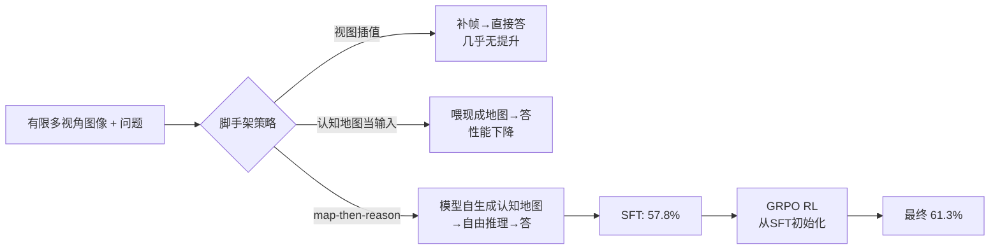

# MindCube: Spatial Mental Modeling from Limited Views

**会议**: ICLR 2026  
**OpenReview**: [https://openreview.net/forum?id=0FhrtdKLtD](https://openreview.net/forum?id=0FhrtdKLtD)  
**代码**: [项目主页 / Code / Dataset 已开源](https://openreview.net/forum?id=0FhrtdKLtD)  
**领域**: 多模态 VLM / 空间推理 / Benchmark + 训练  
**关键词**: 空间心智模型, 认知地图, Cognitive Map, 视图插值, map-then-reason, GRPO, VLM 空间推理  

## 一句话总结
提出 MindCube 基准（21,154 题 / 3,268 图）系统暴露 VLM 在「有限视角下重建未见空间」上几乎等同随机猜测的缺陷，并通过「先画认知地图、再在地图上推理」（map-then-reason）的 SFT + RL 方案，把 Qwen2.5-VL-3B 的准确率从 37.8% 拉到 61.3%。

## 研究背景与动机
- **领域现状**：VLM 在被动感知（看图答题）上进步飞快，但要像人一样从几张第一视角观测中"脑补"出整个房间的布局、被遮挡物体的位置、以及"如果我转身/前进会看到什么"，仍是空白。认知科学把这种能力称为**空间心智模型（spatial mental model）**——一种与当前视角无关、可操作的内部空间表征。
- **现有痛点**：缺乏专门评测，无法区分模型是真的建立了跨视角一致的空间表征，还是只在单图上做表层匹配。已有空间评测大多假设物体可见、视角固定，回避了**遮挡、跨视角一致性、心智模拟**这三个核心难点。
- **核心矛盾**：人能从碎片化的局部观测中整合出全局空间，VLM 却在视角切换、物体不可见时立刻失效；即便直接把现成的认知地图喂给模型当输入，性能反而下降——说明问题不在"缺信息"，而在"缺主动构建并使用内部空间表征的机制"。
- **本文目标**：① 造一个能精确诊断空间心智建模的基准；② 系统回答"哪种脚手架（scaffold）能帮 VLM 逼近空间心智模型"，并把它训进模型内部。
- **核心 idea**：**[主动构建 + 推理 > 被动喂入]** 真正有效的不是给模型更多视图或现成地图，而是让模型**自己先生成认知地图、再在地图上做自由形式推理**，并用 RL 进一步把这种"边建图边推理"的习惯固化进策略。

## 方法详解

### 整体框架
MindCube 工作分两层：**评测层**先构建覆盖 ROTATION / AROUND / AMONG 三种相机运动、四维问题分类的基准，揭示 17 个 SOTA VLM 仅略胜随机；**方法层**在两条正交轴上系统搜索逼近空间心智模型的脚手架——输入结构（原始视图 / 视图插值 / 认知地图）× 输出格式（直接答 / 自由推理 / 先画图再推理），先在冻结模型上做对照，再用 SFT 把有效配置训进模型，最后用 GRPO 强化学习从最优 SFT 检查点继续优化。

### 关键设计

**1. MindCube 基准：用相机运动模式逼出"看不见的空间"** —— 数据围绕 976 个多视角组、三种运动模式构造：ROTATION（静止点旋转，逼模型从增量可见性中拼出全景）、AROUND（绕物体走，利用遮挡逼出"物体恒存"，并把正视图里的左右关系在侧视图里转成前后深度）、AMONG（围绕中心物体取景，每张图只见中心+一个邻接物，逼模型跨视图共享信息推断整体排布）。问题刻意聚焦**当前查询视角中不可见的物体**，并按"what-if 动态模拟 / 视角采择 / 关系查询"等维度系统标注，使评测能定位到底是位置（cognitive mapping）、朝向（perspective-taking）还是动态（mental simulation）出了问题。

**2. 三种认知脚手架的对照诊断** —— 论文在冻结 Qwen2.5-VL-3B 上系统比较三类数据结构对应人类空间认知的三种属性：**视图插值**（在稀疏视图间补帧，模拟"心智动画"般的连续转动，对应动态更新）、**增强认知地图**（俯视 2D 布局，不仅标注物体位置还标注各视图的位置与朝向，对应关系一致性）、**自由形式推理**（逐步自然语言，对应不完整观测下的推断功能）。关键发现是：插值几乎无效（↑0.09%），把现成增强地图当输入反而掉到 32.0%，唯有引入推理（FFR）才升到 40+%——**结构本身不够，必须有推理把空间线索"激活"**。

**3. map-then-reason：先生成地图再在其上推理** —— 把认知地图从"输入"改成"中间输出"：模型先生成认知地图，再对地图做自由推理，最后作答（Plain-CGMap-FFR-Out）。这迫使模型先形成全局场景理解，再做结构化推理。但冻结模型生成的地图虽语法合法，与真值地图的同构率极低（<10%，增强地图因视图级细节更多反而几乎为 0），暴露出这是 VLM 的**内在能力瓶颈**，单靠 prompt 无法突破。

**4. SFT + GRPO 把"边建图边推理"训进策略** —— 用 10,000 条模板化的真值认知地图 + 人工构造的推理链做 SFT：纯 Raw-QA 微调已能从 37.8% 升到 52.7%，而 Plain-CGMap-FFR-Out（先画图再推理）拿到 SFT 最佳 57.8%，同时把生成地图的同构率从个位数拉到 35.5%。在此之上用 **VAGEN 框架 + GRPO** 做 RL：从零训 RL 反而退化，但**从最优 SFT 检查点初始化**后，先注入"建图—推理"的结构化思考再 RL，把准确率推到 61.3%（+23.5%）。这条曲线坐实了核心论点——**自主生成并利用内部结构化空间表征，远胜于视图插值或外部喂入地图**。

## 实验关键数据

### 主实验表格（冻结 SOTA VLM 在 MindCube 上，Overall 准确率 %）

| 模型 | Overall | Rotation | Among | Around |
|---|---|---|---|---|
| Random (chance) | 32.35 | 36.36 | 32.29 | 30.66 |
| DeepSeek-VL2-Small | **47.62** | 37.00 | 50.38 | 26.91 |
| GPT-5 (2025-08) | 47.59 | 93.33 | 34.17 | 41.63 |
| Gemini-2.5-pro | 47.05 | 85.50 | 25.95 | 38.40 |
| Claude-4-Sonnet | 44.75 | 48.42 | 44.21 | 47.62 |
| Gemma-3-12B-it | 46.67 | 38.39 | 48.38 | 34.63 |
| 最佳空间专用模型 RoboBrain | 37.38 | 35.80 | 38.28 | 29.53 |

> 即便最强模型也只比随机高约 15 个点，且没有任何模型在三种设置上全面领先；专门做空间微调的模型并不稳定占优。

### 消融实验表格（Qwen2.5-VL-3B 在 MindCube-Tiny，1050 题）

| 配置 | 冻结 (%) | SFT (%) |
|---|---|---|
| Raw-QA（基线） | 37.81 | 52.67 |
| 视图插值 VI-1 | 37.90 | – |
| 增强地图当输入 Aug-CGMap-In | 32.00 | – |
| 自由推理 FFR | 40.48 | 55.43 |
| Plain-CGMap-FFR-Out（map-then-reason） | 41.33 | **57.81** |
| RL-Plain/Aug-CGMap-FFR-Out（from SFT） | – | **~61.3** |

### 关键发现
- **视图插值无用**：补更多帧几乎不涨点，说明瓶颈不是输入信息量，而是推理机制。
- **地图当输入会害事**：直接喂现成增强地图掉 5.8 个点；只有"主动生成并在其上推理"才有效。
- **推理是激活开关**：冻结设置下，凡是引入显式推理的配置都明显优于直接作答。
- **RL 必须站在 SFT 肩上**：从零 RL 退化到 49.5%，从 SFT 初始化才能冲到 61.3%。
- **地图质量是内在瓶颈**：冻结模型生成地图的同构率 <10%，SFT 后才升到 35–45%。

## 亮点与洞察
- **把"空间心智模型"这一认知科学概念可操作化**：用相机运动模式 + 不可见物体标注，精确分离位置/朝向/动态三种能力，而非笼统的"空间 QA"。
- **一个反直觉但极有价值的结论**：给模型更多信息（插值视图、现成地图）无益甚至有害，真正起作用的是让模型**主动构建中间表征并对其推理**——这对整个"外部工具 vs 内部表征"之争是有力的实证。
- **map-then-reason 是可迁移的范式**：先生成结构化中间产物（地图）再推理，本质上和 chain-of-thought、program-of-thought 同源，但落在空间模态上，且配套了同构率/相似度等可量化的中间产物评测。

## 局限与展望
- **规模有限**：核心训练与消融都在 Qwen2.5-VL-3B + MindCube-Tiny（1050 题）上完成，更大模型上 map-then-reason 的增益是否同样显著未充分验证。
- **认知地图是 2D 模板生成**：以"front image 为上方向"的模板化俯视地图，难以表达真实 3D 高度/复杂拓扑，对更开放场景的泛化存疑。
- **同构率仍偏低**：SFT 后地图同构率也只有 35–45%，意味着模型内部空间表征仍远未"正确"，准确率提升部分来自推理对不完美地图的容错。
- **展望**：把认知地图升级为 3D/可微表征、引入真实视频与主动探索、把 map-then-reason 与具身导航/操作闭环结合，是自然的下一步。

## 相关工作与启发
- **VLM 空间智能**（Yang et al. 2024 的认知地图、Spatial-MLLM、SpaceQwen 等）：多采用"纯物体位置俯视图"的 plain 形式作为输入，本文指出**当输入用会掉点、当中间输出生成才有效**，是对该线路的重要修正。
- **认知科学的空间心智模型**（Johnson-Laird 1983, Tversky 的 cognitive collage）：为"schematic、可操作、不完整但功能有效"的表征提供理论依据，启发了三种脚手架的设计。
- **RL for reasoning**（GRPO / DeepSeek 系）：本文把 GRPO + VAGEN 用于多模态空间策略优化，并给出"RL 必须从 SFT 初始化"的实践经验。
- **启发**：对任何需要从局部观测推断全局结构的任务（导航、操作、3D 重建问答），"先让模型吐出可评测的结构化中间表征、再在其上推理、最后用 RL 固化"可能是比堆数据/堆视图更高效的路径。

## 评分
- **新颖性**: ⭐⭐⭐⭐ —— 把认知科学的"空间心智模型"操作化为可诊断基准，并给出反直觉的"主动建图>被动喂入"结论，视角新颖。
- **实验充分度**: ⭐⭐⭐⭐ —— 17 个 SOTA 模型横评 + 10 种输入输出配置 + SFT/RL 6 配置 + 地图同构率/相似度等多指标，覆盖全面；唯训练侧仅 3B 单模型，规模略小。
- **写作质量**: ⭐⭐⭐⭐ —— 问题动机清晰，配置命名（-In/-Out/Aug/Plain）系统，图表把"哪种脚手架有效"讲得很透。
- **价值**: ⭐⭐⭐⭐ —— 既贡献了高质量空间推理基准，又给出可复用的 map-then-reason 训练范式，对具身/多模态空间智能社区有实打实的推动。

<!-- RELATED:START -->

## 相关论文

- [\[CVPR 2026\] Think with 3D: Geometric Imagination Grounded Spatial Reasoning from Limited Views](../../CVPR2026/vlm_reasoning/think_with_3d_geometric_imagination_grounded_spatial_reasoning_from_limited_view.md)
- [\[ICML 2026\] 3ViewSense: Spatial and Mental Perspective Reasoning from Orthographic Views in Vision-Language Models](../../ICML2026/vlm_reasoning/3viewsense_spatial_and_mental_perspective_reasoning_from_orthographic_views_in_v.md)
- [\[ICLR 2026\] Seeing Across Views: Benchmarking Spatial Reasoning of Vision-Language Models in Robotic Scenes](seeing_across_views_benchmarking_spatial_reasoning_of_vision-language_models_in_.md)
- [\[ICLR 2026\] Spatial Reasoning with Vision-Language Models in Ego-Centric Multi-View Scenes](spatial_reasoning_with_vision-language_models_in_ego-centric_multi-view_scenes.md)
- [\[ICLR 2026\] MetaSpatial: Reinforcing 3D Spatial Reasoning in VLMs for the Metaverse](metaspatial_reinforcing_3d_spatial_reasoning_in_vlms_for_the_metaverse.md)

<!-- RELATED:END -->
