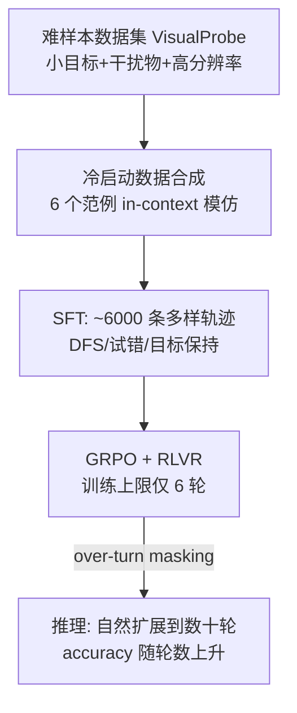

# Mini-o3: Scaling Up Reasoning Patterns and Interaction Turns for Visual Search

**会议**: ICLR 2026  
**OpenReview**: [https://openreview.net/forum?id=Zp2y9O3wEj](https://openreview.net/forum?id=Zp2y9O3wEj)  
**代码**: 将开源（论文承诺释放 code/data/model）  
**领域**: 多模态视觉推理 / 工具增强 Agent  
**关键词**: 视觉搜索、thinking-with-image、多轮工具调用、强化学习、GRPO、test-time scaling  

## 一句话总结
Mini-o3 用「难样本数据集 + 多样化冷启动轨迹 + over-turn masking」三件套，把一个只训练到 6 轮交互的 VLM，在推理时自然扩展到数十轮 trial-and-error 探索，复现出 OpenAI o3 式的深度视觉搜索能力并刷新 SOTA。

## 研究背景与动机
**领域现状**：让 VLM "thinking with image"（调用裁剪/放大等图像工具做细粒度推理）已成为提升视觉理解的热门路线，DeepEyes、Pixel Reasoner、Chain-of-Focus 等开源工作都给模型加了迭代式 zoom-in 与 RoI 选择能力，在 V\* Bench、HR-Bench 等简单视觉搜索基准上表现不错。

**现有痛点**：这些开源模型在真正困难、需要反复试错的任务上很弱——DeepEyes 在作者构造的 VisualProbe-Hard 上只有 35.1%。根因有两条：**推理模式单调**（缺少深度优先搜索、试错、自我反思等多样策略），以及**交互轮数受限**（在 HR-Bench-4K 上 DeepEyes 平均每题只用了约 1 轮图像工具）。

**核心矛盾**：要解难题就需要深而长的多轮探索，但训练时若放开轮数上限（如 16 轮）则代价极高（一次训练要 10 天）；而若直接用 RL 训练，模型又会因为冷启动缺失而退化成"几轮就草草作答"，根本撑不起 test-time 的轮数扩展。

**本文目标**：给出一套可复现 OpenAI o3 风格行为的完整训练配方，让模型在**低训练轮数预算**下，推理时能自然扩展到数十轮、且准确率随轮数单调上升。

**核心 idea**：**(1) 用难样本逼出探索行为** + **(2) 用 in-context 模仿合成多样冷启动轨迹** + **(3) 用 over-turn masking 解开"训练省轮数"与"测试扩轮数"的死结**。

## 方法详解

### 整体框架
Mini-o3 是一个多轮 agentic 图像工具调用系统：给定问题和图像，策略模型每一轮迭代产出「思考 $T_i$ → 动作 $A_i$ → 观测 $O_i$」，观测被追加进历史再喂回模型，直到模型给出最终答案或触达上下文/轮数上限。训练分两阶段——先用冷启动 SFT 激活多轮工具使用能力，再用 GRPO 做可验证奖励的 RL 微调（基座为 Qwen2.5-VL-7B-Instruct）。

### 关键设计

**1. VisualProbe 难样本数据集：用任务难度逼出探索行为**。作者发现，没有足够难的样本，RL 根本激不出反思式、试错式推理——简单基准（V\* Bench、HR-Bench）的目标往往一眼可定位，模型一两轮就能答对，自然不会去多轮探索。于是构造 VisualProbe（4000 训练 + 500 测试，分 easy/medium/hard），刻意做成三个特征：**小目标、大量干扰物、高分辨率图像**，使得题目天然要求迭代式探索与试错。消融显示去掉 hard RL 数据后 VisualProbe-Hard 掉约 8.6 分，证明难样本是引出复杂轨迹的关键燃料。

**2. 多样化冷启动数据合成：用 in-context 模仿而非原生能力造轨迹**。作者先尝试纯 RL 无 SFT，结果模型只会产出简短、轮数极少的回答——因为基座在预训练/指令微调阶段从没见过长程 agentic 轨迹。解法是冷启动 SFT 激活多轮能力：手工写 6 个范例（每个含逐轮的观测/思考/动作，覆盖深度优先搜索、自我反思、目标保持等策略），然后**prompt 一个有 in-context learning 能力的现成 VLM 去 few-shot 模仿**这些范例，在新问题上逐轮产出思考与动作，直到答对或触达预算，只保留答对的轨迹。关键洞察是：用来合成数据的 VLM **不需要原生 thinking-with-image 能力，会"照葫芦画瓢"就够了**。最终从 6 个范例收集到约 6000 条冷启动轨迹。

**3. Over-turn masking：解开"训练省轮数 vs 测试扩轮数"的死结**。这是全文最核心的贡献。在 vanilla GRPO 里，一个 query 采样一组输出 $\{o_i\}_{i=1}^G$，对触达最大轮数或超上下文的"超轮"回答直接给奖励 0，再做组内归一化算优势：

$$A_i = \frac{r_i - \mathrm{mean}(\{r_1,\dots,r_G\})}{\mathrm{std}(\{r_1,\dots,r_G\})}$$

问题在于：超轮回答的对错本质未知，给 0 奖励会让它们归一化后变成**负优势**，相当于被惩罚。由于训练为了效率必须把轮数压低（通常 <10 轮），训练初期超轮回答占比超过 20%，naive 惩罚会把模型逼成"早点作答"的策略，把交互轮数压死，test-time scaling 的潜力也就废了。解法是引入一个完成掩码 $M_i$ 只对成功终止的轨迹置 1，用它把超轮轨迹的优势屏蔽掉，并把目标函数的归一化分母从总数 $G$ 改为已完成数 $\sum_i M_i$：

$$M_i = \mathbb{1}\{|o_i| \le C_{\text{context}}\} \cdot \mathbb{1}\{\text{turn}(o_i) \le C_{\text{turn}}\}$$

这样超轮轨迹既不贡献梯度也不被惩罚，模型不会塌缩成"早答派"，于是即便训练只到 6 轮，推理时轨迹能自然延伸到数十轮且准确率单调上升。

**4. 降低 max pixels 换取更多轮数**。基座上下文仅 32K token，默认每图约 12M 像素会让单张图就吃掉大量上下文、严重限制可行轮数。作者把每图最大像素降到 2M（或更低），让同样上下文预算内能塞下更多轮交互。这是个 trade-off：像素太大诱发"过早 early stopping"（轮数掉到 1.0），像素太小又增加感知幻觉，2M 在 VisualProbe-Hard 上取得最佳 48.0。

## 实验关键数据

### 主实验表格
所有模型均为 7B；VisualProbe 与 V\* 报告 Avg@32，HR-Bench 报告 Avg@8，MME-Realworld 报告 Avg@1。

| 模型 | VP-hard | VP-med | VP-easy | V\* | HR-4K | HR-8K | MME-Real |
|------|---------|--------|---------|-----|-------|-------|----------|
| GPT-4o | 11.2 | 15.4 | 47.5 | 65.2 | 62.0 | 58.3 | 45.2 |
| Qwen2.5-VL-Instruct | 23.9 | 26.0 | 39.1 | 75.5 | 68.2 | 62.7 | 57.3 |
| Pixel Reasoner | 28.8 | 29.6 | 58.4 | 86.3 | 74.0 | 66.9 | 64.4 |
| DeepEyes | 35.1 | 29.8 | 60.1 | 83.3 | 73.2 | 69.5 | 64.0 |
| **Mini-o3 (Ours)** | **48.0** | **50.4** | **67.0** | **88.2** | **77.5** | **73.3** | **65.5** |

Mini-o3 在所有数据集上全面 SOTA，尤其在最难的 VisualProbe-Hard 上比 DeepEyes 高约 13 个点。

### 消融实验表格
三大组件消融（VisualProbe 测试集，max pixels=1M，训练轮数上限 6）：

| ID | hard RL data | cold-start | over-turn | Hard | Medium | Easy | 平均轮数(对) |
|----|:---:|:---:|:---:|------|--------|------|---------|
| 1 | ✓ | ✓ | ✗ | 35.8 | 46.4 | 66.7 | 4.8 |
| 2 | ✓ | ✗ | ✓ | 25.4 | 18.7 | 57.3 | 1.0 |
| 3 | ✗ | ✓ | ✓ | 32.2 | 45.7 | 61.1 | 3.0 |
| 4 | ✓ | ✓ | ✓ | **44.4** | **47.9** | **67.4** | **5.5** |

去 over-turn masking 掉 8.6 分（1 vs 4）；去 cold-start 几乎崩溃（轮数塌到 1.0，2 vs 4）；去 hard RL 数据掉约 12 分（3 vs 4）。三者缺一不可。

max pixels 消融：0.5M→44.4→36.4，1M→44.4，2M→**48.0**，12M→36.1（轮数塌到 1.0），印证像素—轮数的权衡。

### 关键发现
- **Test-time turn scaling**：训练上限只有 6 轮，但推理时把轮数上限从 4 加到 32，VisualProbe-Hard 准确率持续上升——这是 over-turn masking 才解锁的特性。
- **轮数分布对照**：加 masking 后，[8,16)、[16,24) 区间的正确轨迹占比显著上升（如 [8,16) 从 1.1% 升到 12.2%），说明模型真的学会了深长探索而非早答。
- **训练效率**：把训练轮数预算从 16 降到 6，训练时间从 10 天缩到约 3 天，而测试精度几乎无损。

## 亮点与洞察
- **一个极简却直击要害的 RL 改动**：over-turn masking 只是给优势乘个完成掩码、把归一化分母改成已完成数，却精准解开了"训练省成本 ↔ 测试要深度"的根本矛盾，可迁移到任何多轮 agentic RL。
- **"难度即课程"**：把激发探索行为的责任交给数据难度而非花哨的奖励设计，VisualProbe 的小目标+干扰物+高分辨率三要素是工程化制造"必须试错"的好范本。
- **数据合成不挑基座**：冷启动轨迹靠 in-context 模仿即可获得，合成用的 VLM 无需原生 thinking-with-image，大幅降低复现门槛。

## 局限与展望
- 任务范围聚焦视觉搜索（定位小目标），是否能迁移到更广的视觉推理/具身决策类多轮任务尚未验证。
- 工具空间只有 grounding（裁剪放大）+ 作答两种，未涉及更丰富的图像编辑/外部检索工具组合。
- max pixels 需手工调到 2M 的"甜点区"，对感知精度与交互深度的权衡仍是经验性的，缺乏自适应机制。
- 冷启动数据靠保留"答对轨迹"过滤，可能引入幸存者偏差，错误但有价值的探索路径未被利用。

## 相关工作与启发
本文处在 **tool-integrated agent + RL** 与 **thinking-with-image VLM** 两条线的交叉点：相比 DeepEyes、Pixel Reasoner、Chain-of-Focus 等同样做迭代 zoom-in 的工作，Mini-o3 的差异化在于**显式追求交互深度与推理模式多样性**，并通过 over-turn masking 实现 test-time scaling。RL 算法上沿用 GRPO 并借鉴 DAPO 的 clip-higher、dynamic sampling、token-level loss。对后续研究的启发是：与其在奖励函数上做精细工程，不如**从数据难度 + 训练信号的"不惩罚未知"两端入手**，让长程探索行为自发涌现。

## 评分
- **新颖性**: ⭐⭐⭐⭐ — over-turn masking 是简洁而有洞见的 RL 改动，配方组合（难数据+冷启动+掩码）成体系，虽单点不算颠覆但解法精准。
- **实验充分度**: ⭐⭐⭐⭐ — 多基准 SOTA、三组件消融、像素与轮数 scaling 分析齐全，Avg@K 降方差严谨；任务面略窄。
- **写作质量**: ⭐⭐⭐⭐ — 动机—矛盾—方法逻辑清晰，图表（轮数分布、scaling 曲线）有力支撑论点。
- **价值**: ⭐⭐⭐⭐ — 给出可复现 o3 式视觉搜索的完整低成本配方，训练 3 天即可，开源后对社区实用价值高。

<!-- RELATED:START -->

## 相关论文

- [\[ICLR 2026\] Agentic Jigsaw Interaction Learning for Enhancing Visual Perception and Reasoning in Vision-Language Models](agentic_jigsaw_interaction_learning_for_enhancing_visual_perception_and_reasonin.md)
- [\[ICLR 2026\] Unleashing Perception-Time Scaling to Multimodal Reasoning Models](unleashing_perception-time_scaling_to_multimodal_reasoning_models.md)
- [\[CVPR 2026\] Thinking in 360°: Humanoid Visual Search in the Wild](../../CVPR2026/vlm_reasoning/thinking_in_360deg_humanoid_visual_search_in_the_wild.md)
- [\[ICLR 2026\] TimeSearch-R: Adaptive Temporal Search for Long-Form Video Understanding via Self-Verification Reinforcement Learning](timesearch-r_adaptive_temporal_search_for_long-form_video_understanding_via_self.md)
- [\[ICLR 2026\] Mixture-of-Visual-Thoughts: Exploring Context-Adaptive Reasoning Mode Selection for General Visual Reasoning](mixture-of-visual-thoughts_exploring_context-adaptive_reasoning_mode_selection_f.md)

<!-- RELATED:END -->
