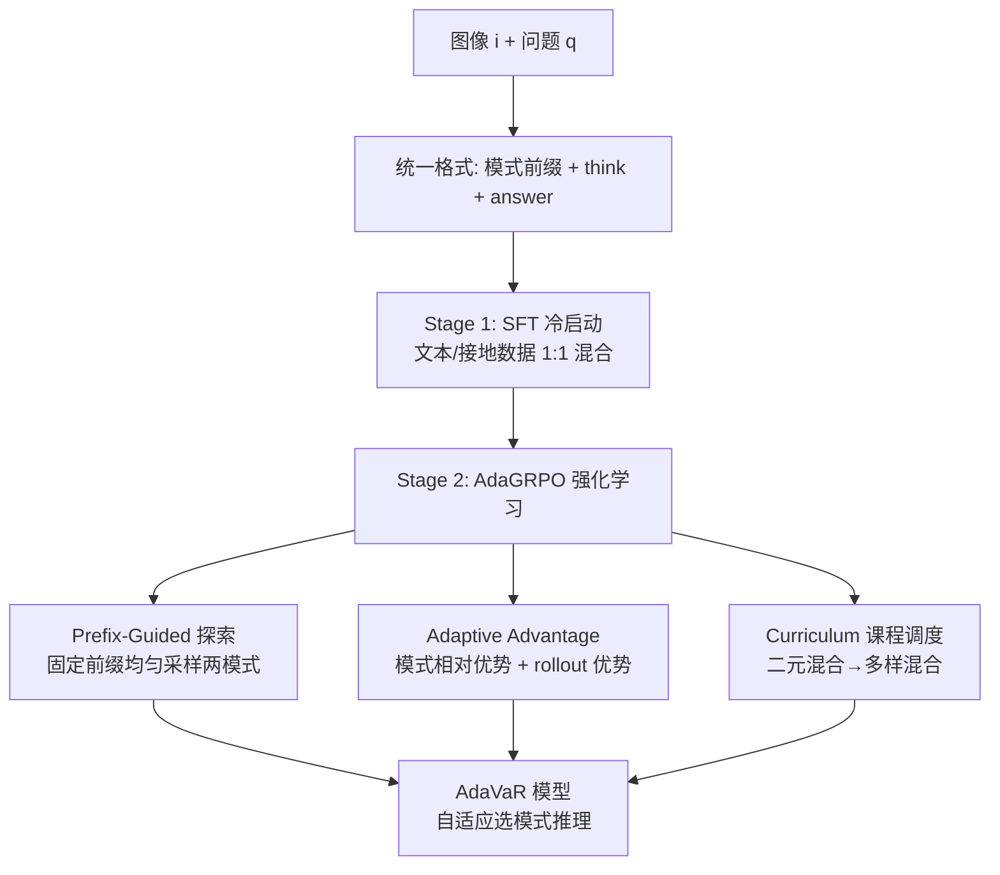

# Mixture-of-Visual-Thoughts: Exploring Context-Adaptive Reasoning Mode Selection for General Visual Reasoning

**会议**: ICLR 2026  
**OpenReview**: [https://openreview.net/forum?id=8qk6eUnvbH](https://openreview.net/forum?id=8qk6eUnvbH)  
**代码**: [https://github.com/Future-Living-Lab/mixture-of-visual-thoughts](https://github.com/Future-Living-Lab/mixture-of-visual-thoughts)  
**领域**: 视觉语言推理 / 多模态强化学习  
**关键词**: 视觉推理, 推理模式选择, GRPO, 强化学习, LVLM, 自适应推理  

## 一句话总结
提出 MoVT 范式与 AdaVaR 框架，把"文本推理"和"视觉接地推理"两种模式统一进一个 LVLM，并用改进的 AdaGRPO 算法让模型学会**根据题目上下文自适应地选对推理模式**，从而在数学、视觉搜索、幻觉、空间推理等多类任务上同时提升。

## 研究背景与动机
**领域现状**：多模态推理沿用 LLM 的 CoT 思路，但 CoT 形式（本文称"推理模式"）分成两类——一类是**文本推理**（Text-based），全程用自然语言表达思考过程，和 LLM 一致；另一类是**视觉接地推理**（Visually-grounded），在思考中生成结构化输出（如 `object [x1,y1,x2,y2]` 边界框坐标）把文字概念锚定到图像区域。

**现有痛点**：不同模式带来不同的归纳偏置，各有所长也各有短板。文本推理擅长抽象推理（数学），但容易因"过度思考"和语言偏见产生幻觉；视觉接地推理擅长利用视觉信息、抑制幻觉、处理物体明确的问题，但在数学题上几乎没有增益（长度、大小这类抽象概念无法被坐标接地）。论文用 Figure 1b 直观展示：现有专精单一模式的模型，在自己擅长的领域大涨，在不擅长的领域大跌（如某文本模型 V* 掉 18.3、某接地模型 WeMath 掉 15.5）。**没有任何单一模式能在所有任务上称王。**

**核心矛盾**：要建"通用"视觉推理模型，就必须融合互补的多种模式；但融合面临两大难题——(i) 如何把异构的推理模式**统一表示**并让一个模型同时学会；(ii) 如何让模型具备**上下文自适应的模式选择**能力。

**本文目标**：建一个能在多种模式间推理、并根据上下文自动挑最优模式的通用视觉推理模型。

**核心 idea（MoVT + AdaVaR）**：用**模式前缀 token**把多模式统一进一个自回归序列，先 SFT 冷启动学会各模式，再用**自定义的 AdaGRPO 强化学习**诱导模式选择能力——其关键在于把"选哪个模式"和"怎么推理"解耦成可分别优化的两层。

## 方法详解

### 整体框架
AdaVaR 是一个两阶段自适应视觉推理框架。先把推理过程的自回归生成拆成两步：$P(a,t,m\,|\,i,q)=P(m\,|\,i,q)\times P(a,t\,|\,m,i,q)$，即"先根据图像 $i$ 和问题 $q$ 选模式 $m$（生成模式前缀），再基于所选模式生成思考 $t$ 与答案 $a$"，两步在同一条序列里顺序完成。**Stage 1（SFT 冷启动）**把两种模式的专家轨迹混进同一模型学会基础推理能力；**Stage 2（AdaGRPO 强化学习）**则诱导上下文自适应的模式选择，同时增强推理能力。

### 关键设计

**1. 推理模式统一：用前缀 token 把异构 CoT 塞进一个自回归序列。** 论文为每种模式分配一个唯一前缀 token——文本模式用 `<text>`、接地模式用 `<ground>`，放在思考路径开头作为"上下文指示符"。系统提示里告诉模型它有两种思考模式，回答格式统一为 `<mode prefix> <think> 推理过程 </think> <answer> 答案 </answer>`。这样不同模式的数据能混在一起，用统一的 SFT 训练，模型靠前缀就能区分该走哪种推理；同时也为后续 RL 的"固定前缀做均匀探索"埋下伏笔。SFT 数据上，文本推理走 DeepSeek-R1 式蒸馏+拒绝采样构造，接地推理直接复用已有高质量数据，两者比例严格控成 **1:1** 以免引入对模式选择的偏置。

**2. AdaGRPO 的痛点诊断：原版 GRPO 在模式选择场景失效。** 标准 GRPO 的优化目标用 rollout 级优势 $A_j=\frac{r_j-\mathrm{mean}(\{r\})}{\mathrm{std}(\{r\})}$ 对所有 token 一视同仁。论文指出它有两处不适配：一是 SFT 后的策略模型可能偏爱某一模式，导致采的 $2n$ 条 rollout 全来自同一模式，**对不同模式探索不均**；二是 GRPO 只算 rollout 间优势，**没有显式建模模式之间的偏好**，无法引导选模式。AdaGRPO 正是针对这两点动手术。

**3. Prefix-Guided 模式探索 + 模式相对优势：把"选模式"单独拎出来优化。** 探索上，AdaGRPO 把 $2n$ 条 rollout 强制切成两个子组：$n$ 条固定前缀 `<text>` 的文本 rollout、$n$ 条固定前缀 `<ground>` 的接地 rollout，保证两模式被均匀探索。优势计算上，对两个子组的奖励分别拟合成高斯分布 $P_t$、$P_v$，用"从一个模式采的 rollout 优于另一个模式"的概率来定义**模式相对优势**：$A_v=\Phi\!\left(\frac{\mu_v-\mu_t}{\sqrt{\sigma_v^2+\sigma_t^2}}\right)=1-A_t$（$\Phi$ 为标准正态 CDF）。最妙的是**优势的 token 级分配**——模式相对优势 $A_t,A_v$ 只贴到**模式前缀 token** 上（引导选更优模式），而 rollout 级优势 $A_j$ 贴到**思考过程 token** 上（增强推理能力），用指示函数写成：
$$A'_{j,t}=\begin{cases}\mathbb{1}\{o_j\in\text{grd}\}A_v+\mathbb{1}\{o_j\in\text{txt}\}A_t & o_{j,t}\in m\\[2pt] A_j & \text{otherwise}\end{cases}$$
这样"选哪个模式"和"怎么把这个模式推好"被解耦到不同 token 上分别学习。

**4. 课程式数据调度：从粗粒度区分到细粒度选择。** RL 数据由两部分构成——含可验证答案的现成数据集（Geo170K、OmniCount、MM-Eureka）和从 LLaVA-OneVision/InternVL SFT 数据里按可验证性与难度筛出、并下采样平衡各任务的子集。课程上先用 **binary mixture**（只含 OmniCount + 较简单的 Geo170K 几何题）让模型学会模式间的**粗粒度区分**，再切到 **diverse mixture**（覆盖数学、OCR、计数、科学、接地、文档等更难任务）学**细粒度模式选择**，难度与任务分布都由简到繁。

## 实验关键数据

### 主实验表格（8 benchmark 平均准确率，节选）

| 模型 | MathVista | MathVision | WeMath | MMStar | V* | POPE | SpatialScore | 平均 |
|---|---|---|---|---|---|---|---|---|
| GPT-4o | 63.8 | 30.4 | 42.9 | 64.7 | 66.0 | 86.9 | 30.6 | 53.20 |
| Qwen2.5-VL-7B（基座） | 68.2 | 25.1 | 31.2 | 60.3 | 78.0 | 87.8 | 15.2 | 50.90 |
| MM-Eureka（文本） | 72.6 | 28.1 | 36.9 | 64.0 | 59.7 | 86.3 | 27.1 | 52.52 |
| DeepEyes（接地） | 70.1 | 26.6 | 32.7 | 61.3 | **90.1** | 87.9 | 20.3 | 53.72 |
| **AdaVaR-7B（本文）** | **74.4** | 28.5 | **44.8** | 63.0 | 83.4 | **89.0** | 20.4 | **55.82** |
| **AdaVaR-3B（本文）** | 69.8 | 24.5 | 33.8 | 59.3 | 77.0 | 88.2 | 18.9 | 50.84 |

关键结论：**AdaVaR 是唯一在所有数据集上都不低于 Qwen2.5-VL 基座的模型**；AdaVaR-7B 平均分超过 GPT-4o（55.82 vs 53.20），AdaVaR-3B 平均分逼近 7B 基座（50.84 vs 50.90）。单模式模型则普遍"偏科"——文本模型 V* 大跌、接地模型数学几乎无增益。

### 消融实验表格（AdaVaR-3B）

| 配置 | MathVista | WeMath | MMStar | V* | POPE | 平均 |
|---|---|---|---|---|---|---|
| AdaVaR-3B（完整） | 69.8 | 33.8 | 59.3 | 77.1 | 88.2 | **50.8** |
| w/o Ada-Adv + PG-Exp | 66.3 | 31.3 | 56.6 | 75.4 | 89.1 | 49.6 |
| w/o Ada-Adv | 68.4 | 33.7 | 58.9 | 77.4 | 88.0 | 50.3 |
| w/o Diverse Mixed Data | 67.4 | 33.4 | 57.3 | 76.4 | 82.1 | 49.0 |
| w/o Curriculum Learning | 66.8 | 33.4 | 57.8 | 76.9 | 88.2 | 50.1 |

每个组件去掉都掉点，其中**自适应优势 + 前缀引导探索**和**多样混合数据**贡献最大。另有单模式 baseline 对比：Grounded-SFT-RL（48.7）、Text-SFT-RL（48.8）、Mix-SFT-RL（48.5，去掉前缀直接混数据反而最差），均低于 AdaVaR 的 50.8。

### 关键发现
- **模式确实分工**：文本模式在数学题上选用率高、接地模式在物体中心任务上选用率高（如 V* 上 GRD% 达 99%、数学题上 GRD% 趋近 0）。
- **统一不伤个体**：单模式 baseline 与 AdaVaR 对应模式表现差距极小，说明把两模式塞进一个模型不会拖累任一模式。
- **互补存在上界**：若"任一模式答对即算对"，上界（56.8）远超基座和单模式模型，即便数学题上接地模式也能补救文本模式答错的样本，印证两模式互补、MoVT 范式潜力大。
- **前缀不可省**：去掉前缀的 Mix-SFT-RL 表现甚至低于单模式 baseline，证明前缀 token 是模式区分与均匀探索的关键。

## 亮点与洞察
- **把"选模式"当成一个可学习的决策层**：用自回归分解 $P(m|i,q)\times P(a,t|m,i,q)$ 把模式选择显式建模成序列的第一步，再用 token 级优势分配把"选模式"和"做推理"解耦——这是全文最优雅的设计。
- **AdaGRPO 的模式相对优势用高斯 CDF 估计胜率**，把"模式 A 是否优于模式 B"量化成概率贴到前缀 token 上，比 GRPO 只看 rollout 级标量奖励更能直接引导选择。
- **"通用"而非"专精"的评测立场**：跨数学/视觉搜索/幻觉/空间推理 8 个 benchmark 综合评，避免了单领域刷点的局限，AdaVaR 是唯一全面不降的模型，说服力强。
- 推理时还内置**模式切换兜底**：若某模式卡在重复逻辑出不来答案，自动切到另一模式重试。

## 局限与展望
- **仅整合两种模式**：当前只考虑文本与边界框接地两种推理模式，更多模式（如分割图、工具调用、视觉 prompt）尚未纳入，扩展性有待验证。
- **接地格式较单一**：视觉接地仅用 `object [x1,y1,x2,y2]` 边界框，对需要更细粒度区域（如分割掩码、关键点）的任务表达力可能不足。
- **离上界仍有差距**：AdaVaR-3B 实际 50.8 vs 上界 56.8，说明模式选择仍非最优，自适应能力还有提升空间。
- **依赖可验证奖励**：RL 阶段依赖规则可判定的答案，对开放式、主观性强的视觉推理任务难以直接套用。

## 相关工作与启发
- **语言推理模型**：从 CoT prompt、ToT/GoT 复杂结构、majority voting/reflection，到 DeepSeek-R1 用可扩展 RL 激励推理能力——MoVT 把这套 RL 思路迁移到"模式选择"维度。
- **文本推理 LVLM**（VLAA-Thinker、MM-Eureka、OVR 等）擅长数学但易幻觉；**视觉接地 LVLM**（DeepEyes、ViGoRL、Chain-of-Focus 等）擅长物体任务但数学无力。本文把这两条线"合二为一"是核心差异点。
- **启发**：当不同方法各有互补的归纳偏置时，与其在数据层简单混合（Mix-SFT-RL 反而最差），不如显式建模"何时用哪种方法"的选择层，并在 RL 里用相对优势直接监督这个选择——这一思路可推广到工具选择、模态选择、检索 vs 参数化知识选择等更广的"多策略融合"场景。

## 评分
- **新颖性**: ⭐⭐⭐⭐ — 把"推理模式选择"显式建模为可学习决策层，并为此定制 AdaGRPO（前缀引导探索 + 高斯 CDF 模式相对优势 + token 级优势解耦），视角和算法都有原创性。
- **实验充分度**: ⭐⭐⭐⭐ — 8 个跨域 benchmark、3B/7B 两规模、单模式/混合/去前缀多组 baseline、含上界分析与模式选用率可视化的消融，相当扎实。
- **写作质量**: ⭐⭐⭐⭐ — 动机用 Figure 1b 一图点透"无单一模式称王"，方法推导清晰，公式与图示配合好。
- **价值**: ⭐⭐⭐⭐ — 为"通用视觉推理模型"提供了可行范式，代码/模型/数据开源，对多策略融合类研究有方法论借鉴意义。

<!-- RELATED:START -->

## 相关论文

- [\[CVPR 2026\] R-4B: Incentivizing General-Purpose Auto-Thinking in MLLMs via Bi-Mode Annealing and Reinforce Learning](../../CVPR2026/vlm_reasoning/r-4b_incentivizing_general-purpose_auto-thinking_in_mllms_via_bi-mode_annealing_.md)
- [\[CVPR 2026\] POINTS-Long: Adaptive Dual-Mode Visual Reasoning in MLLMs](../../CVPR2026/vlm_reasoning/points-long_adaptive_dual-mode_visual_reasoning_in_mllms.md)
- [\[ICLR 2026\] MedVR: Annotation-Free Medical Visual Reasoning via Agentic Reinforcement Learning](medvr_annotation-free_medical_visual_reasoning_via_agentic_reinforcement_learnin.md)
- [\[ICLR 2026\] VisionReasoner: Unified Reasoning-Integrated Visual Perception via Reinforcement Learning](visionreasoner_unified_reasoning-integrated_visual_perception_via_reinforcement_.md)
- [\[ICLR 2026\] Ref-Adv: Exploring MLLM Visual Reasoning in Referring Expression Tasks](ref-adv_exploring_mllm_visual_reasoning_in_referring_expression_tasks.md)

<!-- RELATED:END -->
