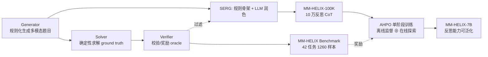

# MM-HELIX: Boosting Multimodal Long-Chain Reflective Reasoning with Holistic Platform and Adaptive Hybrid Policy Optimization

**会议**: ICLR 2026  
**OpenReview**: [https://openreview.net/forum?id=ORCZ0wcPLm](https://openreview.net/forum?id=ORCZ0wcPLm)  
**项目主页**: [https://mm-helix.github.io/](https://mm-helix.github.io/)  
**领域**: 多模态推理 / 反思推理 / 强化学习  
**关键词**: MLLM, 长链反思推理, Benchmark, 数据合成, 离线-在线混合 RL  

## 一句话总结
本文提出 MM-HELIX「评测—数据—训练」一条龙平台：用程序化生成搭出 42 个需要迭代试错与回溯的多模态难题 Benchmark，配套 SERG 流水线合成 10 万条高质量反思 CoT，并设计 AHPO 单阶段算法把离线专家监督与在线 RL 探索动态融合，让 Qwen2.5-VL-7B 在 MM-HELIX 上提升 +18.6%、在通用数学/逻辑任务上还泛化出 +5.7%。

## 研究背景与动机
**领域现状**：当前 MLLM 在数学、逻辑等推理任务上已颇为熟练，但它们大多是「单次直出」（single direct pass），缺乏自我纠错与迭代精化的内在机制。而人类认知的核心恰恰是反思与回溯——通过反复试错逐步逼近正确答案。

**现有痛点**：① 现有评测（Enigmata、VGRP-Bench、Code2Logic 等）多聚焦纯文本或选择题/填空题形式的谜题，无法端到端考察 MLLM 在富视觉语境下的长链反思能力；② 标准训练范式各有硬伤——直接在反思数据上做 SFT 会引发**灾难性遗忘**，而纯在线 RL（如 GRPO）因基座模型几乎解不出难题、奖励极度稀疏而**训练失效**。

**核心矛盾**：长链反思推理既需要专家轨迹「手把手」引导模型走出冷启动困境，又需要让模型自主探索以避免只会模仿专家分布、丧失泛化能力——这两种需求在传统「先 SFT 后 RL」的串行管线里是割裂且相互冲突的。

**本文目标**：建立一个能精确度量并有效提升 MLLM 长链反思推理的整体性平台，并验证这种反思能力可以被习得且能迁移到通用推理任务。

**核心 idea**：`整体平台`——把评测 Benchmark、数据合成引擎、训练算法三者打通；`自适应混合`——用奖励信号实时门控，决定何时依赖专家监督、何时放手自主探索，把离线监督与在线优化压进单一训练阶段。

## 方法详解

### 整体框架
MM-HELIX 由三个紧密咬合的环节构成：先用程序化生成框架（Generator + Solver + Verifier）造出可控难度的多模态难题作为评测基准 MM-HELIX；再用 SERG 流水线把规则化骨架经大模型润色成 10 万条自然反思 CoT，构成监督数据 MM-HELIX-100K；最后用 AHPO 算法把这批专家数据当作离线监督，与在线 RL 探索在同一阶段动态融合训练。Verifier 在评测时是答案校验器、在训练时则充当 RL 的奖励 oracle，把三个环节串成闭环。

### 关键设计

**1. 程序化生成的三件套构成可控难度 Benchmark**：MM-HELIX 围绕「多模态、长链、反思、端到端」四原则收集了 42 个任务，分 Algorithm、Graph、Puzzle、Game 四大类。其生成框架由三部分协同——Instance Generator 按任务规则和可调参数生成题面（含文本描述、初始局面图像、结构化初始状态），Solver 用规则算法判定可解性并产出 ground truth，Verifier 则对模型输出做校验：对布尔/数值类简单答案直接精确匹配，对多步解则先标准化输出、再从初始状态模拟整个动作序列、依据规则确认其有效性。难度通过程序化调节任务参数（主要是所需推理步数）实现，分 Level 1（极易）到 Level 5（极难）五档，每个任务在每档采样 6 个共 30 个实例，最终得到 1260 个均衡样本，能精确定位模型性能崩塌的难度阈值。

**2. SERG：规则骨架先行、大模型润色在后的高效 CoT 合成**：直接让大模型从零生成反思轨迹既慢又冗余、质量低。Step-Elicited Response Generation（SERG）改成两步——先用程序化规则 CoT 构造器，把关键中间状态/计算结果作为「锚点」（anchors）嵌入，用模板化自然语言把锚点串成一条逻辑严密但机械生硬的骨架轨迹；再把原题与这条骨架一起喂给强模型（Qwen3-235B），让它润色成自然、详尽、含反思步骤的人类化推理过程。每条轨迹只有最终答案通过对应 Verifier 才被采纳，这道过滤把 LLM 润色阶段引入的错误剔除干净。实测 SERG 相比直接 rollout 把生成时间砍掉约 90%（Pass@16 从 25% 升到 99.8%、平均长度更短），最终合成 10 万条覆盖 42 任务全难度的 MM-HELIX-100K。

**3. AHPO：奖励门控的离线-在线单阶段融合**：AHPO 把离线专家监督与在线 GRPO 探索统一进同一目标。其总目标在 GRPO 的在线 clip 项之外，再叠加一项受系数 $\xi$ 调制的离线项——对专家轨迹 $y^*$ 做最大似然监督 $\xi \sum_t \log \pi_\theta(y^*_{i,t}\mid x_i, y^*_{i,<t})$。关键在于 $\xi$ 不是常数，而是由当前 policy 的实时表现自适应门控：

$$\xi = \mathbb{I}\!\left(\sum_{i=1}^{N_{on}} \mathbb{I}\big(R(\tau_i)=1\big) < \hat{R}\right)$$

即一组 rollout 中成功轨迹数低于阈值 $\hat{R}$ 时（模型挣扎、奖励稀疏），$\xi=1$ 注入专家监督把模型拉向正确轨迹、避免冷启动卡死或 reward hacking；一旦模型熟练、奖励变密，$\xi=0$ 关闭离线监督，让 policy 纯靠探索去发现更优解。这种「带监督的探索」既避免了纯 RL 的奖励稀疏失效，也规避了静态系数（static-AHPO）因专家分布与 policy 分布持续冲突而在模型超越专家后引发的训练不稳定与性能退化。

**4. 通过混合数据实现反思能力的跨域泛化**：AHPO 训练时把 MM-HELIX-100K（带反思 CoT）与通用数学 RL 数据集 MMK12（仅有 Question 和答案、无 CoT）混合使用。由于 MM-HELIX 与 MMK12 的数学内容无重叠，模型学到的反思机制并非死记硬背，而是从专家数据中习得可迁移的内在推理技能——这让模型即便在缺乏显式 CoT 的域外任务上也能施展反思推理，是 +5.7% 通用泛化增益的根源。

## 实验关键数据

### 主实验：23 个 MLLM 在 MM-HELIX 上的评测（Img 列为多模态总分）

| 模型 | Thinking | Overall (Img) | Overall (Txt) |
|------|----------|---------------|---------------|
| GPT-5 | ✓ | 58.1 | 84.5 |
| Seed-1.5-VL | ✓ | 48.3 | 66.9 |
| o4-mini | ✓ | 44.7 | 75.2 |
| Intern-S1-241B（最强开源） | ✓ | 33.3 | 50.4 |
| Qwen-2.5-VL-72B | × | 13.9 | 20.1 |
| Qwen-2.5-VL-7B（基座） | × | 6.3 | 8.0 |
| **MM-HELIX-7B-Thinking（本文）** | ✓ | **24.9** | 21.8 |

即便最强的 GPT-5 也只有 58.1%，无任何模型突破 50%；7B 本文模型 24.9% 超过了 72B 量级的开源模型。

### AHPO 与其他训练策略对比（基于 Qwen2.5-VL-7B）

| 方法 | 类型 | MM-HELIX | 通用推理均值 |
|------|------|----------|--------------|
| Baseline | — | 6.3 | 36.5 |
| +GRPO | On-policy | 9.0 (+2.7) | 36.7 (+0.2) |
| +SFT | Off-policy | 23.8 (+17.5) | 29.9 (**−6.6**) |
| +SFT&GRPO | Sequential | 23.3 (+17.0) | 36.7 (+0.2) |
| +LUFFY | Hybrid | 9.1 (+2.8) | 35.4 (−1.1) |
| **+AHPO（本文）** | Hybrid | **24.9 (+18.6)** | **42.2 (+5.7)** |

### 消融与效率
- **SERG 生成效率**（Tab.3）：Pass@16 25.0%→99.8%，推理耗时 ~312h→~27.8h（省 90%），平均长度 7140→5500 tokens。
- **SERG 数据质量**（Tab.4）：SFT 用 SERG 数据 vs 纯规则 CoT，Overall 23.8 vs 18.9（+4.9）。
- **训练数据消融**（Tab.5）：仅 MMK12（≈GRPO）5.5；仅 MM-HELIX 24.4；Mixed 24.9，且通用任务全面更高（LogicVista 53.5、WeMath 41.1）。

### 关键发现
1. **反思能力是模型间的分水岭**：带 thinking 的反思型模型系统性优于非反思模型（如 InternVL3-78B 仅 9.9%）。
2. **结构化计算强、动态状态追踪弱**：模型在 Algorithm 类最好、Game 类最差，说明擅长定义良好的计算却不擅长严格规则下的迭代状态追踪。
3. **显著的模态鸿沟**：纯文本输入普遍远高于图像输入（GPT-5 从 58.1% 跃升到 84.5%），视觉理解仍是瓶颈。

## 亮点与洞察
- **「平台」而非单点**：把评测、数据合成、训练算法做成自洽闭环，Verifier 一物两用（评测校验 + RL 奖励），工程上极为利落。
- **AHPO 的门控洞察**：用「一组 rollout 的成功率」这个零成本信号来开关专家监督，优雅地解决了「冷启动需要保姆、成熟后保姆碍事」的两难，且证明了静态系数会在模型超越专家后反噬。
- **可泛化的反思**：最有价值的结论是反思是可迁移技能——在无 CoT 的数学 RL 数据上也能涌现反思推理，说明 AHPO 培养的是内在推理而非模仿。

## 局限与展望
- **绝对性能仍低**：MM-HELIX-7B 也只有 24.9%，距离「解决」长链反思推理还很远，Benchmark 留出了巨大头部空间。
- **视觉是短板**：明显的模态鸿沟说明瓶颈很大程度在视觉状态感知而非推理本身，未来需在视觉 grounding 上发力。
- **合成任务的真实性**：42 个任务来自算法/游戏/谜题等程序可生成域，与真实世界开放问题的分布差距、以及 SERG 依赖强教师模型（Qwen3-235B）的成本，是落地时需权衡的点。
- **门控阈值 $\hat{R}$ 的敏感性**：自适应系数依赖预设成功率阈值，论文未充分探讨其跨任务的鲁棒性。

## 相关工作与启发
- **长链推理与程序化生成**：CoT、ToT 奠定中间推理价值，Enigmata、Code2Logic、VGRP-Bench 推动程序化生成，但多局限于纯文本或选择/填空——MM-HELIX 补上了端到端多模态反思评测的空白。
- **RL 训练方法**：在线的 PPO/GRPO/DAPO/GSPO 稳定但面对难任务奖励稀疏；离线的 LUFFY 用专家数据做偏好优化降本——AHPO 的贡献是把两者用奖励门控融进单阶段，证明优于串行 SFT+RL 与 LUFFY 式混合。
- **启发**：用「确定性骨架 + 大模型润色 + Verifier 过滤」合成高质量 CoT 是一条性价比极高的数据范式；而「用任务成功率动态调度监督强度」的思路可推广到更广的难任务 RL 训练中。

## 评分
- **新颖性** ⭐⭐⭐⭐：单点技术（程序化生成、规则骨架润色、混合 RL）各有前作，但「评测—数据—训练」整体平台 + AHPO 奖励门控融合的组合是扎实且有想法的创新。
- **实验充分度** ⭐⭐⭐⭐⭐：23 个 MLLM 横评 + 5 种训练策略对比 + 生成效率/质量/数据成分多组消融，证据链完整，泛化性验证有说服力。
- **写作质量** ⭐⭐⭐⭐：动机—方法—实验逻辑清晰，图表丰富；个别公式排版与笔误（如 LUFF/econd）略有瑕疵。
- **价值** ⭐⭐⭐⭐⭐：既给社区留下一个高区分度的反思推理 Benchmark，又给出可复现、可泛化的训练配方，对推动 MLLM 反思能力研究有实打实的牵引力。

<!-- RELATED:START -->

## 相关论文

- [\[ICLR 2026\] Perception-Aware Policy Optimization for Multimodal Reasoning](perception-aware_policy_optimization_for_multimodal_reasoning.md)
- [\[ICLR 2026\] Unlocking the Essence of Beauty: Advanced Aesthetic Reasoning with Relative-Absolute Policy Optimization](unlocking_the_essence_of_beauty_advanced_aesthetic_reasoning_with_relative-absol.md)
- [\[ICLR 2026\] Vision-SR1: Self-Rewarding Vision-Language Model via Reasoning Decomposition and Multi-Reward Policy Optimization](vision-sr1_self-rewarding_vision-language_model_via_reasoning_decomposition_and_.md)
- [\[ICLR 2026\] TimeSearch-R: Adaptive Temporal Search for Long-Form Video Understanding via Self-Verification Reinforcement Learning](timesearch-r_adaptive_temporal_search_for_long-form_video_understanding_via_self.md)
- [\[ICLR 2026\] ThinkMorph: Emergent Properties in Multimodal Interleaved Chain-of-Thought Reasoning](thinkmorph_emergent_properties_in_multimodal_interleaved_chain-of-thought_reason.md)

<!-- RELATED:END -->
