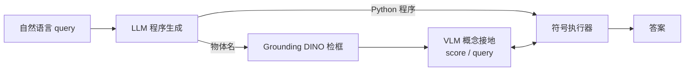

# NePTune: A Neuro-Pythonic Framework for Tunable Compositional Reasoning on Vision-Language

**会议**: ICLR 2026  
**OpenReview**: [https://openreview.net/forum?id=8H0TkSusWI](https://openreview.net/forum?id=8H0TkSusWI)  
**代码**: [https://github.com/HLR/NePTune](https://github.com/HLR/NePTune)  
**领域**: 视觉-语言推理 / 神经符号 (Neuro-Symbolic)  
**关键词**: 组合推理, VLM, 神经符号, 软逻辑, 程序生成, 视觉提示, 领域适应  

## 一句话总结
NePTune 让 LLM 把自然语言问题翻译成"混合 Python 程序"——命令式控制流 + 软逻辑算子，并用 VLM 在不确定性下对原子概念打分来执行，实现训练-free 却可微调的组合视觉推理。

## 研究背景与动机
**领域现状**：现代 VLM 在各类任务上表现亮眼，但在"组合推理"（把已知概念拆解再重组以解决新问题）上仍然脆弱。神经符号（NeSy）方法被认为是有希望的方向，目前分两派：一派是 VisProg / ViperGPT，用 LLM 生成命令式代码，每步调用预训练视觉模型做局部判断；另一派是 LEFT / NeSyCoCo，把问题解析成可微的声明式一阶逻辑，端到端学概念。

**现有痛点**：命令式程序派依赖一连串"硬判断"（crisp decision），早期一个物体识别错误会让整条推理链崩溃，而且是纯推理、不可微，无法适配新域；可微声明式派虽然能在不确定性下做全局推理，但谓词被限制在训练集里学到的那些概念，零样本能力差。另外作者发现让 LLM 生成 ProbLog（如 NAVER 所用）比生成 Python 更容易出错。

**核心矛盾**：表达力强的命令式编程（图灵完备、LLM 擅长写）与不确定性下鲁棒的软全局推理（可微、抗感知噪声），这两种优势长期被割裂在两类方法里，无法兼得。

**本文目标**：合成两派优点——既要 Python 的过程化表达力与零样本可用性，又要软逻辑在 VLM 不确定性分数上的可微全局推理与领域适应能力。

**核心 idea**：**[混合执行]** 用 LLM 把 query 翻译成 Python 程序，程序里既有命令式控制流（for/if/集合运算），又有重载了 `&`/`|` 的软逻辑算子，直接在 VLM 给出的连续概念分数上做模糊逻辑运算；**[感知-推理解耦]** 把 VLM 当成"原子概念打分器"而非"直接答题器"，训练-free 即可用，又因为算子可微而支持可选微调。

## 方法详解

### 整体框架
NePTune 把视觉推理拆成三个串联组件：LLM 程序生成器把自然语言 query 同时翻译成 Python 程序与一组相关物体名；感知接地（Perceptual Grounding）用这些物体名调 Grounding DINO 检出候选框，并通过 VLM 把原子谓词接地为概念分数；符号执行器（Symbolic Executor）在标准 Python 解释器里跑这段程序，执行中通过 `score`/`query` 接口向 VLM 取分数并做软+命令式混合推理，得到最终答案。

### 关键设计

**1. LLM 程序生成：用图灵完备的 Python 当符号语言。** NePTune 把语义解析交给 LLM few-shot parser：给定 "Is there a big brown dog?" 这样的 query，LLM 在一次调用里同时产出两样东西——一段多步 Python 程序（先找候选 "dog"，再对 big/dog/brown 这些原子概念做组合推理）和用于区域提议的物体名列表。选 Python 而非 ProbLog/一阶逻辑有两个理由：其图灵完备性（循环、条件等控制流）天然适合表达复杂过程化推理；开源 Python 代码极其丰富，LLM 写起来格外顺手、出错率低。

**2. 感知接地：物体提议 + 双接口概念打分。** 物体名先喂给零样本检测器 Grounding DINO 得到所有匹配候选框（这一步可替换为任意区域提议）。随后通过两个简化接口把符号谓词接到像素：`score(query, num_objects)` 把谓词写成自然语言问句（如把 `blue` 写成 "Is the object in the red bounding box blue?"），用红/绿框作视觉提示标出目标对象，返回 VLM 对 "Yes" 的归一化置信度作为概念分数，由 "Yes"/"No" 两个 token 的 logit 算出：

$$s = p(\text{"Yes"}\mid I, v, q_a) = \frac{e^{\text{logit("Yes")}}}{e^{\text{logit("Yes")}} + e^{\text{logit("No")}}}$$

`num_objects` 区分谓词类型：0 是全图标量问题、1 是单物体（返回长度 N 的向量）、2 是关系问题（红框标主体、绿框标客体，返回 N×N 矩阵）。另一个接口 `query(query, object_id)` 返回开放式自然语言串（如颜色、形状），既能直接当 "what/which" 类问题的答案，也能取出符号属性当中间变量（比如先逐物体问形状、再用 Python 的 `set` 数颜色种类）。

**3. 混合符号执行：软组合 + 命令式两种推理融合。** 执行器同时支持两种模式。软组合推理基于模糊逻辑：自定义数据结构封装某谓词的分数张量并重载 Python 运算符，对连续不确定性分数而非二值真假做运算——例如 `brown & dog` 取两张量逐元素最小值（合取的模糊 t-norm）。一整套软算子见 Table 2，包括存在量词 $\exists x\,\alpha_x = \max(\alpha_x)$、全称量词 $\forall x\,\alpha_x = \min(\alpha_x)$、蕴含 $\alpha_x \to \alpha_y = \max(1-\alpha_x, \alpha_y)$、计数 $\sum_x \alpha_x$、best-match 的 iota $\frac{\alpha - \min\alpha}{\max\alpha - \min\alpha + \varepsilon}$，以及训练时把等于/不等于平滑成带温度 $\tau=0.25$、margin $\gamma=0.25$ 的可微 sigmoid 形式。命令式推理则直接借标准 Python 解释器处理整体结构与控制流（if/else、for、变量赋值），因为概念对象上已定义迭代和布尔运算。两者融合让系统既能在不确定性下流畅软推理，又拥有通用编程语言的完整表达力（代价是像数集合计数这类操作会切断计算图）。

## 实验关键数据

围绕四个 RQ 展开：合成数据零样本组合推理、复杂人类问题、真实图像指代表达接地、域偏移下的泛化与适应。骨干 VLM 主要用 InternVL2.5-8B。

### 主实验表格

CLEVR 各类别准确率（神经 vs 神经符号）：

| 方法 | 训练 | Final | Exist | Query Attr | Compare Attr | Count | Compare Num |
|------|------|-------|-------|-----------|--------------|-------|-------------|
| InternVL2.5 (神经) | Zero-Shot | 90.25 | 87.10 | 98.26 | 98.61 | 74.60 | 90.86 |
| **NePTune** | Zero-Shot | **92.65 (↑2.40)** | 93.19 (↑6.09) | 96.81 (↓1.45) | 91.94 (↓6.67) | 87.10 (↑12.50) | 92.57 (↑1.71) |
| ViperGPT | Zero-Shot | 36.05 | 48.75 | 29.42 | 53.06 | 21.37 | 48.57 |
| NeSyCoCo | Trained | 99.68 | — | — | — | — | — |
| LEFT | Trained | 99.50 | — | — | — | — | — |

CLEVR 扩展任务（↑ 为相对骨干 InternVL2.5-8B 的提升，† 用真值程序）：

| 方法 | Ref(%) | Puzzles(%) | RPM(%) |
|------|--------|-----------|--------|
| NeSyCoCo (Trained) | 94.00 | 94.00 | 74.00 |
| LEFT (Trained) | 94.00 | 85.00 | 87.00 |
| InternVL2.5-8B (Zero-shot) | 27.00 | 52.00 | 47.00 |
| ViperGPT | 8.00 | 34.00 | 4.00 |
| **NePTune†** | 99.00 (↑72) | 85.00 (↑33) | 97.00 (↑50) |
| **NePTune** | 91.00 (↑64) | 81.00 (↑29) | 80.00 (↑33) |

真实图像与域偏移：CLEVR-Humans 上 NePTune 87.67%，超 LEFT/NeSyCoCo 约 ↑31.55%，也超 MDETR(81.73) 和骨干 InternVL2.5(85.95)；Ref-Adv 上 NePTune+Verification 达 78.08，胜 Grounding DINO/Florence2/NAVER；Ref-GTA（游戏域偏移）上骨干 InternVL2.5-8B 崩到 6.95%，而 NePTune 同骨干达 **69.69%**。

### 消融 / 关键对照

| 对照 | 数据集 | 结果 |
|------|--------|------|
| NeSyCoCo+VLM (同 InternVL2.5 打分) | CLEVR-Humans | 68.48（比 NeSyCoCo ↑12.36，但仍远逊 NePTune 87.67，体现表达力优势） |
| NePTune(1B) + 神经符号微调 (1000 样本) | Ref-GTA | 69.90 ± 1.16 |
| InternVL2.5-1B + 原始神经微调 | Ref-GTA | 仅 32.61 ± 0.35 |
| VLM 原子查询能力 (Micro-F1) | CLEVR/VG | InternVL2.5 总体 94.54 / 90.41，远高于其多步推理 |

### 关键发现
- 组合结构最有用的"量化类"类别提升最大（Count ↑12.50、Exist ↑6.09），而需要 same-color/same-shape 这类类比概念的属性类反而回退（Compare Attr ↓6.67），暴露 VLM 对类比关系打分弱。
- 域偏移是 NePTune 最亮的战场：纯神经 VLM 在 Ref-GTA 灾难性崩溃（6.95%），NePTune 凭全局符号推理+原子概念理解维持 69.69%。
- 软算子可微这一性质让"用神经符号信号当监督"成为可能：仅 1000 样本微调小 VLM 就把 Ref-GTA 从 32% 拉到 69%，是同等数据原始神经微调的两倍多。
- VLM 答原子问题（总体 F1 ~94）远强于多步复杂问题，验证了"VLM 当感知打分器、符号当推理器"的解耦假设。

## 亮点与洞察
- **混合执行是真正的卖点**：不是简单把命令式和声明式拼一起，而是用运算符重载让软逻辑无缝嵌进 Python 控制流，既保住图灵完备表达力，又能在连续不确定性分数上做全局推理。
- **训练-free 但可微调**这一对看似矛盾的属性同时成立：零样本靠 VLM 打分，适配新域靠可微软算子，给出了"神经符号当监督源"的新思路。
- 选 Python 而非 ProbLog/FOL 是务实的工程洞察——LLM 写 Python 的可靠性显著高于写概率逻辑，直接降低了系统脆性。
- 用红/绿框视觉提示把关系谓词接地为 N×N 矩阵，是把符号关系映射到 VLM 的简洁手段。

## 局限与展望
- 属性类比概念（same color/same shape/same size）打分弱，导致 Compare Attribute 等类别回退，这是 VLM 感知瓶颈而非框架本身能补的。
- 命令式操作（如对字符串集合计数）会切断计算图，使这部分无法参与梯度回传，限制了端到端微调的覆盖面。
- 整体性能上限受限于骨干 VLM 的原子概念打分能力与 Grounding DINO 的检测召回；视觉提示在更复杂场景下仍可能失效。
- 流水线串联多个大模型（LLM 解析 + DINO + VLM 多次打分），推理开销与延迟较高，论文未深入讨论效率。

## 相关工作与启发
NePTune 站在 VisProg/ViperGPT（命令式程序生成）与 LEFT/NeSyCoCo（可微声明式逻辑）两条线之间，并对标 NS-VQA/NS-CL 的程序执行范式和 NAVER 的有限状态机+ProbLog 编排。它的差异化（见论文 Table 1）在于"Hybrid 推理 + 动态谓词 + 用 VLM 而非 VFM 当打分器 + 可训练"。启发在于：当 LLM 已能可靠生成通用代码时，与其逼它生成不擅长的形式逻辑，不如把软逻辑算子做进它擅长的语言里；以及把大模型降格为"原子能力提供者"再用符号层组合，是提升组合泛化与抗域偏移的有效路径。

## 评分
- **新颖性**: ⭐⭐⭐⭐ 把软模糊逻辑算子通过运算符重载嵌入命令式 Python、统一两类神经符号范式，且训练-free 与可微调并存，思路新颖且自洽。
- **实验充分度**: ⭐⭐⭐⭐ 四个 RQ、合成到真实再到域偏移、多骨干 VLM、原子概念诊断、微调对照都覆盖到，尤其 Ref-GTA 域偏移说服力强。
- **写作质量**: ⭐⭐⭐⭐ 结构清晰，Table 1 谱系对比和三组件叙述让动机与方法易懂，公式与算子表完整。
- **价值**: ⭐⭐⭐⭐ 给出"用神经符号信号监督 VLM"的可行路径，对组合推理与领域适应有实际启发，代码开源。

<!-- RELATED:START -->

## 相关论文

- [\[ICLR 2026\] Test-Time Matching: Unlocking Compositional Reasoning in Multimodal Models](test-time_matching_unlocking_compositional_reasoning_in_multimodal_models.md)
- [\[ICLR 2026\] CompoDistill: Attention Distillation for Compositional Reasoning in Multimodal LLMs](compodistill_attention_distillation_for_compositional_reasoning_in_multimodal_ll.md)
- [\[CVPR 2026\] DeepScan: A Training-Free Framework for Visually Grounded Reasoning in Large Vision-Language Models](../../CVPR2026/vlm_reasoning/deepscan_a_training-free_framework_for_visually_grounded_reasoning_in_large_visi.md)
- [\[CVPR 2026\] Scaling Test-Time Robustness of Vision-Language Models via Self-Critical Inference Framework](../../CVPR2026/vlm_reasoning/scaling_test-time_robustness_of_vision-language_models_via_self-critical_inferen.md)
- [\[ICLR 2026\] More Thought, Less Accuracy? On the Dual Nature of Reasoning in Vision-Language Models](more_thought_less_accuracy_on_the_dual_nature_of_reasoning_in_vision-language_mo.md)

<!-- RELATED:END -->
