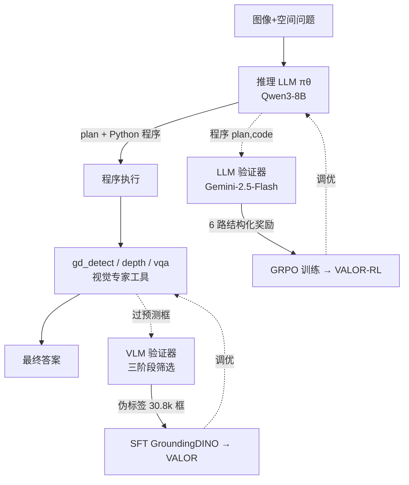

# No Labels, No Problem: Training Visual Reasoners with Multimodal Verifiers

**会议**: ICLR 2026  
**OpenReview**: [https://openreview.net/forum?id=H7gtryDnVK](https://openreview.net/forum?id=H7gtryDnVK)  
**代码 / 项目主页**: [https://glab-caltech.github.io/valor/](https://glab-caltech.github.io/valor/)  
**领域**: 视觉推理 / 工具调用 / 无标注训练  
**关键词**: 空间推理, 多模态验证器, 可验证奖励 RL, 视觉接地, 硬负样本挖掘, 工具调用  

## 一句话总结
提出 VALOR：一个**完全无需真值标注**的视觉推理训练框架，用 LLM 验证器经 RL 提升程序化推理、用 VLM 验证器经硬负样本挖掘提升视觉接地，让一个小的 Qwen3-8B + 视觉专家工具在空间推理上超越开源与闭源大模型。

## 研究背景与动机
- **领域现状**：视觉推理（尤其是空间推理）要求模型既能精确定位物体（grounding），又能理解复杂的空间关系。现有方法分两派——一派是**语言链式思维（CoT）**方法，让 VLM 用文本生成推理过程；另一派是**程序合成**方法，用 LLM 写程序去调用视觉专家工具。
- **现有痛点**：CoT 派**数据饥渴**，需要大规模 (图像, 问题, 答案) 三元组监督，且视觉理解弱、逻辑易错（论文 Fig.1 中 GPT-5-Thinking 只用像素尺寸、忽略真实 3D 大小，把答案算错）；程序合成派虽然**免训练**，但依赖闭源 LLM 和与空间推理"对不齐"的预训练专家，导致程序逻辑错误、接地不准。
- **核心矛盾**：视觉推理任务**几乎没有现成的高质量真值标注**，而专家工具又必须在目标域（机器人、可操作物体等）上微调才靠谱——但标注成本高得离谱。如何在"零标注"的前提下同时把**推理**和**接地**两条腿都练强？
- **本文目标**：构建一个可扩展、无标注的训练范式，**联合调优**推理 LLM 与视觉接地工具。
- **核心 idea**：**【验证比生成更可靠】** 借鉴数学推理里"可验证奖励 RL"的思路——更强的 VLM/LLM 当**验证器（critic）**往往比当**生成器**更靠谱。于是用 LLM 验证器构造结构化奖励指导推理 RL，用 VLM 验证器把检测器的过预测筛成伪标签来强化接地，整套流程**不碰任何真值答案**。

## 方法详解

### 整体框架
VALOR（**V**erifiers for **A**nnotation-free **LO**gic and **R**easoning）把视觉推理拆成"LLM 写计划+程序 → 调用视觉专家工具执行"两段。LLM 可调用三个 API：`gd_detect`（GroundingDINO 检测）、`depth`（MoGe2 点级深度估计）、`vqa`（GPT-5-mini 对裁剪区域问属性）。训练分两条互补的线：**LLM 验证器经 GRPO 提升推理逻辑**，**VLM 验证器经硬负样本挖掘生成伪标签、SFT 提升接地**。两者都不需要真值标签，仅靠"无答案的 (图像, 问题) 对"驱动。

### 关键设计

**1. 结构化六路奖励的 LLM 验证器：把"对不对"拆成可逐项打分的逻辑维度。** 单纯让验证器说"这个程序对不对"信息量太稀疏，VALOR 把程序质量分解成六个二元奖励，每个盯住空间推理的一个具体失效模式：`Format` 检查是否符合 `<plan></plan><answer></answer>` 模板、`Syntax` 检查代码能否无错执行、`Logic` 判断计划是否连贯合理、`Attribute` 判断是否正确识别了问题里的物体属性（高度、颜色等）、`Spatial` 判断是否覆盖了所有空间关系、`Adherence` 判断代码是否忠实实现了计划。其中 Format 和 Syntax 用确定性 Python 解释器判定（工具调用替换成 dummy 函数），Logic/Attribute/Spatial/Adherence 四项需要语义理解，交给冻结的预训练 LLM 验证器输出二元决策。最终奖励为

$$R(q,p,c) = r_{fmt}(p,c)\cdot\Big(\lambda_{sn} r_{sn}(c)+\lambda_{log} r_{log}(q,p)+\lambda_{att} r_{att}(q,p)+\lambda_{sp} r_{sp}(q,p)+\lambda_{ad} r_{ad}(p,c)\Big)$$

其中 Format 奖励作为**硬约束乘子**（格式不对则整体奖励归零），其余四项按权重加权求和，所有 $\lambda_k$ 之和为 1。这样验证器既能精确指出"算了宽度而不是高度""漏了沙发下面的架子"这类错误，又给出了密度合适的学习信号。

**2. GRPO 优化 + 无标注查询生成引擎：让训练摆脱小标注集的天花板。** 拿到结构化奖励后，用 GRPO（Group Relative Policy Optimization）优化基座 LLM $\pi_\theta$（Qwen3-8B），最大化期望优势同时用 KL 约束防止偏离预训练策略。训练数据完全不需要真值答案：从 SA-1B 采样真实图像，用 Gemini-2.5-Flash 为每张图生成五个空间推理问题、随机选一个，再补充 OMNI3D-BENCH 的（图像, 问题）样本（丢弃答案）以加强 3D 覆盖。这套范式的好处是**天然可扩展**——能从有限的标注集延伸到任意图像语料。论文发现几百条查询对 GRPO 就够用，最终只用了 **800 条**（SA-1B 生成 400 + OMNI3D-BENCH 400）。

**3. 三阶段 VLM 验证器把检测器过预测筛成伪标签：硬负样本挖掘强化接地。** 接地错误会沿后续步骤层层传播，是空间推理的主要失效模式。VALOR 不去人工标注，而是反过来利用检测器：从 LLM 生成的程序里解析出所有 `gd_detect` 查询，**故意调低置信度阈值**让 GroundingDINO 过预测（高召回），再用冻结 VLM 分三阶段验证——① 粗过滤（带框叠加图上剔除无效框）、② 逐裁剪验证（在裁剪区域上确认每个框）、③ 去重。通过验证的框组成新训练集。这一流水线把把棒球帽误判成 helmet 之类的硬负样本筛掉，**精度逐阶段攀升**：粗过滤 0.45 → 逐裁剪 0.50 → 去重后 0.75，全程**零人工标注**。去重阶段提升最大（+0.25），这正是设计意图：流水线本就靠检测器多预测、再由验证器剪枝。

**4. 把伪标签 SFT 回检测器，形成"挖掘—验证—回收"的接地强化闭环。** 验证后的框被当作伪标注 SFT 微调 GroundingDINO-T（冻结 Swin 视觉骨干和 BERT 语言编码器，只训其余部分）。由于带推理问题的图像稀少，论文用第 3 节同样的引擎生成数千个（图像, 问题）对，最终训练集含 **7,373 张图、30,826 个跨类别 bbox 标注**。精炼后的检测器回收进 VALOR 重新执行程序，让接地能力随无标注数据规模持续上涨——而且不损害通用检测（COCO val mAP 从 48.4% 微升到 48.7%）。

## 实验关键数据

### 主实验表格

**VALOR vs LLM + 工具调用（同一套视觉专家 API）**：

| 模型 | OMNI3D | RoboSpatial | BLINK | VSR | RealWorldQA | GQA | TallyQA | CountBenchQA |
|------|:---:|:---:|:---:|:---:|:---:|:---:|:---:|:---:|
| GPT-4o (闭源) | 38.0 | 56.6 | 64.2 | 67.4 | 54.5 | 58.0 | 49.9 | 67.6 |
| Gemini-2.5-Flash | 37.1 | 68.7 | 61.5 | 68.5 | 62.2 | 65.2 | 48.9 | 65.6 |
| Qwen3-8B (开源基座) | 37.5 | 60.5 | 63.9 | 68.2 | 53.3 | 57.4 | 50.1 | 68.6 |
| **VALOR-RL (仅推理)** | 43.9 | 61.8 | 67.3 | 70.3 | 53.5 | 57.6 | 49.5 | 67.6 |
| **VALOR (推理+接地)** | **44.0** | **69.5** | **69.2** | **75.6** | 57.3 | 64.4 | **51.0** | **75.9** |

**VALOR vs RL 调优的 VLM（GRIT / ViGoRL，需真值标签且文本接地）**：在重推理任务上大幅领先——OMNI3D-BENCH 44.0% vs GRIT 27.3%、RoboSpatial 69.5% vs ViGoRL 64.9%；即使在 GRIT 训练过的 TallyQA 上，无标注的 VALOR 仍以 51.0% vs 46.4% 反超。

**VALOR vs 程序合成（VisProg/ViperGPT/VADAR，均用 GPT-4o/3.5）**：OMNI3D 44.0% vs VADAR 38.9%，GQA 63.0% vs VisProg 46.9%，且只用更小的开源 Qwen3-8B。

### 消融实验表格

**训练样本量对推理的影响（OMNI3D-BENCH）**：

| 训练样本数 | 0 (基座) | 40 | 160 | 400 | 800 |
|:---:|:---:|:---:|:---:|:---:|:---:|
| VALOR-RL | 37.5 | 40.0 | 39.2 | 40.8 | **43.9** |

**RL vs SFT（同一批验证器筛过的高奖励 $R\ge0.7$ 程序）**：

| 方法 | OMNI3D | RoboSpatial | CountBenchQA |
|------|:---:|:---:|:---:|
| SFT | 38.3 | 64.5 | 74.5 |
| **VALOR (RL/GRPO)** | **44.0** | **69.5** | **75.9** |

### 关键发现
- **推理与接地两条线各管一摊**：VALOR-RL（只练推理）主要在 OMNI3D（+6.4%）、BLINK、VSR 上提升；接上验证器训练的检测器后，VALOR 在**接地密集**的任务上再涨——CountBenchQA +8.3%、RoboSpatial +7.7%、VSR +5.3%。
- **验证器容量决定成败**：Gemini-2.5-Flash 作验证器与人工标注一致率 87%，而开源 Qwen3-8B / Llama-3.2-11B 仅 15% / 7%，印证"需要高容量验证器"的核心假设。
- **极致数据效率**：仅 40 条无标注样本就超过基座（40.0% vs 37.5%），800 条达到 43.9%，呈持续上升趋势；接地侧伪标签从 5.6k 涨到 30.8k 时 RoboSpatial/VSR/CountBenchQA 准确率单调上升。
- **RL 比 SFT 更适合提升推理**：相同验证器过滤的程序轨迹下，GRPO 在重推理任务上明显胜过 SFT（OMNI3D 44.0% vs 38.3%）。
- **小模型 + 工具 > 大模型直答**：VALOR 在 OMNI3D 上比 GPT-4o 直答高 9 个点（44.0% vs 35.0%），比 Llama3.2-11B 直答高 21.3 个点。

## 亮点与洞察
- **"验证 > 生成"被系统性工程化**：本文把"强模型当 critic 更靠谱"这条直觉，分别落到推理（六路结构化奖励）和接地（三阶段筛框）两个完全不同的子问题上，是一个干净的统一范式。
- **结构化奖励的可解释性**：六路二元奖励不仅给出标量信号，还能逐项指认"逻辑错在哪、属性认错没、空间关系漏没漏"，比单一标量奖励对调试和训练都更友好。
- **故意过预测再剪枝**的接地思路很巧——把检测器的"低精度高召回"缺点，转成可被 VLM 验证器收割的硬负样本来源，闭环自举出 3 万个零成本标注。
- **零标注却能打赢有标注的 RL-VLM**，且因为基座是纯语言 LLM、训练只用无答案数据，**天然规避了视觉基准的数据泄漏**质疑——这是相对 Qwen2.5-VL 系方法的一个干净的论证优势。

## 局限与展望
- **接地仍受限于检测器上限**：在 CountBenchQA 上 VALOR 落后于直答 VLM（如 Gemini-2.0-Flash 88.6%），作者承认 VLM 本身可能是比 GroundingDINO 更强的接地基座，未来可把 VLM 直接当接地工具。
- **验证器是单点依赖**：整套训练信号来自 Gemini-2.5-Flash，若验证器在某些域系统性偏差（论文已观察到 Gemini 倾向"欠奖励"），学习信号会被带偏；开源验证器目前还远不够格。
- **两条训练线尚未融合**：VLM 验证器目前只用于生成伪标签做 SFT，作者把"将其直接嵌入 RL 训练"列为未来方向；同理用引导式查询生成来挖掘推理硬负样本也待探索。
- **工具集相对固定**（检测+深度+VQA 三件套），更复杂的空间关系（遮挡推断、反事实"如果推过去会怎样"）仍依赖人工设计的程序模式。

## 相关工作与启发
- **可验证奖励 RL**（o1 / DeepSeek-R1 / Kimi 等数学推理）是直接思想来源，本文把"可验证奖励"从数学这种有精确 checker 的域，迁移到**没有精确 checker 的视觉推理**，靠 LLM 验证器近似 checker。
- **视觉程序合成**（ViperGPT、VisProg、VADAR）提供了"LLM 写程序调专家"的骨架，本文的增量是把这套骨架从"免训练但对不齐"变成"无标注却可训练对齐"。
- **硬负样本挖掘 / 自举**（人脸检测的 bootstrapping、目标识别的 hard-negative mining）是接地侧三阶段筛框的历史渊源，本文用 VLM 验证器把这条经典思路自动化。
- **VLM 引导的伪标注**（SemiVL、PB-OVD、MarvelOVD 等）此前多用于分割/检测，本文首次把它和 LLM 验证器统一进"推理+接地"的双验证器框架。
- **启发**：对任何"标注稀缺但有强 critic 可用"的任务，都可以套用这套"过生成 → 多维验证 → 回收训练"的无标注自举范式；结构化、可解释的多路奖励也值得在其他 agentic RL 任务里复用。

## 评分
- **新颖性**: ⭐⭐⭐⭐ — "用多模态验证器替代真值标签、同时驱动推理 RL 与接地 SFT"是一个干净且有说服力的统一框架；单项技术（GRPO、硬负样本挖掘、VLM 伪标注）非全新，但组合与应用场景新颖。
- **实验充分度**: ⭐⭐⭐⭐ — 覆盖 8 个空间推理基准，对比 LLM+工具/RL-VLM/程序合成/直答 VLM 四类基线，含训练量、RL vs SFT、验证器可靠性等多组消融与误差分析，论证扎实。
- **写作质量**: ⭐⭐⭐⭐ — 动机—方法—实验逻辑清晰，Fig.1/Fig.4 的对照案例直观，奖励公式与三阶段流水线交代充分；少量笔误（如表述里 `right_sofa_det`/`r_sofa_det` 变量不一致）无伤大雅。
- **价值**: ⭐⭐⭐⭐ — 给"标注昂贵的视觉推理"提供了一条可扩展、零标注、且能反超有监督方法的实用路线，开源代码与模型对社区有实际价值；主要约束是对高容量闭源验证器的依赖。

<!-- RELATED:START -->

## 相关论文

- [\[ICLR 2026\] ProxyThinker: Test-Time Guidance Through Small Visual Reasoners](proxythinker_test-time_guidance_through_small_visual_reasoners.md)
- [\[ICLR 2026\] Evaluating Cross-Modal Reasoning Ability and Problem Characteristics with Multimodal Item Response Theory](evaluating_cross-modal_reasoning_ability_and_problem_characteristics_with_multim.md)
- [\[ICLR 2026\] AutoGPS: Automated Geometry Problem Solving via Multimodal Formalization and Deductive Reasoning](autogps_automated_geometry_problem_solving_via_multimodal_formalization_and_dedu.md)
- [\[ICLR 2026\] VisualPRM400K: An Effective Dataset for Training Multimodal Process Reward Models](visualprm400k_an_effective_dataset_for_training_multimodal_process_reward_models.md)
- [\[ICML 2026\] Breaking Dual Bottlenecks: Evolving Unified Multimodal Models into Self-Adaptive Interleaved Visual Reasoners](../../ICML2026/vlm_reasoning/breaking_dual_bottlenecks_evolving_unified_multimodal_models_into_self-adaptive_.md)

<!-- RELATED:END -->
