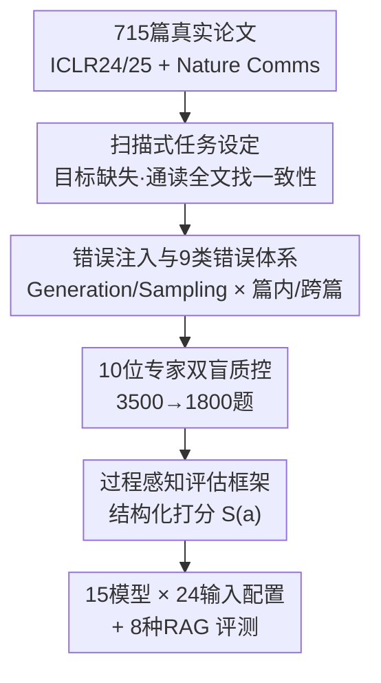

# Not Search, But Scan: Benchmarking MLLMs on Scan-Oriented Academic Paper Reasoning

**会议**: ICLR 2026  
**论文**: [ScholScan 项目主页](https://bupt-reasoning-lab.github.io/ScholScan)  
**代码**: https://github.com/BUPT-Reasoning-Lab/ScholScan  
**数据**: https://huggingface.co/datasets/BUPT-Reasoning-Lab/ScholScan  
**领域**: 多模态VLM / LLM推理 / Benchmark  
**关键词**: 扫描式推理、学术论文理解、科学错误检测、MLLM评测、过程感知评估

## 一句话总结
ScholScan 提出一种「扫描式（scan-oriented）」学术论文推理新范式——不再给模型预设检索目标，而是让它像审稿人一样通读整篇论文、主动发现内部不一致的科学错误；基于 715 篇真实论文、9 类错误、1800 道题构建多模态基准，评测 15 个模型 / 24 种输入配置后发现：当前最强 MLLM 在所有错误类别上得分都低于 60，RAG 几乎没有帮助，暴露了现有「检索式」范式的系统性短板。

## 研究背景与动机

**领域现状**：当下用 MLLM 做学术论文理解的主流是「检索式（search-oriented）」范式——给定一个明确的问题（如「短间隔钙黄绿素标记会带来什么方法学问题？」），模型先检索出几段相关文字，再在局部证据上做推理。PaSa、Google Deep Research 等系统都建立在这套「先定位目标、再就近推理」的逻辑上，在目标明确的任务上确实好用。

**现有痛点**：但真正的研究者读论文不是这样工作的。审稿、复现、找漏洞这类任务**没有预设目标**——你不知道错误藏在哪、是什么类型，必须通读全文、把分散在不同章节/页面的信息交叉比对才能发现矛盾。现有基准（CharXiv、ArXivQA、MMLongBench-Doc 等）几乎都是 QA 范式，问题里往往**自带线索**、且预设答案一定存在，这反而削弱了对「全局理解 + 信息组织」能力的考察；评测也只看最终答案对错，不管中间推理是否有证据支撑、逻辑是否成立。

**核心矛盾**：检索式范式天然依赖「预设目标 + 相关性检索」，而研究者级别的全文理解要的是「无目标 + 一致性核查」。前者只测「能否找到并就近推理相关片段」，后者测「能否主动扫描全文、构建文档级证据视图、做基于证据的推理」——两者是不同的能力，用前者的基准刷不出后者的短板。

**本文目标**：构造一个真正考察「无目标全文扫描 + 跨源证据推理 + 过程可验证」的基准，并系统量化当前 MLLM 在这件事上到底差多少、差在哪。

**切入角度**：作者用**科学错误检测**来实例化扫描式任务——因为「在没有任何提示的情况下发现论文里的非显性缺陷」天然要求通读全文、自己构造概念与推断，正好逼出扫描式能力。

**核心 idea**：把任务从「给定目标做检索推理」翻转成「目标缺失、让模型自己扫描全文找一致性问题」，并配上**过程感知**的评估框架，既看检测对不对，也看证据定位与推理链是否扎实。

## 方法详解

### 整体框架

ScholScan 不是一个模型，而是一套「数据—任务—评估」三位一体的基准。它从 715 篇真实论文出发，把任务设定成**目标缺失的扫描式查询**（只告诉模型「检查 Methods 部分有无测量与操作化问题」，不告诉错误在哪、是什么），通过 LLM 注入 + 专家质控构造出 9 大类、1800 道带证据定位与推理链标注的题目，最后用一套结构化打分公式 $S(a)$ 同时评估「检测准确性 + 证据质量 + 推理忠实度」。整条管线如下：

整张图自上而下对应三个核心贡献：**扫描式任务设定**（B）、**错误注入与 9 类错误体系**（C，质控 D 是其配套环节）、**过程感知评估框架**（E）。A 是数据来源、F 是评测应用，属于脚手架。

### 关键设计

**1. 扫描式任务范式：把「给目标做检索」翻转成「无目标主动扫描」**

这是全文的立身之本，直接针对「检索式范式测不出全文理解能力」的痛点。在检索式设定里，问题形如「短间隔钙黄绿素标记有何方法学问题？」——目标已被点名，模型只需检索到 Page 3 相关段落就近作答；而在 ScholScan 的扫描式设定里，查询变成「评估 Methods 部分有无测量与操作化（Measurement & Operationalization）问题」——**没有任何具体目标**，模型必须通读全文、把 Page 3 的「一天间隔钙黄绿素标记」和 Page 5 报告的「BFR/MAR 数值」交叉比对，才能发现「这种标记间隔根本无法有效测量 MAR/BFR，却仍报告了这些值」这一方法与数据的断裂。其本质是把评测重心从「相关性检索」移到「**一致性核查**」：所有必要概念和推断都只能从文档本身推导，不能靠题面线索。错误检测之所以是好的实例化载体，正因为它天然要求在无提示下发现非显性缺陷，逼模型从被动答题转向主动发现。

**2. 错误注入与 9 类错误体系：让「真实、可证伪、覆盖科研全流程」的错误可控生成**

光有新范式不够，还得有大规模、高质量、可验证的错误样本，这正是数据构造要解决的。ScholScan 把错误分成贯穿科研全流程的 **9 大类**：研究问题与定义（RQD）、设计与可识别性（DI）、抽样与泛化（SG）、测量与操作化（MO）、数据处理与预处理（DHP）、计算与公式（CF）、推断与结论（IC）、引用与参考对齐（RCA）、语言与表达（LE）。题目沿两个维度构造——来源是 **生成（Generation）** 还是 **采样（Sampling）**，语境是 **篇内（within-paper）** 还是 **跨篇（cross-paper）**：生成法对高质量已录用论文用 Gemini 2.5 Pro 做跨章节/跨页的协同句级改写，合成复合错误并生成对应问题与解释；采样法则从被拒的 ICLR 投稿及其公开评审里抽取明确、可证伪的科学错误（剔除关于新颖性/写作的主观评价）；跨篇设定专测引用一致性，给模型一篇已录用论文及其某条被引文献，编辑前者引入对引用的曲解或推理错误。质控环节同样关键：10 位领域专家对 3500 个初始候选做**独立双审 + 第三方仲裁**，最终丢弃 1700 个、修订 1541 个（535 处问题重写、1207 处解释编辑、1141 处类别/元数据修正），保证错误真实可证伪而非 LLM 幻觉。

**3. 过程感知评估框架：不止看「抓没抓到错」，还看证据和推理链对不对**

针对「主流评测只看最终结果、忽略推理是否有据」的痛点，ScholScan 把模型输出 $a$ 解析成结构化元组 $\Psi(a)\Rightarrow(\mathbb{1}_{\text{exist}}, \mathbb{1}_{\text{contain}}, \hat{E}, \hat{R}, n)$，其中两个二值量分别表示输出是否报告了错误、是否命中标注的目标错误，$\hat{E}/\hat{R}$ 是预测的证据集与推理链，$n$ 是无关错误数量。最终分数把四件事乘在一起：

$$S(a) = S_{\text{detection}} \cdot \sqrt{S_{\text{location}} \cdot S_{\text{reasoning}} \cdot P_{\text{unrelated}}(n)}$$

其中检测分 $S_{\text{detection}}=\mathbb{1}_{\text{exist}}\cdot\mathbb{1}_{\text{contain}}$ 是硬门槛（没命中目标错误直接 0 分）；证据定位分 $S_{\text{location}}$ 用带平方惩罚的 Dice，既奖励命中标注证据、又惩罚过度罗列噪声证据；推理过程分 $S_{\text{reasoning}}=\left(\hat{g}/|R^*|\right)^2$ 用前缀匹配 $\hat{g}=\text{prefix\_match}(\hat{R}, R^*)$ 衡量推理链与金标的完整对齐程度；无关错误惩罚 $P_{\text{unrelated}}(n)=0.9^{\min(n,2)}\exp\!\left(-0.6\,\max(n-2,0)^{1.5}\right)$ 用快速衰减压制「靠乱列错误冲召回」的行为。开放式输出由 GPT-4.1 抽取引用证据与推理步、再与标注对齐，作者称人工校验显示该流水线与专家标注高度一致。这套设计让评测同时覆盖**过程与结果**，是它与只看 outcome 的旧基准（图 2 中 Eval. 列只有 O）的关键区别（ScholScan 是 P+O）。

## 实验关键数据

### 主实验

评测覆盖 15 个主流模型、24 种输入配置（论文以图像输入，或经 Tesseract OCR 转文本输入）。分数按 100 缩放，9 类错误见上文缩写。

| 输入 | 模型 | Avg. | 最强类别 | 最弱类别(CF/LE) |
|------|------|------|---------|----------------|
| 图像 | GPT-5 | 19.2 | SG 28.2 | CF 13.8 / LE 6.9 |
| 图像 | Gemini 2.5 Pro | 15.6 | SG 35.7 | CF 4.6 / LE 7.4 |
| 文本(OCR) | Gemini 2.5 Pro | **30.3** | DHP 56.6 | CF 10.3 / LE 8.1 |
| 文本(OCR) | GPT-5 | 22.5 | DHP 36.7 | CF 4.7 / LE 2.6 |
| 文本(OCR) | Qwen3-235B-Thinking | 17.4 | SG 31.9 | CF 5.6 / LE 2.3 |
| 文本(OCR) | DeepSeek-R1 | 11.4 | SG 25.4 | CF 4.7 / LE 3.5 |

最佳成绩（文本输入的 Gemini 2.5 Pro，30.3）在**任何一个错误类别上都没突破 60 分门槛**，开源模型尤其惨（Qwen2.5-VL-72B 几乎全 0）。

### 消融 / 分析实验

| 对比维度 | 关键数据 | 说明 |
|----------|---------|------|
| 推理增强 vs 基座 | Qwen3-Thinking 17.4 vs Instruct 1.7；DeepSeek-R1 11.4 vs V3.1 1.7 | 推理增强模型平均高 10+ 分，全类别普涨 |
| 文本 vs 图像 | 9 个 MLLM 平均差 4.81 分（文本占优） | 视觉处理长多模态输入是主要瓶颈 |
| CF 类例外 | 图像输入在 CF 上反超文本 | OCR 拍平公式/表格，丢失结构信息 |
| RAG (文本, Qwen3-Thinking) | Oracle 24.5 vs Baseline 17.4；BM25 16.7、BGE-M3 11.3、NV-Embed 6.8 | 除 Oracle 外几乎都不涨甚至倒退 |
| RAG (图像, Llama4) | VRAG-RL 10.9 略升；ColPali/VisRAG ≈0.8–1.0 | 多模态检索后得分塌到接近 0 |
| 检索质量 | 所有 embedding 模型 Recall@5 < 50%（最高 BM25 0.48） | 一致性任务里相关性检索基本失效 |

### 关键发现
- **RAG 全线失灵**：8 种 RAG 方法在扫描式任务上几乎无显著增益，只有提供金标图像的 Oracle 条件有效（文本 17.4→24.5），说明短板不在「找不到证据」，而在「即便给了证据也推不对」——这正是扫描式任务区别于检索式任务的本质。
- **推理链越长越脆**：随推理步数增加，推理分和总分稳步下滑，暴露 MLLM 构造长因果链的瓶颈；而证据位置数对得分影响较弱（因为评测允许部分证据缺失）。
- **隐藏复杂度惊人**：即便 GPT-5、Gemini 这类最强模型，也常要扫描多达 8 倍于金标的证据、执行 3.5 倍的推理步，仅为逼近一个正确答案，且仍频繁失败。
- **强模型更爱「自信幻觉」**：零分案例分两类——要么啥错都没检出（遗漏），要么被幻觉淹没、完全错过真错误；越强的模型零分总数越少，但越容易过度自信地产生幻觉。
- **CF 是独立硬骨头**：图像输入下 CF 与其他类别相关性持续偏低，说明数学/符号推理是相对独立的能力维度；作者据此把 9 类错误归并为 5 个潜在能力维度（研究概念理解、实验过程建模、形式推理与符号计算、因果推断、指称对齐与语言一致性）。

## 亮点与洞察
- **范式翻转本身就是贡献**：把「检索式」翻成「扫描式」不是换个数据集，而是换了被测能力——从「相关性匹配」到「全局一致性核查」。这个视角可迁移到合同审查、代码审计、长报告复核等任何「无目标找矛盾」的场景。
- **过程感知打分公式可复用**：$S(a)$ 把检测/定位/推理/惩罚四件事用「乘积 + 平方根 + 快速衰减惩罚」组合，硬门槛（检测为 0 则全 0）+ 软质量评估的结构，很适合任何「要先抓对、再看证据和推理是否扎实」的开放式评测。
- **「给了证据也做不对」的诊断极有价值**：Oracle 有效但 RAG 无效，干净地把失败归因从「检索能力」剥离到「推理能力」，避免了用更强检索器掩盖真问题的错觉。
- **OCR vs 图像的非对称**：文本整体更好但 CF 类图像更好，揭示「公式/表格这类结构化内容一旦被 OCR 拍平就不可逆地丢信息」，给多模态输入留了不可替代的位置。

## 局限与展望
- **错误主要靠 LLM 注入合成**：生成法用 Gemini 2.5 Pro 改写制造错误，尽管有专家双审，合成错误的分布可能与真实论文里自然出现的缺陷有偏差；采样法虽来自真实被拒投稿，但占比与覆盖面受公开评审质量限制。
- **评测依赖 GPT-4.1 当裁判**：开放式输出的证据与推理抽取交给 GPT-4.1，虽称人工校验一致性高，但裁判模型自身的偏好/盲区可能系统性影响打分，尤其对它不擅长的 CF/LE 类别。
- **语言类（LE）几乎全军覆没**：几乎所有模型 LE 得分都是个位数甚至 0，作者归因于密集文本分布让即便直达目标区域也难降复杂度——但这也可能反映该类标注本身偏主观、难界定。
- **改进方向**：作者期待 ScholScan 成为扫描式范式的代表性基准，后续可探索面向长因果链的训练、结构保真的多模态编码（不被 OCR 拍平）、以及专门针对一致性核查的检索/记忆机制。

## 相关工作与启发
- **vs 检索式论文理解基准（CharXiv / ArXivQA / MMCR / AAAR-1.0）**：它们都是 Search 范式、只评 Outcome、领域覆盖窄（多为 CS 或 8–10 域）；ScholScan 是 Scan 范式、评 Process+Outcome、覆盖 13 个自然科学领域，本质区别在于「无预设目标 + 一致性核查 + 过程可验证」。
- **vs 文档理解基准（MMLongBench-Doc / DocMath-Eval / FinMMDocR）**：这些扩展了长文档、多模态、多步推理，但仍是「问题里预设答案存在」的 QA 范式；ScholScan 借鉴了 MMLongBench-Doc 的开放式推理链评测思路，但把任务从「答已知问题」推到「主动发现未知错误」。
- **vs RAG 类方法（BM25 / Contriever / BGE-M3 / ColPali / VisRAG / VRAG-RL）**：它们都假设「检索到相关片段就能就近作答」，在 ScholScan 上这个假设崩塌——Recall@5 全部 <50%，检索后反而掉分，说明扫描式一致性任务无法被相关性检索覆盖。

## 评分
- 新颖性: ⭐⭐⭐⭐⭐ 「扫描式 vs 检索式」的范式翻转切中现有论文理解基准的盲区，定义清晰、立意高
- 实验充分度: ⭐⭐⭐⭐⭐ 15 模型 × 24 配置 + 8 RAG + 细粒度相关性/遗漏-幻觉/推理步分析，覆盖全面
- 写作质量: ⭐⭐⭐⭐ 范式动机和评估公式讲得清楚，9 类错误与 5 维能力的归并有洞察；个别指标（如 LE 全低）解释略弱
- 价值: ⭐⭐⭐⭐⭐ 暴露了当前 MLLM 在全文一致性推理上的系统性短板，且证明 RAG 无效、问题在推理而非检索，对后续研究方向有强指导意义

<!-- RELATED:START -->

## 相关论文

- [\[ICML 2026\] Imagination Helps Visual Reasoning, But Not Yet in Latent Space](../../ICML2026/vlm_reasoning/imagination_helps_visual_reasoning_but_not_yet_in_latent_space.md)
- [\[ICLR 2026\] JUDO: A Juxtaposed Domain-Oriented Multimodal Reasoner for Industrial Anomaly QA](judo_a_juxtaposed_domain-oriented_multimodal_reasoner_for_industrial_anomaly_qa.md)
- [\[ICLR 2026\] What "Not" to Detect: Negation-Aware VLMs via Structured Reasoning and Token Merging](what_not_to_detect_negation-aware_vlms_via_structured_reasoning_and_token_mergin.md)
- [\[ICLR 2026\] Mini-o3: Scaling Up Reasoning Patterns and Interaction Turns for Visual Search](mini-o3_scaling_up_reasoning_patterns_and_interaction_turns_for_visual_search.md)
- [\[ICLR 2026\] Children's Intelligence Tests Pose Challenges for MLLMs? KidGym: A 2D Grid-Based Reasoning Benchmark for MLLMs](childrens_intelligence_tests_pose_challenges_for_mllms_kidgym_a_2d_grid-based_re.md)

<!-- RELATED:END -->
