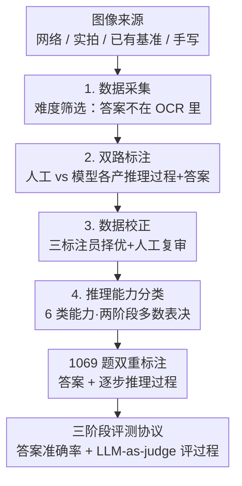

# OCR-Reasoning Benchmark: Unveiling the True Capabilities of MLLMs in Complex Text-Rich Image Reasoning

**会议**: ICLR 2026  
**OpenReview**: [https://openreview.net/forum?id=aH7eyx64pC](https://openreview.net/forum?id=aH7eyx64pC)  
**代码**: https://github.com/SCUT-DLVCLab/OCR-Reasoning  
**领域**: 多模态VLM / LLM推理 / 数据集与基准  
**关键词**: 富文本图像推理、OCR、慢思考、推理过程评测、基准

## 一句话总结
作者构建了 OCR-Reasoning——首个系统评测多模态大模型「富文本图像推理」能力的基准，包含 1069 条人工标注样本、覆盖 6 大推理能力 / 18 个实际任务，且同时标注最终答案与逐步推理过程；结果显示即便最强的 MLLM 准确率也不超过 50%，暴露出该方向远未被解决。

## 研究背景与动机

**领域现状**：以 OpenAI-o1、DeepSeek-R1、Gemini-Thinking 为代表的「慢思考」系统借助 Chain-of-Thought 和测试时算力扩展，在数学、代码、科学推理上取得显著进展，并催生了一批多模态慢思考模型。为了评测它们的推理能力，社区已经做出 MathVista、MathVerse、MMMU 等针对数学和学科知识的专门基准。

**现有痛点**：但在「富文本图像」（文档、图表、票据、信息图、手写题等文字密集场景）这个高频应用方向上，评测基准是缺位的。现有的 DocVQA、ChartQA、OCRBench 等基准只考察模型把文字「读出来」的感知能力，并只标注最终答案——它们大多数题目的答案直接出现在图像的 OCR 结果里，模型靠「快思考」直接抽取即可，根本不需要推理。

**核心矛盾**：富文本场景里其实充满需要深度分析的任务，例如财报分析、发票核算、性价比购买决策；可现有基准既无法把「能抽出答案」和「会推理」区分开，也没有对推理过程本身做评估。换句话说，旧基准的评测焦点（感知/抽取）与真实需求（感知之上的推理）之间存在结构性错配。

**本文目标**：填补这个空白，需要解决三个子问题——(1) 怎样收集到「答案不在 OCR 结果里、必须推理才能得出」的高难度样本；(2) 怎样系统地定义并覆盖富文本推理涉及的核心子能力；(3) 怎样既评最终答案、又评推理过程。

**切入角度**：作者观察到，把现有基准的答案与图像 OCR 结果做匹配，DocVQA/OCRBench 等有 78%~99.8% 的题目答案直接含在 OCR 文本里，而精心设计的 OCR-Reasoning 仅 2.3%。这个对比直接量化了「现有基准考的是抽取、不是推理」，于是从「答案不可直接抽取」这一筛选原则出发构造数据，就能逼出真正的推理能力。

**核心 idea**：用「双重标注（答案 + 逐步推理过程）+ 6 类核心推理能力分类法」构造一个答案无法从 OCR 直接读出的富文本推理基准，从而把 MLLM 在该场景下被高估的真实能力揭示出来。

## 方法详解

OCR-Reasoning 是一个评测基准，核心工作是「怎么造出一份高质量、能区分推理与抽取的富文本推理数据」以及「怎么公平地评测答案与推理过程」。整体上分两条线：四步数据构建流水线（采集 → 标注 → 校正 → 分类），以及三阶段评测协议（答案抽取式打分 + LLM-as-judge 评推理过程）。最终产出 1069 条样本、1022 张唯一图像，覆盖 6 类推理能力、18 个实际任务。

### 整体框架

数据构建是一条人在回路的四步流水线，每一步都有专家把关与质量控制：

最终数据集 1069 题分两种格式：选择题 250 题（23.4%），自由作答 819 题（76.6%，又分整数/浮点/字符串）；92.3% 的题目和 100% 的推理路径都是新标注的。推理链 + 答案平均长 421 字符、最长 3106 字符，体现题目复杂度。此外作者明确把范围限定在「单图」：多图/多文档主要考长上下文能力、会混淆推理评测，且不少文档型 MLLM 只在单图上训练过，纳入多图会把它们排除在外。

### 关键设计

**1. 难度筛选：答案不可从 OCR 直接抽取**

这是整个基准区别于 DocVQA/OCRBench 的根，直接针对「旧基准考抽取不考推理」的痛点。作者用一个可量化的判据来卡题目难度：统计「答案是否包含在图像 OCR 结果中」的样本比例。现有基准这一比例高达 78.4%（ChartVQA）到 99.8%（DocVQA），意味着模型靠快思考从识别结果里直接抄即可；而 OCR-Reasoning 把该比例压到 2.3%。要做到这点，作者主动构造答案需要跨步骤计算/推断的题目（如「Package One 比单买便宜多少」需要先列出各项价格、求和、再相减），并过滤掉低分辨率、噪声过大的图。数据来源刻意多元——476 张网络图、253 张街景/手写实拍、293 张来自 InfoVQA/DocVQA/ChartQA/CharXiv/WildReceipt/MME-Finance 等已有基准——并特意补充了稀缺的手写推理数据（标注员手写大学级化学、物理、几何、函数、统计题再拍照），逼模型同时具备强 OCR 与强推理。

**2. 双路标注 + 择优校正：保证推理过程标注的质量**

富文本推理基准的真正难点不在答案，而在「逐步推理过程」也要标得对、标得好，否则无法评过程。作者对每张图先让三名 STEM 方向博士标注员各出一题，再由其他标注员打分选出最优问题；随后用两条并行通路生成推理过程与答案——一条是人工手写推理链，一条是把问题与答案喂给闭源 MLLM（如 Gemini 2.0 Flash）生成另一版推理过程。校正阶段再由三名标注员对两条通路的标注打分，取平均分更高的那条作为最终推理过程与答案，最后再做一轮人工复审纠错。这种「双路竞争 + 多评审择优 + 人工兜底」让每条推理路径都经过对比筛选，而非单一来源一锤定音。

**3. 六类核心能力分类法 + 两阶段多数表决归类**

为了让评测「系统化」而非一锅烩，作者把富文本推理拆成 6 类核心能力：空间推理、数值分析推理、数学推理、枚举推理、逻辑推理、跨学科知识推理，并细化为 18 个实际任务（如财务分析、K 线分析、排程分析、条件计数、化学/物理/几何题、IQ 测试、博弈逻辑、关系抽取等）。其中数值分析占比最大（37.0%），因为它涵盖 5 种现实任务、多于其他类的 2~3 种；数学推理题特意用手写体，对 OCR 要求更高。归类时为降低人为偏差采用两阶段做法：先由三名标注员各自独立把样本归入 6 类之一，再用多数表决（plurality consensus）确定最终类别。这套分类法让基准能逐能力维度地暴露模型短板，而不是只给一个笼统总分。

**4. 三阶段评测协议 + LLM-as-judge 评推理过程**

有了双重标注，评测也要兼顾答案与过程。答案侧沿用三阶段框架：(1) 模型生成详细回答；(2) 用 LLM 抽取器（如 GPT-4o）从回答里语义解析出简洁答案，作者在 200 例预研上验证抽取准确率 >99.5%；(3) 把抽取答案归一化为标准格式（选项字母/整数/字符串）后做确定性的准确率计算。过程侧则用 LLM-as-judge：给定问题、模型详细回答与推理轨迹的 ground truth，让 LLM 裁判直接打分。作者用人工对齐验证了裁判的可信度——DouBao-1.5-Vision-Pro 人评 53.1 vs 裁判 55.4、Qwen2.5-VL-72B 50.2 vs 51.8、Llama4-Scout 43.8 vs 44.9、OpenAI-o1 47.6 vs 48.5，人评与裁判分数高度接近。为应对富文本场景输出格式多样（货币 \$15、时长 20 days、时间戳 19:00:00），评测时还用了「格式特定提示」，把期望答案构成（如 `$ + Integer`）追加到 query 上以便确定性判分。

## 实验关键数据

### 主实验

零样本评测，给模型图像 + 问题并提示「逐步推理」。最终答案准确率（Overall，部分代表性模型）：

| 类别 | 模型 | Overall 准确率 |
|------|------|----------------|
| 闭源 MLLM | DouBao-1.5-Vision-Pro | **46.8**（最高） |
| 闭源 MLLM | OpenAI-o1 | 44.4 |
| 闭源 MLLM | Gemini-2.0-Flash | 39.3 |
| 闭源 MLLM | GPT-4o | 30.7 |
| 开源 MLLM | GLM-4.1V-Thinking-9B | 44.1 |
| 开源 MLLM | MiMo-VL-RL-7B | 38.8 |
| 开源 MLLM | Qwen2.5-VL-72B | 37.5 |
| OCR+LLM | OpenAI-o3-mini（纯文本） | 33.3 |
| 文档型 MLLM | TokenVL-8B | 14.3（文档型最高 <15） |
| 文档型 MLLM | mPLUG-DocOwl2-8B | 3.3 |

核心结论：**没有任何模型超过 50%**，最强的 DouBao 也只有 46.8%——而它在 DocVQA 上有 96.7%、InfoVQA 89.3%、ChartQA 87.4%，说明富文本「理解」强不等于「推理」强。文档型 MLLM 全线 <15%，基础理解尚可但深度推理乏力。

### 消融 / 分析实验

| 分析维度 | 关键观察 | 说明 |
|----------|---------|------|
| 视觉输入必要性 | 把图换成 OCR 文本喂 LLM，性能大跌 | DeepSeek-R1-Distill-Qwen-32B 比同底座的 Qwen2.5-VL-32B 低 9.7%，证明纯文本不足以解富文本推理 |
| 模型规模 | 正相关 | Qwen2.5-VL 系列：7B 比 3B 高 3.5%，32B 比 7B 高 20.5% |
| CoT 提示 | 因模型而异 | Qwen2.5-VL-32B +3.2%、GPT-4o +4.2%（空间推理增益最明显）；但 VL-Rethinker-7B 反而下降（训练/测试条件不一致） |
| Few-shot | 总体小幅提升但有副作用 | Qwen2.5-VL-7B：one-shot 16.1、three-shot 16.4（数值分析/逻辑受益），但跨学科知识推理下降（长 token + 长推理超出长文本处理能力） |
| 推理过程评分 | 排名大体与答案准确率一致 | 例外是 Gemini、Claude-3.7——它们推理过程质量高（很多错样本只是末步小错），DouBao 过程分 55.4 仍最高 |
| RL 方法 | 多数表现差 | 奖励函数和训练数据多为印刷体数学题设计，与富文本多场景不匹配 |

### 关键发现
- **抽取 ≠ 推理是本基准的灵魂**：横向对比表（Tab.6）里 Qwen2.5-VL-7B 在 DocVQA 95.7、ChartQA 87.3、OCRBench 864、TextVQA 84.9，但在 OCR-Reasoning 只有 15.7；评测焦点从「感知」转到「感知+推理」后，强模型断崖式下跌。
- **能力分布不均**：枚举推理是各模型最强项（闭源/开源里常排第一或第二），而空间推理、数学推理普遍最弱。
- **两个有前景方向**：作者指出「为富文本推理专门设计 RL 奖励函数 / 训练数据」和「thinking with images（边看图边想）」都能提升表现，是值得投入的研究方向。

## 亮点与洞察
- **用一个可量化指标定义难度**：「答案是否含于 OCR 结果」的比例（旧基准 78%~99.8% vs 本文 2.3%）一针见血地把「抽取题」和「推理题」分开，这个判据本身就是可复用的数据筛选 trick。
- **双重标注 + 双路竞争**：同时标答案与推理过程、且人工与模型两路 PK 择优，既提升标注质量又天然支持「过程评测」，思路可迁移到任何需要评推理链的基准。
- **诚实地暴露而非粉饰**：论文的价值在于「揭示」——明确告诉社区最强模型也 <50%、文档型模型 <15%，把一个被现有 leaderboard 高估的能力打回原形。
- **手写数学题的巧思**：刻意让标注员手写大学级理科题再拍照，把强 OCR 和强推理的需求耦合在一起，比直接用印刷体更能压住模型。

## 局限与展望
- **作者承认的局限**：仅限单图，多图/多文档/长上下文场景未覆盖；这是为隔离推理能力做的取舍，但也限制了对复杂文档推理的评测。
- **评测依赖 LLM**：答案抽取（GPT-4o）和过程打分（LLM-as-judge）都靠 LLM，虽有人评对齐做背书，仍可能引入裁判模型自身的偏置；过程分对 Gemini/Claude 这类「过程好但答案错」的模型的判定也提示单看过程分会偏高。
- **规模相对小**：1069 题、1022 图，量级与既有推理基准相当但偏小，部分子类（如空间推理 10%）样本有限，逐类结论的统计稳定性需谨慎。
- **改进思路**：把「thinking with images」「为富文本推理定制 RL 奖励/训练数据」从论文指出的方向落地为可训练的方法；或扩展到多图/视频富文本推理。

## 相关工作与启发
- **vs 数学推理基准（MathVista / MathVerse / MMMU）**：它们考数学与学科知识推理，本文聚焦富文本图像（文档/图表/票据/手写）这一被忽视但高频的场景，并且数学题用手写体以耦合 OCR 难度。
- **vs 富文本理解基准（DocVQA / ChartQA / OCRBench / OmniDocBench）**：它们只标最终答案、且答案多可从 OCR 直接抽取，本质考感知；本文加了逐步推理过程标注、并用「答案不在 OCR 里」的原则把题目难度拉高，焦点从抽取转向推理。
- **vs 通用多模态推理基准（CLEVR / GQA / ScienceQA）**：它们在结构化或学科场景里考组合/科学推理，本文专注真实世界富文本，且首次为富文本推理具体定义了 6 类核心子能力并做系统评测。

## 评分
- 新颖性: ⭐⭐⭐⭐ 首个系统的富文本图像推理基准，「答案不可从 OCR 抽取」的难度判据与双重标注设计有清晰立意
- 实验充分度: ⭐⭐⭐⭐⭐ 覆盖 OCR+LLM / 闭源 / 开源 / 文档型 30+ 模型，含 CoT、few-shot、RL、推理过程、跨基准对比等多维分析
- 写作质量: ⭐⭐⭐⭐ 动机—构建—评测逻辑清晰，量化对比有说服力
- 价值: ⭐⭐⭐⭐⭐ 揭示主流 MLLM 在富文本推理上被高估的真实能力（均 <50%），为社区指明 RL 奖励设计与 thinking-with-images 等方向

<!-- RELATED:START -->

## 相关论文

- [\[ICLR 2026\] Perception-R1: Advancing Multimodal Reasoning Capabilities of MLLMs via Visual Perception Reward](perception-r1_advancing_multimodal_reasoning_capabilities_of_mllms_via_visual_pe.md)
- [\[CVPR 2026\] MMTIT-Bench: A Multilingual and Multi-Scenario Benchmark with Cognition-Perception-Reasoning Guided Text-Image Machine Translation](../../CVPR2026/vlm_reasoning/mmtit-bench_a_multilingual_and_multi-scenario_benchmark_with_cognition-perceptio.md)
- [\[ICLR 2026\] Children's Intelligence Tests Pose Challenges for MLLMs? KidGym: A 2D Grid-Based Reasoning Benchmark for MLLMs](childrens_intelligence_tests_pose_challenges_for_mllms_kidgym_a_2d_grid-based_re.md)
- [\[ICLR 2026\] IV-Bench: A Benchmark for Image-Grounded Video Perception and Reasoning in Multimodal LLMs](iv-bench_a_benchmark_for_image-grounded_video_perception_and_reasoning_in_multim.md)
- [\[CVPR 2026\] Eliciting Complex Spatial Reasoning in MLLMs through Wide-Baseline Matching](../../CVPR2026/vlm_reasoning/eliciting_complex_spatial_reasoning_in_mllms_through_wide-baseline_matching.md)

<!-- RELATED:END -->
