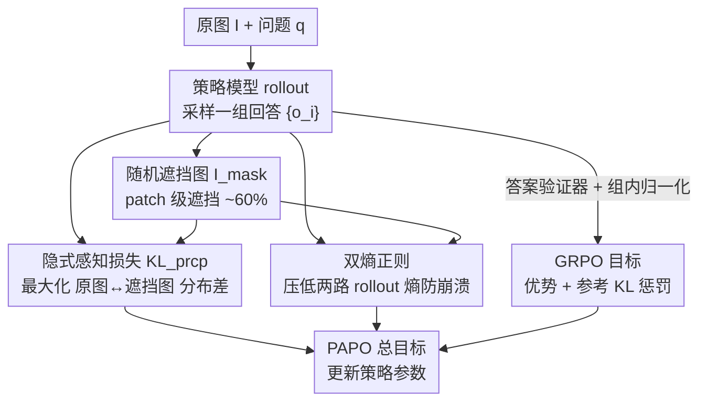

# Perception-Aware Policy Optimization for Multimodal Reasoning

**会议**: ICLR 2026  
**OpenReview**: [https://openreview.net/forum?id=izbBqTL8vb](https://openreview.net/forum?id=izbBqTL8vb)  
**代码**: 待确认  
**领域**: 多模态VLM / LLM推理 / 强化学习  
**关键词**: 多模态推理, RLVR, GRPO, 隐式感知损失, 训练稳定性

## 一句话总结
针对多模态 RLVR 中 67% 的错误其实源于"看不准图"这一被忽视的瓶颈，本文提出 PAPO，在 GRPO/DAPO 的优化目标里加一项"原图 vs 遮挡图"之间的隐式感知 KL 损失（外加双熵正则防崩溃），不需要任何额外标注/奖励模型/教师模型，就在 8 个多模态推理基准上带来 4.4%–17.5% 的整体提升、感知错误下降 30.5%。

## 研究背景与动机
**领域现状**：RLVR（带可验证奖励的强化学习）靠"格式 + 答案正确性"这类规则化奖励，把 DeepSeek-R1、GRPO 这类纯文本 LLM 的长链推理能力训得很强。自然地，一大批工作把 GRPO 直接搬到大型多模态模型（LMM）上，期望复刻同样的推理增益。

**现有痛点**：但搬过去的几乎只是"换了输入带图片"，优化目标本身原封不动——大家把精力都花在改数据、改 rollout 质量、改奖励设计上，而 GRPO 的目标函数仍然是文本时代的样子。结果是多模态推理一直追不上纯文本推理。

**核心矛盾**：作者做了一件关键的诊断工作——用标准 GRPO 训练 Qwen2.5-VL-3B，人工标注 200 个错误样本，发现 **67% 的错误来自感知（perception）**，即模型逻辑/代数推理本身没问题，但把图看错了（比如几何题里把 $x$ 关联到错误的边）。根因在于：GRPO 目标里**没有任何一项激励模型去生成"真正依赖视觉"的回答**——只要最终答案对，模型靠文本先验蒙对也照样拿奖励。

**本文目标**：能不能在多模态 RLVR 里**同时**提升感知和推理，而且不靠额外数据/奖励模型？

**切入角度**：以往承认感知重要的工作（加 captioning 奖励、加感知评分奖励）都把感知和推理**硬性切开**两阶段，还得额外挂一个大的神经网络奖励模型，又贵又受奖励模型能力上限制约。作者反过来想：感知激励能不能直接写进**核心优化目标**里，让模型"边学推理边学看图"，而不是分两步？

**核心 idea**：用一个"原图 vs 被遮挡图"之间的 KL 散度（信息增益视角）当隐式监督——如果遮掉图后模型对同一回答的概率掉得越多，说明这个回答越依赖视觉；最大化这个 KL 就等于逼模型生成视觉接地（visually grounded）的回答，全程无需任何外部监督。

## 方法详解

### 整体框架
PAPO（Perception-Aware Policy Optimized）是一个可以**直接替换 GRPO/DAPO** 的策略梯度算法，输入是 RLVR 标准三元组（视觉输入 $I$、问题 $q$、短答案 $a$），不需要 CoT 数据、也不做 SFT，直接 RL 训练。它在原本的 GRPO 目标上**叠加两项**：一项隐式感知损失（拉开"看原图"和"看遮挡图"的策略分布），一项双熵正则（防止前者被 hack 到崩溃）。

整体一次更新的流转是：策略模型对原图问题做 rollout 拿到一组回答 → 同一组回答同时在"原图"和"随机遮挡图"两条前向上各算一次概率 → 二者的 KL 差就是隐式感知损失（要**最大化**）→ 再用参考模型和答案验证器算原本的 GRPO 优势与奖励 → 把感知损失、双熵正则、GRPO 目标合成一个总目标更新参数。

### 关键设计

**1. 隐式感知损失：用"遮图前后的分布差"当无监督感知信号**

这是 PAPO 的核心，直接针对"GRPO 不激励视觉接地"这个痛点。作者定义一个感知比率 $r_{prcp}(\theta)=\dfrac{\pi_\theta(o\mid q,I)}{\pi_\theta(o\mid q,I_{mask})}$，其中 $o$ 是生成的 token 序列，$I_{mask}$ 是把原图遮掉一大块后的"损坏版"。从信息增益（Shannon）视角看，这个比率衡量"抽掉有意义的视觉信息后，模型输出分布变化了多少"：比率高说明没了图模型就给正确回答打很低的概率，即回答真的依赖视觉；比率低说明遮不遮无所谓，模型其实靠文本先验在答。

因此对一个"会看图"的模型，我们希望 $r_{prcp}$ 高，于是把它写成一项要**最大化**的 KL 散度加进 GRPO：$D_{KL}[\pi_\theta\|\pi_\theta^{mask}]=D_{KL}[\pi_\theta(o\mid q,I)\,\|\,\pi_\theta(o\mid q,I_{mask})]$，实现上按 Schulman 的无偏估计写成 $r_{prcp}-\log r_{prcp}-1$。妙处在于：它是**隐式**的——不需要标注哪里该看、不需要 captioning、不需要外挂奖励模型，纯靠模型自己跟"瞎眼版的自己"对比就产生了感知监督，开销极小。

**2. 双熵正则（Double Entropy Loss）：给无界的感知 KL 套上缰绳**

隐式感知损失理论上**无界**，直接最大化会被模型"钻空子"（KLprcp Hacking）：模型发现只要在原图下生成一堆和图无关的乱 token，就能把原图/遮挡图的分布差拉得很大，从而把 KL 刷高、但推理彻底崩溃。作者观察到崩溃的代表性前兆是**两路 rollout（$\pi_\theta$ 与 $\pi_\theta^{mask}$）的熵同时飙升**。

于是引入双熵损失，**同时压低这两路的熵**：$H[\pi_\theta]=\log\pi_\theta(o\mid q,I)$、$H[\pi_\theta^{mask}]=\log\pi_\theta(o\mid q,I_{mask})$，各配权重 $\eta_1,\eta_2$。它直击崩溃的内在信号，能在不牺牲性能的前提下稳住训练；实验里它比"只压一路熵"等替代正则都更稳，尤其在去掉参考 KL 惩罚（DAPO）的设定下几乎不可或缺。合并后的完整目标（以 GRPO 版 PAPOG 为例）为：

$$J_{PAPO_G}(\theta)=J_{GRPO}(\theta)+\gamma D_{KL}[\pi_\theta\|\pi_\theta^{mask}]-\eta_1 H[\pi_\theta]-\eta_2 H[\pi_\theta^{mask}]$$

其中 $\gamma$ 是感知损失权重，需谨慎调（见实验：$\gamma$ 过大如 0.04 会引发连双熵都救不回的崩溃）。

**3. patch 级随机遮挡：怎么造"损坏图" $I_{mask}$ 才有效**

感知信号的质量取决于怎么遮图。作者比较了两类策略：随机遮挡（patch 均匀采样遮掉）和语义感知遮挡（用 DINOv2 的 patch 自注意力分数挑显著区域优先遮）。直觉上语义遮挡应该更"狠"，但实测**随机遮挡反而更好**——作者推测语义遮挡会把整块显著区域一次抹掉，逼模型对所有物体平均用力、反而抓不住最有信息量的局部；而且它几乎零额外开销。

另外作者特意论证了**为什么用 patch 遮挡而非加高斯噪声**：像素级噪声即便很大也保不住会把语义抹掉（图里物体还看得出来），而 patch 遮挡能干净地移除语义内容，才能制造出真正"信息缺失"的对照。遮挡比例上，0.6–0.8 最佳；完全涂黑（1.0）反而不好——它会让模型不分内容地一律去"看"图，更容易触发 KLprcp Hacking。

### 损失函数 / 训练策略
在 ViRL39K 上从 Qwen2.5-VL-3B/7B、Qwen3-VL-2B 直接 RL 训练 2 个 epoch，学习率 1e-6，规则化验证器给奖励，不用 SFT、不用 CoT 数据。默认超参：无参考 KL 时 $\gamma$ 要更保守（如 0.01）且双熵必开；PAPOG-3B 用 $\gamma=0.02$、PAPOG-7B 用 $\gamma=0.01$ 是较好默认值；遮挡用 random @0.6。DAPO 版（PAPOD）同理推导。

## 实验关键数据

### 主实验
8 个多模态推理基准（avg@8 准确率 %），$\Delta\%_{rel}$ 为相对各自基线的平均相对增益。整体提升 4.4%–17.5%，在高视觉依赖子集上更显著（8.0%–19.1%）。

| 模型 / 方法 | General AVG | Vision-Dep AVG | Overall | Overall $\Delta\%_{rel}$ |
|------|------|------|------|------|
| GRPO-3B | 51.89 | 42.97 | 47.92 | — |
| PAPOG-3B | 53.39 | 45.57 | 49.92 | ↑4.36 |
| GRPO-7B | 62.51 | 54.11 | 58.78 | — |
| PAPOG-7B | 63.50 | 59.37 | 61.66 | ↑4.39 |
| DAPO-7B | 57.58 | 51.79 | 55.01 | — |
| PAPOD-7B | 65.83 | 59.82 | 63.16 | ↑17.54 |
| GRPO-2B (Qwen3-VL) | 49.13 | 43.97 | 46.84 | — |
| PAPOG-2B | 51.36 | 46.73 | 49.30 | ↑5.25 |

注意 PAPOD-7B 的视觉依赖子集相对增益高达 19.09%，且训练动态上 DAPO-7B 后期会**模型崩溃**，而 PAPOD 靠双熵正则持续上升不崩。感知错误经人工复核下降 **30.5%**。PAPO 还收敛更快，约 25 步就出现早期增益。

### 消融实验

| 配置 | Overall $\Delta\%_{rel}$ (3B) | 说明 |
|------|------|------|
| random @0.6 | ↑2.97 | 最优遮挡策略 |
| semantic @0.6 | ↑1.02 | 语义遮挡反而更差 |
| random @0.4 / 0.8 / 1.0 | ↑1.88 / ↑2.02 / ↑1.42 | 0.6–0.8 最佳，全黑(1.0)最差 |
| $\gamma=0.02$ | ↑4.36 | 3B 较优默认 |
| $\gamma=0.04$ (collapsed) | ↓28.46 | 权重过大直接崩溃 |

### 关键发现
- **感知是真瓶颈**：67% 错误来自感知，PAPO 把它压低 30.5%，证明动机站得住。
- **随机 > 语义遮挡**：简单的随机遮挡反而比 DINOv2 语义遮挡好，且零开销；遮挡比例 0.6–0.8 最优，全黑不行。
- **$\gamma$ 是双刃剑**：≤0.02 单调变好且对视觉依赖任务增益最大，0.04 会触发连正则都救不回的崩溃，大模型对高 $\gamma$ 更敏感。
- **正交可叠加**：PAPO 只改优化目标，与改 rollout 的 NoisyRollout 兼容，组合后还能再涨（51.89→51.89… overall 50.61→51.89）。
- **低视觉依赖也稳**：往纯文本 MMLU-pro 插入纯噪声"假图"，PAPO 仍不掉点，说明不会盲目去看无意义视觉 token。

## 亮点与洞察
- **把"诊断"做成了方法的灵魂**：先用 200 例人工错误分析定位"67% 是感知错"，再针对性地造一项感知损失——动机不是空喊，而是被数据钉死的，很有说服力。
- **隐式感知损失的设计极简却深刻**：用"和瞎眼版自己对比"代替"外挂奖励模型/教师"，把感知监督变成模型自产自销的信号，零标注零额外模型，可直接 drop-in 进任意 RLVR 算法。
- **暴露并命名了一个新失效模式**：KLprcp Hacking（最大化无界 KL → 生成无关 token 刷分崩溃），并给出可观测前兆（两路熵齐升）和对症正则（双熵），这套"发现-诊断-修复"闭环本身就很可迁移。
- **"用遮挡造信息差"这一招可外迁**：任何想衡量"输出是否真依赖某模态/某输入"的场景，都能借鉴"原始 vs 损坏输入的分布 KL"这个无监督探针。

## 局限与展望
- 隐式感知损失对**所有实例、所有 token 一视同仁**地施加，是极简设计；对天然不需要看图的样本可能是冗余监督，作者也承认这是可优化处（按视觉依赖度自适应加权会更优雅）。
- 训练稳定性高度依赖 $\gamma$ 与双熵正则的调参，$\gamma=0.04$ 即崩溃、大模型更敏感，落地时需要小心 grid search，鲁棒区间偏窄。
- 评测只取 exact-match 类任务、回避了需要 LLM-as-judge 的自由生成题，对"感知提升是否迁移到开放式多模态生成"还缺直接证据。
- 遮挡策略停在 random/semantic 两种，未探索更结构化的遮挡（如按问题相关区域动态遮），感知信号的上限可能还没摸到。

## 相关工作与启发
- **vs 加感知奖励的方法（如 captioning-first、感知评分奖励）**: 他们在**奖励层**动刀、把感知和推理硬切两阶段、还要外挂大奖励模型；PAPO 在**优化目标层**动刀、让感知与推理联合学习、零额外模型，更省也更"接地"。
- **vs GRPO / DAPO**: PAPO 不替换而是**叠加**在它们之上（PAPOG/PAPOD），相同数据/rollout/奖励下纯靠目标函数改动取得增益，是对 RLVR"目标函数"这一长期被忽视维度的补强。
- **vs NoisyRollout（rollout 视角改动）**: 二者正交、可叠加；NoisyRollout 在 4/9 基准上反而掉点，PAPO 更一致且与之组合还能再涨，体现"改目标"相比"改 rollout"更稳。

## 评分
- 新颖性: ⭐⭐⭐⭐⭐ 首个把感知监督做进 RLVR 核心优化目标、且无需任何外部监督的工作。
- 实验充分度: ⭐⭐⭐⭐⭐ 8 基准 × 多模型规模 × GRPO/DAPO 双底座，错误分析、稳定性深挖、兼容性全覆盖。
- 写作质量: ⭐⭐⭐⭐ 动机-诊断-方法-失效模式逻辑链清晰，公式与图配合到位。
- 价值: ⭐⭐⭐⭐⭐ 即插即用、零成本、可叠加，对多模态 RLVR 社区实用性很高。

<!-- RELATED:START -->

## 相关论文

- [\[ICLR 2026\] Perception-R1: Advancing Multimodal Reasoning Capabilities of MLLMs via Visual Perception Reward](perception-r1_advancing_multimodal_reasoning_capabilities_of_mllms_via_visual_pe.md)
- [\[ICLR 2026\] Unlocking the Essence of Beauty: Advanced Aesthetic Reasoning with Relative-Absolute Policy Optimization](unlocking_the_essence_of_beauty_advanced_aesthetic_reasoning_with_relative-absol.md)
- [\[CVPR 2026\] CodeV: Code with Images for Faithful Visual Reasoning via Tool-Aware Policy Optimization](../../CVPR2026/vlm_reasoning/codev_code_with_images_for_faithful_visual_reasoning_via_tool-aware_policy_optim.md)
- [\[ICLR 2026\] Unleashing Perception-Time Scaling to Multimodal Reasoning Models](unleashing_perception-time_scaling_to_multimodal_reasoning_models.md)
- [\[ICLR 2026\] MM-HELIX: Boosting Multimodal Long-Chain Reflective Reasoning with Holistic Platform and Adaptive Hybrid Policy Optimization](mm-helix_boosting_multimodal_long-chain_reflective_reasoning_with_holistic_platf.md)

<!-- RELATED:END -->
