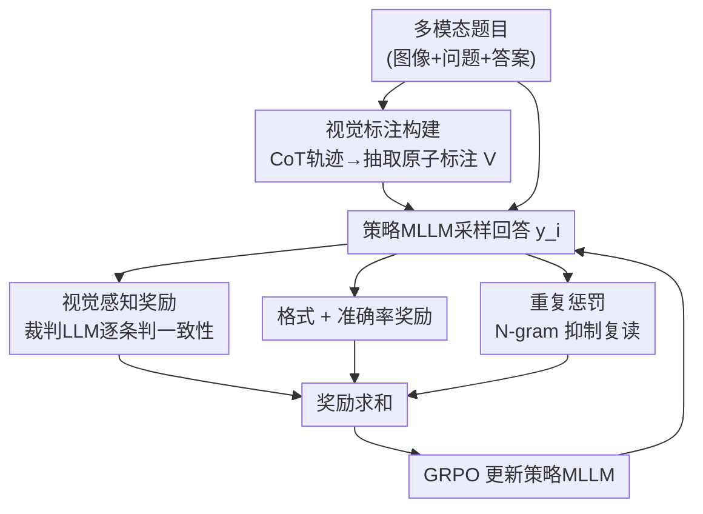

# Perception-R1: Advancing Multimodal Reasoning Capabilities of MLLMs via Visual Perception Reward

**会议**: ICLR 2026  
**OpenReview**: [https://openreview.net/forum?id=KttCXdjj4w](https://openreview.net/forum?id=KttCXdjj4w)  
**代码**: https://github.com/tongxiao2002/Perception-R1  
**领域**: 多模态VLM / LLM推理  
**关键词**: 多模态推理, RLVR, 视觉感知奖励, GRPO, 数据高效

## 一句话总结
针对"现有可验证奖励强化学习(RLVR)只奖励答案对错、几乎不改善多模态大模型的视觉感知"这一痛点，本文提出 Perception-R1：从优质 CoT 轨迹里抽取出原子级"视觉标注"作为参考，训练时用一个裁判 LLM 判断模型回答是否如实复述了这些视觉信息，据此给出**视觉感知奖励**，仅用 1,442 条训练数据就在 8 个多模态数学/通用基准上大幅超越用 20 万条数据训练的 Vision-R1。

## 研究背景与动机
**领域现状**：把 DeepSeek-R1 式的 RLVR 搬到多模态域，是当前提升 MLLM 推理能力的主流路线。MM-Eureka、R1-VL、Vision-R1、R1-OneVision 等工作都用"答案是否正确"作为可验证奖励，配合 GRPO 训练，确实在多模态数学基准上拿到了可观提升。

**现有痛点**：多模态推理可以自然拆成**多模态感知**(准确理解图像内容)和**逻辑推理**两部分，感知是推理的前提和地基。但作者通过细致分析发现，现有 RLVR 几乎只改善了逻辑推理，对感知能力毫无帮助。如论文 Figure 1 所示，模型嘴上说着图里根本不存在的"直角三角形 △OAE"，却歪打正着蒙对了答案——只看答案对错的奖励既无法纠正这种感知错误，反而会强化这条有缺陷的推理路径。

**核心矛盾**：根因是 RLVR 对感知的**奖励稀疏**——答案正确并不等价于感知准确，于是优化信号里完全没有"看对图"这一项。作者用 McNemar 检验在 MathVista 抽样定量验证：accuracy-only RLVR 训练前后模型的感知能力差异 p 值高达 0.22 与 0.69，远不显著；同时对错误案例归因发现 72%–78% 的失败都源于感知错误。换言之，感知是限制多模态推理继续上限的真正瓶颈。

**本文目标**：在不引入易被 reward hacking 的多模态奖励模型的前提下，给 RLVR 补上一路"看对图"的密集奖励信号，同时拉动感知与推理。

**切入角度**：既然 RLVR 之所以可靠是因为有"可验证"的参考答案，那感知奖励也照此办理——为图像准备一份可验证的"视觉参考"。优质推理模型的 CoT 轨迹里其实已经埋着大量准确的视觉描述(如 GE=10、GE⊥DF)，把它们抽出来当参考即可。

**核心 idea**：用"裁判 LLM 判断模型回答与抽取出的原子视觉标注是否一致"构造一路视觉感知奖励，加进 RLVR 奖励函数，显式逼模型先看对图再推理。

## 方法详解

### 整体框架
Perception-R1 整体仍是一套 GRPO 驱动的 RLVR 流程，关键改动在**奖励函数**：在传统的格式奖励、准确率奖励之外，新增一路视觉感知奖励和一路重复惩罚。流程分两阶段——**离线准备**先用 SOTA 闭源 MLLM 在训练集上生成 CoT 轨迹、保留答对的，再用一个纯文本强 LLM 把轨迹里的视觉信息抽成一串原子"视觉标注" $V=(v_1,\dots,v_m)$ 作为该题的视觉参考；**在线训练**时，策略模型对每道题采样若干回答，裁判 LLM 逐条判断每个 $v_j$ 是否在回答里被如实体现，据此算出视觉感知奖励，与其它奖励求和后送进 GRPO 更新策略。

### 关键设计

**1. McNemar 检验诊断：证明 accuracy-only RLVR 治不好感知**

这一步是整篇工作的动机基石，回应"为什么需要额外感知奖励"。作者没有停留在 Figure 1 的轶事观察，而是用统计检验把"RLVR 不改善感知"做实：在 MathVista 随机抽 50 道题，对比 RLVR 前后模型的对错变化，统计与感知相关的不一致(discordant)案例数，做精确二项形式的 McNemar 检验。Qwen2-VL-7B 与 Qwen2.5-VL-7B 得到的 p 值分别为 0.22、0.69，均远高于 0.05，说明训练前后感知能力无显著差异。配合对错误案例的归因(72%–78% 失败源自感知错误)，作者把感知锁定为限制多模态推理的真正瓶颈，从而论证只奖励答案对错的 RLVR 存在感知奖励稀疏的结构性缺陷。

**2. 视觉标注构建：把可验证的"视觉参考"从 CoT 轨迹里抽出来**

这一步解决"感知奖励拿什么当 ground-truth"。作者刻意类比准确率奖励中的标准答案——准确率奖励之所以可靠是因为有可验证参考，那感知奖励也得有。具体做法：用 SOTA 闭源 MLLM(Gemini-2.5-Pro)在训练集上生成 CoT 轨迹并只保留答案正确的，认为其中嵌入的视觉信息是准确且与解题强相关的；再用一个纯文本强 LLM(Qwen2.5-32B-IT)把轨迹里的视觉信息抽成一串**原子视觉标注** $V=(v_1,\dots,v_m)$，每个 $v_j$ 是一条与解题关键相关的图像事实(如 $GE=10$、$GE\perp DF$)。作者强调目标不是生成忠实图注，而是聚焦解题相关的视觉内容，避免被线条颜色等表层线索干扰；人工核查这些标注准确率达 96%。从 Geometry3K 的 2,101 条最终筛得 1,442 条带视觉标注的样本。

**3. 视觉感知奖励：用裁判 LLM 判一致性，给出可验证的密集信号**

这是核心奖励项，解决"如何把'看对图'变成可微优化的标量"。符号系统难以判断自然语言的复杂语义，作者引入裁判 LLM $\Phi$，对策略模型回答 $y_i$ 与视觉标注集 $V$ 中的每条 $v_j$ 逐条二元判定是否被如实体现，得到判断序列 $J=(o_{i,1},\dots,o_{i,m})$，$o_{i,j}\in\{0,1\}$。视觉感知奖励取命中比例：

$$r_v(y_i, V) = \frac{\mathrm{sum}\{o_{i,1},\dots,o_{i,m}\}}{|o_{i,1},\dots,o_{i,m}|},\quad o_{i,j}=\Phi(y_i, v_j)\in\{0,1\}$$

最终视觉增强奖励函数为 $r(y_i, a, V) = \alpha\, r_f(y_i) + \beta\, r_a(y_i, a) + \gamma\, r_v(y_i, V) + r_p(y_i)$，其中 $r_f$ 为格式奖励、$r_a$ 为准确率奖励、$\gamma$ 控制视觉感知奖励的权重。它把"看对图"这件原本无奖励的事变成密集可验证信号，从而缓解 RLVR 的感知奖励稀疏。作者刻意没有直接拿一个 MLLM 当奖励模型，而是用"标注+裁判判一致性"这种更接近 RLVR 的可验证形式，以规避奖励作弊。

**4. 重复惩罚：抑制引入视觉奖励后冒出来的复读副作用**

这是配套的稳定项。作者观察到一旦加入 $r_v$，模型生成会变得更爱重复(复读视觉描述以多命中标注)，反而损害推理能力。因此沿用前人做法，用简单的 N-gram 重复惩罚 $r_p$ 来抑制这种退化行为。消融显示去掉 $r_p$ 后多数基准都掉点，说明它是让视觉奖励真正发挥作用的必要补丁。

### 损失函数 / 训练策略
优化沿用 GRPO：对每道题从旧策略采样一组回答 $Y=(y_1,\dots,y_G)$，用组内奖励的标准化值估计优势 $\hat{A}_i=\frac{r(y_i,a,V)-\mathrm{mean}\{r\}}{\mathrm{std}\{r\}}$，免去 critic，再以带 clip 和 KL 正则的目标最大化更新策略。训练数据为 1,442 条 Geometry3K 几何题，推理用 vLLM、温度 0.0 贪心解码。

## 实验关键数据

### 主实验
在 8 个多模态基准(4 数学 + 4 通用)上，Perception-R1-7B 仅用 1.4K 数据即在除 EMMA 外的全部基准上超越所有开源推理 MLLM；相对 Vision-R1-7B/MM-Eureka-7B 的平均提升经单样本 t 检验 p < 0.01 显著。

| 模型 | #Data | MathVista | MathVerse | WeMath | MMMU | MMMU-Pro |
|------|-------|-----------|-----------|--------|------|----------|
| Qwen2.5-VL-7B-IT (base) | / | 68.1 | 47.4 | 61.4 | 55.2 | 37.0 |
| MM-Eureka-7B | 15K | 72.5 | 51.9 | 65.6 | 58.0 | 38.3 |
| Vision-R1-7B | 200K | 73.1 | 52.4 | – | 55.2 | 37.6 |
| **Perception-R1-7B** | **1.4K** | **74.2** | **54.3** | **72.0** | **60.8** | **42.4** |

数据效率惊人：比 Vision-R1 少 100×、比 MM-Eureka 少 10× 数据仍更好。即便只在几何题上训练，通用基准也同样领先，印证"感知是推理地基"的动机。感知能力的直接证据：在更考验感知的 Vision-Only 子集上大幅领先，且对 Perception-R1 重做 McNemar 检验 p=0.04 < 0.05，相比原模型感知显著改善。

### 消融实验

| 配置 | MathVista | MathVerse | WeMath | MMMU-Pro | 说明 |
|------|-----------|-----------|--------|----------|------|
| base + GRPO (accuracy-only) | 73.3 | 51.3 | 69.5 | 38.2 | 只有答案奖励 |
| **Perception-R1 (full)** | **74.2** | **54.3** | **72.0** | **42.4** | 完整模型 |
| w/o 视觉感知奖励 | 73.6 | 53.0 | 70.4 | 40.1 | 去掉 $r_v$ |
| w/o 重复惩罚 | 73.6 | 52.6 | 68.5 | 40.6 | 去掉 $r_p$ |
| base + SFT | 67.3 | 39.1 | 49.1 | 35.2 | 同数据做 SFT |
| Qwen2.5-VL-32B-IT 当奖励模型 | 73.2 | 54.1 | 66.3 | 40.6 | 直接用 MLLM 当 RM |

### 关键发现
- 去掉视觉感知奖励或重复惩罚，所有基准都掉点，两者都必要；带视觉奖励的变体在 MathVerse Vision-Only 子集上一致优于 accuracy-only。
- 直接拿强 MLLM(32B)当奖励模型不如 Perception-R1，作者归因于 reward hacking，凸显"构造可验证视觉标注"的价值；用同样 1,442 条 CoT 做 SFT 反而多数基准低于基线，说明优势来自 RL 而非数据本身。
- $\gamma$ 不敏感：$\gamma\in\{0.1,\dots,0.9\}$ 表现相近且都显著超过 $\gamma=0$，作者归因于 GRPO 对优势的组内标准化——少量视觉信号即足够。
- 裁判 LLM 能力要够：换成 7B 裁判时奖励快速饱和、出现严重 reward hacking，结果甚至低于原模型(MathVerse 46.1 vs 47.4)。

## 亮点与洞察
- **用统计检验把"感知没被改善"做实**：不靠个案截图，而用 McNemar 检验给出 p 值，让"感知是瓶颈"从直觉变成可信结论，是动机部分最扎实的地方。
- **把可验证性从答案迁移到感知**：核心巧思是"答案有标准答案、那感知也造一份可验证参考"——用原子视觉标注 + 裁判判一致性，既享受密集奖励又规避了直接上奖励模型的 hacking 风险，这套"造可验证参考"的思路可迁移到任何想加密集奖励却怕 reward hacking 的 RLVR 场景。
- **richer reward 换数据效率**：1.4K 数据胜过 200K，说明从同一条数据里榨取"答案之外"的监督信号(视觉一致性)是提升数据效率的有效杠杆。

## 局限与展望
- 训练数据仅 1,442 条几何题，作者自己也指出更高质量、更高多样性的数据有望进一步提升，目前在 EMMA 上仍落后。
- 视觉标注的质量依赖 SOTA 闭源 MLLM 生成 CoT + 强 LLM 抽取，整条管线对外部强模型有依赖；裁判 LLM 太弱会直接引发 reward hacking，对裁判能力有下限要求，推高了训练成本。
- 视觉标注是"解题相关的离散原子事实"，对几何这类结构化视觉信息友好，但能否迁移到自然图像、图表、文档等视觉标注难以原子化的场景，论文未充分验证。

## 相关工作与启发
- **vs MM-Eureka / R1-VL / Vision-R1**: 它们都在 accuracy-only RLVR 框架内靠训练技巧、冷启动或扩大数据提升推理，但忽略感知；本文指出感知才是瓶颈，用感知奖励直击根因，因此能以 10–100× 更少数据反超。
- **vs 直接用 MLLM 当奖励模型**: 后者易 reward hacking 且本文消融显示并不更好；Perception-R1 坚持"可验证参考 + 裁判判一致性"的 RLVR 范式，更稳更省。
- **vs SFT 蒸馏 CoT**: 同样 1,442 条 Gemini CoT 做 SFT 反而掉点，说明 RL 的泛化与数据效率优势，并非数据本身带来的。

## 评分
- 新颖性: ⭐⭐⭐⭐⭐ "把可验证奖励从答案扩展到视觉感知"这一视角清晰且击中 RLVR 的结构性盲点
- 实验充分度: ⭐⭐⭐⭐ 8 基准 + McNemar/t 检验 + $\gamma$ 与裁判规模分析较完整，但多偏几何数学域
- 写作质量: ⭐⭐⭐⭐⭐ 动机—诊断—方法—验证逻辑闭环，统计检验贯穿始终
- 价值: ⭐⭐⭐⭐⭐ 极致数据效率 + 可迁移的"造可验证参考"思路，对多模态 RLVR 实践有直接借鉴

<!-- RELATED:START -->

## 相关论文

- [\[ICLR 2026\] Perception-Aware Policy Optimization for Multimodal Reasoning](perception-aware_policy_optimization_for_multimodal_reasoning.md)
- [\[ICLR 2026\] ReVisual-R1: Advancing Multimodal Reasoning from Optimized Cold Start to Staged Reinforcement Learning](revisual-r1_advancing_multimodal_reasoning_from_optimized_cold_start_to_staged_r.md)
- [\[ICLR 2026\] Unleashing Perception-Time Scaling to Multimodal Reasoning Models](unleashing_perception-time_scaling_to_multimodal_reasoning_models.md)
- [\[ICLR 2026\] SophiaVL-R1: Reinforcing MLLMs Reasoning with Thinking Reward](sophiavl-r1_reinforcing_mllms_reasoning_with_thinking_reward.md)
- [\[ICLR 2026\] VisionReasoner: Unified Reasoning-Integrated Visual Perception via Reinforcement Learning](visionreasoner_unified_reasoning-integrated_visual_perception_via_reinforcement_.md)

<!-- RELATED:END -->
