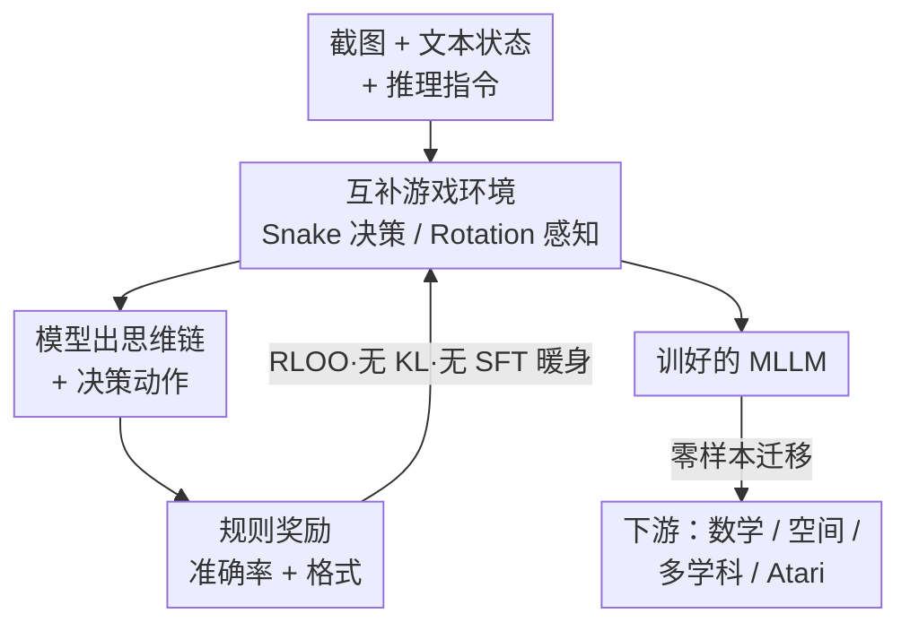

# Play to Generalize: Learning to Reason Through Game Play

**会议**: ICLR 2026  
**OpenReview**: [https://openreview.net/forum?id=u1tsgXPh2o](https://openreview.net/forum?id=u1tsgXPh2o)  
**代码**: https://yunfeixie233.github.io/ViGaL  
**领域**: 多模态VLM / LLM推理  
**关键词**: 多模态大模型, 强化学习, 游戏后训练, 跨域泛化, 代理任务

## 一句话总结
让一个 7B 多模态大模型用强化学习去玩贪吃蛇和 3D 旋转识别这类街机小游戏，全程不碰任何数学题、公式或图解，模型却能在 MathVista、MMMU 等多模态推理基准上反超那些专门用数学数据训练的同尺寸模型，同时不损失通用视觉能力。

## 研究背景与动机
**领域现状**：要给多模态大模型（MLLM）注入推理能力，当前主流做法是在精心标注的数学 / 几何 / 多学科数据集上做 RL 后训练（如 MM-Eureka、R1-VL、VLAA-Thinker 等），让模型在"开口前先思考"，生成思维链再给答案。已有证据表明，RL 比 SFT 在分布外样本上泛化更稳。

**现有痛点**：这套范式高度依赖大规模、领域内的人工标注数据——而高质量多模态推理数据极难规模化采集。更尴尬的是，专门用某领域数据训出来的"专家模型"往往会在通用视觉理解上掉点（顾此失彼），泛化边界被牢牢锁死在训练领域里。

**核心矛盾**：推理能力到底是"必须见过同域题目才能学到的领域知识"，还是"一种可迁移的底层认知技能"？如果是后者，那么死磕领域内数据就既昂贵又自我设限。

**本文目标**：找到一种**不依赖任何领域内推理数据**、却能激发可迁移推理能力的后训练代理任务（surrogate task）；同时保证它在提升推理的同时不破坏通用视觉能力。

**切入角度**：作者从认知科学和 AI agent 的经验观察出发——人类从童年起就通过游戏（排列物体、空间导航、操作工具）习得模式识别、空间推理、因果推断等抽象思维的基石；AI agent 也在捉迷藏、Atari 等游戏环境中涌现出可迁移技能。游戏提供结构化、规则化、可控难度、可无限合成的环境，天然适合做 RL 的"练兵场"。

**核心 idea**：把"玩游戏"当作 RL 后训练的代理任务（ViGaL，Visual Game Learning）——用规则奖励让 MLLM 学会玩贪吃蛇和旋转识别，由此涌现的推理技能会迁移到数学、空间、多学科等下游任务，类比自监督预训练里"设计 pretext 任务换取广泛泛化"的思路。

## 方法详解

### 整体框架
ViGaL 的逻辑很直白：**不在数学数据上训，而在游戏上训，靠规则奖励把推理技能"逼"出来，再让它零样本迁移到下游推理基准**。整条管线只有三个环节：把游戏建模成一个部分可观测马尔可夫决策过程（POMDP），模型在其中"看状态—想—出动作—拿奖励"；用纯规则的 RL（RLOO）直接后训练，不要 SFT 暖身、不加 KL 约束；最后把训好的模型直接拿去测数学 / 几何 / 多学科 / 通用视觉等一堆它从没见过的任务。作者特意设计了两个互补的游戏——侧重策略决策的 **Snake（贪吃蛇）** 和侧重视觉感知的 **Rotation（3D 旋转识别）**，分别锤炼推理与感知这两类基础能力。

### 关键设计

**1. 互补双游戏：用 Snake 练决策、Rotation 练感知**

针对"如何不碰领域数据却覆盖多类推理技能"的痛点，作者没有随便挑一个游戏，而是有意设计两个**认知机制互补**的游戏。Snake 是 $10\times10$ 棋盘上的双蛇对战：状态包含两条蛇的坐标 $(x^t_{si}, y^t_{si})$、苹果位置 $(x^t_a, y^t_a)$ 和上一步动作，模型每步从 $\{up, down, left, right\}$ 中选动作，撞墙 / 撞自己 / 撞对方即死，存活或得分高者胜——它强调路径规划、碰撞检测、最短路这类**策略决策**。Rotation 则给模型同一 3D 物体的初始视图 $I_{init}$ 和绕 z 轴旋转 $90°$ 或 $180°$ 后的视图 $I_{rot}$，要它判断旋转角度，还附一个已知旋转的 in-context 例子作引导——它强调角度估计、轴对齐这类**空间感知**。关键证据是：Snake 主要提升涉及 2D 坐标、表达式的数学题，Rotation 主要提升角度、长度题，**两个游戏一起训会进一步涨**（技能具有可组合性），证明不同游戏确实在喂养不同的可迁移技能，而非泛泛地"变聪明"。

**2. 纯规则奖励 + 巧妙的"最好/最坏动作"双预测**

针对"奖励黑客和如何让奖励真正激励推理"的问题，ViGaL 用最简单的规则奖励 $r = r_{accuracy} + r_{format}$：答对得 1、答错得 0，再加一项格式奖励，彻底避免 reward model 被钻空子。真正巧妙的是 Snake 的奖励重设计——不只让模型预测"最好的下一步"，而是**同时预测最好和最坏的两步**（最坏 = 直接送命的那一步）。这个看似多余的要求把下游平均准确率又抬了 1.8%，因为它逼模型把整个动作空间的后果都推演一遍，而不是只盯着一个贪心解。作者还做了对照：如果把标签换成**随机动作**，下游几乎零增益（49.4%，和基座持平），这与某些文本数学任务上"随机标签也能涨"的结论相反，说明**奖励信号必须真实有意义**，技能才是真学到的而非噪声拟合。

**3. RLOO + 无 KL 约束的规则化 RL，直接后训练不暖身**

针对"怎样让模型在游戏里大胆探索出更好的推理策略"，作者采用 REINFORCE Leave-One-Out（RLOO）做优势估计与策略更新，并遵循 Group Policy Gradient 的做法**省掉 KL 散度正则**。去掉 KL 约束意味着不再把新策略死死拴在基座附近，模型能更自由地在解空间里探索、发现更优的思维链。整套训练学 DeepSeek-R1 的配方（规则化格式 + 准确率奖励），**不用 SFT 暖身**直接上 RL。这一选择在消融里得到强力背书：用同样的游戏数据做 SFT 反而让数学掉 9.7%、几何掉 12.7%（SFT 在死记游戏动作，破坏了原有推理），而 RL 净涨 12.3%——RL 是"在保留通用能力的前提下扩展推理边界"，SFT 则是"用窄域数据覆盖掉旧能力"。

**4. 可控难度 + 可无限合成的游戏数据引擎**

针对"领域数据难规模化"的根本痛点，游戏环境的杀手锏是数据可以**按需无限生成且难度可控**。Snake 用 SnakeBench 当数据引擎，Rotation 用 Hunyuan3D 从图 / 文生成 3D 网格、再渲染成不同朝向的图像对（旋转角即自动标签），每个游戏合成 36K 样本即足够收敛。难度由蛇长定义（越长越难），作者把训练状态控制在蛇长 1–5 的适中区间，避免模型在过难 / 过易样本上次优收敛——这一步让准确率从 60.6% 提到 61.4%。数据可扩展性也得到验证：16K→32K 样本带来 1.3% 的平均提升。这正是游戏代理任务相对人工标注数据的结构性优势：规则化奖励 + 细粒度可控 + 近乎零成本扩展。

## 实验关键数据

### 主实验
基座为 Qwen2.5-VL-7B-Instruct，6 张 A100-80G 训练。下游数学基准（取多基准平均）：

| 模型 | 训练数据 | Math Avg | Geometry Avg | 备注 |
|------|---------|---------|--------------|------|
| Qwen2.5-VL-7B（基座） | — | 47.7 | 44.8 | 起点 |
| MM-Eureka-Qwen-7B | 大规模数学/几何 | 50.1 | 28.4 | 几何偏科崩塌 |
| OpenVLThinker-7B | 数学 | 47.8 | 56.4 | — |
| **ViGaL Snake + Rotation** | **仅游戏** | **50.6** | **57.1** | 不碰任何数学数据 |

ViGaL 仅靠游戏数据，数学平均反超专门训数学的 MM-Eureka，几何更是把后者（28.4，因专攻而严重偏科）远远甩开。在 CLEVR+ 与多学科（MMMU 系列）综合榜上，ViGaL Snake+Rotation 取得 64.7 平均分，比专门训综合数据的 R1-OneVision-7B 在 MMMU 系列上高 5.4%。

游戏自身能力（Tab. 1）：ViGaL 在 Snake 对战 GPT-4o / Gemini-2.5-Pro / Claude-3.7 等大模型时拿到 6–9/10 胜，Rotation 准确率 71.9%（基座仅 47.4%）；更关键的是**零样本迁移到 7 个从未训练过的 Atari 游戏**，累计奖励 2251 对基座 1253，几乎翻倍。

### 消融实验（Snake，下游平均准确率）

| 配置 | Avg | 说明 |
|------|-----|------|
| 基座 | 49.1 | 起点 |
| w/o 推理指令 | 59.5 | 提示里去掉"算曼哈顿距离找最近苹果"等引导 |
| **w/ 推理指令** | **62.3** | 引导思维链，+2.8% |
| 只预测最好动作 | 59.6 | — |
| **最好 + 最坏动作** | **62.3** | 双预测 +1.8% |
| 随机标签 | 49.4 | 几乎无增益，证明信号必须真实 |
| w/o 难度控制 | 60.6 | — |
| **w/ 难度控制** | **62.3** | 适中难度更优 |
| 仅文本输入 | 59.6 | — |
| **图像 + 文本** | **62.3** | 多模态再 +1.8% |
| SFT | 47.2 | 比基座还低，破坏推理 |
| **RL** | **62.3** | RL 净涨 12.3%，SFT 净降 1.9% |

### 关键发现
- **不同游戏喂养不同技能且可组合**：Snake 主升坐标 / 表达式题（+6.25 / +6.16），Rotation 主升角度 / 长度题（+8.75 / +4.62），两者合训全面占优——技能是模块化、可叠加的。
- **RL vs SFT 是范式级差异**：同样游戏数据，SFT 让模型死记动作并破坏通用推理（数学 -9.7%），RL 则在保留通用视觉能力的同时扩展推理边界（Tab. 9 显示通用视觉基本不掉点）。
- **游戏与数学数据互补**：在 ViGaL 之上再用 MMK12（约 12K 数学样本）做第二阶段，数学再涨 1.2%，且用同样数学数据时比 MM-Eureka 高 1.7%——游戏可作为数据增强的"底座"。
- **奖励信号必须有意义**：随机标签几乎零增益，推翻了"随机奖励也能涨"在视觉游戏域的适用性。

## 亮点与洞察
- **把"玩游戏"提升为代理任务范式**：这篇最"啊哈"的地方是证明了推理是一种可迁移的底层认知技能，而非必须见过同域题才能学的领域知识——只玩贪吃蛇就能做对数学题，挑战了"推理数据必须领域内"的默认假设。
- **认知对齐解释迁移路径**：作者用"Snake 的 2D 坐标推理 ↔ 表达式 / 坐标题"、"Rotation 的角度推理 ↔ 角度 / 长度题"把"为什么这个游戏帮这类题"讲清楚了，还扩展到 Maze / Tetris / Sudoku / Sokoban 四个游戏用 K-Means 验证系统性迁移模式，不是碰巧。
- **"最好+最坏"双预测奖励**是个可复用的小 trick：让模型推演全动作空间的后果而非只给贪心解，几乎零成本就涨点，可迁移到其他需要前瞻规划的 RL 任务。
- **数据可控可无限合成**：游戏引擎天然解决推理数据规模化的痛点，难度、模态、规模都可旋钮式调节，为"用合成代理任务替代人工标注"提供了具体范本。

## 局限与展望
- 作者承认两个游戏只覆盖了推理与感知两个维度，更复杂的推理（如长程多步规划、抽象符号）能否同样靠游戏激发尚未充分验证（附录扩展到 4 个游戏，但仍是有限集合）。
- 规模仅在 7B Qwen2.5-VL 单一基座上验证，更大模型或不同架构上游戏迁移是否同样有效、收益是否递减，缺乏直接证据。
- 迁移的"认知对齐"目前是定性 + 聚类层面的解释，缺少机制层面（模型内部表征如何被游戏重塑）的因果分析；哪些游戏机制对应哪些数学技能仍偏经验性。
- 改进思路：把"游戏库—下游技能"的对应做成可检索的设计空间，针对目标下游任务**反向设计**最匹配的代理游戏，而非手工挑两个。

## 相关工作与启发
- **vs MM-Eureka / R1-VL 等数学 RL 模型**：它们在领域内数学数据上做 RL，本文在完全无关的游戏上做 RL；区别在于把推理当作可迁移技能而非领域知识，本文优势是不需要昂贵的领域标注、且不会像专家模型那样在几何 / 通用视觉上偏科崩塌。
- **vs SFT 后训练**：用相同游戏数据，SFT 让模型记忆动作并破坏原有推理（掉点），RL 则探索出可迁移策略；印证了 RL 在分布外泛化上优于 SFT 的趋势，并把这一结论从数学迁移扩展到"游戏→数学"。
- **vs 自监督预训练（如旋转预测 pretext 任务）**：本文把"设计 pretext 任务换泛化"的思想从表示学习搬到了 RL 后训练阶段，Rotation 游戏本身就直接借鉴了自监督里的旋转角预测，思路一脉相承。

## 评分
- 新颖性: ⭐⭐⭐⭐⭐ 用游戏代理任务替代领域数据做推理后训练，范式层面有突破性
- 实验充分度: ⭐⭐⭐⭐⭐ 双游戏 + 多基准 + 完整消融 + Atari 零样本迁移 + 互补性 / 可扩展性验证
- 写作质量: ⭐⭐⭐⭐ 故事讲得清楚，认知对齐的解释到位，部分迁移机制偏定性
- 价值: ⭐⭐⭐⭐⭐ 为"合成代理任务替代人工标注"指出可扩展方向，对低成本激发推理有现实意义

<!-- RELATED:START -->

## 相关论文

- [\[CVPR 2026\] Seeing Clearly, Reasoning Confidently: Plug-and-Play Remedies for Vision Language Model Blindness](../../CVPR2026/vlm_reasoning/seeing_clearly_reasoning_confidently_plug-and-play_remedies_for_vision_language_.md)
- [\[ICLR 2026\] Game-RL: Synthesizing Multimodal Verifiable Game Data to Boost VLMs' General Reasoning](game-rl_synthesizing_multimodal_verifiable_game_data_to_boost_vlms_general_reaso.md)
- [\[CVPR 2026\] Decouple to Generalize: Context-First Self-Evolving Learning for Data-Scarce Vision-Language Reasoning](../../CVPR2026/vlm_reasoning/decouple_to_generalize_context-first_self-evolving_learning_for_data-scarce_visi.md)
- [\[ICLR 2026\] DeepEyes: Incentivizing "Thinking with Images" via Reinforcement Learning](deepeyes_incentivizing_thinking_with_images_via_reinforcement_learning.md)
- [\[ICLR 2026\] DIVA-GRPO: Enhancing Multimodal Reasoning through Difficulty-Adaptive Variant Advantage](diva-grpo_enhancing_multimodal_reasoning_through_difficulty-adaptive_variant_adv.md)

<!-- RELATED:END -->
