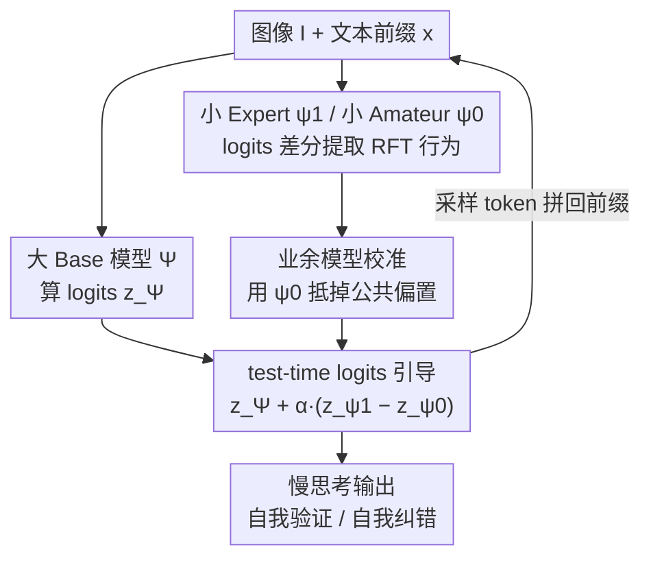

# ProxyThinker: Test-Time Guidance Through Small Visual Reasoners

**会议**: ICLR 2026  
**OpenReview**: [https://openreview.net/forum?id=dt6fnFypEn](https://openreview.net/forum?id=dt6fnFypEn)  
**代码**: https://github.com/MrZilinXiao/ProxyThinker  
**领域**: 多模态VLM / LLM推理  
**关键词**: 视觉推理, 解码时引导, logits 差分, 强化微调, 慢思考

## 一句话总结
ProxyThinker 提出一种**完全免训练**的推理时方法：把一个小的「RFT 推理专家」与同尺寸「base 业余模型」的 token 级 logits 差分，按系数 $\alpha$ 加到大 base 模型的输出 logits 上，就能让 32B/72B 大模型在不更新任何参数的前提下"继承"小模型经强化微调学到的自我验证、自我纠错等慢思考行为，在数学与多学科视觉推理基准上逼近甚至超过同尺寸全量 RFT 模型，并通过 vLLM 异步并行实现做到 38× 加速。

## 研究背景与动机
**领域现状**：当前让大视觉语言模型（LVLM）具备"慢思考"推理能力的主流路线是**可验证奖励强化学习（RLVR / RFT）**——用 PPO、GRPO 这类算法，奖励能自动验证答案正确性的中间推理过程，从而把模型推向会分支讨论、会回溯、会自我检查的推理模式。OpenAI-o1、DeepSeek-R1、QwQ 都是这一路线的产物。

**现有痛点**：RFT 极其昂贵。一方面 PPO/GRPO 需要同时维护多份模型副本（policy、reference、reward 等），显存开销巨大；另一方面训练在 rollout 与优化两阶段间反复横跳，流程复杂、耗时极长。结果是：业界几乎**没人敢对 7B 以上的 LVLM 做 RFT**，模型规模一上去训练就负担不起。

**核心矛盾**：想要大模型的强容量 + RFT 的推理行为，但二者乘在一起的训练成本无法承受。而近期一批工作（Yue et al. 2025b 等）指出一个关键观察：**RFT 并不教给模型新知识，只是放大了 base 模型采样分布里本就潜在的推理行为**。也就是说，"慢思考"能力在大 base 模型里其实已经存在，只是没被激活。

**本文目标**：能否绕开对大模型的 RFT，直接从一个**便宜的小模型**身上把"激活推理行为"这件事迁移过来？

**切入角度**：作者借鉴解码时引导（decoding-time steering，如 DExperts、Contrastive Decoding）的思路——既然 RFT 的作用是把概率质量移向慢思考 token，那么"小 RFT 专家"与"小 base 业余模型"在每一步的 logits 之差，恰好就是 RFT 这一行为偏移的**显式信号**，且这个信号是模型尺寸无关的。

**核心 idea**：用「小专家 logits − 小业余 logits」这个差分向量去引导「大 base 模型」的解码，把小模型学到的推理行为"代理"到大模型上，全程零训练。

## 方法详解

### 整体框架
ProxyThinker 在自回归解码的**每一步**同时跑三个模型：一个待引导的大 Base 模型 $\Psi$（如 Qwen2.5-VL-32B/72B），一个小的 base Amateur 模型 $\psi_0$（Qwen2.5-VL-7B），以及它经 RFT 得到的小 Expert 模型 $\psi_1$（如 VL-Rethinker-7B）。三者共享同一组输入图像 $I$ 与当前文本前缀 $x_{<t}$，各自算出 logits $z_\Psi$、$z_{\psi_0}$、$z_{\psi_1}$。ProxyThinker 把 Expert 与 Amateur 的 logits 之差作为"RFT 行为方向"，按系数 $\alpha$ 叠加到大模型 logits 上后再 softmax 采样，采到的 token 拼回前缀，喂给三个模型进入下一步——形成一个贯穿整段生成的反馈回路。最终大模型的"行为"被悄悄改写成了慢思考推理者，但参数一个都没动。

### 关键设计

**1. logits 差分作为 RFT 行为的载体：免训练迁移慢思考**

本文要解决的痛点是"大模型 RFT 训不起"。作者的做法是把 RFT 的效果**抽象成一个可加的方向向量**：既然 RFT 只是放大 base 分布里已有的推理行为，那么同一尺寸下「RFT 专家 $\psi_1$」减去「未训练业余 $\psi_0$」的 logits 之差 $z_{\psi_1}-z_{\psi_0}$，就近似等于"RFT 这一步把哪些 token 抬高、哪些压低"的纯净信号。它在词表上是稠密的，且与模型规模解耦——小模型上算出来的差分，可以直接搬去引导大模型。最终 ProxyThinker 模型 $\hat\Psi$ 的输出分布为：

$$p(x_t \mid x_{<t}, I) = \mathrm{softmax}\big[\,z_\Psi(x_t \mid x_{<t}, I) + \alpha \cdot \big(z_{\psi_1}(x_t \mid x_{<t}, I) - z_{\psi_0}(x_t \mid x_{<t}, I)\big)\big]$$

它有效的原因在于：大 base 模型本身就具备深层推理的"容量"，缺的只是把慢思考行为激活的"触发"；而小专家虽然懂得在该犹豫时输出 "Wait/However/But"，却因容量有限只能做浅层推理（比如反复重述选项）。把前者的容量与后者的行为信号相加，等于让大模型在大模型自己的知识储备上执行慢思考，二者优势互补。论文图 2 的案例显示：单独的大/小 base 模型读到一段错误推理后都会草率给答案，小专家会"质疑"但纠不对，叠加 logits 差分后大模型被成功触发出有效的自我纠错并选对答案。

**2. 三模型代理架构：Base / Expert / Amateur 的角色分工**

ProxyThinker 刻意用**三个**而非两个模型。大 Base 模型 $\Psi$ 是被引导对象、提供知识与容量；小 Expert $\psi_1$ 提供"RFT 后应该怎么推理"；小 Amateur $\psi_0$ 提供"RFT 前同尺寸模型本来怎么推理"。关键点在于：单看 $z_{\psi_1}$ 会把小模型自身的能力短板和偏置也一起带进来；只有用同尺寸、同架构、仅差一次 RFT 的 $\psi_0$ 去做差，才能**抵消掉与 RFT 无关的公共成分**，剩下的才是 RFT 真正贡献的行为偏移。训练成本上，作者只需对 7B 小模型做一次 RFT 得到 $\psi_1$，远比直接 RFT 一个 32B/72B 大模型便宜，这正是"代理（proxy）"二字的由来。

**3. 业余模型的校准作用：与朴素对比解码的本质区别**

为了证明 Amateur 不可或缺，作者对比了一个改版对比解码 baseline：它只用 $z_\text{base}+\alpha\cdot z_\text{expert}$（直接加专家 logits，不做差）。$\alpha$ 扫描实验（图 4）显示 ProxyThinker 全程显著优于该 baseline。原因是：直接加 $z_{\psi_1}$ 会把小专家分布的绝对偏置强行灌进大模型，污染其原有能力；而 $z_{\psi_1}-z_{\psi_0}$ 是**相对量**，$\psi_0$ 起到把专家分布"归零校准"的作用，只保留 RFT 引入的增量，从而既注入推理行为又不破坏大模型本身的强分布。作者还观察到一个直观规律：$\alpha$ 越大、差分主导性越强，性能逐渐向"小专家本身"收敛（$\alpha\to1.5$ 时退化）；$\alpha\in[0.1,1.0]$ 都能稳定带来增益，方法对 $\alpha$ 高度鲁棒、无需调参。

**4. 异步张量并行调度：把多模型解码的开销压下去**

同时跑三个模型天然昂贵，过去的解码时引导方法用粗粒度流水并行——专家模型必须等 base 模型走完所有流水阶段才能动，多 GPU 上留下大量空闲（图 3）。ProxyThinker 在 vLLM 上实现协同解码，复用 KV cache、张量并行、连续批处理；并进一步发现小模型增大张量并行规模收益递减，于是**只给大 base 模型做张量并行，把小 Expert / Amateur 放进独立的张量并行进程组里异步执行**，三方 logits 仅在采样前用集合通信同步一次。这套调度把 GPU 空闲降到最低：相比所有旧方法采用的 Huggingface 实现获得约 33× 加速，再靠优化的 TP 分组多砍 13%，总计 38× 加速，整体耗时已逼近直接跑一个 32B RFT 专家。

### 一个完整示例
以图 2 的 MathVision 题目"房间面积是多少"为例：给定同一段**错误**的中间推理后，大 Base 模型（Qwen2.5-VL-32B）和小 Base 模型都倾向直接顺着错误过程给出最终答案；小 Expert（RFT 7B）会在 "Wait/However/But" 等 token 上分配高概率、表现出自我验证意愿，但受限于 7B 容量只能浅层地"把选项重述一遍"，纠不到正确答案。ProxyThinker 把 $z_{\psi_1}-z_{\psi_0}$ 以 $\alpha=0.5$ 叠加到大模型上后，大模型被触发出"Wait, let's double check"，并真正利用自身能力把房间拆成一个大矩形加两个小矩形重新计算，最终选对 (E)。图 6 进一步显示：解码早期差分信号噪声大、只在一些 byte 级乱码 token 上小幅扰动；到了推理中后段差分变得结构化，明确把响应导向自我反思模式。

## 实验关键数据

### 主实验
在数学与多学科推理基准上评测，$\alpha=0.5$，Pass@1 贪心解码。Base 为 Qwen2.5-VL-32B/72B，Amateur 固定为 Qwen2.5-VL-7B，Expert 取三个公开 7B RFT 模型。

| Base 模型 | Expert | MathVista | MathVerse | MathVision | MMMU-Pro | R1-Bench | 平均 Δ |
|-----------|--------|-----------|-----------|------------|----------|----------|--------|
| Qwen2.5-VL-32B | – | 74.7 | 53.8 | 38.4 | 49.5 | 49.4 | 0.0 |
| Qwen2.5-VL-32B | OpenVLThinker-7B | 77.4 | 53.8 | **40.8** | 51.8 | 53.0 | +2.2 |
| Qwen2.5-VL-32B | VL-Rethinker-7B | 78.1 | 55.3 | 39.2 | 52.8 | 52.5 | +2.4 |
| VL-Rethinker-32B（全量RFT天花板） | – | 78.8 | 56.9 | 40.5 | 50.6 | 50.8 | +2.4 |
| Qwen2.5-VL-72B | – | 74.8 | 55.1 | 38.1 | 51.6 | 50.4 | 0.0 |
| Qwen2.5-VL-72B | VL-Rethinker-7B | 78.1 | 58.6 | 39.5 | 53.1 | 54.4 | +2.7 |

最亮眼的一点：用只有 25.3% MathVision 准确率的 OpenVLThinker-7B 当专家，竟把 32B base 从 38.4% 抬到 40.8%，**反超**全量 RFT 的 VL-Rethinker-32B（40.5%）——专家本身很弱却能引导出更强结果，强力佐证迁移的是"行为"而非"知识"。

### 消融 / 分析实验

| 分析 | 关键指标 | 说明 |
|------|---------|------|
| 去掉 Amateur（改用 $z_\text{base}+\alpha z_\text{expert}$ 对比解码） | MathVision/MathVerse 全程更低 | Amateur 的校准作用不可替代 |
| $\alpha$ 扫描 $[0.1,1.5]$ | 0.1–1.0 均稳定增益；最优 $\alpha$ 达 40.3/57.2 | 对超参鲁棒，默认 0.5 还非最优 |
| 推理开销（MathVision，8×A100） | HF 19133s → Ours 578s → 优化TP 501s | 38× 加速，逼近直跑 32B RFT（451s） |
| 推理行为统计（gpt-4o-mini 判定，3040 样本） | 回溯 +137%、验证 +44%、子目标 +0.6% | 继承专家的回溯/验证，又保住 base 的子目标规划 |

### 关键发现
- **专家质量决定增益上限**：专家越强、推理路径越结构化，对大模型的提升越大；VL-Rethinker-7B 这一最强专家在 32B 与 72B 上都给出最佳平均增益。
- **Pass@k 的双刃性**：纯 RFT 会降低推理边界（$k$ 增大时多样性下降、pass@k 反而走低）；ProxyThinker 的 pass@k 曲线在 $k\ge2$ 时**夹在 base 与专家之间**，既继承了专家的高效采样、又部分保留了 base 的多样化探索。
- **规模可扩展性**：32B 上平均增益已与全量 RFT 相当、个别任务还能超天花板；72B 上增益幅度变小但仍全面为正。

## 亮点与洞察
- **把"训练"压缩成一个可加向量**：核心洞见是"RFT = 放大已有行为"，于是用 logits 差分把这件事显式化、模块化，迁移时无需任何梯度更新——这是该方法最优雅的地方。
- **小模型反哺大模型**：一个准确率 25% 的小专家能让 40% 的大模型再涨且超过全量 RFT，颠覆"老师必须比学生强"的直觉，说明引导的是激活机制而非答案本身。
- **Amateur 的"相对化"思想可迁移**：用同尺寸未训练模型做差来剥离公共偏置、只留增量，这一校准技巧可推广到任何"想迁移某种微调行为却不想带入模型固有偏置"的解码时控制场景。
- **工程务实**：异步 TP 分组让多模型解码从"慢 33 倍"变成"和直跑大模型差不多"，把解码时引导从论文 demo 推向可部署。

## 局限与展望
- **推理时三模型并存**：即便有 38× 优化，仍需同时加载并运行 Base+Expert+Amateur 三模型，显存与算力占用高于单模型推理，端侧/低资源场景不友好。
- **依赖现成小 RFT 专家**：方法本身免训练，但前提是存在一个同家族、同 tokenizer 的小 RFT 专家与对应 base 业余模型；换到没有现成专家的领域仍需先训一个小专家。
- **词表/架构耦合**：logits 差分要求三模型共享词表与对齐的解码空间，跨架构（不同 tokenizer）迁移受限。
- **MMMU 验证集是例外**：并非所有基准都涨，作者观察到 MMMU 验证集上未见一致提升，72B 上个别任务出现负增益（如 OpenVLThinker-7B 专家下 MathVision −1.9），弱专家可能引入负面效应。

## 相关工作与启发
- **vs DExperts / Contrastive Decoding**：它们用专家/反专家或大/小模型对比来控制毒性、提升开放生成质量，目标是"属性控制/抑制劣质 token"；ProxyThinker 把同一套 logits 引导范式用于**迁移推理行为**，目标正交，且用 Amateur 做相对校准而非直接对比。
- **vs 全量 RFT（VL-Rethinker-32B/72B）**：RFT 需要昂贵训练且会收窄 pass@k 推理边界；ProxyThinker 零训练、用小专家代理，在 32B 上平均增益持平甚至个别超越天花板，并更好保留 base 的探索多样性。
- **vs "RFT 不教新知识"系列工作（Yue et al. 2025b 等）**：那些工作提出观察，ProxyThinker 把观察落成可操作的推理时算法，相当于该理论的一个工程化验证。

## 评分
- 新颖性: ⭐⭐⭐⭐⭐ 把"RFT=放大已有行为"落成可加 logits 差分、实现免训练大模型推理增强，视角新且自洽
- 实验充分度: ⭐⭐⭐⭐ 多基准、多 Base/Expert 组合、$\alpha$ 扫描、Pass@k、行为统计、开销分析都齐，但 MMMU 等反例与负增益讨论略简
- 写作质量: ⭐⭐⭐⭐⭐ 动机推导清晰，案例与可视化（图 2/图 6）有效支撑直觉
- 价值: ⭐⭐⭐⭐⭐ 为无法负担大模型 RFT 的场景提供实用、可部署的推理增强路径

<!-- RELATED:START -->

## 相关论文

- [\[ICLR 2026\] Test-Time Matching: Unlocking Compositional Reasoning in Multimodal Models](test-time_matching_unlocking_compositional_reasoning_in_multimodal_models.md)
- [\[ICLR 2026\] Small Drafts, Big Verdict: Information-Intensive Visual Reasoning via Speculation](small_drafts_big_verdict_information-intensive_visual_reasoning_via_speculation.md)
- [\[ICLR 2026\] No Labels, No Problem: Training Visual Reasoners with Multimodal Verifiers](no_labels_no_problem_training_visual_reasoners_with_multimodal_verifiers.md)
- [\[CVPR 2026\] UniT: Unified Multimodal Chain-of-Thought Test-time Scaling](../../CVPR2026/vlm_reasoning/unit_unified_multimodal_chain-of-thought_test-time_scaling.md)
- [\[ICLR 2026\] Empowering Small VLMs to Think with Dynamic Memorization and Exploration](empowering_small_vlms_to_think_with_dynamic_memorization_and_exploration.md)

<!-- RELATED:END -->
