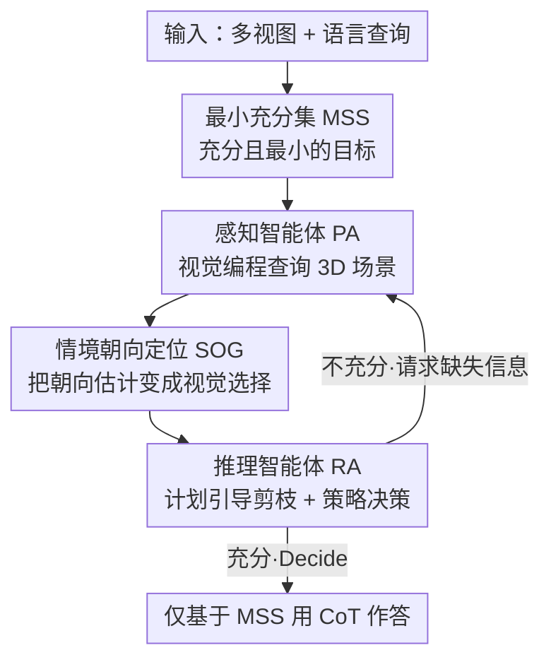

# Pursuing Minimal Sufficiency in Spatial Reasoning

**会议**: ICLR 2026  
**OpenReview**: [https://openreview.net/forum?id=bZAKJwyn1n](https://openreview.net/forum?id=bZAKJwyn1n)  
**代码**: https://github.com/gyj155/mssr  
**领域**: 多模态VLM / 空间推理 / Agent  
**关键词**: 空间推理, 最小充分集, 双智能体, 视觉编程, 朝向定位

## 一句话总结
针对 VLM 在 3D 空间推理上既"看不准"又"被冗余信息带偏"的双重瓶颈，本文提出零样本双智能体框架 MSSR：感知智能体用视觉编程主动查询 3D 场景、推理智能体迭代地剪枝并按需补全，最终凑出一个"最小充分集（MSS）"再作答，在 MMSI-Bench 与 ViewSpatial-Bench 上分别比 GPT-4o backbone 提升 +19.2 和 +16.8 个百分点。

## 研究背景与动机
**领域现状**：空间推理——把语言落到 3D 空间里的物体关系上——是机器人、AR/VR 等物理世界应用的基础能力。现代 VLM 在通用视觉任务上很强，但在"椅子是不是朝着窗户""从门进来时钟在我的左前还是右前"这类需要 3D 几何的问题上一直翻车。

**现有痛点**：作者把失败诊断成两个相互独立的瓶颈。其一是**3D 感知不足**：VLM 几乎都在 2D 数据上预训练，缺乏几何先验，对布局、朝向、深度这些 3D 量天生估不准。其二是**冗余信息拖垮推理**：3D 场景信息密度极高，把所有感知结果一股脑塞给 VLM，会稀释注意力、诱发"捷径式"启发推理——比如看到"桌子在椅子前面"就脑补"椅子一般面向桌子"从而答错（论文 Fig.1 的两个反例）。

**核心矛盾**：解决第一个瓶颈（多采集 3D 信息）天然会加剧第二个瓶颈（信息冗余）。既要"够用"（充分性），又要"别多"（最小性），二者存在张力。

**切入角度**：作者借了认知科学的一个观察——人不是穷举处理所有感官输入，而是构建**任务专属的最小心智模型**，按需补细节、逐步更新。统计学里对应的是"最小充分统计量"：用最压缩的形式保留样本里全部相关信息。

**核心 idea**：把 3D 空间推理重新表述为**主动构造一个"最小充分集"（Minimal Sufficient Set, MSS）**的过程——回答某个具体问题所需的、最紧凑的空间信息表示。用"采集"和"剪枝"两个专门化智能体在闭环里协作，逼近这个 MSS，再只基于它作答。

## 方法详解

### 整体框架
MSSR 处理的是语言条件下的空间推理：给定同一场景的 $M$ 张视图 $I=\{I_1,\dots,I_M\}$ 和自然语言查询 $q$，输出答案 $a$。但它不直接作答，而是先迭代地构造 MSS。形式化地，设 $W$ 是从完整 3D 场景能导出的全部空间与语义信息，目标 MSS $S^\star\subseteq W$ 要同时满足两条：**充分性**——存在理想推理器 $R^\star$ 使 $R^\star(S^\star,q)=a^\star$（不漏任何关键信息）；**最小性**——$\forall S'\subset S^\star,\ R^\star(S',q)\neq a^\star$（再删一点就答不对，即维持充分性的最小集合）。

整个流程是**感知智能体（PA）与推理智能体（RA）的闭环协作**。从空集 $S$ 出发：PA 先执行一条"尽可能多采集相关信息"的宽泛指令，把 $S$ 填成一个可能冗余的空间基元集合；RA 接手后先制定推理计划，把与计划无因果关联的信息**剪掉**以追求最小性；若剪后仍不充分，RA 就向 PA 发一条**精准的缺信息请求**，PA 据此再跑一轮编程把缺的补上。如此"剪枝—定向补全"反复，直到 RA 判定 $S$ 已充分；此刻 RA **丢弃所有历史上下文，只在这份精炼的 MSS 上**用 CoT 推出答案，保证聚焦与可解释。

### 关键设计

**1. 最小充分集（MSS）：把空间推理重述成"凑刚好够用的信息"**

这是全文的底座设计，直接回应"充分性与最小性张力"这个核心矛盾。作者不把推理当成"喂越多信息越好"，而是定义一个要主动逼近的目标集合 $S^\star$：既要满足 $R^\star(S^\star,q)=a^\star$（够用），又要满足 $\forall S'\subset S^\star,\ R^\star(S',q)\neq a^\star$（不能再删，即最小）。由于真实场景里拿不到理想推理器，MSSR 通过不断更新 $S$ 来近似 $S^\star$。这个表述的价值在于：它把"VLM 答错"明确拆成"信息缺"和"信息多"两类可单独处理的失败，从而让后面的 PA（管补）和 RA（管删）各司其职。消融里专门验证了最小性不是效率优化而是正确性的来源——把集合元素从平均 17.3 项剪到 5.9 项，准确率反而从 45.8% 升到 48.3%。

**2. 感知智能体 PA：用有状态的视觉编程把 3D 场景查成结构化数据**

PA 针对"3D 感知不足"瓶颈。它采用视觉编程范式：每轮接收当前 $S$、原始查询、场景图像 $I$ 和 RA 发来的自然语言请求 $r$，生成一段 Python 脚本去调用一套预设模块（调用视觉专家模型做几何重建、物体定位、坐标变换等），把新抽到的物体坐标、空间关系等写进字典再并入 $S$。关键设计是**跨轮保存执行状态**：每次脚本执行后把整个 Python 环境（中间变量、数据结构）存成快照，下轮重新载入，于是后续感知能直接复用之前的计算、避免重复劳动，支持有状态的逐步探索。工具箱里除了基础的 `locate`（定位 3D 坐标）和 `computation`（数值/坐标系变换）模块，还有两个为鲁棒空间理解专设的模块：**3D 场景重建**用快速神经重建模型（实验里用 VGGT）从稀疏 2D 图估出相机参数、深度图和统一点云，作为后续抽信息的"画布"，并顺带分割地平面；**全局坐标系标定**则依据查询里的显式指令（如"假设窗户朝东"）或显著地标对齐场景坐标轴，消解"左/后"这类视角相关词的歧义，为多步推理提供一致参照。

**3. 情境朝向定位 SOG：把朝向估计从"回归 3D 向量"改写成"多选题视觉选择"**

朝向是空间推理的硬骨头，而 VLM 恰恰无法直接回归 3D 几何输出。SOG 的核心思路是**绕开回归、改做视觉选择**：对锚定在物体位置 $P_o$ 的查询，先随机生成 4 个平行于地面、两两正交的共面向量 $\{\vec{d}_i\}_{i=1}^4$（像罗盘方向），用视觉提示把这些候选 3D 方向**叠画到两个视图**上——保留自然语境的"情境视图"（原图）和减少透视压缩的"标准视图"（俯瞰合成视角），然后让 VLM 选出最符合语言查询的那个；选定后再在其周围生成更密的候选重复选择，**由粗到细**收敛到精确方向。这样既回避了 VLM 不擅长的坐标回归，又发挥了它强的语义场景理解。SOG 不仅能处理物体内在朝向（"椅子的正面"），更能处理**情境相关朝向**（"出房间的方向""上楼时人面朝哪边"）——后者是先前工作普遍忽略的能力，把可处理查询从静态定位大幅拓展到动态、视角化推理。消融显示去掉 SOG（直接让 VLM 推方向向量）整体掉到 46.9%。

**4. 推理智能体 RA：计划引导剪枝 + 充分/补全二选一的策略决策**

RA 是认知核心，负责保证 $S$ 既充分又最小，分两阶段工作。第一阶段**计划引导的信息整理**：RA 先就查询制定高层推理计划，初始化一个空的 $S_{n+1}$，然后**逐项审视** $S_n$ 中每条信息对计划的相关性，只把必要的保留进 $S_{n+1}$——这种减法式过滤是维持 $S$ 简洁的关键。第二阶段**策略决策**，二选一：若判定 $S_{n+1}$ 不足以完成计划，就发 `<Request>`——一条精准描述缺什么的自然语言指令（如"找坐在椅子上的人的朝向"），连同剪过的 $S_{n+1}$ 回传给 PA 触发新一轮编程；若判定已含全部必要信息，就触发 `<Decide>`——丢弃所有历史上下文，只在这份最小集合上用 CoT 推出答案，使最终推理免受无关数据干扰。值得注意的是 PA 和 RA 都是**零样本**运行，靠高层原则而非 ICL 示例引导，因而泛化性强、不易过拟合到数据集特例。

### 一个完整示例
以查询"开门进来时，时钟相对我在哪？（A 正前 / B 左 / C 右前 / D 左前）"为例：PA 第一轮宽泛采集，吐出一个 18 项的 $S_n$，含门的位置、时钟位置、"进来"的朝向、相机位姿、室外位置等一大堆。RA 接手，按"建坐标系→算角度"的计划把 $S_n$ 剪到只剩 3 项核心信息 $\{\text{Loc(door)}, \text{Loc(clock)}, \text{Orient(come\_in)}\}$；判定这 3 项还差具体角度计算，于是发 `<Request>` 让 PA "建立坐标并计算角度"。PA 补回角度信息后，RA 判定充分，触发 `<Decision>`：以进门方向为北，时钟在北偏西 38°/52°，即落在"左前方"，选 D。整条轨迹从 18 项压到 3 项再补全，既可解释又能当作训练监督数据。

## 实验关键数据

### 主实验
在 MMSI-Bench（多视图情境推理）和 ViewSpatial-Bench（多视角关系理解）两个 benchmark 上，MSSR（GPT-4o 后端）均刷新 SOTA：

| 数据集 | 指标 | MSSR | GPT-4o backbone | 最强对比 | 提升 |
|--------|------|------|----------------|----------|------|
| MMSI-Bench | overall | 49.5 | 30.3 | o3 41.0 | +19.2 (vs backbone) / +8.5 (vs o3) |
| ViewSpatial-Bench | overall | 51.8 | 35.0 | LEO 43.7 | +16.8 (vs backbone) |
| MMSI-Bench | multi-step reasoning | 50.0 | 30.8 | — | — |

相比最强开源 Qwen3-VL-8B（31.1%），MMSI-Bench 上相对提升超过 60%；对 3D-VLM（VLM-3R 32.0）、专家模型（LEO 39.3）、agent 框架（ViLaSR 30.2）都保持明显领先。ViewSpatial 上 Camera-Based 51.0、Person-Based 54.4，说明它能跨自我中心/他者中心视角稳定泛化。

### 消融实验

| 配置 | MSR | MMSI | ViewSpatial | 说明 |
|------|-----|------|-------------|------|
| Ours (Full) | 50.0 | 49.5 | 51.8 | 完整模型 |
| GPT-4o | 30.8 | 30.3 | 35.0 | 裸 backbone |
| Only PA | 33.8 | 37.1 | 32.5 | 去掉 RA，PA 直接编程作答 |
| Only RA | 31.8 | 31.1 | 35.3 | 去掉 PA，RA 只靠初始上下文 |
| w/o SOG | 47.0 | 46.9 | 43.2 | 用直接提示 VLM 推方向替代 SOG |
| w/o Iteration | 44.4 | 47.2 | 48.8 | 最大迭代设为 1，禁止补全 |

### 关键发现
- **最小性是正确性来源而非效率优化**：受控实验把信息集做成"充分性归一化"后，集合从 17.3 项剪到 5.9 项，准确率反而从 45.8% 升到 48.3%，呈集合大小与准确率的反相关——冗余信息确实是 LLM 智能体的显著干扰源。
- **两个 agent 缺一不可**：Only PA 掉到 37.1（top-down 执行擅长采集但不擅推理），Only RA 几乎不比 baseline 强（提示无法替代精确的 3D 感知），印证二者的协同。
- **PA 比 RA 更吃后端能力**：跨模型消融里把 PA 从 GPT-4o 降到 Qwen2.5 掉 9.4%，降 RA 只掉 5.3%；因为 PA 要精确生成代码/调 API，而 RA 的自然语言规划更鲁棒。由此可"强 PA + 轻 RA"（GPT-4o + Qwen2.5）保留约 90% 性能（44.2 vs 49.5）省成本。

## 亮点与洞察
- **把"统计学最小充分统计量"搬进 agentic VLM**，给"信息越多越好"的累加式 3D agent 打了一个补丁——明确把"剪枝"当成与"采集"同等重要的一等公民，这是相对 ReAct 类纯累加 agent 的关键分野。
- **SOG 把不可解的 3D 回归改写成可靠的视觉选择**，由粗到细 + 双视图叠画候选向量，是一个可迁移到其他"VLM 估不准几何量"场景的通用 trick。
- **有状态的视觉编程**：跨轮保存整个 Python 环境快照，让感知能复用历史计算，把一次性脚本变成可增量探索的闭环，这个工程设计对任何工具增强 agent 都有借鉴价值。
- 零样本、免训练、不动 VLM 权重，因而不破坏通用能力、也不需昂贵 3D 指令数据，还顺带产出可解释推理轨迹作为未来 3D 模型的监督数据。

## 局限与展望
- SOG 不追求亚度级精度，作者承认在需要极精细朝向的任务上可能不够；当前仅在两个 benchmark 上验证，更广的真实机器人/AR 场景尚待检验。
- 整个框架依赖外部视觉专家模型（重建用 VGGT、定位用专家分割检测）的质量，重建或定位出错会沿链路传导，论文未深入分析这种级联误差。
- 闭环迭代 + 多次调用专家模型 + VLM，推理开销与延迟应高于单体 VLM，论文给了"强 PA + 轻 RA"的省钱方案但未系统报告端到端时延/成本。
- RA 的剪枝依赖"计划相关性"判断，若计划本身偏了可能误删关键信息——剪枝的鲁棒性边界值得进一步探究。

## 相关工作与启发
- **vs 单体 3D-VLM（LEO / VLM-3R / LLaVA-3D）**：它们靠在合成 3D 数据上微调或接点云模块注入 3D 知识，需昂贵 3D 指令集且有遗忘预训练知识的风险；MSSR 零样本、不动权重，保留 VLM 全部能力，靠结构化感知-推理流程取胜。
- **vs 纯累加式 agent（ReAct / VADAR / 3D VQA agent）**：它们主要做信息采集、采用累加策略；MSSR 的关键departure 是"既采集又剪枝"，针对 3D 场景的高冗余专门加了 RA 的减法过滤。
- **vs 视觉编程（VisProg / ViperGPT）**：通常一次性执行；MSSR 把视觉编程嵌进闭环并跨轮保存执行状态，使后续感知能在先前计算上增量构建、避免重复劳动。

## 评分
- 新颖性: ⭐⭐⭐⭐⭐ 把"最小充分统计量"思想形式化进 agentic 空间推理，SOG 的回归→选择改写也很巧
- 实验充分度: ⭐⭐⭐⭐⭐ 两 benchmark + 丰富 baseline + 最小性受控实验 + 跨后端泛化，论证扎实
- 写作质量: ⭐⭐⭐⭐ 动机—方法—实验链条清晰，图示到位；部分模块实现细节下放附录
- 价值: ⭐⭐⭐⭐⭐ 零样本免训练即显著提升空间推理，且产出可解释轨迹可作未来训练数据

<!-- RELATED:START -->

## 相关论文

- [\[ICLR 2026\] Spatial CAPTCHA: Generatively Benchmarking Spatial Reasoning for Human-Machine Differentiation](spatial_captcha_generatively_benchmarking_spatial_reasoning_for_human-machine_di.md)
- [\[ICLR 2026\] Transductive Visual Programming: Evolving Tool Libraries from Experience for Spatial Reasoning](transductive_visual_programming_evolving_tool_libraries_from_experience_for_spat.md)
- [\[ICLR 2026\] SpinBench: Perspective and Rotation as a Lens on Spatial Reasoning in VLMs](spinbench_perspective_and_rotation_as_a_lens_on_spatial_reasoning_in_vlms.md)
- [\[ICLR 2026\] Spatial-DISE: A Unified Benchmark for Evaluating Spatial Reasoning in Vision-Language Models](spatial-dise_a_unified_benchmark_for_evaluating_spatial_reasoning_in_vision-lang.md)
- [\[ICLR 2026\] OmniSpatial: Towards Comprehensive Spatial Reasoning Benchmark for Vision Language Models](omnispatial_towards_comprehensive_spatial_reasoning_benchmark_for_vision_languag.md)

<!-- RELATED:END -->
