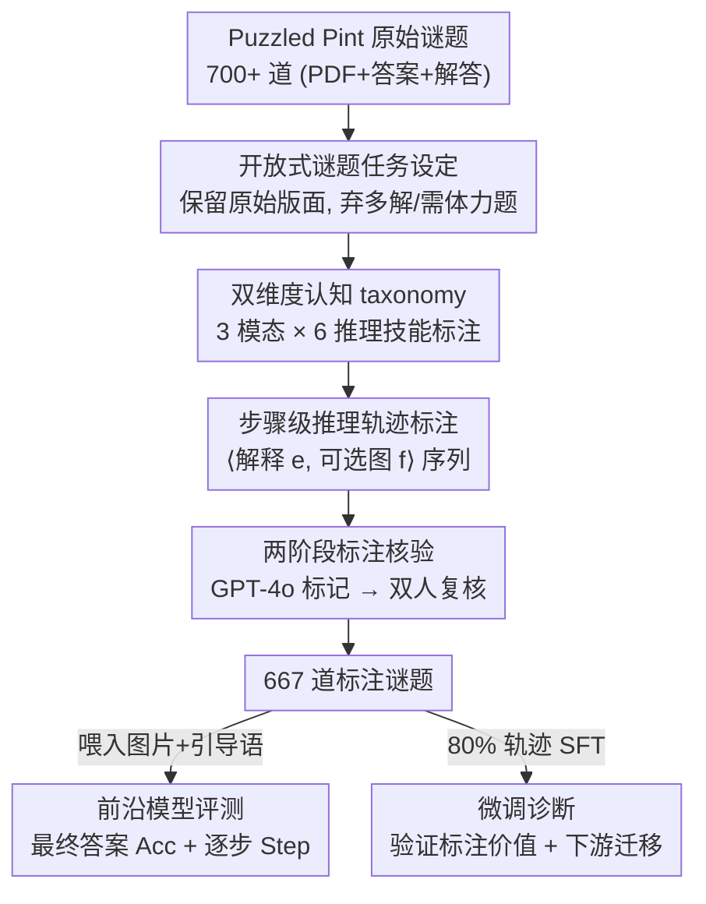

# PuzzleWorld: A Benchmark for Multimodal, Open-Ended Reasoning in Puzzlehunts

**会议**: ICLR 2026  
**OpenReview**: [https://openreview.net/forum?id=5sAsjb2jCb](https://openreview.net/forum?id=5sAsjb2jCb)  
**代码**: https://github.com/MIT-MI/PuzzleWorld  
**领域**: 多模态VLM / 推理评测  
**关键词**: 开放式推理, 多模态谜题, 推理评测基准, 步骤级评分, puzzlehunt

## 一句话总结
PuzzleWorld 收集了 667 道「解谜马拉松」(puzzlehunt) 风格、没有明确题目定义的多模态谜题，给每道题标注了最终答案、逐步推理轨迹和认知技能标签，结果发现当前最强模型最终答案准确率只有 1–18%，远落后于解谜爱好者，并通过逐步评分和微调实验揭示出模型「短视推理、过度依赖语言、缺乏视觉草稿能力」三大短板。

## 研究背景与动机
**领域现状**：当前语言与多模态推理的进步，大多建立在数学、代码、几何这类「题目定义清晰、环境受约束」的基准上。这些任务把问题空间预先框定好——代码题有可执行环境验证、几何题有领域专用语言描述结构——模型只需在既定问题空间里求解。

**现有痛点**：这类基准本质上只考「在给定问题里求解」(solve within a pre-defined problem space) 的能力，而几乎不考「先发现问题是什么」(discover the problem itself) 的能力。然而真实世界的科学发现、探索性数据分析、情报研判，恰恰是规则未明、目标模糊的开放式环境，需要动态提出假设、适应隐含结构、跨模态创造性推理。基础模型在这种开放式设定下的表现，此前几乎没被系统测过。

**核心矛盾**：现有多模态基准（MMMU、OlympiadBench、ARC-AGI 等）要么是贴近训练分布的「良定义」学科题，主要测分布内推理；要么是抽象视觉模式题，缺乏真实世界那种探索式、多模态交织的开放性。与 PuzzleWorld 最接近的 EnigmaEval 同样用 puzzlehunt 评测，但它是闭源、只给评测、不含人工逐步标注，无法做中间推理与失败模式的细粒度诊断。

**本文目标**：构造一个开放式、组合式、真正考验「先想清楚这是什么题、再想怎么解」的多模态推理基准，并且要能支持细粒度诊断（哪一步崩了、为什么崩）和模型训练。

**切入角度**：作者选中 puzzlehunt 这一谜题门类——解题者不会被告知任务是什么，必须先从文本、图像、文化梗里的模糊线索推断问题性质，再设计并执行解法。这天然要求组合思维、横向联想，以及「顺着线索走、撞墙后回溯、管理不确定性」的韧性，是评测通用推理的理想载体。

**核心 idea**：把 Puzzled Pint 月度解谜活动的真实谜题做成基准，**保留原始版面**（不拆成纯文本+图像，因为空间布局本身是解题线索），并为每道题人工标注**逐步推理轨迹 + 输入模态 + 认知技能**，从而既能测最终答案、又能测中间推理进度。

## 方法详解

### 整体框架
PuzzleWorld 不是一个模型方法，而是一个**评测基准的构建 + 评估管线**。输入是 Puzzled Pint 从 2010–2025 年发布的 700 多道原始谜题（每道含原始 PDF、单短语答案、解答文档），输出是 667 道经过清洗与标注的谜题，每道题带有标准化 metadata（标题、引导语、难度、答案、逐步推理、模态标签、技能标签、来源）。在评估端，模型被喂入谜题图片与转写的引导语，输出最终答案与解题过程，再用「最终答案准确率」和「逐步准确率」两个指标打分。

整条管线按「采集 → 人工标注 → 自动核验 → 人工清洗」四步串行展开，叠加贯穿全程的两个评测维度（模态 × 技能）和两个评测指标。下图给出数据构建与评估的鸟瞰：

### 关键设计

**1. 开放式谜题任务设定：用「先发现问题、再解问题」的双重挑战逼出通用推理**

针对「现有基准只考良定义问题求解」这一痛点，作者刻意选用 puzzlehunt：解题者拿到的不是清晰任务，而是嵌在文本、图像、文化梗里的模糊线索，必须自己推断「这到底是什么题」。一个谜题可能要求先把第一行当二进制、第二行当摩尔斯码、第三行当旗语来解码，再把结果组合——没有任何指令告诉你该这么做。关键的工程决定是**保留谜题原始版面**而非像 EnigmaEval 那样把内容转写成分离的文本和图像，因为空间布局（词填进螺旋图、圆环上的字母顺序）本身就是解题信息；同时弃掉「解答不完整、多重正确答案、需要物理活动」的谜题，最终留下 667 道。这一设定让任务无法靠贴近训练分布的模式匹配蒙混，必须真正做横向联想、符号抽象与视觉空间推理的融合。

**2. 双维度认知 taxonomy：把「考什么能力」拆成模态 × 推理机制两个正交轴**

为了让评测可诊断、而不只是给一个总分，作者沿两个维度给每道题打标签。**输入模态**分三类：Text（指令/叙事/字谜等语言信息）、Visual（图像、图标、字体排印等非结构化视觉）、Structured（表格、网格、矩阵、图表等有组织的视觉）。**推理机制**分六种核心认知能力：logic（演绎/因果等推断）、wordplay（双关、字母重排、同音等灵活语言操作）、spatial（心理操控物体、在结构中导航）、cryptic decoding（识别并施加密码、隐藏编码等变换）、knowledge（科学/历史等领域事实）、commonsense（隐含的现实世界预期）。通过把每道题映射到「模态组合 × 技能组合」，就能定位模型在哪个认知维度强、哪个弱，比单一准确率信息量大得多。

**3. 步骤级推理标注与逐步准确率：用中间进度把「全崩的 0%」拆成可观测的推理轨迹**

最终答案准确率普遍只有个位数，这种「一刀切」几乎看不出模型推理到底走到哪一步。作者的核心标注贡献是把解题过程分解成**有序推理步骤**，每步形式化为元组 $\langle e, f\rangle$，其中 $e$ 是文本解释、$f$ 是可选的示意图；并松散要求每步以一个原子操作（如发现模式、画草稿）开头，后接该操作的中间输出。在此基础上定义**逐步准确率 (stepwise accuracy)**：由于谜题可能有多条解法路径，把一个候选解的逐步分定义为「它成功执行到的、参考解里最靠后的那一步占总步数的比例」。具体由 GPT-4o 充当 LLM judge，逐步判断候选回答是否命中参考解的每一步。该 judge 在 20 道随机题上与人工评分的 Pearson 相关系数达 $r=0.829$、MAE 仅 $0.083$，说明评分可靠。这个指标让「最终答案全错但中间推理不错」的模型（如 InternVL3 答案 0.89% 但逐步 15.49%）得以区分。

**4. 两阶段标注核验与污染检查：用「机器初筛 + 双人复核」保证标注质量与基准可信度**

人工逐步标注容易引入歧义和不一致，直接影响诊断分析的可信度。作者设计两阶段核验：先用 GPT-4o 自动为每道题的标注打「正确性与推理连贯性」标记，筛出有歧义或逻辑断裂的步骤（共标记了 12.11% 的数据）；再由两名人工核验员独立复核所有被标记项并修正（最终修改了 10.93% 的初始标注）。作为额外质量保证，对随机 5% 子集做人工核验，96.5% 的标注被判为正确。最后还专门检查前沿模型是否「背过」这些谜题（数据污染），结论是无污染证据。这套流程让 667 道题的标注既一致又可信，使得后续「微调能涨、错误能归因」的结论站得住。

## 实验关键数据

### 主实验
在 PuzzleWorld 上评测前沿闭源推理模型（GPT-o3、GPT-4o、Claude Opus 4、Gemini-2.5/3-Pro、Grok 4）与开源模型（QVQ-72B、InternVL3-78B、Kimi VL A3B），并提供人类三档基线（新手 / 爱好者 / 专家）。

| 模型 | 最终答案 Acc | 逐步 Step | 备注 |
|------|------|------|------|
| QVQ-72B-Preview（开源最佳） | 1.36 | 30.23 | 答案最低、逐步反超不少闭源 |
| InternVL3-78B | 0.89 | 15.49 | 答案近 0 但中间推理尚可 |
| GPT-4o | 1.83 | 22.09 | — |
| Claude Opus 4 | 4.50 | 24.56 | — |
| Gemini 2.5 Pro | 7.65 | 31.61 | — |
| GPT-o3 | 14.22 | 39.81 | — |
| **Gemini 3 Pro（整体最佳）** | **18.00** | **39.99** | 仅持平人类新手 |
| Human Novice | 13.89 | 23.10 | 模型最佳≈新手 |
| Human Enthusiast | 44.44 | 51.70 | 远超所有模型 |
| Human Expert | 100.0 | 100.0 | 假设满分 |

大多数模型最终答案准确率仅 1–4%，最强的 Gemini 3 Pro 也只解出 18% 的谜题、逐步 40%，刚追平人类新手，但与爱好者（44%）和专家（100%）差距巨大。按模态看，模型在文本谜题上最好，在非结构化视觉谜题上最差（常不到文本准确率的一半）；结构化谜题（如版面规整的填字）反而好于自由视觉，暴露出视觉定位与空间推理的持续短板。

### 微调实验（标注价值与下游迁移）
用 80% 数据微调 8B 的 InternVL3，分别用「推理轨迹」和「仅最终答案」两种监督，在 20% 测试集评估。

| 配置 | Acc | Step | 说明 |
|------|------|------|------|
| Base | 0.76 | 4.78 | 未微调 |
| Fine-tuned（仅答案） | 0.00 | 2.96 | 推理坍塌、答案归零 |
| Fine-tuned（推理轨迹） | 0.76 | 11.00 | 逐步准确率翻倍 |

下游迁移上，微调后的模型在 Rebus 视觉谜题（3.2%→5.1%）、MathVista 几何（65.87%→66.35%）和视觉问答（32.40%→39.11%）上提升，但在依赖外部知识的教科书问答（63.92%→60.13%）和数学应用题（62.37%→59.14%）上略降。

### 关键发现
- **最强模型只到人类新手水平**：18% 的天花板说明开放式多模态推理是当前模型的真空地带；逐步指标证明「答案全错」背后中间推理质量差异很大，基准既难又可诊断。
- **逐步标注是金矿**：仅用最终答案微调会让推理坍塌（逐步 4.78%→2.96%、答案归零），而用推理轨迹微调能把逐步翻倍到 11.00%，且迁移到视觉导向的下游任务，说明学到的是可迁移的通用推理能力而非任务特定技巧。
- **三大错误模式**：① 短视推理 (myopic)——GPT-o3 在多数题上逐步得分为 0，一旦认定早期表层假设（如咬定摩尔斯码）就不回溯、不验证；② 语言瓶颈——把视觉内容误转成文本表征导致失真；③ 缺乏草稿能力——无法执行视觉 sketching 步骤来得到正确中间产物。

## 亮点与洞察
- **「先发现问题」才是下一道坎**：论文最有价值的视角是指出现有基准都在「给定问题空间内求解」，而真正通向通用智能的是「连问题是什么都要自己推断」的开放式环境。puzzlehunt 是这个抽象命题的绝佳实体化。
- **逐步准确率的定义很聪明**：把「成功执行到的最靠后参考步」作为得分，既绕开了「谜题多解法路径」的难题，又用 LLM judge（与人工 r=0.829）把昂贵的人工评估自动化，这个评测协议可迁移到其他开放式推理任务。
- **保留原始版面是反直觉但正确的决定**：多数基准会把图文拆开方便处理，本文反其道而行，因为空间布局本身是线索；且引用前人结论说明瓶颈不在 OCR，从而把人力省下来做更有价值的逐步标注。
- **「仅答案微调反而坍塌」是个警示**：它直接证明在复杂推理任务上，监督信号的形态（过程 vs 结果）比数据量更关键，对 reasoning model 训练有借鉴意义。

## 局限与展望
- **数据来源单一**：谜题全部来自 Puzzled Pint，风格、语言（英文）和文化梗偏向特定社群，可能限制对其它类型开放式推理的覆盖；不过作者强调基准会随新谜题发布持续增长。
- **评测依赖 LLM judge**：逐步准确率由 GPT-4o 判定，虽与人工高度相关，但在边界 case 和它自身不擅长的视觉步骤上仍可能有系统偏差。
- **微调方案较朴素**：仅用直接 SFT，答案准确率几乎纹丝不动（0.76%），说明简单微调不足以攻克这种复杂推理，留给后续 RL / 工具调用 / 显式回溯机制很大空间。
- **难度-步数相关性弱（0.24）**：说明难度更多来自开放性而非步数，难度标签作为单一维度可能不足以刻画题目，未来可引入更细的难度建模。

## 相关工作与启发
- **vs EnigmaEval**: 二者都用 puzzlehunt 测推理，但 EnigmaEval 闭源、只给评测、无逐步标注；PuzzleWorld 开源谜题 + 富标注，支持中间推理与失败模式的细粒度诊断，且保留原始版面而非拆分图文。
- **vs MMMU / OlympiadBench / SciBench**: 这些是良定义的学科多模态题，主要测贴近训练分布的分布内推理；PuzzleWorld 主打无明确指令的开放式推理，要求创造性拼接跨模态线索。
- **vs ARC-AGI**: ARC 测抽象视觉模式、最小先验，但缺乏真实世界那种探索式、多模态交织的开放性；PuzzleWorld 用真实 puzzlehunt 补上这块。
- **vs PuzzleVQA / AlgoVQA / PUZZLES**: 这些聚焦窄域、受限任务格式，现代模型普遍表现不错；PuzzleWorld 的非结构化谜题让模型大面积失败，更能暴露真实推理短板。

## 评分
- 新颖性: ⭐⭐⭐⭐⭐ 把「先发现问题」的开放式推理实体化为可评测基准，并配套逐步标注与诊断指标，视角和落地都新。
- 实验充分度: ⭐⭐⭐⭐⭐ 覆盖 9 个前沿模型 + 三档人类基线 + 模态/难度分解 + 微调与下游迁移 + 三类错误归因，相当完整。
- 写作质量: ⭐⭐⭐⭐ 动机推导清晰、图表到位，个别数字（intro 14% vs 表格 18%）口径略有出入。
- 价值: ⭐⭐⭐⭐⭐ 开源谜题 + 富标注 + 可诊断指标，为开放式多模态推理研究提供了稀缺且可持续增长的资源。

<!-- RELATED:START -->

## 相关论文

- [\[AAAI 2026\] SToLa: Self-Adaptive Touch-Language Framework with Tactile Commonsense Reasoning in Open-Ended Scenarios](../../AAAI2026/vlm_reasoning/stola_self-adaptive_touch-language_framework_with_tactile_commonsense_reasoning_.md)
- [\[ICLR 2026\] MathNet: A Global Multimodal Benchmark for Mathematical Reasoning and Retrieval](mathnet_a_global_multimodal_benchmark_for_mathematical_reasoning_and_retrieval.md)
- [\[ICLR 2026\] SportR: A Benchmark for Multimodal Large Language Model Reasoning in Sports](sportr_a_benchmark_for_multimodal_large_language_model_reasoning_in_sports.md)
- [\[ICLR 2026\] MMR-V: What's Left Unsaid? A Benchmark for Multimodal Deep Reasoning in Videos](mmr-v_whats_left_unsaid_a_benchmark_for_multimodal_deep_reasoning_in_videos.md)
- [\[NeurIPS 2025\] MM-OPERA: Benchmarking Open-ended Association Reasoning for Large Vision-Language Models](../../NeurIPS2025/vlm_reasoning/mm-opera_benchmarking_open-ended_association_reasoning_for_large_vision-language.md)

<!-- RELATED:END -->
