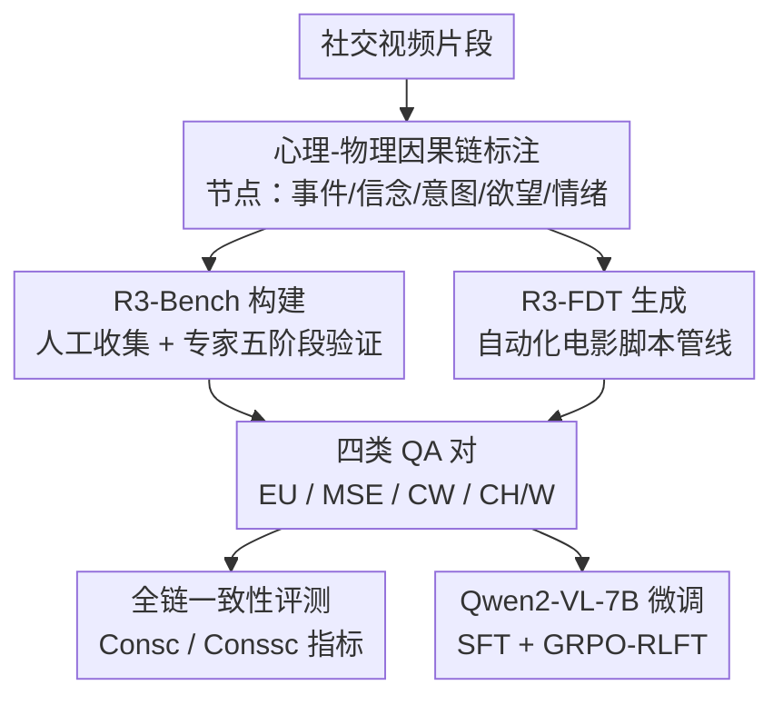

# Read the Room: Video Social Reasoning with Mental-Physical Causal Chains

**会议**: ICLR 2026  
**OpenReview**: [https://openreview.net/forum?id=TJilJnZjpw](https://openreview.net/forum?id=TJilJnZjpw)  
**代码**: https://github.com/LiXingNiu/Read-the-Room  
**领域**: 多模态VLM / LLM推理  
**关键词**: 视频社会推理、心理-物理因果链、心智理论、视觉语言模型评测、社会认知基准

## 一句话总结
本文提出 R3-Bench 评测基准与 R3-FDT 大规模训练集，通过「心理-物理因果链」结构系统评估 LVLM 的视频社会推理能力，揭示了当前顶尖模型与人类水平之间的巨大差距，并证明在 R3-FDT 上微调可显著提升多个基准的社会推理性能。

## 研究背景与动机

**领域现状**：「读懂房间」（Read the Room）是人类社会智能的核心能力——从细微社交线索中推断他人心理状态，理解信念、意图、欲望和情绪之间的因果关系。近年来大型视觉语言模型（LVLM）在多模态理解上取得长足进步，但社会推理评测体系远未成熟。

**现有痛点**：现有视频 QA 基准（MVBench、Video-MME 等）以事实性视觉理解为主，缺乏对多类心理状态的精细刻画；专注心理状态的数据集（MMToM-QA、Social-IQ）覆盖面窄、规模小（最多 6k 问题）、且不建模心理状态之间的多步因果链。更根本的问题是：现有基准只衡量单题准确率，无法判断模型是否真正理解了整条社会互动的因果逻辑。

**核心矛盾**：可观测的物理世界只是冰山一角，人类通过几秒的社交场景就能感知层层嵌套的心理状态——谁知道什么、谁在隐瞒什么、情绪如何随事件演变。这种「心理-物理因果链」推理要求模型同时：（i）检测细微行为线索；（ii）估计多类动态心理状态；（iii）识别物理事件与心理状态之间的跨时序因果关系。当前 LVLM 在这一维度的缺口从未被系统量化。

**本文目标**：构建一套能够诊断 LVLM 社会推理能力的完整体系：一个高质量评测基准、一套揭示「全链一致性」而非仅单题准确率的评估指标，以及一个可驱动模型提升的大规模训练集。

**核心 idea**：用「心理-物理因果链」作为统一结构，既驱动标注，也驱动 QA 生成和一致性评测，让所有环节共享同一推理图谱。

## 方法详解

### 整体框架

本文围绕「心理-物理因果链」结构，同时输出评测端（R3-Bench）和训练端（R3-FDT）两套数据资产，并在 R3-Bench 上对主流 LVLM 进行全面评测，验证 R3-FDT 的训练价值。

### 关键设计

**1. 心理-物理因果链标注体系：用统一图谱承载四类心理状态**

传统社会推理数据集把信念、意图、欲望、情绪当作独立标签分别标注，无法捕捉它们之间的动态演变和因果依赖。本文以 Theory of Mind 和 BDI 框架为理论基础，将一段社交视频中的关键事件（Event）与多类心理状态（Belief/Intent/Desire/Emotion）建模为有向图中的节点，通过因果边连接形成「子链（subchain）→链（chain）」的层次结构：每条子链包含一个结果节点 $n_1$ 和若干充分原因节点 $\{n_0^i\}$，每个原因节点对于推导结果节点都是必要的。这套标注体系直接驱动四类 QA 生成——事件理解（EU）针对事件节点、心理状态估计（MSE）针对心理状态节点、因果-为什么（CW）针对子链的溯因推理、因果-如何（CH/W）针对子链的演绎推理——所有题目天然形成可验证的因果图谱。

**2. R3-Bench 五阶段高质量构建流程：难度与可靠性双重保障**

高质量社会推理基准面临两个难题：如何保证题目真正困难（而非预训练数据污染），以及如何确保因果链标注的连贯性。R3-Bench 通过五阶段流水线解决这两个问题：（i）人工数据收集——志愿者提交包含社交互动的视频（广告、短片、生活片段），每个样本含视频、问题、四个干扰项、正确答案和推理解释；（ii）人工数据验证——认知科学和 AI 背景专家双人独立审核，剔除不满足「因果深度 + 心理状态相关性 + 表述清晰度」三项标准的样本，同时用 Gemini 1.5 Pro 过滤掉模型能答对的题目，确保数据反映当前模型尚无法复现的人类细粒度推理；（iii）因果链标注与验证——专家标注节点、连接子链，经两人交叉验证确认一致；（iv）QA 生成——用 GPT-4o 按节点/子链规则批量生成 4,840 道题，覆盖 EU/MSE/CW/CH/W 四类；（v）QA 验证——原标注专家逐题核查时间引用准确性、节点内容覆盖度和唯一正确答案。R3-Bench 最终分为挑战子集 R3-Bench-Hard（人工原创难题）和诊断子集 R3-Bench-DX（来自因果链、结构化强、适合一致性分析）。

**3. R3-FDT 自动化电影数据生成管线：以文本侧准确性绕过跨模态幻觉**

训练 LVLM 需要大规模有标注数据，但人工逐帧标注心理-物理因果链成本极高。R3-FDT 的核心洞察是：电影数据自带剧本（场景描述、对话、人工标注的事件和心理状态），用文本侧信息驱动 GPT-4o 生成因果链可以规避模型在视频端的幻觉问题。管线分四步：（i）信息对齐——从 MovieNet/MovieQA/CondensedMovies 提取每段视频的场景上下文、事件标注、心理状态描述和台词，用 Whisper 将剧本与检测到的实际对话时间戳对齐，确保所有生成的 QA 都在视频时间范围内可溯源；（ii）因果链生成——GPT-4o 基于对齐文本推断因果关系，不仅利用已有标注，还识别人物行为和对话中隐含的心理状态节点，丰富推理结构；（iii）自我纠错——要求 GPT-4o 检查符号表示与自然语言描述之间的一致性并删除冗余链，实践中移除约 6% 的链；（iv）幻觉检测——将原始视频和生成的 QA 对输入 Gemini 2.5 Flash，执行三步幻觉分析（是否与视频对齐 + 详细解释 + 置信度），只保留完全无幻觉的样本。最终 R3-FDT 包含 2.8k 视频、41k QA 对，规模比 Social-IQ 2.0（6.2k 问题）大约 6.6 倍。

**4. 全链一致性指标：揭示「高准确率-低一致性」悖论**

单题准确率无法发现一种典型的模型失败模式：对「为什么 A 发生了？因为 B」答对了，却对「B 在视频里出现了吗？」答错——这说明模型在拼题而非理解因果结构。本文提出链式一致性（$\text{Cons}_c$）和子链一致性（$\text{Cons}_{sc}$）：只有当模型对一条链（或子链）上的所有关联问题全部答对，该链才计入分子。

$$\text{Cons}_c = \frac{\sum_{g \in G} \prod_{(v,q,a_{gt},A) \in D(g)} \mathbb{I}(a^* = a_{gt})}{|G|}$$

这一指标非常严格——Gemini 2.5 Pro 在 R3-Bench-DX 的整体准确率为 86.34%，但链式一致性仅 36.60%；GPT-4o 整体准确率 82.64%，链式一致性仅 25.36%。这种「高准确率-低一致性」的差距证明了当前模型缺乏对社会互动的整体结构性理解，而非仅仅缺少知识。

### 训练策略

从 R3-FDT 采样 13k QA 对（含字幕）分别做 SFT 和 GRPO 强化学习微调（RLFT），基座为 Qwen2-VL-7B。SFT 将其中 10% 样本转换为开放式格式以增强泛化；RLFT 的奖励信号定义为多选题答案匹配。由于训练集（电影片段）与测试集（YouTube 风格内容）在视频领域存在差异，二者在因果链结构上的一致性是迁移学习成功的关键。

## 实验关键数据

**R3-Bench-Hard 主要模型表现**（视频+字幕设置）：

| 模型 | 准确率 |
|------|--------|
| 随机基线 | 20% |
| InternVL2-8B | 24.68% |
| GPT-4o | 48.73% |
| Gemini 2.5 Pro | 59.18% |
| Qwen2-VL-7B + R3-FDT (SFT) | **42.09%** |
| 人类 | **80.06%** |

**R3-Bench-DX 一致性揭示的差距**（+Sub 设置）：
- GPT-4o：整体准确率 82.64%，链式一致性仅 **25.36%**（Subchain 48.93%）
- Gemini 2.5 Pro：整体准确率 86.34%，链式一致性仅 **36.60%**（Subchain 58.82%）
- 人类：整体准确率 92.24%，链式一致性 **60.47%**

**六维认知分析**（R3-Bench-Hard）：最薄弱的维度是「言语与行为矛盾检测」（Gemini 2.5 Pro 仅 48.2% vs 人类 78.8%）和「语用推理/弦外之音」，而「超越视频的想象推断」上顶尖模型（68.8%）接近人类水平（75.0%），说明强语言先验有助于此类任务。

**微调后跨数据集泛化**（Qwen2-VL-7B，与基线对比）：
- R3-Bench-DX：SFT +22.81%，RLFT +20.95%
- R3-Bench-Hard：SFT +7.91%，RLFT +5.69%
- Social-IQ 2.0：SFT +3.87%，RLFT +6.89%
- IntentQA：SFT +4.78%，RLFT +7.59%

## 亮点与洞察

- **冰山效应**：可观测物理世界是心理世界的冰山一角，用因果链把水下部分结构化是整篇论文的核心隐喻，也是区别于现有基准的本质不同点。
- **一致性悖论**：「高准确率-低一致性」不仅是实验发现，更指向架构层面的问题——模型缺乏系统性的时序事件结构建模和跨模态深度融合能力，而非简单的知识欠缺。
- **以文本侧绕过视频侧幻觉**：R3-FDT 管线最聪明的地方在于利用电影剧本的高质量人工文本标注驱动 GPT-4o 生成推理结构，再回溯到视频，规避了直接让大模型看视频推断因果链时不可靠的问题。

## 局限性 / 可改进方向

- R3-FDT 训练集来自电影片段，与 YouTube 风格测试视频存在领域 gap，尽管因果链结构有助于迁移，但在更开放的场景下泛化能力仍有待验证。
- 当前方法以多选题形式评测一致性，未来可探索开放式生成下的链式一致性度量。
- 数据构建中 Gemini 2.5 Flash 的幻觉检测本身也可能存在误判，尤其对细微语用层面的内容。

## 相关工作与启发

本文与心智理论（ToM）建模（MMToM-QA）、情感推理（MELD）、意图理解（IntentQA）和社会推理（Social-IQ）等工作有直接关联，最大的差异是本文同时覆盖四类心理状态且建模多步因果链结构。对未来工作的启发：（i）社会推理评测应同时报告单题准确率和全链一致性；（ii）心理状态建模需要显式的时序因果结构，而不只是逐帧特征提取；（iii）用高质量结构化文本标注「桥接」视频数据是构建大规模细粒度训练集的可行路径。

<!-- RELATED:START -->

## 相关论文

- [\[CVPR 2026\] Streaming Video Crime Anticipation with Spatio-Temporal Causal Reasoning](../../CVPR2026/vlm_reasoning/streaming_video_crime_anticipation_with_spatio-temporal_causal_reasoning.md)
- [\[ICLR 2026\] MindCube: Spatial Mental Modeling from Limited Views](mindcube_spatial_mental_modeling_from_limited_views.md)
- [\[CVPR 2026\] Beyond Perceptual Shortcuts: Causal-Inspired Debiasing Optimization for Generalizable Video Reasoning in Lightweight MLLMs](../../CVPR2026/vlm_reasoning/beyond_perceptual_shortcuts_causal-inspired_debiasing_optimization_for_generaliz.md)
- [\[CVPR 2026\] CaST-Bench: Benchmarking Causal Chain-Grounded Spatio-Temporal Reasoning for Video Question Answering](../../CVPR2026/vlm_reasoning/cast-bench_benchmarking_causal_chain-grounded_spatio-temporal_reasoning_for_vide.md)
- [\[ACL 2026\] GeoRC: A Benchmark for Geolocation Reasoning Chains](../../ACL2026/vlm_reasoning/georc_a_benchmark_for_geolocation_reasoning_chains.md)

<!-- RELATED:END -->
